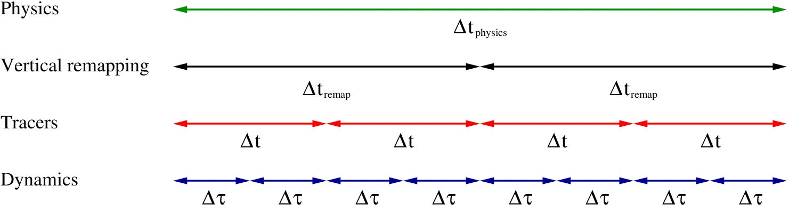
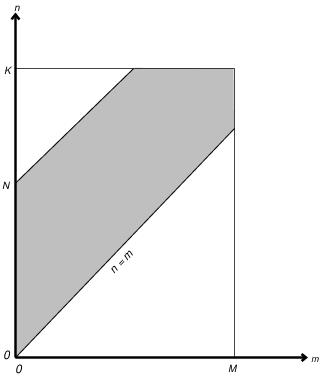

ll\|l
[0.2cm] &&
&
Richard B. Neale & Chih-Chieh Chen
Andrew Gettelman & Peter H. Lauritzen
Sungsu Park & David L. Williamson
&
&
&
Andrew J. Conley & Rolando Garcia
Doug Kinnison & Jean-Francois Lamarque
Dan Marsh & Mike Mills
Anne K. Smith & Simone Tilmes
Francis Vitt &
&
&
&
Hugh Morrison &
&
&
&
Philip Cameron-Smith &&
&
&
William D. Collins &&
&
&
Michael J. Iacono &&
&
&
Richard C. Easter & Steven J. Ghan
Xiaohong Liu & Philip J. Rasch
&
&
Mark A. Taylor &&
&
&

**NCAR TECHNICAL NOTES**

The Technical Note series provides an outlet for a variety of NCAR
manuscripts that contribute in specialized ways to the body of
scientific knowledge but which are not suitable for journal,
monograph, or book publication. Reports in this series are issued by
the NCAR Scientific Divisions; copies may be obtained on request from
the Publications Office of NCAR. Designation symbols for the series
include:

EDD: *Engineering, Design, or Development Reports*
Equipment descriptions, test results, instrumentation,
and operating and maintenance manuals.

IA: *Instructional Aids*
Instruction manuals, bibliographies, film supplements,
and other research or instructional aids.

PPR: *Program Progress Reports*
Field program reports, interim and working reports,
survey reports, and plans for experiments.

PROC: *Proceedings*
Documentation of symposia, colloquia, conferences, workshops,
and lectures. (Distribution may be limited to attendees.)

STR: *Scientific and Technical Reports*
Data compilations, theoretical and numerical
investigations, and experimental results.

*The National Center for Atmospheric Research (NCAR) is operated by the
University Corporation for Atmospheric Research (UCAR) and is sponsored
by the National Science Foundation. Any opinions, findings, conclusions,
or recommendations expressed in this publication are those of the
author(s) and do not necessarily reflect the views of the National
Science Foundation.*

Acknowledgments
===============

The authors wish to acknowledge members of NCAR’s Atmospheric Modeling
and Predictability Section (AMP), Computer Software and Engineering
Group (CSEG), and Computation and Information Systems Laboratory (CISL)
for their contributions to the development of .

The new model would not exist without the significant input from members
of the CESM Atmospheric Model Working Group
(`AMWG <http://www.ccsm.ucar.edu/working_groups/Atmosphere>`__) too
numerous to mention. Leo Donner (GFDL), Minghua Zhang (SUNY) and Phil
Rasch (PNNL) were the co-chairs of the AMWG during the development of .

We would like to acknowledge the substantial contributions to the
 effort from the National Science Foundation, Department of Energy, the
National Oceanic and Atmospheric Administration, and the National
Aeronautics and Space Administration.

Introduction
============

This report presents the details of the governing equations, physical
parameterizations, and numerical algorithms defining the version of the
NCAR Community Atmosphere Model designated . The material provides an
overview of the major model components, and the way in which they
interact as the numerical integration proceeds. Details on the coding
implementation, along with in-depth information on running the code, are
given in a separate technical report entitled ‘ ‘User’s Guide to
Community Atmosphere Model’’ (Eaton 2010). As before, it is our
objective that this model provide NCAR and the university research
community with a reliable, well documented atmospheric general
circulation model. This version of the incorporates a number
enhancements to the physics package (adjustments to the deep convection
algorithm including the addition of Convective Momentum Transports
(CMT), a transition to the finite volume dynamical core as default and
the option to run a computationally highly scaleable dynamical core).
The ability to transition between CAM-standalone and fully coupled
experiment frameworks is much improved in . We believe that collectively
these improvements provide the research community with a significantly
improved atmospheric modeling capability.

Brief History
-------------

CCM0 and CCM1
~~~~~~~~~~~~~

Over the last twenty years, the NCAR Climate and Global Dynamics (CGD)
Division has provided a comprehensive, three-dimensional global
atmospheric model to university and NCAR scientists for use in the
analysis and understanding of global climate. Because of its widespread
use, the model was designated a community tool and given the name
Community Climate Model (CCM). The original versions of the NCAR
Community Climate Model, CCM0A (Washington 1982) and CCM0B (Williamson
1983), were based on the Australian spectral model (Bourke et al. 1977;
McAvaney, Bourke, and Puri 1978) and an adiabatic, inviscid version of
the ECMWF spectral model (Baede, Jarraud, and Cubasch 1979). The CCM0B
implementation was constructed so that its simulated climate would match
the earlier CCM0A model to within natural variability (incorporated the
same set of physical parameterizations and numerical approximations),
but also provided a more flexible infrastructure for conducting medium–
and long–range global forecast studies. The major strength of this
latter effort was that all aspects of the model were described in a
series of technical notes, which included a Users’ Guide (Sato et al.
1983), a subroutine guide which provided a detailed description of the
code (Williamson et al. 1983) a detailed description of the algorithms
(Williamson 1983), and a compilation of the simulated circulation
statistics (Williamson and Williamson 1984). This development activity
firmly established NCAR’s commitment to provide a versatile, modular,
and well–documented atmospheric general circulation model that would be
suitable for climate and forecast studies by NCAR and university
scientists. A more detailed discussion of the early history and
philosophy of the Community Climate Model can be found in Anthes (1986).

The second generation community model, CCM1, was introduced in July of
1987, and included a number of significant changes to the model
formulation which were manifested in changes to the simulated climate.
Principal changes to the model included major modifications to the
parameterization of radiation, a revised vertical finite-differencing
technique for the dynamical core, modifications to vertical and
horizontal diffusion processes, and modifications to the formulation of
surface energy exchange. A number of new modeling capabilities were also
introduced, including a seasonal mode in which the specified surface
conditions vary with time, and an optional interactive surface hydrology
that followed the formulation presented by Manabe (1969). A detailed
series of technical documentation was also made available for this
version (Williamson et al. 1987; Bath et al. 1987; Williamson and
Williamson 1987; Hack et al. 1989) and more completely describe this
version of the CCM.

CCM2
~~~~

The most ambitious set of model improvements occurred with the
introduction of the third generation of the Community Climate Model,
CCM2, which was released in October of 1992. This version was the
product of a major effort to improve the physical representation of a
wide range of key climate processes, including clouds and radiation,
moist convection, the planetary boundary layer, and transport. The
introduction of this model also marked a new philosophy with respect to
implementation. The CCM2 code was entirely restructured so as to satisfy
three major objectives: much greater ease of use, which included
portability across a wide range of computational platforms; conformance
to a plug-compatible physics interface standard; and the incorporation
of single-job multitasking capabilities.

The standard CCM2 model configuration was significantly different from
its predecessor in almost every way, starting with resolution where the
CCM2 employed a horizontal T42 spectral resolution (approximately 2.8 x
2.8 degree transform grid), with 18 vertical levels and a rigid lid at
2.917 mb. Principal algorithmic approaches shared with CCM1 were the use
of a semi-implicit, leap frog time integration scheme; the use of the
spectral transform method for treating the dry dynamics; and the use of
a bi-harmonic horizontal diffusion operator. Major changes to the
dynamical formalism included the use of a terrain-following hybrid
vertical coordinate, and the incorporation of a shape-preserving
semi-Lagrangian transport scheme (D. L. Williamson and Olson 1994a) for
advecting water vapor, as well as an arbitrary number of other scalar
fields (cloud water variables, chemical constituents, etc.). Principal
changes to the physics included the use of a :math:`\delta` -Eddington
approximation to calculate solar absorption (Briegleb 1992); the use of
a Voigt line shape to more accurately treat infrared radiative cooling
in the stratosphere; the inclusion of a diurnal cycle to properly
account for the interactions between the radiative effects of the
diurnal cycle and the surface fluxes of sensible and latent heat; the
incorporation of a finite heat capacity soil/sea ice model; a more
sophisticated cloud fraction parameterization and treatment of cloud
optical properties (Kiehl, Hack, and Briegleb 1994); the incorporation
of a sophisticated non-local treatment of boundary-layer processes
(Holtslag and Boville 1993); the use of a simple mass flux
representation of moist convection (Hack 1994), and the optional
incorporation of the Biosphere-Atmosphere Transfer Scheme (BATS) of
Dickinson et al. (1987). As with previous versions of the model, a
User’s Guide (Bath, Rosinski, and Olson 1992) and model description
(Hack et al. 1993) were provided to completely document the model
formalism and implementation. Control simulation data sets were
documented in Williamson (1993).

CCM3
~~~~

The CCM3 was the fourth generation in the series of NCAR’s Community
Climate Model. Many aspects of the model formulation and implementation
were identical to the CCM2, although there were a number of important
changes that were incorporated into the collection of parameterized
physics, along with some modest changes to the dynamical formalism.
Modifications to the physical representation of specific climate
processes in the CCM3 were motivated by the need to address the more
serious systematic errors apparent in CCM2 simulations, as well as to
make the atmospheric model more suitable for coupling to land, ocean,
and sea-ice component models. Thus, an important aspect of the changes
to the model atmosphere was that they address well known systematic
biases in the top-of-atmosphere and surface (to the extent that they
were known) energy budgets. When compared to the CCM2, changes to the
model formulation fell into five major categories: modifications to the
representation of radiative transfer through both clear and cloudy
atmospheric columns, modifications to hydrological processes (i.e., in
the form of changes to the atmospheric boundary layer, moist convection,
and surface energy exchange), the incorporation of a sophisticated land
surface model, the incorporation of an optional slab mixed-layer
ocean/thermodynamic sea-ice component, and a collection of other changes
to the formalism which did not introduce significant changes to the
model climate.

Changes to the clear-sky radiation formalism included the incorporation
of minor CO\ :math:`_2` bands trace gases (:math:`CH_4`, :math:`N{_2}O`,
:math:`CFC11`, :math:`CFC12`) in the longwave parameterization, and the
incorporation of a background aerosol (0.14 optical depth) in the
shortwave parameterization. All-sky changes included improvements to the
way in which cloud optical properties (effective radius and liquid water
path) were diagnosed, the incorporation of the radiative properties of
ice clouds, and a number of minor modifications to the diagnosis of
convective and layered cloud amount. Collectively these modification
substantially reduced systematic biases in the global annually averaged
clear-sky and all-sky outgoing longwave radiation and absorbed solar
radiation to well within observational uncertainty, while maintaining
very good agreement with global observational estimates of cloud
forcing. Additionally, the large warm bias in simulated July surface
temperature over the Northern Hemisphere, the systematic over-prediction
of precipitation over warm land areas, and a large component of the
stationary-wave error in CCM2, were also reduced as a result of
cloud-radiation improvements.

Modifications to hydrological processes included revisions to the major
contributing parameterizations. The formulation of the atmospheric
boundary layer parameterization was revised (in collaboration with Dr.
A. A. M. Holtslag of KNMI), resulting in significantly improved
estimates of boundary layer height, and a substantial reduction in the
overall magnitude of the hydrological cycle. Parameterized convection
was also modified where this process was represented using the deep
moist convection formalism of Zhang and McFarlane (1995) in conjunction
with the scheme developed by Hack (1994) for CCM2. This change resulted
in an additional reduction in the magnitude of the hydrological cycle
and a smoother distribution of tropical precipitation. Surface roughness
over oceans was also diagnosed as a function of surface wind speed and
stability, resulting in more realistic surface flux estimates for low
wind speed conditions. The combination of these changes to hydrological
components resulted in a 13% reduction in the annually averaged global
latent heat flux and the associated precipitation rate. It should be
pointed out that the improvements in the radiative and hydrological
cycle characteristics of the model climate were achieved without
compromising the quality of the simulated equilibrium thermodynamic
structures (one of the major strengths of the CCM2) thanks in part to
the incorporation of a Sundqvist (1988) style evaporation of stratiform
precipitation.

The CCM3 incorporated version 1 of the Land Surface Model (LSM)
developed by Bonan (1996) which provided for the comprehensive treatment
of land surface processes. This was a one-dimensional model of energy,
momentum, water, and CO\ :math:`_2` exchange between the atmosphere and
land, accounting for ecological differences among vegetation types,
hydraulic and thermal differences among soil types, and allowing for
multiple surface types including lakes and wetlands within a grid cell.
LSM replaced the prescribed surface wetness, prescribed snow cover, and
prescribed surface albedos in CCM2. It also replaced the land surface
fluxes in CCM2, using instead flux parameterizations that included
hydrological and ecological processes (soil water, phenology, stomatal
physiology, interception of water by plants).

The fourth class of changes to the CCM2 included the option to run CCM3
with a simple slab ocean-thermodynamic sea ice model. The model employs
a spatially and temporally prescribed ocean heat flux and mixed layer
depth, which ensures replication of realistic sea surface temperatures
and ice distributions for the present climate. The model allowed for the
simplest interactive surface for the ocean and sea ice components of the
climate system.

The final class of model modifications included a change to the form of
the hydrostatic matrix which ensures consistency between :math:`\omega`
and the discrete continuity equation, and a more generalized form of the
gravity wave drag parameterization. In the latter case, the
parameterization was configured to behave in the same way as the CCM2
parameterization of wave drag, but included the capability to exploit
more sophisticated descriptions of this process.

One of the more significant implementation differences with the earlier
model was that CCM3 included an optional message-passing configuration,
allowing the model to be executed as a parallel task in
distributed-memory environments. This was an example of how the Climate
and Global Dynamics Division continued to invest in technical
improvements to the CCM in the interest of making it easier to acquire
and use in evolving computational environments. As was the case for
CCM2, the code was internally documented, obviating the need for a
separate technical note that describes each subroutine and common block
in the model library. Thus, the Users’ Guide, the land surface technical
note, the CCM3 technical note (Kiehl et al. 1996), the actual code and a
series of reviewed scientific publications (including a special issue of
the Journal of Climate, Volume 11, Number 6) were designed to completely
document CCM3.

CAM3
~~~~

The CAM3 was the fifth generation of the NCAR atmospheric GCM. The name
of the model series was changed from Community Climate Model to
Community Atmosphere Model to reflect the role of CAM3 in the fully
coupled climate system. In contrast to previous generations of the
atmospheric model, CAM3 had been designed through a collaborative
process with users and developers in the Atmospheric Model Working Group
(AMWG). The AMWG includes scientists from NCAR, the university
community, and government laboratories. For CAM3, the consensus of the
AMWG was to retain the spectral Eulerian dynamical core for the first
official release although the code includes the option to run with
semi-Lagrange dynamics or with finite-volume dynamics (FV). The addition
of FV was a major extension to the model provided through a
collaboration between NCAR and NASA Goddard’s Data Assimilation Office
(DAO). The major changes in the physics included treatment of cloud
condensed water using a prognostic formulation with a bulk microphysical
component following Rasch and Kristjánsson (1998) and a macroscale
component following Zhang et al. (2003). The Zhang and McFarlane (1995)
parameterization for deep convection was retained from CCM3.

A new treatment of geometrical cloud overlap in the radiation
calculations computed the shortwave and longwave fluxes and heating
rates for random overlap, maximum overlap, or an arbitrary combination
of maximum and random overlap. The calculation was completely separated
from the radiative parameterizations. The introduction of the
generalized overlap assumptions permitted more realistic treatments of
cloud-radiative interactions. The methodology was designed and validated
against calculations based upon the independent column approximation
(ICA). A new parameterization for the longwave absorptivity and
emissivity of water vapor preserved the formulation of the radiative
transfer equations using the absorptivity/emissivity method. The
components of the method related to water vapor were replaced with new
terms calculated with the General Line-by-line Atmospheric Transmittance
and Radiance Model (GENLN3). The mean absolute errors in the surface and
top-of-atmosphere clear-sky longwave fluxes for standard atmospheres
were reduced to less than 1 W/m\ :math:`{}^2`. The near-infrared
absorption by water vapor was also updated to a parameterization based
upon the HITRAN2k line database (Rothman et al. 2003) that incorporated
the CKD 2.4 prescription for the continuum. The magnitude of errors in
flux divergences and heating rates relative to modern LBL calculations
were reduced by approximately seven times compared to the previous CCM3
parameterization. The uniform background aerosol was replaced with a
present-day climatology of sulfate, sea-salt, carbonaceous, and
soil-dust aerosols. The climatology was obtained from a chemical
transport model forced with meteorological analysis and constrained by
assimilation of satellite aerosol retrievals. These aerosols affect the
shortwave energy budget of the atmosphere. CAM3 also included a
mechanism for treating the shortwave and longwave effects of volcanic
aerosols. Evaporation of convective precipitation following Sundqvist
(1988) was implemented and enhancement of atmospheric moisture through
this mechanism was offset by drying introduced by changes in the
longwave absorptivity and emissivity. A careful formulation of vertical
diffusion of dry static energy was also implemented.

Additional capabilities included a new thermodynamic package for sea ice
in order to mimic the major non-dynamical aspects of CSIM; including
snow depth, brine pockets, internal shortwave radiative transfer,
surface albedo, ice-atmosphere drag, and surface exchange fluxes. CAM3
also allowed for an explicit representation of fractional land and
sea-ice coverage that gave a much more accurate representation of flux
exchanges from coastal boundaries, island regions, and ice edges. This
fractional specification provided a mechanism to account for flux
differences due to sub-grid inhomogeneity of surface types. A new,
extensible climatological and time-mean sea-surface temperature boundary
data was made available from a blended product using the global HadISST
OI dataset prior to 1981 and the Smith/Reynolds EOF dataset post-1981.
Coupling was upgraded in order to couple the dynamical core with the
parameterization suite in a purely time split or process split manner.
The distinction is that in the process split approximation the physics
and dynamics are both calculated from the same past state, while in the
time split approximations the dynamics and physics are calculated
sequentially, each based on the state produced by the other.

CAM4
~~~~

The CAM4 was the sixth generation of the NCAR atmospheric GCM and had
again been developed through a collaborative process of users and
developers in the Atmosphere Model Working Group (AMWG) with signficant
input from the Chemistry Climate Working Group (Chem-Clim WG) and the
Whole Atmosphere Model Working Group (WAMWG). The model had science
enhancements from CAM3 and represented an intermediate release version
as part of a staged and parallel process in atmospheric model
development. In the CAM4 changes to the moist physical representations
centered on enhancements to the existing Zhang and McFarlane (1995) deep
convection parameterization. The calculation of Convective Available
Potential Energy (CAPE) assumed an entraining plume to provide the
in-cloud temperature and humidity profiles used to determine bouyancy
and related cloud closure properties (chapter [ssec:deep-convection]).
The modification is based on the conservation of moist entropy and
mixing methods of Raymond and Blyth (1986; Raymond and Blyth 1992). It
replaced the standard undilute non-entraining plume method used in CAM3
and was employed to increase convection sensitivity to tropospheric
moisture and reduce the amplitude of the diurnal cycle of precipitation
over land. Sub-grid scale Convective Momentum Transports (CMT) were
added to the deep convection scheme following Richter and Rasch (2008)
and the methodology of Gregory, Kershaw, and Inness (1997)
(chapter [ssec:Convection-CMT]). CMT affects tropospheric climate mainly
through changes to the Coriolis torque. These changes resulted in
improvement of the Hadley circulation during northern Winter and it
reduced many of the model biases. In an annual mean, the tropical
easterly bias, subtropical westerly bias, and the excessive southern
hemisphere mid-latitude jet were improved.

In combination these modifications to the deep-convection lead to
significant improvements in the phase, amplitude and spacial anomaly
patterns of the modeled El Niño, as documented in Neale, Richter, and
Jochum (2008). The calculation of cloud fraction in polar climates was
also modified for the CAM4.0. Due to the combination of a diagnostic
cloud fraction and prognostic cloud water represntation it was possible
to model unphysical extensive cloud decks with near zero in-cloud water
in the CAM3. This was particularly pervasize in polar climates in
Winter. These calculation inconsitencies and large cloud fractions are
significantly reduced with modifications to the calculation of
stratiform cloud following Vavrus and Waliser (2008). In the lower
troposphere a ’freeze-drying’ process is perfomed whereby cloud
fractions were systematically reduced for very low water vaopr amounts.
The low cloud reduction caused an Arctic-wide drop of 15 W
m\ :math:`^{-2}` in surface cloud radiative forcing (CRF) during winter
and about a 50% decrease in mean annual Arctic CRF. Consequently,
wintertime surface temperatures fell by up to 4 K on land and 2 K over
the Arctic Ocean, thus significantly reducing the CAM3 pronounced warm
bias. More generally the radiation calculation was performed using
inconsistent cloud fraction and condensate quantities in the CAM3. In
CAM4 this was remedied with an updated cloud fraction calculation prior
to the radiation call at each physics timestep. The coupled climate
performance with the CAM4.0 physics changes was summarized in the
horizontal resolution comparison study of Gent et al. (2009).

For the dynamical core component of CAM4 the finite volume (FV) scheme
was made the default due to its superior transport properties (Lin and
Rood 1996). Modifications were made that upgraded the code version to a
more recent NASA Goddard supported version. Other changes provided new
horizontal grid discretizations (e.g., 1.9x2.5 deg and 0.9x1.25 deg) for
optimal computational processor decompostion and polar filtering changes
for noise reductions and more continuous (in latitude) filtering. In
addition to the existing finite volume and spectral-based dynamical core
a new option was also made available that represents the first scheme
released with CAM that removes the computational scalability
restrictions associated with a pole convergent latitude-longitude grid
and the associated polar filtering requirements.

Funded in part by the Department of Energy (DOE) Climate Change
Prediction Program the scalable and efficient spectral-element-based
atmospheric dynamical core uses the High Order Method Modeling
Environment (HOMME) on a cubed sphere grid and was developed by members
of the Computational Science Section and the Computational Numerics
Group of NCAR’s Computational and Information Systems Laboratory (CISL).
The finite element dynamical core (commonly referred to as the HOMME
core) is fully integrated into CCSM coupling architecture and is
invaluable for high resolution climate integrations on existing and
upcoming massively parallel computing platforms.

Model flexibility was increased significantly from the CAM3, both within
CAM and the CCSM system as a whole. The method for running thermodynamic
sea-ice in CAM-only mode was moved to be maintained entirely within the
CICE model of the CCSM4. The single-column version of CAM was given the
flexibility to be built and run using the same infrastructure as the CAM
build and run mechanism. The SCAM GUI run method was no longer
supported. The increased coupling flexibility also allowed the
introduction of a more consistant method for performing slab-ocean model
(SOM) experiments. SOM experiments were, by default, now performed using
forcing data from an existing CCSM coupled run. This had the advantage
of having a closed temperature budget for both the ice and the ocean
mixed layer from a coupled run. The methodology was therefore configured
to reproduce the fully coupled CCSM climate as opposed to a reproduction
of a psuedo-observed climate available with the CAM3-specific SOM
method. The CAM3-specific SOM method was no longer made available. For
more information regarding updated run methods see the CAM4.0 users
guide of Eaton (2010).

Overview of 
~~~~~~~~~~~~

*The Community Atmosphere Model*
^^^^^^^^^^^^^^^^^^^^^^^^^^^^^^^^

CAM has been modified substantially with a range of enhancements and
improvements in the representation of physical processes since version 4
(CAM4). In particular, the combination of physical parameterization
enhancements makes it possible to simulate full aerosol cloud
interactions including cloud droplet activation by aerosols,
precipitation processes due to particle size dependant behavior and
explicit radiative interaction of cloud particles. As such the
represents the first version of CAM that is able to simulate the
cloud-aerosol indirect radiative effects. More generally forms the main
atmopshere component of the COmmunity Earth System Model, version 1
(CESM1). The entensive list of physical parameterization improvements
are described below:

A new moist turbulence scheme (Section [sec:pbl:sub:`u`\ w]) is included
that explicitly simulates stratus-radiation-turbulence interactions,
making it possible to simulate full aerosol indirect effects within
stratus. It is based on a diagnostic Turbulent Kinetic Energy (TKE)
forumlation and uses a :math:`1^{st}` order K-diffusion scheme with
entrainment (**???**) originally developed at the University of
Washington.. The scheme operates in any layer of the atmopshere when the
moist :math:`Ri` ( Richardson number ) is larger than its critical
value.

A new shallow convection scheme (Section [sec:shallow-convection]) uses
a realistic plume dilution equation and closure that accurately
simulates the spatial distribution of shallow convective activity (Park
and Bretherton 2009). A steady state convective updraft plume and small
fractional area are assumed. An explicit computation of the convective
updraft vertcial velocity and updraft fraction is performed using an
updraft vertical momentum equation, and thus provides a representation
of convective momentum transports. The scheme is specifically designed
to interact with the new moist turbulence scheme in order to prevent
double counting seen in previous CAM parameterizations. The deep
convection parameterization is retained from CAM4.0 (Section
[ssec:deep-convection]).

Stratiform microphysical processes (Section [sec:microphysics]) are
represented by a prognostic, two-moment formulation for cloud droplet
and cloud ice with mass and number concentrations following the original
parameterization of Morrison and Gettelman (2008). The implimentation in
(Gettelman, Morrison, and Ghan 2008) determines liquid and ice particle
sizes from gamma functions and their evolution in time is subject to
grid-scale advection, convective detrainment, turbulent diffusion and
several microphysical processes. Activation of cloud droplets occurs on
an aerosol size distribution based on aerosol chemistry, temperature and
vertical velocity. A sub-grid scale vertical velocity is provided
through a turbulent kinetic energy approximation. A number of mechanisms
are calcuated for ice crystal nucleation (Liu et al. 2007) and combined
with modifications to allow ice supersaturation (Gettelman and others
2010).

The revised cloud macrophysics scheme (Section
[sec:macrophysics],(**???**)) provides a more transparent treatment of
cloud processes and imposes full consistency between cloud fraction and
cloud condensate. Separate calculations are performed for liquid and ice
stratiform cloud fractions which are assumed to be maximally overlapped.
Liquid cloud fraction is based on an assumed triangular distribution of
total relative humidity. Ice cloud fraction is based on (**???**) and
allows supersaturation via a modified relative humidity over ice and the
inclusion of ice condensate amount.

A new 3-mode modal aerosol scheme (MAM3, Section [sec:aerosols], Liu and
Ghan (2010)) provides internally mixed representations of number
concentrations and mass for Aitkin, accumulation and course aerosol
modes which are merged characterizations of the more complex 7-mode
version of the scheme. Anthropogenic emissions, defined as originating
from industrial, domestic and agriculture activity sectors, are provided
from the (**???**) IPCC AR5 emission data set. Emissions of black carbon
and organic carbon represent an update of (**???**) and (**???**).
Emissions of sulfur dioxide are an update of Smith, Pitcher, and Wigley
(2001; **???**). Injection heights, and size distribution of emissions
data are not provided with the raw datasets so the protocols of
(**???**) are followed for . AEROCOM emission datastes are used for
natural aeroso0l sources. All emission datasets required to run MAM for
pre-industrial or 20th century scenarios are available for download. A
full inventory of observationally based aerosol emission mass and size
is provided in standard available datasets. The 7-mode version of the
scheme is also available.

Calculations and specifications for the condensed phase optics
(aerosols, liquid cloud droplets, hydrometeors and ice crystals) are
taken from the microphysics and aerosol parmeterization quantities and
provided as input to the radiation scheme (Section
[sec:condensed:sub:`o`\ ptics]). The radiation scheme (Section
[sec:radiation]) has been updated to the Rapid Radiative Transfer Method
for GCMs (RRTMG, Iacono et al. (2008; Mlawer et al. 1997)). It employs
an efficient and accurate modified correlated-k method for calculating
radiative fluxes and heating rates in the clear sky and for the
condensed phase species. For each short-wave band calculation extinction
optical depth, single scattering albedo and asymmetry properties are
specified. For each long-wave band mass-specific absorption is
specified. The aerosol optical properties are defined for each mode of
the MAM as described by (Ghan and Zaveri 2007). Hygroscopicity
characteristics are specified for soluable species. For volcanic
aerosols a geometric mean radius is used. Optical properties of aerosols
are combined prior to the radiative calculation. Liquid-cloud optics are
calculated following Wiscombe (1996) and ice-cloud optics are calculated
following Mitchell (2002). Ice-cloud size optics are extended to allow
for radiatively active falling snow. Optical properties of clouds
(including separate fractions and in-cloud water contents) are combined
prior to the radiative calculation. RRTM separates the short-wave
spectrum into 14 bands extending from 0.2 :math:`\mu`\ m to 12.2
:math:`\mu`\ m, and models sources of extinction for H\ :math:`_2`\ O,
O\ :math:`_3`, CO\ :math:`_2`, O\ :math:`_2`, CH\ :math:`_4`,
N\ :math:`_2` and Rayleigh scattering. Solar irradiance is now specified
for the short-wave bands from the Lean dataset (Wang, Lean, and Sheeley
2005). The long-wave spectrum is separated into 16 bands extending from
3.1 :math:`\mu`\ m to 1000 :math:`\mu`\ m with molecular sources of
absorption for the same species, in addition to CFC-11 (containing
multiple CFC species) and CFC-12. RRTMG has extensive modifications from
the original RRTM in order to provide significant speed-up for long
climate integrations. Chief amongt these is the Monte-Carlo Independent
Column Approximation (McICA, Pincus and Morcrette (2003)) that represnts
sub-grid scale cloud variability. With these modifications RRTMG still
retains superior offline agreement with line-by-line calculations when
compared to the previous CAM radiation package (CAM-RT).

*The CAM Chemistry Model (CAM-CHEM)*
^^^^^^^^^^^^^^^^^^^^^^^^^^^^^^^^^^^^

Chemistry in CAM is now fully interactive and implemented in CESM
(Section [sec:chem:sub:`c`\ am]); in particular, emissions of biogenic
compounds and deposition of aerosols to snow, ice, ocean and vegetation
are handled through the coupler. The released version of CAM-chem in
CESM is using the recently-developed superfast chemistry (Section
[sec:chem:sub:`s`\ uperfast]), in collaboration with P. Cameron-Smith
from LLNL and M. Prather from UCI) to perform centennial scale
simulations at a minor cost increase over the base CAM4. These
simulations use the recently developed 1850-2005 emissions created in
support of CMIP5.

*The Whole Atmosphere Community Climate Model (WACCM)*
^^^^^^^^^^^^^^^^^^^^^^^^^^^^^^^^^^^^^^^^^^^^^^^^^^^^^^

WACCM4 (Section [sec:waccm]), incorporates several improvements and
enhancements over the previous version (3.1.9). It can be run coupled to
the POP2 and CICE CESM model components. The model’s chemistry module
(Section [sec:chem:sub:`c`\ am]) has been updated according to the
latest JPL-2006 recommendations; a quasi-biennial oscillation may be
imposed (as an option) by relaxing the winds to observations in the
Tropics; heating from stratospheric volcanic aerosols is now computed
explicitly; the effects of solar proton events are now included; the
effect of unresolved orography is parameterized as a surface stress
(turbulent mountain stress) leading to an improvement in the frequency
of sudden stratospheric warmings; and gravity waves due to convective
and frontal sources are parameterized based upon the occurrence of
convection and the diagnosis of regions of frontogenesis in the model.

Coupling of Dynamical Core and Parameterization Suite
=====================================================

The cleanly separates the parameterization suite from the dynamical
core, and makes it easier to replace or modify each in isolation. The
dynamical core can be coupled to the parameterization suite in a purely
time split manner or in a purely process split one, as described below.

Consider the general prediction equation for a generic variable
:math:`\psi`,

.. math::
   :label: 1

   \frac {\partial \psi} {\partial t} = D\left(\psi\right)  + P\left(\psi\right) \;,
   

where :math:`\psi` denotes a prognostic variable such as temperature or
horizontal wind component. The dynamical core component is denoted
:math:`D` and the physical parameterization suite :math:`P`.

A three-time-level notation is employed which is appropriate for the
semi-implicit Eulerian spectral transform dynamical core. However, the
numerical characteristics of the physical parameterizations are more
like those of diffusive processes rather than advective ones. They are
therefore approximated with forward or backward differences, rather than
centered three-time-level forms.

The *Process Split* coupling is approximated by

.. math::
   :label: 3

   \psi^{n+1} = \psi^{n-1} + 2\Delta t D(\psi^{n+1},\psi^{n},\psi^{n-1})
                           + 2\Delta t P(\psi^*,\psi^{n-1}) \;,
   

where :math:`P(\psi^*,\psi^{n-1})` is calculated first from

.. math::
   :label: 4

   \psi^* = \psi^{n-1} + 2\Delta t P(\psi^*,\psi^{n-1}) \;.
   

The *Time Split* coupling is approximated by

.. math::
   :label: 5

   \psi^* = \psi^{n-1} + 2\Delta t D(\psi^*,\psi^{n},\psi^{n-1}) \;, 
   
.. math::
   :label: 6

   \psi^{n+1} = \psi^* + 2\Delta t P(\psi^{n+1},\psi^*) \;.

The distinction is that in the *Process Split* approximation the
calculations of :math:`D` and :math:`P` are both based on the same past
state, :math:`\psi^{n-1}`, while in the *Time Split* approximations
:math:`D` and :math:`P` are calculated sequentially, each based on the
state produced by the other.

As mentioned above, the Eulerian core employs the three-time-level
notation in (:eq:`3`)-(:eq:`6`). Eqns. (:eq:`3`)-(:eq:`6`) also apply to two-time-level
finite volume, semi-Lagrangian and spectral element (HOMME) cores by
dropping centered :math:`n` term dependencies, and replacing :math:`n`-1
by :math:`n` and :math:`2 \Delta t` by :math:`\Delta t`.

The parameterization package can be applied to produce an updated field
as indicated in (:eq:`4`) and (:eq:`6`). Thus (:eq:`6`) can be written with an
operator notation

.. math::
   :label: 7

   \psi^{n+1} = {\boldsymbol{P}}\left(\psi^*\right) \;,
   

where only the past state is included in the operator dependency for
notational convenience. The implicit predicted state dependency is
understood. The *Process Split* equation (:eq:`3`) can also be written in
operator notation as

.. math::
   :label: 8

   \psi^{n+1} = {\boldsymbol{D}}\left(\psi^{n-1},
         \frac {{\boldsymbol{P}}(\psi^{n-1})-\psi^{n-1}} {2 \Delta t} \right) \;,
   

where the first argument of :math:`{\boldsymbol{D}}` denotes the
prognostic variable input to the dynamical core and the second denotes
the forcing rate from the parameterization package, e.g. the heating
rate in the thermodynamic equation. Again only the past state is
included in the operator dependency, with the implicit predicted state
dependency left understood. With this notation the *Time Split* system
(:eq:`5`) and (:eq:`6`) can be written

.. math::
   :label: 9

   \psi^{n+1} = {\boldsymbol{P}}\left({\boldsymbol{D}}\left(\psi^{n-1},0\right)\right) \;.
   

The total parameterization package in consists of a sequence of
components, indicated by

.. math::
   :label: 10

   P = \{ M,R,S,T \} \;,
   

where :math:`M` denotes (Moist) precipitation processes, :math:`R`
denotes clouds and Radiation, :math:`S` denotes the Surface model, and
:math:`T` denotes Turbulent mixing. Each of these in turn is subdivided
into various components: :math:`M` includes an optional dry adiabatic
adjustment (normally applied only in the stratosphere), moist
penetrative convection, shallow convection, and large-scale stable
condensation; :math:`R` first calculates the cloud parameterization
followed by the radiation parameterization; :math:`S` provides the
surface fluxes obtained from land, ocean and sea ice models, or
calculates them based on specified surface conditions such as sea
surface temperatures and sea ice distribution. These surface fluxes
provide lower flux boundary conditions for the turbulent mixing
:math:`T` which is comprised of the planetary boundary layer
parameterization, vertical diffusion, and gravity wave drag.

Defining operators following (:eq:`7`) for each of the parameterization
components, the couplings in are summarized as:

TIME SPLIT

.. math::
   :label: 11

   \begin{aligned}
   \psi^{n+1} &= {\boldsymbol{T}}\left({\boldsymbol{S}}\left({\boldsymbol{R}}\left({\boldsymbol{M}}\left(
                          {\boldsymbol{D}}\left(\psi^{n-1},0\right)\right)\right)\right)\right)
    \\
   \intertext{PROCESS SPLIT} \psi^{n+1} &=
   {\boldsymbol{D}}\left(\psi^{n-1},\frac {
   {\boldsymbol{T}}\left({\boldsymbol{S}}\left({\boldsymbol{R}}\left(
   {\boldsymbol{M}}\left(\psi^{n-1}\right)\right)\right)\right) - \psi^{n-1}}
   {2\Delta t}\right)
   \end{aligned}

The labels *Time Split* and *Process Split* refer to the coupling of the
dynamical core with the complete parameterization suite. The components
within the parameterization suite are coupled via time splitting in both
forms.

The *Process Split* form is convenient for spectral transform models.
With *Time Split* approximations extra spectral transforms are required
to convert the updated momentum variables provided by the
parameterizations to vorticity and divergence for the Eulerian spectral
core, or to recalculate the temperature gradient for the semi-Lagrangian
spectral core. The *Time Split* form is convenient for the finite-volume
core which adopts a Lagrangian vertical coordinate. Since the scheme is
explicit and restricted to small time-steps by its non-advective
component, it sub-steps the dynamics multiple times during a longer
parameterization time step. With *Process Split* approximations the
forcing terms must be interpolated to an evolving Lagrangian vertical
coordinate every sub-step of the dynamical core. Besides the expense
involved, it is not completely obvious how to interpolate the
parameterized forcing, which can have a vertical grid scale component
arising from vertical grid scale clouds, to a different vertical grid.
(Williamson 2002) compares simulations with the Eulerian spectral
transform dynamical core coupled to the CCM3 parameterization suite via
*Process Split* and *Time Split* approximations.

Dynamics
========

Finite Volume Dynamical Core
----------------------------

Overview
~~~~~~~~

This document describes the Finite-Volume (FV) dynamical core that was
initially developed and used at the NASA Data Assimilation Office (DAO)
for data assimilation, numerical weather predictions, and climate
simulations. The finite-volume discretization is local and entirely in
physical space. The horizontal discretization is based on a conservative
“*flux-form semi-Lagrangian*” scheme described by Lin and Rood (1996)
(hereafter LR96) and Lin and Rood (1997) (hereafter LR97). The vertical
discretization can be best described as *Lagrangian* with a conservative
re-mapping, which essentially makes it *quasi-Lagrangian*. The
*quasi-Lagrangian* aspect of the vertical coordinate is transparent to
model users or physical parameterization developers, and it functions
exactly like the :math:`\eta -coordinate` (a hybrid :math:`\sigma -p` coordinate) used by other dynamical cores within CAM.

In the current implementation for use in CAM, the FV dynamics and
physics are “time split” in the sense that all prognostic variables are
updated sequentially by the “dynamics” and then the “physics”. The time
integration within the FV dynamics is fully explicit, with sub-cycling
within the 2D Lagrangian dynamics to stabilize the fastest wave (see
section [FVvdisc]). The transport for tracers, however, can take a much
larger time step (*e.g.*, 30 minutes as for the physics).

The governing equations for the hydrostatic atmosphere
~~~~~~~~~~~~~~~~~~~~~~~~~~~~~~~~~~~~~~~~~~~~~~~~~~~~~~

For reference purposes, we present the continuous differential equations
for the hydrostatic 3D atmospheric flow on the sphere for a general
vertical coordinate :math:`\zeta` (*e.g*., Kasahara (1974)). Using
standard notations, the hydrostatic balance equation is given as
follows:

.. math::
   :label: hydro
   
   \frac{1}{\rho }\frac{\partial p}{\partial z}+g=0 ,

where :math:`\rho` is the density of the air, *p* the pressure, and
*g* the gravitational constant. Introducing the “*pseudo-density*”
:math:`\pi =\frac{\partial p}{\partial \zeta }` (*i.e.*, the vertical pressure gradient in the general coordinate),
from the hydrostatic balance equation the *pseudo-density* and the true
density are related as follows:

.. math::
   :label: (hodrostatic-pi
   
   \pi =-\frac{\partial \Phi }{\partial \zeta }\rho ,

where :math:`\Phi =gz` is the geopotential. Note that :math:`\pi`
reduces to the “true density” if :math:`\zeta =-gz`, and the “surface
pressure” :math:`P_{s}` if :math:`\zeta =\sigma` (:math:`\sigma =\frac{p}{P_{s}}`). 
The conservation of total air mass using :math:`\pi` as the prognostic variable can be written as

.. math::
   :label: mass-pi
   
   \frac{\partial }{\partial t}\pi +\nabla \cdot
   \left(\overrightarrow{V}\pi \right) =0 ,

where :math:`\overrightarrow{V}=(u,v,\frac{d\zeta }{dt})`. Similarly,
the mass conservation law for tracer species (or water vapor) can be
written as

.. math::
   :label: tracer-pi
   
   \frac{\partial }{\partial t}(\pi q)+\nabla \cdot
   \left(\overrightarrow{V}\pi q\right) =0 ,

where *q* is the mass mixing ratio (or specific humidity) of the tracers
(or water vapor).

Choosing the (virtual) potential temperature :math:`\Theta` as the
thermodynamic variable, the first law of thermodynamics is written as

.. math::
   :label: thermo-pi
   
   \frac{\partial }{\partial t}(\pi \Theta )+\nabla \cdot \left(
   \overrightarrow{V}\pi \Theta \right) =0 .

Letting :math:`(\lambda ,\theta )` denote the (longitude, latitude)
coordinate, the momentum equations can be written in the
“vector-invariant form” as follows:

.. math::
   :label: u-pi

   
   \frac{\partial }{\partial t}u=\Omega v-\frac{1}{Acos\theta }\left[
     \frac{\partial }{\partial \lambda }\left( \kappa +\Phi -\nu D\right)
     +\frac{1}{\rho }\frac{\partial }{\partial \lambda }p\right]
   -\frac{d\zeta }{dt}\frac{\partial u}{\partial \zeta } ,

.. math::
   :label: v-pi
   
   \frac{\partial }{\partial t}v=-\Omega u-\frac{1}{A}\left[
     \frac{\partial }{\partial \theta }\left( \kappa +\Phi -\nu D\right)
     +\frac{1}{\rho }\frac{\partial }{\partial \theta }p\right]
   -\frac{d\zeta }{dt}\frac{\partial v}{\partial \zeta } ,

where *A* is the radius of the earth, :math:`\nu` is the coefficient
for the optional divergence damping, *D* is the horizontal divergence

.. math::

   D=\frac{1}{Acos\theta }\left[ \frac{\partial
   }{\partial \lambda }(u)+\frac{\partial }{\partial \theta }(v\,
   cos\theta )\right] ,

.. math:: \kappa =\frac{1}{2}\left( u^{2}+v^{2}\right) ,

and :math:`\Omega`, the vertical component of the absolute vorticity,
is defined as follows:

.. math::

   \Omega =2\omega \, sin\theta +\frac{1}{A\, cos\theta }\left[
   \frac{\partial }{\partial \lambda }v-\frac{\partial }{\partial \theta
   }(u\, cos\theta )\right] ,

where *:math:`\omega`* is the angular velocity of the earth. Note that
the last term in (:eq:`u-pi`) and (:eq:`v-pi`) vanishes if the vertical
coordinate :math:`\zeta` is a conservative quantity (*e.g*., entropy
under adiabatic conditions (Hsu and Arakawa 1990) or an imaginary
conservative tracer), and the 3D divergence operator becomes 2D along
constant :math:`\zeta` surfaces. The discretization of the 2D
horizontal transport process is described in section [FVhdisc]. The
complete dynamical system using the Lagrangian control-volume vertical
discretization is described in section [FVvdisc] and section [sec:damp]
describes the explicit diffusion operators available in CAM5. A mass,
momentum, and total energy conservative mapping algorithm is described
in section [FVmap] and in section [sec:geo] an alternative geopotential
conserving vertical remapping method is described. Sections
[FVqconserve] and [sec:neg] are on the adjusctment of pressure to
include the change in mass of water vapor and on the negative tracer
fixer in CAM, respectively. Last the global energy fixer is described
(section [sec:Global-Energy-Fixer]).

Horizontal discretization of the transport process on the sphere
~~~~~~~~~~~~~~~~~~~~~~~~~~~~~~~~~~~~~~~~~~~~~~~~~~~~~~~~~~~~~~~~

Since the vertical transport term would vanish after the introduction of
the vertical Lagrangian control-volume discretization (see section
[FVvdisc]), we shall present here only the 2D (horizontal) forms of the
FFSL transport algorithm for the transport of density (:eq:`mass-pi`) and
mixing ratio-like quantities (:eq:`tracer-pi`) on the sphere. The governing
equation for the pseudo-density (:eq:`mass-pi`) becomes

.. math::
   :label: pi-2d
   
   \frac{\partial }{\partial t}\pi +\frac{1}{Acos\theta }\left[
   \frac{\partial }{\partial \lambda }(u\pi )+\frac{\partial }{\partial
   \theta }(v\pi \, cos\theta )\right] =0 .

The finite-volume (*integral*) representation of the continuous
:math:`\pi` field is defined as follows:

Given the *exact* 2D wind field :math:`
\overrightarrow{V}(t;\lambda ,\theta )=(U,V)` the 2D integral
representation of the conservation law for :math:`\widetilde{\pi }`
can be obtained by integrating (:eq:`pi-2d`) in time and in space

The above 2D transport equation is still *exact* *for the finite-volume
under consideration*. To carry out the contour integral, certain
approximations must be made. LR96 essentially decomposed the flux
integral using two orthogonal 1D flux-form transport operators.
Introducing the following difference operator

.. math:: \delta _{x}q=q(x+\frac{\Delta x}{2})-q(x-\frac{\Delta x}{2}),

and assuming :math:`(u^{*},v^{*})` is the time-averaged (from time
:math:`t
` to time :math:`t+\Delta t`) :math:`\overrightarrow{V}` on the
C-grid (*e.g*., Fig. 1 in LR96), the 1-D finite-volume flux-form
transport operator *F* in the :math:`\lambda`-direction is

.. math::
   :label: xtp
   
   F(u^{*},\Delta t,\widetilde{\pi })=-\frac{1}{A\Delta \lambda cos\theta
   }\, \delta _{\lambda }\left[ \int _{t}^{t+\Delta t}\pi U\, dt\right]
   =-\frac{\Delta t}{A\Delta \lambda cos\theta }\, \delta _{\lambda
   }\left[ \chi (u^{*},\Delta t;\pi )\right] ,

where :math:`\chi` , the time-accumulated (from *t* to
*t*\ +\ *:math:`\Delta`\ t*) mass flux across the cell wall, is
defined as follows,

.. math::
   :label: xmass
   
   \chi (u^{*},\Delta t;\pi )=\frac{1}{\Delta t}\int _{t}^{t+\Delta t}\pi
   U\, dt\equiv u^{*}\pi ^{*}(u^{*},\Delta t,\widetilde{\pi }) ,

and

.. math::
   :label: pi-

   
   \pi ^{*}(u^{*},\Delta t;\widetilde{\pi })\approx \frac{1}{\Delta
   t}\int _{t}^{t+\Delta t}\pi \, dt

can be interpreted as a time mean (from time :math:`t` to time :math:`
t+\Delta t`) pseudo-density value of all material that passed through
the cell edge from the upwind direction.

Note that the above *time integration* is to be carried out along the
*backward-in-time* trajectory of the cell edge position from
:math:`t=t+\Delta t` (the arrival point; (*e.g*., point B in Fig. 3 of
LR96) back to time :math:`t` (the departure point; *e.g*., point B’ in
Fig. 3 of LR96). The very essence of the 1D finite-volume algorithm is
to construct, based on the given initial cell-mean values of :math:`
\widetilde{\pi }`, an approximated subgrid distribution of the true
:math:`\pi` field, to enable an analytic integration of (:eq:`pi-`).
Assuming there is no error in obtaining the time-mean wind
:math:`(u^{\*})`, the only error produced by the 1D transport scheme
would be solely due to the approximation to the continuous distribution
of :math:`\pi` within the subgrid under consideration (this is not the
case in 2D; Lauritzen, Ullrich, and Nair (2010)). From this perspective,
it can be said that the 1D finite-volume transport algorithm combines
the time-space discretization in the approximation of the time-mean
cell-edge values :math:`\pi ^{*}`. The physically correct way of
approximating the integral (:eq:`pi-`) must be “upwind”, in the sense that
it is integrated along the backward trajectory of the cell edges. For
example, a center difference approximation to (:eq:`pi-`) would be
physically incorrect, and consequently numerically unstable unless
artificial numerical diffusion is added.

Central to the accuracy and computational efficiency of the
finite-volume algorithms is the degrees of freedom that describe the
subgrid distribution. The first order upwind scheme, for example, has
zero degrees of freedom within the volume as it is assumed that the
subgrid distribution is piecewise constant having the same value as the
given volume-mean. The second order finite-volume scheme (*e.g*., Lin et
al. (1994)) assumes a piece-wise linear subgrid distribution, which
allows one degree of freedom for the specification of the “slope” of the
linear distribution to improve the accuracy of integrating (:eq:`pi-`).
The Piecewise Parabolic Method (PPM, Colella and Woodward (1984)) has
two degrees of freedom in the construction of the second order
polynomial within the volume, and as a result, the accuracy is
significantly enhanced. The PPM appears to strike a good balance between
computational efficiency and accuracy. Therefore, the PPM is the basic
1D scheme we chose (see, e.g., Machenhauer (1998)). Note that the
subgrid PPM distributions are compact, and do not extend beyond the
volume under consideration. The accuracy is therefore significantly
better than the order of the chosen polynomials implies. While the PPM
scheme possesses all the desirable attributes (mass conserving,
monotonicity preserving, and high-order accuracy) in 1D, it is important
that a solution be found to avoid the directional splitting in the
multi-dimensional problem of modeling the dynamics and transport
processes of the Earth’s atmosphere.

The first step for reducing the splitting error is to apply the two
orthogonal 1D flux-form operators in a directionally symmetric way.
After symmetry is achieved, the “inner operators” are then replaced with
corresponding advective-form operators (in CAM5 the “inner operators”
are based on constant cell-average values and not the PPM). A stability
analysis of the consequences of using different inner and outer
operators in the LR96 scheme is given in Lauritzen (2007). A consistent
advective-form operator in the :math:`\lambda -`\ direction can be
derived from its flux-form counterpart (:math:`F)` as follows:

.. math::
   :label: xadv

   
   f(u^{*},\Delta t,\widetilde{\pi })=F(u^{*},\Delta t,\widetilde{\pi
   })+\widetilde{\rho }\, F(u^{*},\Delta t,\widetilde{\pi }\equiv
   1)=F(u^{*},\Delta t,\widetilde{\pi })+\widetilde{\pi }\,
   C_{def}^{\lambda } ,

.. math::
   :label: xdef

   
   C^{\lambda }_{def}=\frac{\Delta t\, \delta _{\lambda }u^{*}}{A\Delta
   \lambda cos\theta } ,

where :math:`C_{def}^{\lambda }` is a dimensionless number indicating
the degree of the flow deformation in the :math:`\lambda`-direction.
The above derivation of :math:`f` is slightly different from LR96’s
approach, which adopted the traditional 1D advective-form
semi-Lagrangian scheme. The advantage of using (:eq:`xadv`) is that
computation of winds at cell centers (Eq. 2.25 in LR96) are avoided.

Analogously, the **1D flux-form transport operator** *G* **in the
latitudinal (:math:`\theta`) direction is derived as follows:**

.. math::
   :label: ytp
   
   G(v^{*},\Delta t,\widetilde{\pi })=-\frac{1}{A\Delta \theta cos\theta
   }\, \delta _{\theta }\left[ \int _{t}^{t+\Delta t}\pi Vcos\theta \,
   dt\right] =-\frac{\Delta t}{A\Delta \theta cos\theta }\, \delta
   _{\theta }\left[ v^{*}cos\theta \, \pi ^{*}\right] ,

and likewise the advective-form operator,

.. math::
   :label: yadv

   
   g(v^{*},\Delta t,\widetilde{\pi })=G(v^{*},\Delta t,\widetilde{\pi
   })+\widetilde{\pi }\, C_{def}^{\theta } ,

where

.. math::
   :label: ydef

   
   C^{\theta }_{def}=\frac{\Delta t\, \delta _{\theta }\left[
   v^{*}cos\theta \right] }{A\Delta \theta cos\theta } .

To complete the construction of the 2D algorithm on the sphere, we
introduce the following short hand notations:

.. math::
   :label: def-1

   
   (\, )^{\theta }=(\, )^{n}+\frac{1}{2}g\left[ v^{*},\Delta t,\, (\,
   )^{n}\right] ,

.. math::
   :label: def-2

   
   (\, )^{\lambda }=(\, )^{n}+\frac{1}{2}f\left[ u^{*},\Delta t,\, (\,
   )^{n}\right] .

The 2D transport algorithm (*cf*, Eq. 2.24 in LR96) can then be written
as

.. math::
   :label: den-gf

   
   \widetilde{\pi }^{n+1}=\widetilde{\pi }^{n}+F\left[ u^{*},\Delta
   t,\widetilde{\pi }^{\theta }\right] +G\left[ v^{*},\Delta
   t,\widetilde{\pi }^{\lambda }\right] .

Using explicitly the mass fluxes :math:`\left( \chi ,Y\right)`,
(:eq:`den-gf`) is rewritten as

.. math::
   :label: air

   
   \widetilde{\pi }^{n+1}=\widetilde{\pi }^{n}-\frac{\Delta t}{Acos\theta
   }\left\{ \frac{1}{\Delta \lambda }\delta _{\lambda }\left[ \chi
   (u^{*},\Delta t;\widetilde{\pi }^{\theta })\right] +\frac{1}{\Delta
   \theta }\delta _{\theta }\left[ cos\theta \, Y(v^{*},\Delta
   t;\widetilde{\pi }^{\lambda })\right] \right\} ,

where :math:`Y`, the mass flux in the meridional direction, is
defined in a similar fashion as :math:`\chi` (:eq:`xmass`). The ability of
the LR96 scheme to approximate the exact geometry of the fluxes for
deformational flows is discussed in Machenhauer, Kaas, and Lauritzen
(2009) and Lauritzen, Ullrich, and Nair (2010).

It can be verified that in the special case of constant density flow
(:math:`\widetilde{\pi
}=constant)` the above equation degenerates to the finite-difference
representation of the *incompressibility condition* of the “time mean”
wind field :math:`(u^{*},v^{*})`, *i.e*.,

.. math::
   :label: div=0

   
   \frac{1}{\Delta \lambda }\delta _{\lambda }u^{*}+\frac{1}{\Delta
   \theta }\delta _{\theta }\left( v^{*}cos\theta \right) =0 .

The fulfillment of the above *incompressibility condition* for constant
density flows is crucial to the accuracy of the 2D flux-form
formulation. For transport of volume mean mixing ratio-like quantities
:math:`(\widetilde{q})` the mass fluxes :math:`(\chi ,Y)` as defined
previously should be used as follows

.. math::
   :label: tracer
   
   \widetilde{q}^{n+1}=\frac{1}{\widetilde{\pi }^{n+1}}\left[
   \widetilde{\pi }^{n}\widetilde{q}^{n}+F(\chi ,\Delta
   t,\widetilde{q}^{\theta })+G(Y,\Delta t,\widetilde{q}^{\lambda
   })\right] .

Note that the above form of the tracer transport equation consistently
degenerates to (:eq:`den-gf`) if :math:`\widetilde{q}\equiv 1` (*i.e*.,
the tracer density equals to the background air density), which is
another important condition for a flux-form transport algorithm to be
able to avoid generation of noise (*e.g*., creation of artificial
gradients) and to maintain mass conservation.

A *vertically Lagrangian* and *horizontally Eulerian* control-volume discretization of the hydrodynamics
~~~~~~~~~~~~~~~~~~~~~~~~~~~~~~~~~~~~~~~~~~~~~~~~~~~~~~~~~~~~~~~~~~~~~~~~~~~~~~~~~~~~~~~~~~~~~~~~~~~~~~~~

The very idea of using Lagrangian vertical coordinate for formulating
governing equations for the atmosphere is not entirely new. Starr
(1945)) is likely the first to have formulated, in the *continuous
differential form*, the governing equations using a Lagrangian
coordinate. Starr did not make use of the *discrete* Lagrangian
control-volume concept for discretization nor did he present a solution
to the problem of computing the pressure gradient forces. In the
*finite-volume discretization* to be described here, the Lagrangian
surfaces are treated as the bounding material surfaces of the Lagrangian
control-volumes within which the finite-volume algorithms developed in
LR96, LR97, and L97 will be directly applied.

To use a vertical Lagrangian coordinate system to reduce the 3D
governing equations to the 2D forms, one must first address the issue of
whether it is an inertial coordinate or not. For hydrostatic flows, it
is. This is because both the right-hand-side and the left-hand-side of
the vertical momentum equation vanish for purely hydrostatic flows.

Realizing that the earth’s surface, for all practical modeling purposes,
can be regarded as a non-penetrable material surface, it becomes
straightforward to construct a terrain-following Lagrangian
control-volume coordinate system. In fact, any commonly used
terrain-following coordinates can be used as the starting reference
(*i.e*., fixed, Eulerian coordinate) of the floating Lagrangian
coordinate system. To close the coordinate system, the model top (at a
prescribed constant pressure) is also assumed to be a Lagrangian
surface, which is the same assumption being used by practically all
global hydrostatic models.

The basic idea is to start the time marching from the chosen
terrain-following Eulerian coordinate (*e.g*., pure :math:`\sigma` or
hybrid :math:`\sigma` -p), *treating the initial coordinate surfaces as
material surfaces*, the finite-volumes bounded by two coordinate
surfaces, *i.e*., the Lagrangian control-volumes, are free vertically,
to float, compress, or expand with the flow as dictated by the
hydrostatic dynamics.

By choosing an imaginary conservative tracer :math:`\zeta` that is a
monotonic function of height and constant on the initial reference
coordinate surfaces (*e.g*., the value of “:math:`\eta`” in the hybrid
:math:`\sigma -p` coordinate used in CAM), the 3D governing equations
written for the general vertical coordinate in section 1.2 can be
reduced to 2D forms. After factoring out the constant :math:`\delta \zeta`, (:eq:`mass-pi`), the conservation law for the pseudo-density
(:math:`\pi=\frac{\delta p}{\delta \zeta }`), becomes

.. math::
   :label: mass-lcv

   
   \frac{\partial }{\partial t}\delta p+\frac{1}{Acos\theta }\left[
   \frac{\partial }{\partial \lambda }(u\delta p)+\frac{\partial
   }{\partial \theta }(v\delta p\, cos\theta )\right] =0 ,

where the symbol :math:`\delta` represents the vertical difference
between the two neighboring Lagrangian surfaces that bound the finite
control-volume. From (:eq:`hydro`), the pressure thickness
:math:`\delta p` of that control-volume is proportional to the total
mass, *i.e*., :math:`\delta p=-\rho g\delta z`. Therefore, it can be said that the
Lagrangian control-volume vertical discretization has the hydrostatic
balance built-in, and :math:`\delta p` can be regarded as the
“pseudo-density” for the discretized Lagrangian vertical coordinate
system.

Similarly, (:eq:`tracer-pi`), the mass conservation law for all tracer
species, is

.. math::
   :label: tracer-lcv

   
   \frac{\partial }{\partial t}(q\delta p)+\frac{1}{Acos\theta }\left[
   \frac{\partial }{\partial \lambda }(uq\delta p)+\frac{\partial
   }{\partial \theta }(vq\delta p\, cos\theta )\right] =0,

the thermodynamic equation, (:eq:`thermo-pi`), becomes

.. math::
   :label: Thermo-lcv

   
   \frac{\partial }{\partial t}(\Theta \delta p)+\frac{1}{Acos\theta
   }\left[ \frac{\partial }{\partial \lambda }(u\Theta \delta
   p)+\frac{\partial }{\partial \theta }(v\Theta \delta p\, cos\theta
   )\right] =0,

and (:eq:`u-pi`) and (:eq:`v-pi`), the momentum equations, are reduced to

.. math::
   :label: u-lcv

   
   \frac{\partial }{\partial t}u=\Omega v-\frac{1}{Acos\theta }\left[
   \frac{\partial }{\partial \lambda }\left( \kappa +\Phi -\nu D\right)
   +\frac{1}{\rho }\frac{\partial }{\partial \lambda }p\right] ,

.. math::
   :label: v-lcv

   
   \frac{\partial }{\partial t}v=-\Omega u-\frac{1}{A}\left[
   \frac{\partial }{\partial \theta }\left( \kappa +\Phi -\nu D\right)
   +\frac{1}{\rho }\frac{\partial }{\partial \theta }p\right] .

Given the prescribed pressure at the model top :math:`P_{\infty }`,
the position of each Lagrangian surface :math:`P_{l}` (horizontal
subscripts omitted) is determined in terms of the hydrostatic pressure
as follows:

.. math::
   :label: L-coord

   
   P_{l}=P_{\infty }+\sum ^{l}_{k=1}\delta P_{k},\, \, \, \, \, (for\,
   l=1,\, 2,\, 3,\, ...,\, N) ,

where the subscript *:math:`l`* is the vertical index ranging from 1
at the lower bounding Lagrangian surface of the first (the highest)
layer to *:math:`N`* at the Earth’s surface. There are :math:`N`\ +1
Lagrangian surfaces to define a total number of *:math:`N`* Lagrangian
layers. The surface pressure, which is the pressure at the lowest
Lagrangian surface, is easily computed as :math:`P_{N}` using
(:eq:`L-coord`). The surface pressure is needed for the physical
parameterizations and to define the reference Eulerian coordinate for
the mapping procedure (to be described in section [FVmap]).

With the exception of the pressure-gradient terms and the addition of a
thermodynamic equation, the above 2D Lagrangian dynamical system is the
same as the shallow water system described in LR97. The conservation law
for the depth of fluid :math:`h` in the shallow water system of LR97
is replaced by (:eq:`mass-lcv`) for the pressure thickness :math:`\delta p`. 
The ideal gas law, the mass conservation law for air mass,
the conservation law for the potential temperature (:eq:`Thermo-lcv`),
together with the modified momentum equations (:eq:`u-lcv`) and (:eq:`v-lcv`)
close the 2D Lagrangian dynamical system, which are vertically coupled
only by the hydrostatic relation (see (:eq:`hydro-PT`), section [FVmap]).

The time marching procedure for the 2D Lagrangian dynamics follows
closely that of the shallow water dynamics fully described in LR97. For
computational efficiency, we shall take advantage of the stability of
the FFSL transport algorithm by using a much larger time step
(:math:`\Delta t)` for the transport of all tracer species (including
water vapor). As in the shallow water system, the Lagrangian dynamics
uses a relatively small time step, :math:`\Delta \tau
=\Delta t/m`, where :math:`m` is the number of the sub-cycling needed
to stabilize the fastest wave in the system. We shall describe here this
time-split procedure for the *prognostic variables* :math:`
\left[ \delta p,\Theta ,u,v;q\right]` on the D-grid. Discretization on
the C-grid for obtaining the *diagnostic variables*, the time-averaged
winds :math:`(u^{*},v^{*})`, is analogous to that of the D-grid (see
also LR97).

Introducing the following short hand notations (*cf*, (:eq:`def-1`) and
(:eq:`def-2`)):

.. math::

   (\, )_{i}^{\theta }=(\,
   )^{n+\frac{i-1}{m}}+\frac{1}{2}g[v_{i}^{*},\Delta \tau ,(\,
   )^{n+\frac{i-1}{m}}],

.. math::

   (\, )_{i}^{\lambda }=(\,
   )^{n+\frac{i-1}{m}}+\frac{1}{2}f[u_{i}^{*},\Delta \tau ,(\,
   )^{n+\frac{i-1}{m}}],

and applying directly (:eq:`air`), the update of “pressure thickness”
:math:`\delta p`, using the fractional time step
:math:`\Delta \tau =\Delta
t/m`, can be written as

.. math::
   :label: mass

   
   \delta p^{n+\frac{i}{m}}=\delta p^{n+\frac{i-1}{m}}-\frac{\Delta \tau
   }{Acos\theta }\left\{ \frac{1}{\Delta \lambda }\delta _{\lambda
   }\left[ x_{i}^{*}(u_{i}^{*},\Delta \tau ;\delta p_{i}^{\theta
   })\right] +\frac{1}{\Delta \theta }\delta _{\theta }\left[ cos\theta
   \, y_{i}^{*}(v_{i}^{*},\Delta \tau ;\delta p_{i}^{\lambda })\right]
   \right\}

.. math:: (for\, i=1,...,m),

where :math:`\left[ x_{i}^{*},y_{i}^{*}\right]` are the background
air mass fluxes, which are then used as input to Eq. 24 for transport of
the potential temperature :math:`\Theta`:

.. math::
   :label: pt

   
   \Theta ^{n+\frac{i}{m}}=\frac{1}{\delta p^{n+\frac{i}{m}}}\left[
   \delta p^{n+\frac{i-1}{m}}\Theta ^{n+\frac{i-1}{m}}+F(x_{i}^{*},\Delta
   \tau ;\Theta _{i}^{\theta })+G(y_{i}^{*},\Delta \tau ,\Theta
   _{i}^{\lambda })\right] .

The discretized momentum equations for the shallow water system (*cf*,
Eq. 16 and Eq. 17 in LR97) are modified for the pressure gradient terms
as follows:

.. math::
   :label: u

   
   u^{n+\frac{i}{m}}=u^{n+\frac{i-1}{m}}+\Delta \tau \, \left[
   y_{i}^{*}\left( v_{i}^{*},\Delta \tau ;\Omega ^{\lambda }\right)
   -\frac{1}{A\Delta \lambda cos\theta }\delta _{\lambda }(\kappa
   ^{*}-\nu D^{*})+\widehat{P_{\lambda }}\right] ,

.. math::
   :label: v

   
   v^{n+\frac{i}{m}}=v^{n+\frac{i-1}{m}}-\Delta \tau \, \left[
   x_{i}^{*}\left( u_{i}^{*},\Delta \tau ;\Omega ^{\theta }\right)
   +\frac{1}{A\Delta \theta }\delta _{\theta }(\kappa ^{*}-\nu
   D^{*})-\widehat{P_{\theta }}\right] ,

where :math:`\kappa ^{*}` is the upwind-biased “kinetic energy” (as
defined by Eq. 18 in LR97), and :math:`D^{*}`, the horizontal
divergence on the D-grid, is discretized as follows:

.. math::

   D^{*}=\frac{1}{Acos\theta }\left[ \frac{1}{\Delta \lambda }\delta
   _{\lambda }u^{n+\frac{i-1}{m}}+\frac{1}{\Delta \theta }\delta _{\theta
   }\left( v^{n+\frac{i-1}{m}}cos\theta \right) \right] .

The finite-volume mean pressure-gradient terms in (:eq:`u`) and (:eq:`v`) are
computed as follows:

.. math::
   :label: px

   
   \widehat{P_{\lambda }}=\frac{\oint _{\Pi \rightleftharpoons \lambda
   }\phi d\Pi }{Acos\theta \, \oint _{\Pi \rightleftharpoons \lambda }\Pi
   d\lambda } ,

.. math::
   :label: py

   
   \widehat{P_{\theta }}=\frac{\oint _{\Pi \rightleftharpoons \theta
   }\phi d\Pi }{A\, \oint _{\Pi \rightleftharpoons \theta }\Pi d\theta } ,

where :math:`\Pi =p^{\kappa }\, (\kappa =R/C_{p})`, and the symbols “:math:`\Pi \rightleftharpoons \lambda`” and 
“:math:`\Pi`\ :math:`\rightleftharpoons \theta`” indicate that the contour integrations are
to be carried out, using the finite-volume algorithm described in L97, in the :math:`(\Pi ,\lambda )` and :math:`(\Pi ,\theta )` space, respectively.

To complete one time step, equations (:eq:`mass`-[v]), together with their
counterparts on the C-grid are cycled :math:`m` times using the
fractional time step :math:`\Delta \tau`, which are followed by the
tracer transport using (:eq:`tracer-lcv`) with the large-time-step
:math:`\Delta t`.

Mass fluxes :math:`(x^{*},y^{*})` and the winds
:math:`(u^{*},v^{*})` on the C-grid are accumulated for the
large-time-step transport of tracer species (including water vapor)
:math:`q` as

.. math::
   :label: tracers

   
   q_{}^{n+1}=\frac{1}{\delta p^{n+1}}\left[ q_{}^{n}\delta
   p^{n}+F(X^{*},\Delta t,q_{}^{\theta })+G(Y^{*},\Delta t,q_{}^{\lambda
   })\right] ,

where the time-accumulated mass fluxes :math:`(X^{*},Y^{*})` are
computed as

.. math::
   :label: x-mass

   
   X^{*}=\sum ^{m}_{i=1}x_{i}^{*}(u_{i}^{*},\, \Delta \tau ,\, \delta
   p_{i}^{\theta }) ,

.. math::
   :label: y-mass

   
   Y^{*}=\sum _{i=1}^{m}y_{i}^{*}(v_{i}^{*},\, \Delta \tau ,\, \delta
   p_{i}^{\lambda }) .

The time-averaged winds :math:`(U^{*},V^{*})`, defined as follows, are
to be used as input for the computations of :math:`q^{\lambda }` and
:math:`
q^{\theta }:`

.. math::
   :label: u-wind

   U^{*}=\frac{1}{m}\sum ^{m}_{i=1}u_{i}^{*} ,

.. math::
   :label: v-wind

   V^{*}=\frac{1}{m}\sum ^{m}_{i=1}v_{i}^{*} .

The use of the time accumulated mass fluxes and the time-averaged winds
for the large-time-step tracer transport in the manner described above
ensures the conservation of the tracer mass and maintains the highest
degree of consistency possible given the time split integration
procedure. A graphical illustration of the different levels of
sub-cycling in CAM5 is given on Figure [fig:subc].

.. _figure-1:

   
   Figure 3.1: A graphical illustration of the different levels of sub-cycling
   in CAM5.

The algorithm described here can be readily applied to a regional model
if appropriate boundary conditions are supplied. There is formally no
Courant number related time step restriction associated with the
transport processes. There is, however, a stability condition imposed by
the gravity-wave processes. For application on the whole sphere, it is
computationally advantageous to apply a polar filter to allow a dramatic
increase of the size of the small time step :math:`\Delta
\tau`. The effect of the polar filter is to stabilize the
short-in-wavelength (and high-in-frequency) gravity waves that are being
unnecessarily and unidirectionally resolved at very high latitudes in
the zonal direction. To minimize the impact to meteorologically
significant larger scale waves, the polar filter is highly scale
selective and is applied only to the diagnostic variables on the
auxiliary C-grid and the tendency terms in the D-grid momentum
equations. No polar filter is applied directly to any of the prognostic
variables.

The design of the polar filter follows closely that of Suarez and Takacs
(1995) for the C-grid Arakawa type dynamical core (*e.g*., Arakawa and
Lamb (1981)). For the the fast-fourier transform component of the polar
filtering has replaced the algebraic form at all filtering latitudes.
Because our prognostic variables are computed on the D-grid and the fact
that the FFSL transport scheme is stable for Courant number greater than
one, in realistic test cases the maximum size of the time step is about
two to three times larger than a model based on Arakawa and Lamb’s
C-grid differencing scheme. It is possible to avoid the use of the polar
filter if, for example, the “Cubed grid” is chosen, instead of the
current latitude-longitude grid. rewrite of the rest of the model codes
including physics parameterizations, the land model, and most of the
post processing packages.

The size of the small time step for the Lagrangian dynamics is only a
function of the horizontal resolution. Applying the polar filter, for
the 2-degree horizontal resolution, a small-time-step size of 450
seconds can be used for the Lagrangian dynamics. From the
large-time-step transport perspective, the small-time-step integration
of the 2D Lagrangian dynamics can be regarded as a very accurate
iterative solver, with *m* iterations, for computing the time mean winds
and the mass fluxes, analogous in functionality to a semi-implicit
algorithm’s elliptic solver (*e.g*., Ringler, Heikes, and D. A. Randall
(2000)). Besides accuracy, the merit of an “explicit” versus
“semi-implicit” algorithm ultimately depends on the computational
efficiency of each approach. In light of the advantage of the explicit
algorithm in parallelization, we do not regard the explicit algorithm
for the Lagrangian dynamics as an impedance to computational efficiency,
particularly on modern parallel computing platforms.

Optional diffusion operators in CAM5
~~~~~~~~~~~~~~~~~~~~~~~~~~~~~~~~~~~~

The ‘CD’-grid discretization method used in the CAM finite-volume
dynamical core provides explicit control over the rotational modes at
the grid scale, due to monotonicity constraint in the PPM-based
advection, but there is no explicit control over the divergent modes at
the grid scale Skamarock (see, e.g., 2010). Therefore divergence damping
terms appear on the right-hand side of the momentum equations :eq:`u-lcv`
and :eq:`v-lcv`:

.. math::
   :label: eq:div2u
   
   -\frac{1}{Acos\theta }\left[
   \frac{\partial }{\partial \lambda }\left( -\nu D\right) \right]

and

.. math::
   :label: eq:div2v

   
   -\frac{1}{A}\left[
   \frac{\partial }{\partial \theta }\left( -\nu D\right)
   \right] ,

respectively, where the strength of the divergence damping is
controlled by the coefficient :math:`\nu` given by

.. math::
   :label: eq:nu2

   
   \nu  = \frac{\nu_2\, (A^2\Delta \lambda \Delta \theta)}{\Delta t},

where :math:`\nu_2=1/128` throughout the atmosphere except in the top
model levels where it monotonically increases to approximately
:math:`4/128` at the top of the atmosphere. The divergence damping
described above is referred to as ‘second-order’ divergence damping as
it effectively damps divergence with a :math:`\nabla^2` operator.

In CAM5 optional ‘fourth-order’ divergence damping has been implemented
where the divergence is effectively damped with a
:math:`\nabla^4`-operator which is usually more scale selective than
‘second-order’ damping operators. For ‘fourth-order’ divergence damping
the terms

.. math::
   :label: eq:div4u

   
   -\frac{1}{Acos\theta }\left[
   \frac{\partial }{\partial \lambda }\left( -\nu_4 \nabla^2 D\right) \right]

and

.. math::
   :label: eq:div4v

   
   -\frac{1}{A}\left[
   \frac{\partial }{\partial \theta }\left( -\nu_4\nabla^2 D\right)
   \right] ,

are added to the right-hand side of ([u-lcv]) and ([v-lcv]),
respectively. The horizontal Laplacian :math:`\nabla^2`-operator in
spherical coordinates for a scalar :math:`\psi` is given by

.. math:: \nabla^2\psi=\frac{1}{A^2\cos^2 \theta}\frac{\partial^2 \psi}{\partial^2 \lambda}+\frac{1}{A^2\cos \theta}\frac{\partial }{\partial \theta}\left( \cos \theta \frac{\partial \psi}{\partial \theta}\right).

The fourth-order divergence damping coefficient is given by

.. math::
   :label: eq:nu4

   
   \nu_{4}=0.01\,  \left(A^2 \cos(\theta) \Delta \lambda \Delta \theta\right)^2/\Delta t.

Since divergence damping is added explicitly to the equations of motion
it is unstable if the time-step is too large or the damping coefficients
(:math:`\nu` or :math:`\nu_4`) are too large. To stabilize the
fourth-order divergence damping the winds used to compute the divergence
are filtered using the same FFT filtering which is applied to stabilize
the gravity waves.

To control potentially excessive polar night jets in high-resolution
configurations of CAM, Laplacian damping of the wind components has been
added as an option in CAM5. That is, the terms

.. math::
   :label: eq:del2u

   
   \nu_{del2}\nabla^2 u

and

.. math::
   :label: eq:del2v

   
   \nu_{del2}\nabla^2 v

are added to the right-hand side of the momentum equations ([u-lcv])
and ([v-lcv]), respectively. The damping coefficient :math:`\nu_{del2}`
is zero throughout the atmosphere except in the top layers where it
increases monotonically and smoothly from zero to approximately four
times a user-specified damping coefficient at the top of the atmosphere
(the user-specified damping coefficient is typically on the order of
:math:`2.5\times 10^5` m\ :math:`^2`\ sec\ :math:`^{-1}`).

A mass, momentum, and total energy conserving mapping algorithm
~~~~~~~~~~~~~~~~~~~~~~~~~~~~~~~~~~~~~~~~~~~~~~~~~~~~~~~~~~~~~~~

The Lagrangian surfaces that bound the finite-volume will eventually
deform, particularly in the presence of persistent diabatic
heating/cooling, in a time scale of a few hours to a day depending on
the strength of the heating and cooling, to a degree that it will
negatively impact the accuracy of the
horizontal-to-Lagrangian-coordinate transport and the computation of the
pressure gradient forces. Therefore, a key to the success of the
Lagrangian control-volume discretization is an accurate and conservative
algorithm for mapping the deformed Lagrangian coordinate back to a fixed
reference Eulerian coordinate.

There are some degrees of freedom in the design of the vertical mapping
algorithm. To ensure conservation, our current (and recommended) mapping
algorithm is based on the reconstruction of the “mass” (pressure
thickness :math:`\delta p`), zonal and meridional “winds”, “tracer
mixing ratios”, and “total energy” (volume integrated sum of the
internal, potential, and kinetic energy), using the monotonic Piecewise
Parabolic sub-grid distributions with the hydrostatic pressure (as
defined by ([L-coord])) as the mapping coordinate. We outline the
mapping procedure as follows.

    **Step 1**: Define a suitable Eulerian reference coordinate as a
    target coordinate. The mass in each layer (:math:`\delta p`) is
    then distributed vertically according to the chosen Eulerian
    coordinate. The surface pressure typically plays an “anchoring” role
    in defining the terrain following Eulerian vertical coordinate. The
    hybrid :math:`\eta -coordinate` used in the NCAR CCM3 (Kiehl et al. 1996) is adopted in the
    current model setup.

    **Step 2**: Construct the piece-wise continuous vertical subgrid
    profiles of tracer mixing ratios (:math:`q`), zonal and meridional
    winds (*u* and *v*), and total energy (:math:`\Gamma`) in the
    Lagrangian control-volume coordinate, or the source coordinate. The
    total energy :math:`\Gamma` is computed as the sum of the
    finite-volume integrated geopotential :math:`\phi`, internal energy :math:`(C_{v}T_{v})`, and the kinetic
    energy (:math:`K`) as follows:

    .. math::
       :label: int-t
       
       \Gamma =\frac{1}{\delta p}\int \left[ C_{v}T_{v}+\phi +\frac{1}{2}\left(
       u^{2}+v^{2}\right) \right] dp .

    Applying integration by parts and the ideal gas law, the above
    integral can be rewritten as

    .. math::
       :label: TE_fv

       \begin{aligned}
       \Gamma & = & \frac{1}{\delta
       p}\left\{\int\left[C_{p}T_{v}+\frac{1}{2}\left(u^{2}+v^{2}\right)\right]
       dp + \int d\left(p\phi\right)\right\} \nonumber \\
       & = & C_{p}\overline{T_{v}}+\frac{1}{\delta p}\delta \left( p\phi
       \right) +K ,\end{aligned}

    where :math:`\overline{T_{v}}` is the layer mean virtual
    temperature, :math:`K` is the layer mean kinetic energy, :math:`p` is the pressure at
    layer edges, and :math:`C_{v}` and :math:`C_{p}` are the
    specific heat of the air at constant volume and at constant
    pressure, respectively. The total energy in each grid cell is
    calculated as

    .. math::

       \begin{aligned}
       \Gamma_{i,j,k} & = & C_{p}T_{v_{i,j,k}}+\frac{1}{\delta p_{i,j,k}}\left(p_{i,j,k+\frac{1}{2}}
       \phi_{i,j,k+\frac{1}{2}}-p_{i,j,k-\frac{1}{2}}\phi_{i,j,k-\frac{1}{2}}
       \right)+ \nonumber \\
       & &\frac{1}{2}\left(\frac{u^{2}_{i,j-\frac{1}{2},k}+u^{2}_{i,j+\frac{1}{2},k}}{2}+
       \frac{v^{2}_{i-\frac{1}{2},j,k}+v^{2}_{i+\frac{1}{2},j,k}}{2}\right) \nonumber\end{aligned}

    The method employed to create subgrid profiles is set by the flag
    :math:`te\_method`. For :math:`te\_method` = 0 (default), the
    Piece-wise Parabolic Method (PPM, Colella and Woodward (1984)) over
    a pressure coordinate is used and for :math:`te\_method = 1` a
    cublic spline over a logarithmic pressure coordinate is used.

    **Step 3**: Layer mean values of :math:`q`, (*u*, *v*), and
    :math:`\Gamma` in the Eulerian coordinate system are obtained by
    integrating analytically the sub-grid distributions, in the vertical
    direction, from model top to the surface, layer by layer. Since the
    hydrostatic pressure is chosen as the mapping coordinate, tracer
    mass, momentum, and total energy are locally and globally conserved.
    In mapping a variable from the source coordinate to the target
    coordinate, different limiter constraints may be used and they are
    controlled by two flags, :math:`iv` and :math:`kord`. For winds on
    D-grid, :math:`iv` should be set to -1. For tracers, :math:`iv`
    should be set to 0. For all others, :math:`iv = 1`. :math:`kord`
    directly controls which limiter constraint is used. For
    :math:`kord \ge 7`, Huynh’s 2nd constraint is used. If
    :math:`kord = 7`, the original quasi-monotonic constraint is used.
    If :math:`kord > 7`, a full monotonic constraint is used. If
    :math:`kord` is less than 7, the variable, :math:`lmt`, is
    determined by the following:

    .. math::

       \begin{aligned}
       lmt & = & kord - 3, \nonumber \\
       lmt & = & \mathrm{max}(0,lmt), \nonumber \\
       \mathrm{if} (iv = 0) \quad lmt & = & \mathrm{min}(2,lmt). \nonumber \nonumber\end{aligned}

    If :math:`lmt = 0`, a standard PPM constraint is used. If
    :math:`lmt = 1`, an improved full monotonicity constraint is used. If
    :math:`lmt = 2`, a positive definite constraint is used. If
    :math:`lmt = 3`, the algorithm will do nothing.

    **Step 4**: Retrieve virtual temperature in the Eulerian (target)
    coordinate. Start by computing kinetic energy in the Eulerian
    coordinate system for each layer. Then substitute kinetic energy and
    the hydrostatic relationship into ([TE:sub:`f`\ v]). The layer mean
    temperature :math:`\overline{T_{v}}_{k}` for layer :math:`k` in the Eulerian
    coordinate is then retrieved from the reconstructed total energy
    (done in Step 3) by a fully explicit integration procedure starting
    from the surface up to the model top as follows:

    .. math::
       :label: map-t

       \overline{T_{v}}_{k}=\frac{\Gamma _{k}-K_{k}-\phi
       _{k+\frac{1}{2}}}{C_{p}\left[ 1-\kappa \, p_{k-\frac{1}{2}}\frac{ln\,
       p_{k+\frac{1}{2}}-ln\,
       p_{k-\frac{1}{2}}}{p_{k+\frac{1}{2}}-p_{k-\frac{1}{2}}}\right] },

    where :math:`\kappa = R_{d}/C_{p}` and :math:`R_{d}` is the gas
    constant for dry air.

To convert the potential virtual temperature :math:`\Theta_{v}` to the
layer mean temperature the conversion factor is obtained by equating the
following two equivalent forms of the hydrostatic relation for :math:`\Theta` and :math:`\overline{T_{v}}:`

.. math::
   :label: hydro-PT

   \delta \phi =-C_{p}\Theta_{v} \, \delta \Pi ,

.. math::
   :label: hydro-T

   \delta \phi =-R_{d}\overline{T_{v}}\, \delta ln\, p ,

where :math:`\Pi =p^{\kappa }`. The conversion formula between layer
mean temperature and layer mean potential temperature is obtained as
follows:

.. math::
   :label: convt
   
   \Theta_{v} =\kappa \frac{\delta ln p }{\delta \Pi }\overline{T_{v}} .

The physical implication of retrieving the layer mean temperature from
the total energy as described in Step 3 is that the dissipated kinetic
energy, if any, is locally converted into internal energy via the
vertically sub-grid mixing (dissipation) processes. Due to the
monotonicity preserving nature of the sub-grid reconstruction the
column-integrated kinetic energy inevitably decreases (dissipates),
which leads to local frictional heating. The frictional heating is a
physical process that maintains the conservation of the total energy in
a closed system.

As viewed by an observer riding on the Lagrangian surfaces, the mapping
procedure essentially performs the physical function of the
relative-to-the-Eulerian-coordinate vertical transport, by vertically
redistributing (air and tracer) mass, momentum, and total energy from
the Lagrangian control-volume back to the Eulerian framework.

As described in section [FVvdisc], the model time integration cycle
consists of :math:`m` small time steps for the 2D Lagrangian dynamics
and one large time step for tracer transport. The mapping time step can
be much larger than that used for the large-time-step tracer transport.
In tests using the Held-Suarez forcing (Held and Suarez 1994), a
three-hour mapping time interval is found to be adequate. In the full
model integration, one may choose the same time step used for the
physical parameterizations so as to ensure the input state variables to
physical parameterizations are in the usual “Eulerian” vertical
coordinate. In CAM5, vertical remapping takes place at each physics time
step.

A geopotential conserving mapping algorithm
~~~~~~~~~~~~~~~~~~~~~~~~~~~~~~~~~~~~~~~~~~~

An alternative vertical mapping approach is available in CAM5. Instead
of retrieving temperature by remapped total energy in the Eulerian
coordinate, the alternative approach maps temperature directly from the
Lagrangian coordinate to the Eulerian coordinate. Since geopotential is
defined as

.. math::

   \begin{aligned}
   \delta \phi = -C_{p} \Theta_{v} \delta \Pi = -R_{d} T_{v} \delta ln\,p, \nonumber\end{aligned}

mapping :math:`\Theta_{v}` over :math:`\Pi` or :math:`T_{v}` over
:math:`ln\,p` preserves the geopotential at the model lid. This approach
prevents the mapping procedure from generating spurious pressure
gradient forces at the model lid. Unlike the energy-conserving algorithm
which could produce substantial temperature fluctuations at the model
lid, the geopotential conserving approach guarantees a smooth
(potential) temperature profile. However, the geopotential conserving
does not conserve total energy in the remapping procedure. This may be
resolved by a global energy fixer already implemented in the model (see
section [sec:Global-Energy-Fixer]).

Adjustment of pressure to include change in mass of water vapor
~~~~~~~~~~~~~~~~~~~~~~~~~~~~~~~~~~~~~~~~~~~~~~~~~~~~~~~~~~~~~~~

The physics parameterizations operate on a model state provided by the
dynamics, and are allowed to update specific humidity. However, the
surface pressure remains fixed throughout the physics updates, and since
there is an explicit relationship between the surface pressure and the
air mass within each layer, the total air mass must remain fixed as well
throughout the physics updates. If no further correction were made, this
would imply that the dry air mass changed if the water vapor mass
changed in the physics updates. Therefore the pressure field is changed
to include the change in water vapor mass due to the physics updates. We
impose the restrictions that dry air mass and water mass are conserved
as follows:

The total pressure :math:`p` is

.. math:: p = d + e .

with dry pressure :math:`d`, water vapor pressure :math:`e`. The
specific humidity is

.. math:: q = \frac{e}{p} = \frac{e}{d+e}, \qquad d = (1-q) p .

We define a layer thickness as :math:`\delta^k p \equiv p^{k+1/2} -
p^{k-1/2}`, so

.. math:: \delta^k d = (1-q^k)\delta^k p .

We are concerned about 3 time levels: :math:`q_n` is input to physics,
:math:`q_{n*}` is output from physics, :math:`q_{n+1}` is the adjusted
value for dynamics.

Dry mass is the same at :math:`n` and :math:`n+1` but not at :math:`n*`.
To conserve dry mass, we require that

.. math:: \delta^k d_n	= \delta^k d_{n+1}

or

.. math::
   :label: eq:drydif

   (1-q^k_n)\delta^k p_n = (1-q^k_{n+1})\delta^k p_{n+1}
      .

Water mass is the same at :math:`n*` and :math:`n+1`, but not at
:math:`n`. To conserve water mass, we require that

.. math:: 
   :label: eq:wetdif

   q^k_{n*} \delta^k p_n = q^k_{n+1}\delta^k p_{n+1}  .

Substituting ([eq:wetdif]) into ([eq:drydif]),

.. math:: (1-q^k_n)\delta^k p_n  = \delta^k p_{n+1} - q^k_{n*} \delta^k p_n

.. math:: \delta^k p_{n+1} = (1 - q^k_n +  q^k_{n*})\delta^k p_n

which yields a modified specific humidity for the dynamics:

.. math::

   q^k_{n+1} = q^k_n \frac{\delta^k p_n}{\delta^k p_{n+1}} =
    \frac{q^k_{n*}}{1 - q^k_n +  q^k_{n*}} .

We note that this correction as implemented makes a small change to the
water vapor as well. The pressure correction could be formulated to
leave the water vapor unchanged.

Negative Tracer Fixer
~~~~~~~~~~~~~~~~~~~~~

In the Finite Volume dynamical core, neither the monotonic transport nor
the conservative vertical remapping guarantee that tracers will remain
positive definite. Thus the Finite Volume dynamical core includes a
negative tracer fixer applied before the parameterizations are
calculated. For negative mixing ratios produced by horizontal transport,
the model will attempt to borrow mass from the east and west neighboring
cells. In practice, most negative values are introduced by the vertical
remapping which does not guarantee positive definiteness in the first
and last layer of the vertical column.

A minimum value :math:`q_{min}` is defined for each tracer. If the
tracer falls below that minimum value, it is set to that minimum value.
If there is enough mass of the tracer in the layer immediately above,
tracer mass is removed from that layer to conserve the total mass in the
column. If there is not enough mass in the layer immediately above, no
compensation is applied, violating conservation. Usually such
computational sources are very small.

The amount of tracer needed from the layer above to bring :math:`q_k` up
to :math:`q_{min}` is

.. math:: q_{fill} = \left(q_{min} - q_k \right){\Delta p_k \over \Delta p_{k-1}}

where :math:`k` is the vertical index, increasing downward. After the
filling

.. math:: q_{k_{FILLED}} = q_{min}

.. math:: q_{{k-1}_{FILLED}} = q_{k-1} - q_{fill}

Currently :math:`q_{min} = 1.0 \times 10^{-12}` for water vapor,
:math:`q_{min} = 0.0` for CLDLIQ, CLDICE, NUMLIQ and NUMICE, and
:math:`q_{min} = 1.0 \times 10^{-36}` for the remaining constituents.

Global Energy Fixer
~~~~~~~~~~~~~~~~~~~

The finite-volume dynamical core as implemented in CAM and described
here conserves the dry air and all other tracer mass exactly without a
“mass fixer”. The vertical Lagrangian discretization and the associated
remapping conserves the total energy exactly. The only remaining issue
regarding conservation of the total energy is the horizontal
discretization and the use of the “diffusive” transport scheme with
monotonicity constraint. To compensate for the loss of total energy due
to horizontal discretization, we apply a global fixer to add the loss in
kinetic energy due to “diffusion” back to the thermodynamic equation so
that the total energy is conserved. The loss in total energy (in flux
unit) is found to be around 2 :math:`(W/m^{2}`) with the 2 degrees
resolution.

The energy fixer is applied following the negative tracer fixer. The
fixer is applied on the unstaggered physics grid rather than on the
staggered dynamics grid. The energies on these two grids are difficult
to relate because of the nonlinear terms in the energy definition and
the interpolation of the state variables between the grids. The energy
is calculated in the parameterization suite before the state is passed
to the finite volume core as described in the beginning of Chapter
[chap:model:sub:`p`\ hysics]. The fixer is applied just before the
parameterizations are calculated. The fixer is a simplification of the
fixer in the Eulerian dynamical core described in section [energyfixer].

Let minus sign superscript :math:`(~~)^-` denote the values at the
beginning of the dynamics time step, i.e. after the parameterizations
are applied, let a plus sign superscript :math:`(~~)^+` denote the
values after fixer is applied, and let a hat :math:`\hat{(~~)}^+` denote
the provisional value before adjustment. The total energy over the
entire computational domain after the fixer is

.. math::

   E^+
    =\int_{p_t}^{p_s}\int_{0}^{2\pi}\int_{-\frac{\pi}{2}}^{\frac{\pi}{2}} {1 \over g} \left[ C_p T^+ + \Phi + {1 \over 2}
     \left( {u^+}^2 + {v^+}^2 \right)+\left(L_v + L_i\right) q^+_v + L_i q^+_\ell \right] A^2\cos\theta \,d\theta
    \,d\lambda\,dp,

where :math:`L_v` is the latent heat of vaporation, :math:`L_i` is the
latent heat of fusion, :math:`q_v` is water vapor mixing ratio, and
:math:`q_\ell` is cloud water mixing ratio. :math:`E^+` should equal the
energy at the beginning of the dynamics time step

.. math::

   E^-
    =\int_{p_t}^{p_s}\int_{0}^{2\pi}\int_{-\frac{\pi}{2}}^{\frac{\pi}{2}}{1 \over g} \left[ c_p T^- + \Phi + {1 \over 2}
     \left( {u^-}^2 + {v^-}^2 \right)+\left(L_v + L_i\right) q^-_v + L_i q^-_\ell \right]  A^2\cos\theta \,d\theta
    \,d\lambda\,dp.

Let :math:`\hat E^+` denote the energy of the provisional state
provided by the dynamical core before the adjustment.

.. math::

   \hat E^+
    =\int_{p_t}^{p_s}\int_{0}^{2\pi}\int_{-\frac{\pi}{2}}^{\frac{\pi}{2}}
     {1 \over g} \left[ c_p \hat T^+ + \hat \Phi^+ + {1 \over 2}
     \left( {\hat u}^{+^2} + {\hat v}^{+^2} \right)+ \left(L_v +
     L_i\right) \hat q^+_v + L_i \hat q^+_\ell\right] A^2\cos\theta \,d\theta
    \,d\lambda\,dp.

Thus, the total energy added into the system by the dynamical core is
:math:`\hat E^+ - E^-`. The energy fixer then changes dry static energy
(:math:`s = C_p T + \Phi`) by a constant amount over each grid cell to
conserve total energy in the entire computational domain. The dry static
energy added to each grid cell may be expressed as

.. math::

   \Delta s = \frac{E^- - \hat
   E^+}{\int_{p_t}^{p_s}\int_{0}^{2\pi}\int_{-\frac{\pi}{2}}^{\frac{\pi}{2}}
   A^2\cos\theta \,d\theta
    \,d\lambda\,\frac{dp}{g}}.

Therefore,

.. math:: s^+ = \hat s^+ + \Delta s,

or

.. math::
   :label: dry_static_eqn

   
   C_p T^+ + \Phi^+ = \hat s^+ + \Delta s.

This will ensure :math:`E^+ = E^-`.

By hydrostatic approximation, the geopotential equation is

.. math:: d\Phi = -R_d T_v d\,lnp,

and for any arbitrary point between :math:`p_{k+\frac{1}{2}}` and
:math:`p_{k-\frac{1}{2}}` the geopotential may be written as

.. math::

   \begin{aligned}
   \int^{\Phi}_{\Phi_{k+\frac{1}{2}}}\,d\Phi' & = & -R_d T_v
   \int^{p}_{p_{k+\frac{1}{2}}}\,d\,lnp', \\
   \Phi & = & \Phi_{k+\frac{1}{2}}+R_d T_v \left(lnp_{k+\frac{1}{2}}-lnp\right).\end{aligned}

The geopotential at the mid point of a model layer between
:math:`p_{k+\frac{1}{2}}` and :math:`p_{k-\frac{1}{2}}`, or the layer
mean, is

.. math::

   \begin{aligned}
   \Phi_k & = &
   \frac{\int_{p_k-\frac{1}{2}}^{p_k+\frac{1}{2}}\Phi\,dp}{\int_{p_k-\frac{1}{2}}^{p_k+\frac{1}{2}}\,dp}
   \nonumber \\
   & = & \frac{\int_{p_k-\frac{1}{2}}^{p_k+\frac{1}{2}} \left[\Phi_{k+\frac{1}{2}}+R_d T_v \left(lnp_{k+\frac{1}{2}}-lnp\right)
   \right]
   \,dp}{\int_{p_k-\frac{1}{2}}^{p_k+\frac{1}{2}}\,dp} \nonumber \\
   & = & \Phi_{k+\frac{1}{2}}+R_d T_v lnp_{k+\frac{1}{2}} -
    \frac{\int_{p_k-\frac{1}{2}}^{p_k+\frac{1}{2}}lnp
    \,dp}{p_{k+\frac{1}{2}}-p_{k-\frac{1}{2}}} \nonumber \\
   & = & \Phi_{k+\frac{1}{2}}+R_d T_v
    \left(1-p_{k-\frac{1}{2}}\frac{lnp_{k+\frac{1}{2}}-lnp_{k-\frac{1}{2}}}{p_{k+\frac{1}{2}}
   -p_{k-\frac{1}{2}}}\right)\end{aligned}

For layer :math:`k`, the energy fixer will solve the following equation
based on ([dry:sub:`s`\ tatic\ :sub:`e`\ qn]),

.. math::

   \begin{aligned}
   C_p T^+_k + \Phi^+_{k+\frac{1}{2}}+R_d T_{k}^+\left(1+\epsilon q^+_{v_{k}}\right)
   \left(1-p^+_{k-\frac{1}{2}}\frac{lnp^+_{k+\frac{1}{2}}-lnp^+_{k-\frac{1}{2}}}{p^+_{k+\frac{1}{2}}
   -p^+_{k-\frac{1}{2}}}\right)  =  \hat s^+ +\Delta s.\end{aligned}

Since the energy fixer will not alter the water vapor mixing ratio and
the pressure field,

.. math::

   \begin{aligned}
   q^+_v & = & \hat q^+_v, \\
   p^+ & = & \hat p^+.\end{aligned}

Therefore,

.. math::

   T^+_k = \frac{\left(\hat s^+ +\Delta s\right) - \Phi^+_{k+\frac{1}{2}}}{C_p+R_d\left(1+\epsilon
   \hat q^+_{v_{k}}\right)\left(1-\hat p^+_{k-\frac{1}{2}}\frac{ln\hat
   p^+_{k+\frac{1}{2}}-ln\hat p^+_{k-\frac{1}{2}}}{\hat p^+_{k+\frac{1}{2}}
   -\hat p^+_{k-\frac{1}{2}}}\right)}.

The energy fixer starts from the Earth’s surface and works its way up to
the model top in adjusting the temperature field. At the surface layer,
:math:`\Phi^+_{k+\frac{1}{2}} = \Phi_s`. After the temperature is
adjusted in a grid cell, the geopotential at the upper interface of the
cell is updated which is needed for the temperature adjustment in the
grid cell above.

Further discussion
~~~~~~~~~~~~~~~~~~

There are still aspects of the numerical formulation in the finite
volume dynamical core that can be further improved. For example, the
choice of the horizontal grid, the computational efficiency of the
split-explicit time marching scheme, the choice of the various
monotonicity constraints, and how the conservation of total energy is
achieved.

The impact of the non-linear diffusion associated with the monotonicity
constraint is difficult to assess. All discrete schemes must address the
problem of subgrid-scale mixing. The finite-volume algorithm contains a
non-linear diffusion that mixes strongly when monotonicity principles
are locally violated. However, the effect of nonlinear diffusion due to
the imposed monotonicity constraint diminishes quickly as the resolution
matches better to the spatial structure of the flow. In other numerical
schemes, however, an explicit (and tunable) linear diffusion is often
added to the equations to provide the subgrid-scale mixing as well as to
smooth and/or stabilize the time marching.

Specified Dynamics Option 
~~~~~~~~~~~~~~~~~~~~~~~~~~

In CAM4 the capability included to perform simulations using specified
dynamics, where offline meteorological fields are nudged to the online
calculated meteorology. This procedure was originally used in the Model
of Atmospheric Transport and Chemistry (MATCH) (Rasch et al., 1997). In
this procedure the horizontal wind components, air temperature, surface
temperature, surface pressure, sensible and latent heat flux, and wind
stress are read into the model simulation from the input meteorological
dataset. The nudging coefficient can be chosen to be 1 (for 100%
nudging) or smaller. The desired percentage of the offline meteorology
and the remaining percent from the internally calcuated meteorology is
used every timestep to prescribe the meteorological parameters. In
addition, the model solves the model internal advection equations for
the mass flux every sub-step. In this way, some inconsistencies between
the inserted and model-computed velocity and mass fields subsequently
used for tracer transport are dampended. The mass flux at each sub-step
is accumulated to produce the net mass flux over the entire time step. A
graphical explanation of the sub-cycling is given in Lauritzen et al.
(2011).

A nudging coefficent of 100 can be used to allow for more precise
comparisons between measurements of atmospheric composition and model
output for example using CAM-Chem (Lamarque et al., 2012). A reduced
nudging coefficent is used for instant for WACCM simulations, if more of
the internal transport parameters needs to be contained, while the
meteorology is still close to the analysied fields (e.g., Brakebusch et
al., 2012).

Currently, we recommend for input offline meteorology interpolated from
0.5x0.6 degree fields of the NASA Goddard Global Modeling and
Assimilation Office (GMAO) GEOS-5 and Modern Era Retrospective-Analysis
For Research And Applications (MERRA) generated meteorology. These
fields are available on the Earth System Grid
(http://www.earthsystemgrid.org/home.htm) for the CAM resolution of
1.9\ :math:`^\circ`\ x2.5\ :math:`^\circ`. These files were generated
from the original resolution by using a conservative regridding
procedure based on the same 1-D operators as used in the transport
scheme of the finite-volume dynamical core used in GEOS-5 and CAM (S.-J.
Lin, personal communication, 2009). Note that because of a difference in
the sign convention of the surface wind stress (TAUX and TAUY) between
CESM and GEOS5/MERRA, these fields in the interpolated datasets have
been reversed from the original files supplied by GMAO. In addition, it
is important for users to recognize the importance of specifying the
correct surface geopotential height (PHIS) to ensure consistency with
the input dynamical fields, which is important to prevent unrealistic
vertical mixing.

Further discussion
~~~~~~~~~~~~~~~~~~

Spectral Element Dynamical Core
-------------------------------

The CAM includes an optional dynamical core from HOMME, NCAR’s
High-Order Method Modeling Environment (Dennis et al. 2005). The
stand-alone HOMME is used for research in several different types of
dynamical cores. The dynamical core incorporated into CAM4 uses HOMME’s
continuous Galerkin spectral finite element method (Taylor, Tribbia, and
Iskandarani 1997; Fournier, Taylor, and Tribbia 2004; Thomas and Loft
2005; Wang et al. 2007; Taylor and Fournier 2010), here abbreviated to
the spectral element method (SEM). This method is designed for fully
unstructured quadrilateral meshes. The current configurations in the CAM
are based on the cubed-sphere grid. The main motivation for the
inclusion of HOMME is to improve the scalability of the CAM by
introducing quasi-uniform grids which require no polar filters (Taylor,
Edwards, and St.Cyr 2008). HOMME is also the first dynamical core in the
CAM which locally conserves energy in addition to mass and
two-dimensional potential vorticity (Taylor 2010).

HOMME represents a large change in the horizontal grid as compared to
the other dynamical cores in CAM. Almost all other aspects of HOMME are
based on a combination of well-tested approaches from the Eulerian and
FV dynamical cores. For tracer advection, HOMME is modeled as closely as
possible on the FV core. It uses the same conservation form of the
transport equation and the same vertically Lagrangian discretization
(Lin 2004). The HOMME dynamics are modeled as closely as possible on
Eulerian core. They share the same vertical coordinate, vertical
discretization, hyper-viscosity based horizontal diffusion, top-of-model
dissipation, and solve the same moist hydrostatic equations. The main
differences are that HOMME advects the surface pressure instead of its
logarithm (in order to conserve mass and energy), and HOMME uses the
vector-invariant form of the momentum equation instead of the
vorticity-divergence formulation. Several dry dynamical cores including
HOMME are evaluated in Lauritzen et al. (2010) using a grid-rotated
version of the baroclinic instability test case (Jablonowski and
Williamson 2006).

The timestepping in HOMME is a form of dynamics/tracer/physics
subcycling, achieved through the use of multi-stage 2nd order accurate
Runge-Kutta methods. The tracers and dynamics use the same timestep
which is controlled by the maximum anticipated wind speed, but the
dynamics uses more stages than the tracers in order to maintain
stability in the presence of gravity waves. The forcing is applied using
a time-split approach. The optimal forcing strategy in HOMME has not yet
been determined, so HOMME supports several options. The first option is
modeled after the FV dynamical core and the forcing is applied as an
adjustment at each physics timestep. The second option is to convert all
forcings into tendencies which are applied at the end of each
dynamics/tracer timestep. If the physics timestep is larger than the
tracer timestep, then the tendencies are held fixed and only updated at
each physics timestep. Finally, a hybrid approach can be used where the
tracer tendencies are applied as in the first option and the dynamics
tendencies are applied as in the second option.

Continuum Formulation of the Equations
~~~~~~~~~~~~~~~~~~~~~~~~~~~~~~~~~~~~~~

HOMME uses a conventional vector-invariant form of the moist primitive
equations. For the vertical discretization it uses the hybrid
:math:`\eta` pressure vertical coordinate system modeled after
[eul:terrain] The formulation here differs only in that surface pressure
is used as a prognostic variable as opposed to its logarithm.

In the :math:`\eta`-coordinate system, the pressure is given by

.. math:: p(\eta) = A(\eta) p_0 + B(\eta) p_s.

The hydrostatic approximation
:math:`\partial p / \partial z  = - g \rho` is used to replace the
mass density :math:`\rho` by an :math:`\eta`-coordinate pseudo-density
:math:`\partial p / \partial \eta`. The material derivative in
:math:`\eta`-coordinates can be written (e.g. Satoh (2004), Sec.3.3),

.. math:: \frac{ D X }{D t} = {{\frac{\partial {X}}{\partial t}}} + {{{\smash[t]{\vec{u}}}}}\cdot {\nabla}X + {{\dot\eta}}{\frac{\partial {X}}{\partial \eta}}

where the :math:`{\nabla}()` operator (as well as
:math:`{\nabla\cdot}()` and :math:`{{{\nabla}\times}}()` below) is the
two-dimensional gradient on constant :math:`\eta`-surfaces,
:math:`\partial / \partial \eta` is the vertical derivative,
:math:`{{\dot\eta}}= D\eta/Dt` is a vertical flow velocity and
:math:`{{{\smash[t]{\vec{u}}}}}` is the horizontal velocity component
(tangent to constant :math:`z`-surfaces, not :math:`\eta`-surfaces).

The :math:`\eta`-coordinate atmospheric primitive equations, neglecting
dissipation and forcing terms can then be written as

.. math::
   :label: E:PEmom

   \begin{aligned}
   {{\frac{\partial {{{{\smash[t]{\vec{u}}}}}}}{\partial t}}} + \left( {{\mathbf{\zeta}}}+ f \right) {\hat{k}}{{\times}}{{{\smash[t]{\vec{u}}}}}+
   {\nabla}\left( \frac12 {{{\smash[t]{\vec{u}}}}}^2 + \Phi \right)  +
   {{\dot\eta}}{\frac{\partial {{{{\smash[t]{\vec{u}}}}}}}{\partial \eta}} + \frac{RT_v}{p} {\nabla}p &= 0 
    \\
   {{\frac{\partial {T}}{\partial t}}} + {{{\smash[t]{\vec{u}}}}}\cdot {\nabla}T + {{\dot\eta}}{\frac{\partial {T}}{\partial \eta}} - 
   \frac{RT_v}{c^*_p p} \omega  &= 0 
   \\
   {{\frac{\partial {}}{\partial t}}}\left({\frac{\partial {p}}{\partial \eta}}\right) + {\nabla\cdot}\left( {\frac{\partial {p}}{\partial \eta}}{{{\smash[t]{\vec{u}}}}}\right) + 
   {\frac{\partial {}}{\partial \eta}} \left( {{\dot\eta}}{\frac{\partial {p}}{\partial \eta}}\right) &= 0  
   \\
   {{\frac{\partial {}}{\partial t}}} \left( {\frac{\partial {p}}{\partial \eta}}q \right) +  {\nabla\cdot}\left( {\frac{\partial {p}}{\partial \eta}}q {{{\smash[t]{\vec{u}}}}}\right) + 
   {\frac{\partial {}}{\partial \eta}} \left( {{\dot\eta}}{\frac{\partial {p}}{\partial \eta}}q \right) &= 0.
   \end{aligned}

These are prognostic equations for :math:`{{{\smash[t]{\vec{u}}}}}`, the
temperature :math:`T`, density
:math:`{\frac{\partial {p}}{\partial \eta}}`, and
:math:`{\frac{\partial {p}}{\partial \eta}}q` where :math:`q` is the
specific humidity. The prognostic variables are functions of time
:math:`t`, vertical coordinate :math:`\eta` and two coordinates
describing the surface of the sphere. The unit vector normal to the
surface of the sphere is denoted by :math:`{\hat{k}}`. This formulation
has already incorporated the hydrostatic equation and the ideal gas law,
:math:`p = \rho R T_v`. There is a no-flux (:math:`{{\dot\eta}}= 0`)
boundary condition at :math:`\eta=1` and :math:`\eta=\eta_\text{top}`.
The vorticity is denoted by
:math:`\zeta = {\hat{k}}\cdot {{{\nabla}\times}}{{{\smash[t]{\vec{u}}}}}`,
:math:`f` is a Coriolis term and :math:`\omega = Dp/Dt` is the pressure
vertical velocity. The virtual temperature :math:`T_v` and
variable-of-convenience :math:`c^*_p` are defined as in [eul:terrain].

The diagnostic equations for the geopotential height field :math:`\Phi`
is

.. math::
   :label: E:hydrostatic

   \Phi = \Phi_s + \int_{\eta}^{1} \frac{R T_v }{p} {\frac{\partial {p}}{\partial \eta}}\, d\eta
   

where :math:`\Phi_s` is the prescribed surface geopotential height
(given at :math:`\eta=1`). To complete the system, we need diagnostic
equations for :math:`{{\dot\eta}}` and :math:`\omega`, which come from
integrating with respect to :math:`\eta`. In fact, can be replaced by a
diagnostic equation for
:math:`{{\dot\eta}}{\frac{\partial {p}}{\partial \eta}}` and a
prognostic equation for surface pressure :math:`p_s`

.. math::
   :label: E:PEcont2a

   \begin{aligned}
   &{{\frac{\partial {}}{\partial t}}}p_s +  \int_{\eta_\text{top}}^{1} {\nabla\cdot}\left( {\frac{\partial {p}}{\partial \eta}}{{{\smash[t]{\vec{u}}}}}\right) \, d\eta = 0
    
   \\
   &{{\dot\eta}}{\frac{\partial {p}}{\partial \eta}}= - {{\frac{\partial {p}}{\partial t}}} - \int_{\eta_\text{top}}^\eta {\nabla\cdot}\left( {\frac{\partial {p}}{\partial \eta'}}{{{\smash[t]{\vec{u}}}}}\right) \, d\eta',
   \end{aligned}

where is evaluated at the model bottom (:math:`\eta=1`) after using
that
:math:`\partial p / \partial t = B(\eta) \partial p_s / \partial t` and
:math:`{{\dot\eta}}(1)=0, B(1)=1`. Using Eq [E:PEcont2c], we can derive
a diagnostic equation for the pressure vertical velocity
:math:`\omega = Dp/Dt`,

.. math::

   \omega =   {{\frac{\partial {p}}{\partial t}}} +  {{{\smash[t]{\vec{u}}}}}\cdot {\nabla}p + {{\dot\eta}}{\frac{\partial {p}}{\partial \eta}}=
   {{{\smash[t]{\vec{u}}}}}\cdot {\nabla}p  - \int_{\eta_\text{top}}^\eta {\nabla\cdot}\left( {\frac{\partial {p}}{\partial \eta}}{{{\smash[t]{\vec{u}}}}}\right) \, d\eta'

Finally, we rewrite as

.. math::
   :label: E:PEcont2b

   {{\dot\eta}}{\frac{\partial {p}}{\partial \eta}}= B(\eta) \int_{\eta_\text{top}}^{1} {\nabla\cdot}\left( {\frac{\partial {p}}{\partial \eta}}{{{\smash[t]{\vec{u}}}}}\right) \, d\eta
   - \int_{\eta_\text{top}}^\eta {\nabla\cdot}\left( {\frac{\partial {p}}{\partial \eta'}}{{{\smash[t]{\vec{u}}}}}\right) \, d\eta',
   

Conserved Quantities
~~~~~~~~~~~~~~~~~~~~

The equations have infinitely many conserved quantities, including mass,
tracer mass, potential temperature defined by

.. math:: M_X =   \iint {\frac{\partial {p}}{\partial \eta}}X \, d\eta {d\cal{A}}

with (:math:`X = 1, q` or :math:`(p/p_0)^{-\kappa} T`) and the total
moist energy :math:`E` defined by

.. math::
   :label: E:E1

   E =  
   \iint {\frac{\partial {p}}{\partial \eta}}\left( \frac12 {{{\smash[t]{\vec{u}}}}}^2 + c_p^* T  \right) \, d\eta {d\cal{A}}+
   \int p_s \Phi_s \, {d\cal{A}}

where :math:`{d\cal{A}}` is the spherical area measure. To compute
these quantities in their traditional units they should be divided by
the constant of gravity :math:`g`. We have omitted this scaling since
:math:`g` has also been scaled out from –. We note that in this
formulation of the primitive equations, the pressure :math:`p` is a
moist pressure, representing the effects of both dry air and water
vapor. The unforced equations conserve both the moist air mass
(:math:`X=1` above) and the dry air mass (:math:`X=1-q` ). However, in
the presence of a forcing term in (representing sources and sinks of
water vapor as would be present in a full model) a corresponding forcing
term must be added to to ensure that dry air mass is conserved.

The energy is specific to the hydrostatic equations. We have omitted
terms from the physical total energy which are constant under the
evolution of the unforced hydrostatic equations (Staniforth, Wood, and
Girard 2003). It can be converted into a more universal form involving
:math:`\tfrac12 {{{\smash[t]{\vec{u}}}}}^2 + c^*_v T + \Phi`, with
:math:`c^*_v` defined similarly to :math:`c^*_p`, so that
:math:`c^*_v = c_v + (c_{vv}-c_v) q` where :math:`c_v` and
:math:`c_{vv}` are the specific heats of dry air and water vapor defined
at constant volume. We note that :math:`c_p = R + c_v` and
:math:`c_{pv} =  R_v + c_{vv}` so that
:math:`c_p^* T = c_v^* T + R T_v`. Expanding :math:`c_p^* T` with this
expression, integrating by parts with respect to :math:`\eta` and making
use of the fact that the model top is at a constant pressure

.. math::

   \int {\frac{\partial {p}}{\partial \eta}}R T_v   \, d\eta = 
   -\int p \frac{\partial \Phi}{\partial \eta}   \, d\eta = 
   \int {\frac{\partial {p}}{\partial \eta}}\Phi    \, d\eta 
    - \left(  p \Phi  \right)   \Big| ^{\eta=1}_{\eta=\eta_\text{top}}

and thus

.. math::
   :label: E:E2

   E = 
    \iint {\frac{\partial {p}}{\partial \eta}}\left( \frac12 {{{\smash[t]{\vec{u}}}}}^2 + c^*_v T  + \Phi \right) 
   \, d\eta {d\cal{A}}+   \int  p_\text{top} \Phi(\eta_\text{top})  \,  {d\cal{A}}. 
   

The model top boundary term in vanishes if :math:`p_\text{top}=0`.
Otherwise it must be included to be consistent with the hydrostatic
equations. It is present due to the fact that the hydrostatic momentum
equation neglects the vertical pressure gradient.

Horizontal Discretization: Functional Spaces
~~~~~~~~~~~~~~~~~~~~~~~~~~~~~~~~~~~~~~~~~~~~

In the finite element method, instead of constructing discrete
approximations to derivative operators, one constructs a discrete
functional space, and then finds the function in this space which solves
the equations of interest in a minimum residual sense. As compared to
finite volume methods, there is less choice in how one constructs the
discrete derivative operators in this setting, since functions in the
discrete space are represented in terms of known basis functions whose
derivatives are known, often analytically.

Let :math:`x^\alpha` and
:math:`{{\smash[t]{\vec{x}}}}=x^1{\smash[t]{\vec{e}}}_1 + x^2{\smash[t]{\vec{e}}}_2`
be the Cartesian coordinates and position vector of a point in the
reference square :math:`{{[-1,1]^2}}` and let :math:`r^\alpha` and
:math:`{{\smash[t]{\vec{r}}}}` be the coordinates and position vector of
a point on the surface of the sphere, denoted by :math:`\Omega`. We mesh
:math:`\Omega` using the cubed-sphere grid (Fig. :ref:`f-sphere4`) first used
in Sadourny (1972). Each cube face is mapped to the surface of the
sphere with the equal-angle gnomonic projection (Rančić, Purser, and
Mesinger 1996). The map from the reference element :math:`[-1,1]^2` to
the cube face is a translation and scaling. The composition of these two
maps defines a :math:`{\cal C^{1}}` map from the spherical elements
to the reference element :math:`{{[-1,1]^2}}`. We denote this map and
its inverse by

.. math::
   :label: e:map

   {{\smash[t]{\vec{r}}}}= {{\smash[t]{\vec{r}}}}({{\smash[t]{\vec{x}}}};m), \qquad  {{\smash[t]{\vec{x}}}}= {{\smash[t]{\vec{x}}}}({{\smash[t]{\vec{r}}}};m).
   
.. _f-sphere4:

   Figure 3.2: Tiling the surface of the sphere with quadrilaterals. An inscribed cube is projected to the surface of the sphere. 
   The faces of the cubed sphere are further subdivided to form a quadrilateral grid of the desired resolution. Coordinate lines from the
   gnomonic equal-angle projection are shown. 

We now define the discrete space used by the SEM. First we denote the
space of polynomials up to degree :math:`d` in :math:`{{[-1,1]^2}}` by

.. math::

   {\cal P_d}=  {\mathop{\mathrm{span}}}_{i,j=0}^d (x^1)^i (x^2)^j  =  
   {\mathop{\mathrm{span}}}\limits_{{\smash[t]{\vec{\imath}}}\in\mathbb{I}}\phi_{{\smash[t]{\vec{\imath}}}}({{\smash[t]{\vec{x}}}}),

where :math:`\mathbb{I} = \{0,\ldots,d\}^2` contains all the degrees and
:math:`\phi_{{\smash[t]{\vec{\imath}}}}({{\smash[t]{\vec{x}}}})= \varphi_{i^1}(x^1) \varphi_{i^2}(x^2)`,
:math:`i^\alpha=0,\dots,d`, are the cardinal functions, namely
polynomials that interpolate the tensor-product of degree-\ :math:`d`
Gauss-Lobatto-Legendre (GLL) nodes
:math:`{{\smash[t]{\vec{\xi}}}}_{{\smash[t]{\vec{\imath}}}} =  \xi_{i^1}{\smash[t]{\vec{e}}}_1 + \xi_{i^2}{\smash[t]{\vec{e}}}_2`.
The GLL nodes used within an element for :math:`d=3` are shown in
Fig. [f:GLLnodes]. The cardinal-function expansion coefficients of a
function :math:`g` are its GLL nodal values, so we have

.. math::
   :label: e:cfvec

   g({{\smash[t]{\vec{x}}}})= \sum_{{\smash[t]{\vec{\imath}}}\in\mathbb{I}} g({{\smash[t]{\vec{\xi}}}}_{{\smash[t]{\vec{\imath}}}})  \phi_{{\smash[t]{\vec{\imath}}}}({{\smash[t]{\vec{x}}}}).
   

We can now define the piecewise-polynomial SEM spaces
:math:`{\cal V^{0}_{}}` and :math:`{\cal V^{1}_{}}` as

.. math::
   :label: e:Hzero

   \begin{aligned}
   {\cal V^{0}_{}}&=  \{f \in{\cal L^2}(\Omega) :  f({{\smash[t]{\vec{r}}}}(\cdot;m)) \in {\cal P_d}, \forall m\}
   ={\mathop{\mathrm{span}}}_{m=1}^M\{\phi_{{\smash[t]{\vec{\imath}}}}({{\smash[t]{\vec{x}}}}(\cdot;m))\}_{{\smash[t]{\vec{\imath}}}\in\mathbb{I}}
   \\
   \text{and}\qquad{\cal V^{1}_{}}&= {\cal C^{0}}(\Omega)\cap{\cal V^{0}_{}}.
   \end{aligned}

Functions in :math:`{\cal V^{0}_{}}` are polynomial within each
element but may be discontinuous at element boundaries and
:math:`{\cal V^{1}_{}}` is the subspace of continuous function in
:math:`{\cal V^{0}_{}}`. We take
:math:`M_d = \dim {\cal V^{0}_{}} = (d+1)^3 M`, and
:math:`L = \dim {\cal V^{1}_{}} <  M_d`. We then construct a set of
:math:`L` unique points by

.. math::
   :label: e:GlInt

   \{{{\smash[t]{\vec{r}}}}_\ell\}_{\ell=1}^L = \bigcup_{m=1}^M{{\smash[t]{\vec{r}}}}(\{{{\smash[t]{\vec{\xi}}}}_{{\smash[t]{\vec{\imath}}}}\}_{{\smash[t]{\vec{\imath}}}\in\mathbb{I}};m),
   

For every point :math:`{{\smash[t]{\vec{r}}}}_\ell`, there exists at
least one element :math:`\Omega_m` and at least one GLL node
:math:`{{\smash[t]{\vec{\xi}}}}_{{\smash[t]{\vec{\imath}}}}={{\smash[t]{\vec{x}}}}({{\smash[t]{\vec{r}}}}_\ell;m)`.
In 2D, if :math:`{{\smash[t]{\vec{r}}}}_\ell` belongs to exactly one
:math:`\Omega_m` it is an element-interior node. If it belongs to
exactly two :math:`\Omega_m`\ s, it is an element-edge interior node.
Otherwise it is a vertex node.

[l]2.0in

2.5in

We also define similar spaces for 2D vectors. We introduce two families
of spaces, with a subscript of either *con* or *cov*, denoting if the
contravariant or covariant components of the vectors are piecewise
polynomial, respectively.

.. math::

   \begin{aligned}
   {{\cal V^{0}_{\rm con}}}&=  \{{{{\smash[t]{\vec{u}}}}}\in{\cal L^2}(\Omega)^2 :  u^\alpha \in {\cal V^{0}_{}},\;\alpha=1,2\}
   \\
   \text{and}\qquad{{\cal V^{1}_{\rm con}}}&= {\cal C^{0}}(\Omega)^2\cap{{\cal V^{0}_{\rm con}}},
   \end{aligned}

where :math:`u^1, u^2` are the contravariant components of
:math:`{{{\smash[t]{\vec{u}}}}}` defined below. Vectors in
:math:`{{\cal V^{1}_{\rm con}}}` are globally continuous and their
contravariant components are polynomials in each element. Similarly,

.. math::

   \begin{aligned}
   {{{\cal V^{0}_{\rm cov}}}}&=  \{{{{\smash[t]{\vec{u}}}}}\in{\cal L^2}(\Omega)^2 :  u_\beta \in {\cal V^{0}_{}},\;\beta=1,2\}
   \\
   \text{and}\qquad{{{\cal V^{1}_{\rm cov}}}}&= {\cal C^{0}}(\Omega)^2\cap{{{\cal V^{0}_{\rm cov}}}}.
   \end{aligned}

The SEM is a Galerkin method with respect to the
:math:`{\cal V^{1}_{}}` subspace and it can be formulated solely in
terms of functions in :math:`{\cal V^{1}_{}}`. In CAM-HOMME, the
typical configuration is to run with :math:`d=3` which achieves a 4th
order accurate horizontal discretization (Taylor and Fournier 2010). All
variables in the CAM-HOMME initial condition and history files as well
as variables passed to the physics routines are represented by their
grid point values at the points
:math:`\{{{\smash[t]{\vec{r}}}}_\ell\}_{\ell=1}^L`. However, for some
intermediate quantities and internally in the dynamical core it is
useful to consider the larger :math:`{\cal V^{0}_{}}` space, where
variables are represented by their grid point values at the :math:`M_d`
mapped GLL nodes. This later representation can also be considered as
the cardinal-function expansion of a function :math:`f` local to each
element,

.. math::
   :label: e:localexpand

   f({{\smash[t]{\vec{r}}}})  =
   \sum_{{\smash[t]{\vec{\imath}}}\in\mathbb{I}} f({{\smash[t]{\vec{r}}}}({{\smash[t]{\vec{\xi}}}}_{{\smash[t]{\vec{\imath}}}};m)) \phi_{{\smash[t]{\vec{\imath}}}}({{\smash[t]{\vec{x}}}}({{\smash[t]{\vec{r}}}};m))
   

since the expansion coefficients are the function values at the mapped
GLL nodes. Functions :math:`f` in :math:`{\cal V^{0}_{}}` can be
multiple-valued at GLL nodes that are *redundant* (i.e., shared by more
than one element), while for :math:`f \in {\cal V^{1}_{}}`, the
values at any redundant points must all be the same.

Horizontal Discretization: Differential Operators
~~~~~~~~~~~~~~~~~~~~~~~~~~~~~~~~~~~~~~~~~~~~~~~~~

We use the standard curvilinear coordinate formulas for vector operators
following Heinbockel (2001). Given the :math:`2\times2` Jacobian of the
the mapping from :math:`{{[-1,1]^2}}` to :math:`\Omega_m`, we denote its
determinant-magnitude by

.. math::
   :label: e:Jd

   {J}=\left| {\frac{\partial {{{\smash[t]{\vec{r}}}}}}{\partial {{\smash[t]{\vec{x}}}}}} \right|.
   

A vector :math:`{{{\smash[t]{\vec{v}}}}}` may be written in terms of
physical or covariant or contravariant components,
:math:`{\renewcommand\arraystretch{.2}v[\begin{array}{@{}l@{}}\vphantom{\scriptstyle\alpha}\\\scriptstyle\gamma\\\vphantom{\scriptstyle\alpha}\end{array}]}`
or :math:`v_\beta` or :math:`v^\alpha`,

.. math::
   :label: e:3comps

   {{{\smash[t]{\vec{v}}}}}=\sum_{\gamma=1}^3{\renewcommand\arraystretch{.2}v[\begin{array}{@{}l@{}}\vphantom{\scriptstyle\alpha}\\\scriptstyle\gamma\\\vphantom{\scriptstyle\alpha}\end{array}]}{\frac{\partial {{{\smash[t]{\vec{r}}}}}}{\partial r^\gamma}}=
   \sum_{\beta=1}^3v_\beta{{\smash[t]{\vec{g}}}}^\beta=
   \sum_{\alpha=1}^3v^\alpha{{\smash[t]{\vec{g}}}}_\alpha,
   

that are related by
:math:`v_\beta={{{\smash[t]{\vec{v}}}}}{\mathbin{\mathbf{\cdot}}}{{\smash[t]{\vec{g}}}}_\beta`
and
:math:`v^\alpha={{{\smash[t]{\vec{v}}}}}{\mathbin{\mathbf{\cdot}}}{{\smash[t]{\vec{g}}}}^\alpha`,
where :math:`{{\smash[t]{\vec{g}}}}^\alpha={\nabla}x^\alpha` is a
contravariant basis vector and
:math:`{{\smash[t]{\vec{g}}}}_\beta={\frac{\partial {{{\smash[t]{\vec{r}}}}}}{\partial x^\beta}}`
is a covariant basis vector.

The dot product and contravariant components of the cross product are
Heinbockel (2001 Table 1)

.. math::
   :label: e:dotandcross

   {{{\smash[t]{\vec{u}}}}}{\mathbin{\mathbf{\cdot}}}{{{\smash[t]{\vec{v}}}}}=  \sum_{\alpha=1}^3 u_\alpha v^\alpha\qquad\text{and}\qquad
   \left( {{{\smash[t]{\vec{u}}}}}{{\times}}{{{\smash[t]{\vec{v}}}}}\right)^\alpha  = 
   \frac 1 {J}\sum_{\beta,\gamma=1}^3\epsilon^{\alpha \beta \gamma } u_\beta v_\gamma
   

where :math:`\epsilon^{\alpha\beta\gamma}\in\{0,\pm1\}` is the
Levi-Civita symbol. The divergence, covariant coordinates of the
gradient and contravariant coordinates of the curl are Heinbockel (2001
eqs. 2.1.1, 2.1.4 & 2.1.6)

.. math::
   :label: e:divgradcurl

   {\nabla\cdot}{{{\smash[t]{\vec{v}}}}}= \frac 1 {J}\sum_\alpha{\frac{\partial {}}{\partial x^\alpha}}({J}v^\alpha),
   \quad
   \left( {\nabla}f \right)_\alpha = {\frac{\partial {f}}{\partial x^\alpha}}
   \quad\text{and}\quad
   \left( {{{\nabla}\times}}{{{\smash[t]{\vec{v}}}}}\right)^\alpha =  \frac 1 {J}\sum_{\beta,\gamma}
   \epsilon^{\alpha \beta \gamma} {\frac{\partial {v_\gamma}}{\partial x^\beta}}.
   

In the SEM, these operators are all computed in terms of the
derivatives with respect to :math:`{{\smash[t]{\vec{x}}}}` in the
reference element, computed exactly (to machine precision) by
differentiating the local element expansion . For the gradient, the
covariant coordinates of :math:`{\nabla}f, f \in
{\cal V^{0}_{}}` are thus computed exactly within each element. Note
that :math:`{\nabla}f \in {{{\cal V^{0}_{\rm cov}}}}`, but may not
be in :math:`{{{\cal V^{1}_{\rm cov}}}}` even for
:math:`f \in {\cal V^{1}_{}}` due to the fact that its components
will be multi-valued at element boundaries because :math:`{\nabla}f`
computed in adjacent elements will not necessarily agree along their
shared boundary. In the case where :math:`{J}` is constant within each
element, the SEM curl of
:math:`{{{\smash[t]{\vec{v}}}}}\in {{{\cal V^{0}_{\rm cov}}}}` and
the divergence of
:math:`{{{\smash[t]{\vec{u}}}}}\in {{\cal V^{0}_{\rm con}}}` will
also be exact, but as with the gradient, multiple-valued at element
boundaries.

For non-constant :math:`{J}`, these operators may not be computed
exactly by the SEM due to the Jacobian factors in the operators and the
Jacobian factors that appear when converting between covariant and
contravariant coordinates. We follow Thomas and Loft (2000) and evaluate
these operators in the form shown in . The quadratic terms that appear
are first projected into :math:`{\cal V^{0}_{}}` via interpolation
at the GLL nodes and then this interpolant is differentiated exactly
using . For example, to compute the divergence of
:math:`{{{\smash[t]{\vec{v}}}}}\in {{\cal V^{0}_{\rm con}}}`, we
first compute the interpolant
:math:`{\mathcal I}({J}v^\alpha)\in{\cal V^{0}_{}}` of
:math:`{J}v^\alpha`, where the GLL interpolant of a product :math:`fg`
derives simply from the product of the GLL nodal values of :math:`f` and
:math:`g`. This operation is just a reinterpretation of the nodal values
and is essentially free in the SEM. The derivatives of this interpolant
are then computed exactly from . The sum of partial derivatives are then
divided by :math:`{J}` at the GLL nodal values and thus the SEM
divergence operator :math:`{{\nabla_{\rm h} \cdot }}()` is given by

.. math::
   :label: e:SEMdiv

   {\nabla\cdot}{{{\smash[t]{\vec{v}}}}}\approx {{\nabla_{\rm h} \cdot }}{{{\smash[t]{\vec{v}}}}}= {\mathcal I}\left( 
   \frac 1 {J}\sum_\alpha{\frac{\partial {{\mathcal I}( {J}v^\alpha)}}{\partial x^\alpha}} 
   \right)  \in {\cal V^{0}_{}}.
   

Similarly, the gradient and curl are approximated by

.. math::
   :label: e:hgrad

   \begin{aligned}
   \left ( {\nabla}f \right)_\alpha  \approx
   \left( {{\nabla_{\rm h}}}f \right)_\alpha & = 
   {\frac{\partial {f}}{\partial x^\alpha}} 
   \\
   \text{and}\qquad
   \left( {{{\nabla}\times}}{{{\smash[t]{\vec{v}}}}}\right)^\alpha \approx
   \left( {{{\nabla_{\rm h}}}{{\times}}}{{{\smash[t]{\vec{v}}}}}\right)^\alpha  &  = 
   \sum_{\beta,\gamma}
   \epsilon^{\alpha \beta \gamma} {\mathcal I}\left(\frac 1 {J}{\frac{\partial {v_\gamma}}{\partial x^\beta}}\right)
   \end{aligned}

with :math:`{{\nabla_{\rm h}}}f \in{{{\cal V^{0}_{\rm cov}}}}` and
:math:`{{{\nabla_{\rm h}}}{{\times}}}{{{\smash[t]{\vec{v}}}}}\in{{\cal V^{0}_{\rm con}}}`.
The SEM is well known for being quite efficient in computing these types
of operations. The SEM divergence, gradient and curl can all be
evaluated at the :math:`(d+1)^3` GLL nodes within each element in
:math:`\mathcal{O}(d)` operations per node using the tensor-product
property of these points (Deville, Fischer, and Mund 2002; Karniadakis
and Sherwin 2005).

Horizontal Discretization: Discrete Inner-Product
~~~~~~~~~~~~~~~~~~~~~~~~~~~~~~~~~~~~~~~~~~~~~~~~~

Instead of using exact integration of the basis functions as in a
traditional finite-element method, the SEM uses a GLL quadrature
approximation for the integral over :math:`\Omega`, that we denote by
:math:`{\langle}\cdot {\rangle}`. We can write this integral
as a sum of area-weighted integrals over the set of elements
:math:`\{ \Omega_m \}_{m=1}^M` used to decompose the domain,

.. math:: \int f g \,{d\cal{A}}= \sum_{m=1}^M\int_{\Omega_m} f g \, {d\cal{A}}.

The integral over a single element :math:`\Omega_m` is written as an
integral over :math:`{{[-1,1]^2}}` by

.. math::
   :label: e:el2sq

   \int_{\Omega_m} f g \, {d\cal{A}}= \iint_{{{[-1,1]^2}}}f({{\smash[t]{\vec{r}}}}(\cdot;m))g({{\smash[t]{\vec{r}}}}(\cdot;m)){J}_m \,d x^1 \,d x^2 
   \approx{\langle}fg{\rangle}_{\Omega_m},
   

where we approximate the integral over :math:`{{[-1,1]^2}}` by GLL
quadrature,

.. math::
   :label: E:intomega

   {\langle}f g {\rangle}_{\Omega_m} =
   \sum_{{\smash[t]{\vec{\imath}}}\in\mathbb{I}}w_{i^1}w_{i^2}{J}_m({{\smash[t]{\vec{\xi}}}}_{{\smash[t]{\vec{\imath}}}})
   f({{\smash[t]{\vec{r}}}}({{\smash[t]{\vec{\xi}}}}_{{\smash[t]{\vec{\imath}}}};m))g({{\smash[t]{\vec{r}}}}({{\smash[t]{\vec{\xi}}}}_{{\smash[t]{\vec{\imath}}}};m))
   

The SEM approximation to the global integral is then naturally defined
as

.. math::
   :label: e:dip

   \int f g \,{d\cal{A}}\approx  \sum_{m=1}^M {\langle}f g {\rangle}_{\Omega_m}
   ={\langle}fg{\rangle}

When applied to the product of functions
:math:`f,g \in {\cal V^{0}_{}}`, the quadrature approximation
:math:`{\langle}f g {\rangle}` defines a discrete
inner-product in the usual manner.

Horizontal Discretization: The Projection Operators
~~~~~~~~~~~~~~~~~~~~~~~~~~~~~~~~~~~~~~~~~~~~~~~~~~~

Let :math:`{{P}}: {\cal V^{0}_{}} \rightarrow {\cal V^{1}_{}}`
be the unique orthogonal (self-adjoint) projection operator from
:math:`{\cal V^{0}_{}}` onto :math:`{\cal V^{1}_{}}` w.r.t. the
SEM discrete inner product . The operation :math:`{{P}}` is essentially
the same as the common procedure in the SEM described as *assembly*
(Karniadakis and Sherwin 2005, 7), or *direct stiffness summation*
(Deville, Fischer, and Mund 2002 eq. 4.5.8). Thus the SEM assembly
procedure is not an ad-hoc way to remove the redundant degrees of
freedom in :math:`{\cal V^{0}_{}}`, but is in fact the natural
projection operator :math:`{{P}}`. Applying the projection operator in a
finite element method requires inverting the finite element mass matrix.
A remarkable fact about the SEM is that with the GLL based discrete
inner product and the careful choice of global basis functions, the mass
matrix is diagonal (Maday and Patera 1987). The resulting projection
operator then has a very simple form: at element interior points, it
leaves the nodal values unchanged, while at element boundary points
shared by multiple elements it is a Jacobian-weighted average over all
redundant values (Taylor and Fournier 2010).

To apply the projection
:math:`{{P}}: {{{\cal V^{0}_{\rm cov}}}} \rightarrow {{{\cal V^{1}_{\rm cov}}}}`
to vectors :math:`{{{\smash[t]{\vec{u}}}}}`, one cannot project the
covariant components since the corresponding basis vectors
:math:`{{\smash[t]{\vec{g}}}}_\beta` and
:math:`{{\smash[t]{\vec{g}}}}^\alpha` do not necessarily agree along
element faces. Instead we must define the projection as acting on the
components using a globally continuous basis such as the
latitude-longitude unit vectors :math:`\hat\theta` and
:math:`\hat\lambda`,

.. math::

   {{P}}({{{\smash[t]{\vec{u}}}}}) = 
   {{P}}( {{{\smash[t]{\vec{u}}}}}\cdot \hat\lambda) \hat\lambda 
   +
   {{P}}( {{{\smash[t]{\vec{u}}}}}\cdot \hat\theta) \hat\theta.

Horizontal Discretization: Galerkin Formulation
~~~~~~~~~~~~~~~~~~~~~~~~~~~~~~~~~~~~~~~~~~~~~~~

The SEM solves a Galerkin formulation of the equations of interest.
Given the discrete differential operators described above, the primitive
equations can be written as an ODE for a generic prognostic variable
:math:`U` and right-hand-side (RHS) terms

.. math:: {{\frac{\partial {U}}{\partial t}}} = {\rm RHS}.

The SEM solves this equation in integral form with respect to the SEM
inner product. That is, for a :math:`\rm{RHS} \in {\cal V^{0}_{}}`,
the SEM finds the unique
:math:`{{\frac{\partial {U}}{\partial t}}} \in {\cal V^{1}_{}}` such
that

.. math:: {\langle}\phi  {{\frac{\partial {U}}{\partial t}}}  {\rangle}= {\langle}\phi \, {\rm RHS} {\rangle}\qquad \forall \phi \in {\cal V^{1}_{}}.

As the prognostic variable is assumed to belong to
:math:`{\cal V^{1}_{}}`, the RHS will in general belong to
:math:`{\cal V^{0}_{}}` since it contains derivatives of the
prognostic variables, resulting in the loss of continuity at the element
boundaries. If one picks a suitable basis for
:math:`{\cal V^{1}_{}}`, this discrete integral equation results in
a system of :math:`L` equations for the :math:`L` expansion coefficients
of :math:`{{\frac{\partial {U}}{\partial t}}}`. The SEM solves these
equations exactly, and the solution can be written in terms of the SEM
projection operator as

.. math:: {{\frac{\partial {U}}{\partial t}}} = {{P}}\left(  {\rm RHS} \right).

The projection operator commutes with any time-stepping scheme, so the
equations can be solved in a two step process, illustrated here for
simplicity with the forward Euler method

-  Step 1:

   .. math:: U^* = U^t + \Delta t  \, {\rm RHS} \qquad U^* \in {\cal V^{0}_{}}

-  Step 2:

   .. math:: U^{t+1} = {{P}}\left( U^* \right)  \qquad U^{t+1} \in {\cal V^{1}_{}}

For compactness of notation, we will denote this two step procedure in
what follows by

.. math:: {{P}}^{-1} {{\frac{\partial {U}}{\partial t}}} =   {\rm RHS}.

Note that :math:`{{P}}` maps a :math:`M_d` dimensional space
:math:`{\cal V^{0}_{}}` into a :math:`L` dimensional space
:math:`{\cal V^{1}_{}}`, so here :math:`{{P}}^{-1}` denotes the left
inverse of :math:`{{P}}`. This inverse will never be computed, it is
only applied as in step 2 above.

This two step Galerkin solution process represents a natural separation
between computation and communication for the implementation of the SEM
on a parallel computer. The computations in step 1 are all local to the
data contained in a single element. Assuming an element-based
decomposition so that each processor contains at least one element, no
inter-processor communication is required in step 1. All inter-processor
communication in HOMME is isolated to the projection operator step, in
which element boundary data must be exchanged between adjacent elements.

Vertical Discretization
~~~~~~~~~~~~~~~~~~~~~~~

The vertical coordinate system uses a Lorenz staggering of the variables
as shown in :ref:`figure-1`. Let :math:`K` be the total number of layers,
with variables :math:`{{{\smash[t]{\vec{u}}}}}, T, q, \omega, \Phi` at
layer mid points denoted by :math:`k=1,2,\dots,K`. We denote layer
interfaces by :math:`k+\tfrac12,  k=0,1,\dots,K`, so that
:math:`\eta_{1/2}=\eta_\text{top}` and :math:`\eta_{K+1/2}=1`. The
:math:`\eta`-integrals will be replaced by sums. We will use
:math:`{ \mathop{\delta_\eta}}` to denote the discrete
:math:`\partial / \partial \eta` operator. The
:math:`{ \mathop{\delta_\eta}}` operator uses centered differences to
compute derivatives with respect to :math:`\eta` at layer mid point from
layer interface values,
:math:`{ \mathop{\delta_\eta}}(X)_k = (X_{k+1/2} - X_{k-1/2})/(\eta_{k+1/2}-\eta_{k-1/2})`.
We will use the over-bar notation for vertical averaging,
:math:`\overline q_{k+1/2} = (q_{k+1}+q_k)/2`. We also introduce the
symbol :math:`{\pi}` to denote the discrete pseudo-density
:math:`{\frac{\partial {p}}{\partial \eta}}` given by

.. math:: {\pi}_{k} = { \mathop{\delta_\eta}}( p )_k

.

We will use :math:`{ \mathop{\overline{ {{\dot\eta}}\delta_\eta }}}` to
denote the discrete form of the
:math:`{{\dot\eta}}\partial / \partial\eta` operator. We use the
discretization given in [eul:econserve]. This operator acts on
quantities defined at layer mid-points and returns a result also at
layer mid-points,

.. math::
   :label: E:dnhprimealt

   { \mathop{\overline{ {{\dot\eta}}\delta_\eta }}}(X)_k = 
   \frac1{2 {\pi}_k \Delta\eta_k}
   \left[ 
   ( {{\dot\eta}}{\pi})_{k+1/2}  \left(  X_{k+1} - X_k  \right)
   + 
   ( {{\dot\eta}}{\pi})_{k-1/2} (  X_{k} - X_{k-1} ) 
   \right]
   

where :math:`\Delta\eta_k = \eta_{k+1/2} - \eta_{k-1/2}`. We use the
over-bar notation since the formula can be seen as a
:math:`{\pi}`-weighted average of a layer interface centered difference
approximation to :math:`{{\dot\eta}}\partial/\partial \eta`. This
formulation was constructed in Simmons and Burridge (1981) in order to
ensure mass and energy conservation. Here we will use an equivalent
expression that can be written in terms of
:math:`{ \mathop{\delta_\eta}}`,

.. math::
   :label: E:dnhprime

   { \mathop{\overline{ {{\dot\eta}}\delta_\eta }}}(X)_k = 
   \frac1{{\pi}_k} \Big[ { \mathop{\delta_\eta}}\left( {{\dot\eta}}{\pi}\overline X \right)_k - X { \mathop{\delta_\eta}}\left( {{\dot\eta}}{\pi}\right)_k \Big]
   .
   

Discrete formulation: Dynamics
~~~~~~~~~~~~~~~~~~~~~~~~~~~~~~

We discretize the equations exactly in the form shown in , , and ,
obtaining

.. math::
   :label: E:PEmomD

   \begin{aligned}
   {{P}}^{-1}
   {{\frac{\partial {{{{\smash[t]{\vec{u}}}}}}}{\partial t}}} &= 
   -
   \left( {{\mathbf{\zeta}}}+ f \right) {\hat{k}}{{\times}}{{{\smash[t]{\vec{u}}}}}+ {\nabla_{\rm h}}\left( \frac12 {{{\smash[t]{\vec{u}}}}}^2 + \Phi \right)
     - { \mathop{\overline{ {{\dot\eta}}\delta_\eta }}}({{{\smash[t]{\vec{u}}}}})  - \frac{RT_v}{p} {\nabla_{\rm h}}( p )
    \\
   {{P}}^{-1}
   {{\frac{\partial {T}}{\partial t}}} &= 
   - {{{\smash[t]{\vec{u}}}}}\cdot {\nabla_{\rm h}}( T  )  - { \mathop{\overline{ {{\dot\eta}}\delta_\eta }}}(T)  + \frac{RT_v}{c^*_p p} \omega
   \\
   {{P}}^{-1}
   {{\frac{\partial {p_s}}{\partial t}}} &= 
   -  \sum_{j = 1}^{K} {\nabla_{\rm h} \cdot }\left( {\pi}{{{\smash[t]{\vec{u}}}}}\right)_{j} \Delta\eta_{j}
   \\
   \left( {{\dot\eta}}{\pi}\right)_{i+1/2} &=
   B(\eta_{i+1/2}) 
    \sum_{j = 1}^{K} {\nabla_{\rm h} \cdot }\left( {\pi}{{{\smash[t]{\vec{u}}}}}\right)_{j} \Delta\eta_{j}
   - \sum_{j=1}^i {\nabla_{\rm h} \cdot }\left( {\pi}{{{\smash[t]{\vec{u}}}}}\right)_{j} \Delta\eta_{j}.
   \end{aligned}

We consider :math:`({{\dot\eta}}{\pi})` a single quantity given at layer
interfaces and defined by . The no-flux boundary condition is
:math:`({{\dot\eta}}{\pi})_{1/2} = ({{\dot\eta}}{\pi})_{K+1/2} = 0`. In
, we used a midpoint quadrature rule to evaluate the indefinite integral
from . In practice :math:`\Delta\eta` can be eliminated from the
discrete equations by scaling :math:`{\pi}`, but here we retain them so
as to have a direct correspondence with the continuum form of the
equations written in terms of
:math:`{\frac{\partial {p}}{\partial \eta}}`.

Finally we give the approximations for the diagnostic equations. We
first integrate to layer interface :math:`i-\frac12` using the same
mid-point rule as used to derive , and then add an additional term
representing the integral from :math:`i-\tfrac12` to :math:`i`:

.. math::
   :label: E:omegaD1

   \begin{aligned}
   \omega_i &=   ({{{\smash[t]{\vec{u}}}}}\cdot {\nabla_{\rm h}}p)_i  - 
   \sum_{j=1}^{i-1} {\nabla_{\rm h} \cdot }\left( {\pi}{{{\smash[t]{\vec{u}}}}}\right)_j \Delta\eta_j
   +  {\nabla_{\rm h} \cdot }\left( {\pi}{{{\smash[t]{\vec{u}}}}}\right)_i \frac{\Delta\eta_i}{2}
   
   \\
   &=   ({{{\smash[t]{\vec{u}}}}}\cdot {\nabla_{\rm h}}p)_i  - \sum_{j=1}^{K} C_{ij} {\nabla_{\rm h} \cdot }\left( {\pi}{{{\smash[t]{\vec{u}}}}}\right)_j
   \end{aligned}

where

.. math::

   C_{ij} = 
   \begin{cases}
   \Delta\eta_j &  \quad i>j\\
   {\Delta\eta_j}/{2} &  \quad i = j \\
   0&  \quad i<j\\
   \end{cases}

and similar for :math:`\Phi`,

.. math::
   :label: E:Phi

   \begin{aligned}
   (\Phi - \Phi_s)_i &=   
   \left( \frac{R T_v}{p} {\pi}\right)_i  \frac{\Delta\eta_i}{2}
   + \sum_{j=i+1}^{K} \left( \frac{R T_v}{p} {\pi}\right)_j \Delta\eta_j
   \\
    &=    \sum_{j=1}^{K} H_{ij} \left( \frac{R T_v}{p} {\pi}\right)_j
   \end{aligned}

where

.. math::

   H_{ij} = 
   \begin{cases}
   \Delta\eta_j &  \quad i<j\\
   {\Delta\eta_j}/{2} &  \quad i = j \\
   0&  \quad i>j\\
   \end{cases}

Similar to [eul:econserve], we note that

.. math::
   :label: E:quadconsistency

   \Delta\eta_i \, C_{ij}  = \Delta\eta_j \, H_{ji} 
   

which ensures energy conservation (Taylor 2010).

Consistency
~~~~~~~~~~~

It is important that the discrete equations be as consistent as
possible. In particular, we need a discrete version of , the
non-vertically averaged continuity equation. Equation implicitly implies
such an equation. To see this, apply :math:`{ \mathop{\delta_\eta}}` to
and using that
:math:`\partial p / \partial t = B(\eta) \partial p_s / \partial t`
then we can derive, at layer mid-points,

.. math::
   :label: E:PEcontD

   {{P}}^{-1} {{\frac{\partial {{\pi}}}{\partial t}}} = -{\nabla_{\rm h} \cdot }\left( {\pi}{{{\smash[t]{\vec{u}}}}}\right) - 
   { \mathop{\delta_\eta}}\left( {{\dot\eta}}{\pi}\right).
   

A second type of consistency that has been identified as important is
that , the discrete equation for :math:`\omega`, be consistent with ,
the discrete continuity equation (D. L. Williamson and Olson 1994b). The
two discrete equations should imply a reasonable discretization of
:math:`\omega = Dp/Dt`. To show this, we take the average of at layers
:math:`i-1/2` and :math:`i+1/2` and combine this with (at layer
mid-points :math:`i`) and assuming that
:math:`B(\eta_i) = B(\eta_{i-1/2}) +  B(\eta_{i+1/2})` we obtain

.. math::

   {{P}}^{-1} {{\frac{\partial {p}}{\partial t}}}  = \omega_i -  ({{{\smash[t]{\vec{u}}}}}\cdot {\nabla_{\rm h}}p)_i
   - \frac12 \left( ({{\dot\eta}}{ \mathop{\delta_\eta}})_{i-1/2} + ({{\dot\eta}}{ \mathop{\delta_\eta}})_{i+1/2} \right).

which, since :math:`{{{\smash[t]{\vec{u}}}}}\cdot {\nabla_{\rm h}}p` is
given at layer mid-points and :math:`{{\dot\eta}}{\pi}` at layer
interfaces, is the SEM discretization of
:math:`w  = \partial p / \partial t + {{{\smash[t]{\vec{u}}}}}\cdot {\nabla_{\rm h}}p + {{\dot\eta}}{\pi}`.

Time Stepping
~~~~~~~~~~~~~

Applying the SEM discretization to - results in a system of ODEs. These
are solved with an :math:`N`-stage Runge-Kutta method. This method
allows for a gravity-wave based CFL number close to :math:`N-1`,
(normalized so that the largest stable timestep of the Robert filtered
Leapfrog method has a CFL number of 1.0). The value of :math:`N` is
chosen large enough so that the dynamics will be stable at the same
timestep used by the tracer advection scheme. To determine :math:`N`, we
first note that the tracer advection scheme uses a less efficient (in
terms of maximum CFL) strong stability preserving Runge-Kutta method
described below. It is stable at an advective CFL number of 1.4. Let
:math:`u_0` be a maximum wind speed and :math:`c_0` be the maximum
gravity wave speed. The gravity wave and advective CFL conditions are

.. math::

   \Delta t \le (N-1) \Delta x / c_0,
   \qquad
   \Delta t \le 1.4 \Delta x / u_0.

In the case where :math:`\Delta t` is chosen as the largest stable
timestep for advection, then we require :math:`N \ge 1 + 1.4 c_0/u_0`
for a stable dynamics timestep. Using a typical values :math:`u_0=120`
m/s and :math:`c_0 = 340`\ m/s gives :math:`N=5`. CAM places additional
restrictions on the timestep (such as that the physics timestep must be
an integer multiple of :math:`\Delta t`) which also influence the choice
of :math:`\Delta t` and :math:`N`.

Dissipation
~~~~~~~~~~~

A horizontal hyper-viscosity operator, modeled after [eul:hdiff] is
applied to the momentum and temperature equations. It is applied in a
time-split manor after each dynamics timestep. The hyper-viscosity step
for vectors can be written as

.. math:: {{\frac{\partial {{{{\smash[t]{\vec{u}}}}}}}{\partial t}}} = -\nu \Delta^2 {{{\smash[t]{\vec{u}}}}}.

An integral form of this equation suitable for the SEM is obtained using
a mixed finite element formulation (following Giraldo (1999)) which
writes the equation as a system of equations involving only first
derivatives. We start by introduced an auxiliary vector
:math:`{{\smash[t]{\vec{f}}}}` and using the identity
:math:`\Delta {{{\smash[t]{\vec{u}}}}}= {\nabla}( {\nabla\cdot}{{{\smash[t]{\vec{u}}}}}) - {{{\nabla}\times}}( {{{\nabla}\times}}{{{\smash[t]{\vec{u}}}}})`,

.. math::
   :label: E:HV1

   \begin{aligned}
   {{\frac{\partial {{{{\smash[t]{\vec{u}}}}}}}{\partial t}}} &= -\nu \left( {\nabla}( {\nabla\cdot}{{\smash[t]{\vec{f}}}}) - {{{\nabla}\times}}{\hat{k}}({{{\nabla}\times}}{{\smash[t]{\vec{f}}}}) \right)
    \\
   {{\smash[t]{\vec{f}}}}&=   {\nabla}({\nabla\cdot}{{{\smash[t]{\vec{u}}}}}) - {{{\nabla}\times}}({{{\nabla}\times}}{{{\smash[t]{\vec{u}}}}}) {\hat{k}}.
   \end{aligned}

Integrating the gradient and curl operators by parts gives

.. math::
   :label: E:weakHV1

   \begin{aligned}
   \iint {{\smash[t]{\vec{\phi}}}}\cdot {{\frac{\partial {{{{\smash[t]{\vec{u}}}}}}}{\partial t}}} \,{d\cal{A}}&= \nu \iint 
   \left[ 
   ({\nabla\cdot}{{\smash[t]{\vec{\phi}}}}) ( {\nabla\cdot}{{\smash[t]{\vec{f}}}}) 
   + ({{{\nabla}\times}}{{\smash[t]{\vec{\phi}}}}) \cdot   {\hat{k}}( {{{\nabla}\times}}{{\smash[t]{\vec{f}}}}) 
   \right]
   \,{d\cal{A}} \\
   \iint {{\smash[t]{\vec{\phi}}}}\cdot {{\smash[t]{\vec{f}}}}\,{d\cal{A}}&=  
   - \iint \left[ ({\nabla\cdot}{{\smash[t]{\vec{\phi}}}}) ({\nabla\cdot}{{{\smash[t]{\vec{u}}}}}) + ({{{\nabla}\times}}{{\smash[t]{\vec{\phi}}}})\cdot {\hat{k}}({{{\nabla}\times}}{{{\smash[t]{\vec{u}}}}})
   \right] \, {d\cal{A}}.
   \\\end{aligned}

The SEM Galerkin solution of this integral equation is most naturally
written in terms of an inverse mass matrix instead of the projection
operator. It can be written in terms of the SEM projection operator by
first testing with the product of the element cardinal functions and the
contravariant basis vector
:math:`{{\smash[t]{\vec{\phi}}}}= \phi_{{\smash[t]{\vec{\imath}}}} {{\smash[t]{\vec{g}}}}_\alpha`.
With this type of test function, the RHS of can be defined as a weak
Laplacian operator
:math:`{{\smash[t]{\vec{f}}}}= D({{{\smash[t]{\vec{u}}}}}) \in {{{\cal V^{0}_{\rm cov}}}}`.
The covariant components of :math:`{{\smash[t]{\vec{f}}}}` given by
:math:`f_\alpha = {{\smash[t]{\vec{f}}}}\cdot {{\smash[t]{\vec{g}}}}_\alpha`
are then

.. math::

   f_\alpha ({{\smash[t]{\vec{r}}}}({{\smash[t]{\vec{\xi}}}}_{{\smash[t]{\vec{\imath}}}} ; m) ) = \frac{-1}{w_{i^1}w_{i^2}{J}_m({{\smash[t]{\vec{\xi}}}}_{{\smash[t]{\vec{\imath}}}})} 
   {\langle}({{\nabla_{\rm h} \cdot }}\phi_{{\smash[t]{\vec{\imath}}}} {{\smash[t]{\vec{g}}}}_{\alpha}) ({{\nabla_{\rm h} \cdot }}{{{\smash[t]{\vec{u}}}}}) 
   + ({{{\nabla_{\rm h}}}{{\times}}}\phi_{{\smash[t]{\vec{\imath}}}} {{\smash[t]{\vec{g}}}}_\alpha )\cdot {\hat{k}}({{{\nabla_{\rm h}}}{{\times}}}{{{\smash[t]{\vec{u}}}}}).
   {\rangle}

Then the SEM solution to and is given by

.. math::

   {{{\smash[t]{\vec{u}}}}}(t + \Delta t)   = {{{\smash[t]{\vec{u}}}}}(t) - \nu \Delta t {{P}}\Bigg(  D 
   \Big( {{P}}\big( D({{{\smash[t]{\vec{u}}}}})  \big) 
   \Big ) 
   \Bigg).

Because of the SEM tensor product decomposition, the expression for
:math:`D` can be evaluated in only :math:`O(d)` operations per grid
point, and in CAM-HOMME typically :math:`d=3`.

Following [eul:hdiff], a correction term is added so the hyper-viscosity
does not damp rigid rotation. The hyper-viscosity formulation used for
scalars such as :math:`T` is much simpler, since instead of the vector
Laplacian identity we use :math:`\Delta T = {\nabla\cdot}{\nabla}T`. Otherwise the approach is identical to that
used above so we omit the details. The correction for terrain following
coordinates given in [eul:hdiff] is not yet implemented in CAM-HOMME.

Discrete formulation: Tracer Advection
~~~~~~~~~~~~~~~~~~~~~~~~~~~~~~~~~~~~~~

All tracers, including specific humidity, are advected with a
discretized version of . HOMME uses the vertically Lagrangian approach
(see [FVvdisc]) from Lin (2004). At the beginning of each timestep, the
tracers are assumed to be given on the :math:`\eta`-coordinate layer mid
points. The tracers are advanced in time on a moving vertical coordinate
system :math:`\eta'` defined so that :math:`{{\dot\eta}}' = 0`. At the
end of the timestep, the tracers are remapped back to the
:math:`\eta`-coordinate layer mid points using the monotone remap
algorithm from Zerroukat, Wood, and Staniforth (2005).

The horizontal advection step consists of using the SEM to solve

.. math::
   :label: E:PEqDlagrange

   {{\frac{\partial {}}{\partial t}}} \left( {\pi}q \right) = 
   - {\nabla_{\rm h} \cdot }\left( {\overline{\left({\pi}{{{\smash[t]{\vec{u}}}}}\right)}}q  \right)  
   

on the surfaces defined by the :math:`\eta'` layer mid points. The
quantity :math:`{\overline{\left({\pi}{{{\smash[t]{\vec{u}}}}}\right)}}`
is the mean flux computed during the dynamics update. The mean flux used
in , combined with a suitable mean vertical flux used in the remap stage
allows HOMME to preserve mass/tracer-mass consistency: The tracer
advection of :math:`{\pi}q` with :math:`q=1` will be identical to the
advection of :math:`{\pi}` implied from . The mass/tracer-mass
consistency capability is not in the version of HOMME included in CAM
4.0, but should be in all later versions.

The equation is discretized in time using the optimal 3 stage strong
stability preserving (SSP) second order Runge-Kutta method from Spiteri
and Ruuth (2002). The RK-SSP method is chosen because it will preserve
the monotonicity properties of the horizontal discretization. RK-SSP
methods are convex combinations of forward-Euler timesteps, so each
stage :math:`s` of the RK-SSP timestep looks like

.. math::
   :label: E:PEqDlagrange2

   \left( {\pi}q \right)^{s+1} = 
   \left( {\pi}q \right)^s 
   -  \Delta t {\nabla_{\rm h} \cdot }\left( {\overline{\left({\pi}{{{\smash[t]{\vec{u}}}}}\right)}}q^s  \right)  
   

Simply discretizing this equation with the SEM will result in locally
conservative, high-order accurate but oscillatory transport scheme. A
limiter is added to reduce or eliminate these oscillations (Taylor,
St.Cyr, and Fournier 2009). HOMME supports both monotone and
sign-preserving limiters, but the most effective limiter for HOMME has
not yet been determined. The default configuration in CAM4 is to use the
sign-preserving limiter to prevent negative values of :math:`q` coupled
with a sign-preserving hyper-viscosity operator which dissipates
:math:`q^2`.

Conservation and Compatibility
~~~~~~~~~~~~~~~~~~~~~~~~~~~~~~

The SEM is compatible, meaning it has a discrete version of the
divergence theorem, Stokes theorem and curl/gradient annihilator
properties Taylor and Fournier (2010). The divergence theorem is the key
property of the horizontal discretization that is needed to show
conservation. For an arbitrary scalar :math:`h` and vector
:math:`{{{\smash[t]{\vec{u}}}}}` at layer mid-points, the divergence
theorem (or the divergence/gradient adjoint relation) can be written

.. math:: \int h {\nabla\cdot}{{{\smash[t]{\vec{u}}}}}\,{d\cal{A}}+ \int {{{\smash[t]{\vec{u}}}}}{\nabla}h \,{d\cal{A}}= 0.

The discrete version obeyed by the SEM discretization, using , is given
by

.. math::
   :label: E:IBPDA1

   {\langle}h {\nabla_{\rm h} \cdot }{{{\smash[t]{\vec{u}}}}}{\rangle}+ {\langle}{{{\smash[t]{\vec{u}}}}}\cdot {\nabla_{\rm h}}h {\rangle}= 0.
   

The discrete divergence and Stokes theorem apply locally at the element
with the addition of an element boundary integral. The local form is
used to show local conservation of mass and that the horizontal
advection operator locally conserves the two-dimensional potential
vorticity (Taylor and Fournier 2010).

In the vertical, Simmons and Burridge (1981) showed that the
:math:`{ \mathop{\delta_\eta}}` and
:math:`{ \mathop{\overline{ {{\dot\eta}}\delta_\eta }}}` operators
needed to satisfy two integral identities to ensure conservation. For
any :math:`{{\dot\eta}}` layer interface velocity which satisfies
:math:`{{\dot\eta}}_{1/2}={{\dot\eta}}_{K+1/2}=0` and :math:`f,g`
arbitrary functions of layer mid points. The first identity is the
adjoint property (compatibility) for :math:`{ \mathop{\delta_\eta}}` and
:math:`{\pi}`,

.. math::
   :label: E:IBPDN1

   \sum_{i=1}^K \Delta \eta_i\,   {\pi}_i { \mathop{\overline{ {{\dot\eta}}\delta_\eta }}}(f)  
   + 
   \sum_{i=1}^K \Delta \eta_i\,  f_i { \mathop{\delta_\eta}}( {{\dot\eta}}{\pi})
   =0
   

which follows directly from the definition of the
:math:`{ \mathop{\overline{ {{\dot\eta}}\delta_\eta }}}` difference
operator given in . The second identity we write in terms of
:math:`{ \mathop{\delta_\eta}}`,

.. math::
   :label: E:IBPDN2

   \sum_{i=1}^K \Delta\eta_i \,  
    f g { \mathop{\delta_\eta}}( {{\dot\eta}}{\pi})  = 
   \sum_{i=1}^K \Delta\eta_i \,  
   f  { \mathop{\delta_\eta}}( {{\dot\eta}}{\pi}\overline g) 
   +
   \sum_{i=1}^K \Delta\eta_i \,  
   g  { \mathop{\delta_\eta}}( {{\dot\eta}}{\pi}\overline f)
   

which is a discrete integrated-by-parts analog of :math:`
\partial (fg) = f \partial g + g \partial f.
` Construction of methods with both properties on a staggered unequally
spaced grid is the reason behind the complex definition for
:math:`{ \mathop{\overline{ {{\dot\eta}}\delta_\eta }}}` in .

The energy conservation properties of CAM-HOMME were studied in Taylor
(2010) using the aqua planet test case (Neale and Hoskins 2001a; Neale
and Hoskins 2001b). CAM-HOMME uses

.. math::

   E =   
    {\langle}\sum_{i=1}^K \Delta \eta_i {\pi}_i  \left( \frac12 {{{\smash[t]{\vec{u}}}}}^2 + c_p^* T  \right)_i
   {\rangle}+
   {\langle}p_s \Phi_s 
   {\rangle}

as the discretization of the total moist energy . The conservation of
:math:`E` is *semi-discrete*, meaning that the only error in
conservation is the time truncation error. In the adiabatic case (with
no hyper-viscosity and no limiters), running from a fully spun up
initial condition, the error in conservation decreases to machine
precision at a second-order rate with decreasing timestep. In the full
non-adiabatic case with a realistic timestep,
:math:`dE/dt \sim 0.013 \text{W/m}^2`.

The CAM physics conserve a dry energy :math:`E_{\text dry}` from Boville
and Bretherton (2003) which is not conserved by the moist primitive
equations. Although :math:`E-E_{\text dry}` is small, adiabatic
processes in the primitive equations result in a net heating
:math:`dE_{\text dry}/dt \sim 0.5 \text{W/m}^2` (Taylor 2010). If it is
desired that the dynamical core conserve :math:`E_\text{dry}` instead of
:math:`E`, HOMME uses the energy fixer from [energyfixer].

Eulerian Dynamical Core
-----------------------

The hybrid vertical coordinate that has been implemented in is described
in this section. The hybrid coordinate was developed by Simmons and
Strüfing (1981) in order to provide a general framework for a vertical
coordinate which is terrain following at the Earth’s surface, but
reduces to a pressure coordinate at some point above the surface. The
hybrid coordinate is more general in concept than the modified
:math:`\sigma` scheme of Sangster (1960), which is used in the GFDL
SKYHI model. However, the hybrid coordinate is normally specified in
such a way that the two coordinates are identical.

The following description uses the same general development as Simmons
and Strüfing (1981), who based their development on the generalized
vertical coordinate of Kasahara (1974). A specific form of the
coordinate (the hybrid coordinate) is introduced at the latest possible
point. The description here differs from Simmons and Strüfing (1981) in
allowing for an upper boundary at finite height (nonzero pressure), as
in the original development by Kasahara. Such an upper boundary may be
required when the equations are solved using vertical finite
differences.

Generalized terrain-following vertical coordinates
~~~~~~~~~~~~~~~~~~~~~~~~~~~~~~~~~~~~~~~~~~~~~~~~~~

Deriving the primitive equations in a generalized terrain-following
vertical coordinate requires only that certain basic properties of the
coordinate be specified. If the surface pressure is :math:`\pi`, then we
require the generalized coordinate :math:`\eta(p,\pi)` to satisfy:

#. :math:`\eta(p,\pi)` is a monotonic function of :math:`p`.

#. :math:`\eta(\pi,\pi)=1`

#. :math:`\eta(0,\pi)=0`

#. :math:`\eta(p_t,\pi)=\eta_t` where :math:`p_t` is the top of the
   model.

The latter requirement provides that the top of the model will be a
pressure surface, simplifying the specification of boundary conditions.
In the case that :math:`p_t=0`, the last two requirements are identical
and the system reduces to that described in Simmons and Strüfing (1981).
The boundary conditions that are required to close the system are:

.. math::
   :label: 3.a.1

   \begin{aligned}
   \dot\eta(\pi,\pi) &=& 0,  \\ \dot\eta(p_t,\pi) &=&
   \omega(p_t) = 0. 
   \end{aligned}

Given the above description of the coordinate, the continuous system of
equations can be written following Kasahara (1974) and Simmons and
Strüfing (1981). The prognostic equations are:

.. math::
   :label: 3.a.3

    \frac{\partial\zeta}{\partial t}
    = {\boldsymbol{k}}\cdot\nabla\times ({\boldsymbol{n}}/\cos\phi) +
    F_{\zeta_H} ,  

.. math::
   :label: 3.a.4

   \frac{\partial\delta}{\partial t}
    = \nabla\cdot ({\boldsymbol{n}}/\cos\phi)
   -\nabla^2\left(E+\Phi \right) + F_{\delta_H} ,  

.. math::
   :label: 3.a.5

   \frac{\partial T}{\partial t}  = \frac{-1}{a\cos^2\phi}
   \left[\frac{\partial}{\partial\lambda} (UT) + \cos\phi
   \frac{\partial}{\partial\phi} (VT) \right] + T\delta - \dot\eta
   \frac{\partial T}{\partial\eta} + \frac{R}{c_p^*}{T_v}
   \frac{\omega}{p} \nonumber  
   \phantom{=}  + Q + F_{T_H} + F_{F_H} ,

.. math::
   :label: 3.a.6

   \frac{\partial q}{\partial t}  = 
   \frac{-1}{a\cos^2\phi} \left[ \frac{\partial}{\partial\lambda} (Uq) +
   \cos\phi \frac{\partial}{\partial\phi } (Vq) \right] + q\delta
   - \dot\eta \frac{\partial q}{\partial\eta} + S , 

.. math::
   :label: 3.a.7

   \frac{\partial \pi}{\partial t}  = \int_1^{\eta_t}
   {\mathbf{\nabla}\cdot} \left( \frac{\partial p}{\partial\eta}
   {\boldsymbol{V}} \right) d\eta . 

The notation follows standard conventions, and the following terms have
been introduced with :math:`{\boldsymbol{n}} = (n_U,n_V)`:

.. math::
   :label: 3.a.8

   n_U = + (\zeta+f)V
   - \dot\eta \frac{\partial U}{\partial\eta} R\frac{T_v}{p}\frac{1}{a}
   - \frac{\partial p}{\partial\lambda}
   + F_U \, ,  

.. math::
   :label: 3.a.9

   n_V = - (\zeta+f)U
   - \dot\eta \frac{\partial V}{\partial\eta}
   - R\frac{T_v}{p}\frac{\cos\phi}{a} \frac{\partial p}{\partial\phi}
   + F_V \, ,   

.. math::
   :label: 3.a.10

   E = \frac{U^2+V^2}{2\cos^2\phi} \, ,

.. math::
   :label: 3.a.11

   (U,V) = (u,v)\cos\phi \, , 

.. math::
   :label: 3.a.12

   {T_v} = \left[ 1 + \left( \frac{R_v}{R} -1 \right) q \right] T \, ,
   
.. math::
   :label: 3.a.13

   c_p^* = \left[ 1 + \left( \frac{c_{p_v}}{c_p} -1
	   \right) q \right] c_p \, . 

The terms :math:`F_U, F_V, Q`, and :math:`S` represent the sources and
sinks from the parameterizations for momentum (in terms of :math:`U` and
:math:`V`), temperature, and moisture, respectively. The terms
:math:`F_{\zeta_H}` and :math:`F_{\delta_H}` represent sources due to
horizontal diffusion of momentum, while :math:`F_{T_H}` and
:math:`F_{F_H}` represent sources attributable to horizontal diffusion
of temperature and a contribution from frictional heating (see sections
on horizontal diffusion and horizontal diffusion correction).

In addition to the prognostic equations, three diagnostic equations are
required:

.. math::
   :label: 3.a.14

   \Phi = \Phi_s + R\int_{p(\eta)}^{p(1)}{T_v} d\ln p , 

.. math::
   :label: 3.a.15

   \dot\eta \frac{\partial p}{\partial\eta}  = -\frac{\partial
   p}{\partial t}
    - \int^\eta_{\eta_t} {\mathbf{\nabla}\cdot}\left(\frac{\partial
   p}{\partial\eta}{\boldsymbol{V}}\right) d\eta ,  

.. math::
   :label: 3.a.16

   \omega
    = {\boldsymbol{V} \cdot\nabla}p
   - \int^\eta_{\eta_t} {\mathbf{\nabla}\cdot} \left( \frac{\partial
    p}{\partial\eta} {\boldsymbol{V}} \right) d\eta . 

Note that the bounds on the vertical integrals are specified as values
of :math:`\eta` (:math:`\eta_t`, 1) or as functions of :math:`p`
(:math:`p` (1), which is the pressure at :math:`\eta = 1`).

Conversion to final form
~~~~~~~~~~~~~~~~~~~~~~~~

Equations :eq:`3.a.1` - :eq:`3.a.16` are the complete set which must be solved
by a GCM. However, in order to solve them, the function
:math:`\eta(p,\pi)` must be specified. In advance of actually specifying
:math:`\eta(p,\pi)`, the equations will be cast in a more convenient
form. Most of the changes to the equations involve simple applications
of the chain rule for derivatives, in order to obtain terms that will be
easy to evaluate using the predicted variables in the model. For
example, terms involving horizontal derivatives of :math:`p` must be
converted to terms involving only :math:`\partial p/\partial\pi` and
horizontal derivatives of :math:`\pi`. The former can be evaluated once
the function :math:`\eta(p,\pi)` is specified.

The vertical advection terms in :eq:`3.a.5`, :eq:`3.a.6`, :eq:`3.a.8`, and
:eq:`3.a.9` may be rewritten as:

.. math::
   :label: 3.a.17

   \dot\eta \frac{\partial \psi}{\partial\eta} = \dot\eta \frac{\partial
    p}{\partial\eta}
   \frac{\partial\psi}{\partial p}\, , 

since :math:`\dot\eta {\partial p/\partial\eta}` is given by :eq:`3.a.15` .
Similarly, the first term on the right-hand side of :eq:`3.a.15`  can be
expanded as

.. math::
   :label: 3.a.18

   \frac{\partial p}{\partial t} = \frac{\partial p}{\partial\pi}
    \frac{\partial\pi}{\partial t} ,

and :eq:`3.a.7`  invoked to specify :math:`\partial\pi/\partial t`.

The integrals which appear in :eq:`3.a.7` , :eq:`3.a.15` , and :eq:`3.a.16`  can
be written more conveniently by expanding the kernel as

.. math::
   :label: 3.a.19

   {\mathbf{\nabla}\cdot} \left( \frac{\partial p}{\partial\eta}
    {\boldsymbol{V}} \right) = {\boldsymbol{V}\cdot\nabla} \left(\frac{\partial
    p}{\partial\eta}\right) + \frac{\partial p}{\partial\eta}
    {\mathbf{\nabla}\cdot\boldsymbol{V}} \ .

The second term in :eq:`3.a.19`  is easily treated in vertical integrals,
since it reduces to an integral in pressure. The first term is expanded
to:

.. math::
   :label: 3.a.20

   \begin{aligned}
   {\boldsymbol{V}\cdot\nabla} \left(\frac{\partial p}{\partial\eta}\right)
   & = {\boldsymbol{V}\cdot}\frac{\partial}{\partial\eta}\left(\nabla
   p\right) \nonumber \\
   & = {\boldsymbol{V}\cdot}\frac{\partial}{\partial\eta}
         \left(\frac{\partial p}{\partial\pi}\nabla\pi\right) \nonumber
         \\
   & = {\boldsymbol{V}\cdot}\frac{\partial}{\partial\eta}
         \left(\frac{\partial p}{\partial\pi}\right) \nabla\pi
    + {\boldsymbol{V}\cdot}\frac{\partial p}{\partial\pi}
        \nabla\left(\frac{\partial\pi}{\partial\eta}\right)\,
        . \end{aligned}

The second term in :eq:`3.a.20`  vanishes because
:math:`\partial\pi/\partial\eta=0`, while the first term is easily
treated once :math:`\eta(p,\pi)` is specified. Substituting :eq:`3.a.20` 
into :eq:`3.a.19` , one obtains:

.. math::
   :label: 3.a.21

   {\mathbf{\nabla}\cdot} \left( \frac{\partial p}{\partial\eta}
    {\boldsymbol{V}} \right)
    = \frac{\partial}{\partial\eta} \left(\frac{\partial
         p}{\partial\pi}\right) {\boldsymbol{V}\cdot\nabla}\pi
    + \frac{\partial p}{\partial\eta} {\mathbf{\nabla}\cdot V} \,
    . 

Using :eq:`3.a.21`  as the kernel of the integral in :eq:`3.a.7`, :eq:`3.a.15`,
and :eq:`3.a.16`, one obtains integrals of the form

.. math::
   :label: 3.a.22

   \begin{aligned}
   \int {\mathbf{\nabla}\cdot} \left( \frac{\partial p}{\partial\eta}
    {\boldsymbol{V}}\right) d\eta
   & = \int \left[ \frac{\partial}{\partial\eta}
      \left(\frac{\partial p}{\partial\pi}\right)
       {\boldsymbol{V}\cdot\nabla}\pi + \frac{\partial p}{\partial\eta}
       {\mathbf{\nabla}\cdot V}
      \right] d\eta \nonumber \\
   & = \int {\boldsymbol{V}\cdot\nabla}\pi d\left(\frac{\partial
    p}{\partial\pi}\right) + \int \delta dp. \end{aligned}

The original primitive equations :eq:`3.a.3` -:eq:`3.a.7`, together with
:eq:`3.a.8`, :eq:`3.a.9`, and :eq:`3.a.14` -:eq:`3.a.16`  can now be rewritten
with the aid of :eq:`3.a.17`, :eq:`3.a.18`, and :eq:`3.a.22`.

.. math::
   :label: 3.a.23

    \frac{\partial\zeta}{\partial t} = {\boldsymbol{k}}\cdot\nabla\times
   ({\boldsymbol{n}}/\cos\phi) + F_{\zeta_H} \ ,  

.. math::
   :label: 3.a.25

   \frac{\partial\delta}{\partial t} = {\mathbf{\nabla}\cdot
   (\boldsymbol{n}/\cos\phi)}
    -\nabla^2\left(E+\Phi \right) + F_{\delta_H} \ , 

.. math::
   :label: 3.a.26

   \begin{aligned}
   \frac{\partial T}{\partial t} &=& \frac{-1}{a\cos^2\phi}
   \left[ \frac{\partial}{\partial\lambda} (UT) + \cos\phi
   \frac{\partial}{\partial\phi} (VT) \right] + T\delta
   - \dot\eta \frac{\partial p}{\partial\eta} \frac{\partial
   T}{\partial p} + \frac{R}{c_p^*}{T_v}\frac{\omega}{p} \nonumber \\
   &\phantom{=}& + Q + F_{T_H} + F_{F_H} \\ 
   \end{aligned}

.. math::
   :label: 3.a.27

   \frac{\partial q}{\partial t} = \frac{-1}{a\cos^2\phi}
   \left[ \frac{\partial}{\partial\lambda} (Uq) + \cos\phi
   \frac{\partial}{\partial\phi} (Vq) \right]
   + q\delta - \dot\eta \frac{\partial p}{\partial\eta} \frac{\partial
   q}{\partial p} + S ,  

.. math::
   :label: 3.a.28

   \frac{\partial \pi}{\partial t} = -\int_{(\eta_t)}^{(1)} {\boldsymbol{V}\cdot\nabla}\pi
   d\left(\frac{\partial p}{\partial\pi}\right)
   -\int_{p(\eta_t)}^{p(1)} \delta dp ,   

.. math::
   :label: 3.a.29

   n_U = + (\zeta+f)V
      - \dot\eta \frac{\partial p}{\partial\eta} \frac{\partial
      - U}{\partial p}
      - R\frac{T_v}{a}\frac{1}{p} \frac{\partial p}{\partial\pi}
         \frac{\partial\pi}{\partial\lambda}
      + F_U ,  \\ 

.. math::
   :label: 3.a.29

   n_V = - (\zeta+f)U
   - \dot\eta \frac{\partial p}{\partial\eta} \frac{\partial
   - V}{\partial p} R\frac{{T_v}\cos \phi}{a} \frac{1}{p}
   \frac{\partial p}{\partial\pi} \frac{\partial\pi}{\partial\phi} +  F_V , 

.. math::
   :label: 3.a.30

   \Phi = \Phi_s + R\int_{p(\eta)}^{p(1)}{T_v} d\ln p , 

.. math::
   :label: 3.a.31

   \begin{aligned}
   \dot\eta \frac{\partial p}{\partial\eta}
   &=& \frac{\partial p}{\partial\pi}
   \left[ \int_{(\eta_t)}^{(1)} {\boldsymbol{V}}\cdot\nabla\pi
   d\left(\frac{\partial p}{\partial\pi}\right)
   +\int_{p(\eta_t)}^{p(1)} \delta dp \right] \\ \nonumber
   &\phantom{=}& -\int_{(\eta_t)}^{(\eta)} {\boldsymbol{V}}\cdot\nabla\pi
   d\left( \frac{\partial p}{\partial\pi}\right)
   -\int_{p(\eta_t)}^{p(\eta)} \delta dp ,  
   \end{aligned}

.. math::
   :label: 3.a.32

   \omega = \frac{\partial p}{\partial\pi} {\boldsymbol{V} \cdot\nabla}\pi
   - \int_{(\eta_t)}^{(\eta)} {\boldsymbol{V}\cdot\nabla}\pi
    d\left(\frac{\partial p}{\partial\pi}\right)
   - \int_{p(\eta_t)}^{p(\eta)} \delta dp . 

Once :math:`\eta(p,\pi)` is specified, then
:math:`\partial p/\partial\pi` can be determined and
(:eq:`3.a.23`)-(:eq:`3.a.32`) can be solved in a GCM.

In the actual definition of the hybrid coordinate, it is not necessary
to specify :math:`\eta(p,\pi)` explicitly, since (:eq:`3.a.23`)-(:eq:`3.a.32`)
only requires that :math:`p` and :math:`\partial
p/\partial\pi` be determined. It is sufficient to specify
:math:`p(\eta,\pi)` and to let :math:`\eta` be defined implicitly. This
will be done in section [ssec:finitediffeqs]. In the case that
:math:`p(\eta,\pi)=\sigma\pi` and :math:`\eta_t=0`,
(:eq:`3.a.23`)-(:eq:`3.a.32`) can be reduced to the set of equations solved by
CCM1.

Continuous equations using :math:`\partial\ln(\pi)/\partial t`
~~~~~~~~~~~~~~~~~~~~~~~~~~~~~~~~~~~~~~~~~~~~~~~~~~~~~~~~~~~~~~

In practice, the solutions generated by solving the above equations are
excessively noisy. This problem appears to arise from aliasing problems
in the hydrostatic equation (:eq:`3.a.30`). The :math:`\ln p` integral
introduces a high order nonlinearity which enters directly into the
divergence equation (:eq:`3.a.24`). Large gravity waves are generated in the
vicinity of steep orography, such as in the Pacific Ocean west of the
Andes.

The noise problem is solved by converting the equations given above,
which use :math:`\pi` as a prognostic variable, to equations using
:math:`\Pi=\ln(\pi)`. This results in the hydrostatic equation becoming
only quadratically nonlinear except for moisture contributions to
virtual temperature. Since the spectral transform method will be used to
solve the equations, gradients will be obtained during the transform
from wave to grid space. Outside of the prognostic equation for
:math:`\Pi`, all terms involving :math:`\nabla\pi` will then appear as
:math:`\pi\nabla\Pi`.

Equations :eq:`3.a.23` -:eq:`3.a.32`  become:

.. math::
   :label: 3.a.33

   \frac{\partial\zeta}{\partial t} = {\boldsymbol{k}\cdot\nabla\times
   (\boldsymbol{n}/\cos\phi)} + F_{\zeta_H} ,  

.. math::
   :label: 3.a.34

   \frac{\partial\delta}{\partial t} = {\mathbf{\nabla}\cdot
   (\boldsymbol{n}/\cos\phi)}
      -\nabla^2\left(E+\Phi \right) + F_{\delta_H} ,  

.. math::
   :label: 3.a.35

   \frac{\partial T}{\partial t}
   = \frac{-1}{a\cos^2\phi} \left[ \frac{\partial}{\partial\lambda}
      (UT) + \cos\phi\frac{\partial}{\partial\phi} (VT) \right] + T\delta
      - \dot\eta \frac{\partial p}{\partial\eta} \frac{\partial
      T}{\partial p} + \frac{R}{c_p^*}{T_v}\frac{\omega}{p} \nonumber
   \phantom{=} + Q + F_{T_H} + F_{F_H} ,  

.. math::
   :label: 3.a.36

   \frac{\partial q}{\partial t}
   = \frac{-1}{a\cos^2\phi} \left[ \frac{\partial}{\partial\lambda}
      (Uq) + \cos\phi \frac{\partial}{\partial\phi} (Vq) \right]
     + q\delta - \dot\eta \frac{\partial p}{\partial\eta} \frac{\partial
    q}{\partial p}
   + S , 

.. math::
   :label: 3.a.37

   \frac{\partial \Pi}{\partial t}
   =-\int_{(\eta_t)}^{(1)} {\boldsymbol{V}\cdot\nabla}\Pi
      d\left(\frac{\partial p}{\partial\pi}\right)
     -\frac{1}{\pi}\int_{p(\eta_t)}^{p(1)} \delta dp ,  

.. math::
   :label: 3.a.38

   n_U = + (\zeta+f)V
      - \dot\eta \frac{\partial p}{\partial\eta} \frac{\partial
      - U}{\partial p} R \frac{T_v}{a} \frac{\pi}{p}
      \frac{\partial p}{\partial\pi} \frac{\partial\Pi}{\partial\lambda}
      + F_U , 

.. math::
   :label: 3.a.39

   n_V = - (\zeta+f)U
      - \dot\eta \frac{\partial p}{\partial\eta} \frac{\partial
      - V}{\partial p} R\frac{{T_v}\cos\phi}{a} \frac{\pi}{p}
       \frac{\partial p}{\partial\pi} \frac{\partial\Pi}{\partial\phi} +
      F_V ,  

.. math::
   :label: 3.a.40

   \Phi = \Phi_s + R\int_{p(\eta)}^{p(1)}{T_v} d\ln p , 
   
.. math::
   :label: 3.a.41

   \begin{aligned}
   \dot\eta \frac{\partial p}{\partial\eta}
   &=& \frac{\partial p}{\partial\pi} \left[ \int_{(\eta_t)}^{(1)} \pi
     {\boldsymbol{V}}\cdot\nabla\Pi d\left(\frac{\partial
     p}{\partial\pi}\right)
    +\int_{p(\eta_t)}^{p(1)} \delta dp \right] \\ \nonumber
     &\phantom{=}& -\int_{(\eta_t)}^{(\eta)} \pi
      {\boldsymbol{V}}\cdot\nabla\Pi d\left(\frac{\partial
      p}{\partial\pi}\right) -\int_{p(\eta_t)}^{p(\eta)} \delta dp ,
   \end{aligned}

.. math::
   :label: 3.a.42

   \omega = \frac{\partial p}{\partial\pi} \pi {\boldsymbol{V}
   \cdot\nabla}\Pi
      - \int_{(\eta_t)}^{(\eta)} \pi {\boldsymbol{V}\cdot\nabla}\Pi
       d\left(\frac{\partial p}{\partial\pi}\right)
      - \int_{p(\eta_t)}^{p(\eta)} \delta dp .

The above equations reduce to the standard :math:`\sigma` equations used
in CCM1 if :math:`\eta=\sigma` and :math:`\eta_t=0`. (Note that in this
case :math:`\partial p / \partial\pi = p/\pi = \sigma`.)

Semi-implicit formulation
~~~~~~~~~~~~~~~~~~~~~~~~~

The model described by :eq:`3.a.33` -:eq:`3.a.42` , without the horizontal
diffusion terms, together with boundary conditions :eq:`3.a.1`  and
:eq:`3.a.2` , is integrated in time using the semi-implicit leapfrog scheme
described below. The semi-implicit form of the time differencing will be
applied to :eq:`3.a.34`  and :eq:`3.a.35`  without the horizontal diffusion
sources, and to :eq:`3.a.37` . In order to derive the semi-implicit form,
one must linearize these equations about a reference state. Isolating
the terms that will have their linear parts treated implicitly, the
prognostic equations :eq:`3.a.33` , :eq:`3.a.34` , and :eq:`3.a.37`  may be
rewritten as:

.. math::
   :label: 3.a.43

   \frac{\partial\delta}{\partial t} = - {R{T_v}} \nabla^2 \ln p
   -\nabla^2\Phi + X_1 ,  

.. math::
   :label: 3.a.44

   \frac{\partial T}{\partial t}
   = + \frac{R}{c_p^*}{T_v}\frac{\omega}{p}
    - \dot\eta \frac{\partial p}{\partial\eta} \frac{\partial T}{\partial
    p} + Y_1 , 

.. math::
   :label: 3.a.45

   \frac{\partial\Pi}{\partial t}  = -
   \frac{1}{\pi}\int_{p(\eta_t)}^{p(1)} \delta dp + Z_1 , 

where :math:`X_1, Y_1, Z_1` are the remaining nonlinear terms not
explicitly written in :eq:`3.a.43` -:eq:`3.a.45` . The terms involving
:math:`\Phi` and :math:`\omega` may be expanded into vertical integrals
using :eq:`3.a.40`  and :eq:`3.a.42` , while the :math:`\nabla^2 \ln p` term
can be converted to :math:`\nabla^2\Pi`, giving:

.. math::
   :label: 3.a.46

   \frac{\partial\delta}{\partial t} = -{RT}
   \frac{\pi}{p}\frac{\partial p}{\partial \pi} \nabla^2 \Pi
     -R\nabla^2\int_{p(\eta)}^{p(1)}T d\ln p\ + X_2 ,  

.. math::
   :label: 3.a.47

   \frac{\partial T}{\partial t}
   = - \frac{R}{c_p}\frac{T}{p}
      \int_{p(\eta_t)}^{p(\eta)}\delta dp - \left[ \frac{\partial
       p}{\partial\pi}
      \int_{p(\eta_t)}^{p(1)} \delta dp
     - \int_{p(\eta_t)}^{p(\eta)} \delta dp \right] \frac{\partial
      T}{\partial p}
     + Y_2 ,

.. math::
   :label: 3.a.48

   \frac{\partial\Pi}{\partial t}  = -
   \frac{1}{pi}\int_{p(\eta_t)}^{p(1)} \delta dp + Z_2 .

Once again, only terms that will be linearized have been explicitly
represented in :eq:`3.a.46` -:eq:`3.a.48` , and the remaining terms are
included in :math:`X_2`, :math:`Y_2`, and :math:`Z_2`. Anticipating the
linearization, :math:`T_v` and :math:`c_p^*` have been replaced by
:math:`T` and :math:`c_p` in :eq:`3.a.46`  and :eq:`3.a.47`. Furthermore, the
virtual temperature corrections are included with the other nonlinear
terms.

In order to linearize :eq:`3.a.46` - :eq:`3.a.48`, one specifies a reference
state for temperature and pressure, then expands the equations about the
reference state:

.. math::
   :label: 3.a.49

   T  = T^r + T^\prime ,   

.. math::
   :label: 3.a.50

   \pi = \pi^r + \pi^\prime ,
   
.. math::
   :label: 3.a.51

   p  = p^r(\eta,\pi^r) + p^\prime . 

In the special case that :math:`p(\eta,\pi)=\sigma\pi`,
:eq:`3.a.46` - :eq:`3.a.48`  can be converted into equations involving only
:math:`\Pi=\ln\pi` instead of :math:`p`, and :eq:`3.a.50`  and :eq:`3.a.51` 
are not required. This is a major difference between the hybrid
coordinate scheme being developed here and the :math:`\sigma` coordinate
scheme in CCM1.

Expanding :eq:`3.a.46` -:eq:`3.a.48`  about the reference state
:eq:`3.a.49` -:eq:`3.a.51`  and retaining only the linear terms explicitly,
one obtains:

.. math::
   :label: 3.a.52

   \frac{\partial\delta}{\partial t}
   = -R\nabla^2 \left[ T^{r} \frac{\pi^r}{p^r} \left(\frac{\partial
     p}{\partial\pi} \right)^r \Pi
    + \int_{p^r(\eta)}^{p^r(1)}T^\prime d\ln p^r
    + \int_{p^\prime(\eta)}^{p^\prime(1)}\frac{T^r}{p^r} dp^\prime
      \right]
    + X_3 ,   

.. math::
   :label: 3.a.53

   \frac{\partial T}{\partial t}
   = - \frac{R}{c_p}\frac{T^r}{p^r}
       \int_{p^r(\eta_t)}^{p^r(\eta)}\delta dp^r
     - \left[ \left(\frac{\partial p}{\partial\pi}\right)^r
       \int_{p^r(\eta_t)}^{p^r(1)} \delta dp^r
      - \int_{p^r(\eta_t)}^{p^r(\eta)} \delta dp^r \right] \frac{\partial
       T^r}{\partial p^r}
     + Y_3, 

.. math::
   :label: 3.a.54

   \frac{\partial \Pi}{\partial t} = -
   \frac{1}{\pi^r}\int_{p^r(\eta_t)}^{p^r(1)} \delta dp^r + Z_3
   . 

The semi-implicit time differencing scheme treats the linear terms in
:eq:`3.a.52` -:eq:`3.a.54`  by averaging in time. The last integral in
:eq:`3.a.52`  is reduced to purely linear form by the relation

.. math::
   :label: 3.a.55

   dp^\prime = \pi^\prime d \left(\frac{\partial p}{\partial\pi}\right)^r
   + x \, . 

In the hybrid coordinate described below, :math:`p` is a linear
function of :math:`\pi`, so :math:`x` above is zero.

We will assume that centered differences are to be used for the
nonlinear terms, and the linear terms are to be treated implicitly by
averaging the previous and next time steps. Finite differences are used
in the vertical, and are described in the following sections. At this
stage only some very general properties of the finite difference
representation must be specified. A layering structure is assumed in
which field values are predicted on :math:`K` layer midpoints denoted by
an integer index, :math:`\eta_k` (see Figure :ref:`figure-1`). The interface
between :math:`\eta_k` and :math:`\eta_{k+1}` is denoted by a
half-integer index, :math:`\eta_{k+1/2}`. The model top is at
:math:`\eta_{1/2}=\eta_t`, and the Earth’s surface is at
:math:`\eta_{K+1/2}=1`. It is further assumed that vertical integrals
may be written as a matrix (of order :math:`K`) times a column vector
representing the values of a field at the :math:`\eta_k` grid points in
the vertical. The column vectors representing a vertical column of grid
points will be denoted by underbars, the matrices will be denoted by
bold-faced capital letters, and superscript :math:`T` will denote the
vector transpose.

The finite difference forms of :eq:`3.a.52` -:eq:`3.a.54`  may then be written
down as:

.. math::
   :label: 3.a.56

   \begin{aligned}
   \underline{\delta}^{n+1}
   & = &\underline{\delta}^{n-1} + 2\Delta t \underline{X}^n \nonumber \\
   &\phantom{=}& - 2\Delta t R \underline{b}^r \nabla^2 \left(
         \frac{\Pi^{n-1} + \Pi^{n+1}}{2} - \Pi^{n} \right) \nonumber \\
   &\phantom{=}& - 2\Delta t R{\boldsymbol{H}}^r \nabla^2 \left(
         \frac{(\underline{T}^\prime)^{n-1} +
         (\underline{T}^\prime)^{n+1}}{2}
         - (\underline{T}^\prime)^{n} \right) \nonumber \\
   &\phantom{=}& - 2\Delta t R \underline{h}^r \nabla^2
         \left( \frac{\Pi^{n-1} + \Pi^{n+1}}{2} - \Pi^{n}
         \right) ,  \\ \underline{T}^{n+1}
   & = & \underline{T}^{n-1} + 2 \Delta t \underline{Y}^n
    - 2\Delta t {\boldsymbol{D}}^r \left( \frac{\underline{\delta}^{n-1} +
          \underline{\delta}^{n+1}}{2}
               - \underline{\delta}^n \right)
   , \\ \Pi^{n+1}
   & = & \Pi^{n-1} + 2\Delta t Z^n
    - 2\Delta t \left( \frac{\underline{\delta}^{n-1} +
        \underline{\delta}^{n+1}}{2}
             - \underline{\delta}^n \right)^T \frac{1}{\Pi^r}
      \underline{\Delta p}^r
   , \end{aligned}

where :math:`()^n` denotes a time varying value at time step :math:`n`.
The quantities :math:`\underline{X}^n, \underline{Y}^n,` and :math:`Z^n`
are defined so as to complete the right-hand sides of
:eq:`3.a.43` -:eq:`3.a.45`. The components of :math:`\underline{\Delta
p}^r` are given by
:math:`\Delta p^r_k = p^r_{k + \frac{1}{2}} - p^r_{k -
\frac{1}{2}}`. This definition of the vertical difference operator
:math:`\Delta` will be used in subsequent equations. The reference
matrices :math:`{\boldsymbol{H}}^r` and :math:`{\boldsymbol{D}}^r`,
and the reference column vectors :math:`\displaystyle\underline{b}^r`
and :math:`\displaystyle\underline{h}^r`, depend on the precise
specification of the vertical coordinate and will be defined later.

Energy conservation
~~~~~~~~~~~~~~~~~~~

We shall impose a requirement on the vertical finite differences of the
model that they conserve the global integral of total energy *in the
absence of sources and sinks*. We need to derive equations for kinetic
and internal energy in order to impose this constraint. The momentum
equations (more painfully, the vorticity and divergence equations)
without the :math:`F_U, F_V, F_{\zeta_H}` and :math:`F_{\delta_H}`
contributions, can be combined with the continuity equation

.. math::
   :label: 3.a.59

   \frac{\partial}{\partial t} \left( \frac{\partial p}{\partial\eta}
         \right)
    + \nabla\cdot \left( \frac{\partial p}{\partial\eta} {\boldsymbol{V}}
         \right)
    + \frac{\partial}{\partial \eta} \left( \frac{\partial
         p}{\partial\eta} \dot\eta \right)
    = 0 

to give an equation for the rate of change of kinetic energy:

.. math::
   :label: 3.a.60

   \begin{aligned}
   \frac{\partial}{\partial t} \left( \frac{\partial p}{\partial\eta} E
         \right)
   &=& -\nabla\cdot \left( \frac{\partial p}{\partial\eta} E
         {\boldsymbol{V}} \right)
    - \frac{\partial}{\partial \eta} \left( \frac{\partial
         p}{\partial\eta} E \dot\eta \right) \nonumber \\
   &\phantom{=}&- \frac{R{T_v}}{p} \frac{\partial p}{\partial\eta}
   {\boldsymbol{V}}\cdot\nabla p
    - \frac{\partial p}{\partial\eta} {\boldsymbol{V}}\cdot\nabla\Phi \,
    - . \end{aligned}

The first two terms on the right-hand side of :eq:`3.a.60`  are transport
terms. The horizontal integral of the first (horizontal) transport term
should be zero, and it is relatively straightforward to construct
horizontal finite difference schemes that ensure this. For spectral
models, the integral of the horizontal transport term will not vanish in
general, but we shall ignore this problem.

The vertical integral of the second (vertical) transport term on the
right-hand side of :eq:`3.a.60`  should vanish. Since this term is obtained
from the vertical advection terms for momentum, which will be finite
differenced, we can construct a finite difference operator that will
ensure that the vertical integral vanishes.

The vertical advection terms are the product of a vertical velocity
(:math:`\dot\eta \partial p/\partial\eta`) and the vertical derivative
of a field (:math:`\partial\psi/\partial p`). The vertical velocity is
defined in terms of vertical integrals of fields :eq:`3.a.41` , which are
naturally taken to interfaces. The vertical derivatives are also
naturally taken to interfaces, so the product is formed there, and then
adjacent interface values of the products are averaged to give a
midpoint value. It is the definition of the average that must be correct
in order to conserve kinetic energy under vertical advection in
:eq:`3.a.60` . The derivation will be omitted here, the resulting vertical
advection terms are of the form:

.. math::
   :label: 3.a.61

   \left( \dot\eta \frac{\partial p}{\partial\eta} \frac{\partial
         \psi}{\partial p} \right)_{k}
   = \frac{1}{2\Delta p_k}
      \left[ \left( \dot\eta \frac{\partial p}{\partial\eta}
           \right)_{k+1/2} \left( \psi_{k+1} - \psi_k \right)
         + \left( \dot\eta \frac{\partial p}{\partial\eta}
           \right)_{k-1/2} \left( \psi_k - \psi_{k-1} \right)
      \right] ,  

.. math::
   :label: 3.a.62

   \Delta p_k = p_{k+1/2} - p_{k-1/2}
   .

The choice of definitions for the vertical velocity at interfaces is not
crucial to the energy conservation (although not completely arbitrary),
and we shall defer its definition until later. The vertical advection of
temperature is not required to use :eq:`3.a.61`  in order to conserve mass
or energy. Other constraints can be imposed that result in different
forms for temperature advection, but we will simply use :eq:`3.a.61`  in
the system described below.

The last two terms in :eq:`3.a.60`  contain the conversion between kinetic
and internal (potential) energy and the form drag. Neglecting the
transport terms, under assumption that global integrals will be taken,
noting that :math:`\nabla p/p = \frac{\pi}{p} \frac{\partial
p}{\partial\pi} \nabla \Pi`, and substituting for the geopotential using
:eq:`3.a.40` , :eq:`3.a.60`  can be written as:

.. math::
   :label: 3.a.63

   \begin{aligned}
   \frac{\partial}{\partial t} \left( \frac{\partial p}{\partial\eta} E
         \right)
   &=&- {R{T_v}} \frac{\partial p}{\partial\eta} {\boldsymbol{V}} \cdot
      \left( \frac{\pi}{p} \frac{\partial p}{\partial\pi} \nabla \Pi
      \right) \\
   \nonumber &\phantom{=}& - \frac{\partial p}{\partial\eta}
   {\boldsymbol{V}}\cdot\nabla\Phi_s
    - \frac{\partial p}{\partial\eta} {\boldsymbol{V}}\cdot\nabla
         \int_{p(\eta)}^{p(1)}R{T_v} d\ln p
    + \, \ldots \end{aligned}

The second term on the right-hand side of :eq:`3.a.63`  is a source (form
drag) term that can be neglected as we are only interested in internal
conservation properties. The last term on the right-hand side of
:eq:`3.a.63`  can be rewritten as

.. math::
   :label: 3.a.64

   \frac{\partial p}{\partial\eta} {\boldsymbol{V}}\cdot\nabla
         \int_{p(\eta)}^{p(1)}R{T_v} d\ln p
   = \nabla\cdot
        \left\{ \frac{\partial p}{\partial\eta} {\boldsymbol{V}}
           \int_{p(\eta)}^{p(1)}R{T_v} d\ln p
        \right\}
   - \nabla\cdot
        \left( \frac{\partial p}{\partial\eta} {\boldsymbol{V}}
        \right) \int_{p(\eta)}^{p(1)}R{T_v} d\ln p \, . 

The global integral of the first term on the right-hand side of
:eq:`3.a.64`  is obviously zero, so that :eq:`3.a.63`  can now be written as:

.. math::

   \frac{\partial}{\partial t} \left( \frac{\partial p}{\partial\eta} E
         \right)
   =- {R{T_v}} \frac{\partial p}{\partial\eta} {\boldsymbol{V}} \cdot \left(
      \frac{\pi}{p} \frac{\partial p}{\partial\pi} \nabla \Pi \right)
   + \nabla\cdot \left( \frac{\partial p}{\partial\eta} {\boldsymbol{V}}
        \right) \int_{p(\eta)}^{p(1)}R{T_v} d\ln p
    + ...  
      :label: 3.a.65

We now turn to the internal energy equation, obtained by combining the
thermodynamic equation :eq:`3.a.35` , without the :math:`Q`,
:math:`F_{T_H}`, and :math:`F_{F_H}` terms, and the continuity equation
:eq:`3.a.59` :

.. math::
   :label: 3.a.66

   \frac{\partial}{\partial t} \left( \frac{\partial p}{\partial\eta}
         c_p^* T \right)
   = -\nabla\cdot \left( \frac{\partial p}{\partial\eta} c_p^* T
         {\boldsymbol{V}} \right)
    - \frac{\partial}{\partial \eta} \left( \frac{\partial
         p}{\partial\eta} c_p^* T \dot\eta \right)
   + {R{T_v}} \frac{\partial p}{\partial\eta} \frac{\omega}{p} \, .
   

As in :eq:`3.a.60` , the first two terms on the right-hand side are
advection terms that can be neglected under global integrals. Using
:eq:`3.a.16` , :eq:`3.a.66`  can be written as:

.. math::

   \frac{\partial}{\partial t} \left( \frac{\partial p}{\partial\eta}
         c_p^* T \right)
   = {R{T_v}} \frac{\partial p}{\partial\eta} {\boldsymbol{V}} \cdot \left(
     \frac{\pi}{p} \frac{\partial p}{\partial\pi} \nabla \Pi \right)
   - {R{T_v}} \frac{\partial p}{\partial\eta} \frac{1}{p}
        \int_{\eta_t}^{\eta} \nabla\cdot
        \left( \frac{\partial p}{\partial\eta} {\boldsymbol{V}}
        \right) d\eta + ... 
	:label: 3.a.67

The rate of change of total energy due to internal processes is obtained
by adding :eq:`3.a.65`  and :eq:`3.a.67`  and must vanish. The first terms on
the right-hand side of :eq:`3.a.65`  and :eq:`3.a.67`  obviously cancel in the
continuous form. When the equations are discretized in the vertical, the
terms will still cancel, providing that the same definition is used for
:math:`(1/p\,\,\partial p/\partial\pi)_k` in the nonlinear terms of the
vorticity and divergence equations :eq:`3.a.38`  and :eq:`3.a.39` , and in the
:math:`\omega` term of :eq:`3.a.35`  and :eq:`3.a.42` .

The second terms on the right-hand side of :eq:`3.a.65`  and :eq:`3.a.67` 
must also cancel in the global mean. This cancellation is enforced
locally in the horizontal on the column integrals of :eq:`3.a.65`  and
:eq:`3.a.67` , so that we require:

.. math::
   :label: 3.a.68

   \int^1_{\eta_t} \left\{ \nabla\cdot
        \left( \frac{\partial p}{\partial\eta} {\boldsymbol{V}}
        \right) \int_{p(\eta)}^{p(1)}R{T_v} d\ln p
   \right\} d\eta
   =\int^1_{\eta_t} \left\{ {R{T_v}} \frac{\partial p}{\partial\eta}
        \frac{1}{p} \int_{\eta_t}^{\eta} \nabla\cdot
        \left( \frac{\partial p}{\partial\eta^\prime} {\boldsymbol{V}}
        \right) d\eta^\prime \right\} d\eta . 

The inner integral on the left-hand side of :eq:`3.a.68`  is derived from
the hydrostatic equation :eq:`3.a.40` , which we shall approximate as

.. math::
   :label: 3.a.69

   \Phi_k = \Phi_s + R\sum_{\ell=k}^K H_{k\ell}{T_v}_\ell , \nonumber
   \\  = \Phi_s + R\sum_{\ell=1}^K H_{k\ell}{T_v}_\ell , 

.. math::
   :label: 3.a.70

   \underline{\Phi} = \Phi_s \underline{1} + R {\boldsymbol{H}}
   \underline {T_v} , 

where :math:`H_{k\ell}=0` for :math:`\ell<k`. The quantity
:math:`\underline{1}` is defined to be the unit vector. The inner
integral on the right-hand side of :eq:`3.a.68`  is derived from the
vertical velocity equation :eq:`3.a.42` , which we shall approximate as

.. math::
   :label: 3.a.71

   \left( \frac{\omega}{p} \right)_k
   = \left( \frac{\pi}{p} \frac{\partial p}{\partial\pi} \right)_k
            {\boldsymbol{V}}_k \cdot \nabla\Pi
   - \sum_{\ell=1}^K C_{k\ell}
         \left[ \delta_\ell \Delta p_\ell
            + \pi \left({\boldsymbol{V}}_\ell \cdot \nabla \Pi \right)
              \Delta \left( \frac{\partial p}{\partial\pi} \right)_\ell
         \right] , 

where :math:`C_{k\ell}=0` for :math:`\ell>k`, and :math:`C_{k\ell}` is
included as an approximation to :math:`1/p_k` for :math:`\ell \leq k`
and the symbol :math:`\Delta` is similarly defined as in :eq:`3.a.62` .
:math:`C_{k\ell}` will be determined so that :math:`\omega` is
consistent with the discrete continuity equation following D. L.
Williamson and Olson (1994a). Using :eq:`3.a.69`  and :eq:`3.a.71` , the
finite difference analog of :eq:`3.a.68`  is

.. math::
   :label: 3.a.72

   \begin{aligned}
   \nonumber\lefteqn{\sum_{k=1}^K
     \left\{ \frac{1}{\Delta\eta_k}
         \left[ \delta_k \Delta p_k
            + \pi \left({\boldsymbol{V}}_k \cdot \nabla \Pi \right) \Delta
              \left( \frac{\partial p}{\partial\pi} \right)_k
         \right] R\sum_{\ell=1}^K H_{k\ell}{T_v}_\ell
     \right\} \Delta\eta_k } \\
   & & \mbox{} = \sum_{k=1}^K
     \left\{ R {T_v}_k \frac{\Delta p_k}{\Delta\eta_k}
         \sum_{\ell=1}^K C_{k\ell}
            \left[ \delta_\ell \Delta p_\ell
               + \pi \left( {\boldsymbol{V}}_\ell \cdot \nabla \Pi \right)
                 \Delta \left( \frac{\partial p}{\partial\pi}
                 \right)_\ell
            \right] \right\} \Delta\eta_k , \end{aligned}

where we have used the relation

.. math::

   \nabla\cdot {\boldsymbol{V}}(\partial p/\partial\eta )_k =[\delta_k\Delta
   p_k + \\
   \pi\left( {\boldsymbol{V}}_k\cdot\nabla\Pi \right) \Delta \left(\partial
       p/\partial\pi\right)_k ]/\Delta\eta_k

(see [3.a.22]). We can now combine the sums in :eq:`3.a.72`  and simplify
to give

.. math::
   :label: 3.a.73

   \begin{aligned}
   \nonumber\lefteqn{\sum_{k=1}^K \sum_{\ell=1}^K
     \left\{
         \left[ \delta_k \Delta p_k
            + \pi \left({\boldsymbol{V}}_k \cdot \nabla \Pi \right) \Delta
              \left( \frac{\partial p}{\partial\pi} \right)_k
         \right] H_{k\ell}{T_v}_\ell
     \right\}} \\
   & & \mbox{} = \sum_{k=1}^K \sum_{\ell=1}^K
     \left\{
         \left[ \delta_\ell \Delta p_\ell
            + \pi \left( {\boldsymbol{V}}_\ell \cdot \nabla \Pi \right)
              \Delta \left( \frac{\partial p}{\partial\pi} \right)_\ell
         \right] \Delta p_k C_{k\ell}{T_v}_k
     \right\} . \end{aligned}

Interchanging the indexes on the left-hand side of :eq:`3.a.73`  will
obviously result in identical expressions if we require that

.. math:: 
   :label: 3.a.74

   H_{k\ell} = C_{\ell k} \Delta p_\ell .

Given the definitions of vertical integrals in :eq:`3.a.70`  and :eq:`3.a.71` 
and of vertical advection in :eq:`3.a.61`  and :eq:`3.a.62`  the model will
conserve energy as long as we require that :math:`\boldsymbol{C}` and
:math:`\boldsymbol{H}` satisfy :eq:`3.a.74` . We are, of course, still
neglecting lack of conservation due to the truncation of the horizontal
spherical harmonic expansions.

Horizontal diffusion
~~~~~~~~~~~~~~~~~~~~

contains a horizontal diffusion term for :math:`T, \zeta`, and
:math:`\delta` to prevent spectral blocking and to provide reasonable
kinetic energy spectra. The horizontal diffusion operator in is also
used to ensure that the CFL condition is not violated in the upper
layers of the model. The horizontal diffusion is a linear
:math:`\nabla^2` form on :math:`\eta` surfaces in the top three levels
of the model and a linear :math:`\nabla^4` form with a partial
correction to pressure surfaces for temperature elsewhere. The
:math:`\nabla^2` diffusion near the model top is used as a simple sponge
to absorb vertically propagating planetary wave energy and also to
control the strength of the stratospheric winter jets. The
:math:`\nabla^2` diffusion coefficient has a vertical variation which
has been tuned to give reasonable Northern and Southern Hemisphere polar
night jets.

In the top three model levels, the :math:`\nabla^2` form of the
horizontal diffusion is given by

.. math::
   :label: 3.a.75

   F_{\zeta_H} = K^{(2)} \left[ \nabla^2 \left(\zeta + f \right) +
   2\left(\zeta + f \right)/a^2 \right] ,  

.. math::
   :label: 3.a.76

   F_{\delta_H}
   = K^{(2)} \left[ \nabla^2 \delta + 2(\delta/a^2)\right] ,

.. math::
   :label: 3.a.77

   F_{T_H} = K^{(2)} \nabla^2T . 

Since these terms are linear, they are easily calculated in spectral
space. The undifferentiated correction term is added to the vorticity
and divergence diffusion operators to prevent damping of uniform
:math:`(n=1)` rotations (Orszag 1974; Bourke et al. 1977). The
:math:`\nabla^2` form of the horizontal diffusion is applied *only* to
pressure surfaces in the standard model configuration.

The horizontal diffusion operator is better applied to pressure surfaces
than to terrain-following surfaces (applying the operator on isentropic
surfaces would be still better). Although the governing system of
equations derived above is designed to reduce to pressure surfaces above
some level, problems can still occur from diffusion along the lower
surfaces. Partial correction to pressure surfaces of harmonic horizontal
diffusion (:math:`\partial\xi/\partial t =
K\nabla^2\xi`) can be included using the relations:

.. math::
   :label: 3.a.78

   \begin{aligned}
   \nabla_p\xi & = \nabla_\eta\xi - p \frac{\partial\xi}{\partial p}
   \nabla_\eta \ln p \nonumber \\ \nabla^2_p\xi & = \nabla^2_\eta\xi
   - p \frac{\partial\xi}{\partial p} \nabla^2_\eta \ln p
   - 2\nabla_\eta\left( \frac{\partial\xi}{\partial p}
     \right)\cdot\nabla_\eta p
   + \frac{\partial^2\xi}{\partial^2 p} \nabla^2_\eta p \,
   . \end{aligned}

Retaining only the first two terms above gives a correction to the
:math:`\eta` surface diffusion which involves only a vertical derivative
and the Laplacian of log surface pressure,

.. math::
   :label: 3.a.79

   \nabla^2_p\xi = \nabla^2_\eta\xi
     - \pi \frac{\partial\xi}{\partial p} \frac{\partial p}{\partial\pi}
         \nabla^2 \Pi + \ldots 

Similarly, biharmonic diffusion can be partially corrected to pressure
surfaces as:

.. math::
   :label: 3.a.80

   \nabla^4_p\xi = \nabla^4_\eta\xi
     - \pi \frac{\partial\xi}{\partial p} \frac{\partial p}{\partial\pi}
         \nabla^4 \Pi + \ldots 

The bi-harmonic :math:`\nabla^4` form of the diffusion operator is
applied at all other levels (generally throughout the troposphere) as

.. math::
   :label: 3.a.81

   F_{\zeta_H} = -K^{(4)} \left[\nabla^4 \left(\zeta + f \right) -
   \left(\zeta + f \right) \left( 2/a^2\right)^2 \right] , 

.. math::
   :label: 3.a.82

   F_{\delta_H} = -K^{(4)} \left[\nabla^4 \delta - \delta (2/a^2)^2
   \right],

.. math::
   :label: 3.a.83

   F_{T_H} = -K^{(4)} \left[ \nabla^4 T - \pi \frac{\partial
   T}{\partial p} \frac{\partial p}{\partial \pi} \nabla^4 \Pi \right]
   .

The second term in :math:`F_{T_H}` consists of the leading term in the
transformation of the :math:`\nabla^4` operator to pressure surfaces. It
is included to offset partially a spurious diffusion of :math:`T` over
mountains. As with the :math:`\nabla^2` form, the :math:`\nabla^4`
operator can be conveniently calculated in spectral space. The
correction term is then completed after transformation of :math:`T` and
:math:`\nabla^4 \Pi` back to grid–point space. As with the
:math:`\nabla^2` form, an undifferentiated term is added to the
vorticity and divergence diffusion operators to prevent damping of
uniform rotations.

Finite difference equations
~~~~~~~~~~~~~~~~~~~~~~~~~~~

The governing equations are solved using the spectral method in the
horizontal, so that only the vertical and time differences are presented
here. The dynamics includes horizontal diffusion of :math:`T,
(\zeta + f)`, and :math:`\delta`. Only :math:`T` has the leading term
correction to pressure surfaces. Thus, equations that include the terms
in this time split sub-step are of the form

.. math::
   :label: 3.a.84

   \frac{\partial \psi}{\partial t} = {\rm Dyn} \left( \psi \right) -
   (-1)^i K^{(2i)} \nabla^{2i}_\eta \psi \, , 

for :math:`(\zeta + f)` and :math:`\delta`, and

.. math::
   :label: 3.a.85

   \frac{\partial T}{\partial t} = {\rm Dyn} \left( T \right) - (-1)^i
   K^{(2i)} \left\{ \nabla^{2i}_\eta T - \pi \frac{\partial T} {\partial
   p} \, \frac{\partial p}{\partial \pi} \nabla^{2i} \Pi \right\}\, ,
   

where :math:`i = 1` in the top few model levels and :math:`i = 2`
elsewhere (generally within the troposphere). These equations are
further subdivided into time split components:

.. math::
   :label: 3.a.86

   \psi^{n+1} = \psi^{n-1} + 2\Delta t \ {\rm Dyn} \left( \psi^{n+1},
   	\psi^n, \psi^{n-1} \right) \ ,  

.. math::
   :label: 3.a.87

   \psi^*  = \psi^{n+1} - 2\Delta t \ (-1)^i K^{(2i)} \nabla^{2i}_\eta
   	\left( {\psi}^{*n+1} \right) \ , 

.. math::
   :label: 3.a.88

   \hat \psi^{n+1} & = \psi^* \ ,

for :math:`\left( \zeta + f \right)` and :math:`\delta`, and

.. math::
   :label: 3.a.89

   T^{n+1} = T^{n-1} + 2\Delta t \ {\rm Dyn} \left( T^{n+1}, T^n,
   T^{n-1} \right) \,  

.. math::
   :label: 3.a.90

   T^*  = T^{n+1} - 2\Delta t \
   \left( -1 \right)^i K^{(2i)} \nabla^{2i}\eta \left( T^* \right) \ ,

.. math::
   :label: 3.a.91

   \hat T^{n+1}  = T^* + 2\Delta t \ \left( -1
   \right)^i K^{(2i)} \pi \, \frac{\partial T^*}{\partial p} \,
   \frac{\partial p}{\partial \pi} \, \nabla^{2i} \, \Pi \ ,

for :math:`T`, where in the standard model :math:`i` only takes the
value 2 in :eq:`3.a.91` . The first step from
:math:`\left( \hskip 5pt \right)^{n-1}` to
:math:`\left( \hskip 5pt \right)^{n+1}` includes the transformation to
spectral coefficients. The second step from :math:`\left( \hskip 5pt
\right)^{n+1}` to :math:`\left( \hat{\hskip 5pt} \right)^{n+1}` for
:math:`\delta` and :math:`\zeta \,`, or
:math:`\left( \hskip 5pt \right)^{n+1}` to :math:`\left( \hskip
5pt \right)^*` for :math:`T`, is done on the spectral coefficients, and
the final step from :math:`\left( \hskip 5pt \right)^*` to
:math:`\left( \hat{\hskip
5pt} \right)^{n+1}` for :math:`T` is done after the inverse transform to
the grid point representation.

The following finite-difference description details only the forecast
given by :eq:`3.a.86`  and :eq:`3.a.89` . The finite-difference form of the
forecast equation for water vapor will be presented later in Section 3c.
The general structure of the complete finite difference equations is
determined by the semi-implicit time differencing and the energy
conservation properties described above. In order to complete the
specification of the finite differencing, we require a definition of the
vertical coordinate. The actual specification of the generalized
vertical coordinate takes advantage of the structure of the equations
:eq:`3.a.33` -:eq:`3.a.42` . The equations can be finite-differenced in the
vertical and, in time, without having to know the value of :math:`\eta`
anywhere. The quantities that must be known are :math:`p` and
:math:`\partial p/\partial\pi` at the grid points. Therefore the
coordinate is defined implicitly through the relation:

.. math:: p(\eta,\pi) = A(\eta)p_0 + B(\eta)\pi \, , 
	  :label: 3.a.92

which gives

.. math:: \frac{\partial p}{\partial\pi} = B(\eta) \, . 
	  :label: 3.a.93

A set of levels :math:`\eta_k` may be specified by specifying
:math:`A_k` and :math:`B_k`, such that :math:`\eta_k \equiv A_k + B_k`,
and difference forms of :eq:`3.a.33` -:eq:`3.a.42`  may be derived.

The finite difference forms of the Dyn operator :eq:`3.a.33` -:eq:`3.a.42` ,
including semi-implicit time integration are:

.. math::
   :label: 3.a.94

   \underline{\zeta}^{n+1}
    =  \underline{\zeta}^{n-1} + 2\Delta t
    {\boldsymbol{k}\cdot\nabla\times}\left(\underline{\boldsymbol{n}}^n/\cos\phi\right)
   ,  

.. math::
   :label: 3.a.95

   \begin{aligned}
   \underline{\delta}^{n+1}
   & = & \underline{\delta}^{n-1}
    + 2\Delta t \left[ {\nabla\cdot
          \left(\underline{\boldsymbol{n}}^n/\cos\phi\right)}
        - \nabla^2 \left( \underline{E}^n + \Phi_s \underline{1} +
              R{\boldsymbol{H}}^n (\underline{T_v}^{'})^n \right)
      \right] \nonumber \\
   &\phantom{=}& - 2\Delta t R{\boldsymbol{H}}^r \nabla^2 \left(
        \frac{(\underline{T}^\prime)^{n-1} +
        (\underline{T}^\prime)^{n+1}}{2}
              - (\underline{T}^\prime)^{n} \right) \nonumber \\
   &\phantom{=}& - 2\Delta t R\left( \underline{b}^r + \underline{h}^r
         \right) \nabla^2
         \left( \frac{\Pi^{n-1} + \Pi^{n+1}}{2} - \Pi^{n}
         \right) ,
   \end{aligned}

.. math::
   :label: 3.a.96

   \begin{aligned}
   (\underline{T}^{'})^{n+1} & = & (\underline{T}^{'})^{n-1}
    - 2 \Delta t \left[ \frac{1}{a\cos^2\phi}
           \frac{\partial}{\partial\lambda} \left( \underline{UT}^\prime
           \right)^n
         + \frac{1}{a\cos\phi} \frac{\partial}{\partial\phi} \left(
           \underline{VT}^\prime \right)^n
         - \underline{\Gamma}^n \right] \\ \nonumber
   &\phantom{=}& - 2\Delta t {\boldsymbol{D}}^r \left(
          \frac{\underline{\delta}^{n-1} + \underline{\delta}^{n+1}}{2}
               - \underline{\delta}^n \right) \,
   \end{aligned}

.. math::
   :label: 3.a.97

   \begin{aligned}
   \Pi^{n+1} & = & \Pi^{n-1}
    - 2\Delta t \frac{1}{\pi^n} \left( \left(\underline{\delta}^n
         \right)^T \underline{\Delta p}^n
       + \left(\underline{\boldsymbol{V}}^n \right)^T \cdot \nabla \Pi^n
   	\pi^n \underline{\Delta B}
   \right) \nonumber \\
   &\phantom{=}& - 2\Delta t \left( \frac{\underline{\delta}^{n-1} +
          \underline{\delta}^{n+1}}{2}
             - \underline{\delta}^n \right)^T \frac{1}{\pi^r}
      \underline{\Delta p}^r
   , 
   \end{aligned}

.. math::
   :label: 3.a.98

   \begin{aligned}
   \left( n_U \right)_k & = & \left( \zeta_k + f \right) V_k
    - R{T_v}_k \left( \frac{1}{p} \frac{\partial p}{\partial\pi}
      \right)_k \pi \frac{1}{a} \frac{\partial \Pi}{\partial\lambda}
      \nonumber \\
   &\phantom{=}& - \frac{1}{2\Delta p_k}
      \left[ \left( \dot\eta \frac{\partial p}{\partial\eta}
            \right)_{k+1/2} \left( U_{k+1} - U_k \right)
          + \left( \dot\eta \frac{\partial p}{\partial\eta}
            \right)_{k-1/2} \left( U_k - U_{k-1} \right)
      \right] \nonumber \\ &\phantom{=}& + \left( F_U \right)_k \ ,
   \end{aligned}
   

.. math::
   :label: 3.a.99

   \begin{aligned}
   \left( n_V \right)_k & = & - \left( \zeta_k + f \right) U_k
    - R{T_v}_k \left( \frac{1}{p} \frac{\partial p}{\partial\pi}
      \right)_k \pi \frac{\cos \phi}{a} \frac{\partial \Pi}{\partial\phi}
      \nonumber \\
   &\phantom{=}& - \frac{1}{2\Delta p_k}
      \left[ \left( \dot\eta \frac{\partial p}{\partial\eta}
           \right)_{k+1/2} \left( V_{k+1} - V_k \right)
         + \left( \dot\eta \frac{\partial p}{\partial\eta}
           \right)_{k-1/2} \left( V_k - V_{k-1} \right)
      \right]\nonumber \\ &\phantom{=}& + \left( F_V \right)_k \ ,
   \end{aligned}

.. math::
   :label: 3.a.100

   \begin{aligned}
   \Gamma_k
   & = & T^{\prime}_k \delta_k + \frac{R{T_v}_k}{(c_p^*)_k} \left(
    \frac{\omega}{p} \right)_k - Q \nonumber \\
   &\phantom{=}& - \frac{1}{2\Delta p_k}
      \left[ \left( \dot\eta \frac{\partial p}{\partial\eta}
           \right)_{k+1/2} \left( T_{k+1} - T_k \right)
         + \left( \dot\eta \frac{\partial p}{\partial\eta}
           \right)_{k-1/2} \left( T_k - T_{k-1} \right)
      \right] , 
   \end{aligned}

.. math::
   :label: 3.a.101

   E_k = \left(u_k \right)^2 + \left(v_k \right)^2 ,  

.. math::
   :label: 3.a.102

   \frac{R {T_v}_{k}}{(c^*_p)_k}
   = \frac{R}{c_p}
      \left( \frac{T^r_k + {T_v}_k^\prime} {1 + \left(
           \frac{c_{p_v}}{c_p}- 1 \right) q_k}
      \right) ,

.. math::
   :label: 3.a.103

   \left( \dot\eta \frac{\partial p}{\partial\eta} \right)_{k+1/2}
   = B_{k+1/2} \sum^K_{\ell=1}
         \left[ \delta_\ell \Delta p_\ell
            + {\boldsymbol{V}}_\ell \cdot \pi \nabla \Pi \Delta B_\ell
         \right] \nonumber \\
   \phantom{=} - \sum^k_{\ell=1}
         \left[ \delta_\ell \Delta p_\ell
            + {\boldsymbol{V}}_\ell \cdot \pi \nabla \Pi \Delta B_\ell
         \right] ,

.. math::
   :label: 3.a.104

   \left( \frac{\omega}{p} \right)_k
   = \left( \frac{1}{p} \frac{\partial p}{\partial\pi} \right)_k
            {\boldsymbol{V}}_k \cdot \pi \nabla\Pi
   - \sum^k_{\ell=1} C_{k\ell}
         \left[ \delta_\ell \Delta p_\ell
            + {\boldsymbol{V}}_\ell \cdot \pi \nabla \Pi \Delta B_\ell
         \right] ,

.. math::
   :label: 3.a.105

   C_{k\ell}
   = \left\{ \begin{array}{ll} \frac{1}{p_k},  \ell < k \\[6pt]
       \frac{1}{2 p_k},  \ell = k ,
       \end{array} \right.

.. math::
   :label: 3.a.106

   H_{k\ell} = C_{\ell k}\Delta p_\ell,

.. math::
   :label: 3.a.107

   \begin{aligned}
   D^r_{k\ell} & =& {\Delta p^r_\ell} \frac{R}{c_p } T^r_k C^r_{\ell k}
   + \frac{\Delta p^r_\ell}{2\Delta p^r_k}
          \left( T^r_k - T^r_{k-1} \right)
                \left(\epsilon_{k\ell+1}-B_{k-1/2}\right) \nonumber \\
   &\phantom{=}& + \frac{\Delta p^r_\ell}{2\Delta p^r_k}
          \left( T^r_{k+1} - T^r_k \right)
                \left(\epsilon_{k\ell}-B_{k+1/2}\right)
   ,
   \end{aligned}

.. math::
   :label: 3.a.108

   \begin{aligned}
   \frac{ \epsilon_{k\ell}}{R}
   = \left\{\begin{array}{ll} 1, & \ell \leq k \\
   	0, & \ell > k, \end{array} \right.  
   \end{aligned}

where notation such as :math:`\left( \underline{UT}^\prime \right)^n`
denotes a column vector with components :math:`\left( U_k T_k^\prime
\right)^n`. In order to complete the system, it remains to specify the
reference vector :math:`\underline{h}^r`, together with the term
:math:`(1/p\, \partial p/\partial\pi)`, which results from the pressure gradient
terms and also appears in the semi-implicit reference vector
:math:`\underline{b}^r`:

.. math::
   :label: 3.a.109

   \left( \frac{1}{p} \frac{\partial p}{\partial\pi} \right)_k
   =\left( \frac{1}{p} \right)_k \left( \frac{\partial p}{\partial\pi}
    \right)_k = \frac{B_k}{p_k}
   ,  

.. math::
   :label: 3.a.110

   \underline{b}^r = \underline{T}^r , 

.. math::
   :label: 3.a.111

   \underline{h}^r = 0 . 

The matrices :math:`{\boldsymbol{C}}^n` and
:math:`{\boldsymbol{H}}^n` ( with components :math:`C_{k\ell}` and
:math:`H_{k \ell}`) must be evaluated at each time step and each point
in the horizontal. It is more efficient computationally to substitute
the definitions of these matrices into :eq:`3.a.95`  and :eq:`3.a.104`  at the
cost of some loss of generality in the code. The finite difference
equations have been written in the form :eq:`3.a.94` -:eq:`3.a.111`  because
this form is quite general. For example, the equations solved by Simmons
and Strüfing (1981) at ECMWF can be obtained by changing only the
vectors and hydrostatic matrix defined by :eq:`3.a.108` -:eq:`3.a.111` .

Time filter
~~~~~~~~~~~

The time step is completed by applying a recursive time filter
originally designed by (Robert 1966) and later studied by (Asselin
1972).

.. math::

   \overline \psi^n = \psi^n + \alpha \left( \overline{\psi}^{n-1}
    - 2 \psi^n + \psi^{n+1} \right)

Spectral transform
~~~~~~~~~~~~~~~~~~

The spectral transform method is used in the horizontal exactly as in
CCM1. As shown earlier, the vertical and temporal aspects of the model
are represented by finite–difference approximations. The horizontal
aspects are treated by the spectral–transform method, which is described
in this section. Thus, at certain points in the integration, the
prognostic variables :math:`\left(\zeta + f \right),
\delta, T,` and :math:`\Pi` are represented in terms of coefficients of
a truncated series of spherical harmonic functions, while at other
points they are given by grid–point values on a corresponding Gaussian
grid. In general, physical parameterizations and nonlinear operations
are carried out in grid–point space. Horizontal derivatives and linear
operations are performed in spectral space. Externally, the model
appears to the user to be a grid–point model, as far as data required
and produced by it. Similarly, since all nonlinear parameterizations are
developed and carried out in grid–point space, the model also appears as
a grid–point model for the incorporation of physical parameterizations,
and the user need not be too concerned with the spectral aspects. For
users interested in diagnosing the balance of terms in the evolution
equations, however, the details are important and care must be taken to
understand which terms have been spectrally truncated and which have
not. The algebra involved in the spectral transformations has been
presented in several publications (Daley et al. 1976; Bourke et al.
1977; Machenhauer 1979). In this report, we present only the details
relevant to the model code; for more details and general philosophy, the
reader is referred to these earlier papers.

Spectral algorithm overview
~~~~~~~~~~~~~~~~~~~~~~~~~~~

| The horizontal representation of an arbitrary variable :math:`\psi`
  consists of a truncated series of spherical harmonic functions,

  .. math::
     :label: 3.b.1

     \psi(\lambda, \mu) = \sum^M_{m=-M} \; \; \sum^{{\cal N} \left( m
     \right)}_{n=|m|} \psi^m_n P^m_n (\mu) e^{im \lambda} , 

  where :math:`\mu = \sin \phi, \ M` is the highest Fourier wavenumber
  included in the east–west representation, and :math:`{\cal N}\left( m
  \right)` is the highest degree of the associated Legendre polynomials
  for longitudinal wavenumber :math:`m`. The properties of the spherical
  harmonic functions used in the representation can be found in the
  review by Machenhauer (1979). The model is coded for a general
  pentagonal truncation, illustrated in Figure [figure:2], defined by
  three parameters: :math:`M, K`, and :math:`N`, where :math:`M` is
  defined above, :math:`K` is the highest degree of the associated
  Legendre polynomials, and :math:`N` is the highest degree of the
  Legendre polynomials for :math:`m= 0`. The common truncations are
  subsets of this pentagonal case:

  .. math::
     :label: 3.b.2

     \begin{aligned}
     \mathrm{Triangular:} \; &M = N = K , \nonumber \\ \mathrm{Rhomboidal:}
     \; &K = N + M ,  \\ \mathrm{Trapezoidal:} \; &N = K > M
     . \nonumber\end{aligned}

  The quantity :math:`{\cal N} \left( m \right)` in :eq:`3.b.1` 
  represents an arbitrary limit on the two-dimensional wavenumber
  :math:`n`, and for the pentagonal truncation described above is
  simply given by

  :math:`{\cal N} \left( m \right) = \min\left(N + \vert m \vert , K \right)`.

The associated Legendre polynomials used in the model are normalized
such that

.. math:: \int^1_{-1} \left[P^m_n(\mu)\right]^2 d\mu = 1 .  
	  :label: 3.b.3

With this normalization, the Coriolis parameter :math:`f` is

.. math:: f = \frac{\Omega}{\sqrt {0.375}} P^o_1 , 
	  :label: 3.b.4

which is required for the absolute vorticity.

The coefficients of the spectral representation :eq:`3.b.1`  are given by

.. math::
   :label: 3.b.5

   \psi^m_n = \int^1_{-1} \frac{1}{2 \pi} \int^{2 \pi}_0 \psi (\lambda,
   \mu) e^{-im\lambda} d \lambda P^m_n (\mu) d \mu . 

The inner integral represents a Fourier transform,

.. math::
   :label: 3.b.6

   \psi^m (\mu) = \frac{1}{2 \pi} \int^{2 \pi}_0 \psi (\lambda, \mu)
   e^{-im\lambda} d \lambda , 

which is performed by a Fast Fourier Transform (FFT) subroutine. The
outer integral is performed via Gaussian quadrature,

.. math::
   :label: 3.b.7

   \psi^m_n = \sum^J_{j=1} \psi^m (\mu_j) P^m_n (\mu_j) w_j ,
   

where :math:`\mu_j` denotes the Gaussian grid points in the meridional
direction, :math:`w_j` the Gaussian weight at point :math:`\mu_j`, and
:math:`J` the number of Gaussian grid points from pole to pole. The
Gaussian grid points (:math:`\mu_j`) are given by the roots of the
Legendre polynomial :math:`P_J(\mu)`, and the corresponding weights are
given by

.. math::
   :label: {3.b.8

   w_j = \frac{2(1 - \mu_j^2)}{\left[J\; P_{J-1} (\mu_j) \right]^2}
   . 

The weights themselves satisfy

.. math:: \sum^J_{j=1} w_j = 2.0 \ . 
	  :label: 3.b.9

The Gaussian grid used for the north–south transformation is generally
chosen to allow un-aliased computations of quadratic terms only. In this
case, the number of Gaussian latitudes :math:`J` must satisfy

.. math::
   :label: 3.b.10

   {2} J \geq (2N + K + M + 1)/2  \quad \hbox{for}\> M  \leq 2(K - N)\>,

.. math::
   :label: 3.b.11

   J \geq (3K + 1)/2  \quad \hbox{for}\> M & \geq 2(K - N)\> . 

For the common truncations, these become

.. math::
   :label: 3.b.12

   {2}
   J \geq (3K + 1)/2  \quad  \mathrm{for \; triangular \; and \;
   trapezoidal} ,  

.. math::
   :label: 3.b.13

   J \geq (3N + 2M + 1)/2  \quad
   \mathrm{for \; rhomboidal} . 

In order to allow exact Fourier transform of quadratic terms, the
number of points :math:`P` in the east–west direction must satisfy

.. math:: 
   :label: 3.b.14

   P \geq 3M + 1 \ . 

The actual values of :math:`J` and :math:`P` are often not set equal to
the lower limit in order to allow use of more efficient transform
programs.

Although in the next section of this model description, we continue to
indicate the Gaussian quadrature as a sum from pole to pole, the code
actually deals with the symmetric and antisymmetric components of
variables and accumulates the sums from equator to pole only. The model
requires an even number of latitudes to easily use the symmetry
conditions. This may be slightly inefficient for some spectral
resolutions. We define a new index, which goes from :math:`-I` at the
point next to the south pole to :math:`+I` at the point next to the
north pole and not including 0 (there are no points at the equator or
pole in the Gaussian grid), *i.e.,* let :math:`I = J/2` and
:math:`i = j - J/2` for :math:`j
\geq J/2+1` and :math:`i = j - J/2 - 1` for :math:`j \leq J/2`; then the
summation in :eq:`3.b.7`  can be rewritten as

.. math::
   :label: 3.b.15

   \psi^m_n = \sum \limits^{I}_{i = -I, \;i \neq 0} \psi^m (\mu_i) P^m_n
   (\mu_i) w_i .
   

The symmetric (even) and antisymmetric (odd) components of
:math:`\psi^m` are defined by

.. math::

   \left(\psi_E\right)^m_i = \frac{1}{2} \left( \psi^m_i + \psi^m_{-i}
   \right),

.. math::
   :label: 3.b.16

   \left(\psi_O\right)^m_i = \frac{1}{2} \left(\psi^m_i - \psi^m_{-i}
   \right) .
   

Since :math:`w_i` is symmetric about the equator, :eq:`3.b.15`  can be
rewritten to give formulas for the coefficients of even and odd
spherical harmonics:

.. math::
   :label: 3.b.17

   \psi^{m}_{n} =
   \begin{cases}
    \sum \limits ^I_{i=1} \left(\psi_E\right)^m_i(\mu_i) P^m_n(\mu_i)
    2w_i & \text{for $n-m$ even},\\ \sum \limits ^I_{i=1}
    \left(\psi_O\right)^m_i (\mu_i) P^m_n (\mu_i) 2w_i & \text{for $n-m$
    odd}.
   \end{cases}
   

The model uses the spectral transform method (Machenhauer 1979) for all
nonlinear terms. However, the model can be thought of as starting from
grid–point values at time :math:`t` (consistent with the spectral
representation) and producing a forecast of the grid–point values at
time :math:`t + \Delta t` (again, consistent with the spectral
resolution). The forecast procedure involves computation of the
nonlinear terms including physical parameterizations at grid points;
transformation via Gaussian quadrature of the nonlinear terms from
grid–point space to spectral space; computation of the spectral
coefficients of the prognostic variables at time :math:`t + \Delta t`
(with the implied spectral truncation to the model resolution); and
transformation back to grid–point space. The details of the equations
involved in the various transformations are given in the next section.

Combination of terms
~~~~~~~~~~~~~~~~~~~~

In order to describe the transformation to spectral space, for each
equation we first group together all undifferentiated explicit terms,
all explicit terms with longitudinal derivatives, and all explicit terms
with meridional derivatives appearing in the Dyn operator. Thus, the
vorticity equation :eq:`3.a.94`  is rewritten

.. math::
   :label: 3.b.18

   \underline{\left(\zeta + f \right)}^{n+1} = \underline{{\hbox{\sffamily\slshape V}}} +
   \frac{1} {a(1 - \mu^2)} \left[ \frac{\partial}{\partial \lambda}
   (\underline{{\hbox{\sffamily\slshape V}}}_\lambda) - (1 - \mu^2) \frac{\partial}{\partial
   \mu} (\underline{{\hbox{\sffamily\slshape V}}}_\mu) \right] , 

where the explicit forms of the vectors
:math:`\underline{{\hbox{\sffamily\slshape V}}},
\underline{{\hbox{\sffamily\slshape V}}}_\lambda,` and
:math:`\underline{{\hbox{\sffamily\slshape V}}}_\mu` are given as

.. math::
   :label: A.1

   \underline{{\hbox{\sffamily\slshape V}}} = \underline{(\zeta+f)}^{n-1} ,  

.. math::
   :label: A.2

   \underline{{\hbox{\sffamily\slshape V}}}_\lambda = 2 \Delta t\, \underline{n}^{n}_{V} , 

.. math::
   :label: A.3

   \underline{{\hbox{\sffamily\slshape V}}}_{\mu} = 2 \Delta t\,\underline{n}^{n}_{U}. 

The divergence equation :eq:`3.a.95`  is

.. math::
   :label: 3.b.19

   \begin{aligned}
   \underline{\delta}^{n+1} &=& \underline{{\hbox{\sffamily\slshape D}}} + \frac{1}{a(1 -
   \mu^2)} \left[ \frac{\partial}{\partial \lambda}
   (\underline{{\hbox{\sffamily\slshape D}}}_\lambda) + (1 - \mu^2) \frac{\partial}{\partial
   \mu} (\underline{{\hbox{\sffamily\slshape D}}}_\mu) \right] - \nabla^2
   \underline{{\hbox{\sffamily\slshape D}}}_\nabla \nonumber \\ &\phantom{=}& - \Delta t
   \nabla^2 (R {\boldsymbol{H}}^r \underline{T}^{\prime \, n+1} + R
   \left(\underline{b}^r + \underline{h}^r \right) \Pi^{n+1}) .
   \end{aligned}

The mean component of the temperature is not included in the
next–to–last term since the Laplacian of it is zero. The thermodynamic
equation :eq:`3.a.96`  is

.. math::
   :label: 3.b.20

   \underline{T}^{\prime \, n+1} = \underline{{\hbox{\sffamily\slshape T}}} - \frac{1}{a (1 -
   \mu^2)} \left[ \frac{\partial}{\partial \lambda}
   (\underline{{\hbox{\sffamily\slshape T}}}_\lambda) + (1
   - \mu^2) \frac{\partial}{\partial \mu} (\underline{{\hbox{\sffamily\slshape T}}}_\mu)
   - \right] -
   \Delta t {\boldsymbol{D}}^r \; \underline{\delta}^{n+1} . 

The surface–pressure tendency :eq:`3.a.97`  is

.. math::
   :label: 3.b.21

   \Pi^{n+1} = {{\hbox{\sffamily\slshape P}}{\hbox{\sffamily\slshape S}}} - \frac{\Delta t}{\pi^r} \left(
   \underline{\Delta p}^r \right)^T \underline{\delta}^{n+1}
   . 

The grouped explicit terms in :eq:`3.b.19` –:eq:`3.b.21`  are given as
follows. The terms of :eq:`3.b.19`  are

.. math::
   :label: A.4

   \underline{{\hbox{\sffamily\slshape D}}} = \underline{\delta}^{n-1} ,  

.. math::
   :label: A.5

   \underline{{\hbox{\sffamily\slshape D}}}_\lambda = 2 \Delta t \, \underline{n}^{n}_{U} , 

.. math::
   :label: A.6

   \underline{{\hbox{\sffamily\slshape D}}}_\mu = 2 \Delta t \, \underline{n}^{n}_{V} , 

.. math::
   :label: A.7

   \begin{aligned}
   \nonumber\lefteqn{\underline{{\hbox{\sffamily\slshape D}}}_\nabla = 2 \Delta t \left[ \underline{E}^n +
   \Phi_s \underline{1} + R {\boldsymbol{H}}^{r} \underline{{\cal T}}^{'n} \right]} \\[1ex]
   & & \mbox{} + \Delta t \left[ R {\boldsymbol{H}}^{r} \left( {( \underline{T}^{'} )}^{n-1} 
   - 2 {(\underline{T}^\prime)}^n \right)
   + R \left( \underline{b}^{r} + \underline{h}^{r}
   \right) \left( {\Pi}^{n-1} - 2 {\Pi}^{n} \right) \right] \ . \end{aligned}

The terms of :eq:`3.b.20`  are

.. math::
   :label: A.8

   \underline{{\hbox{\sffamily\slshape T}}} = \left(\underline{T}'\right)^{n-1} + 2 \Delta t \,
   \underline{\Gamma}^{n} \, - \Delta t {\boldsymbol{D}}^{r}
   \left[\underline{\delta}^{n-1} - 2\underline{\delta}^{n} \right] \ ,

.. math::
   :label: A.9

   \underline{{\hbox{\sffamily\slshape T}}}_{\lambda} = 2 \Delta t \underline{\left(UT'\right)}^n , 

.. math::
   :label: A.10

   \underline{{\hbox{\sffamily\slshape T}}}_\mu = 2 \Delta t  \underline{\left(VT'\right)}^n . 

The nonlinear term in :eq:`3.b.21`  is

.. math::
   :label: A.11

   \begin{aligned}
   &\nonumber {{\hbox{\sffamily\slshape P}}{\hbox{\sffamily\slshape S}}} = \Pi^{n-1} - 2 \Delta t \frac{1}{\pi^n} \left[ \left(
   \underline{\delta}^n \right)^T \left( \underline{\Delta p}^n \right) +
   \left( \underline{\boldsymbol{V}}^n \right)^T \nabla \Pi^n \pi^n
   \underline{\Delta B} \right]& \\
   &\mbox{} - \Delta t \left[ \left(\underline{\Delta p}^r \right)^T \frac{1}{\pi^r}
   \right] \left[ \underline{\delta}^{n-1} -
   2 \underline{\delta}^n \right] \ .& 
   \end{aligned}

Transformation to spectral space
~~~~~~~~~~~~~~~~~~~~~~~~~~~~~~~~

Formally, Equations :eq:`3.b.18` -:eq:`3.b.21`  are transformed to spectral
space by performing the operations indicated in :eq:`3.b.22`  to each term.
We see that the equations basically contain three types of terms, for
example, in the vorticity equation the undifferentiated term
:math:`\underline{{\hbox{\sffamily\slshape V}}}`, the longitudinally
differentiated term
:math:`\underline{{\hbox{\sffamily\slshape V}}}_\lambda`, and the
meridionally differentiated term
:math:`\underline{{\hbox{\sffamily\slshape V}}}_\mu`. All terms in the
original equations were grouped into one of these terms on the Gaussian
grid so that they could be transformed at once.

Transformation of the undifferentiated term is obtained by
straightforward application of :eq:`3.b.5` -:eq:`3.b.7` ,

.. math::
   :label: 3.b.22

   \left\{ \underline{{\hbox{\sffamily\slshape V}}} \right\}^m_n = \sum^J_{j=1}
   \underline{{\hbox{\sffamily\slshape V}}}^m(\mu_j) P^m_n(\mu_j) w_j , 

where :math:`\underline{{\hbox{\sffamily\slshape V}}}^m(\mu_j)` is the
Fourier coefficient of :math:`\underline{{\hbox{\sffamily\slshape V}}}`
with wavenumber :math:`m` at the Gaussian grid line :math:`\mu_j`. The
longitudinally differentiated term is handled by integration by parts,
using the cyclic boundary conditions,

.. math::
   :label: 3.b.23

   \begin{aligned}
   \left\{ \frac{\partial}{\partial \lambda}
   (\underline{{\hbox{\sffamily\slshape V}}}_\lambda) \right\}^m & = \frac{1}{2 \pi} \int
   ^{2\pi}_o \frac{\partial \underline{{\hbox{\sffamily\slshape V}}}_\lambda} {\partial
   \lambda} e^{-im\lambda} d \lambda ,\\ & = im \frac{1}{2 \pi} \int^{2
   \pi}_o \underline{{\hbox{\sffamily\slshape V}}}_\lambda e^{-im\lambda} d\lambda , \\
   \end{aligned}

so that the Fourier transform is performed first, then the
differentiation is carried out in spectral space. The transformation to
spherical harmonic space then follows :eq:`3.b.25` :

.. math::
   :label: 3.b.24

   \left \{ \frac{1}{a(1 - \mu^2)} \frac{\partial}{\partial \lambda}
   (\underline{{\hbox{\sffamily\slshape V}}}_\lambda) \right \}^m_n = im \sum^J_{j=1}
   \underline{{\hbox{\sffamily\slshape V}}}_\lambda^m (\mu_j) \frac{P^m_n(\mu_j)}{a(1 -
   \mu^2_j)} w_j , 

where
:math:`\underline{{\hbox{\sffamily\slshape V}}}_\lambda^m (\mu_j)` is
the Fourier coefficient of
:math:`\underline{{\hbox{\sffamily\slshape V}}}_\lambda` with wavenumber
:math:`m` at the Gaussian grid line :math:`\mu_j`.

The latitudinally differentiated term is handled by integration by parts
using zero boundary conditions at the poles:

.. math::
   :label: 3.b.25

   \begin{aligned}
   \left \{ \frac{1}{a(1 - \mu^2)} (1 - \mu^2) \frac{\partial}{\partial
   \mu} (\underline{{\hbox{\sffamily\slshape V}}}_\mu) \right \}^m_n & = \int^1_{-1}
   \frac{1}{a(1 - \mu^2)} (1 - \mu^2) \frac{\partial} {\partial \mu}
   (\underline{{\hbox{\sffamily\slshape V}}}_\mu)^m P^m_n d\mu ,\\ & = - \int^1_{-1}
   \frac{1}{a(1 - \mu^2)} (\underline{{\hbox{\sffamily\slshape V}}}_\mu)^m (1 - \mu^2)
   \frac{dP^m_n}{d\mu} d\mu .
      \end{aligned}

Defining the derivative of the associated Legendre polynomial by

.. math:: H^m_n = (1 - \mu^2) \frac{dP^m_n}{d\mu} , 
	  :label: 3.b.26

 :eq:`3.b.28`  can be written

.. math::
   :label: {3.b.27

   \left \{ \frac{1}{a(1 - \mu^2)} (1 - \mu^2) \frac{\partial}{\partial
   \mu} (\underline{{\hbox{\sffamily\slshape V}}}_\mu) \right \}^m_n = - \sum^J_{j=1}
   (\underline{{\hbox{\sffamily\slshape V}}}_\mu)^m \frac{H^m_n(\mu_j)}{a(1 - \mu^2_j)} w_j
   . 

Similarly, the :math:`\nabla^2` operator in the divergence equation can
be converted to spectral space by sequential integration by parts and
then application of the relationship

.. math::
   :label: 3.b.28

   \nabla^2 P^m_n( \mu) e^{im \lambda} = \frac{-n (n+1)}{a^2} P^m_n(\mu)
   e^{im \lambda}, 

to each spherical harmonic function individually so that

.. math::
   :label: 3.b.29

   \left \{ \nabla^2 \underline{{\hbox{\sffamily\slshape D}}}_\nabla \right \}^m_n =
   \frac{-n(n+1)} {a^2} \sum^J_{j=1} \underline{{\hbox{\sffamily\slshape D}}}_\nabla^m
   (\mu_j) P^m_n(\mu_j) w_j ,
   

where :math:`\underline{{\hbox{\sffamily\slshape D}}}_\nabla^m (\mu)`
is the Fourier coefficient of the original grid variable
:math:`\underline{{\hbox{\sffamily\slshape D}}}_\nabla`.

Solution of semi-implicit equations
~~~~~~~~~~~~~~~~~~~~~~~~~~~~~~~~~~~

The prognostic equations can be converted to spectral form by summation
over the Gaussian grid using :eq:`3.b.22` , :eq:`3.b.24` , and :eq:`3.b.27` . The
resulting equation for absolute vorticity is

.. math::
   :label: 3.b.30

   \underline{\left(\zeta + f \right)}^m_n = \underline
   {{\hbox{\sffamily\slshape V}}{\hbox{\sffamily\slshape S}}}_n^m ,

where :math:`\underline{\left(\zeta + f \right)}_n^m` denotes a
spherical harmonic coefficient of
:math:`\underline{\left(\zeta + f \right)}^{n+1}`, and the form of
:math:`\underline{{\hbox{\sffamily\slshape V}}{\hbox{\sffamily\slshape S}}}_n^m`,
as a summation over the Gaussian grid, is given as

.. math::
   :label: A.12

   \underline{{\hbox{\sffamily\slshape V}}{\hbox{\sffamily\slshape S}}}^m_n = \sum^J_{j=1} \left [ \underline {{\hbox{\sffamily\slshape V}}}^m(\mu_j) P^m_n 
   (\mu_j) + im \underline{{\hbox{\sffamily\slshape V}}}^m_\lambda (\mu_j) \frac{P^m_n (\mu_j)}{a(1 - 
   \mu^2_j)} + \underline{{\hbox{\sffamily\slshape V}}}^m_\mu (\mu_j) \frac{H^m_n (\mu_j)}{a(1 - \mu^2_j)}  
   \right] w_j . 

The spectral form of the divergence equation :eq:`3.b.19`  becomes

.. math::
   :label: 3.b.31

   \underline{\delta}^m_n = \underline{{\hbox{\sffamily\slshape D}}{\hbox{\sffamily\slshape S}}}^m_n + \Delta t
   \frac{n(n+1)} {a^2} \left[ R {\boldsymbol{H}}^r \underline{T}^{\prime \,
   m}_n + R \left( \underline{b}^r + \underline{h}^r \right) \Pi^m_n
   \right] ,
   

where :math:`\underline{\delta}^m_n, \;\underline{T}'^m_n, \;` and
:math:`\Pi^m_n` are spectral coefficients of
:math:`\underline{\delta}^{n+1}, \;
\underline{T}^{\prime \, n+1}`, and :math:`\Pi^{n+1}`. The Laplacian of
the total temperature in :eq:`3.b.19`  is replaced by the equivalent
Laplacian of the perturbation temperature in :eq:`3.b.31` .
:math:`\underline{{\hbox{\sffamily\slshape D}}{\hbox{\sffamily\slshape S}}}^m_n`
is given by

.. math::
   :label: A.13

   \begin{aligned}
   \nonumber\underline{{\hbox{\sffamily\slshape D}}{\hbox{\sffamily\slshape S}}}^m_n = \sum^J_{j=1} \Biggl \{ \left[ \underline {{\hbox{\sffamily\slshape D}}}^m 
   (\mu_j) + \frac{n(n+1)}{a^2} \underline {{\hbox{\sffamily\slshape D}}}^m_\nabla (\mu_j) \right] 
   P^m_n (\mu_j) \\
   + im \underline {{\hbox{\sffamily\slshape D}}}^m_\lambda (\mu_j) \frac{P^m_n (\mu_j)} 
   {a(1 - \mu_j^2)} - \underline {{\hbox{\sffamily\slshape D}}}^m_\mu (\mu_j) \frac{H^m_n (\mu_j)} 
   {a(1 - \mu^2_j)} \Biggr \} w_j . \end{aligned}

The spectral thermodynamic equation is

.. math::
   :label: 3.b.32

   \underline{T}'^m_n = \underline{{\hbox{\sffamily\slshape T}}{\hbox{\sffamily\slshape S}}}^m_n - \Delta t
   {\boldsymbol{D}}^r \underline{\delta}^m_n , 

with
:math:`\underline{{\hbox{\sffamily\slshape T}}{\hbox{\sffamily\slshape S}}}^m_n`
defined as

.. math::
   :label: A.14

   \underline{{\hbox{\sffamily\slshape T}}{\hbox{\sffamily\slshape S}}}^m_n = \sum^J_{j=1} \left[ \underline{{\hbox{\sffamily\slshape T}}}^m (\mu_j) P^m_n
   (\mu_j) - im \underline{{\hbox{\sffamily\slshape T}}}^m_\lambda (\mu_j) \frac{P^m_n (\mu_j)}{a (1 
   - \mu^2_j)} + \underline{{\hbox{\sffamily\slshape T}}}^m_\mu (\mu_j) \frac{H^m_n (\mu_j)}{a (1 -
   \mu^2_j)} \right ] w_j , 

while the surface pressure equation is

.. math::
   :label: 3.b.33

   \Pi^m_n = {{\hbox{\sffamily\slshape P}}{\hbox{\sffamily\slshape S}}}^m_n - \underline{\delta}^m_n
   \left(\underline{\Delta p}^r \right)^T \frac{\Delta t}{\pi^r} ,
   

where
:math:`{{\hbox{\sffamily\slshape P}}{\hbox{\sffamily\slshape S}}}^m_n`
is given by

.. math:: {{\hbox{\sffamily\slshape P}}{\hbox{\sffamily\slshape S}}}^m_n = \sum^J_{j=1} {{\hbox{\sffamily\slshape P}}{\hbox{\sffamily\slshape S}}}^m (\mu_j) P^m_n (\mu_j) w_j . 
	  :label: A.15

Equation :eq:`3.b.30`  for vorticity is explicit and complete at this
point. However, the remaining equations :eq:`3.b.31` –:eq:`3.b.33`  are
coupled. They are solved by eliminating all variables except
:math:`\underline{\delta}^m_n`:

.. math::
   :label: 3.b.34

   {\boldsymbol{A}}_n \underline{\delta}^m_n =
   \underline{{\hbox{\sffamily\slshape D}}{\hbox{\sffamily\slshape S}}}^m_n + \Delta t \frac{n(n+1)}{a^2} \left[
   R {\boldsymbol{H}}^r (\underline{{\hbox{\sffamily\slshape T}}{\hbox{\sffamily\slshape S}}})^m_n + R \left(
   \underline{b}^r + \underline{h}^r \right) ({{\hbox{\sffamily\slshape P}}{\hbox{\sffamily\slshape S}}})^m_n
   \right ] , 

.. math::
   :label: 3.b.35

   [-1.0em] \intertext{where}\nonumber\\[-2.0em] {\boldsymbol{A}}_n = {\boldsymbol{I}}
   + \Delta t^2 \frac{n(n+1)}{a^2} \left [ R {\boldsymbol{H}}^r
   {\boldsymbol{D}}^r + R \left( \underline{b}^r + \underline{h}^r \right)
   \left( \left( \underline{\Delta p^r} \right)^T \, \frac{1}{\pi^r}
   \right) \right ] , 

which is simply a set of :math:`K` simultaneous equations for the
coefficients with given wavenumbers (:math:`m,n`) at each level and is
solved by inverting :math:`{\boldsymbol{A}}_n`. In order to prevent
the accumulation of round–off error in the global mean divergence (which
if exactly zero initially, should remain exactly zero)
:math:`\left({\boldsymbol{A}}_o\right)^{-1}` is set to the null matrix
rather than the identity, and the formal application of :eq:`3.b.34`  then
always guarantees :math:`\underline{\delta}^o_o = 0`. Once
:math:`\delta^m_n` is known, :math:`\underline{T}'^m_n` and
:math:`\Pi^m_n` can be computed from :eq:`3.b.32`  and :eq:`3.b.33` ,
respectively, and all prognostic variables are known at time
:math:`n\!+\!1` as spherical harmonic coefficients. Note that the mean
component :math:`\underline{T}'^o_o` is not necessarily zero since the
perturbations are taken with respect to a specified
:math:`\underline{T}^r`.

Horizontal diffusion
~~~~~~~~~~~~~~~~~~~~

As mentioned earlier, the horizontal diffusion in :eq:`3.a.87`  and
:eq:`3.a.90`  is computed implicitly via time splitting after the
transformations into spectral space and solution of the semi-implicit
equations. In the following, the :math:`\zeta` and :math:`\delta`
equations have a similar form, so we write only the :math:`\delta`
equation:

.. math::
   :label: 3.b.36

   \begin{aligned}
   \left(\delta^*\right)^m_n & = \left(\delta^{n+1}\right)^m_n - \left(
   -1
   \right)^i 2 \Delta t K^{(2i)} \left[ \nabla^{2i}
   	\left(\delta^*\right)^m_n - \left( - 1 \right)^i
   	\left(\delta^*\right)^m_n \left(2/a^2 \right)^i \right] ,
       \\
   \end{aligned}

.. math::
   :label: 3.b.37

   \left(T^*\right)^m_n & = \left(T^{n+1}\right)^m_n - \left( -1\right)^i
   2 \Delta t K^{(2i)} \left[ \nabla^{2i} \left(T^*\right)^m_n \right] \
   .

The extra term is present in :eq:`3.b.36` , :eq:`3.b.40`  and :eq:`3.b.42`  to
prevent damping of uniform rotations. The solutions are just

.. math::
   :label: 3.b.38

   \left(\delta^*\right)^m_n  = K^{(2i)}_n \left(\delta\right)
   \left(\delta^{n+1}\right)^m_n ,  

.. math::
   :label: 3.b.39

   \left(T^*\right)^m_n
   = K^{(2i)}_n \left(T \right) \left(T^{n+1}\right)^m_n ,

.. math::
   :label: 3.b.40

   K^{(2)}_n \left(\delta \right) = \left\{ 1 + 2
   \Delta t D_n K^{(2)} \left[ \left( \frac{n(n + 1)}{a^2} \right) -
   \frac{2}{a^2} \right] \right\}^{-1} \ , 

.. math::
   :label: 3.b.41

   K^{(2)}_n
   \left( T \right) = \left\{ 1 + 2\Delta t D_n K^{(2)} \left(
   \frac{n(n + 1)}{a^2} \right) \right\}^{-1} \ , 

.. math::
   :label: 3.b.42

   K^{(4)}_n \left(\delta\right) = \left\{ 1 + 2 \Delta t D_n K^{(4)}
   	\left[ \left( \frac{n(n+1)}{a^2} \right)^2 - \frac{4}{a^4}
   	\right] \right\}^{-1} , 

.. math::
   :label: 3.b.43

   K^{(4)}_n \left(T \right) = \left\{ 1 + 2 \Delta t D_n K^{(4)} \left(
   	\frac{n(n+1)}{a^2} \right)^2 \right\}^{-1} . 

:math:`K^{(2)}_n \left(\delta \right)` and
:math:`K^{(4)}_n \left(\delta \right)` are both set to 1 for :math:`n` = 0. 
The quantity :math:`D_n` represents the “Courant number limiter”,
normally set to 1. However, :math:`D_n` is modified to ensure that the
CFL criterion is not violated in selected upper levels of the model. If
the maximum wind speed in any of these upper levels is sufficiently
large, then :math:`D_n = 1000` in that level for all :math:`n > n_c`,
where :math:`n_c = a \Delta t \big/ \max \vert {\boldsymbol{V}} \vert`. This condition is applied whenever the wind
speed is large enough that :math:`n_c < K`, the truncation parameter in
:eq:`3.b.2` , and temporarily reduces the effective resolution of the model
in the affected levels. The number of levels at which this “Courant
number limiter” may be applied is user-selectable, but it is only used
in the top level of the 26 level control runs.

The diffusion of :math:`T` is not complete at this stage. In order to
make the partial correction from :math:`\eta` to :math:`p` in :eq:`3.a.81` 
local, it is not included until grid–point values are available. This
requires that :math:`\nabla^4 \Pi` also be transformed from spectral to
grid–point space. The values of the coefficients :math:`K^{(2)}` and
:math:`K^{(4)}` for the standard T42 resolution are
:math:`2.5 \times 10^5`\ m\ :math:`^2`\ sec\ :math:`^{-1}` and
:math:`1.0 \times 10^{16}`\ m\ :math:`^4`\ sec\ :math:`^{-1}`, respectively.

Initial divergence damping
~~~~~~~~~~~~~~~~~~~~~~~~~~

Occasionally, with poorly balanced initial conditions, the model
exhibits numerical instability during the beginning of an integration
because of excessive noise in the solution. Therefore, an optional
divergence damping is included in the model to be applied over the first
few days. The damping has an initial e-folding time of :math:`\Delta t`
and linearly decreases to 0 over a specified number of days,
:math:`t_D`, usually set to be 2. The damping is computed implicitly via
time splitting after the horizontal diffusion.

.. math::
   :label: 3.b.44

   r = \max \left[ \frac{1}{\Delta t} (t_D - t) / t_D , ~ 0 \right]

.. math::
   :label: 3.b.45

   \left(\delta^*\right)^m_n = \frac{1}{1 + 2\Delta t r} \left(\delta^*\right)^m_n

Transformation from spectral to physical space
~~~~~~~~~~~~~~~~~~~~~~~~~~~~~~~~~~~~~~~~~~~~~~

After the prognostic variables are completed at time :math:`n+1` in
spectral space :math:`\left(\underline{(\zeta + f)^*}\right)^m_n`,
:math:`\left(\underline{\delta^*}\right)^m_n`,
:math:`\left(\underline{T^*}\right)^m_n`,
:math:`\left(\Pi^{n+1}\right)^m_n` they are transformed to grid space.
For a variable :math:`\psi`, the transformation is given by

.. math::
   :label: 3.b.46

   \psi( \lambda, \mu) = \sum^M_{m=-M} \left [ \sum^{{\cal N}(m)}_{n=|m|}
   \psi^m_n P^m_n (\mu) \right ] e^{im\lambda} . 

The inner sum is done essentially as a vector product over :math:`n`,
and the outer is again performed by an FFT subroutine. The term needed
for the remainder of the diffusion terms, :math:`\nabla^4 \Pi`, is
calculated from

.. math::
   :label: 3.b.47

   \nabla^4 \Pi^{n+1} = \sum^M_{m=-M} \left [\sum^{{\cal N}(m)}_{n=|m|}
   \left( \frac{n(n+1)}{a^2} \right )^2 \left(\Pi^{n+1} \right)^m_n P^m_n
   (\mu) \right ] e^{im\lambda} . 

In addition, the derivatives of :math:`\Pi` are needed on the grid for
the terms involving :math:`\nabla \Pi` and
:math:`{\boldsymbol{V}} \cdot \nabla \Pi`,

.. math::
   :label: 3.b.48

   {\boldsymbol{V}} \cdot \nabla \Pi = \frac{U}{a(1 - \mu^2)} \frac{\partial
   \Pi} {\partial \lambda} + \frac{V}{a(1 - \mu^2)} (1 - \mu^2)
   \frac{\partial \Pi}{\partial \mu}. 

These required derivatives are given by

.. math::
   :label: 3.b.49

   \frac{\partial \Pi}{\partial \lambda} = \sum^M_{m=-M} im \left[
   \sum^{{\cal N}(m)}_{n=\vert m \vert} \Pi^m_n P^m_n (\mu) \right]
   e^{im\lambda} ,  

.. math::
   :label: 3.b.50

   \intertext{and using (\ref{3.b.26}),
   }\nonumber\\[-2.0em] (1 - \mu^2) \frac{\partial \Pi}{\partial \mu} =
   \sum^M_{m=-M} \left [ \sum^{{\cal N}(m)}_{n=\vert m \vert} \Pi^m_n
   H^m_n (\mu) \right ] e^{im \lambda} , 

which involve basically the same operations as :eq:`3.b.47` . The other
variables needed on the grid are :math:`U` and :math:`V`. These can be
computed directly from the absolute vorticity and divergence
coefficients using the relations

.. math::
   :label: 3.b.51

   \left(\zeta + f \right)^m_n = - \frac{n(n+1)}{a^2} \psi^m_n + f^m_n,

.. math::
   :label: 3.b.52

   \delta^m_n = - \frac{n(n+1)}{a^2} \chi^m_n , 

in which the only nonzero :math:`f^m_n` is
:math:`f^o_1 = \Omega/ \sqrt{.375},` and

.. math::
   :label: 3.b.53

   \begin{aligned}
   U & = \frac{1}{a} \frac{\partial \chi}{\partial \lambda} - \frac{(1 -
   \mu^2)}{a} \frac{\partial \psi}{\partial \mu} ,  \\ V &
   = \frac{1}{a} \frac{\partial \psi}{\partial \lambda} + \frac{(1 -
   \mu^2)} {a} \frac{\partial \chi}{\partial \mu} . \end{aligned}

Thus, the direct transformation is

.. math::
   :label: 3.b.55

   \begin{aligned}
   U &=& - \sum^M_{m=-M} a \sum^{{\cal N}(m)}_{n=|m|} \left [ \frac{im}
   {n(n+1)} \delta^m_n P^m_n (\mu) - \frac{1}{n(n+1)} (\zeta + f)^m_n
   H^m_n (\mu) \right] e^{im \lambda} \nonumber \\ &\phantom{=}& -
   \>\frac{a}{2} \frac{\Omega}{\sqrt{0.375}} H^o_1 ,  
   \end{aligned}

.. math::
   :label: 3.b.56

   V = - \sum^M_{m=-M} a \sum^{{\cal N}(m)}_{n=|m|} \bigg
   [\frac{im}{n(n+1)} (\zeta + f)^m_n P^m_n (\mu) + \frac{1}{n(n+1)}
   \delta^m_n H^m_n (\mu) \bigg ] e^{im\lambda}.  

The horizontal diffusion tendencies are also transformed back to grid
space. The spectral coefficients for the horizontal diffusion tendencies
follow from :eq:`3.b.36`  and :eq:`3.b.37` :

.. math::
   :label: 3.b.57

   F_{T_H}\left(T^*\right)^m_n  = \left(-1\right)^{i+1} K^{2i} \left[
   	\nabla^{2i} \left(T^*\right) \right]^m_n ,  

.. math::
   :label: 3.b.58

   F_{\zeta_H} \left(\left(\zeta + f \right)^* \right)^m_n  =
   \left(-1\right)^{i+1} K^{2i} \left \{\nabla^{2i} \left(\zeta +
   f\right)^* - \left(-1\right)^i \left(\zeta + f \right)^* \left(2/a^2
   \right)^i \right \} , 

.. math::
   :label: 3.b.59

   F_{\delta_H}
   \left(\delta^*\right)^m_n  = \left(-1\right) K^{2i} \left\{
   \nabla^{2i} \left(\delta ^*\right) - \left(-1\right)^i \delta^*
   \left(2/a^2 \right)^i \right\}, 

using :math:`i = 1` or 2 as appropriate for the :math:`\nabla^2` or
:math:`\nabla^4` forms. These coefficients are transformed to grid space
following :eq:`3.b.1`  for the :math:`T` term and :eq:`3.b.55`  and :eq:`3.b.56` 
for vorticity and divergence. Thus, the vorticity and divergence
diffusion tendencies are converted to equivalent :math:`U` and :math:`V`
diffusion tendencies.

Horizontal diffusion correction
~~~~~~~~~~~~~~~~~~~~~~~~~~~~~~~

After grid–point values are calculated, frictional heating rates are
determined from the momentum diffusion tendencies and are added to the
temperature, and the partial correction of the :math:`\nabla^4`
diffusion from :math:`\eta` to :math:`p` surfaces is applied to
:math:`T`. The frictional heating rate is calculated from the kinetic
energy tendency produced by the momentum diffusion

.. math::
   :label: 3.b.60

   F_{F_H} = -u^{n-1} F_{u_H} (u^*)/c_p^* -v^{n-1} F_{v_H} (v^*)/c^*_p ,
   

where :math:`F_{u_H}`, and :math:`F_{v_H}` are the momentum equivalent
diffusion tendencies, determined from :math:`F_{\zeta_H}` and
:math:`F_{\delta_H}` just as :math:`U` and :math:`V` are determined from
:math:`\zeta` and :math:`\delta`, and

.. math::
   :label: 3.b.61

   c^*_p = c_p \left[ 1 + \left(\frac{c_{p_v}}{c_p} -1 \right) q^{n+1}
   \right ] . 

These heating rates are then combined with the correction,

.. math::
   :label: 3.b.62

   \hat {T}^{n+1}_k = T^*_k + \left( 2 \Delta t F_{F_H}\right)_k + 2
   \Delta t \left( \pi B \frac{\partial T^*}{\partial p} \right)_k
   K^{(4)} \nabla^4 \Pi^{n+1} .  

The vertical derivatives of :math:`T^*` (where the :math:`^*` notation
is dropped for convenience) are defined by

.. math::
   :label: 3.b.63

   \begin{aligned}
   \left( \pi B \frac{\partial T}{\partial p} \right)_1 & = \frac{\pi}
   	{2\Delta p_1} \left[ B_{1+\frac{1}{2}} \left( T_2 - T_1
   	\right) \right] \ , \\
   \left(\pi B \frac{\partial T}{\partial p} \right)_k & = \frac{\pi}
   	{2\Delta p_k} \left[ B_{k + \frac{1}{2}} \left( T_{k+1} - T_k
   	\right) + B_{k - \frac{1}{2}} \left( T_k - T_{k-1} \right)
   	\right] \ , \\
   \left(\pi B \frac{\partial T}{\partial p} \right)_K & = \frac{\pi}
   	{2\Delta p_K} \left[ B_{K - \frac{1}{2}} \left( T_K - T_{K-1}
   	\right) \right] .  \end{aligned}

The corrections are added to the diffusion tendencies calculated earlier
:eq:`3.b.57`  to give the total temperature tendency for diagnostic
purposes:

.. math::
   :label: 3.b.64

   \hat{F}_{T_H}(T^*)_k = F_{T_H}(T^*)_k + \left( 2 \Delta t F_{F_H}
   \right)_k + 2 \Delta t B_k \left(\pi \frac{\partial T^*}{\partial p}
   \right)_k K^{(4)} \nabla^4 \Pi^{n+1} . 

Semi-Lagrangian Tracer Transport
~~~~~~~~~~~~~~~~~~~~~~~~~~~~~~~~

The forecast equation for water vapor specific humidity and constituent
mixing ratio in the :math:`\eta` system is from :eq:`3.a.36`  excluding
sources and sinks.

.. math::
   :label: 3.c.1

   \frac{dq}{dt} = \frac{\partial q}{\partial t} + {\boldsymbol{V}} \cdot
   	\nabla q + \dot\eta \, \frac{\partial p}{\partial \eta} \,
   	\frac{\partial q} {\partial p} = 0  \\[-1.0em]
   \intertext{or}\nonumber\\

.. math::
   :label: 3.c.2

   [-2.0em] \frac{dq}{dt} = \frac{\partial
   q}{\partial t} + {\boldsymbol{V}} \cdot \nabla q + \dot\eta \,
   \frac{\partial q}{\partial \eta} = 0 . 

Equation :eq:`3.c.2`  is more economical for the semi-Lagrangian vertical
advection, as :math:`\Delta \eta` does not vary in the horizontal, while
:math:`\Delta p` does. Written in this form, the :math:`\eta` advection
equations look exactly like the :math:`\sigma` equations.

The parameterizations are time-split in the moisture equation. The
tendency sources have already been added to the time level
:math:`\left( n -
1 \right)`. The semi-Lagrangian advection step is subdivided into
horizontal and vertical advection sub-steps, which, in an Eulerian form,
would be written

.. math::
   :label: 3.c.3

   q^* = q^{n-1} + 2\Delta t \left( {\boldsymbol{V}} \cdot \nabla q
   \right)^n
    \\[-1.0em]
   \intertext{and}\nonumber\\

.. math::
   :label: 3.c.4

   [-2.0em] q^{n+1} = q^* + 2\Delta t \left(
   \dot\eta \frac{\partial q}{\partial n} \right)^n . 

In the semi-Lagrangian form used here, the general form is

.. math::
   :label: 3.c.5

   q^*  = {\rm L}_{\lambda \varphi} \left( q^{n-1} \right) ,

.. math::
   :label: 3.c.6

   q^{n+1}  = {\rm L}_\eta \left( q^* \right) .

Equation :eq:`3.c.5`  represents the horizontal interpolation of
:math:`q^{n-1}` at the departure point calculated assuming
:math:`\dot\eta = 0`. Equation :eq:`3.c.6`  represents the vertical
interpolation of :math:`q^*` at the departure point, assuming
:math:`{\boldsymbol{V}} = 0`.

The horizontal departure points are found by first iterating for the
mid-point of the trajectory, using winds at time :math:`n`, and a first
guess as the location of the mid-point of the previous time step

.. math::
   :label: 3.c.7

   \lambda^{k+1}_M  = \lambda_A - \Delta t u^n \left( \lambda^k_M,
   	\varphi^k_M \right) \big/a \cos \varphi^k_M ,  

.. math::
   :label: 3.c.8

   \varphi^{k+1}_M  = \varphi_A - \Delta t v^n \left( \lambda^k_M,
   \varphi^k_M \right)/a , 

where subscript :math:`A` denotes the arrival (Gaussian grid) point and
subscript :math:`M` the midpoint of the trajectory. The velocity
components at :math:`\left( \lambda_M^k, \varphi^k_M \right)` are
determined by Lagrange cubic interpolation. For economic reasons, the
equivalent Hermite cubic interpolant with cubic derivative estimates is
used at some places in this code. The equations will be presented later.

Once the iteration of :eq:`3.c.7`  and :eq:`3.c.8`  is complete, the departure
point is given by

.. math::
   :label: 3.c.9

   \lambda_D  = \lambda_A - 2 \Delta t u^n \left( \lambda_M, \varphi_M
   	\right) \big/a \cos \varphi_M ,  \\

.. math::
   :label: 3.c.10
   
   \varphi_D  = \lambda_A - 2 \Delta t v^n \left( \lambda_M, \varphi_M
   	\right)/a , 

where the subscript :math:`D` denotes the departure point.

The form given by :eq:`3.c.7` -:eq:`3.c.10`  is inaccurate near the poles and
thus is only used for arrival points equatorward of 70\ :math:`^\circ`
latitude. Poleward of 70\ :math:`^\circ` we transform to a local
geodesic coordinate for the calculation at each arrival point. The local
geodesic coordinate is essentially a rotated spherical coordinate system
whose equator goes through the arrival point. Details are provided in
Williamson and Rasch (1989). The transformed system is rotated about the
axis through :math:`\left( \lambda_A - \frac{\pi}{2}, 0
\right)` and :math:`\left( \lambda_A + \frac{\pi}{2}, 0 \right)`, by an
angle :math:`\varphi_A` so the equator goes through
:math:`\left( \lambda_A,
\varphi_A \right)`. The longitude of the transformed system is chosen to
be zero at the arrival point. If the local geodesic system is denoted by
:math:`\left( \lambda^\prime, \varphi^\prime \right)`, with velocities
:math:`\left( u^\prime, v^\prime \right)`, the two systems are related
by

.. math::
   :label: 3.c.11

   \sin \phi^\prime  = \sin \phi \cos \phi_A - \cos \phi \sin \phi_A
   	\cos \left( \lambda_A - \lambda \right) ,  

.. math::
   :label: 3.c.12

   \sin \phi  =  \sin \phi^\prime \cos \phi_A + \cos \phi^\prime \sin
   \prime_A \cos \lambda^\prime \ , 

.. math::
   :label: 3.c.13

   \sin \lambda^\prime
   \cos \phi^\prime  =  -\sin \left( \lambda_A
   -\lambda \right) \cos \phi \ , 

.. math::
   :label: 3.c.14

   \begin{aligned}
   v^\prime \cos \phi^\prime & = & v \left[ \cos \phi \cos \phi_A + \sin
   \phi \sin \phi_A \cos \left( \lambda_A - \lambda \right) \right]
   \nonumber \\ &\phantom{=}& - u \sin \phi_A \sin \left( \lambda_A -
   \lambda \right), 
   \end{aligned}

.. math::
   :label: 3.c.15

   u^\prime \cos \lambda^\prime -
   v^\prime \sin \lambda^\prime \sin \phi^\prime  =  u \cos \left(
   \lambda_A - \lambda \right) + v \sin \phi \sin \left( \lambda_A -
   \lambda \right) \ . 

The calculation of the departure point in the local geodesic system is
identical to :eq:`3.c.7` -:eq:`3.c.10`  with all variables carrying a prime.
The equations can be simplified by noting that 
:math:`\left( \lambda^\prime_A, \varphi_A^\prime \right) = \left( 0, 0 \right)` by
design and 

.. math::

   u^\prime \left( \lambda^\prime_A, \varphi_A^\prime \right)
   = u\left( \lambda_A, \varphi_A \right) 

and 

.. math::

   v^\prime \left(
   \lambda^\prime_A, \varphi_A^\prime \right) = v\left( \lambda_A,
   \varphi_A \right). 

The interpolations are always done in global spherical coordinates.

The interpolants are most easily defined on the interval 0 :math:`\leq \theta \leq 1`. Define

.. math::
   :label: 3.c.16

   \theta = \left( x_D - x_i \right) \big/ \left( x_{i+1} - x_i \right),

where :math:`x` is either :math:`\lambda` or :math:`\varphi` and the
departure point :math:`x_D` falls within the interval
:math:`\left( x_i, x_{i+1} \right)`. Following (23) of (Rasch and
Williamson 1990) with :math:`r_i=3` the Hermite cubic interpolant is
given by

.. math::
   :label: 3.c.17

   \begin{aligned}
   q_D & = & q_{i+1} \left[ 3-2\theta \right]\theta^2
    - d_{i+1} \left[ h_i \theta^2 \left( 1-\theta \right) \right]
      \nonumber \\
   &\phantom{=}& + q_i \left[ 3-2\left(1-\theta\right) \right]
                                   \left(1-\theta \right)^2
    + d_i \left[ h_i \theta \left( 1-\theta \right)^2 \right]
   \end{aligned}

where :math:`q_i` is the value at the grid point :math:`x_i`,
:math:`d_i` is the derivative estimate given below, and
:math:`h_i = x_{i+1} - x_i`.

Following (3.2.12) and (3.2.13) of Hildebrand (1956), the Lagrangian
cubic polynomial interpolant used for the velocity interpolation, is
given by

.. math::
   :label: 3.c.18

   f_{D\phantom{\dot D}} = \sum^2_{j=-1} \ell_j \left( x_D \right)
   f_{i+j}
          

where

.. math::
   :label: 3.c.19

   \ell_j \left( x_D \right) =
          \frac{ \left( x_D - x_{i-1} \right) \ldots \left( x_D -
              x_{i+j-1} \right) \left( x_D - x_{i+j+1} \right) \ldots
              \left( x_D - x_{i+2} \right) }
            { \left( x_{i+j} - x_{i-1} \right) \ldots \left( x_{i+j} -
              x_{i+j-1} \right) \left( x_{i+j} - x_{i+j+1} \right) \ldots
              \left( x_{i+j} - x_{i+2} \right) } 

where :math:`f` can represent either :math:`u` or :math:`v`, or their
counterparts in the geodesic coordinate system.

The derivative approximations used in :eq:`3.c.17`  for :math:`q` are
obtained by differentiating :eq:`3.c.18`  with respect to :math:`x_D`,
replacing :math:`f` by :math:`q` and evaluating the result at
:math:`x_D` equal :math:`x_{i}` and :math:`x_{i+1}`. With these
derivative estimates, the Hermite cubic interpolant :eq:`3.c.17`  is
equivalent to the Lagrangian :eq:`3.c.18` . If we denote the four point
stencil :math:`\left(
x_{i-1},x_{i},x_{i+1},x_{i+2} \right)` by :math:`\left( x_1,x_2,x_3,x_4,
\right)` the cubic derivative estimates are

.. math::
   :label: 3.c.20

   \begin{aligned}
   d_2 & = \left[ \frac{(x_2 - x_3)( x_2 - x_4 )} {(x_1 - x_2)(x_1 -
                      x_3)(x_1 - x_4)} \right] q_1 \\
       & - \left[ \frac{1}{(x_1 - x_2)} - \frac{1}{(x_2 - x_3)}
               - \frac{1}{(x_2 - x_4)} \right] q_2 \\
       & + \left[ \frac{(x_2 - x_1)(x_2 - x_4)} {(x_1 - x_3)(x_2 -
                       x_3)(x_3 - x_4)}\right] q_3 \\
       & - \left[ \frac{(x_2 - x_1)(x_2 - x_3)} {(x_1 - x_4)(x_2 -
                       x_4)(x_3 - x_4)} \right] q_4
   \end{aligned}
   
.. math::
   :label: 3.c.21

   \begin{aligned}
   [-1.0em]
   \intertext{and}\nonumber\\[-2.0em]
   d_3 & = \left[ \frac{(x_3 - x_2)(x_3 - x_4)} {(x_1 - x_2)(x_1 -
                       x_3)(x_1 - x_4)} \right] q_1 \\
       & - \left[ \frac{(x_3 - x_1)(x_3 - x_4)} {(x_1 - x_2)(x_2 -
                       x_3)(x_2 - x_4)} \right] q_2 \\
       & - \left[ \frac{1}{(x_1 - x_3)} + \frac{1}{(x_2 - x_3)} -
               \frac{1}{(x_3 - x_4)} \right] q_3 \\
       & - \left[ \frac{(x_3 - x_1)(x_3 - x_2)} {(x_1 - x_4)(x_2 -
                       x_4)(x_3 - x_4)} \right] q_4
   \end{aligned}

The two dimensional :math:`\left( \lambda, \varphi \right)` interpolant
is obtained as a tensor product application of the one-dimensional
interpolants, with :math:`\lambda` interpolations done first. Assume the
departure point falls in the grid box :math:`(\lambda_i,\lambda_{i+1})`
and :math:`(\varphi_i,\varphi_{i+1})`. Four :math:`\lambda`
interpolations are performed to find :math:`q` values at
:math:`(\lambda_D,\varphi_{j-1})`, :math:`(\lambda_D,\varphi_j)`,
:math:`(\lambda_D,\varphi_{j+1})`, and :math:`(\lambda_D,
\varphi_{j+2})`. This is followed by one interpolation in
:math:`\varphi` using these four values to obtain the value at
:math:`(\lambda_D,
\varphi_D)`. Cyclic continuity is used in longitude. In latitude, the
grid is extended to include a pole point (row) and one row across the
pole. The pole row is set equal to the average of the row next to the
pole for :math:`q` and to wavenumber 1 components for :math:`u` and
:math:`v`. The row across the pole is filled with the values from the
first row below the pole shifted :math:`\pi` in longitude for :math:`q`
and minus the value shifted by :math:`\pi` in longitude for :math:`u`
and :math:`v`.

Once the departure point is known, the constituent value of :math:`q^* = q^{n-1}_D` 
is obtained as indicated in :eq:`3.c.5`  by Hermite cubic
interpolation :eq:`3.c.17` , with cubic derivative estimates :eq:`3.c.18`  and
:eq:`3.c.19`  modified to satisfy the Sufficient Condition for Monotonicity
with C\ :math:`^\circ` continuity (SCMO) described below. Define
:math:`\Delta_i q` by

.. math:: 
   :label: 3.c.28
   
   \Delta_i q = \frac{q_{i+1} - q_i}{x_{i+1} - x_i} \ . 

First, if :math:`\Delta_i q= 0` then

.. math:: 
   :label: 3.c.29

   d_i = d_{i+1} = 0 \ . 

Then, if either

.. math:: 
   :label: 3.c.30
		  
   0 \leq \frac{d_i}{\Delta_i q} \leq 3 

or

.. math:: 
   :label: 3.c.31

   0 \leq \frac{d_{i+1}}{\Delta_i q} \leq 3 

is violated, :math:`d_i` or :math:`d_{i+1}` is brought to the
appropriate bound of the relationship. These conditions ensure that the
Hermite cubic interpolant is monotonic in the interval
:math:`\left[ x_i, x_{i+1} \right]`.

The horizontal semi-Lagrangian sub-step :eq:`3.c.5`  is followed by the
vertical step :eq:`3.c.6` . The vertical velocity :math:`\dot \eta` is
obtained from that diagnosed in the dynamical calculations :eq:`3.a.93`  by

.. math::
   :label: 3.c.32

   \left( \dot\eta \right)_{k+\frac{1}{2}} = \left( \dot\eta \,
   \frac{\partial p}{\partial \eta} \right)_{k+\frac{1}{2}} \Bigg/
   \left(\frac{p_{k+1}
   -p_k}{\eta_{k+1} - \eta_k} \right) , 

with :math:`\eta_k= A_k + B_k`. Note, this is the only place that the
model actually requires an explicit specification of :math:`\eta`. The
mid-point of the vertical trajectory is found by iteration

.. math::
   :label: 3.c.33

   \eta^{k+1}_M = \eta_A - \Delta t \dot\eta^n \left( \eta^k_M \right) .
   
Note, the arrival point :math:`\eta_A` is a mid-level point where
:math:`q` is carried, while the :math:`\dot\eta` used for the
interpolation to mid-points is at interfaces. We restrict :math:`\eta_M`
by

.. math:: 
   :label: 3.c.34

   \eta_1 \leq \eta_M \leq \eta_K , 

which is equivalent to assuming that :math:`q` is constant from the
surface to the first model level and above the top :math:`q` level. Once
the mid-point is determined, the departure point is calculated from

.. math::
   :label: 3.c.35

   \eta_D = \eta_A - 2 \Delta t \dot\eta^n \left( \eta_M \right) , 

with the restriction

.. math:: 
   :label: 3.c.36

   \eta_1 \leq \eta_D \leq \eta_K . 

The appropriate values of :math:`\dot\eta` and :math:`q` are determined
by interpolation :eq:`3.c.17` , with the derivative estimates given by
:eq:`3.c.18`  and :eq:`3.c.19`  for :math:`i = 2` to :math:`K - 1`. At the top
and bottom we assume a zero derivative (which is consistent with
:eq:`3.c.34`  and :eq:`3.c.36` ), :math:`d_i = 0` for the interval
:math:`k=1`, and :math:`\delta_{i+1} = 0` for the interval
:math:`k = K - 1`. The estimate at the interior end of the first and
last grid intervals is determined from an uncentered cubic
approximation; that is :math:`d_{i+1}` at the :math:`k=1` interval is
equal to :math:`d_i` from the :math:`k=2` interval, and :math:`d_i` at
the :math:`k=K-1` interval is equal to :math:`d_{i+1}` at the
:math:`k = K -2` interval. The monotonic conditions :eq:`3.c.30`  to
:eq:`3.c.31`  are applied to the :math:`q` derivative estimates.

Mass fixers
~~~~~~~~~~~

This section describes original and modified fixers used for the
Eulerian and semi-Lagrangian dynamical cores.

Let :math:`\pi^0`, :math:`\Delta p^0` and :math:`q^0` denote the values
of air mass, pressure intervals, and water vapor specific humidity at
the beginning of the time step (which are the same as the values at the
end of the previous time step.)

:math:`\pi^+`, :math:`\Delta p^+` and :math:`q^+` are the values after
fixers are applied at the end of the time step.

:math:`\pi^-`, :math:`\Delta p^-` and :math:`q^-` are the values after
the parameterizations have updated the moisture field and tracers.

Since the physics parameterizations do not change the surface pressure,
:math:`\pi^-` and :math:`\Delta p^-` are also the values at the
beginning of the time step.

The fixers which ensure conservation are applied to the dry atmospheric
mass, water vapor specific humidity and constituent mixing ratios. For
water vapor and atmospheric mass the desired discrete relations,
following D. L. Williamson and Olson (1994a) are

.. math::
   :label: 3.d.1

   \int\limits_2 \, \pi^+ - \int\limits_3 \, q^+ \Delta p^+ =
   {\boldsymbol{P}} ,   

.. math::
   :label: 3.d.2

   \int\limits_3 \, q^+ \Delta p^+ =
   \int\limits_3 \, q^- \Delta p^- ,

where :math:`\boldsymbol{P}` is the dry mass of the atmosphere. From
the definition of the vertical coordinate,

.. math:: \Delta p = p_0 \Delta A + \pi \Delta B, 
	  :label: 3.d.3

and the integral :math:`\int\limits_2` denotes the normal Gaussian
quadrature while :math:`\int\limits_3` includes a vertical sum followed
by Gaussian quadrature. The actual fixers are chosen to have the form

.. math::
   :label: 3.d.4

   \pi^+ \left( \lambda, \varphi \right) = {\boldsymbol{M}} \hat \pi^+
   \left( \lambda, \varphi \right) , 

preserving the horizontal gradient of :math:`\Pi`, which was calculated
earlier during the inverse spectral transform, and

.. math::
   :label: 3.d.5

   q^+ \left( \lambda, \varphi, \eta \right) = \hat q^+ + \alpha\eta \hat
   q^+ \vert \hat q^+ - q^- \vert . 

In :eq:`3.d.4`  and :eq:`3.d.5`  the :math:`\hat{\left(\hskip 10pt \right)}` 
denotes the provisional value before adjustment. The form
:eq:`3.d.5`  forces the arbitrary corrections to be small when the mixing
ratio is small and when the change made to the mixing ratio by the
advection is small. In addition, the :math:`\eta` factor is included to
make the changes approximately proportional to mass per unit volume
(Rasch, Boville, and Brasseur 1995). Satisfying :eq:`3.d.1`  and :eq:`3.d.2` 
gives

.. math::
   :label: 3.d.6

   \alpha = \frac{\int\limits_3 \, q^- \Delta p^- - \int\limits_3 \, \hat
   q^+ p_0\Delta A - M\int\limits_3\hat q^+ \hat\pi^+ \Delta B}
   {\int\limits_3 \eta \hat q^+ \vert \hat q^+ - q^- \vert \, p_0\Delta A
   + M \int\limits_3\eta\hat q^+ \vert \hat q^+ - q^- \vert \hat\pi^+
   \Delta B} 

and

.. math::
   :label: 3.d.7

   {\boldsymbol{M}} = \left({\boldsymbol{P}} + \int\limits_3 \, q^- \Delta p^-
   \right) \Bigg/ \int\limits_2 \, \hat \pi^+ \ . 

Note that water vapor and dry mass are corrected simultaneously.
Additional advected constituents are treated as mixing ratios normalized
by the mass of dry air. This choice was made so that as the water vapor
of a parcel changed, the constituent mixing ratios would not change.
Thus the fixers which ensure conservation involve the dry mass of the
atmosphere rather than the moist mass as in the case of the specific
humidity above. Let :math:`\chi` denote the mixing ratio of
constituents. Historically we have used the following relationship for
conservation:

.. math::
   :label: 3.d.8

   \int\limits_3\chi^+ (1-q^+) \Delta p^+ = \int\limits_3 \chi^-
   (1-q^-)\Delta p^- \ .
   
The term :math:`(1-q)\Delta p` defines the dry air mass in a layer.
Following Rasch, Boville, and Brasseur (1995) the change made by the
fixer has the same form as :eq:`3.d.5` 

.. math::
   :label: 3.d.9

   \chi^+ \left( \lambda, \varphi, \eta \right) = \hat \chi^+ +
   \alpha_\chi \eta \hat \chi^+ \vert \hat \chi^+ - \chi^- \vert
   \ .

Substituting :eq:`3.d.9`  into :eq:`3.d.8`  and using :eq:`3.d.4`  through
:eq:`3.d.7`  gives

.. math::
   :label: 3.d.10

   \alpha_\chi = \frac{ \int\limits_3 \chi^- (1-q^-) \Delta p^- -
   		\int\limits_{A,B}\hat\chi^+ (1-\hat q^+)\Delta\hat p^+
   		+ \alpha\int\limits_{A,B}\hat\chi^+ \eta \hat q^+
   			\vert\hat q^+ - q^-\vert\Delta p}
   		{\int\limits_{A,B} \eta\hat\chi^+ \vert\hat\chi^+ -
   			\chi^-\vert(1-\hat q^+)\Delta p
   		- \alpha \int\limits_{A,B}\eta\hat\chi^+
   		\vert\hat\chi^+ - \chi^-\vert \eta\hat q^+ \vert \hat
   		q^+ - q^-\vert\Delta p}
    \ ,

where the following shorthand notation is adopted:

.. math::
   :label: 3.d.11

   \int\limits_{A,B} (~~)\Delta p = \int\limits_3 (~~) p_0 \Delta A +
   M\int\limits_3 (~~) p_s \Delta B
    \ .

We note that there is a small error in :eq:`3.d.8` . Consider a situation
in which moisture is transported by a physical parameterization, but
there is no source or sink of moisture. Under this circumstance
:math:`q^- \ne q^0`, but the surface pressure is not allowed to change.
Since :math:`(1- q^-)\Delta p^- \ne
(1-q^0)\Delta p^0`, there is an implied change of dry mass of dry air in
the layer, and even in circumstances where there is no change of dry
mixing ratio :math:`\chi` there would be an implied change in mass of
the tracer. The solution to this inconsistency is to define a dry air
mass *only once* within the model time step, and use it consistently
throughout the model. In this revision, we have chosen to fix the dry
air mass in the model time step where the surface pressure is updated,
e.g. at the end of the model time step. Therefore, we now replace
:eq:`3.d.8`  with

.. math::
   :label: 3.d.8a

   \int\limits_3\chi^+ (1-q^+) \Delta p^+ = \int\limits_3 \chi^-
   (1-q^0)\Delta p^0
    \ .

There is a corresponding change in the first term of the numerator of
:eq:`3.d.10`  in which :math:`q^-` is replace by :math:`q^0`. uses
:eq:`3.d.10`  for water substances and constituents affecting the
temperature field to prevent changes to the IPCC simulations. In the
future, constituent fields may use a *corrected* version of :eq:`3.d.10` .

Energy Fixer
~~~~~~~~~~~~

Following notation in section [massfixers], the total energy integrals
are

.. math::

   \begin{aligned}
   &\int\limits_3 {1 \over g} \left[ c_p T^+ + \Phi_s + {1 \over 2}
     \left( {u^+}^2 + {v^+}^2 \right) \right] \Delta p^+
   = {\boldsymbol{E}} \\
    {\boldsymbol{E}} = &\int\limits_3 {1 \over g} \left[ c_p T^- + \Phi_s +
        {1 \over 2} \left( {u^-}^2 + {v^-}^2 \right) \right] \Delta p^-
   + {\boldsymbol{S}}\end{aligned}

.. math::

   {\boldsymbol{S}} = \int\limits_2 \left[ \left( FSNT - FLNT \right)
     -        \left( FSNS - FLNS - SHFLX - \rho_{H_2O} L_v PRECT \right)
     -        \right] \Delta t

.. math::

   \begin{aligned}
   {\boldsymbol{S}} &=&\int\limits_2 \left[ \left( FSNT - FLNT \right)
     -        \left( FSNS - FLNS - SHFLX \right)
              \right] \Delta t \\
                 &+&\int\limits_2 \left[\rho_{H_2O} L_v \left( PRECL + PRECC \right)
                                + \rho_{H_2O} L_i \left( PRESL + PRESC \right)
                      \right] \Delta t\end{aligned}

where :math:`{\boldsymbol{S}}` is the net source of energy from the
parameterizations. :math:`FSNT` is the net downward solar flux at the
model top, :math:`FLNT` is the net upward longwave flux at the model
top, :math:`FSNS` is the net downward solar flux at the surface,
:math:`FLNS` is the net upward longwave flux at the surface,
:math:`SHFLX` is the surface sensible heat flux, and :math:`PRECT` is
the total precipitation during the time step. From equation :eq:`3.d.4` 

.. math::

   \pi^+ \left( \lambda, \varphi \right) = {\boldsymbol{M}} \hat \pi^+
   \left( \lambda, \varphi \right)

and from :eq:`3.d.3` 

.. math:: \Delta p = p_0 \Delta A + \pi \Delta B

The energy fixer is chosen to have the form

.. math::

   \begin{aligned}
   T^+ \left( \lambda, \varphi, \eta \right) &=& \hat T^+ + \beta \\ 
   u^+ \left( \lambda, \varphi, \eta \right) &=& \hat u^+ \\ 
   v^+ \left( \lambda, \varphi, \eta \right) &=& \hat v^+\end{aligned}

Then

.. math::

   \beta = { g{\boldsymbol{E}}
    - \int\limits_3 \,
    \left[ c_p \hat T^+ + \Phi_s + {1 \over 2} \left( {\hat u}^{+^2} +
     {\hat v}^{+^2} \right) \right]
    p_0\Delta A - {\boldsymbol{M}}\int\limits_3
    \left[ c_p \hat T^+ + \Phi_s + {1 \over 2} \left( {\hat u}^{+^2} +
     {\hat v}^{+^2} \right) \right]
    \hat\pi^+ \Delta B
   \over \int\limits_3 c_p \, p_0\Delta A + {\boldsymbol{M}} \int\limits_3 c_p \hat\pi^+ \Delta B }

Statistics Calculations
~~~~~~~~~~~~~~~~~~~~~~~

At each time step, selected global average statistics are computed for
diagnostic purposes when the model is integrated with the Eulerian and
semi-Lagrangian dynamical cores. Let :math:`\int_3` denote a global and
vertical average and :math:`\int_2` a horizontal global average. For an
arbitrary variable :math:`\psi`, these are defined by

.. math::
   :label: 8.a.1

   \int_3 \psi d V = \sum^K_{k=1} \sum^J_{j=1} \sum^I_{i=1} 
   \psi_{ijk} w_j \left(\frac{\Delta p_k}{\pi} \right) \bigg/ 2I , 

.. math::
   :label: 8.a.2

   *[-1.0em]
   \intertext{and}\nonumber\\*[-2.0em]
   \int_2 \psi dA = \sum^J_{j=1} \sum^I_{i=1} \psi_{ijk} w_j/2I , 

where recall that

.. math:: 
   :label: 8.a.3

   \sum^J_{j=1} w_j = 2 . 

The quantities monitored are:

.. math::
   :label: 8.a.4

   \begin{aligned}
   \text{global rms} \; (\zeta+f) (\mathrm{s}^{-1}) & = \left[ \int_3
   (\zeta^n + f)^2 dV \right]^{1/2} ,  \\
   \text{global rms} \; \delta (\mathrm{s}^{-1}) & = \left [\int_3 (\delta^n)^2 dV
   \right]^{1/2} ,  \\
   \text{global rms} \; T \; (\mathrm{K}) \; & = \left[ \int_3 (T^r + T'^n)^2 dV
   \right]^{1/2} , \\
   \text{global average mass times} \; g \; (\mathrm{Pa}) & = \int_2
   \pi^{n} dA , \\
   \text{global average mass of moisture} \; (\mathrm{kg \; m}^{-2}) 
   & = \int_3 \pi^{n} q^{n}/g dV . \end{aligned}

Reduced grid
~~~~~~~~~~~~

The Eulerian core and semi-Lagrangian tracer transport can be run on
reduced grids. The term reduced grid generally refers to a grid based on
latitude and longitude circles in which the longitudinal grid increment
increases at latitudes approaching the poles so that the longitudinal
distance between grid points is reasonably constant. Details are
provided in (Williamson and Rosinski 2000). This option provides a
saving of computer time of up to 25%.

Semi-Lagrangian Dynamical Core
------------------------------

Introduction
~~~~~~~~~~~~

The two-time-level semi-implicit semi-Lagrangian spectral transform
dynamical core in evolved from the three-time-level CCM2 semi-Lagrangian
version detailed in D. L. Williamson and Olson (1994a) hereafter
referred to as W&O94. As a first approximation, to convert from a
three-time-level scheme to a two-time-level scheme, the time level index
n-1 becomes n, the time level index n becomes n+\ :math:`\frac{1}{ 2}`,
and :math:`2\Delta t` becomes :math:`\Delta t`. Terms needed at
n+\ :math:`\frac{1}{ 2}` are extrapolated in time using time n and n-1
terms, except the Coriolis term which is implicit as the average of time
n and n+1. This leads to a more complex semi-implicit equation to solve.
Additional changes have been made in the scheme to incorporate advances
in semi-Lagrangian methods developed since W&O94. In the following,
reference is made to changes from the scheme developed in W&O94. The
reader is referred to that paper for additional details of the
derivation of basic aspects of the semi-Lagrangian approximations. Only
the details of the two-time-level approximations are provided here.

Vertical coordinate and hydrostatic equation
~~~~~~~~~~~~~~~~~~~~~~~~~~~~~~~~~~~~~~~~~~~~

The semi-Lagrangian dynamical core adopts the same hybrid vertical
coordinate (:math:`\eta`) as the Eulerian core defined by

.. math:: p(\eta, p_s) = A (\eta)p_o + B(\eta) p_s \; , 
	  :label: sld.1

where :math:`p` is pressure, :math:`p_s` is surface pressure, and
:math:`p_o` is a specified constant reference pressure. The coefficients
:math:`A` and :math:`B` specify the actual coordinate used. As mentioned
by Simmons and Burridge (1981) and implemented by Simmons and Strüfing
(1981) and Simmons and Strüfing (1983), the coefficients :math:`A` and
:math:`B` are defined only at the discrete model levels. This has
implications in the continuity equation development which follows.

In the :math:`\eta` system the hydrostatic equation is approximated in a
general way by

.. math:: \Phi_k = \Phi_s + R \sum^K_{l=k} H_{kl}\, (p)\, T_{vl} 
	  :label: sld.2

where k is the vertical grid index running from 1 at the top of the
model to :math:`K` at the first model level above the surface,
:math:`\Phi_k` is the geopotential at level :math:`k`, :math:`\Phi_s` is
the surface geopotential, :math:`T_v` is the virtual temperature, and R
is the gas constant. The matrix :math:`H`, referred to as the
hydrostatic matrix, represents the discrete approximation to the
hydrostatic integral and is left unspecified for now. It depends on
pressure, which varies from horizontal point to point.

Semi-implicit reference state
~~~~~~~~~~~~~~~~~~~~~~~~~~~~~

The semi-implicit equations are linearized about a reference state with
constant :math:`T^r` and :math:`p_s^r`. We choose

.. math:: T^r = 350 {\rm K},~~~~~ p_s^r = 10^5 {\rm Pa}

Perturbation surface pressure prognostic variable
~~~~~~~~~~~~~~~~~~~~~~~~~~~~~~~~~~~~~~~~~~~~~~~~~

To ameliorate the mountain resonance problem, Ritchie and Tanguay (1996)
introduce a perturbation :math:`{\rm ln}\,p_{s}` surface pressure
prognostic variable

.. math::

   \begin{aligned}
   {\rm ln}\,p'_{s} &=& {\rm ln}\,p_{s} - {\rm ln}\,p_{s}^* \\ {\rm
   ln}\,p_{s}^* &=& - \frac{\Phi_s}{R T^r}\end{aligned}

The perturbation surface pressure, :math:`{\rm ln}\,p'_{s}`, is never
actually used as a grid point variable in the code. It is only used for
the semi-implicit development and solution. The total :math:`{\rm
ln}\,p_{s}` is reclaimed in spectral space from the spectral
coefficients of :math:`\Phi_s` immediately after the semi-implicit
equations are solved, and transformed back to spectral space along with
its derivatives. This is in part because
:math:`\nabla ^4{\rm ln}\,p_{s}` is needed for the horizontal diffusion
correction to pressure surfaces. However the semi-Lagrangian default is
to run with no horizontal diffusion.

Extrapolated variables
~~~~~~~~~~~~~~~~~~~~~~

Variables needed at time (:math:`n+\frac{1}{2}`) are obtained by
extrapolation

.. math::

   \left(~~~\right)^{n+\frac{1}{2}} = \frac{3}{2} \left(~~~\right)^{n}
                      - \frac{1}{2} \left(~~~\right)^{n-1}

Interpolants
~~~~~~~~~~~~

Lagrangian polynomial quasi-cubic interpolation is used in the
prognostic equations for the dynamical core. Monotonic Hermite
quasi-cubic interpolation is used for tracers. Details are provided in
the Eulerian Dynamical Core description. The trajectory calculation uses
tri-linear interpolation of the wind field.

Continuity Equation
~~~~~~~~~~~~~~~~~~~

The discrete semi-Lagrangian, semi-implicit continuity equation is
obtained from (16) of W&O94 modified to be spatially uncentered by a
fraction :math:`\epsilon`, and to predict :math:`{\rm ln}\,p_{s}'`

.. math::

   \begin{aligned}
   \Delta B_{_{l}} &\left\{ \left({\rm
             ln}\,p_{s{_{l}}}'\right)^{n+1}_{_{A}}
     - \left[ \left({\rm ln}\,p_{s{_{l}}} \right)^{n}
            + { \Phi_s \over RT^r } \right] _{D_{2}} \right\} \, \Bigg/
                    \, \Delta t = \nonumber \\
   	& - {1\over 2} \bigg\lbrace \left[ \left(1 + \epsilon \right)
                    \Delta \left({1 \over p_s}
   	\dot\eta {\partial p \over
         \partial\eta}\right)_l\right]^{n+1}_A + \left[ \left(1 -
         \epsilon \right)\Delta \left({1 \over p_s}
   	\dot\eta {\partial p \over
   	\partial\eta}\right)_l\right]^{n}_{D_{2}}\bigg\rbrace \\
   &-\left({1 \over p_s} \delta_{_{l}} \Delta p_{_{l}} \right)^{n+{1\over
   	2}}_{M_{2}} 
    +{\Delta B_{_{l}} \over RT^r} \left( {\boldsymbol{V}}_{_{l}} \cdot
         \nabla \;\Phi_s \right)^{n+{1\over 2}}_{M_2} \nonumber\\
   &-\bigg\lbrace{1 \over 2}
         \left[ \left(1 + \epsilon \right) \left({1 \over p^r_s}
                \delta_{_{l}} \Delta p_{_{l}}^r
   	\right)^{n+1}_A
       + \left(1 - \epsilon \right) \left({1 \over p^r_s} \delta_{_{l}}
                \Delta p_{_{l}}^r
   	\right)^{n}_{D_{2}}\right]
       - \left({1 \over p^r_s} \delta_{_{l}} \Delta p_{_{l}}^r
   	\right)^{n+{1\over 2}}_{M_{2}}\bigg\rbrace \nonumber\end{aligned}

where

.. math::
   :label: sld.3

   \begin{aligned}
   \Delta (~~~~)_l \,&=\, (~~~~)_{l+ {1 \over 2}} -\, (~~~~)_{l - {1
   \over 2}}\\[-1.0em]
   \intertext{and}\nonumber\\[-2.0em]
    \left(~~~~ \right)^{n+{1\over 2}}_{M_{2}} &=
   	 {1\over 2} \left[ \left(1 + \epsilon \right)\left(~~~~
                          \right)^{n+{1\over 2}}_{A}
                      + \left(1 - \epsilon \right)\left(~~~~
                        \right)^{n+{1\over 2}}_{D_{2}} \right]
   \end{aligned}

:math:`\Delta (~~~~)_l` denotes a vertical difference, :math:`l`
denotes the vertical level, :math:`A` denotes the arrival point,
:math:`D_2` the departure point from horizontal (two-dimensional)
advection, and :math:`M_2` the midpoint of that trajectory.

The surface pressure forecast equation is obtained by summing over all
levels and is related to (18) of W&O94 but is spatially uncentered and
uses :math:`{\rm ln}\,p_{s}'`

.. math::

   \begin{aligned}
    \left({\rm ln}\,p'_s \right)^{n+1}_{_{A}} & =& \sum^K_{l=1} \Delta
   	B_l
   	\left[ \left({\rm ln}\,p_{s{_{l}}} \right)^{n} + { \Phi_s
          \over RT^r } \right] _{D_{2}}
   	 - {1 \over 2} \Delta t \sum^K_{l=1}\left[ \left(1 - \epsilon
               \right)\Delta \left({1 \over p_s}
   	\dot\eta {\partial p \over
   	\partial\eta}\right)_l\right]^{n}_{D_{2}} \nonumber \\
   &\phantom{=}& - \Delta t \sum^K_{l=1}\left({1 \over p_s} \delta_l
   	\Delta p_{_{l}} \right)^{n+{1\over 2}}_{M_{2}}
   + \Delta t \sum^K_{l=1} {\Delta B_{_{l}} \over RT^r} \left(
         {\boldsymbol{V}}_{_{l}} \cdot \nabla \;\Phi_s \right)^{n+{1\over
         2}}_{M_2} \\
       &\phantom{=}&- \Delta t \sum^K_{l=1} {1 \over p^r_s}
   	\bigg\lbrace{1 \over 2}
   	\left[ \left(1 + \epsilon \right)
                   \left(\delta_l\right)^{n+1}_{_{A}}
               + \left(1 - \epsilon \right)
                   \left(\delta_l\right)^{n}_{_{D_{2}}}
   	\right]
                  - \left(\delta_l\right)^{n+{1\over 2}}_{_{M_{2}}}
             \bigg\rbrace \Delta p^r_{_{l}} \nonumber\end{aligned}

The corresponding :math:`\left({1 \over p_s} \dot\eta {\partial p \over
\partial \eta}\right)` equation for the semi-implicit development
follows and is related to (19) of W&O94, again spatially uncentered and
using :math:`{ln}\,p_{s}'`.

.. math::

   \begin{aligned}
   \left(1 + \epsilon \right) \left({1 \over p_s} \dot\eta {\partial p
   \over \partial
   \eta}\right)^{n+1}_{k+{1 \over 2}} = &- {2 \over \Delta t}
   	\bigg\lbrace B_{k+ {1\over 2}} \left({\rm ln}\; p'_s
   	\right)^{n+1}_{_A} -
   	\sum^k_{l=1} \Delta B_l \left[ \left({\rm ln}\; p_{s_l}
              \right)^{n} + { \Phi_s \over RT^r } \right] _{D_2}
              \bigg\rbrace \nonumber \\
            &- \sum^k_{l=1}\left[ \left(1 - \epsilon \right)\Delta
               \left({1 \over p_s}
           \dot\eta {\partial p \over \partial\eta}\right)_l
                 \right]^{n}_{D_{2}}\\
   &- 2 \sum^k_{l=1} \left({1 \over p_s} \delta_l \Delta p_l
   	\right)^{n+{1\over 2}}_{M_2}
   + 2 \sum^k_{l=1}{\Delta B_{_{l}} \over RT^r} \left(
         {\boldsymbol{V}}_{_{l}} \cdot \nabla \;\Phi_s \right)^{n+{1\over
         2}}_{M_2} \nonumber \\
       &- 2 \sum^k_{l=1} {1 \over p^r_s} \bigg\lbrace{1 \over 2}
           \left[ \left(1 + \epsilon \right)
                   \left(\delta_l\right)^{n+1}_{_{A}}
               + \left(1 - \epsilon \right)
                   \left(\delta_l\right)^{n}_{_{D_{2}}}
           \right]
                   - \left(\delta_l\right)^{n+{1\over 2}}_{_{M_{2}}}
             \bigg\rbrace \Delta p^r_{_{l}} \nonumber\end{aligned}

This is not the actual equation used to determine
:math:`\left({1 \over p_s}
\dot\eta {\partial p \over \partial \eta}\right)` in the code. The
equation actually used in the code to calculate
:math:`\left({1 \over p_s}
\dot\eta {\partial p \over \partial \eta}\right)` involves only the
divergence at time (:math:`n+1`) with
:math:`\left({\rm ln}\; p'_s \right)^{n+1}` eliminated.

.. math::

   \begin{aligned}
   \left(1 + \epsilon \right) &\left({1 \over p_s} \dot\eta {\partial p
   \over \partial
   \eta}\right)^{n+1}_{k+{1 \over 2}} = \nonumber \\
     {2 \over \Delta t}
       &\left[ \sum^k_{l=1} ~-~ B_{k+{1\over 2}}\sum^K_{l=1}\right]
              \Delta B_l \left[ \left({\rm ln}\; p_{s_l} \right)^{n} + {
              \Phi_s \over RT^r } \right] _{D_2} \nonumber \\
    - &\left[ \sum^k_{l=1} ~-~ B_{k+{1\over 2}}\sum^K_{l=1}\right]
           \left[ \left(1 - \epsilon \right) \Delta \left({1 \over p_s}
              \dot\eta {\partial p \over \partial
   	\eta}\right)_l\right]^{n}_{D_2} \nonumber \\
    - 2 &\left[ \sum^k_{l=1} ~-~ B_{k+{1\over 2}}\sum^K_{l=1}\right]
           \left({1
   	\over p_s} \delta_l \Delta p_l \right)^{n+{1\over 2}}_{M_2} \\
    + 2 &\left[ \sum^k_{l=1} ~-~ B_{k+{1\over 2}}\sum^K_{l=1}\right]
         {\Delta B_{_{l}} \over RT^r} \left( {\boldsymbol{V}}_{_{l}} \cdot
         \nabla \;\Phi_s \right)^{n+{1\over 2}}_{M_2} \nonumber \\
    - 2 &\left[ \sum^k_{l=1} ~-~ B_{k+{1\over 2}}\sum^K_{l=1}\right]
          {1 \over p_s^r}\bigg\lbrace {1 \over 2}
             \left[ \left(1 + \epsilon \right)
                \left(\delta_l\right)^{n+1}_{_A}
              + \left(1 - \epsilon \right) \left(\delta_l
             \right)^{n}_{_{D_2}} \right]
                                    - \left(\delta_l \right)^{n+{1\over
   	2}}_{_{M_2}} \bigg\rbrace \Delta p^r_l \nonumber\end{aligned}

The combination

.. math::

   \left[ \left({\rm ln}\,p_{s{_{l}}} \right)^{n} + 
   { \Phi_s \over RT^r} + {1 \over 2} {\Delta t \over RT^r} \left( {\boldsymbol{V}} \cdot \nabla \;\Phi_s \right)^{n+{1\over 2}}
   \right] _{D_{2}}

is treated as a unit, and follows from :eq:`sld.3` .

Thermodynamic Equation
~~~~~~~~~~~~~~~~~~~~~~

The thermodynamic equation is obtained from (25) of W&O94 modified to be
spatially uncentered and to use :math:`{\rm ln}\,p_{s}'`. In addition
Hortal’s modification (Temperton, Hortal, and Simmons 2001) is included,
in which

.. math::

   {d \over dt} \left[
   -\left(p_s B {\partial T \over \partial p}\right)_{ref}
   { \Phi_s \over RT^r } \right]

is subtracted from both sides of the temperature equation. This is akin
to horizontal diffusion which includes the first order term converting
horizontal derivatives from eta to pressure coordinates, with
:math:`\left({\rm ln}\;p_s\right)` replaced by
:math:`-{ \Phi_s \over RT^r}`, and :math:`\left(p_s B {\partial T \over \partial p}\right)_{ref}`
taken as a global average so it is invariant with time and can commute
with the differential operators.

.. math::

   \begin{aligned}
   {T_A^{n+1} - T_D^{n} \over \Delta t} &=&
   \left\{ \left\{\left[
   -\left(p_s B(\eta) {\partial T \over \partial p}\right)_{ref}
   { \Phi_s \over RT^r } \right]_A^{n+1} - \left[
   -\left(p_s B(\eta) {\partial T \over \partial p}\right)_{ref}
   { \Phi_s \over RT^r } \right]_D^{n} \right\} \Bigg/ \Delta t \right.
   \nonumber \\
   &\phantom{=}& \left. +{ 1 \over RT^r }\left[
   \left(p_s B(\eta) {\partial T \over \partial p}\right)_{ref}
    {\boldsymbol{V}} \cdot \nabla \;\Phi_s
   + \Phi_s \dot\eta {\partial \over \partial \eta} \left(p_s B(\eta)
   {\partial T \over \partial p}\right)_{ref} \right]_M^{n+{1\over 2}}
   \right\}
     \nonumber \\
   &\phantom{=}&+\left({RT_v \over c_p^*} {\omega \over p}
   	\right)^{n+{1\over 2}}_M + Q^{n}_M \nonumber \\
   &\phantom{=}&+ {RT^r \over c_p} {p_s^r \over p^r}\left[ B(\eta)
   	{d_2\;{\rm ln}\;p_s' \over dt} + \overline{\left({1 \over p_s}
   	\dot \eta {\partial p \over \partial \eta} \right)}^t \right]
   	\\
   &\phantom{=}&- {RT^r \over c_p} {p_s^r \over p^r} \left[\left({p \over
           p_s}\right) \left( {\omega \over p} \right) \right]^{n+{1\over
           2}}_M \nonumber \\
   &\phantom{=}&- {RT^r \over c_p} {p_s^r \over p^r} B(\eta) \left[ {1
             \over RT^r} {\boldsymbol{V}} \cdot \nabla \;\Phi_s
             \right]^{n+{1\over 2}}_{M_2} \nonumber\end{aligned}

Note that :math:`Q^{n}` represents the heating calculated to advance
from time :math:`n` to time :math:`n+1` and is valid over the interval.

The calculation of :math:`\left(p_s B {\partial T \over \partial
p}\right)_{ref}` follows that of the ECMWF (Research Manual 3, ECMWF
Forecast Model, Adiabatic Part, ECMWF Research Department, 2nd edition,
1/88, pp 2.25-2.26) Consider a constant lapse rate atmosphere

.. math::

   \begin{aligned}
   T &=& T_0\left({p\over p_0}\right)^{R \gamma / g} \\ {\partial T \over
   \partial p} &=& {1 \over p}{R \gamma \over g} T_0\left({p\over
   p_0}\right)^{R \gamma / g} \\ p_s B {\partial T \over \partial p} &=&
   B {p_s \over p}{R \gamma \over g} T \\
   \left( p_s B {\partial T \over \partial p} \right)_{ref} &=& B_k
    {(p_s)_{ref} \over (p_k)_{ref}}
   {R \gamma \over g} (T_k)_{ref} ~~\hbox{for}~~ (T_k)_{ref} > T_C \\
   \left( p_s B {\partial T \over \partial p} \right)_{ref} &=& 0 ~~for~~
    (T_k)_{ref} \leq T_C \\
   (p_k)_{ref} &=& A_k p_0 + B_k (p_s)_{ref} \\ (T_k)_{ref} &=&
   T_0\left({(p_k)_{ref} \over (p_s)_{ref} }\right)^{R \gamma / g} \\
   (p_s)_{ref} &=& 1013.25 {\rm mb} \\ T_0 &=& 288 {\rm K} \\ p_0 &=&
   1000 {\rm mb} \\ \gamma &=& 6.5 {\rm K / km} \\ T_C &=& 216.5 {\rm K}\end{aligned}

Momentum equations
~~~~~~~~~~~~~~~~~~

The momentum equations follow from (3) of W&O94 modified to be spatially
uncentered, to use :math:`{\rm ln}\,p_{s}'`, and with the Coriolis term
implicit following Côté and Staniforth (1988) and Temperton (1997). The
semi-implicit, semi-Lagrangian momentum equation at level :math:`k` (but
with the level subscript :math:`k` suppressed) is

.. math::

   \begin{aligned}
   {{\boldsymbol{V}}^{n+1}_{_{A}} - {\boldsymbol{V}}^{n}_{_{D}} \over \Delta
   t}& = &
           -{1 \over 2}\bigg\lbrace \,
              \left(1 + \epsilon \right) \left[f{\mathbf{{\hat{k}}}}
                  \times {\boldsymbol{V}}
           \right]^{n+1}_{_{A}}
           + \left(1 - \epsilon \right) \left[f{\mathbf{{\hat{k}}}}
                  \times {\boldsymbol{V}}
           \right]^{n}_{_{D}}\bigg\rbrace + {\boldsymbol{F}}^n_M \nonumber
           \\
           &\phantom{=}& -{1 \over 2}\bigg\lbrace\, \left(1 + \epsilon
             \right)
            \left[ \nabla \left(\Phi_s + R {\boldsymbol{H}}_k \cdot
           {\boldsymbol{T}}_v \right)
           + RT_v {B \over p} p_s \nabla\,{\rm ln}\,p_s
             \right]^{n+{1\over 2}}_{_{A}} \nonumber \\
           &\phantom{=}&\phantom{-{1 \over 2}} + \left(1 - \epsilon
              \right)
            \left[ \nabla \left(\Phi_s + R {\boldsymbol{H}}_k \cdot
           {\boldsymbol{T}}_v \right)
           + RT_v {B \over p} p_s \nabla\,{\rm ln}\,p_s
             \right]^{n+{1\over 2}}_{_{D}}\bigg\rbrace
            \nonumber \\ &\phantom{=}& - {1 \over 2} \bigg\lbrace\,
          \left(1 + \epsilon \right) \nabla \left[ R {\boldsymbol{H}}_k^r
                  \cdot {\boldsymbol{T}}
   	       + RT^r\,{\rm ln}\,p_s' \right]^{n+1}_{_{A}} \\
          &\phantom{=}& \phantom{- {1 \over 2}} - \left(1 + \epsilon
             \right)
             \nabla \left[\Phi_s + R {\boldsymbol{H}}_k^r \cdot
                  {\boldsymbol{T}} + RT^r\,{\rm ln}\,p_s\right]^{n+{1\over
                  2}}_{_{A}} \nonumber \\
           &\phantom{=}& \phantom{- {1 \over 2}} + \left(1 - \epsilon
             \right)
             \nabla\left[\Phi_s + R {\boldsymbol{H}}_k^r \cdot {\boldsymbol{T}}
                  + RT^r\,{\rm ln}\,p_s\right]^{n}_{_{D}}\nonumber \\
          &\phantom{=}& \phantom{- {1 \over 2}}- \left(1 - \epsilon
             \right)
             \nabla\left[\Phi_s + R {\boldsymbol{H}}_k^r \cdot {\boldsymbol{T}}
                  + RT^r\,{\rm ln}\,p_s\right]^{n+{1\over
                  2}}_{_{D}}\bigg\rbrace \nonumber\end{aligned}

The gradient of the geopotential is more complex than in the
:math:`\sigma` system because the hydrostatic matrix
:math:`\boldsymbol{H}` depends on the local pressure:

.. math::

   \nabla\left({\boldsymbol{H}}_k \cdot {\boldsymbol{T}}_v \right) =
   {\boldsymbol{H}}_k \cdot \left[\left(1 + \epsilon_v
   	 {\boldsymbol{q}}\right)\nabla {\boldsymbol{T}} +
   	 \epsilon_v {\boldsymbol{T}}\nabla {\boldsymbol{q}} \right] +
            {\boldsymbol{T}}_v \cdot \nabla {\boldsymbol{H}}_k

where :math:`\epsilon_v` is :math:`(R_v/R - 1)` and :math:`R_v` is the
gas constant for water vapor. The gradient of :math:`T` is calculated
from the spectral representation and that of :math:`q` from a discrete
cubic approximation that is consistent with the interpolation used in
the semi-Lagrangian water vapor advection. In general, the elements of
:math:`\boldsymbol{H}` are functions of pressure at adjacent discrete
model levels

.. math:: H_{kl} = f_{kl}(p_{l+1/2},p_l,p_{l-1/2})

The gradient is then a function of pressure and the pressure gradient

.. math::

   \nabla H_{kl} = g_{kl}(p_{_{l+1/2}},\; p_{_{l}},\; p_{_{l-1/2}},
         \nabla p_{_{l+1/2}}, \nabla p_{_{l}}, \nabla p_{_{l-1/2}})

The pressure gradient is available from :eq:`sld.1`  and the surface
pressure gradient calculated from the spectral representation

.. math:: \nabla p_{_{l}} = B_l\nabla p_s = B_l p_s \nabla\,{\rm ln}\,p_s

Development of semi-implicit system equations
~~~~~~~~~~~~~~~~~~~~~~~~~~~~~~~~~~~~~~~~~~~~~

The momentum equation can be written as

.. math::
   :label: vmeq

   \begin{aligned}
   {{\boldsymbol{V}}^{n+1}_{_{A}} - {\boldsymbol{V}}^{n}_{_{D}} \over \Delta t}
   =
           -{1 \over 2}\bigg\lbrace
             &\left(1 + \epsilon \right) \left[f{\mathbf{{\hat{k}}}}
                  \times {\boldsymbol{V}}
           \right]^{n+1}_{_{A}}
           + \left(1 - \epsilon \right) \left[f{\mathbf{{\hat{k}}}}
                  \times {\boldsymbol{V}}
           \right]^{n}_{_{D}}\bigg\rbrace \nonumber \\
            - {1 \over 2} \bigg\lbrace
          &\left(1 + \epsilon \right) \nabla \left[ R {\boldsymbol{H}}_k^r
                  \cdot {\boldsymbol{T}}
   	       + RT^r\,{\rm ln}\,p_s' \right]^{n+1}_{_{A}}\bigg\rbrace
          + RHS_{\boldsymbol{V}}
   
   ~,\end{aligned}

where :math:`RHS_{\boldsymbol{V}}` contains known terms at times
(:math:`{n+{1\over 2}}`) and (:math:`n`).

By combining terms, [vmeq] can be written in general as

.. math::
   :label: dw8

   {\cal U}^{^{n+1}}_{_{A}} {\bf {\hat{i}}}_{_{A}} + {\cal
     V}^{^{n+1}}_{_{A}} {\bf {\hat{j}}}_{_{A}} = {\cal U}_{_{A}} {\bf
     {\hat{i}}}_{_{A}} + {\cal V}_{_{A}} {\bf {\hat{j}}}_{_{A}} + {\cal U}_{_{D}}
     {\bf {\hat{i}}}_{_{D}} + {\cal V}_{_{D}} {\bf {\hat{j}}}_{_{D}}
   ~,

where :math:`\bf{{\hat{i}}}` and :math:`\bf{{\hat{j}}}` denote the
spherical unit vectors in the longitudinal and latitudinal directions,
respectively, at the points indicated by the subscripts, and
:math:`\cal U` and :math:`\cal V` denote the appropriate combinations of
terms in [vmeq]. Note that :math:`{\cal U}^{^{n+1}}_{_{A}}` is distinct
from the :math:`{\cal U}_{_{A}}`. Following Bates et al. (1990),
equations for the individual components are obtained by relating the
unit vectors at the departure points
(:math:`{\bf {\hat{i}}}_{_{D}}`,\ :math:`{\bf {\hat{j}}}_{_{D}}`) to
those at the arrival points
(:math:`{\bf {\hat{i}}}_{_{A}}`,\ :math:`{\bf {\hat{j}}}_{_{A}}`):

.. math::

   \begin{aligned}
     {\bf {\hat{i}}}_{_{D}} = \alpha^u_{_{A}}{\bf {\hat{i}}}_{_{A}} +
     \beta^u_{_{A}}{\bf {\hat{j}}}_{_{A}} \\ {\bf {\hat{j}}}_{_{D}} =
     \alpha^v_{_{A}}{\bf {\hat{i}}}_{_{A}} + \beta^v_{_{A}}{\bf {\hat{j}}}_{_{A}}
   ~,\end{aligned}

in which the vertical components (:math:`{\bf {\hat{k}}}`) are ignored.
The dependence of :math:`\alpha`\ ’s and :math:`\beta`\ ’s on the
latitudes and longitudes of the arrival and departure points is given in
the Appendix of Bates et al. (1990).

W&O94 followed Bates et al. (1990) which ignored rotating the vector to
remain parallel to the earth’s surface during translation. We include
that factor by keeping the length of the vector written in terms of
:math:`\left({\mathbf{{\hat{i}}}}_{_{A}},{\mathbf{{\hat{j}}}}_{_{A}}\right)`
the same as the length of the vector written in terms of
:math:`\left({\mathbf{{\hat{i}}}}_{_{D}},{\mathbf{{\hat{j}}}}_{_{D}}\right)`.
Thus, (10) of W&O94 becomes

.. math::

   \begin{aligned}
     {\cal U}^{^{n+1}}_{_{A}} &= {\cal U}_{_{A}} +
     \gamma\alpha^u_{_{A}}{\cal U}_{_{D}} + \gamma\alpha^v_{_{A}}{\cal
     V}_{_{D}} \nonumber \\ {\cal V}^{^{n+1}}_{_{A}} &= {\cal V}_{_{A}} +
     \gamma\beta^u_{_{A}}{\cal U}_{_{D}} + \gamma\beta^v_{_{A}}{\cal
     V}_{_{D}}\end{aligned}

where

.. math::

   \gamma = \left[
       { {\cal U}_{_{D}}^2 + {\cal V}_{_{D}}^2 \over \left({\cal
         U}_{_{D}}\alpha^u_{_{A}} + {\cal
         V}_{_{D}}\alpha^v_{_{A}}\right)^2 + \left({\cal
         U}_{_{D}}\beta^u_{_{A}} + {\cal V}_{_{D}}\beta^v_{_{A}}\right)^2
         }
       \right]^{1 \over 2}

After the momentum equation is written in a common set of unit vectors

.. math::

   {\boldsymbol{V}}^{n+1}_{_{A}} + \left({1 + \epsilon \over 2}\right)
     \Delta t
     \left[f{\mathbf{{\hat{k}}}} \times {\boldsymbol{V}}
       \right]^{n+1}_{_{A}}
     + \left({1 + \epsilon \over 2}\right) \Delta t
     \nabla \left[ R {\boldsymbol{H}}_k^r \cdot {\boldsymbol{T}} + RT^r\,{\rm
       ln}\,p_s' \right]^{n+1}_{_{A}}
     = {{\cal R}}_{\boldsymbol{V}}^*

Drop the :math:`(~~~)^{n+1}_A` from the notation, define

.. math:: \alpha = \left(1 + \epsilon\right) \Delta t \Omega

and transform to vorticity and divergence

.. math::

   \begin{aligned}
     \zeta + \alpha \sin \varphi \delta + {\alpha \over a} v \cos\varphi
   	&=& {1 \over a\cos\varphi} \left[ {\partial{{\cal R}}_v^* \over
   	\partial \lambda}
   	  - {\partial \over \partial\varphi}\left({{\cal R}}_u^*
   	\cos\varphi\right)\right] \\ \delta - \alpha \sin \varphi
   	\zeta + {\alpha \over a} u \cos\varphi
   	& +& \left( {1 + \epsilon \over 2} \right) \Delta t \nabla^2
           \left[ R {\boldsymbol{H}}_k^r \cdot {\boldsymbol{T}}
   	  + RT^r\,{\rm ln}\,p_s' \right]^{n+1}_{_{A}} \nonumber \\ &=&
   	{1 \over a\cos\varphi}
   	\left[ {\partial{{\cal R}}_u^* \over \partial \lambda} + {\partial
   	  \over \partial\varphi}\left({{\cal R}}_v^* \cos\varphi\right)\right]\end{aligned}

Note that

.. math::

   \begin{aligned}
     u\cos\varphi &=& {1 \over a} {{\partial}\over{\partial}\lambda}\left(\nabla^{-2}
     \delta \right) - {\cos\varphi \over a}
     {{\partial}\over{\partial}\varphi}\left(\nabla^{-2} \zeta \right) \\ v\cos\varphi
     &=& {1 \over a} {{\partial}\over{\partial}\lambda}\left(\nabla^{-2} \zeta \right) +
     {\cos\varphi \over a} {{\partial}\over{\partial}\varphi}\left(\nabla^{-2} \delta
     \right)\end{aligned}

Then the vorticity and divergence equations become

.. math::

   \begin{aligned}
     \zeta + \alpha \sin \varphi \delta + {\alpha \over
     a^2}{{\partial}\over{\partial}\lambda}\left(\nabla^{-2} \zeta \right)
     &+&{\alpha\cos\varphi \over a^2}{{\partial}\over{\partial}\varphi}\left(\nabla^{-2}
     \delta \right) \nonumber \\ &=&{1 \over a\cos\varphi} \left[
     {{\partial}{{\cal R}}_v^* \over {\partial}\lambda}
       - {{\partial}\over {\partial}\varphi}\left({{\cal R}}_u^* \cos\varphi\right)\right] =
     {{\cal L}}\\ \delta - \alpha \sin \varphi \zeta + {\alpha \over
     a^2}{{\partial}\over{\partial}\lambda}\left(\nabla^{-2} \delta \right)
     &-&{\alpha\cos\varphi \over a^2}{{\partial}\over{\partial}\varphi}\left(\nabla^{-2}
     \zeta \right) + \left( {1 + \epsilon \over 2}\right) \Delta t
     \nabla^2 \left[ R {\boldsymbol{H}}_k^r \cdot {\boldsymbol{T}} + RT^r\,{\rm
       ln}\,p_s' \right]^{n+1}_{_{A}} \nonumber \\
     &=& {1 \over a\cos\varphi}
     \left[ {{\partial}{{\cal R}}_u^* \over {\partial}\lambda} + {{\partial}\over
       {\partial}\varphi}\left({{\cal R}}_v^* \cos\varphi\right)\right]
     = {{\cal M}}\end{aligned}

Transform to spectral space as described in the description of the
Eulerian spectral transform dynamical core. Note, from (4.5b) and (4.6)
on page 177 of Machenhauer (1979)

.. math::

   \begin{aligned}
     \mu P_n^m &=& D_{n+1}^m P_{n+1}^m + D_{n}^m P_{n-1}^m \\ D_{n}^m &=&
     \left({n^2-m^2 \over 4n^2-1}\right)^{1 \over 2}\end{aligned}

and from (4.5a) on page 177 of Machenhauer (1979)

.. math::

   \left( 1 - \mu^2\right) {{\partial}\over{\partial}\mu}P_n^m = -nD_{n+1}^m P_{n+1}^m
     + \left (n+1 \right) D_{n}^m P_{n-1}^m

Then the equations for the spectral coefficients at time :math:`n+1` at
each vertical level are

.. math::

   \begin{aligned}
     \zeta_n^m \left( 1 - {im\alpha \over n\left(n+1\right)}\right) +
     \delta_{n+1}^m \alpha \left({n\over n+1}\right) D_{n+1}^m +
     \delta_{n-1}^m \alpha \left({n+1\over n}\right) D_{n}^m &=& {{\cal L}}_n^m
     \\ \delta_n^m \left( 1 - {im\alpha \over n\left(n+1\right)}\right)
     - \zeta_{n+1}^m \alpha \left({n\over n+1}\right) D_{n+1}^m
     - \zeta_{n-1}^m \alpha \left({n+1\over n}\right) D_{n}^m && \\
     - \left({1 + \epsilon \over 2}\right) \Delta t
     {n\left(n+1\right) \over a^2} \left[ R {\boldsymbol{H}}_k^r \cdot
       {\boldsymbol{T}_n^m} + RT^r\,{\rm ln}\,{p_s'}_n^m \right]
     &=& {{\cal M}}_n^m \nonumber\end{aligned}

.. math::

   \begin{aligned}
     {{\rm ln} p'_s}^m_n &=& {\rm PS}^m_n - \left({ 1 + \epsilon \over
     2}\right) {\Delta t\over p^r_s} \left(\underline{\Delta p^r}
     \right)^T \underline{\delta}^m_n \\ \underline{T}^m_n &=&
     \underline{\rm TS}^m_n - \left({ 1 + \epsilon \over 2}\right) \Delta
     t {\boldsymbol{D}}^r \underline{\delta}^m_n\end{aligned}

The underbar denotes a vector over vertical levels. Rewrite the
vorticity and divergence equations in terms of vectors over vertical
levels.

.. math::

   \begin{aligned}
     \underline{\delta}_n^m \left( 1 - {im\alpha \over
     n\left(n+1\right)}\right)
     - \underline{\zeta}_{n+1}^m \alpha \left({n\over n+1}\right)
     - D_{n+1}^m \underline{\zeta}_{n-1}^m \alpha \left({n+1\over
     - n}\right) D_{n}^m && \\
     - \left({1 + \epsilon \over 2}\right) \Delta t
     {n\left(n+1\right) \over a^2} \left[ R {\boldsymbol{H}}^r
       \underline{T}_n^m + R\underline{T}^r\,{\rm ln}\,{p_s'}_n^m \right]
     &=& \underline{DS}_n^m \nonumber \\ \underline{\zeta}_n^m \left( 1 -
     {im\alpha \over n\left(n+1\right)}\right) +
     \underline{\delta}_{n+1}^m \alpha \left({n\over n+1}\right)
     D_{n+1}^m + \underline{\delta}_{n-1}^m \alpha \left({n+1\over
     n}\right) D_{n}^m &=& \underline{VS}_n^m\end{aligned}

Define :math:`\underline{h}_n^m` by

.. math::

   \begin{aligned}
     g\underline{h}_n^m &= R {\boldsymbol{H}}^r T_n^m +
   	       R\underline{T}^r\,{\rm ln}\,{p_s'}_n^m\\[-1.0em]
   \intertext{and}\nonumber\\[-2.0em] {{\cal A}}_n^m &= 1 - {im\alpha \over
   n\left(n+1\right)} \\ {{{\cal B}}^+}_n^m & = \alpha\left({n\over n+1}\right)
   D_{n+1}^m \\ {{{\cal B}}^-}_n^m & = \alpha\left({n+1\over n}\right) D_{n}^m\end{aligned}

Then the vorticity and divergence equations are

.. math::

   \begin{aligned}
   {{\cal A}}_n^m \underline{\zeta}_n^m + {{{\cal B}}^+}_n^m \underline{\delta}_{n+1}^m +
   {{{\cal B}}^-}_n^m \underline{\delta}_{n-1}^m &=&
   \underline{{\hbox{\sffamily\slshape V}}{\hbox{\sffamily\slshape S}}}_n^m \\ {{\cal A}}_n^m \underline{\delta}_n^m
   - {{{\cal B}}^+}_n^m \underline{\zeta}_{n+1}^m {{{\cal B}}^-}_n^m
   - \underline{\zeta}_{n-1}^m
   -\left({1 + \epsilon \over 2}\right) \Delta t {n\left(n+1\right) \over
      a^2} g\underline{h}_n^m
   &=& \underline{{\hbox{\sffamily\slshape D}}{\hbox{\sffamily\slshape S}}}_n^m\end{aligned}

Note that these equations are uncoupled in the vertical, i.e. each
vertical level involves variables at that level only. The equation for
:math:`\underline{h}_n^m` however couples all levels.

.. math::

   g\underline{h}_n^m = -\left({1 + \epsilon \over 2}\right) \Delta t
   \left[
   R {\boldsymbol{H}}^r {\boldsymbol{D}}^r + R\underline{T}^r
     {\left(\underline{\Delta p^r} \right)^T \over p^r_s} \right]
   \underline{\delta}_n^m + R {\boldsymbol{H}}^r
   \underline{{\hbox{\sffamily\slshape T}}{\hbox{\sffamily\slshape S}}}_n^m + R\underline{T}^r {\rm PS}_n^m

Define :math:`{\boldsymbol{C}}^r` and
:math:`\underline{{\hbox{\sffamily\slshape H}}{\hbox{\sffamily\slshape S}}}_n^m`
so that

.. math::

   g\underline{h}_n^m = -\left({1 + \epsilon \over 2}\right) \Delta t
   {{\hbox{\sffamily\slshape C}}}^r\underline{\delta}_n^m + \underline{{\hbox{\sffamily\slshape H}}{\hbox{\sffamily\slshape S}}}_n^m

Let :math:`g{\rm D}_\ell` denote the eigenvalues of
:math:`{\boldsymbol{C}}^r` with corresponding eigenvectors
:math:`\underline{\Phi}_\ell` and :math:`{\mathbf{\Phi}}` is the
matrix with columns :math:`\underline{\Phi}_\ell`

.. math::

   {\mathbf{\Phi}}= \left( \begin{array}{*{3}{c@{\:}}c} \underline{\Phi}_1 &
      \underline{\Phi}_2 & \dots & \underline{\Phi}_L \\
    \end{array}\right)

and :math:`g{\boldsymbol{D}}` the diagonal matrix of corresponding
eigenvalues

.. math::

   \begin{aligned}
   g{\boldsymbol{D}} &=& g \left(
    \begin{array}{*{3}{c@{\:}}c}
   {\rm D}_1 & 0 & \cdots & 0 \\ 0 & {\rm D}_2 & \cdots & 0 \\ \vdots &
   \vdots & \ddots & \vdots \\ 0 & 0 & \cdots & {\rm D}_L \\
   \end{array}
   \right) \\ {\boldsymbol{C}}^r {{\mathbf{\Phi}}} &=& {{\mathbf{\Phi}}} g {\boldsymbol{D}} \\
   {{\mathbf{\Phi}}}^{-1}{\boldsymbol{C}}^r {{\mathbf{\Phi}}} &=& g {\boldsymbol{D}}\end{aligned}

Then transform

.. math::

   \begin{aligned}
   {2}
   \underline{\tilde\zeta}_n^m &= {\mathbf{\Phi}}^{-1} \underline{\zeta}_n^m
   &\quad,\quad \underline{\widetilde{{\hbox{\sffamily\slshape V}}{\hbox{\sffamily\slshape S}}}}_n^m &=
   {\mathbf{\Phi}}^{-1} \underline{{\hbox{\sffamily\slshape V}}{\hbox{\sffamily\slshape S}}}_n^m\\
   \underline{\tilde\delta}_n^m &= {\mathbf{\Phi}}^{-1} \underline{\delta}_n^m
   &\quad,\quad \underline{\widetilde{{\hbox{\sffamily\slshape D}}{\hbox{\sffamily\slshape S}}}}_n^m &=
   {\mathbf{\Phi}}^{-1} \underline{{\hbox{\sffamily\slshape D}}{\hbox{\sffamily\slshape S}}}_n^m\\ \underline{\tilde
   h}_n^m &= {\mathbf{\Phi}}^{-1} \underline{ h}_n^m &\quad,\quad
   \underline{\widetilde{{\hbox{\sffamily\slshape H}}{\hbox{\sffamily\slshape S}}}}_n^m &= {\mathbf{\Phi}}^{-1}
   \underline{{\hbox{\sffamily\slshape H}}{\hbox{\sffamily\slshape S}}}_n^m\end{aligned}

.. math::

   \begin{aligned}
   {{\cal A}}_n^m \underline{\tilde\zeta}_n^m + {{{\cal B}}^+}_n^m
   \underline{\tilde\delta}_{n+1}^m + {{{\cal B}}^-}_n^m
   \underline{\tilde\delta}_{n-1}^m &=&
   \underline{\widetilde{{\hbox{\sffamily\slshape V}}{\hbox{\sffamily\slshape S}}}}_n^m \\ {{\cal A}}_n^m
   \underline{\tilde\delta}_n^m
   - {{{\cal B}}^+}_n^m \underline{\tilde\zeta}_{n+1}^m {{{\cal B}}^-}_n^m
   - \underline{\tilde\zeta}_{n-1}^m
   -\left({1 + \epsilon \over 2}\right) \Delta t {n\left(n+1\right) \over
      a^2} g\underline{\tilde h}_n^m
   &=& \underline{\widetilde{{\hbox{\sffamily\slshape D}}{\hbox{\sffamily\slshape S}}}}_n^m \\ g\underline{\tilde
   h}_n^m + \left({1 + \epsilon \over 2}\right) \Delta t
   {\mathbf{\Phi}}^{-1}{\boldsymbol{C}}^r{\mathbf{\Phi}}{\mathbf{\Phi}}^{-1}\underline{\delta}_n^m &=&
   \underline{\widetilde{{\hbox{\sffamily\slshape H}}{\hbox{\sffamily\slshape S}}}}_n^m \\ \underline{\tilde
   h}_n^m + \left({1 + \epsilon \over 2}\right) \Delta t
   {\boldsymbol{D}}\underline{\tilde \delta}_n^m &=& {1 \over g}
   \underline{\widetilde{{\hbox{\sffamily\slshape H}}{\hbox{\sffamily\slshape S}}}}_n^m\end{aligned}

Since :math:`{\boldsymbol{D}}` is diagonal, all equations are now
uncoupled in the vertical.

For each vertical mode, i.e. element of
:math:`(\underline{\tilde{~~}})_n^m`, and for each Fourier wavenumber
:math:`m` we have a system of equations in :math:`n` to solve. In
following we drop the Fourier index :math:`m` and the modal element
index :math:`(~~)_\ell` from the notation.

.. math::

   \begin{aligned}
   {{\cal A}}_n {\tilde\zeta}_n + {{{\cal B}}^+}_n {\tilde\delta}_{n+1} + {{{\cal B}}^-}_n
   {\tilde\delta}_{n-1} &=& {\widetilde{{\hbox{\sffamily\slshape V}}{\hbox{\sffamily\slshape S}}}}_n \\ {{\cal A}}_n
   {\tilde\delta}_n
   - {{{\cal B}}^+}_n {\tilde\zeta}_{n+1} {{{\cal B}}^-}_n {\tilde\zeta}_{n-1}
   -\left({1 + \epsilon \over 2}\right) \Delta t {n\left(n+1\right) \over
      a^2} g{\tilde h}_n
   &=& {\widetilde{{\hbox{\sffamily\slshape D}}{\hbox{\sffamily\slshape S}}}}_n \\ {\tilde h}_n + \left({1 +
   \epsilon \over 2}\right) \Delta t {\rm D}_\ell{\tilde \delta}_n &=& {1
   \over g} {\widetilde{{\hbox{\sffamily\slshape H}}{\hbox{\sffamily\slshape S}}}}_n\end{aligned}

The modal index :math:`(~~)_\ell` was included in the above equation on
:math:`{\rm D}` only as a reminder, but will also be dropped in the
following.

Substitute :math:`{\tilde\zeta}` and :math:`{\tilde h}` into the
:math:`{\tilde\delta}` equation.

.. math::

   \begin{aligned}
   \left[ {{\cal A}}_n + \left( {1 + \epsilon \over 2}\right)^2 \left(\Delta t
          \right) ^2 {n\left(n+1\right) \over a^2} g{\rm D}
   + {{{\cal B}}^+}_n {{\cal A}}_{n+1}^{-1} {{{\cal B}}^-}_{n+1} + {{{\cal B}}^-}_n {{\cal A}}_{n-1}^{-1}
   {{{\cal B}}^+}_{n-1} \right] & {\tilde\delta}_{n}  + \left( {{{\cal B}}^+}_n
   {{\cal A}}_{n+1}^{-1} {{{\cal B}}^+}_{n+1} \right) {\tilde\delta}_{n+2} ~~+~~ \left(
   {{{\cal B}}^-}_n {{\cal A}}_{n-1}^{-1} {{{\cal B}}^-}_{n-1} \right) {\tilde\delta}_{n-2}
   ~~~~~~~~~~~~~~~~~~~& \\
   = \widetilde{{\hbox{\sffamily\slshape D}}{\hbox{\sffamily\slshape S}}}_n
   + \left({1 + \epsilon \over 2}\right) \Delta t {n\left(n+1\right)
                  \over a^2} \widetilde{{\hbox{\sffamily\slshape H}}{\hbox{\sffamily\slshape S}}}_n
   + {{{\cal B}}^+}_n {{\cal A}}_{n+1}^{-1} \widetilde{{\hbox{\sffamily\slshape V}}{\hbox{\sffamily\slshape S}}}_{n+1} + {{{\cal B}}^-}_n
   {{\cal A}}_{n-1}^{-1} \widetilde{{\hbox{\sffamily\slshape V}}{\hbox{\sffamily\slshape S}}}_{n-1} \nonumber\end{aligned}

which is just two tri-diagonal systems of equations, one for the even
and one for the odd :math:`n`\ ’s, and :math:`m \le n \le N`

At the end of the system, the boundary conditions are

.. math::

   \begin{aligned}
   {2}
   n & = m, & \quad{{{\cal B}}^-}_n &= {{{\cal B}}^-}_m^m = 0 \\ n & = m+1,& \quad
   {{{\cal B}}^-}_{n-1} &= {{{\cal B}}^-}_m^m = {{{\cal B}}^-}_{(m+1)-1}^m = 0 \nonumber\end{aligned}

the :math:`{\tilde\delta}_{n-2}` term is not present, and from the
underlying truncation

.. math:: \tilde\delta_{N+1}^m = \tilde\delta_{N+2}^m = 0

For each :math:`m` and :math:`\ell` we have the general systems of
equations

.. math::

   \begin{aligned}
   -A_n {\tilde\delta}_{n+2} + B_n {\tilde\delta}_{n} -C_n
   -{\tilde\delta}_{n-2} &=& D_n \;,
   \left\{
   \begin{array}{c}
     n=m,m+2,..., \left\{
   \begin{array}{c}
      N+1 \\ {\rm or} \\ N+2 \\
   \end{array}
   \right.~~~~~ \\ n=m+1,m+3,..., \left\{
   \begin{array}{c}
      N+1 \\ {\rm or} \\ N+2 \\
   \end{array}
   \right. \\
   \end{array}
   \right. \\ C_m = C_{m+1} &=& 0 \\ \tilde\delta_{N+1} =
   \tilde\delta_{N+2} &=& 0\end{aligned}

Assume solutions of the form

.. math:: \tilde\delta_n = E_n \tilde\delta_{n+2} + F_n

then

.. math::

   \begin{aligned}
   E_m &=& {A_m \over B_m} \\ F_M &=& {D_m \over B_m}\end{aligned}

.. math::

   \begin{aligned}
   E_n &=& {A_n \over B_n - C_nE_{n-2}}~~,~~~ n=m+2,m+4,..., \left\{
                               \begin{array}{c}
                                 N-2 \\ {\rm or} \\ N-3 \\
                               \end{array} 
                            \right. \\
   F_n &=& {D_n + C_nF_{n-2} \over B_n - C_nE_{n-2}}~~,~~~ n=m+2,m+4,...,
                            \left\{
                               \begin{array}{c}
                                 N \\ {\rm or} \\ N-1 \\
                               \end{array} 
                            \right.\end{aligned}

.. math:: \tilde\delta_N = F_N~~~~{\rm or}~~~~\tilde\delta_{N-1} = F_{N-1} \;,

.. math::

   \tilde\delta_n = E_n\tilde\delta_{n+2} + F_n \;,~~ \left\{
        \begin{array}{c}
           n=N-2,N-4,..., \left\{
                        \begin{array}{c}
                             m \\ {\rm or} \\ m+1 \\
                        \end{array} \right.
            \\ n=N-3,N-5,..., \left\{
                         \begin{array}{c}
                             m+1 \\ {\rm or} \\ m \\
                         \end{array} \right.
            \\
        \end{array}
    \right.

Divergence in physical space is obtained from the vertical mode
coefficients by

.. math:: \underline{\delta}_n^m = {\mathbf{\Phi}}\underline{\tilde\delta}_n^m

The remaining variables are obtained in physical space by

.. math::

   \begin{aligned}
   \zeta_n^m \left( 1 - {im\alpha \over n\left(n+1\right)}\right) &=&
   {{\cal L}}_n^m
   - \delta_{n+1}^m \alpha \left({n\over n+1}\right) D_{n+1}^m
   - \delta_{n-1}^m \alpha \left({n+1\over n}\right) D_{n}^m \\
   \underline{T}^m_n &=& \underline{\rm TS}^m_n
          - \left({ 1 + \epsilon \over 2}\right) \Delta t {\boldsymbol{D}}^r
              \underline{\delta}^m_n \\
   {{\rm ln} p'_s}^m_n &=& {\rm PS}^m_n
                       - \left({ 1 + \epsilon \over 2}\right)
                            {\Delta t\over p^r_s} \left(\underline{\Delta
                             p^r} \right)^T \underline{\delta}^m_n\end{aligned}

Trajectory Calculation
~~~~~~~~~~~~~~~~~~~~~~

The trajectory calculation follows Hortal (1999) Let
:math:`{\boldsymbol{R}}` denote the position vector of the parcel,

.. math:: {d{\boldsymbol{R}} \over dt} = {\boldsymbol{V}}

which can be approximated in general by

.. math::

   {\boldsymbol{R}}_D^n = {\boldsymbol{R}}_A^{n+1} - \Delta t
   {\boldsymbol{V}}_M^{n+{1 \over 2}}

Hortal’s method is based on a Taylor’s series expansion

.. math::

   {\boldsymbol{R}}_A^{n+1} = {\boldsymbol{R}}_D^n + \Delta t \left( {d
   {\boldsymbol{R}} \over d t} \right)_D^n +{\Delta t^2 \over 2} \left( {d^2
   {\boldsymbol{R}} \over d t^2} \right)_D^{n} + \dots

or substituting for :math:`{d {\boldsymbol{R}} / d t}`

.. math::

   {\boldsymbol{R}}_A^{n+1} = {\boldsymbol{R}}_D^n + \Delta t {\boldsymbol{V}}_D^n
   +{\Delta t^2 \over 2} \left( {d {\boldsymbol{V}} \over d t} \right)_D^{n}
   + \dots

Approximate

.. math::

   \begin{aligned}
   \left( {d {\boldsymbol{V}} \over d t} \right)_D^{n} &\approx
   {{\boldsymbol{V}}_A^n - {\boldsymbol{V}}_D^{n-1} \over \Delta t}\\[-1.0em]
   \intertext{giving}\nonumber\\[-2.0em] {\boldsymbol{V}}_M^{n+{1 \over 2}}
   &= {1 \over
   2}\left[\left(2{\boldsymbol{V}}^n-{\boldsymbol{V}}^{n-1}\right)_D +
   {\boldsymbol{V}}_A^n\right]\end{aligned}

for the trajectory equation.

Mass and energy fixers and statistics calculations
~~~~~~~~~~~~~~~~~~~~~~~~~~~~~~~~~~~~~~~~~~~~~~~~~~

The semi-Lagrangian dynamical core applies the same mass and energy
fixers and statistical calculations as the Eulerian dynamical core.
These are described in sections [massfixers], [energyfixer], and
[statcalc].

Model Physics
=============

As stated in chapter [chap:coupling], the total parameterization package
in consists of a sequence of components, indicated by

.. math::

   P = \{ M,R,S,T \}
   ~,

where :math:`M` denotes (Moist) precipitation processes, :math:`R`
denotes clouds and Radiation, :math:`S` denotes the Surface model, and
:math:`T` denotes Turbulent mixing. Each of these in turn is subdivided
into various components: :math:`M` includes an optional dry adiabatic
adjustment normally applied only in the stratosphere, moist penetrative
convection, shallow convection, and large-scale stable condensation;
:math:`R` first calculates the cloud parameterization followed by the
radiation parameterization; :math:`S` provides the surface fluxes
obtained from land, ocean and sea ice models, or calculates them based
on specified surface conditions such as sea surface temperatures and sea
ice distribution. These surface fluxes provide lower flux boundary
conditions for the turbulent mixing :math:`T` which is comprised of the
planetary boundary layer parameterization, vertical diffusion, and
gravity wave drag.

[chap:model:sub:`p`\ hysics]

The updating described in the preceding paragraph of all variable except
temperature is straightforward. Temperature, however, is a little more
complicated and follows the general procedure described by Boville and
Bretherton (2003) involving dry static energy. The state variable
updated after each time-split parameterization component is the dry
static energy :math:`s_i`. Let :math:`i` be the index in a sequence of
:math:`I` time-split processes. The dry static energy at the end of the
:math:`i`\ th process is :math:`s_i`. The dry static energy is updated
using the heating rate :math:`Q` calculated by the :math:`i`\ th
process:

.. math:: s_i = s_{i-1} + \left(\Delta t\right) Q_i(s_{i-1},T_{i-1},\Phi_{i-1},q_{i-1}, ...)

In processes not formulated in terms of dry static energy but rather in
terms of a temperature tendency, the heating rate is given by
:math:`Q_i = \left( T_i - T_{i-1} \right) / \left( C_p \Delta t \right)`.

The temperature, :math:`T_i`, and geopotential, :math:`\Phi_i`, are
calculated from :math:`s_i` by inverting the equation for :math:`s`

.. math:: s = C_pT + gz = C_pT + \Phi

with the hydrostatic equation

.. math:: \Phi_k = \Phi_s + R\sum_{l=k}^{K} H_{kl}{T_v}_l

substituted for :math:`\Phi`. The temperature tendencies for each
process are also accumulated over the processes. For processes
formulated in terms of dry static energy the temperature tendencies are
calculated from the dry static energy tendency. Let
:math:`\Delta T_i / \Delta t` denote the total accumulation at the end
of the :math:`i`\ th process. Then

.. math::

   \frac{\Delta T_i}{\Delta t} = \frac{\Delta T_{i-1}}{\Delta t}
   + \frac{\Delta s_i}{\Delta t} / C_p

.. math::

   \frac{\Delta s_i}{\Delta t} / C_p =
   \frac{\left( s_i - s_{i-1}\right)}{\Delta t} / C_p

which assumes :math:`\Phi` is unchanged. Note that the inversion of
:math:`s` for :math:`T` and :math:`\Phi` changes :math:`T` and
:math:`\Phi`. This is not included in the
:math:`{\Delta T_i / \Delta t}` above for processes formulated to give
dry static energy tendencies.. In processes not formulated in terms of
dry static energy but rather in terms of a temperature tendency, that
tendency is simply accumulated.

After the last parameterization is completed, the dry static energy of
the last update is saved. This final column energy is saved and used at
the beginning of the next physics calculation following the Finite
Volume dynamical update to calculate the global energy fixer associated
with the dynamical core. The implication is that the energy
inconsistency introduced by sending the :math:`T` described above to the
FV rather than the :math:`T` returned by inverting the dry static energy
is included in the fixer attributed to the dynamics. The accumulated
physics temperature tendency is also available after the last
parameterization is completed, :math:`{\Delta T_I / \Delta t}`. An
updated temperature is calculated from it by adding it to the
temperature at the beginning of the physics.

.. math:: T_I = T_0 + \frac{\Delta T_I}{\Delta t}*\Delta t

This temperature is converted to virtual potential temperature and
passed to the Finite Volume dynamical core. The temperature tendency
itself is passed to the spectral transform Eulerian and semi-Lagrangian
dynamical cores. The inconsistency in the use of temperature and dry
static energy apparent in the description above should be eliminated in
future versions of the model.

Conversion to and from dry and wet mixing ratios for trace constituents in the model
------------------------------------------------------------------------------------

There are trade offs in the various options for the representation of
trace constituents :math:`\chi` in any general circulation model:

#. When the air mass in a model layer is defined to include the water
   vapor, it is frequently convenient to represent the quantity of trace
   constituent as a “moist” mixing ratio :math:`\chi^m`, that is, the
   mass of tracer per mass of moist air in the layer. The advantage of
   the representation is that one need only multiply the moist mixing
   ratio by the moist air mass to determine the tracer air mass. It has
   the disadvantage of implicitly requiring a change in :math:`\chi^m`
   whenever the water vapor :math:`q` changes within the layer, even if
   the mass of the trace constituent does not.

#. One can also utilize a “dry” mixing ratio :math:`\chi^d` to define
   the amount of constituent in a volume of air. This variable does not
   have the implicit dependence on water vapor, but does require that
   the mass of water vapor be factored out of the air mass itself in
   order to calculate the mass of tracer in a cell.

NCAR atmospheric models have historically used a combination of dry and
moist mixing ratios. Physical parameterizations (including convective
transport) have utilized moist mixing ratios. The resolved scale
transport performed in the Eulerian (spectral), and semi-Lagrangian
dynamics use dry mixing ratios, specifically to prevent oscillations
associated with variations in water vapor requiring changes in tracer
mixing ratios. The finite volume dynamics module utilizes moist mixing
ratios, with an attempt to maintain internal consistency between
transport of water vapor and other constituents.

There is no “right” way to resolve the requirements associated with the
simultaneous treatment of water vapor, air mass in a layer and tracer
mixing ratios. But the historical treatment significantly complicates
the interpretation of model simulations, and in the latest version of
CAM we have also provided an “alternate” representation. That is, we
allow the user to specify whether any given trace constituent is
interpreted as a “dry” or “wet” mixing ratio through the specification
of an “attribute” to the constituent in the physics state structure. The
details of the specification are described in the users manual, but we
do identify the interaction between state quantities here.

At the end of the dynamics update to the model state, the surface
pressure, specific humidity, and tracer mixing ratios are returned to
the model. The physics update then is allowed to update specific
humidity and tracer mixing ratios through a sequence of operator
splitting updates *but the surface pressure is not allowed to evolve*.
Because there is an explicit relationship between the surface pressure
and the air mass within each layer we assume that water mass can change
within the layer by physical parameterizations *but dry air mass
cannot*. We have chosen to define the dry air mass in each layer at the
beginning of the physics update as

.. math:: \delta p^d_{i,k} = (1-q^0_{i,k}) \delta^m_{i,k}

for column :math:`i`, level :math:`k`. Note that the specific humidity
used is the value defined at the beginning of the physics update. We
define the transformation between dry and wet mixing ratios to be

.. math:: \chi^d_{i,k} = (\delta p^d_{i,k} / \delta p^m_{i,k}) \chi^m_{i,k}

We note that the various physical parameterizations that operate on
tracers on the model (convection, turbulent transport, scavenging,
chemistry) will require a specification of the air mass within each cell
as well as the value of the mixing ratio in the cell. We have modified
the model so that it will use the correct value of :math:`\delta p`
depending on the attribute of the tracer, that is, we use couplets of
:math:`(\chi^m, \delta p^m)` or :math:`(\chi^d, \delta p^d)` in order to
assure that the process conserves mass appropriately.

We note further that there are a number of parameterizations
(convection, vertical diffusion) that transport species using a
continuity equation in a flux form that can be written generically as

.. math::
   :label: wetdry1

   {\partial \chi \over \partial t} = {\partial F(\chi) \over \partial p}
   

where :math:`F` indicates a flux of :math:`\chi`. For example, in
convective transports :math:`F(\chi)` might correspond to
:math:`M_u \chi` where :math:`M_u` is an updraft mass flux. In
principle one should adjust :math:`M_u` to reflect the fact that it may
be moving a mass of dry air or a mass of moist air. We assume these
differences are small, and well below the errors required to produce
equation [wetdry1] in the first place. The same is true for the
diffusion coefficients involved in turbulent transport. All processes
using equations of such a form still satisfy a conservation relationship

.. math:: {\partial \over \partial t} \sum_k{\chi_k \delta p_k}  = F_{kbot} - F_{ktop}

provided the appropriate :math:`\delta p` is used in the summation.

Deep Convection
---------------

The process of deep convection is treated with a parameterization scheme
developed by Zhang and McFarlane (1995) and modified with the addition
of convective momentum transports by Richter and Rasch (2008) and a
modified dilute plume calculation following Raymond and Blyth (1986;
Raymond and Blyth 1992). The scheme is based on a plume ensemble
approach where it is assumed that an ensemble of convective scale
updrafts (and the associated saturated downdrafts) may exist whenever
the atmosphere is conditionally unstable in the lower troposphere. The
updraft ensemble is comprised of plumes sufficiently buoyant so as to
penetrate the unstable layer, where all plumes have the same upward mass
flux at the bottom of the convective layer. Moist convection occurs only
when there is convective available potential energy (CAPE) for which
parcel ascent from the sub-cloud layer acts to destroy the CAPE at an
exponential rate using a specified adjustment time scale. For the
convenience of the reader we will review some aspects of the
formulation, but refer the interested reader to Zhang and McFarlane
(1995) for additional detail, including behavioral characteristics of
the parameterization scheme. Evaporation of convective precipitation is
computed following the procedure described in section
[conv:sub:`e`\ vap].

The large-scale budget equations distinguish between a cloud and
sub-cloud layer where temperature and moisture response to convection in
the cloud layer is written in terms of bulk convective fluxes as

.. math::
   :label: 4.g.1

   c_p \left( \frac{\partial T}{\partial t} \right)_{cu} =
   - \frac{1}{\rho} \frac{\partial}{\partial z} \left(
   M_u S_u + M_d S_d - M_c S \right) + L(C - E) \,  

.. math::
   :label: 4.g.2

   [1ex]
   \left( \frac{\partial q}{\partial t} \right)_{cu} =
   - \frac{1}{\rho} \frac{\partial}{\partial z} \left(
   M_u q_u + M_d q_d - M_c q \right) + E - C 
   ~,

for :math:`z\ge z_b`, where :math:`z_b` is the height of the cloud base.
For :math:`z_s<z<z_b`, where :math:`z_s` is the surface height, the
sub-cloud layer response is written as

.. math::
   :label: 4.g.3

   c_p {\left( \rho \frac{\partial T}{\partial t} \right)}_{m} =
   - \frac{1}{z_b-z_s} \left( M_b [S(z_b) - S_u (z_b)]
   + M_d [S(z_b) - S_d (z_b)] \right) \,  

.. math::
   :label: 4.g.4

   [1ex] {\left(
   \rho \frac{\partial q}{\partial t} \right)}_{m}  =
   - \frac{1}{z_b-z_s} \left( M_b [q(z_b) - q_u (z_b)]
   + M_d [q(z_b) - q_d (z_b)] \right) 
   ~,

where the net vertical mass flux in the convective region, :math:`M_c`,
is comprised of upward, :math:`M_u`, and downward, :math:`M_d`,
components, :math:`C` and :math:`E` are the large-scale condensation and
evaporation rates, :math:`S`, :math:`S_u`, :math:`S_d`, :math:`q`,
:math:`q_u`, :math:`q_d`, are the corresponding values of the dry static
energy and specific humidity, and :math:`M_b` is the cloud base mass
flux.

Updraft Ensemble
~~~~~~~~~~~~~~~~

The updraft ensemble is represented as a collection of entraining
plumes, each with a characteristic fractional entrainment rate
:math:`\lambda`. The moist static energy in each plume :math:`h_c` is
given by

.. math::
   :label: zmhc1

   \frac{\partial h_c}{\partial z} = \lambda (h - h_c), \quad
        z_b<z<z_D 
   ~.

Mass carried upward by the plumes is detrained into the environment in a
thin layer at the top of the plume, :math:`z_D`, where the detrained air
is assumed to have the same thermal properties as in the environment
(:math:`S_c=S`). Plumes with smaller :math:`\lambda` penetrate to larger
:math:`z_D`. The entrainment rate :math:`\lambda_D` for the plume which
detrains at height :math:`z` is then determined by solving :eq:`zmhc1` ,
with lower boundary condition :math:`h_c(z_b)=h_b`:

.. math::

   \begin{aligned}
     \frac{\partial h_c}{\partial (z-z_b)} &=& \lambda_D (h - h_b) -
       \lambda_D (h_c - h_b) \\
     \frac{\partial (h_c - h_b)}{\partial (z-z_b)} - \lambda_D (h_c -
       h_b) &=& \lambda_D (h - h_b) \\
     \frac{\partial (h_c - h_b)e^{\lambda_D(z-z_b)}}{\partial (z-z_b)}
       &=& \lambda_D (h - h_b)e^{\lambda_D(z-z_b)} \\
     (h_c - h_b)e^{\lambda_D(z-z_b)} &=& \int_{z_b}^z \lambda_D (h -
       h_b)e^{\lambda_D(z^\prime-z_b)} dz^\prime \\
     (h_c - h_b) &=&\lambda_D \int_{z_b}^z (h -
       h_b)e^{\lambda_D(z^\prime-z)} dz^\prime
   ~.\end{aligned}

Since the plume is saturated, the detraining air must have
:math:`h_c=h^*`, so that

.. math::
   :label: zmhc2

   (h_b - h^*) =\lambda_D \int_{z_b}^z (h_b -
       h)e^{\lambda_D(z^\prime-z)} dz^\prime 
   ~.

Then, :math:`\lambda_D` is determined by solving :eq:`zmhc2`  iteratively
at each :math:`z`.

The top of the shallowest of the convective plumes, :math:`z_0` is
assumed to be no lower than the mid-tropospheric minimum in saturated
moist static energy, :math:`h^*`, ensuring that the cloud top
detrainment is confined to the conditionally stable portion of the
atmospheric column. All condensation is assumed to occur within the
updraft plumes, so that :math:`C = C_u`. Each plume is assumed to have
the same value for the cloud base mass flux :math:`M_b`, which is
specified below. The vertical distribution of the cloud updraft mass
flux is given by

.. math::
   :label: 4.g.5

   M_u = M_b \int^{\lambda_D}_0 \frac{1}{\lambda_0} e^{\lambda (z -
         z_b)}d\lambda = M_b \frac{e^{\lambda_D (z - z_b)} - 1}{\lambda_0
         (z - z_b)}
    
   ~,

where :math:`\lambda_0` is the maximum detrainment rate, which occurs
for the plume detraining at height :math:`z_0`, and :math:`\lambda_D` is
the entrainment rate for the updraft that detrains at height :math:`z`.
Detrainment is confined to regions where :math:`\lambda_D` decreases
with height, so that the total detrainment :math:`D_u = 0` for
:math:`z < z_0`. Above :math:`z_0`,

.. math::
   :label: 4.g.6b

   D_u = - \frac{M_b}{\lambda_0} \frac{\partial \lambda_D}{\partial z}
           
   ~.

The total entrainment rate is then just given by the change in mass
flux and the total detrainment,

.. math::
   :label: 4.g.6c

   E_u = \frac{\partial M_u}{\partial z} - D_u
           
   ~.

The updraft budget equations for dry static energy, water vapor mixing
ratio, moist static energy, and cloud liquid water, :math:`\ell`, are:

.. math::
   :label: 4.g.7

   \begin{aligned}
   \frac{\partial}{\partial z} \left ( M_u S_u \right ) = \left ( E_u -
   D_u \right ) S + \rho LC_u  \\ 
   \end{aligned}

.. math::
   :label: 4.g.8

   \begin{aligned}
   \frac{\partial}{\partial z}
   \left ( M_u q_u \right ) = E_u q - D_u q^* + \rho C_u \\
   \end{aligned}

.. math::
   :label: 4.g.9

   \begin{aligned}
   \frac{\partial}{\partial z} \left ( M_u h_u \right ) & = & E_u h - D_u  h^* //
   \frac{\partial}{\partial z} \left ( M_u \ell \right )& = & - D_u \ell_d + \rho C_u - \rho R_u ~,
   \end{aligned}

where :eq:`4.g.8b`  is formed from :eq:`4.g.7`  and :eq:`4.g.8`  and detraining
air has been assumed to be saturated (:math:`q=q^*` and :math:`h=h^*`).
It is also assumed that the liquid content of the detrained air is the
same as the ensemble mean cloud water (:math:`\ell_d = \ell`). The
conversion from cloud water to rain water is given by

.. math::
   :label: 4.g.10

   \rho R_u = c_0 M_u \ell 
   ~,

following Lord, Chao, and Arakawa (1982), with
:math:`c_0 = 2 \times 10^{-3}\ {\rm m}^{-1}`.

Since :math:`M_u`, :math:`E_u` and :math:`D_u` are given by
:eq:`4.g.5` [4.g.6c]), and :math:`h` and :math:`h^*` are environmental
profiles, :eq:`4.g.8b`  can be solved for :math:`h_u`, given a lower
boundary condition. The lower boundary condition is obtained by adding a
:math:`0.5` K temperature perturbation to the dry (and moist) static
energy at cloud base, or :math:`h_u = h +
c_p\times 0.5` at :math:`z=z_b`. Below the lifting condensation level
(LCL), :math:`S_u` and :math:`q_u` are given by :eq:`4.g.7`  and :eq:`4.g.8` .
Above the LCL, :math:`q_u` is reduced by condensation and :math:`S_u` is
increased by the latent heat of vaporization. In order to obtain to
obtain a saturated updraft at the temperature implied by :math:`S_u`, we
define :math:`\Delta T` as the temperature perturbation in the updraft,
then:

.. math::
   :label: zm10.1

   h_u = S_u + L q_u   

.. math::
   :label: zm10.2

   S_u = S + c_p \Delta T

.. math::
   :label: zm10.3

   q_u = q^* + \frac{d q^*}{dT}\Delta  T ~.

Substituting :eq:`zm10.2`  and :eq:`zm10.3`  into :eq:`zm10.1` ,

.. math::
   :label: zm10.4

   \begin{aligned}
     h_u &=& S + L q^* + c_p \left(1 + \frac{L}{c_p}\frac{d q^*}{dT}
            \right)\Delta T  \\
         &=& h^* + c_p\left(1+\gamma \right)\Delta T  \\
     \gamma &\equiv& \frac{L}{c_p}\frac{d q^*}{dT} \\
     \Delta T &=& \frac{1}{c_p}\frac{h_u - h^*}{1+\gamma}
   ~.\end{aligned}

The required updraft quantities are then

.. math::
   :label: zm10.7

   \begin{aligned}
     S_u &=& S + \frac{h_u - h^*}{1+\gamma}  \\ q_u &=& q^*
     + \frac{\gamma}{L} \frac{h_u - h^*}{1+\gamma} 
   ~.\end{aligned}

With :math:`S_u` given by :eq:`zm10.7` , :eq:`4.g.7`  can be solved for
:math:`C_u`, then :eq:`4.g.9`  and :eq:`4.g.10`  can be solved for
:math:`\ell` and :math:`R_u`.

The expressions above require both the saturation specific humidity to
be

.. math::
   :label: zm10.10

   q^* = \frac{\epsilon e^*}{p-e^*}, \qquad e^* < p 
   ~,

where :math:`e^*` is the saturation vapor pressure, and its dependence
on temperature (in order to maintain saturation as the temperature
varies) to be

.. math::

   \begin{aligned}
   \frac{d q^*}{d T} &=& \frac{\epsilon}{p-e^*} \frac{d e^*}{d T}
        - \frac{\epsilon e^*}{(p-e^*)^2}\frac{d (p-e^*)}{d T} \\
      &=& \frac{\epsilon}{p-e^*}\left(1 + \frac{1}{p-e^*}\right) \frac{d
             e^*}{d T} \\
      &=& \frac{\epsilon}{p-e^*}\left(1 + \frac{q^*}{\epsilon e^*}\right)
             \frac{d e^*}{d T}
   ~.\end{aligned}

The deep convection scheme does not use the same approximation for the
saturation vapor pressure :math:`e^*` as is used in the rest of the
model. Instead,

.. math::
   :label: zm10.9

   e^* = c_1 \exp\left[\frac{c_2(T - T_f)}{(T-T_f+c_3)} \right]
    
   ~,

where :math:`c_1=6.112`, :math:`c_2=17.67`, :math:`c_3=243.5` K and
:math:`T_f=273.16` K is the freezing point. For this approximation,

.. math::
   :label: zm10.9b

   \begin{aligned}
     \frac{d e^*}{d T} &=& e^* \frac{d}{dT} \left[\frac{c_2(T -
       T_f)}{(T-T_f+c_3)} \right] \\ &=& e^*
       \left[\frac{c_2}{(T-T_f+c_3)}
               - \frac{c_2(T - T_f)}{(T-T_f+c_3)^2} \right] \\ &=& e^*
       \frac{c_2 c_3}{(T-T_f+c_3)^2}  \\
   \end{aligned}

.. math::
   :label: zm10.11

   \begin{aligned}
     \frac{d q^*}{d T}
       &=& q^*\left(1+ \frac{q^*}{\epsilon e^*}\right) \frac{c_2
                       c_3}{(T-T_f+c_3)^2} 
   ~.\end{aligned}

We note that the expression for :math:`\gamma` in the code gives

.. math::
   :label: zm10.12

   \frac{d q^*}{d T} = \frac{c_p}{L}\gamma
         = q^*\left(1+ \frac{q^*}{\epsilon}\right) \frac{\epsilon
                       L}{RT^2} 
   ~.

The expressions for :math:`{d q^*}/{d T}` in :eq:`zm10.11`  and
:eq:`zm10.12`  are not identical. Also, :math:`T-T_f+c_3 \neq T` and
:math:`c_2
c_3 \neq \epsilon L/R`.

Downdraft Ensemble
~~~~~~~~~~~~~~~~~~

Downdrafts are assumed to exist whenever there is precipitation
production in the updraft ensemble where the downdrafts start at or
below the bottom of the updraft detrainment layer. Detrainment from the
downdrafts is confined to the sub-cloud layer, where all downdrafts have
the same mass flux at the top of the downdraft region. Accordingly, the
ensemble downdraft mass flux takes a similar form to :eq:`4.g.5`  but
includes a “proportionality factor” to ensure that the downdraft
strength is physically consistent with precipitation availability. This
coefficient takes the form

.. math::
   :label: 4.g.11

   \alpha = \mu \left [ \frac{P}{P + E_d} \right ] 
   ~,

where :math:`P` is the total precipitation in the convective layer and
:math:`E_d` is the rain water evaporation required to maintain the
downdraft in a saturated state. This formalism ensures that the
downdraft mass flux vanishes in the absence of precipitation, and that
evaporation cannot exceed some fraction, :math:`\mu`, of the
precipitation, where :math:`\mu` = 0.2.

Closure
~~~~~~~

The parameterization is closed, i.e., the cloud base mass fluxes are
determined, as a function of the rate at which the cumulus consume
convective available potential energy (CAPE). Since the large-scale
temperature and moisture changes in both the cloud and sub-cloud layer
are linearly proportional to the cloud base updraft mass flux (see eq.
[4.g.1] – [4.g.4]), the CAPE change due to convective activity can be
written as

.. math::
   :label: 4.g.12

   \left( \frac{\partial A}{\partial t} \right)_{cu} = -M_b F
   
   ~,

where :math:`F` is the CAPE consumption rate per unit cloud base mass
flux. The closure condition is that the CAPE is consumed at an
exponential rate by cumulus convection with characteristic adjustment
time scale :math:`\tau = 7200` s:

.. math::
   :label: 4.g.13

   M_b = \frac{A}{\tau F} 
   ~.

Numerical Approximations
~~~~~~~~~~~~~~~~~~~~~~~~

The quantities :math:`M_{u,d}`, :math:`\ell`, :math:`S_{u,d}`,
:math:`q_{u,d}`, :math:`h_{u,d}` are defined on layer interfaces, while
:math:`D_u`, :math:`C_u`, :math:`R_u` are defined on layer midpoints.
:math:`S`, :math:`q`, :math:`h`, :math:`\gamma` are required on both
midpoints and interfaces and the interface values :math:`\psi^{k\pm}`
are determined from the midpoint values :math:`\psi^k` as

.. math::
   :label: zm_int1

   \psi^{k-} = \log\left(\frac{\psi^{k-1}}{\psi^k}\right)
                  \frac{\psi^{k-1} \psi^k}{\psi^{k-1} - \psi^k}
                  
   ~.

All of the differencing within the deep convection is in height
coordinates. The differences are naturally taken as

.. math::

   \frac{\partial \psi}{\partial z} = \frac{\psi^{k-} - \psi^{k+}}{z^{k-}
   - z^{k+}}
   ~,

where :math:`\psi^{k-}` and :math:`\psi^{k+}` represent values on the
upper and lower interfaces, respectively for layer :math:`k`. The
convention elsewhere in this note (and elsewhere in the code) is
:math:`\delta^k\psi = \psi^{k+}
- \psi^{k-}`. Therefore, we avoid using the compact :math:`\delta^k`
notation, except for height, and define

.. math::

   d^kz \equiv z^{k-} - z^{k+} = -\delta^k z
   ~,

so that :math:`d^kz` corresponds to the variable dz(k) in the deep
convection code.

Although differences are in height coordinates, the equations are cast
in flux form and the tendencies are computed in units
:math:`\rm kg\ m^{-3}\
s^{-1}`. The expected units are recovered at the end by multiplying by
:math:`g\delta z/\delta p`.

The environmental profiles at midpoints are

.. math::

   \begin{aligned}
     S^k &=& c_p T^k + g z^k \\ h^k &=& S^k + L q^k \\ h^{*k} &=& S^k + L
     q^{*k} \\ q^{*k} &=& \epsilon e^{*k} / (p^k - e^{*k}) \\ e^{*k} &=&
     c_1 \exp\left[\frac{c_2(T^k - T_f)}{(T^k-T_f+c_3)} \right] \\
     \gamma^k &=& q^{*k}\left(1+ \frac{q^{*k}}{\epsilon}\right)
                       \frac{\epsilon L^2}{c_pR{T^k}^2}
   ~.\end{aligned}

The environmental profiles at interfaces of :math:`S`, :math:`q`,
:math:`q^*`, and :math:`\gamma` are determined using :eq:`zm:sub:`i`\ nt1` 
if :math:`|\psi^{k-1}-\psi^{k}|` is large enough. **However, there are
inconsistencies in what happens if :math:`|\psi^{k-1}-\psi^{k}|` is not
large enough**. For :math:`S` and :math:`q` the condition is

.. math::

   \psi^{k-} = (\psi^{k-1}+\psi^k)/2, \quad
       \frac{|\psi^{k-1}-\psi^{k}|}{\max(\psi^{k-1}-\psi^{k})} \leq
       10^{-6}
   ~.

For :math:`q^*` and :math:`\gamma` the condition is

.. math::

   \psi^{k-} = \psi^{k}, \quad |\psi^{k-1}-\psi^{k}| \leq 10^{-6}
   ~.

Interface values of :math:`h` are not needed and interface values of
:math:`h^*` are given by

.. math::

   \begin{aligned}
     h^{*k-} &=& S^{k-} + L q^{*k-}
   ~.\end{aligned}

The unitless updraft mass flux (scaled by the inverse of the cloud base
mass flux) is given by differencing :eq:`4.g.5`  as

.. math::

   M_u^{k-} = \frac{1}{\lambda_0(z^{k-}-z_b)} \left( e^{\lambda_D^k
                  (z^{k-}-z_b)} -1 \right)
   ~,

with the boundary condition that :math:`M_u^{M+} =1`. The entrainment
and detrainment are calculated using

.. math::

   \begin{aligned}
     m_u^{k-} &=& \frac{1}{\lambda_0(z^{k-}-z_b)} \left(
                  e^{\lambda_D^{k+1} (z^{k-}-z_b)} -1 \right) \\
     E_u^k &=& \frac{m_u^{k-} - M_u^{k+}}{d^kz} \\ D_u^k &=&
     \frac{m_u^{k-} - M_u^{k-}}{d^kz}
   ~.\end{aligned}

Note that :math:`M_u^{k-}` and :math:`m_u^{k-}` differ only by the
value of :math:`\lambda_D`.

The updraft moist static energy is determined by differencing :eq:`4.g.8b` 

.. math::
   :label: zm_hu_d1

   \frac{M_u^{k-}h_u^{k-} - M_u^{k+}h_u^{k+}}{d^kz} = E_u^k h^k - D_u^k
       h^{*k} 

.. math::
   :label: zm_hu_d2

   h_u^{k-} = \frac{1}{M_u^{k-}}\left[M_u^{k+} h_u^{k+} + d^kz\left(
       E_u^k h^k - D_u^k h^{*k} \right)\right] 
   ~,

with :math:`h_u^{M-} = h^M + c_p/2`, where :math:`M` is the layer of
maximum :math:`h`.

Once :math:`h_u` is determined, the lifting condensation level is found
by differencing :eq:`4.g.7`  and :eq:`4.g.8`  similarly to :eq:`4.g.8b` :

.. math::
   :label: zm_su_d2

   \begin{aligned}
     S_u^{k-} &=& \frac{1}{M_u^{k-}}\left[M_u^{k+} S_u^{k+} + d^kz\left(
       E_u^k S^k - D_u^k S^{k} \right)\right]  \\
     q_u^{k-} &=& \frac{1}{M_u^{k-}}\left[M_u^{k+} q_u^{k+} + d^kz\left(
       E_u^k q^k - D_u^k q^{*k} \right)\right] 
   ~.\end{aligned}

The detrainment of :math:`S_u` is given by :math:`D_u^kS^k` not by
:math:`D_u^kS_u^k`, since detrainment occurs at the environmental value
of :math:`S`. The detrainment of :math:`q_u` is given by
:math:`D_u^k q^{*k}`, even though the updraft is not yet saturated. The
LCL will usually occur below :math:`z_0`, the level at which detrainment
begins, but this is not guaranteed.

The lower boundary conditions, :math:`S_u^{M-} = S^M + c_p/2` and
:math:`q_u^{M-}
= q^M`, are determined from the first midpoint values in the plume,
rather than from the interface values of :math:`S` and :math:`q`. The
solution of :eq:`zm:sub:`s`\ u\ :sub:`d`\ 2`  and
:eq:`zm:sub:`q`\ u\ :sub:`d`\ 2`  continues upward until the updraft is
saturated according to the condition

.. math::

   \begin{aligned}
     q_u^{k-} &>& q^{*}(T_u^{k-}), \\ T_u^{k-} &=& \frac{1}{c_p}\left(
     S_u^{k-} - gz^{k-}\right)
   ~.\end{aligned}

The condensation (in units of m\ :math:`^{-1}`) is determined by a
centered differencing of :eq:`4.g.7` :

.. math::

   \frac{M_u^{k-}S_u^{k-} - M_u^{k+}S_u^{k+}}{d^kz} = (E_u^k - D_u^k)
       S^k + L C_u^k

.. math::

   \begin{aligned}
     C_u^k &=& \frac{1}{L} \left[ \frac{M_u^{k-}S_u^{k-} -
             M_u^{k+}S_u^{k+}}{d^kz}
             - (E_u^k - D_u^k) S^k \right]
   ~.\end{aligned}

The rain production (in units of m\ :math:`^{-1}`) and condensed liquid
are then determined by differencing :eq:`4.g.9`  as

.. math::

   \frac{M_u^{k-}\ell^{k-} - M_u^{k+}\ell^{k+}}{d^kz} = -D_u^k
       \ell^{k+} + C_u^k - R_u^k
   ~,

and :eq:`4.g.10`  as

.. math::

   R_u^k = c_0 M_u^{k-} \ell^{k-}
   ~.

Then

.. math::

   \begin{aligned}
     M_u^{k-}\ell^{k-} &=& M_u^{k+}\ell^{k+} - d^kz \left( D_u^k
       \ell^{k+} - C_u^k + c_0 M_u^{k-} \ell^{k-} \right) \\
     M_u^{k-}\ell^{k-} \left(1 + c_0 d^kz \right) &=& M_u^{k+}\ell^{k+} +
       d^kz \left( D_u^k \ell^{k+} - C_u^k \right) \\
     \ell^{k-} &=& \frac{1}{M_u^{k-}\left(1 + c_0 d^kz \right)} \left[
       M_u^{k+}\ell^{k+} - d^kz \left(D_u^k \ell^{k+} - C_u^k \right)
       \right]
   ~.\end{aligned}

Deep Convective Momentum Transports
~~~~~~~~~~~~~~~~~~~~~~~~~~~~~~~~~~~

Sub-grid scale Convective Momentum Transports (CMT) have ben added to
the existing deep convection parameterization following Richter and
Rasch (2008) and the methodology of Gregory, Kershaw, and Inness (1997).
The sub-grid scale transport of momentum can be cast in the same manner
as :eq:`4.g.2` . Expressing the grid mean horizontal velocity vector,
:math:`\boldsymbol{V}`, tendency due to deep convection transport
following Kershaw and Gregory (1997) gives

.. math::
   :label: 4.cmt.1

   \begin{aligned}
   \left( \frac{\partial \boldsymbol{V}}{\partial t} \right)_{cu} &=
   - \frac{1}{\rho} \frac{\partial}{\partial z} \left(
   M_u \boldsymbol{V}_u + M_d \boldsymbol{V}_d - M_c \boldsymbol{V} \right)  
   ~,\end{aligned}

and neglecting the contribution from the environment the updraft and
downdraft budget equation can similarly be written as

.. math::
   :label: 4.cmt.2

   \begin{aligned}
   -\frac{\partial}{\partial z} \left ( M_u  \boldsymbol{V}_u \right ) &=& E_u  \boldsymbol{V}-D_u\boldsymbol{V}_u  + \boldsymbol{P}^u_G   \\
   -\frac{\partial}{\partial z} \left ( M_d  \boldsymbol{V}_d \right ) &=& E_d \boldsymbol{V} + \boldsymbol{P}^d_G 
   ~,\end{aligned}

where :math:`\boldsymbol{P}^u_G` and :math:`\boldsymbol{P}^d_G` the
updraft and downdraft pressure gradient sink terms parameterized from
Gregory, Kershaw, and Inness (1997) as

.. math::
   :label: 4.cmt.4

   \boldsymbol{P}^u_G   = -C_u M_u\frac{\partial \boldsymbol{V}}{\partial z}  

.. math::
   :label: 4.cmt.5

   \boldsymbol{P}^d_G   = -C_d M_d\frac{\partial \boldsymbol{V}}{\partial z}. 

:math:`C_u` and :math:`C_d` are tunable parameters. In the
implementation we use :math:`C_u = C_d = 0.4`. The value of :math:`C_u`
and :math:`C_d` control the strength of convective momentum transport.
As these coefiicients increase so do the pressure gradient terms, and
convective momentum transport decreases.

Deep Convective Tracer Transport
~~~~~~~~~~~~~~~~~~~~~~~~~~~~~~~~

The provides the ability to transport constituents via convection. The
method used for constituent transport by deep convection is a
modification of the formulation described in Zhang and McFarlane (1995).

We assume the updrafts and downdrafts are described by a steady state
mass continuity equation for a “bulk” updraft or downdraft

.. math::
   :label: eq:updraft

   {\partial (M_x q_x) \over \partial p} = E_x q_e - D_x
   q_x 
   ~.

The subscript :math:`x` is used to denote the updraft (:math:`u`) or
downdraft (:math:`d`) quantity. :math:`M_x` here is the mass flux in
units of Pa/s defined at the layer interfaces, :math:`q_x` is the mixing
ratio of the updraft or downdraft. :math:`q_e` is the mixing ratio of
the quantity in the environment (that part of the grid volume not
occupied by the up and downdrafts). :math:`E_x` and :math:`D_x` are the
entrainment and detrainment rates (units of s\ :math:`^{-1}`) for the
up- and down-drafts. Updrafts are allowed to entrain or detrain in any
layer. Downdrafts are assumed to entrain only, and all of the mass is
assumed to be deposited into the surface layer.

Equation [eq:updraft] is first solved for up and downdraft mixing ratios
:math:`q_u` and :math:`q_d`, assuming the environmental mixing ratio
:math:`q_e` is the same as the gridbox averaged mixing ratio
:math:`\bar q`.

Given the up- and down-draft mixing ratios, the mass continuity equation
used to solve for the gridbox averaged mixing ratio :math:`\bar q` is

.. math::
   :label: eq:masscon

   {\partial \bar q \over \partial t} = {\partial \over \partial p} (M_u
   (q_u-\bar q) + M_d (q_d-\bar q)) 
   ~.

These equations are solved for in subroutine CONVTRAN. There are a few
numerical details employed in CONVTRAN that are worth mentioning here as
well.

-  mixing quantities needed at interfaces are calculated using the
   geometric mean of the layer mean values.

-  simple first order upstream biased finite differences are used to
   solve [eq:updraft] and [eq:masscon].

-  fluxes calculated at the interfaces are constrained so that the
   resulting mixing ratios are positive definite. *This means that this
   parameterization is not suitable for moving mixing ratios of
   quantities meant to represent perturbations of a trace constituent
   about a mean value* (in which case the quantity can meaningfully take
   on positive and negative mixing ratios). The algorithm can be
   modified in a straightforward fashion to remove this constraint, and
   provide meaningful transport of perturbation quantities if necessary.
   *the reader is warned however that there are other places in the
   model code where similar modifications are required because the model
   assumes that all mixing ratios should be positive definite
   quantities*.

Evaporation of convective precipitation
---------------------------------------

The employs a Sundqvist (1988) style evaporation of the convective
precipitation as it makes its way to the surface. This scheme relates
the rate at which raindrops evaporate to the local large-scale
subsaturation, and the rate at which convective rainwater is made
available to the subsaturated model layer

.. math::
   :label: 4.g.15

   E_{r_k} = K_E \; (1 - \text{RH}_k) \; {(\hat{R}_{r_k})}^{1/2}
   
   ~.

where :math:`\text{RH}_k` is the relative humidity at level :math:`k`,
:math:`\hat{R}_{r_k}` denotes the total rainwater flux at level
:math:`k` (which can be different from the locally diagnosed rainwater
flux from the convective parameterization, as will be shown below), the
coefficient :math:`K_E` takes the value 0.2 :math:`\cdot`
10\ :math:`^{-5}` (kg m\ :math:`^{-2}`
s\ :math:`^{-1}`)\ :math:`^{-1/2}`\ s\ :math:`^{-1}`, and the variable
:math:`E_{r_k}` has units of s\ :math:`^{-1}`. The evaporation rate
:math:`E_{r_k}` is used to determine a local change in :math:`q_k` and
:math:`T_k`, associated with an evaporative reduction of
:math:`\hat{R}_{r_k}`. Conceptually, the evaporation process is invoked
after a vertical profile of :math:`R_{r_k}` has been evaluated. An
evaporation rate is then computed for the uppermost level of the model
for which :math:`R_{r_k} \not= 0` using :eq:`4.g.15` , where in this case
:math:`R_{r_k} \equiv \; \hat{R}_{r_k}`. This rate is used to evaluate
an evaporative reduction in :math:`R_{r_k}` which is then accumulated
with the previously diagnosed rainwater flux in the layer below,

.. math::
   :label: 4.g.16

   \hat{R}_{r_{k+1}} = \hat{R}_{r_k} - \left({{\Delta p_k} \over
   g}\right) \; E_{r_k} + R_{r_{k+1}}
   
   ~.

A local increase in the specific humidity :math:`q_k` and a local
reduction of :math:`T_k` are also calculated in accordance with the net
evaporation

.. math::
   :label: 4.g.17

   q_k = q_k + E_{r_k} \; 2 \Delta t \;
   
   ~,

and

.. math::
   :label: 4.g.18

   T_k = T_k - \left( {L \over c_p} \right) E_{r_k} \; 2 \Delta t \;
   
   ~.

The procedure, :eq:`4.g.15` -:eq:`4.g.18` , is then successively repeated for
each model level in a downward direction where the final convective
precipitation rate is that portion of the condensed rainwater in the
column to survive the evaporation process

.. math::
   :label: 4.g.19

   P_s = \left( \hat{R}_{r_{K}} - \left({{\Delta p_K} \over g}\right) \;
   E_{r_K} \right) /\rho_{H_{2}0}
   
   ~.

In global annually averaged terms, this evaporation procedure produces
a very small reduction in the convective precipitation rate where the
evaporated condensate acts to moisten the middle and lower troposphere.

Prognostic Condensate and Precipitation Parameterization
--------------------------------------------------------

Introductory comments
~~~~~~~~~~~~~~~~~~~~~

The parameterization of non-convective cloud processes in  is described
in Rasch and Kristjánsson (1998) and Zhang et al. (2003). The original
formulation is introduced in Rasch and Kristjánsson (1998). Revisions to
the parameterization to deal more realistically with the treatment of
the condensation and evaporation under forcing by large scale processes
and changing cloud fraction are described in Zhang et al. (2003). The
equations used in the formulation are discussed here. The papers contain
a more thorough description of the formulation and a discussion of the
impact on the model simulation.

The formulation for cloud condensate combines a representation for
condensation and evaporation with a bulk microphysical parameterization
closer to that used in cloud resolving models. The parameterization
replaces the diagnosed liquid water path of CCM3 with evolution
equations for two additional predicted variables: liquid and ice phase
condensate. At one point during each time step, these are combined into
a total condensate and partitioned according to temperature (as
described in section [microscale]), but elsewhere function as
independent quantities. They are affected by both resolved (advective)
and unresolved (convective, turbulent) processes. Condensate can
evaporate back into the environment or be converted to a precipitating
form depending upon its in-cloud value and the forcing by other
atmospheric processes. The precipitate may be a mixture of rain and
snow, and is treated in diagnostic form, its time derivative has been
neglected.

The parameterization calculates the condensation rate more consistently
with the change in fractional cloudiness and in-cloud condensate than
the previous CCM3 formulation. Changes in water vapor and heat in a grid
volume are treated consistently with changes to cloud fraction and
in-cloud condensate. Condensate can form prior to the onset of grid-box
saturation and can require a significant length of time to convert (via
the cloud microphysics) to a precipitable form. Thus a substantially
wider range of variation in condensate amount than in the CCM3 is
possible.

The new parameterization adds significantly to the flexibility in the
model and to the range of scientific problems that can be studied. This
type of scheme is needed for quantitative treatment of scavenging of
atmospheric trace constituents and cloud aqueous and surface chemistry.
The addition of a more realistic condensate parameterization closely
links the radiative properties of the clouds and their formation and
dissipation. These processes must be treated for many problems of
interest today (e.g. anthropogenic aerosol-climate interactions).

The parameterization has two components: 1) a macroscale component that
describes the exchange of water substance between the condensate and the
vapor phase and the associated temperature change arising from that
phase change Zhang et al. (2003); and 2) a bulk microphysical component
that controls the conversion from condensate to precipitate (Rasch and
Kristjánsson 1998). These components are discussed in the following two
sections.

Cloud Microphysics
------------------

The base parameterization of stratiform cloud microphysics is described
by Morrison and Gettelman (2008). Details of the CAM implementation are
described by Gettelman, Morrison, and Ghan (2008). Modifications to
handle ice nucleation and ice supersaturation are described by Gettelman
and others (2010).

The scheme seeks the following:

-  A more flexible, self-consistent, physically-based treatment of cloud
   physics.

-  A reasonable level of simplicity and computational efficiency.

-  Treatment of both number concentration and mixing ratio of cloud
   particles to address indirect aerosol effects and cloud-aerosol
   interaction.

-  Representation of precipitation number concentration, mass, and phase
   to better treat wet deposition and scavenging of aerosol and chemical
   species.

-  The achievement of equivalent or better results relative to the CAM3
   microphysics parameterization when compared to observations.

The novel aspects of the scheme are an explicit representation of
sub-grid cloud water distribution for calculation of the various
microphysical process rates, and the diagnostic two-moment treatment of
rain and snow.

Overview of the microphysics scheme
~~~~~~~~~~~~~~~~~~~~~~~~~~~~~~~~~~~

The two-moment scheme is based loosely on the approach of Morrison,
Curry, and Khvorostyanov (2005). This scheme predicts the number
concentrations (Nc, Ni) and mixing ratios (qc, qi) of cloud droplets
(subscript c) and cloud ice (subscript i). Hereafter, unless stated
otherwise, the cloud variables Nc, Ni, qc, and qi represent
grid-averaged values; prime variables represent mean in-cloud quantities
(e.g., such that Nc = Fcld NcÕ, where Fcld is cloud fraction); and
double prime variables represent local in-cloud quantities. The
treatment of sub-grid cloud variability is detailed in section 2.1.

The cloud droplet and ice size distributions :math:`\phi` are
represented by gamma functions:

.. math::
   :label: eq:MG1

                     
   \phi(D)=N_0 D^\mu \exp^{-\lambda D}

where :math:`D`\ is diameter, :math:`N_0` is the ÔinterceptÕ parameter,
:math:`\lambda` is the slope parameter, and :math:`\mu = 1 / \eta^2 -1`
is the spectra shape parameter; :math:`\eta` is the relative radius
dispersion of the size distribution. The parameter :math:`\eta` for
droplets is specified following Martin, Johnson, and Spice (1994). Their
observations of maritime versus continental warm stratocumulus have been
approximated by the following :math:`\eta -
N^{\prime\prime}_c` relationship:

.. math::
   :label: eq:mg2

    
   \eta = 0.0005714 N^{\prime\prime}_c + 0.2714

where :math:`N^{\prime\prime}_c` has units of cm\ :math:`^{-3}`. The
upper limit for :math:`\eta` is 0.577, corresponding with
a\ :math:`N^{\prime\prime}_c` of 535 cm\ :math:`^{-3}`. Note that this
expression is uncertain, especially when applied to cloud types other
than those observed by Martin, Johnson, and Spice (1994). In the current
version of the scheme, :math:`\mu`\ = 0 for cloud ice.

The spectral parameters :math:`N_0` and :math:`\lambda` are derived from
the predicted :math:`N^{\prime\prime}` and :math:`q^{\prime\prime}` and
specified :math:`\mu`:

.. math::
   :label: eq:MG3

    
    \lambda = \left[\frac{\pi \rho N^{\prime\prime}\Gamma(\mu + 4)}{6q^{\prime\prime}\Gamma(\mu +1)}\right]^{(1/3)}

.. math::
   :label: eq:MG4

    
   N_0 = \frac{N^{\prime\prime}\lambda^{\mu + 1}}{\Gamma(\mu +1)}

where :math:`\Gamma` is the Euler gamma function. Note that [eq:MG3] and
[eq:MG4] assume spherical cloud particles with bulk density :math:`\rho`
= 1000 kg m\ :math:`^{-3}` for droplets and :math:`\rho`\ = 500 kg
m\ :math:`^{-3}` for cloud ice following Reisner, Rasmussen, and
Bruintjes (1998).

The effective size for cloud ice needed by the radiative transfer scheme
is obtained directly by dividing the third and second moments of the
size distribution given by [eq:MG1] and accounting for differenceds in
cloud ice density and that of pure ice. After rearranging terms, this
yields

.. math::
   :label: eq:dei

   	
   d_ei = \frac{3 \rho}{\lambda \rho _i}

where :math:`\rho _i = 917` kg m-2 is the bulk density of pure ice. Note
that optical properties for cloud droplets are calculated using a lookup
table from the :math:`N_0` and :math:`\lambda` parameters. The droplet
effective radius, which is used for output purposes only, is given by

.. math::
   :label: eq:MG5

   	
   r_ec = \frac{\Gamma(\mu+4)}{2\lambda\Gamma(\mu +3)}

The time evolution of q and N is determined by grid-scale advection,
convective detrainment, turbulent diffusion, and several microphysical
processes:

.. math::
   :label: eq:MG6

   
   \frac{\partial N}{\partial t} + \frac{1}{\rho} \nabla \cdot [\rho \mathbf{u} N] =  \left(\frac{\partial N}{\partial t}\right)_{nuc} + \left(\frac{\partial N}{\partial t}\right)_{evap} + \left(\frac{\partial N}{\partial t}\right)_{auto} + \left(\frac{\partial N}{\partial t}\right)_{acer} + \left(\frac{\partial N}{\partial t}\right)_{accs} + \left(\frac{\partial N}{\partial t}\right)_{het} +\left(\frac{\partial N}{\partial t}\right)_{hom} + \left(\frac{\partial N}{\partial t}\right)_{mlt} + \left(\frac{\partial N}{\partial t}\right)_{mult} + \left(\frac{\partial N}{\partial t}\right)_{sed} + \left(\frac{\partial N}{\partial t}\right)_{det} +D(N)

.. math::
   :label: eq:MG7

   
   \frac{\partial q}{\partial t} + \frac{1}{\rho} \nabla \cdot [\rho \mathbf{u} q] =  \left(\frac{\partial q}{\partial t}\right)_{cond} + \left(\frac{\partial q}{\partial t}\right)_{evap} + \left(\frac{\partial q}{\partial t}\right)_{auto} + \left(\frac{\partial q}{\partial t}\right)_{acer} + \left(\frac{\partial q}{\partial t}\right)_{accs} + \left(\frac{\partial q}{\partial t}\right)_{het} +\left(\frac{\partial q}{\partial t}\right)_{hom} + \left(\frac{\partial q}{\partial t}\right)_{mlt} + \left(\frac{\partial q}{\partial t}\right)_{mult} + \left(\frac{\partial q}{\partial t}\right)_{sed} + \left(\frac{\partial q}{\partial t}\right)_{det} +D(N)

where t is time, :math:`\mathbf{u}` is the 3D wind vector, :math:`\rho`
is the air density, and D is the turbulent diffusion operator. The
symbolic terms on the right hand side of [eq:MG6] and [eq:MG7] represent
the grid-average microphysical source/sink terms for N and q. Note that
the source/sink terms for q and N are considered separately for cloud
water and ice (giving a total of four rate equations), but are
generalized here using [eq:MG6] and [eq:MG7] for conciseness. These
terms include activation of cloud condensation nuclei or
deposition/condensation-freezing nucleation on ice nuclei to form
droplets or cloud ice (subscript nuc; N only); ice multiplication via
rime-splintering on snow (subscript mult); condensation/deposition
(subscript cond; q only), evaporation/sublimation (subscript evap),
autoconversion of cloud droplets and ice to form rain and snow
(subscript auto), accretion of cloud droplets and ice by rain (subscript
accr), accretion of cloud droplets and ice by snow (subscript accs),
heterogeneous freezing of droplets to form ice (subscript het),
homogeneous freezing of cloud droplets (subscript hom), melting
(subscript mlt), ice multiplication (subsrcipt mult), sedimentation
(subscript sed), and convective detrainment (subscript det). The
formulations for these processes are detailed in section 3. Numerical
aspects in solving [eq:MG6] and [eq:MG7] are detailed in section 4.

Sub-grid cloud variability
^^^^^^^^^^^^^^^^^^^^^^^^^^

Sub-grid variability is considered for cloud water but neglected for
cloud ice and precipitation at present; furthermore, we neglect sub-grid
variability of droplet number concentration for simplicity. We assume
that the PDF of in-cloud cloud water, :math:`P(q_c^{\prime\prime})`,
follows a gamma distribution function based on observations of optical
depth in marine boundary layer clouds (Barker 1996; Barker, Weilicki,
and Parker 1996; McFarlane and Klein 1999):

.. math::
   :label: eq:MG8

   
   P(q_c^{\prime\prime}) = \frac{q_c^{\prime\prime \nu -1 } \alpha^\nu}{\Gamma(\nu)} \exp^{-\alpha q_c^{\prime\prime}}

where :math:`\nu = 1/\sigma^2`;\ :math:`\sigma^2` is the relative
variance (i.e., variance divided by :math:`q_c^{\prime 2}`); and
:math:`\alpha = \nu
/q_c^{\prime}` (:math:`q_c^{\prime}` is the mean in-cloud cloud water
mixing ratio). Note that this PDF is applied to all cloud types treated
by the stratiform cloud scheme; the appropriateness of such a PDF for
stratiform cloud types other than marine boundary layer clouds (e.g.,
deep frontal clouds) is uncertain given a lack of observations.

Satellite retrievals described by Barker, Weilicki, and Parker (1996)
suggest that :math:`\nu >
1` in overcast conditions and :math:`\nu \sim 1` (corresponding to an
exponential distribution) in broken stratocumulus. The model assumes a
constant :math:`\nu = 1` for simplicity.

A major advantage of using gamma functions to represent sub-grid
variability of cloud water is that the grid-average microphysical
process rates can be derived in a straightforward manner as follows. For
any generic local microphysical process rate :math:`M_p =
xq_c^{\prime\prime y}`, replacing :math:`q_c^{\prime\prime}` with
:math:`P(q_c^{\prime\prime})` from [eq:MG8] and integrating over the PDF
yields a mean in-cloud process rate

.. math::
   :label: eq:MG9

   
   M_p^{\prime} = x \frac{\Gamma(\nu + y)}{\Gamma(\nu)\nu^y}q_c^{\prime y}

Thus, each cloud water microphysical process rate in [eq:MG6] and
[eq:MG7] is multiplied by a factor

.. math::
   :label: eq:MG10

   
   E = \frac{\Gamma(\nu + y)}{\Gamma(\nu)\nu^y}

Diagnostic treatment of precipitation
^^^^^^^^^^^^^^^^^^^^^^^^^^^^^^^^^^^^^

As described by Ghan and Easter (1992), diagnostic treatment of
precipitation allows for a longer time step, since prognostic
precipitation is constrained by the Courant criterion for sedimentation.
Furthermore, the neglect of horizontal advection of precipitation in the
diagnostic approach is reasonable given the large grid spacing
(:math:`\sim` 100 km) and long time step (:math:`\sim`\ 15-40 min) of
GCMs. A unique aspect of this scheme is the diagnostic treatment of both
precipitation mixing ratio :math:`q_p` and number concentration
:math:`N_p`. Considering only the vertical dimension, the grid-scale
time rates of change of :math:`q_p` and :math:`N_p` are:

.. math::
   :label: eq:MG11

   
   \frac{\partial q_p}{\partial t} = \frac{1}{\rho} \frac{\partial(V_q \rho q_p)}{\partial z} + S_q

.. math::
   :label: eq:MG12

   
   \frac{\partial N_p}{\partial t} = \frac{1}{\rho} \frac{\partial(V_N \rho N_p)}{\partial z} + S_N

where :math:`z` is height, :math:`V_q` and :math:`V_N` are the mass- and
number-weighted terminal fallspeeds, respectively, and :math:`S_q` and
:math:`S_N` are the grid-mean source/sink terms for :math:`q_p` and
:math:`N_p`, respectively:

.. math::
   :label: eq:MG13

   S_q=  \left(\frac{\partial q_p}{\partial t}\right)_{auto} + \left(\frac{\partial q_p}{\partial t}\right)_{accw} + \left(\frac{\partial q_p}{\partial t}\right)_{acci} + \left(\frac{\partial q_p}{\partial t}\right)_{het} + \left(\frac{\partial q_p}{\partial t}\right)_{hom} + \left(\frac{\partial q_p}{\partial t}\right)_{mlt} + \left(\frac{\partial q_p}{\partial t}\right)_{mult} +\left(\frac{\partial q_p}{\partial t}\right)_{evap} + \left(\frac{\partial q_p}{\partial t}\right)_{coll}

.. math::
   :label: eq:MG14

   
   S_N=  \left(\frac{\partial N_p}{\partial t}\right)_{auto} + \left(\frac{\partial N_p}{\partial t}\right)_{het} + \left(\frac{\partial N_p}{\partial t}\right)_{hom} + \left(\frac{\partial N_p}{\partial t}\right)_{mlt} + \left(\frac{\partial N_p}{\partial t}\right)_{evap} + \left(\frac{\partial N_p}{\partial t}\right)_{self} +\left(\frac{\partial N_p}{\partial t}\right)_{coll}

The symbolic terms on the right-hand sides of [eq:MG13] and [eq:MG14]
are autoconversion (subscript auto), accretion of cloud water (subscript
accw), accretion of cloud ice (subscript acci), heterogeneous freezing
(subscript het), homogeneous freezing (subscript hom), melting
(subscript mlt), ice multiplication via rime splintering (subsrcipt
mult; qp only), evaporation (subscript evap), and self-collection
(subscript self; collection of rain drops by other rain drops, or snow
crystals by other snow crystals; Np only), and collection of rain by
snow (subscript coll). Formulations for these processes are described in
section 3.

In the diagnostic treatment , :math:`(\partial q_p / \partial t )` =0
and :math:`(\partial N_p / \partial t )` =0 . This allows [eq:MG11] and
[eq:MG12] to be expressed as a function of z only. The :math:`q_p` and
:math:`N_p` are therefore determined by discretizing and numerically
integrating [eq:MG11] and [eq:MG12] downward from the top of the model
atmosphere following Ghan and Easter (1992):

.. math::
   :label: eq:MG15

   
   \rho_{a,k} V_{q,k} q_{p,k} = \rho_{a,k+1} V_{q,k+1} q_{p,k+1} + \frac{1}{2} [ \rho_{a,k} S_{q,k} \delta Z_{k} +  \rho_{a,k+1} S_{q,k+1} \delta Z_{k+1}]

.. math::
   :label: eq:MG16

   
   \rho_{a,k} V_{N,k} N_{p,k} = \rho_{a,k+1} V_{N,k+1} N_{p,k+1} + \frac{1}{2} [ \rho_{a,k} S_{N,k} \delta Z_{k} +  \rho_{a,k+1} S_{N,k+1} \delta Z_{k+1}]

where :math:`k` is the vertical level (increasing with height, i.e.,
:math:`k+1` is the next vertical level above :math:`k`). Since
:math:`V_{q,k}`, :math:`S_{q,k}`, :math:`V_{N,k}`, and :math:`S_{N,k}`
depend on :math:`q_{p,k}` and :math:`N_{p,k}`, [eq:MG15] and [eq:MG16]
must be solved by iteration or some other method. The approach of Ghan
and Easter (1992) uses values of :math:`q_{p,k}` and :math:`N_{p,k}`
from the previous time step as provisional estimates in order to
calculate :math:`V_{q,k}`, :math:`V_{N,k}`, :math:`S_{p,k}`, and
:math:`S_{N,k}`. “Final” values of :math:`q_{p,k}` and :math:`N_{p,k}`
are calculated from these values of :math:`V_{q,k}`, :math:`V_{N,k}`,
:math:`S_{q,k}` and :math:`S_{N,k}` using [eq:MG15] and [eq:MG16]. Here
we employ another method that obtains provisional values of
:math:`q_{p,k}` and :math:`N_{p,k}` from [eq:MG15] and [eq:MG16]
assuming :math:`V_{q,k} \sim V_{q,k+1}` and
:math:`V_{N,k} \sim V_{N,k+1}`. It is also assumed that all source/sink
terms in :math:`S_{q,k}` and :math:`S_{N,q}` can be approximated by the
values at :math:`k+1`, except for the autoconversion, which can be
obtained directly at the k level since it does not depend on
:math:`q_{p,k}` or :math:`N_{p,k}`. If there is no precipitation flux
from the level above, then the provisional :math:`q_{p.k}` and
:math:`N_{p,k}` are calculated using autoconversion at the k level in
:math:`S_{q,k}` and :math:`S_{N,k}`; :math:`V_{q,k}` and :math:`V_{N,k}`
are estimated assuming newly-formed rain and snow particles have
fallspeeds of 0.45 m/s for rain and 0.36 m/s for snow.

Rain and snow are considered separately, and both may occur
simultaneously in supercooled conditions (hereafter subscript p for
precipitation is replaced by subscripts r for rain and s for snow). The
rain/snow particle size distributions are given by [eq:MG1], with the
shape parameter :math:`\mu` = 0, resulting in Marshall-Palmer
(exponential) size distributions. The size distribution parameters
:math:`\lambda` and :math:`N_0` are similarly given by [eq:MG3] and
[eq:MG4] with :math:`\mu` = 0. The bulk particle density (parameter
:math:`\rho` in [eq:MG3]) is :math:`\rho` = 1000 kg m\ :math:`^{-3}` for
rain and :math:`\rho` = 100 kg m\ :math:`^{-3}` for snow following
Reisner, Rasmussen, and Bruintjes (1998).

Cloud and precipitation particle terminal fallspeeds
^^^^^^^^^^^^^^^^^^^^^^^^^^^^^^^^^^^^^^^^^^^^^^^^^^^^

The mass- and number-weighted terminal fallspeeds for all cloud and
precipitation species are obtained by integration over the particle size
distributions with appropriate weighting by number concentration or
mixing ratio:

.. math::
   :label: eq:MG17

   
   V_N = \frac{\int_0^\infty \left(\frac{\rho_a}{\rho_{a0}}\right)^{0.54} aD^b \phi (D) \mathrm{d}D}{\int_0^\infty \phi (D) \mathrm{d}D} = \frac{\left(\frac{\rho_a}{\rho_{a0}}\right)^{0.54} a\Gamma ( 1 + b + \mu)}{\lambda^b \Gamma (\mu + 1)}

.. math::
   :label: eq:MG18

   
   V_q = \frac{\int_0^\infty \frac{\pi \rho}{6} \left(\frac{\rho_a}{\rho_{a0}}\right)^{0.54} aD^{b+3} \phi (D) \mathrm{d}D}{\int_0^\infty \frac{\pi \rho}{6} D^3 \phi (D) \mathrm{d}D} = \frac{\left(\frac{\rho_a}{\rho_{a0}}\right)^{0.54} a\Gamma ( 4 + b + \mu)}{\lambda^b \Gamma (\mu + 4)}

where :math:`\rho^{a0}` is the reference air density at 850 mb and 0 C,
:math:`a` and :math:`b` are empirical coefficients in the
diameter-fallspeed relationship :math:`V=aD^b` , where :math:`V` is
terminal fallspeed for an individual particle with diameter :math:`D`.
The air density correction factor is from Heymsfield and Banseemer
(2007). :math:`V_N` and :math:`V_q` are limited to maximum values of 9.1
m/s for rain and 1.2 m/s for snow. The a and b coefficients for each
hydrometeor species are given in Table 2. Note that for cloud water
fallspeeds, sub-grid variability of q is considered by appropriately
multiplying the :math:`V_N` and :math:`V_q` by the factor :math:`E`
given by [eq:MG10].

Ice Cloud Fraction
^^^^^^^^^^^^^^^^^^

Several modifications have been made to the determination of diagnostic
fractional cloudiness in the simulations. The ice and liquid cloud
fractions are now calculated separately. Ice and liquid cloud can exist
in the same grid box. Total cloud fraction, used for radiative transfer,
is determined assuming maximum overlap between the two.

The diagnostic ice cloud fraction closure is constructed using a total
water formulation of the Slingo (1987) scheme. There is an indirect
dependence of prognostic cloud ice on the ice cloud fraction since the
in-cloud ice content is used for all microphysical processes involving
ice. The new formulation of ice cloud fraction (:math:`CF_i`) is
calculated using relative humidity (RH) based on total ice water mixing
ratio, including the ice mass mixing ratio (:math:`q_i`) and the vapor
mixing ratio (:math:`q_v`). The RH based on total ice water
(:math:`RH_{ti}`) is then :math:`RH_{ti} = (q_v+q_i)/q_{sat}` where
:math:`q_{sat}` is the saturation vapor mixing ratio over ice. Because
this is for ice clouds only, we do not include :math:`q_l` (liquid
mixing ratio). We have tested that the inclusion of :math:`q_l` does not
substantially impact the scheme (since there is little liquid present in
this regime).

Ice cloud fraction is then given by :math:`CF_i= min(1,RH_d^2)` where

.. math:: RH_d = max\left(0,\frac{RH_{ti} - RHi_{min}}{RHi_{max}-RHi_{min}}\right)

:math:`RHi_{max}` and :math:`RHi_{min}` are prescribed maximum and
minimum threshold humidities with respect to ice, set at
:math:`RHi_{max}`\ =1.1 and :math:`RHi_{min}`\ =0.8. These are
adjustable parameters that reflect assumptions about the variance of
humidity in a grid box. The scheme is not very sensitive to
:math:`RHi_{min}`. :math:`RHi_{max}` affects the total ice
supersaturation and ice cloud fraction.

With :math:`RHi_{max} = 1` and :math:`q_i = 0` the scheme reduces to the
Slingo (1987) scheme. :math:`RH_{ti}` is preferred over :math:`RH` in
:math:`RH_d` because when :math:`q_i` increases due to vapor deposition,
it reduces :math:`q_v`, and without any precipitation or sedimentation
the decrease in :math:`RH` would change diagnostic cloud fraction,
whereas :math:`RH_{ti}` is constant.

Radiative Treatment of Ice
~~~~~~~~~~~~~~~~~~~~~~~~~~

The simulations use a self consistent treatment of ice in the radiation
code. The radiation code uses as input the prognostic effective diameter
of ice from the cloud microphysics (give eq. # from above). Ice cloud
optical properties are calculated based on the modified anomalous
diffraction approximation (MADA), described in Mitchell (2000; Mitchell
2002) and Mitchell et al. (2006). The mass-weighted extinction (volume
extinction coefficient/ice water content) and the single scattering
albedo, :math:`\omega_0`, are evaluated using a look-up table. For solar
wavelengths, the asymmetry parameter :math:`g` is determined as a
function of wavelength and ice particle size and shape as described in
Mitchell, Macke, and Liu (1996a) and Nousiainen and McFarquhar (2004)
for quasi-spherical ice crystals. For terrestrial wavelengths, :math:`g`
was determined following Yang et al. (2005). An ice particle shape
recipe was assumed when calculating these optical properties. The recipe
is described in Mitchell, d’Entremont, and Lawson (2006) based on
mid-latitude cirrus cloud data from Lawson et al. (2006) and consists of
50% quasi-spherical and 30% irregular ice particles, and 20% bullet
rosettes for the cloud ice (i.e. small crystal) component of the ice
particle size distribution (PSD). Snow is also included in the radiation
code, using the diagnosed mass and effective diameter of falling snow
crystals (MG2008). For the snow component, the ice particle shape recipe
was based on the crystal shape observations reported in Lawson et al.
(2006) at -45:math:`^\circ`\ C: 7% hexagonal columns, 50% bullet
rosettes and 43% irregular ice particles.

Formulations for the microphysical processes
~~~~~~~~~~~~~~~~~~~~~~~~~~~~~~~~~~~~~~~~~~~~

Activation of cloud droplets
^^^^^^^^^^^^^^^^^^^^^^^^^^^^

Activation of cloud droplets, occurs on a multi-modal lognormal aerosol
size distribution based on the scheme of Abdul-Razzak and Ghan (2000).
Activation of cloud droplets occurs if :math:`N_c` decreases below the
number of active cloud condensation nuclei diagnosed as a function of
aerosol chemical and physical parameters, temperature, and vertical
velocity (see Abdul-Razzak and Ghan (2000)), and if liquid condensate is
present. We use the existing Nc as a proxy for the number of aerosols
previously activated as droplets since the actual number of activated
aerosols is not tracked as a prognostic variable from time step to time
step (for coupling with prescribed aerosol scheme). This approach is
similar to that of Lohmann et al. (1999).

Since local rather than grid-scale vertical velocity is needed for
calculating droplet activation, a sub-grid vertical velocity
:math:`w_{sub}` is derived from the square root of the Turbulent Kinetic
Energy (TKE) following Morrison and Pinto (2005):

.. math::
   :label: eq:wsub

   
   w_{sub} = \sqrt{\frac{2}{3} TKE}

where TKE is defined using a steady state energy balance (eqn [17] and
[28] in Bretherton and Park (2009))

In regions with weak turbulent diffusion, a minimum sub-grid vertical
velocity of 10 cm/s is assumed. Some models use the value of wÕ at cloud
base to determine droplet activation in the cloud layer (e.g., Lohmann
et al. (1999)); however, because of coarse vertical and horizontal
resolution and difficulty in defining the cloud base height in GCMÕs, we
apply the :math:`w_{sub}` calculated for a given layer to the droplet
activation for that layer. Note that the droplet number may locally
exceed the number activated for a given level due to advection of Nc.
Some models implicitly assume that the timescale for droplet activation
over a cloud layer is equal to the model time step (e.g., Lohmann et al.
(1999)), which could enhance sensitivity to the time step. This
timescale can be thought of as the timescale for recirculation of air
parcels to regions of droplet activation (i.e., cloud base), similar to
the timescale for large eddy turnover; here, we assume an activation
timescale of 20 min.

Primary ice nucleation
^^^^^^^^^^^^^^^^^^^^^^

Ice crystal nucleation is based on Liu et al. (2007), which includes
homogeneous freezing of sulfate competing with heterogeneous immersion
freezing on mineral dust in ice clouds (with temperatures below
-37:math:`^\circ`\ C) (Liu and Penner 2005). Because mineral dust at
cirrus levels is very likely coated (Wiacek and Peter 2009), deposition
nucleation is not explicitly included in this work for pure ice clouds.
Immersion freezing is treated for cirrus (pure ice), but not for mixed
phase clouds. The relative efficiency of immersion versus deposition
nucleation in mixed phase clouds is an unsettled problem, and the
omission of immersion freezing in mixed phase clouds may not be
appropriate (but is implicitly included in the deposition/condensation
nucleation: see below). Deposition nucleation may act at temperatures
lower than immersion nucleation (i.e. T\ :math:`<`-25:math:`^\circ`\ C)
(Field et al. 2006), and immersion nucleation has been inferred to
dominate in mixed phase clouds (Ansmann and others 2008; Ansmann et al.
2009; Hoose and Kristjansson 2010). We have not treated immersion
freezing on soot because while Liu and Penner (2005) assumed it was an
efficient mechanism for ice nucleation, more recent studies (Kärcher et
al. 2007) indicate it is still highly uncertain.

In the mixed phase cloud regime
(-37:math:`<`\ T\ :math:`<`\ 0\ :math:`^\circ`\ C),
deposition/condensation nucleation is considered based on Meyers,
DeMott, and Cotton (1992), with a constant nucleation rate for
T\ :math:`<`-20:math:`^\circ`\ C. The Meyers, DeMott, and Cotton (1992)
parameterization is assumed to treat deposition/condensation on dust in
the mixed phase. Since it is based on observations taken at water
saturation, it should include all important ice nucleation mechanisms
(such as the immersion and deposition nucleation discussed above) except
contact nucleation, though we cannot distinguish all the specific
processes. Meyers, DeMott, and Cotton (1992) has been shown to produce
too many ice nuclei during the Mixed Phase Arctic Clouds Experiment
(MPACE) by Prenni et al. (2007). Contact nucleation by mineral dust is
included based on Young (1974) and related to the coarse mode dust
number. It acts in the mixed phase where liquid droplets are present and
and includes Brownian diffusion as well as phoretic forces.
Hallet-Mossop secondary ice production due to accretion of drops by snow
is included following Cotton et al. (1986).

In the Liu and Penner (2005) scheme, the number of ice crystals
nucleated is a function of temperature, humidity, sulfate, dust and
updraft velocity, derived from fitting the results from cloud parcel
model experiments. A threshold :math:`RH_w` for homogeneous nucleation
was fitted as a function of temperature and updraft velocity (see Liu et
al. (2007), equation 6). For driving the parameterization, the sub-grid
velocity for ice (:math:`w_{sub}`) is derived following
ewuation [eq:wsub]. A minimum of 0.2 m s\ :math:`^{-1}` is set for ice
nucleation.

It is also implicitly assumed that there is some variation in humidity
over the grid box. For purposes of ice nucleation, nucleation rates for
a grid box are estimated based on the ‘most humid portion’ of the
grid-box. This is assumed to be the grid box average humidity plus a
fixed value (20% RH). This implies that the ‘local’ threshold
supersaturation for ice nucleation will be reached at a grid box mean
value 20% lower than the RH process threshold value. This represents
another gross assumption about the RH variability in a model grid box
and is an adjustable parameter in the scheme. In the baseline case,
sulfate for homogeneous freezing is taken as the portion of the Aitken
mode particles with radii greater than 0.1 microns, and was chosen to
better reproduce observations (this too can be adjusted to alter the
balance of homogeneous freezing). The size represents the large tail of
the Aitken mode. In the upper troposphere there is little sulfate in the
accumulation mode (it falls out), and almost all sulfate is in the
Aitken mode.

Deposition/sublimation of ice
^^^^^^^^^^^^^^^^^^^^^^^^^^^^^

Several cases are treated below that involve ice deposition in ice-only
clouds or mixed-phase clouds in which all liquid water is depleted
within the time step. Case [1] Ice only clouds in which
:math:`q_v > q_{vi}*` where :math:`q_v` is the grid mean water vapor
mixing ratio and :math:`q_{vi}*` is the local vapor mixing ratio at ice
saturation (:math:`q_{sat}`). Case [2] is the same as case [1]
(:math:`q_v > q_{vi}*`) but there is existing liquid water depleted by
the Bergeron-Findeisen process (:math:`ber`). Case [3], liquid water is
depleted by the Bergeron-Findeisen process and the local liquid is less
than local ice saturation (:math:`q_v* \le q_{vi}*`). In Case [4]
:math:`q_v < q_{vi}*` so sublimation of ice occurs.

Case [1]: If the ice cloud fraction is larger than the liquid cloud
fraction (including grid cells with ice but no liquid water), or if all
new and existing liquid water in mixed-phase clouds is depleted via the
Bergeron-Findeisen process within the time step, then vapor depositional
ice growth occurs at the expense of water vapor. In the case of a grid
cell where ice cloud fraction exceeds liquid cloud fraction, vapor
deposition in the pure ice cloud portion of the cell is calculated
similarly to eq. [21] in MG08:

.. math::
   :label: eq:dep

   
   \left(\frac{\partial q_i}{\partial t }\right)_{dep}=\frac{( q_v-q_{vi}*)}{\Gamma_p \tau}, q_v > q_{vi}*

where :math:`\Gamma_p = 1 + \frac{L_s}{c_p}\frac{dq_{vi}}{dT}` is the
psychrometric correction to account for the release of latent heat,
:math:`L_s` is the latent heat of sublimation, :math:`c_p` is the
specific heat at constant pressure, :math:`\frac{dq_{vi}}{dT}` is the
change of ice saturation vapor pressure with temperature, and
:math:`\tau` is the supersaturation relaxation timescale associated with
ice deposition given by eq. [22] in MG08 (a function of ice crystal
surface area and the diffusivity of water vapor in air). The assumption
for pure ice clouds is that the in-cloud vapor mixing ratio for
deposition is equal to the grid-mean value. The same assumption is used
in Liu et al. (2007), and while it is uncertain, it is the most
straightforward. Thus we do not consider sub-grid variability of water
vapor for calculating vapor deposition in pure ice-clouds.

The form of the deposition rate in equation [eq:dep] differs from that
used by Rotstayn, Ryan, and Katzfey (2000) and Liu et al. (2007) because
they considered the increase in ice mixing ratio :math:`q_i` due to
vapor deposition during the time step, and formulated an implicit
solution based on this consideration (see eq. [6] in Rotstayn, Ryan, and
Katzfey (2000)). However, these studies did not consider sinks for the
ice due to processes such as sedimentation and conversion to
precipitation when formulating their implicit solution; these sink terms
may partially (or completely) balance the source for the ice due to
vapor deposition. Thus, we use a simple explicit forward-in-time
solution that does not consider changes of :math:`q_i` within the
microphysics time step.

Case [2]: When all new and existing liquid water is depleted via the
Bergeron-Findeisen process (:math:`ber`) within the time step, the vapor
deposition rate is given by a weighted average of the values for growth
in mixed phase conditions prior to the depletion of liquid water (first
term on the right hand side) and in pure ice clouds after depletion
(second term on the right hand side):

.. math::
   :label: eq:dep2

   
   \left(\frac{\partial q_i}{\partial t }\right)_{dep}=\frac{q_c*}{\Delta t} + \left(1- \frac{q_c*}{\Delta t}\left(\frac{\partial q_i}{\partial t}\right)_{ber}^{-1}\right)\left(\frac{( q_v*-q_{vi}*)}{\Gamma_p \tau}\right), q_v > q_{vi}*

where :math:`q_c*` is the sum of existing and new liquid condensate
mixing ratio, :math:`\Delta t` is the model time step,
:math:`\left(\frac{\partial q_i}{\partial t}\right)_{ber}` is the ice
deposition rate in the presence of liquid water (i.e., assuming vapor
mixing ratio is equal to the value at liquid saturation) as described
above, and :math:`q_v*` is an average of the grid-mean vapor mixing
ratio and the value at liquid saturation.

Case [3]: If :math:`q_v* \leq q_{vi}*` then it is assumed that no
additional ice deposition occurs after depletion of the liquid water.
The deposition rate in this instance is given by:

.. math::
   :label: eq:dep3

   
   \left(\frac{\partial q_i}{\partial t}\right)_{dep}=\left(\frac{q_c*}{\Delta t}\right), q_v* \leq q_{vi}*

Case [4]: Sublimation of pure ice cloud occurs when the grid-mean water
vapor mixing ratio is less than value at ice saturation. In this case
the sublimation rate of ice is given by:

.. math::
   :label: eq:sub

   
   \left(\frac{\partial q_i}{\partial t}\right)_{sub}=\frac{( q_v-q_{vi}*)}{\Gamma_p \tau}, q_v < q_{vi}*

Again, the use of grid-mean vapor mixing ratio in equation [eq:sub]
follows the assumption of Liu et al. (2007) that the in-cloud
:math:`q_v` is equal to the grid box mean in pure ice clouds. Grid-mean
deposition and sublimation rates are given by the in-cloud values for
pure ice or mixed-phase clouds described above, multiplied by the
appropriate ice or mixed-phase cloud fraction. Finally, ice deposition
and sublimation are limited to prevent the grid-mean mixing ratio from
falling below the value for ice saturation in the case of deposition and
above this value in the case of sublimation.

Cloud water condensation and evaporation are given by the bulk closure
scheme within the cloud macrophysics scheme, and therefore not described
here.

Conversion of cloud water to rain
^^^^^^^^^^^^^^^^^^^^^^^^^^^^^^^^^

Autoconversion of cloud droplets and accretion of cloud droplets by rain
is given by a version of the Khairoutdinov and Kogan (2000) scheme that
is modified here to account for sub-grid variability of cloud water
within the cloudy part of the grid cell as described previously in
section 2.1. Note that the Khairoutdinov and Kogan scheme was originally
developed for boundary layer stratocumulus, but is applied here to all
stratiform cloud types.

The grid-mean autoconversion and accretion rates are found by replacing
the qc in Eqs. (29) and (33) of Khairoutdinov and Kogan (2000) with
:math:`P(q_c^{\prime\prime})` given by equation [eq:MG8] here,
integrating the resulting expressions over the cloud water PDF, and
multiplying by the cloud fraction. This yields

.. math::
   :label: eq:MG27

   
   \left(\frac{\partial q_c}{\partial t}\right)_{auto} = -F_{cld} \frac{\Gamma(\nu + 2.47)}{\Gamma(\nu)\nu^{2.47}} 1350 q_c^{\prime 2.47} N_c^{\prime -1.79}

.. math::
   :label: eq:MG28

   
   \left(\frac{\partial q_c}{\partial t}\right)_{accr} = -F_{cld} \frac{\Gamma(\nu + 1.15)}{\Gamma(\nu)\nu^{1.15}} 67 (q_c^{\prime} q_r^{\prime})^{1.15}

The changes in qr due to autoconversion and accretion are given by
:math:`(\partial q_r / \partial t)_{auto} = -(\partial q_c / \partial t)_{auto}`
and
:math:`(\partial q_r / \partial t)_{accr} = -(\partial q_c / \partial t)_{accr}`.
The changes in :math:`N_c` and :math:`N_r` due to autoconversion and
accretion :math:`(\partial N_c / \partial t)_{auto}`,
:math:`(\partial N_r / \partial t)_{auto}`,
:math:`(\partial N_c / \partial t)_{accr}`, are derived from Eqs. (32)
and (35) in Khairoutdinov and Kogan (2000). Since accretion is nearly
linear with respect to :math:`q_c`, sub-grid variability of cloud water
is much less important for accretion than it is for autoconversion.

Note that in the presence of a precipitation flux into the layer from
above, new drizzle drops formed by cloud droplet autoconversion would be
accreted rapidly by existing precipitation particles (rain or snow)
given collection efficiencies near unity for collision of drizzle with
rain or snow (e.g., Pruppacher and Klett (1997)). This may be especially
important in models with low vertical resolution, since they cannot
resolve the rapid growth of precipitation that occurs over distances
much less than the vertical grid spacing. Thus, if the rain or snow
mixing ratio in the next level above is greater than 10-6 g kg-1, we
assume that autoconversion produces an increase in rain mixing ratio but
not number concentration (since the newly-formed drops are assumed to be
rapidly accreted by the existing precipitation). Otherwise,
autoconversion results in a source of both rain mixing ratio and number
concentration.

Conversion of cloud ice to snow
^^^^^^^^^^^^^^^^^^^^^^^^^^^^^^^

The autoconversion of cloud ice to form snow is calculated by
integration of the cloud ice mass- and number-weighted size
distributions greater than some specified threshold size, and
transferring the resulting mixing ratio and number into the snow
category over some specified timescale, similar to Ferrier (1994). The
grid-scale changes in qi and Ni due to autoconversion are

.. math::
   :label: eq:MG29

   
   \left(\frac{\partial q_i}{\partial t}\right)_{auto} = -F \frac{\pi \rho_i N_{0i}}{6 \tau_{auto}}  \left[ \frac{D_{cs}^3}{\lambda_i} +  \frac{3D_{cs}^2}{\lambda_i^2}  + \frac{6D_{cs}}{\lambda_i^3} +\frac{6D}{\lambda_i^4} \right] \exp^{- \lambda_i D_{cs}}

.. math::
   :label: eq:MG30

   
   \left(\frac{\partial N_i}{\partial t}\right)_{auto} = -F \frac{N_{0i}}{\lambda_i \tau_{auto}}  \exp^{- \lambda_i D_{cs}}

where :math:`D_{cs}` = 200 :math:`\mu`\ m is the threshold size
separating cloud ice from snow, :math:`\rho_i` is the bulk density of
cloud ice, and :math:`\tau_{auto}` = 3 min is the assumed autoconversion
timescale. Note that this formulation assumes the shape parameter
:math:`\mu` = 0 for the cloud ice size distribution; different
formulation must be used for other values of :math:`\mu`. The changes in
:math:`q_s` and :math:`N_s` due to autoconversion are given by
:math:`(\partial q_s / \partial t)_{auto} = -(\partial q_i / \partial t)_{auto}`
and
:math:`(\partial N_s / \partial t)_{auto} = -(\partial N_i / \partial t)_{auto}`
.

Accretion of :math:`q_i` and :math:`N_i` by snow
:math:`(\partial q_i / \partial t)_{accs}`,
:math:`(\partial N_i/ \partial t)_{accs}`,
:math:`(\partial q_s / \partial t)_{acci}`, and
:math:`(\partial q_s / \partial t)_{acci} = -(\partial q_i / \partial t)_{accs}`
, are given by the continuous collection equation following Lin, Farley,
and Orville (1983), which assumes that the fallspeed of snow :math:`\gg`
cloud ice fallspeed. The collection efficiency for collisions between
cloud ice and snow is 0.1 following Reisner, Rasmussen, and Bruintjes
(1998). Newly- formed snow particles formed by cloud ice autoconversion
are not assumed to be rapidly accreted by existing snowflakes, given
aggregation efficiencies typically much less than unity (e.g., Field,
Heymsfield, and Bansemer (2007)).

Other collection processes
^^^^^^^^^^^^^^^^^^^^^^^^^^

The accretion of :math:`q_c` and :math:`N_c` by snow
:math:`(\partial q_c / \partial t)_{accs}`,
:math:`(\partial N_c/ \partial t)_{accs}`, and
:math:`(\partial q_s / \partial t)_{accw} = -(\partial q_c / \partial t)_{accs}`
are given by the continuous collection equation. The collection
efficiency for droplet-snow collisions is a function of the Stokes
number following Thompson, Rasmussen, and Manning (2004) and thus
depends on droplet size. Self-collection of snow,
:math:`(\partial N_s/ \partial t)_{self}` follows Reisner, Rasmussen,
and Bruintjes (1998) using an assumed collection efficiency of 0.1.
Self-collection of rain\ :math:`(\partial N_r/ \partial t)_{self}`
follows Beheng (1994). Collisions between rain and cloud ice, cloud
droplets and cloud ice, and self-collection of cloud ice are neglected
for simplicity. Collection of :math:`q_r` and :math:`N_r` by snow in
subfreezing conditions,
:math:`(\partial q_r / \partial t)_{coll} = -(\partial q_s / \partial t)_{coll}`
and :math:`(\partial N_r/ \partial t)_{coll}`, is given by Ikawa and
Saito (1990) assuming collection efficiency of unity.

Freezing of cloud droplets and rain and ice multiplication
^^^^^^^^^^^^^^^^^^^^^^^^^^^^^^^^^^^^^^^^^^^^^^^^^^^^^^^^^^

Heterogeneous freezing of cloud droplets and rain to form cloud ice and
snow, respectively, occurs by immersion freezing following Bigg (1953),
which has been utilized in previous microphysics schemes (e.g., Reisner,
Rasmussen, and Bruintjes (1998), see Eq. A.22, A.55, A.56; Morrison,
Curry, and Khvorostyanov (2005); Thompson et al. (2008)). Here the
freezing rates are integrated over the mass- and number-weighted cloud
droplet and rain size distributions and the impact of sub-grid cloud
water variability is included as described previously. Homogeneous
freezing of cloud droplets to form cloud ice occurs instantaneously at
-40:math:`^\circ`\ C. All rain is assumed to freeze instantaneously at
-5:math:`^\circ`\ C.

Contact freezing of cloud droplets by mineral dust is included based on
Young (1974) and related to the coarse mode dust number. It acts in the
mixed phase where liquid droplets are present and includes Brownian
diffusion as well as phoretic forces. Hallet-Mossop ice multiplication
(secondary ice production) due to accretion of drops by snow is included
following Cotton et al. (1986). This represents a sink term for snow
mixing ratio and source term for cloud ice mixing ratio and number
concentration.

Melting of cloud ice and snow
^^^^^^^^^^^^^^^^^^^^^^^^^^^^^

For simplicity, detailed formulations for heat transfer during melting
of ice and snow are not included. Melting of cloud ice occurs
instantaneously at 0\ :math:`^\circ`\ C. Melting of snow occurs
instantaneously at +2\ :math:`^\circ`\ C. We have tested the sensitivity
of both single- column and global results to changing the specified snow
melting temperature from +2\ :math:`^\circ` to 0\ :math:`^\circ`\ C and
found no significant changes.

Evaporation/sublimation of precipitation
^^^^^^^^^^^^^^^^^^^^^^^^^^^^^^^^^^^^^^^^

Evaporation of rain and sublimation of snow,
:math:`(\partial q_s / \partial t)_{evap}` and
:math:`(\partial q_r / \partial t)_{evap}`, are given by diffusional
mass balance in subsaturated conditions Lin, Farley, and Orville (1983),
including ventilation effects. Evaporation of precipitation occurs
within the region of the grid cell containing precipitation but outside
of the cloudy region. The fraction of the grid cell with evaporation of
precipitation is therefore , where :math:`F_{pre}` is the precipitation
fraction. :math:`F_{pre}` is calculated assuming maximum cloud overlap
between vertical levels, and neglecting tilting of precipitation shafts
due to wind shear (:math:`F_{pre} = F_{cld}` at cloud top). The
out-of-cloud water vapor mixing ratio is given by

.. math::
   :label: eq:MG31

   
   q_{clr} = \frac{q_v - F_{cld} q_s(T)}{1-F_{cld}}, F_{cld} < 1

where :math:`q_s(T)` is the in-cloud water vapor mixing ratio after bulk
condensation/evaporation of cloud water and ice as described previously.
As in the older CAM3 microphysics parameterization,
condensation/deposition onto rain/snow is neglected. Following Morrison,
Curry, and Khvorostyanov (2005), the evaporation/sublimation of
:math:`N_r` and :math:`N_s`, :math:`(\partial N_r / \partial t)_{evap}`
and :math:`(\partial N_s / \partial t)_{evap}` , is proportional to the
reduction of :math:`q_r` and :math:`q_s` during evaporation/sublimation.

Sedimentation of cloud water and ice
^^^^^^^^^^^^^^^^^^^^^^^^^^^^^^^^^^^^

The time rates of change of q and N for cloud water and cloud ice due to
sedimentation, :math:`(\partial q_c / \partial t)_{sed}` ,
:math:`(\partial q_i / \partial t)_{sed}`,
:math:`(\partial N_c / \partial t)_{sed}`, and
:math:`(\partial N_i / \partial t)_{sed}` , are calculated with a
first-order forward-in-time-backward-in-space scheme. Numerical
stability for cloud water and ice sedimentation is ensured by
sub-stepping the time step, although these numerical stability issues
are insignificant for cloud water and ice because of the low terminal
fallspeeds (:math:`\ll` 1 m/s). We assume that the sedimentation of
cloud water and ice results in evaporation/sublimation when the cloud
fraction at the level above is larger than the cloud fraction at the
given level (i.e., a sedimentation flux from cloudy into clear regions),
with the evaporation/condensate rate proportional to the difference in
cloud fraction between the levels.

Convective detrainment of cloud water and ice
^^^^^^^^^^^^^^^^^^^^^^^^^^^^^^^^^^^^^^^^^^^^^

The ratio of ice to total cloud condensate detrained from the convective
parameterizations, Fdet, is a linear function of temperature between
-40:math:`^\circ` C and -10:math:`^\circ` C; :math:`F_{det}` = 1 at T
:math:`<` -40:math:`^\circ` C, and Fdet = 0 at T :math:`>`
-10:math:`^\circ` C. Detrainment of number concentration is calculated
by assuming a mean volume radius of 8 and 32 micron for droplets and
cloud ice, respectively.

Numerical considerations
^^^^^^^^^^^^^^^^^^^^^^^^

To ensure conservation of both q and N for each species, the magnitudes
of the various sink terms are reduced if the provisional q and N are
negative after stepping forward in time. This approach ensures critical
water and energy balances in the model, and is similar to the approach
employed in other bulk microphysics schemes (e.g., Reisner, Rasmussen,
and Bruintjes (1998). Inconsistencies are possible because of the
separate treatments for N and q, potentially leading to unrealistic mean
cloud and precipitation particle sizes. For consistency, N is adjusted
if necessary so that mean (number-weighted) particle diameter ( )
remains within a specified range of values for each species. Limiting to
a maximum mean diameter can be thought of as an implicit
parameterization of particle breakup.

For the diagnostic precipitation, the source terms for q and N at a
given vertical level are adjusted if necessary to ensure that the
vertical integrals of the source terms (from that level to the model
top) are positive. In other words, we ensure that at any given level,
there isnÕt more precipitation removed (both in terms of mixing ratio
and number concentration) than is available falling from above (this is
also the case in the absence of any sources/sinks at that level). This
check and possible adjustment of the precipitation and cloud water also
ensures conservation of the total water and energy. Our simple
adjustment procedure to ensure conservation could potentially result in
sensitivity to time step, although as described in section 3, time
truncation errors are minimized with appropriate sub-stepping.

Melting rates of cloud ice and snow are limited so that the temperature
of the layer does not decrease below the melting point (i.e., in this
instance an amount of cloud ice or snow is melted so that the
temperature after melting is equal to the melting point). A similar
approach is applied to ensure that homogeneous freezing does increase
the temperature above homogeneous freezing threshold.

Parameterization of Cloud Fraction
----------------------------------

Cloud amount (or cloud fraction), and the associated optical properties,
are evaluated via a diagnostic method in . The basic approach is similar
to that employed in CAM3. The diagnosis of cloud fraction is a
generalization of the scheme introduced by Slingo (1987), with
variations described in Hack et al. (1993; Kiehl et al. 1998), and Rasch
and Kristjánsson (1998). Cloud fraction depends on relative humidity,
atmospheric stability, water vapor and convective mass fluxes. Three
types of cloud are diagnosed by the scheme: low-level marine stratus
(:math:`{{\cal C}}_{st}`), convective cloud (:math:`{{\cal C}}_{cir}`),
and layered cloud (:math:`{{\cal C}}_c`). Layered clouds form when the
relative humidity exceeds a threshold value which varies according to
pressure. The diagnoses of these cloud types are described in more
detail in the following paragraphs.

Marine stratocumulus clouds are diagnosed using an empirical
relationship between marine stratocumulus cloud fraction and the
stratification between the surface and 700mb derived by Klein and
Hartmann (1993). The CCM3 parameterization for stratus cloud fraction
over oceans has been replaced with

.. math::
   :label: 4.a.5

   {{\cal C}}_{st} = \min\biggl\lbrace 1., \max\bigl[0.,
               (\theta_{700}-\theta_s)*.057-.5573 \bigr] \biggr\rbrace
   

:math:`\theta_{700}` and :math:`\theta_s` are the potential temperatures
at 700 mb and the surface, respectively. The cloud is assumed to be
located in the model layer below the strongest stability jump between
750 mb and the surface. If no two layers present a stability in excess
of -0.125 K/mb, no cloud is diagnosed. In areas where terrain filtering
has produced non-zero ocean elevations, the sea surface temperature used
for this computation is reduced from the true sea surface elevation to
the model surface elevation according to the lapse rate of the U.S.
Standard Atmosphere (-6.5 :math:`^\circ`\ C/km).

Convective cloud fraction in the model is related to updraft mass flux
in the deep and shallow cumulus schemes according to a functional form
suggested by Xu and Krueger (1991):

.. math:: {{\cal C}}_{shallow} = k_{1,shallow} ln(1.0+k_2 M_{c,shallow},0.3 )

.. math:: {{\cal C}}_{deep}     = k_{1_deep} ln(1.0+k_2 M_{c,deep},0.6 )

where :math:`k_{1,shallow}` and :math:`k_{1,deep}` are adjustable
parameters given in Appendix [adjustableparameters], :math:`k_2 = 500`,
and :math:`M_c` is the convective mass flux at the given model level.
The combined convective cloud fraction :math:`C_{cir}`, is further
approximated as

.. math:: {{\cal C}}_{cir} ={\rm min} \left(0.8, {{\cal C}}_{shallow} + {{\cal C}}_{deep} \right).

The remaining cloud types are diagnosed on the basis of relative
humidity, according to

.. math::
   :label: 4.a.4

   {{\cal C}}_c = \left( \frac{RH - RH_{\min}} {1 - RH_{\min}} \right)^{2}
   

The threshold relative humidity :math:`RH_{\min}` is set according to
pressure :math:`p` as

.. math::

   RH_{\min} =
     \begin{cases}
       RH_{\min}^{low} & p > 750 mb \\ RH_{\min}^{low} +
       (RH_{\min}^{high}-RH_{\min}^{low})\frac{p - 750 mb}{p_{mid}-750
       mb} & p_{mid} < p < 750 mb \\ RH_{\min}^{high} & p < p_{mid}
     \end{cases}

where :math:`p_{mid}` in an adjustable parameter denoting the minimum
pressure for a linear ramp from the low cloud threshold to the high
cloud threshold. At present this ramp is implemented only in one
configuration of the model; other versions have a step function achieved
by setting :math:`p_{mid} = 750` mb. :math:`RH_{\min}^{low}`,
:math:`RH_{\min}^{high}`, and :math:`p_{mid}` are specified as in
Appendix [adjustableparameters]. Also, the parameter
:math:`RH_{\min}^{low}` is adjusted over land by :math:`-0.10`. This
distinction is made to account for the increased sub-grid-scale
variability of the water vapor field due to inhomogeneities in the land
surface properties and subgrid orographic effects. In a modification is
made to the layered cloud fraction to prevent extensive cloud decks that
have zero or near-zero condensate in cold climates. The adjustment is
based on Vavrus and Waliser (2008) and reduces the diagnosed low cloud
fraction if grid mean water vapor is less than 3 g/kg according to

.. math:: C_c^{low} = C_c^{low}max(0.15,min(1,{{\cal C}}{q_{v}}{0.003}))

This modifiation has a significant impact during winter time in high
latitude regions.

The total cloud :math:`{{\cal C}}_{tot}` within each volume is then
diagnosed as

.. math::

   {{\cal C}}_{tot} = {\rm min} \left( {\rm max}\left( {{\cal C}}_{c},{{\cal C}}_{st}\right)
                                  + {{\cal C}}_{cir},  1 \right) .

This is equivalent to a maximum overlap assumption of cloud types within
each gridbox. The condensate value is assumed uniform within any and all
types of cloud within each grid box. In order to prevent inconsistent
values of total cloud fraction and condensate being passed to the
radiation parameterization in the a second updated cloud fraction
calculation is performed. Cloud fraction and therefore relative humidity
are now consitent with condensate values on entry to the radiation
parameterization. This vastly reduces the frequency of ’empty clouds’
seen in the CAM3, where cloud condesate was zero and yet cloud had been
diagnosed to exists due to an inconsistant relative humidity.

Aerosols
--------

Two different modal representations of the aerosol were implemented in
CAM5. A 7-mode version of the modal aerosol model (MAM-7) serves as a
benchmark for the further simplification. It includes Aitken,
accumulation, primary carbon, fine dust and sea salt and coarse dust and
sea salt modes (:eq:`aero:sub:`s`\ pecies\ :sub:`m`\ am7`). Within a single
mode, for example the accumulation mode, the mass mixing ratios of
internally-mixed sulfate, ammonium, secondary organic aerosol (SOA),
primary organic matter (POM) aged from the primary carbon mode, black
carbon (BC) aged from the primary carbon mode, sea salt, and the number
mixing ratio of accumulation mode particles are predicted. Primary
carbon (OM and BC) particles are emitted to the primary carbon mode and
aged to the accumulation mode due to condensation of
:math:`\mathrm{H_{2}SO_{4}}`, :math:`\mathrm{NH_{3}}` and SOA (gas) and
coagulation with Aitken and accumulation mode (see section below).

Aerosol particles exist in different attachment states. We mostly think
of aerosol particles that are suspended in air (either clear or cloudy
air), and these are referred to as interstitial aerosol particles.
Aerosol particles can also be attached to (or contained within)
different hydrometeors, such as cloud droplets. In CAM5, the
interstitial aerosol particles and the aerosol particles in stratiform
cloud droplets (referred to as cloud-borne aerosol particles) are both
explicitly predicted, as in (**???**). The interstitial aerosol particle
species are stored in the :math:`{q}` array of the state variable and
are transported in 3 dimensions. The cloud-borne aerosol particle
species are stored in the :math:`{qqcw}` array of the physics buffer and
are not transported (except for vertical turbulent mixing), which saves
computer time but has little impact on their predicted values (**???**).

Aerosol water mixing ratio associated with interstitial aerosol for each
mode is diagnosed following Kohler theory (see water uptake below),
assuming equilibrium with the ambient relative humidity. It also is not
transported in 3 dimensions, and is held in the :math:`{qaerwat}` array
of the physics buffer.

The size distributions of each mode are assumed to be log-normal, with
the mode dry or wet radius varying as number and total dry or wet volume
change, and standard deviation prescribed as given in
[aero:sub:`s`\ pecies\ :sub:`m`\ am7]. The total number of transported
aerosol species is 31 for MAM-7. The transported gas species are
:math:`\mathrm{SO_{2}}`, :math:`\mathrm{H_{2}O_{2}}`, DMS,
:math:`\mathrm{H_{2}SO_{4}}`, :math:`\mathrm{NH_{3}}`, and SOA (gas).

For long-term (multiple century) climate simulations a 3-mode version of
MAM (MAM-3) is also developed which has only Aitken, accumulation and
coarse modes (:eq:`aero:sub:`s`\ pecies\ :sub:`m`\ am3`). For MAM-3 the
following assumptions are made: (1) primary carbon is internally mixed
with secondary aerosol by merging the primary carbon mode with the
accumulation mode; (2) the coarse dust and sea salt modes are merged
into a single coarse mode based on the assumption that the dust and sea
salt are geographically separated. This assumption will impact dust
loading over the central Atlantic transported from Sahara desert because
the assumed internal mixing between dust and sea salt there will
increase dust hygroscopicity and thus wet removal; (3) the fine dust and
sea salt modes are similarly merged with the accumulation mode; and (4)
sulfate is partially neutralized by ammonium in the form of
:math:`\mathrm{NH_{4}HSO_{4}}`, so ammonium is effectively prescribed
and :math:`\mathrm{NH_{3}}` is not simulated. We note that in MAM-3 we
predict the mass mixing ratio of sulfate aerosol in the form of
:math:`\mathrm{NH_{4}HSO_{4}}` while in MAM-7 it is in the form of
:math:`\mathrm{SO_{4}}`. The total number of transported aerosol tracers
in MAM-3 is 15.

The time evolution of the interstitial aerosol mass
(:math:`\mathrm{M^{a}_{i,j}}`) and number (:math:`\mathrm{N^{a}_{j}}`)
for the i-th species and j-th mode is described in the following
equations:

.. math::

   \begin{aligned}
   &&\frac{\partial M^{a}_{i,j}}{\partial t} + \frac{1}{\rho} \nabla \cdot [\rho \mathbf{u} M^{a}_{i,j}] =  
   \left(\frac{\partial M^{a}_{i,j}}{\partial t}\right)_{conv} +
   \left(\frac{\partial M^{a}_{i,j}}{\partial t}\right)_{diffus}  \\ \nonumber
   &&\quad\quad\quad\quad\quad\quad\quad\quad\quad\quad  
   +\left(\frac{\partial M^{a}_{i,j}}{\partial t}\right)_{nuc} + 
   \left(\frac{\partial M^{a}_{i,j}}{\partial t}\right)_{cond} + 
   \left(\frac{\partial M^{a}_{i,j}}{\partial t}\right)_{activ}  +
   \left(\frac{\partial M^{a}_{i,j}}{\partial t}\right)_{resus} \\ \nonumber
   &&\quad\quad\quad\quad\quad\quad\quad\quad\quad\quad  
   +\left(\frac{\partial M^{a}_{i,j}}{\partial t}\right)_{emis} + 
   \left(\frac{\partial M^{a}_{i,j}}{\partial t}\right)_{sedime} +
   \left(\frac{\partial M^{a}_{i,j}}{\partial t}\right)_{drydep} +
   \left(\frac{\partial M^{a}_{i,j}}{\partial t}\right)_{imp\_scav} \\ \nonumber\end{aligned}

.. math::

   \begin{aligned}
   &&\frac{\partial N^{a}_{j}}{\partial t} + \frac{1}{\rho} \nabla \cdot [\rho \mathbf{u} N^{a}_{j}] =  
   \left(\frac{\partial N^{a}_{j}}{\partial t}\right)_{conv} +
   \left(\frac{\partial N^{a}_{j}}{\partial t}\right)_{diffus}  \\ \nonumber
   &&\quad\quad\quad\quad\quad\quad\quad\quad\quad
   +\left(\frac{\partial N^{a}_{j}}{\partial t}\right)_{nuc} +
   \left(\frac{\partial N^{a}_{j}}{\partial t}\right)_{coag} + 
   \left(\frac{\partial N^{a}_{j}}{\partial t}\right)_{activ}  +
   \left(\frac{\partial N^{a}_{j}}{\partial t}\right)_{resus} \\ \nonumber
   &&\quad\quad\quad\quad\quad\quad\quad\quad\quad
   +\left(\frac{\partial N^{a}_{j}}{\partial t}\right)_{emis} +
   \left(\frac{\partial N^{a}_{i,j}}{\partial t}\right)_{sedime} +
   \left(\frac{\partial N^{a}_{j}}{\partial t}\right)_{drydep} +
   \left(\frac{\partial N^{a}_{j}}{\partial t}\right)_{imp\_scav} \\ \nonumber\end{aligned}

Similarly, the time evolution for the cloud-borne aerosol mass
(:math:`\mathrm{M^{c}_{i,j}}`) and number (:math:`\mathrm{N^{c}_{j}}`)
is described as:

.. math::

   \begin{aligned}
   &&\frac{\partial M^{c}_{i,j}}{\partial t} =  
   \left(\frac{\partial M^{c}_{i,j}}{\partial t}\right)_{conv} +
   \left(\frac{\partial M^{c}_{i,j}}{\partial t}\right)_{diffus}  \\ \nonumber
   &&\quad\quad\quad
   +\left(\frac{\partial M^{c}_{i,j}}{\partial t}\right)_{chem} +
   \left(\frac{\partial M^{c}_{i,j}}{\partial t}\right)_{activ} +
   \left(\frac{\partial M^{c}_{i,j}}{\partial t}\right)_{resus} \\ \nonumber
   &&\quad\quad\quad 
   +\left(\frac{\partial M^{c}_{i,j}}{\partial t}\right)_{sedime} +
   \left(\frac{\partial M^{c}_{i,j}}{\partial t}\right)_{drydep} +
   \left(\frac{\partial M^{c}_{i,j}}{\partial t}\right)_{nuc\_scav} \\ \nonumber\end{aligned}

.. math::

   \begin{aligned}
   &&\frac{\partial N^{c}_{j}}{\partial t}  =  
   \left(\frac{\partial N^{c}_{j}}{\partial t}\right)_{conv} +
   \left(\frac{\partial N^{c}_{j}}{\partial t}\right)_{diffus}  \\ \nonumber
   &&\quad\quad
   +\left(\frac{\partial N^{c}_{j}}{\partial t}\right)_{activ} +
   \left(\frac{\partial N^{c}_{j}}{\partial t}\right)_{resus} \\ \nonumber
   &&\quad\quad
   +\left(\frac{\partial N^{c}_{j}}{\partial t}\right)_{sedime} + 
   \left(\frac{\partial N^{c}_{j}}{\partial t}\right)_{drydep} + 
   \left(\frac{\partial N^{c}_{j}}{\partial t}\right)_{nuc\_scav} \\ \nonumber\end{aligned}

where t is time, :math:`\mathbf{u}` is the 3D wind vector, and
:math:`\rho` is the air density. The symbolic terms on the right hand
side represent the source/sink terms for :math:`\mathrm{M_{i,j}}` and
:math:`\mathrm{N_{j}}` (**???**).

Emissions
~~~~~~~~~

Anthropogenic (defined here as originating from industrial, domestic and
agriculture activity sectors) emissions are from the (**???**) IPCC AR5
emission data set. Emissions of black carbon (BC) and organic carbon
(OC) represent an update of (**???**) and (**???**). Emissions of sulfur
dioxide are an update of Smith, Pitcher, and Wigley (2001; **???**).

The IPCC AR5 emission data set includes emissions for anthropogenic
aerosols and precursor gases: :math:`\mathrm{SO_{2}}`, primary OM (POM),
and BC. However, it does not provide injection heights and size
distributions of primary emitted particles and precursor gases for which
we have followed the AEROCOM protocols (**???**). We assumed that 2.5%
by molar of sulfur emissions are emitted directly as primary sulfate
aerosols and the rest as :math:`\mathrm{SO_{2}}` (**???**). Sulfur from
agriculture, domestic, transportation, waste, and shipping sectors is
emitted at the surface while sulfur from energy and industry sectors is
emitted at 100-300 m above the surface, and sulfur from forest fire and
grass fire is emitted at higher elevations (0-6 km). Sulfate particles
from agriculture, waste, and shipping (surface sources), and from
energy, industry, forest fire and grass fire (elevated sources) are put
in the accumulation mode, and those from domestic and transportation are
put in the Aitken mode. POM and BC from forest fire and grass fire are
emitted at 0-6 km, while those from other sources (domestic, energy,
industry, transportation, waste, and shipping) are emitted at surface.
Injection height profiles for fire emissions are derived from the
corresponding AEROCOM profiles, which vary spatially and temporally.
Mass emission fluxes for sulfate, POM and BC are converted to number
emission fluxes for Aitken and accumulation mode at surface or at higher
elevations based on AEROCOM prescribed lognormal size distributions as
summarized in Table [table:sub:`a`\ erocom\ :sub:`e`\ mis].

The IPCC AR5 data set also does not provide emissions of natural
aerosols and precursor gases: volcanic sulfur, DMS,
:math:`\mathrm{NH_{3}}`, and biogenic volatile organic compounds (VOCs).
Thus AEROCOM emission fluxes, injection heights and size distributions
for volcanic :math:`\mathrm{SO_{2}}` and sulfate and for DMS flux at
surface are used. The emission flux for :math:`\mathrm{NH_{3}}` is
prescribed from the MOZART-4 data set (**???**). Emission fluxes for
isoprene, monoterpenes, toluene, big alkenes, and big alkanes, which are
used to derive SOA (gas) emissions (see below), are prescribed from the
MOZART-2 data set (**???**). These emissions represent late 1990’s
conditions. For years prior to 2000, we use anthropogenic non-methane
volatile organic compound (NMVOC) emissions from IPCC AR5 data set and
scale the MOZART toluene, bigene, and big alkane emissions by the ratio
of year-of-interest NMVOC emissions to year 2000 NMVOC emissions.

The emission of sea salt aerosols from the ocean follows the
parameterization by (**???**) for aerosols with geometric diameter
:math:`<` 2.8 :math:`\mu`\ m. The total particle flux :math:`{F_{0}}` is
described by

.. math:: \frac{dF_{0}}{dlogD_{p}}=\Phi W =(A_{k}T_{w}+B_{k})W

where :math:`{D_{p}}` is the particle diameter, :math:`{T_{w}}` is the
water temperature and :math:`{A_{k}}` and :math:`{B_{k}}` are
coefficients dependent on the size interval. :math:`{W}` is the white
cap area:

.. math:: W=3.84\times 10^{-4}U^{3.41}_{10}

where :math:`{U_{10}}` is the wind speed at 10 m. For aerosols with a
geometric diameter :math:`>` 2.8 :math:`\mu`\ m, sea salt emissions
follow the parameterization by (**???**)

.. math:: \frac{dF_{0}}{dlogr}=1.373U^{3.41}_{10}r^{-3}(1+0.0057r^{1.05})\times 10^{1.19e^{-B^{2}}}

where :math:`{r}` is the radius of the aerosol at a relative humidity of
80% and :math:`{B}`\ =(0.380-log\ :math:`{r}`)/0.650. All sea salt
emissions fluxes are calculated for a size interval of
:math:`d\mathrm{log}{D}_{p}`\ =0.1 and then summed up for each modal
size bin. The cut-off size range for sea salt emissions in MAM-7 is
0.02-0.08 (Aitken), 0.08-0.3 (accumulation), 0.3-1.0 (fine sea salt),
and 1.0-10 :math:`\mu`\ m (coarse sea salt); for MAM-3 the range is
0.02-0.08 (Aitken), 0.08-1.0 (accumulation), and 1.0-10 :math:`\mu`\ m
(coarse).

Dry, unvegetated soils, in regions of strong winds generate soil
particles small enough to be entrained into the atmosphere, and these
are referred to here at desert dust particles. The generation of desert
dust particles is calculated based on the Dust Entrainment and
Deposition Model, and the implementation in the Community Climate System
Model has been described and compared to observations (**???**; **???**;
**???**). The only change to the CAM5 source scheme from the previous
studies is the increase in the threshold for leaf area index for the
generation of dust from 0.1 to 0.3 :math:`\mathrm{m^{2}/m^{2}}`, to be
more consistent with observations of dust generation in more productive
regions (**???**). The cut-off size range for dust emissions is 0.1-2.0
:math:`\mu`\ m (fine dust) and 2.0-10 :math:`\mu`\ m (coarse dust) for
MAM-7; and 0.1-1.0 :math:`\mu`\ m (accumulation), and 1.0-10
:math:`\mu`\ m (coarse) for MAM-3.

Chemistry
~~~~~~~~~

Simple gas-phase chemistry is included for sulfate aerosol. This
includes (1) DMS oxidation with OH and :math:`\mathrm{NO_{3}}` to form
:math:`\mathrm{SO_{2}}`; (2) :math:`\mathrm{SO_{2}}` oxidation with OH
to form :math:`\mathrm{H_{2}SO_{4}}` (gas); (3)
:math:`\mathrm{H_{2}O_{2}}` production
(:math:`\mathrm{HO_{2}}`\ +\ :math:`\mathrm{HO_{2}}`); and (4)
:math:`\mathrm{H_{2}O_{2}}` loss (:math:`\mathrm{H_{2}O_{2}}` photolysis
and :math:`\mathrm{H_{2}O_{2}}`\ +OH). The rate coefficients for these
reactions are provided from the MOZART model (**???**). Oxidant
concentrations (:math:`\mathrm{O_{3}}`, OH, :math:`\mathrm{HO_{2}}`, and
:math:`\mathrm{NO_{3}}`) are temporally interpolated from monthly
averages taken from MOZART simulations (**???**).

:math:`\mathrm{SO_{2}}` oxidation in bulk cloud water by
:math:`\mathrm{H_{2}O_{2}}` and :math:`\mathrm{O_{3}}` is based on the
MOZART treatment (**???**). The :math:`{p}`\ H value in the bulk cloud
water is calculated from the electroneutrality equation between the bulk
cloud-borne :math:`\mathrm{SO_{4}}` and :math:`\mathrm{NH_{4}}` ion
concentrations (summation over modes), and ion concentrations from the
dissolution and dissociation of trace gases based on the Henry’s law
equilibrium. Irreversible uptake of :math:`\mathrm{H_{2}SO_{4}}` (gas)
to cloud droplets is also calculated (**???**). The sulfate produced by
:math:`\mathrm{SO_{2}}` aqueous oxidation and
:math:`\mathrm{H_{2}SO_{4}}` (gas) uptake is partitioned to the
cloud-borne sulfate mixing ratio in each mode in proportion to the
cloud-borne aerosol number of the mode (i.e., the cloud droplet number
associated with each aerosol mode), by assuming droplets associated with
each mode have the same size. For MAM-7, changes to aqueous
:math:`\mathrm{NH_{4}}` ion from dissolution of :math:`\mathrm{NH_{3}}`
(g) are similarly partitioned among modes. :math:`\mathrm{SO_{2}}` and
:math:`\mathrm{H_{2}O_{2}}` mixing ratios are at the same time reduced
due to aqueous phase consumption.

Secondary Organic Aerosol
~~~~~~~~~~~~~~~~~~~~~~~~~

The simplest treatment of secondary organic aerosol (SOA), which is used
in many global models, is to assume fixed mass yields for anthropogenic
and biogenic precursor VOC’s, then directly emit this mass as primary
aerosol particles. MAM adds one additional step of complexity by
simulating a single lumped gas-phase SOA (gas) species. Fixed mass
yields for five VOC categories of the MOZART-4 gas-phase chemical
mechanism are assumed, as shown in Table
[table:sub:`s`\ oa\ :sub:`y`\ ields]. These yields have been increased
by an additional 50% for the purpose of reducing aerosol indirect
forcing by increasing natural aerosols. The total yielded mass is
emitted as the SOA (gas) species. MAM then calculates
condensation/evaporation of the SOA (gas) to/from several aerosol modes.
The condensation/evaporation is treated dynamically, as described later.
The equilibrium partial pressure of SOA (gas), over each aerosol mode m
is expressed in terms of Raoult’s Law as:

.. math:: P^{*}_{m}=(\frac{A^{SOA}_{m}}{A^{SOA}_{m}+0.1A^{POA}_{m}})P^{0}

where :math:`{{A}_{m}^{SOA}}` is SOA mass concentration in mode
:math:`{m}`, :math:`{{A}_{m}^{POA}}` is the primary organic aerosol
(POA) mass concentration in mode :math:`{m}` (10% of which is assumed to
be oxygenated), and :math:`{{P}^{0}}` is the mean saturation vapor
pressure of SOA whose temperature dependence is expressed as:

.. math:: P^{0}(T)=P^{0}(298K) \times exp[\frac{-\Delta H_{vap}}{R}(\frac{1}{T}-\frac{1}{298})]

where :math:`{{P}^{0}}` (298 K) is assumed at
:math:`\mathrm{1\times10^{-10}}` atm and the mean enthalpy of
vaporization :math:`\Delta{H}_{vap}` is assumed at 156 kJ
:math:`\mathrm{mol^{-1}}`.

Treatment of the gaseous SOA and explicit condensation/evaporation
provides (1) a realistic method for calculating the distribution of SOA
among different modes and (2) a minimal treatment of the temperature
dependence of the gas/aerosol partitioning.

Nucleation
~~~~~~~~~~

New particle formation is calculated using parameterizations of binary
:math:`\mathrm{H_{2}SO_{4}}`-:math:`\mathrm{H_{2}O}` homogeneous
nucleation, ternary
:math:`\mathrm{H_{2}SO_{4}}`-:math:`\mathrm{NH_{3}}`-:math:`\mathrm{H_{2}O}`
homogeneous nucleation, and boundary layer nucleation. A binary
parameterization (**???**) is used in MAM-3, which does not predict
:math:`\mathrm{NH_{3}}`, while a ternary parameterization (**???**) is
used in MAM-7. The boundary layer parameterization, which is used in
both versions, uses the empirical 1st order nucleation rate in
:math:`\mathrm{H_{2}SO_{4}}` from (**???**), with a first order rate
coefficient of :math:`\mathrm{1.0\times10^{-6} s^{-1}}` as in (**???**).
The new particles are added to the Aitken mode, and we use the
parameterization of (**???**) to account for loss of the new particles
by coagulation as they grow from critical cluster size to Aitken mode
size.

Condensation
~~~~~~~~~~~~

Condensation of :math:`\mathrm{H_{2}SO_{4}}` vapor,
:math:`\mathrm{NH_{3}}` (MAM-7 only), and the SOA (gas) to various modes
is treated dynamically, using standard mass transfer expressions
(**???**) that are integrated over the size distribution of each mode
(**???**). An accommodation coefficient of 0.65 is used for
:math:`\mathrm{H_{2}SO_{4}}` (**???**), and currently, for the other
species too. :math:`\mathrm{H_{2}SO_{4}}` and :math:`\mathrm{NH_{3}}`
condensation are treated as irreversible. :math:`\mathrm{NH_{3}}` uptake
stops when the :math:`\mathrm{NH_{4}}`/:math:`\mathrm{SO_{4}}` molar
ratio of a mode reaches 2. SOA (gas) condensation is reversible, with
the equilibrium vapor pressure over particles given by Eq. (4.296).

In MAM-7, condensation onto the primary carbon mode produces aging of
the particles in this mode. Various treatments of the aging process have
been used in other models (Cooke and Wilson 1996; **???**; **???**;
**???**). In CAM5 a criterion of 3 mono-layers of sulfate is used to
convert a fresh POM/BC particle to the aged accumulation mode. Using
this criterion, the mass of sulfate required to age all the particles in
the primary carbon mode, :math:`{M_{SO4,age-all}}`, is computed. If
:math:`{M_{SO4,cond}}` condenses on the mode during a time step, we
assume that a fraction :math:`{f_{age}}` = :math:`{M_{SO4,cond}}` /
:math:`{M_{SO4,age-all}}` has been aged. This fraction of the POM, BC,
and number in the mode is transferred to the accumulation mode, along
with the condensed soluble species. SOA is included in the aging
process. The SOA that condenses in a time step is scaled by its lower
hygroscopicity to give a condensed :math:`\mathrm{SO_{4}}` equivalent.

The two continuous growth processes (condensation and aqueous chemistry)
can result in Aitken mode particles growing to a size that is nominally
within the accumulation mode size range. Most modal aerosol treatments
thus transfer part of the Aitken mode number and mass (those particles
on the upper tail of the distribution) to the accumulation mode after
calculating continuous growth (**???**).

Coagulation
~~~~~~~~~~~

Coagulation of the Aitken, accumulation, and primary carbon modes is
treated. Coagulation within each of these modes reduces number but
leaves mass unchanged. For coagulation of Aitken with accumulation mode
and of primary-carbon with accumulation mode, mass is transferred from
Aitken or primary-carbon mode to the accumulation mode. For coagulation
of Aitken with primary-carbon mode in MAM-7, Aitken mass is first
transferred to the primary-carbon mode. This ages some of the
primary-carbon particles. An aging fraction is calculated as with
condensation, then the Aitken mass and the aged fraction of the
primary-carbon mass and number are transferred to the accumulation mode.
Coagulation rates are calculated using the fast/approximate algorithms
of the Community Multiscale Air Quality (CMAQ) model, version 4.6
(**???**).

Water Uptake
~~~~~~~~~~~~

Water uptake is based on the equilibrium Kohler theory (Ghan and Zaveri
2007) using the relative humidity and the volume mean hygroscopicity for
each mode to diagnose the wet volume mean radius of the mode from the
dry volume mean radius. The hygroscopity of each component is listed in
Table [table:sub:`h`\ groscopicity]. The hygroscopicities here are
equivalent to the :math:`\kappa` parameters of (**???**). Note that the
measured solubility of dust varies widely, from 0.03 to 0.26 (**???**).

[b]0.99

l c c r Emission Source &

l

| Geometric

| standard

| deviation, :math:`s_{g}`

&

l

| Number mode

| diameter,

| :math:`D_{gn}`\ (:math:`\mu`\ m)

&

l

| :math:`D_{emit}`

| (:math:`\mu`\ m)

| 
| BC/OM

| Forest fire/grass fire & 1.8 & 0.080 & 0.134

l

| Domestic/energy/industry/

| transportation/shipping/waste

| & See note & See note & 0.134
| :math:`\mathrm{SO_{4}}`

| Forest fire/grass fire/waste & 1.8 & 0.080 & 0.134

| Energy/industry/shipping & See note & See note & 0.261

| Domestic/transportation & 1.8 & 0.030 & 0.0504

| Continuous volcano, 50% in Aitken mode & 1.8 & 0.030 & 0.0504

| Continuous volcano, 50% in accum. mode & 1.8 & 0.080 & 0.134

[table:sub:`a`\ erocom\ :sub:`e`\ mis]

+----------------+--------------+-------------+
| Species        | Mass yield   | Reference   |
+================+==============+=============+
| Big Alkanes    | 5%           | (**???**)   |
+----------------+--------------+-------------+
| Big Alkenes    | 5%           | assumed     |
+----------------+--------------+-------------+
| Toluene        | 15%          | (**???**)   |
+----------------+--------------+-------------+
| Isoprene       | 4%           | (**???**)   |
+----------------+--------------+-------------+
| Monoterpenes   | 25%          | (**???**)   |
+----------------+--------------+-------------+

Table: Assumed SOA (gas) yields

[table:sub:`s`\ oa\ :sub:`y`\ ields]

+----------------+-----------------+-----------------+-----------------+----------------+----------------+--------------------+-----------------+
| Seasalt        | sulfate         | nitrate         | ammonium        | SOA            | POM            | BC                 | dust            |
+================+=================+=================+=================+================+================+====================+=================+
| :math:`1.16`   | :math:`0.507`   | :math:`0.507`   | :math:`0.507`   | :math:`0.14`   | :math:`0.10`   | :math:`10^{-10}`   | :math:`0.068`   |
+----------------+-----------------+-----------------+-----------------+----------------+----------------+--------------------+-----------------+

Table: Hygroscopicity of aerosol components

[table:sub:`h`\ groscopicity]

Subgrid Vertical Transport and Activation/Resuspension
~~~~~~~~~~~~~~~~~~~~~~~~~~~~~~~~~~~~~~~~~~~~~~~~~~~~~~

The vertical transport of interstitial aerosols and trace gases by deep
convective clouds, using updraft and downdraft mass fluxes from the
Zhang-McFarlane parameterization, is described in (**???**). Currently
this vertical transport is calculated separately from wet removal, but a
more integrated treatment is planned. Cloud-borne aerosols, which are
associated with large-scale stratiform cloud, are assumed to not
interact with the convective clouds. Vertical transport by shallow
convective clouds is treated similarly, using mass fluxes from the
shallow convection parameterization. Turbulent transport of the aerosol
is given a special treatment with respect to other tracers. To
strengthen the coupling between turbulent transport and aerosol
activation in stratiform clouds, the implicit time integration scheme
used for turbulent transport of heat, energy, and momentum is replaced
by an explicit scheme for droplets and aerosol. A sub-timestep is
calculated for each column based on the minimum turbulent transport time
in the column. Turbulent transport is integrated over the sub-time steps
using a forward time integration scheme.

Aerosol activation converts particles from the interstitial attachment
state to the cloud-borne state. In stratiform cloud, activation is
treated consistently with droplet nucleation, so that the total number
of particles activated and transferred to the cloud-borne state equals
to the number of droplets nucleated. Activation is parameterized in
terms of updraft velocity and the properties of all of the aerosol modes
(**???**), with both mass and number transferred to the cloud-borne
state. The updraft velocity is approximated by the square root of the
turbulence kinetic energy, with a minimum value of 0.2 m
:math:`\mathrm{s^{-1}}`. Activation is assumed to occur as updrafts
carry air into the base of the cloud (Ghan et al. 1997) and as cloud
fraction increases (**???**). In addition, activation is assumed to
occur as air is continuously cycled through clouds, assuming a cloud
regeneration time scale of one hour. Consider a model time step of 20
minutes, so that 1/3 of the cloud is regenerated in a time step. We
essentially dissipate then reform 1/3 of cloud each time step. During
dissipation, grid-cell mean cloud droplet number is reduced by 1/3, and
1/3 of the cloud-borne aerosols are resuspended and converted to the
interstitial state. During regeneration, interstitial aerosols are
activated in the “new” cloud, and cloud droplet number is increased
accordingly. The regeneration has small impact on shallow boundary layer
clouds, but it noticeably increases droplet number in deeper
free-tropospheric clouds where vertical turbulence mixing is slow.
Particles are resuspended as aerosol when droplets evaporate. This
process is assumed to occur as droplets are transferred below or above
cloud and as clouds dissipate.

Wet Deposition
~~~~~~~~~~~~~~

Aerosol wet removal is calculated using the CAM3.5 wet removal routine
(Rasch et al. 2000; Barth et al. 2000) with modifications for the
consistency with cloud macro- and microphysics. The routine treats
in-cloud scavenging (the removal of cloud-borne aerosol particles) and
below-cloud scavenging (the removal of interstitial aerosol particles by
precipitation particles through impaction and Brownian diffusion).

For in-cloud scavenging, the stratiform and convective cloud fraction,
cloud water, and precipitation production profiles are used to calculate
first-order loss rate profiles for cloud-water. These cloud-water
first-order loss rates are multiplied by “solubility factors” to obtain
aerosol first-order loss rates, which are applied to the aerosol
profiles. The solubility factors can be interpreted as (the fraction of
aerosols that are in cloud drops) :math:`\times` (an additional tuning
factor). In CAM3.5, where the cloud-borne aerosol is not explicitly
calculated, a value of 0.3 is used for solubility factors for all
aerosol types and sizes. Different values are used for the MAM. The
stratiform in-cloud scavenging only affects the stratiform-cloud-borne
aerosol particles, and these have solubility factors of 1.0. It does not
affect the interstitial aerosol particles, and these have solubility
factors of 0.0.

For convective in-cloud scavenging of MAM aerosols, both a solubility
factor and a within-convective-cloud activation fraction are passed to
the wet removal routine. For the stratiform-cloud-borne aerosol
particles, there is no wet removal by convective clouds, and these
factors are zero. For interstitial (with respect to stratiform cloud)
aerosol, the solubility factor is 0.5, and the activation fractions are
0.0 for the primary carbon mode, 0.4 for the fine and coarse dust modes,
and 0.8 for other modes. The lower values reflect lower hygroscopity.
These factors are applied to both number and mass species within each
mode, with one exception. In MAM-3, different activation fractions are
applied to the dust and sea salt of the coarse mode (0.4 and 0.8
respectively), and a weighted average is applied to the coarse mode
sulfate and number.

For below-cloud scavenging, the first-order removal rate is equal to [
(solubility factor) :math:`\times` (scavenging coefficient)
:math:`\times` (precipitation rate) ]. Again, the solubility factor can
be viewed as a tuning factor. In CAM3.5, a solubility factor of 0.3 and
a scavenging coefficient of 0.1 :math:`\mathrm{mm^{-1}}` are used for
all aerosols. In MAM, the scavenging coefficient for interstitial
aerosol is explicitly calculated as in (**???**) and thus varies
strongly with particle size, with lowest values for the accumulation
mode; and the solubility factor is 0.1. For stratiform-cloud-borne
aerosol, there is no below-cloud scavenging, and the solubility factor
is 0.0.

Aerosol that is scavenged at one altitude can be resuspended at a lower
altitude if precipitation evaporates. In CAM5, as in CAM3.5, this
process is treated for aerosol removed by stratiform in-cloud
scavenging. A fraction of the in-cloud scavenged aerosol is resuspended,
and the resuspended fraction is equal to the fraction of precipitation
that evaporates below cloud.

Dry Deposition
~~~~~~~~~~~~~~

Aerosol dry deposition velocities are calculated using the (**???**)
parameterization with the CAM5 land-use and surface layer information.
Gravitational settling velocities are calculated at layers above the
surface (**???**). Both velocities depend on particle wet size and are
different for mass and number and between modes. The velocities for
cloud-borne aerosols are calculated based on droplet sizes. Aerosol
mixing ratio changes and fluxes from dry deposition and sedimentation
throughout a vertical column are then calculated using the CAM5 dust
deposition/sedimentation routine.

.. figure:: figures/cam5_aero_fig1.eps
   :alt: [aero:sub:`s`\ pecies\ :sub:`m`\ am7]Predicted species for
   interstitial and cloud-borne component of each aerosol mode in MAM-7.
   Standard deviation for each mode is 1.6 (Aitken), 1.8 (accumulation),
   1.6 (primary carbon), 1.8 (fine and coarse soil dust), and 2.0 (fine
   and coarse sea salt)

   [aero:sub:`s`\ pecies\ :sub:`m`\ am7]Predicted species for
   interstitial and cloud-borne component of each aerosol mode in MAM-7.
   Standard deviation for each mode is 1.6 (Aitken), 1.8 (accumulation),
   1.6 (primary carbon), 1.8 (fine and coarse soil dust), and 2.0 (fine
   and coarse sea salt)

.. figure:: figures/cam5_aero_fig2.eps
   :alt: [aero:sub:`s`\ pecies\ :sub:`m`\ am3]Predicted species for
   interstitial and cloud-borne component of each aerosol mode in MAM-3.
   Standard deviation for each mode is 1.6 (Aitken), 1.8 (accumulation)
   and 1.8 (coarse mode)

   [aero:sub:`s`\ pecies\ :sub:`m`\ am3]Predicted species for
   interstitial and cloud-borne component of each aerosol mode in MAM-3.
   Standard deviation for each mode is 1.6 (Aitken), 1.8 (accumulation)
   and 1.8 (coarse mode)

Condensed Phase Optics
----------------------

Condensed phase (aerosols, liquid cloud droplets, hydrometeors, and ice
crystal) optics are provided as a mass-specific quantities in
m\ :math:`^2`/kg. These optics are specified for each band of the
shortwave and longwave radiation code. For the shortwave, unscaled
extinction, single-scattering albedo, and asymmetry parameter are
specified. For the longwave, the mass-specific absorption is specified.
Vertical optical depths are computed by multiplying by the mass-specific
quantities by the vertical mass path of the corresponding material.

For clouds, the in-cloud values of the mixing ratios are used to compute
the in-cloud values of cloud optical depths. The radiation does not use
grid-cell average optical depths of clouds.

Tropospheric Aerosol Optics
~~~~~~~~~~~~~~~~~~~~~~~~~~~

While the radiation code supports a range of possible aerosol packages,
the modal aerosol package is the default configuration, and we will
discuss the optics treatment used in that package. Aerosol optical
properties for each mode are parameterized in terms of wet refractive
index and wet surface mode radius of the mode, as described by (Ghan and
Zaveri 2007), except that volume mixing rather than the Maxwell-Garnett
mixing rule is used to calculate the wet refractive index for mixtures
of insoluble and soluble particles (We found little difference between
the volume mixing treatment and the Maxwell-Garnett mixing rule.)
Refractive indices for water and for most aerosol components are taken
from OPAC (Koepke and Schult 1998), but for black carbon the value
(1.95,0.79i) from (Bond and Bergstrom 2006) is used for solar
wavelengths. Densities for each component are listed in
Table [table:aerdensity].

+-------------+-----------+-----------+------------+--------+--------+--------+--------+
| Sea salt    | Sulfate   | Nitrate   | Ammonium   | SOA    | POA    | BC     | Dust   |
+=============+===========+===========+============+========+========+========+========+
| 1900        | 1770      | 1770      | 1770       | 1000   | 1000   | 1700   | 2600   |
+-------------+-----------+-----------+------------+--------+--------+--------+--------+

Table: [table:aerdensity]Density (kg/m:math:`^3`) of aerosol material.

The wet volume mean radius for each mode is calculated from the dry
volume mean radius using equilibrium Kohler theory (Ghan and Zaveri
2007), the relative humidity and the volume mean hygroscopicity. The
hygroscopicity of each component is listed in Table [table:aerhygro].
Note that the measured solubility of dust varies widely, from 0.03 to
0.26 (Koehler et al. 2009). The wet surface mode radius is calculated
from the wet volume mean radius assuming a wet lognormal size
distribution with the same geometric standard deviation as the dry size
distribution. The geometric standard deviation is assumed to be constant
for each mode.

+-------------+-----------+-----------+------------+--------+----------+----------+---------+
| Sea salt    | Sulfate   | Nitrate   | Ammonium   | SOA    | POA      | BC       | Dust    |
+=============+===========+===========+============+========+==========+==========+=========+
| 1.16        | 0.507     | 0.507     | 0.507      | 0.14   | 1.e-10   | 1.e-10   | 0.068   |
+-------------+-----------+-----------+------------+--------+----------+----------+---------+

Table: [table:aerhygro]Hygroscopicity of aerosol components.

Stratospheric Volcanic Aerosol Optics
~~~~~~~~~~~~~~~~~~~~~~~~~~~~~~~~~~~~~

specifies the volcanic aerosol as a mass mixing ratio :math:`q_V` of wet
volcanic aerosol to dry air as a function of height, latitude, longitude
and time. also specifies a geometric mean radius :math:`r_g` of the
volcanic aerosol. The volcanic optics are stored as a lookup table as a
function of geometric mean radius.

The size distribution is defined by a log-normal size distribution with
a geometric mean radius :math:`r_g` and geometric standard deviation
:math:`\sigma_g`. For the standard version of the optics,

.. math::

   \begin{aligned}
   \sigma_g &=& 1.8 \\
   \mu&=&\ln(r_g )\\
   \mu &\in& [\mu_{\mathrm{min}}, \mu_{\mathrm{max}} ]\\
   \mu_{\mathrm{min}}&=&\ln (0.01*10^{-6} \exp(-5/2 * (\ln \sigma_g)^2)) \\
   \mu_{\mathrm{max}}&=&\ln (2.00*10^{-6} \exp(-5/2 * (\ln \sigma_g)^2)) \end{aligned}

In other words, :math:`r_{\mathrm{eff}}` spans the range [0.01,2.0]
:math:`\mu`\ m. The density of the sulfuric acid / water mixture at 75%
/ 25% at 215K is

.. math:: \rho = 1.75*10^3 \;\mathrm{kg/m}^3

The index of refraction is that specified by Biermann (Biermann, Luo,
and Peter 2000–1AD) and is available from the HITRAN (**???**) database.
The index at 75%/25% weight percent (sulfuric acid to water) and at 215K
is used.

The incomplete gamma weight,

.. math:: L(r)=\int_0^{r} r^{*2}n(r^*) dr^* / \int_0^\infty r^{*2}n(r^*) dr^*

can be used to define the mass-specific aerosol extinction, scattering,
and asymmetric scattering,

.. math::

   \begin{aligned}
   b_{\mathrm{ext}}=\frac{3}{4 \rho \; r_{\mathrm{eff}}} \int_{0}^{\infty}q_{\mathrm{ext}}(r) dL(r) \\
   b_{\mathrm{sca}}=\frac{3}{4 \rho \; r_{\mathrm{eff}}} \int_{0}^{\infty}q_{\mathrm{sca}}(r) dL(r) \\
   b_{\mathrm{asm}}=\frac{3}{4 \rho \; r_{\mathrm{eff}}} \int_{0}^{\infty}q_{\mathrm{gqsc}}(r) dL(r) \\
   b_{\mathrm{abs}}=\frac{3}{4 \rho \; r_{\mathrm{eff}}} \int_{0}^{\infty}  (q_{\mathrm{ext}}(r) - q_{\mathrm{sca}}(r)) dL(r)\end{aligned}

where
:math:`q_{\mathrm{ext}}(r), q_{\mathrm{sca}}(r), q_{\mathrm{gqsc}}(r)`
are efficiencies obtained from the MIEV0 program of Wiscombe (Wiscombe
1996).

These mass-specific properties are averaged over each frequency band of
RRTMG and parameterized in a lookup table with :math:`\mu = \ln(r_g)` as
the dependent variable.

The vertical optical depths are derived as the product of vertical mass
path with mass-specific aerosol properties at runtime.

.. math:: \tau_\mathrm{ext} = q_V*\frac{\Delta P_\mathrm{dry} }{ g} * b_{\mathrm{ext}}(\mu)

where :math:`q_V` is the mixing ratio of volcanic aerosol. The
corresponding scattering optical depth, asymmetric scattering optical
depth, and absorption optical depth are derived similarly.

Liquid Cloud Optics
~~~~~~~~~~~~~~~~~~~

For liquid clouds specifies the fraction of each grid cell occupied by
liquid cloud droplets :math:`C_\mathrm{liq}`, the ratio of mass of
condensed water to wet air in the cloud :math:`q_\mathrm{liq}`, and the
number-size distribution in terms of the 2 parameters, :math:`\mu` and
:math:`\lambda` of the gamma distribution,

.. math:: n(D) = \frac{dN}{dD} = \frac{\lambda^{\mu+1} }{\Gamma(\mu+1)} D^{\mu} e^{- \lambda D }

where :math:`D` is the diameter of the droplets.

Both the parameters, :math:`\mu` and :math:`\lambda` have limited
ranges:

.. math::
   :label: mulimit

   2.< \mu <15. 

.. math::
   :label: lambdalimit

   \frac{\mu+1}{50*10^{-6} \mathrm{m}} < \lambda&<\frac{\mu+1}{2*10^{-6} \mathrm{m}}

The liquid cloud optics are specified in terms of a lookup table in
:math:`\mu` and :math:`1/\lambda`. These optics are computed as
size-distribution and spectral-band averages of the quantities (e.g.,
:math:`Q_\mathrm{ext}`) computed by the MIEV0 program (Wiscombe 1996).

The size-integrated mass-specific extinction coefficient,
:math:`k_\mathrm{ext}`, (units m\ :math:`^{2}`/kg) is given by:

.. math::
   :label: extinctionsizeintegral

   k_\mathrm{ext}(\nu) = \frac{\frac{\pi}{4} \int_{0}^{\infty}\; D^2\; Q_\mathrm{ext}(D;\nu,m)\; n(D)\; dD}
                  {\frac{\pi}{6} \rho_w \int_{0}^{\infty}\; D^3\; n(D)\; dD} 

The corresponding quantities are used to compute mass-specific
absorption in the longwave as well as single-scattering albedo and
asymmetry parameter.

The in-cloud optical depth is then given by:

.. math:: \tau_\mathrm{liq}(\nu) = k_\mathrm{ext}(\nu) \; q_\mathrm{liq} \; \frac{\Delta P}{g}

where :math:`q_\mathrm{liq}` is the ratio of droplet mass to dry air
mass.

For RRTMG, the wavenumber average values of
:math:`\tau_\mathrm{liq}, \tau_\mathrm{liq}\omega_\mathrm{liq}, \tau_\mathrm{liq}\omega_\mathrm{liq} g_\mathrm{liq}`
on each SW band, and the wavenumber average value of the absorption
optical depth, :math:`\tau_\mathrm{liq}(1-\omega_\mathrm{liq})`, on each
longwave band.

In-cloud water path variability is not treated by the optics.

Ice Cloud Optics
~~~~~~~~~~~~~~~~

specifies an in-cloud ice water path, an ice cloud fraction, and an
effective diameter for ice particles in the cloud. The optics for ice
clouds are constructed as a lookup table as a function of effective
diameter for each of the shortwave and longwave bands in the radiation
code.

Ice cloud optical properties have been derived using two approaches: (1)
calculations of single ice crystal scattering properties based on
electrodynamic theory, followed by their application to assumed ice
particle size distributions (PSD) and the representation of PSD optical
properties through the effective diameter (:math:`D_e`) of the PSD, and
(2) parameterization of scattering/absorption processes in terms of ice
particle shape and size, and integrating these expressions over the PSD
to produce analytical expressions of PSD optical properties in terms of
ice crystal and PSD parameters. In the latter case, the PSD extinction
and absorption coefficients can be expressed as explicit functions of
the ice particle projected area- and mass-dimension power laws and the
PSD parameters of the gamma form. The modified anomalous diffraction
approximation (MADA) uses this second approach to calculate ice cloud
optical properties. The development of MADA was motivated by a desire to
explicitly represent ice optical properties in terms of the ice PSD and
ice crystal shape parameters, given that the ice PSD optical properties
cannot be uniquely defined by :math:`D_e`\ (Mitchell 2002).

MADA was developed from van de Hulst’s anomalous diffraction theory or
ADT (Hulst 1957) through a series of physical insights, which are:

#. The effective photon path through a particle by which its scattering
   properties can be predicted is given by the ratio of particle
   projected area/particle volume (Bryant and Latimer 1969; Mitchell and
   Arnott 1994), where volume is defined as particle mass/bulk density
   of ice (0.917 g/cm\ :math:`^3`).

#. The processes of internal reflection and refraction can be viewed as
   extending the photon path and can be parameterized using a MADA
   framework (Mitchell, Macke, and Liu 1996b).

#. The maximum contribution of wave resonance or photon tunneling to
   absorption and extinction can be estimated as a linear function of
   the real part of the refractive index for ice, :math:`n_r`. Photon
   tunneling can then be parameterized in terms of :math:`n_r`, size
   parameter :math:`x` and the other MADA parameters described above
   (Mitchell 2000).

#. Edge effects as surface wave phenomena pertain only to extinction and
   can be represented in terms of the size parameter :math:`x` as
   described by (Wu 1956) and modified by (Mitchell 2000). Based on a
   laboratory ice cloud study (Mitchell et al. 2001), edge effects for
   non-spherical ice crystals do not appear significant.

The first insight greatly simplified van de Hulst’s ADT, resulting in
analytic and integrable expressions for the PSD extinction and
absorption coefficients as shown in (Mitchell and Arnott 1994). This
simplified ADT may be more accurate than the original ADT (Mitchell et
al. 2006). This simplified ADT provided an analytical framework on which
the other three insights or processes were expressed. These processes
were represented analytically for a single ice particle, and then
integrated over the PSD to produce extinction and absorption
coefficients that account for these processes. These coefficients were
formulated in terms of ice particle shape (i.e. the ice particle area-
and mass-dimension power laws) and the three gamma PSD parameters. The
basic MADA equations formulated for ice clouds are given in the appendix
of (Mitchell 2002). Details regarding their derivation and their
physical basis are described in (Mitchell 2000) and (Mitchell, Macke,
and Liu 1996b).

The asymmetry parameter :math:`g` is not treated by MADA, but was
parameterized for solar wavelengths as a function of wavelength and ice
particle shape and size, based on ray-tracing calculations by Andreas
Macke, as described in (Mitchell, Macke, and Liu 1996b). The :math:`g`
parameterization for quasi-spherical ice particles is based on the phase
function calculations of (Nousiainen and McFarquhar 2004). These
parameterizations relate :math:`g` for a PSD to the ice particle size
that divides the PSD into equal projected areas (since scattering
depends on projected area). For terrestrial radiation, :math:`g` values
for ice are based on the :math:`g` parameterization described in (Yang
et al. 2005).

Tests of MADA
^^^^^^^^^^^^^

While this treatment of ice optical properties began and evolved through
van de Hulst’s original insights formulated in ADT, optical properties
predicted by MADA closely agree with those predicted by other ice optics
schemes based on electrodynamic theory. As described in (Mitchell et al.
2001; Mitchell et al. 2006), MADA has been tested in a laboratory ice
cloud experiment where the MADA extinction error was 3% on average
relative to the FTIR measured extinction efficiency over the 2-14
:math:`\mu`\ m wavelength range. These same laboratory PSD were used to
calculate the absorption efficiencies using MADA and T-matrix, which
differed by 6% on average over the wavelength range 2-18 :math:`\mu`\ m
(size parameter range 2-22). In corresponding T-matrix calculations of
the single-scattering albedo, the mean MADA error was 2.5%. In another
test, MADA absorption errors relative to the Finite Difference Time
Domain (FDTD) method (i.e. (Yang et al. 2005) over the wavelength range
3-100 :math:`\mu`\ m were no greater than 15% for six ice particle
shapes. Finally, the absorption coefficients predicted by MADA and the
(Fu, Yang, and Sun 1998) and the (Yang et al. 2005) ice optics schemes
generally agreed within 5%.

Application to 
^^^^^^^^^^^^^^^

The MADA-based ice optics scheme described above is not used explicitly
in , but was used to generate a look-up table of optical properties as a
function of effective diameter, :math:`D_e`. The PSD optical properties
consist of the mass-normalized extinction coefficient (volume extinction
coefficient / ice water content), the single-scattering albedo and the
asymmetry parameter for bands covering all solar and terrestrial
wavelengths. The radiation bands coincide with those used in RRTMG. The
ice refractive index values used are from (Warren and Brandt 2008).
Since MADA is formulated to accept any ice particle shape ÒrecipeÓ, a
shape recipe corresponding to that observed for mid-latitude cirrus
clouds at :math:`-45\,^{\circ}\mathrm{C}` (see (Lawson et al. 2006)) was
assumed for ice particles larger than 60 :math:`\mu`\ m: 7% hexagonal
columns, 50% bullet rosettes and 43% irregular ice particles. At smaller
sizes, the shape recipe consists of 50% quasi-spherical, 30% irregular
and 20% bullet rosette ice crystals, based on in-situ measurements in
tropical cirrus [P. Lawson, 2005, personal communication].

The effective diameter is defined in a way that is universal for both
ice and water clouds, which is essentially the photon path
characterizing the PSD (Mitchell 2002):

.. math:: De = \frac{3}{2} \frac{\mathrm{IWC}}{\rho_i A}

where :math:`\mathrm{IWC}` is the ice water content (g/cm:math:`^3`),
:math:`\rho_i` is the bulk ice density (0.917 g/cm\ :math:`^3`) and
:math:`A` is the total projected area of the PSD
(cm:math:`^2`/cm:math:`^3`).

Snow Cloud Optics
~~~~~~~~~~~~~~~~~

specifies snow as a cloud fraction of snow, an effective diameter of
snow, and an in-cloud mass mixing ratio of snow. The snow optics are
identical to the optics for ice clouds.

Radiative Transfer
------------------

Radiative transfer calculations in the longwave and shortwave are
provided by the radiation code RRTMG (Iacono et al. 2008; Mlawer et al.
1997). This is an accelerated and modified version of the correlated
:math:`k`-distribution model, RRTM. The condensed phase radiative
parameterizations are external to the radiation package, however the gas
optics and radiative transfer solver are provided within RRTMG.

Combination of Aerosol Radiative Properties
~~~~~~~~~~~~~~~~~~~~~~~~~~~~~~~~~~~~~~~~~~~

The number :math:`N_a` of aerosol species is arbitrary; however in the
standard configuration there are 3 modes. The radiative properties are
combined before being passed to the radiative transfer solver. If the
extinction optical depth of species :math:`i` in band :math:`b` is
:math:`\tau_{ib}` and the single-scattering albedo is
:math:`\omega_{ib}` and the asymmetry parameter is :math:`g_{ib}` then
the aerosol optics are combined as follows:

.. math::

   \begin{aligned}
   \tau_b &=& \sum_{i=1}^{N_a} \tau_{ib} \\
   \omega_b&=&\sum_{i=1}^{N_a}  \tau_{ib} \omega_{ib} / \tau_b\\
   g_b&=&\sum_{i=1}^{N_a}  \tau_{ib} \omega_{ib} g_{ib} / (\tau_b \omega_b)\end{aligned}

where :math:`\tau_b` is the total aerosol extinction optical depth in
band :math:`b`, :math:`\omega_b` is the total single-scattering albedo
in band :math:`b`, and :math:`g_b` is the asymmetry parameter in band
:math:`b`.

Combination of Cloud Optics
~~~~~~~~~~~~~~~~~~~~~~~~~~~

are specifies three different types of clouds: ice clouds, liquid
clouds, and snow clouds. Each of these clouds has a separate cloud
fraction :math:`C_\mathrm{liq},C_\mathrm{ice},C_\mathrm{snow}`, as well
as an in-cloud radiative characterization in terms of optical depths
:math:`\tau_i`, single-scattering albedo :math:`\omega_i` and asymmetry
parameter :math:`g_i`. The optics are smeared together into a total
cloud fraction :math:`C` as follows:

.. math::

   \begin{aligned}
   C &=& \max\{C_\mathrm{liq},C_\mathrm{ice},C_\mathrm{snow} \} \\
   \tau_c &=& \sum_\mathrm{t \in type} \tau_t * C_t / C \\
   \omega_c&=&\sum_\mathrm{t\in type}  \tau_{tb} \omega_{tb} C_t / (\tau_c C)\\
   g_c&=&\sum_\mathrm{t \in type}  \tau_{tb} \omega_{tb} g_{tb} C_t / (\tau_c \omega_c C)\end{aligned}

where :math:`C,\tau_c, \omega_c, g_c` are the combined cloud radiative
parameters.

Radiative Fluxes and Heating Rates
~~~~~~~~~~~~~~~~~~~~~~~~~~~~~~~~~~

Radiative fluxes and heating rates in are calculated using RRTMG(Iacono
et al. 2008).

This model utilizes the correlated :math:`k`-distribution technique to
calculate irradiance and heating rate efficiently in broad spectral
intervals, while realizing the objective of retaining a high level of
accuracy relative to measurements and high-resolution line-by-line
models. Sub-grid cloud characterization in RRTMG is treated in both the
longwave and shortwave spectral regions with McICA, the Monte-Carlo
Independent Column Approximation (Pincus and Morcrette 2003), using the
maximum-random cloud overlap assumption.

The thermodynamic state, gas concentrations, cloud fraction, condensed
phase optics, and aerosol properties are specified elsewhere. The
surface model provides both the surface albedo, area-averaged for each
atmospheric column, and the upward longwave surface flux, which
incorporates the surface emissivity, for input to the radiation. The
bulk aerosol package of CAM4 continues to be supported by this radiation
code as an option, however a description of this optional configuration
is not provided in this document.

To provide fluxes at the top of the atmosphere, RRTMG uses with an
additional layer above the model top in both the longwave and shortwave.
This extra layer is specified by replicating the composition of the
highest layer into a layer that extends from the top of the model to
:math:`10^{-4}` hPa. RRTMG does not treat non-LTE (local thermodynamic
equilibrium) effects in the upper atmosphere. It provides accurate
fluxes and heating rates up to about :math:`0.1` hPa, above which
non-LTE effects become more significant.

Shortwave Radiative Transfer
^^^^^^^^^^^^^^^^^^^^^^^^^^^^

RRTMG divides the solar spectrum into 14 shortwave bands that extend
over the spectral range from 0.2 :math:`\mu`\ m to 12.2 :math:`\mu`\ m
(820 to 50000 cm\ :math:`^{-1}`). Modeled sources of extinction
(absorption and scattering) are H2O, O3, CO2, O2, CH4, N2, clouds,
aerosols, and Rayleigh scattering. The model uses a two-stream
:math:`\delta`-Eddington approximation assuming homogeneously mixed
layers, while accounting for both absorption and scattering in the
calculation of reflectance and transmittance. The model distinguishes
the direct solar beam from scattered (diffuse) radiation. The scattering
phase function is parameterized using the Henyey-Greenstein
approximation to represent the forward scattering fraction as a function
of the asymmetry parameter. This Òdelta-scalingÓ is applied to the total
irradiance as well as to the direct and diffuse components. The latter
are consistent with the direct and diffuse components of the surface
albedo, which are applied to the calculation of surface reflectance.

The shortwave version of RRTMG used in CAM5 is derived from RRTM\_SW
(Clough et al. 2005). It utilizes a reduced complement of 112 quadrature
points (g-points) to calculate radiative transfer across the 14 spectral
bands, which is half of the 224 g-points used in RRTM\_SW, to enhance
computational performance with little impact on accuracy. The number of
g-points needed within each band varies depending on the strength and
complexity of the absorption in each spectral interval. Total fluxes are
accurate to within 1-2 W/m\ :math:`^2` relative to the standard RRTM\_SW
(using DISORT with 16 streams) in clear sky and in the presence of
aerosols and within 6 W/m\ :math:`^2` in overcast sky. RRTM\_SW with
DISORT is itself accurate to within 2 W/m\ :math:`^2` of the
data-validated multiple scattering model, CHARTS (Moncet and Clough
1997). Input absorption coefficient data for the :math:`k`-distributions
used by RRTMG are obtained directly from the line-by-line radiation
model LBLRTM (Clough et al. 2005).

RRTMG shortwave utilizes McICA, the Monte-Carlo Independent Column
Approximation, to represent sub-grid scale cloud variability such as
cloud fraction and cloud overlap. An external sub-column generator is
used to define the stochastic cloud arrays used by the McICA technique.

The Kurucz solar source function is used in the shortwave model, which
assumes a total solar irradiance (TSI) at the top of the atmosphere of
1368.22 W/m\ :math:`^2`. However, this value is scaled in each spectral
band through the specification of a time-varying solar spectral
irradiance as discussed below. The TSI assumed in each RRTMG shortwave
band is listed in the table below, along with the spectral band
boundaries in :math:`\mu`\ m and wavenumbers.

Shortwave radiation is only calculated by RRTMG when the cosine of the
zenith angle is larger than zero, that is, when the sun is above the
horizon.

+---------+--------------------+--------------------+---------------------+---------------------+-------------------+
| Band    | Band               | Band               | Band                | Band                | Solar             |
+---------+--------------------+--------------------+---------------------+---------------------+-------------------+
| Index   | Min                | Max                | Min                 | Max                 | Irradiance        |
+---------+--------------------+--------------------+---------------------+---------------------+-------------------+
|         | (:math:`\mu`\ m)   | (:math:`\mu`\ m)   | (cm:math:`^{-1}`)   | (cm:math:`^{-1}`)   | (W/m:math:`^2`)   |
+---------+--------------------+--------------------+---------------------+---------------------+-------------------+
| 1       | 3.077              | 3.846              | 2600                | 3250                | 12.11             |
+---------+--------------------+--------------------+---------------------+---------------------+-------------------+
| 2       | 2.500              | 3.077              | 3250                | 4000                | 20.36             |
+---------+--------------------+--------------------+---------------------+---------------------+-------------------+
| 3       | 2.150              | 2.500              | 4000                | 4650                | 23.73             |
+---------+--------------------+--------------------+---------------------+---------------------+-------------------+
| 4       | 1.942              | 2.150              | 4650                | 5150                | 22.43             |
+---------+--------------------+--------------------+---------------------+---------------------+-------------------+
| 5       | 1.626              | 1.942              | 5150                | 6150                | 55.63             |
+---------+--------------------+--------------------+---------------------+---------------------+-------------------+
| 6       | 1.299              | 1.626              | 6150                | 7700                | 102.93            |
+---------+--------------------+--------------------+---------------------+---------------------+-------------------+
| 7       | 1.242              | 1.299              | 7700                | 8050                | 24.29             |
+---------+--------------------+--------------------+---------------------+---------------------+-------------------+
| 8       | 0.778              | 1.242              | 8050                | 12850               | 345.74            |
+---------+--------------------+--------------------+---------------------+---------------------+-------------------+
| 9       | 0.625              | 0.778              | 12850               | 16000               | 218.19            |
+---------+--------------------+--------------------+---------------------+---------------------+-------------------+
| 10      | 0.442              | 0.625              | 16000               | 22650               | 347.20            |
+---------+--------------------+--------------------+---------------------+---------------------+-------------------+
| 11      | 0.345              | 0.442              | 22650               | 29000               | 129.49            |
+---------+--------------------+--------------------+---------------------+---------------------+-------------------+
| 12      | 0.263              | 0.345              | 29000               | 38000               | 50.15             |
+---------+--------------------+--------------------+---------------------+---------------------+-------------------+
| 13      | 0.200              | 0.263              | 38000               | 50000               | 3.08              |
+---------+--------------------+--------------------+---------------------+---------------------+-------------------+
| 14      | 3.846              | 12.195             | 820                 | 2600                | 12.89             |
+---------+--------------------+--------------------+---------------------+---------------------+-------------------+

Table: [table:SWBands]RRTMG\_SW spectral band boundaries and the solar
irradiance in each band.

Longwave Radiative Transfer
^^^^^^^^^^^^^^^^^^^^^^^^^^^

The infrared spectrum in RRTMG is divided into 16 longwave bands that
extend over the spectral range from 3.1 :math:`\mu`\ m to 1000.0
:math:`\mu`\ m (10 to 3250 cm\ :math:`^{-1})`. The band boundaries are
listed in the table below. The model calculates molecular, cloud and
aerosol absorption and emission. Scattering effects are not presently
included. Molecular sources of absorption are H2O, CO2, O3, N2O, CH4,
O2, N2 and the halocarbons CFC-11 and CFC-12. CFC-11 is specified by
CAM5 as a weighed sum of multiple CFCs (other than CFC-12). The water
vapor continuum is treated with the CKD\_v2.4 continuum model. For
completeness, band 16 includes a small adjustment to add the infrared
contribution from the spectral interval below 3.1 :math:`\mu`\ m.

The longwave version of RRTMG (Iacono et al. 2008; Iacono et al. 2003;
Iacono et al. 2000) used in CAM5 has been modified from RRTM\_LW (Mlawer
et al. 1997) to enhance its computational efficiency with minimal effect
on the accuracy. This includes a reduction in the total number of
g-points from 256 to 140. The number of g-points used within each band
varies depending on the strength and complexity of the absorption in
each band. Fluxes are accurate to within 1.0 W/m\ :math:`^2` at all
levels, and cooling rate generally agrees within 0.1 K/day in the
troposphere and 0.3 K/day the stratosphere relative to the line-by-line
radiative transfer model, LBLRTM (Clough et al. 2005; Clough and Iacono
1995). Input absorption coefficient data for the :math:`k`-distributions
used by RRTMG are obtained directly from LBLRTM.

This model also utilizes McICA, the Monte-Carlo Independent Column
Approximation (Pincus and Morcrette 2003), to represent sub-grid scale
cloud variability such as cloud fraction and cloud overlap. An external
sub-column generator is used to define the stochastic cloud arrays
needed by the McICA technique.

Within the longwave radiation model, the surface emissivity is assumed
to be 1.0. However, the radiative surface temperature used in the
longwave calculation is derived with the Stefan-Boltzmann relation from
the upward longwave surface flux that is input from the land model.
Therefore, this value may include some representation of surface
emissivity less than 1.0 if this condition exists in the land model.
RRTMG longwave also provides the capability of varying the surface
emissivity within each spectral band, though this feature is not
presently utilized.

Longwave radiative transfer is performed over a single (diffusivity)
angle (secant =1.66) for one upward and one downward calculation. RRTMG
includes an accuracy adjustment in profiles with very high water vapor
that slightly varies the diffusivity angle in some bands as a function
of total column water vapor.

+---------+--------------------+--------------------+---------------------+---------------------+
| Band    | Band               | Band               | Band                | Band                |
+---------+--------------------+--------------------+---------------------+---------------------+
| Index   | Min                | Max                | Min                 | Max                 |
+---------+--------------------+--------------------+---------------------+---------------------+
|         | (:math:`\mu`\ m)   | (:math:`\mu`\ m)   | (cm:math:`^{-1}`)   | (cm:math:`^{-1}`)   |
+---------+--------------------+--------------------+---------------------+---------------------+
| 1       | 28.57              | 1000.0             | 10                  | 350                 |
+---------+--------------------+--------------------+---------------------+---------------------+
| 2       | 20.00              | 28.57              | 350                 | 500                 |
+---------+--------------------+--------------------+---------------------+---------------------+
| 3       | 15.87              | 20.00              | 500                 | 630                 |
+---------+--------------------+--------------------+---------------------+---------------------+
| 4       | 14.29              | 15.87              | 630                 | 700                 |
+---------+--------------------+--------------------+---------------------+---------------------+
| 5       | 12.20              | 14.29              | 700                 | 820                 |
+---------+--------------------+--------------------+---------------------+---------------------+
| 6       | 10.20              | 12.20              | 820                 | 980                 |
+---------+--------------------+--------------------+---------------------+---------------------+
| 7       | 9.26               | 10.20              | 980                 | 1080                |
+---------+--------------------+--------------------+---------------------+---------------------+
| 8       | 8.47               | 9.26               | 1080                | 1180                |
+---------+--------------------+--------------------+---------------------+---------------------+
| 9       | 7.19               | 8.47               | 1180                | 1390                |
+---------+--------------------+--------------------+---------------------+---------------------+
| 10      | 6.76               | 7.19               | 1390                | 1480                |
+---------+--------------------+--------------------+---------------------+---------------------+
| 11      | 5.56               | 6.76               | 1480                | 1800                |
+---------+--------------------+--------------------+---------------------+---------------------+
| 12      | 4.81               | 5.56               | 1800                | 2080                |
+---------+--------------------+--------------------+---------------------+---------------------+
| 13      | 4.44               | 4.81               | 2080                | 2250                |
+---------+--------------------+--------------------+---------------------+---------------------+
| 14      | 4.20               | 4.44               | 2250                | 2380                |
+---------+--------------------+--------------------+---------------------+---------------------+
| 15      | 3.85               | 4.20               | 2380                | 2600                |
+---------+--------------------+--------------------+---------------------+---------------------+
| 16      | 3.08               | 3.85               | 2600                | 3250                |
+---------+--------------------+--------------------+---------------------+---------------------+

Table: [table:LWBands]RRTMG\_LW spectral band boundaries.

Surface Radiative Properties
~~~~~~~~~~~~~~~~~~~~~~~~~~~~

For the shortwave, the surface albedoes are specified at every grid
point at every time step. The albedoes are partitioned for the spectral
ranges [2.0, 0.7]\ :math:`\mu`\ m and [0.7,12.0]:math:`\mu`\ m. In
addition they are partitioned between the direct and diffuse beam.

In the longwave, the surface is assumed to have an emissivity of 1.0
within the radiation model. However, the radiative surface temperature
used in the longwave calculation is derived with the Stefan-Boltzmann
relation from the upward longwave surface flux that is input from the
surface models. Therefore, this value may include some representation of
surface emissivity less than 1.0, if this condition exists in surface
models (e.g. the land model).

Time Sampling
~~~~~~~~~~~~~

Both the shortwave and longwave radiation is computed at hourly
intervals by default. The heating rates and fluxes are assumed to be
constant between time steps.

Diurnal Cycle and Earth Orbit
~~~~~~~~~~~~~~~~~~~~~~~~~~~~~

In , the diurnal cycle and earth orbit is computed using the method of
(Berger 1978). Using this formulation, the insolation can be determined
for any time within :math:`10^6` years of 1950 AD. The insolation at the
top of the model atmosphere is given by

.. math:: S_I = {S_0\,{\rho^{-2}}\,\cos\mu} , 
	  :label: 4.b.1

where :math:`S_0` is the solar constant, :math:`\mu` is the solar zenith
angle, and :math:`\rho^{-2}` is the distance factor (square of the ratio
of mean to actual distance that depends on the time of year). A time
series of the solar spectral irradiance at 1 a.u. for 1870-2100 based
upon (Wang, Lean, and Sheeley 2005) is included with the standard model
and is in section [sec:lean].

We represent the annual and diurnal cycle of solar insolation with a
repeatable solar year of exactly 365 days and with a mean solar day of
exactly 24 hours, respectively. The repeatable solar year does not allow
for leap years. The expressions defining the annual and diurnal
variation of solar insolation are:

.. math::

   \begin{aligned}
   \cos\mu & =& \sin\phi \sin\delta - \cos\phi \cos\delta \cos(H) \\
   \delta & =& \arcsin(\sin\epsilon\sin\lambda) \\ 
   \rho & =& \frac{1-e^2}{1+e\,\cos(\lambda - {\tilde\omega})} \\ 
   {\tilde\omega}& =& \Pi + \psi\end{aligned}

where

.. math::

   \begin{aligned}
   \phi & = &{\rm latitude~in~radians} \nonumber \nonumber \\ 
   \delta & =& {\rm solar~declination~in~radians} \nonumber \\
    H & =& {\rm hour~angle~of~sun~during~the~day} \nonumber \\ 
    \epsilon & =& {\rm obliquity} \nonumber \\
   \lambda & =& {\rm true~longitude~of~the~earth~relative~to~vernal~equinox} \\
   e & =& {\rm eccentricity~factor} \nonumber \\ 
   {\tilde\omega}& = &{\rm longitude~of~the~perihelion}+ 180^\circ \nonumber \\ 
   \Pi & =& {\rm longitude~of~perihelion~based~on~the~fixed~equinox} \nonumber \\ 
   \psi & = &{\rm general~precession} \nonumber\end{aligned}

The hour angle :math:`H` in the expression for :math:`\cos\mu` depends
on the calendar day :math:`d` as well as model longitude:

.. math:: H = 2\,\pi\left(d + \frac{\theta}{360^\circ}\right) , 
	  :label: 4.b.2

where :math:`\theta` = model longitude in degrees starting from
Greenwich running eastward. Note that the calendar day :math:`d` varies
continuously throughout the repeatable year and is updated every model
time step. The values of :math:`d` at 0 GMT for January 1 and
December 31 are 0 and 364, respectively. This would mean, for example,
that a model calendar day :math:`d` having no fraction (such as 182.00)
would refer to local midnight at Greenwich, and to local noon at the
date line (:math:`180^\circ` longitude).

The obliquity :math:`\epsilon` may be approximated by an empirical
series expansion of solutions for the Earth’s orbit

.. math::

   \epsilon = \epsilon^* + \sum_{j=1}^{47} A_j\,\cos\left(f_j\,t +
                  \delta_j\right) \\

where :math:`A_j`, :math:`f_j`, and :math:`\delta_j` are determined by
numerical fitting. The term :math:`\epsilon^* = 23.320556^\circ`, and
:math:`t` is the time (in years) relative to 1950 AD.

Since the series expansion for the eccentricity :math:`e` is slowly
convergent, it is computed using

.. math:: e = \sqrt{\left(e\cos\Pi\right)^2+\left(e\sin\Pi\right)^2}

The terms on the right-hand side may also be written as empirical series
expansions:

.. math::

   e{\left\lbrace\begin{array}{c}\cos\\
   \sin\end{array}\right\rbrace}\Pi = \sum_{j=1}^{19} M_j\,{\left\lbrace\begin{array}{c}\cos\\
   \sin\end{array}\right\rbrace}\left(g_j\,t+\beta_j\right)

where :math:`M_j`, :math:`g_j`, and :math:`\beta_j` are estimated from
numerical fitting. Once these series have been computed, the longitude
of perihelion :math:`\Pi` is calculated using

.. math:: \Pi = \arctan\left(\frac{e\,\sin\Pi}{e\,\cos\Pi}\right)

The general precession is given by another empirical series expansion

.. math::

   \psi = \tilde\psi\,t + \zeta + \sum_{j=1}^{78} F_j\,\sin\left(f'_j\,t
          + \delta'_j\right)

where :math:`\tilde\psi = 50.439273''`, :math:`\zeta = 3.392506^\circ`,
and :math:`F_j`, :math:`f'_j`, and :math:`\delta'_j` are estimated from
the numerical solution for the Earth’s orbit.

The calculation of :math:`\lambda` requires first determining two mean
longitudes for the orbit. The mean longitude :math:`\lambda_{m0}` at the
time of the vernal equinox is :

.. math::

   \begin{aligned}
   \lambda_{m0} & = &
      2\left\lbrace \left(\frac{e}{2} + \frac{e^3}{8}\right)
                          (1+\beta)\sin({\tilde\omega}) \right.\nonumber \\
      & & \phantom{-2\left\lbrace\right.}
        -\frac{e^2}{4}\,\left(\frac{1}{2}+\beta\right)\,\sin(2\,{\tilde\omega})
      \\
      & & \phantom{-2\left\lbrace\right.}
         +\left.\frac{e^3}{8}\,\left(\frac{1}{3}+\beta\right)\,
          \sin(3\,{\tilde\omega}) \right\rbrace \nonumber\end{aligned}

where :math:`\beta = \sqrt{1-e^2}`. The mean longitude is

.. math:: \lambda_m = \lambda_{m0} + \frac{2\,\pi\,(d-d_{ve})}{365}

where :math:`d_{ve}=80.5` is the calendar day for the vernal equinox at
noon on March 21. The true longitude :math:`\lambda` is then given by:

.. math::

   \begin{aligned}
   \lambda = \lambda_m & + & \left(2\,e -
      \frac{e^3}{4}\right)\sin(\lambda_m-{\tilde\omega}) \nonumber \\ & + &
      \frac{5\,e^2}{4}\,\sin\left[2(\lambda_m-{\tilde\omega})\right] \\ & + &
      \frac{13\,e^3}{12}\sin\left[3(\lambda_m-{\tilde\omega})\right] \nonumber\end{aligned}

The orbital state used to calculate the insolation is held fixed over
the length of the model integration. This state may be specified in one
of two ways. The first method is to specify a year for computing
:math:`t`. The value of the year is held constant for the entire length
of the integration. The year must fall within the range of
:math:`1950 \pm
10^6`. The second method is to specify the eccentricity factor
:math:`e`, longitude of perihelion :math:`{\tilde\omega}- 180^\circ`,
and obliquity :math:`\epsilon`. This set of values is sufficient to
specify the complete orbital state. Settings for AMIP II style
integrations under 1995 AD conditions are :math:`\epsilon = 23.4441`,
:math:`e = 0.016715`, and :math:`{\tilde\omega}-
180 = 102.7`.

Solar Spectral Irradiance
~~~~~~~~~~~~~~~~~~~~~~~~~

The reference spectrum assumed by RRTMG is the Kurucz spectrum.
specifies the solar spectral irradiance in a file, based on the work of
Lean (Wang, Lean, and Sheeley 2005). The Kurucz spectrum can be seen in
figure [fig:kurucz]. The Lean data seen in figure [fig:lean] is
time-varying and the graphed values are an average over one solar cycle.
These two spectra postulate different values of the total solar
irradiance. A graph of the relative difference between them can be seen
in figure [fig:rel\ :sub:`s`\ ol].

+------------------------+-----------+-----------+
| Solar Irradiance       | Kurucz    | Lean      |
+========================+===========+===========+
| Total                  | 1368.60   | 1366.96   |
+------------------------+-----------+-----------+
| In RRTMG bands         | 1368.14   | 1366.39   |
+------------------------+-----------+-----------+
| :math:`>12195` nm      | 0.46      | 0.46      |
+------------------------+-----------+-----------+
| :math:`[120,200]` nm   | 0         | 0.11      |
+------------------------+-----------+-----------+
| EUV                    | 0         | 0.0047    |
+------------------------+-----------+-----------+

[tbl:TSI]

+--------------+---------------------------+--------------------------+-------------------+-------------------+------------+------------+---------------------------+-------------------------+
| RRTMG        | :math:`\lambda_{high}`,   | :math:`\lambda_{low}`,   | Kurucz            | Lean              | Lean       | Relative   | Lean\ :math:`(t)` Max %   | Lean\ :math:`(t)` Max   |
+--------------+---------------------------+--------------------------+-------------------+-------------------+------------+------------+---------------------------+-------------------------+
| Band Index   | nm                        | nm                       | W/m\ :math:`^2`   | W/m\ :math:`^2`   | - Kurucz   | %          | Variation                 | :math:`\Delta`\ Flux    |
+--------------+---------------------------+--------------------------+-------------------+-------------------+------------+------------+---------------------------+-------------------------+
| 14           | 12195                     | 3846                     | 12.79             | 12.78             | -0.01      | -0.08      | 0.16                      | 0.020                   |
+--------------+---------------------------+--------------------------+-------------------+-------------------+------------+------------+---------------------------+-------------------------+
| 1            | 3846                      | 3077                     | 12.11             | 11.99             | -0.12      | -1.00      | 0.02                      | 0.003                   |
+--------------+---------------------------+--------------------------+-------------------+-------------------+------------+------------+---------------------------+-------------------------+
| 2            | 3077                      | 2500                     | 20.36             | 20.22             | -0.14      | -0.69      | 0.03                      | 0.007                   |
+--------------+---------------------------+--------------------------+-------------------+-------------------+------------+------------+---------------------------+-------------------------+
| 3            | 2500                      | 2151                     | 23.73             | 23.49             | -0.24      | -1.02      | 0.02                      | 0.005                   |
+--------------+---------------------------+--------------------------+-------------------+-------------------+------------+------------+---------------------------+-------------------------+
| 4            | 2151                      | 1942                     | 22.43             | 22.17             | -0.26      | -1.17      | 0.01                      | 0.003                   |
+--------------+---------------------------+--------------------------+-------------------+-------------------+------------+------------+---------------------------+-------------------------+
| 5            | 1942                      | 1626                     | 55.63             | 55.61             | -0.02      | -0.04      | 0.02                      | 0.011                   |
+--------------+---------------------------+--------------------------+-------------------+-------------------+------------+------------+---------------------------+-------------------------+
| 6            | 1626                      | 1299                     | 102.9             | 102.9             | 0.0        | 0.         | 0.02                      | 0.019                   |
+--------------+---------------------------+--------------------------+-------------------+-------------------+------------+------------+---------------------------+-------------------------+
| 7            | 1299                      | 1242                     | 24.29             | 24.79             | 0.50       | 2.06       | 0.04                      | 0.011                   |
+--------------+---------------------------+--------------------------+-------------------+-------------------+------------+------------+---------------------------+-------------------------+
| 8            | 1242                      | 778                      | 345.7             | 348.9             | 3.2        | 0.93       | 0.06                      | 0.226                   |
+--------------+---------------------------+--------------------------+-------------------+-------------------+------------+------------+---------------------------+-------------------------+
| 9            | 778                       | 625                      | 218.1             | 218.2             | 0.1        | 0.05       | 0.11                      | 0.238                   |
+--------------+---------------------------+--------------------------+-------------------+-------------------+------------+------------+---------------------------+-------------------------+
| 10           | 625                       | 441                      | 347.2             | 344.9             | -2.3       | -0.67      | 0.13                      | 0.463                   |
+--------------+---------------------------+--------------------------+-------------------+-------------------+------------+------------+---------------------------+-------------------------+
| 11           | 441                       | 345                      | 129.5             | 130.0             | 0.5        | 0.39       | 0.26                      | 0.340                   |
+--------------+---------------------------+--------------------------+-------------------+-------------------+------------+------------+---------------------------+-------------------------+
| 12           | 345                       | 263                      | 50.15             | 47.41             | -2.74      | -5.78      | 0.45                      | 0.226                   |
+--------------+---------------------------+--------------------------+-------------------+-------------------+------------+------------+---------------------------+-------------------------+
| 13           | 263                       | 200                      | 3.120             | 3.129             | 0.009      | 0.29       | 4.51                      | 0.141                   |
+--------------+---------------------------+--------------------------+-------------------+-------------------+------------+------------+---------------------------+-------------------------+

Table: Band-level ratio of Solar Irradiances, based on average of one
solar cycle

.. figure:: figures/kurucz
   :alt: Kurucz spectrum. ssf in W/m\ :math:`^2`/nm. Source Data: AER.
   Range from [20, 20000] nm.

   Kurucz spectrum. ssf in W/m\ :math:`^2`/nm. Source Data: AER. Range
   from [20, 20000] nm.

.. figure:: figures/lean
   :alt: Lean spectrum. Average over 1 solar cycle, May 1, 1996 to Dec
   31, 2006. Source Data: Marsh. ssf in W/m\ :math:`^2`/nm. Range from
   [120, 99975] nm.

   Lean spectrum. Average over 1 solar cycle, May 1, 1996 to Dec 31,
   2006. Source Data: Marsh. ssf in W/m\ :math:`^2`/nm. Range from [120,
   99975] nm.

.. figure:: figures/relative_ssf
   :alt: Relative difference,
   :math:`\frac{\tt{Lean} - \tt{Kurucz}}{.5(\tt{Lean} + \tt{Kurucz}) }`
   between spectra. RRTMG band boundaries are marked with vertical
   lines.

   Relative difference,
   :math:`\frac{\tt{Lean} - \tt{Kurucz}}{.5(\tt{Lean} + \tt{Kurucz}) }`
   between spectra. RRTMG band boundaries are marked with vertical
   lines. 

The heating in each band :math:`b` is scaled by the ratio,
:math:`\frac{{\tt Lean}(t)_b}{{\tt Kurucz}_b}`, where
:math:`{\tt Kurucz}_b` is assumed by RRTMG as specified in
table [tbl:flux\ :sub:`d`\ iff] , and :math:`{\tt Lean}(t)_b` is the
solar irradiance specified by the time-dependent solar spectral
irradiance file. :math:`{\tt Lean}(t)_{14}` includes the Lean irradiance
longward of 12195 nm to capture irradiance in the very far infrared.

Surface Exchange Formulations
-----------------------------

The surface exchange of heat, moisture and momentum between the
atmosphere and land, ocean or ice surfaces are treated with a bulk
exchange formulation. We present a description of each surface exchange
separately. Although the functional forms of the exchange relations are
identical, we present the descriptions of these components as developed
and represented in the various subroutines in . The differences in the
exchange expressions are predominantly in the definition of roughness
lengths and exchange coefficients. The description of surface exchange
over ocean follows from Bryan et al. (1996), and the surface exchange
over sea ice is discussed in the sea-ice model documentation. Over
lakes, exchanges are computed by a lake model embedded in the land
surface model described in the following section.

Land
~~~~

In , the NCAR Land Surface Model (LSM) (Bonan 1996) has been replaced by
the Community Land Model CLM2 (Bonan et al. 2002). This new model
includes components treating hydrological and biogeochemical processes,
dynamic vegetation, and biogeophysics. Because of the increased
complexity of this new model and since a complete description is
available online, users of interested in CLM should consult this
documentation at . A discussion is provided here only of the component
of CLM which controls surface exchange processes.

Land surface fluxes of momentum, sensible heat, and latent heat are
calculated from Monin-Obukhov similarity theory applied to the surface
(i.e. constant flux) layer. The zonal :math:`\tau_x` and meridional
:math:`\tau_y` momentum fluxes
(kg m:math:`{}^{-1}`\ s\ :math:`{}^{-2}`), sensible heat :math:`H`
(W m:math:`{}^{-2}`) and water vapor :math:`E`
(kg m:math:`{}^{-2}`\ s\ :math:`{}^{-1}`) fluxes between the surface and
the lowest model level :math:`z_1` are:

.. math::

   \begin{aligned}
   {3}
   \tau_x &= - \rho_1 \overline {(u'w')} & &= - \rho_1 u_*^2 (u_1 /V_a )
   &&= \rho_1 \frac{{u_s - u_1 }}{{r_{am} }} \\ \tau_y &= - \rho_1
   \overline {(v'w')} & &= - \rho_1 u_*^2 (v_1 /V_a ) &&= \rho_1
   \frac{{v_s - v_1 }}{{r_{am} }} \\ H &= \phantom{-}\rho_1 c_p
   (\overline {w'\theta '} )& &= - \rho_1 c_p u_* \theta_* &&= \rho_1 c_p
   \frac{{\theta_{s} - \theta_1 }} {{r_{ah} }} \\ E &= \phantom{-}\rho_1
   (\overline {w'q'} )& &= - \rho_1 u_* q_* &&= \rho_1 \frac{{q_{s} - q_1
   }}{{r_{aw} }}\end{aligned}

.. math::

   \begin{aligned}
   r_{am} &= V_a /u_*^2 \\ r_{ah} &= (\theta_1 - \theta_s )/u_* \theta_*
   \\ r_{aw} &= (q_1 - q_s )/u_* q_*\end{aligned}

where :math:`\rho_1`, :math:`u_1`, :math:`v_1`, :math:`\theta_1` and
:math:`q_1` are the density (kg m:math:`^{-3}`), zonal wind
(m s:math:`^{-1}`), meridional wind (m s:math:`^{-1}`), air potential
temperature (K), and specific humidity (kg kg:math:`^{-1}`) at the
lowest model level. By definition, the surface winds :math:`u_s` and
:math:`v_s` equal zero. The symbol :math:`\theta_1` represents
temperature, and :math:`q_1` is specific humidity at surface. The terms
:math:`r_{am}`, :math:`r_{ah}`, and :math:`r_{aw}` are the aerodynamic
resistances (s m:math:`^{-1}`) for momentum, sensible heat, and water
vapor between the lowest model level at height :math:`z_1` and the
surface at height :math:`z_{0m}+d` [:math:`z_{0h}+d`\ ]. Here
:math:`z_{0m}` [:math:`z_{0h}`\ ] is the roughness length (m) for
momentum [scalar] fluxes, and :math:`d` is the displacement height (m).

For the vegetated fraction of the grid, :math:`\theta_s = T_{af}` and
:math:`q_s = q_{af}`, where :math:`T_{af}` and :math:`q_{af}` are the air temperature
and specific humidity within canopy space. For the non-vegetated
fraction, :math:`\theta_s = T_g` and :math:`q_s = q_g`, where
:math:`T_g` and :math:`q_g` are the air temperature and specific
humidity at ground surface. These terms are described by Dai et al.
(2001).

Roughness lengths and zero-plane displacement
^^^^^^^^^^^^^^^^^^^^^^^^^^^^^^^^^^^^^^^^^^^^^

The aerodynamic roughness :math:`z_{0m}` is used for wind, while the
thermal roughness :math:`z_{0h}` is used for heat and water vapor. In
general, :math:`z_{0m}` is different from :math:`z_{0h}`, because the
transfer of momentum is affected by pressure fluctuations in the
turbulent waves behind the roughness elements, while for heat and water
vapor transfer no such dynamical mechanism exists. Rather, heat and
water vapor must ultimately be transferred by molecular diffusion across
the interfacial sublayer. Over bare soil and snow cover, the simple
relation from Zilitinkevich (1970) can be used (Zeng and Dickinson
1998):

.. math::

   \begin{aligned}
   \ln \frac{{z_{0m} }} {{z_{0h} }} & = a\left( {\frac{{u_* z_{0m} }}
   {\nu }} \right)^{0.45} \\ a &= 0.13 \\ \nu &= 1.5 \times 10^{ - 5}
   {\text{m}}^2 {\text{s}}^{-1}\end{aligned}

Over canopy, the application of energy balance

.. math:: R_n - H - L_v\,E = 0

(where :math:`R_n` is the net radiation absorbed by the canopy) is
equivalent to the use of different :math:`z_{0m}` versus :math:`z_{0h}`
over bare soil, and hence thermal roughness is not needed over canopy
(Zeng, Zhao, and Dickinson 1998).

The roughness :math:`z_{0m}` is proportional to canopy height, and is
also affected by fractional vegetation cover, leaf area index, and leaf
shapes. The roughness is derived from the simple relationship
:math:`z_{0m}
= 0.07\,h_c`, where :math:`h_c` is the canopy height. Similarly, the
zero-plane displacement height :math:`d` is proportional to canopy
height, and is also affected by fractional vegetation cover, leaf area
index, and leaf shapes. The simple relationship :math:`d/h_c = 2/3` is
used to obtain the height.

Monin-Obukhov similarity theory
^^^^^^^^^^^^^^^^^^^^^^^^^^^^^^^

A length scale (the Monin-Obukhov length) :math:`L` is defined by

.. math:: L = \frac{{\theta_v u_*^2 }} {{kg\theta_{v*}}}

where :math:`k` is the von Kàrman constant, and :math:`g` is the
gravitational acceleration. :math:`L > 0` indicates stable conditions,
:math:`L < 0` indicates unstable conditions, and :math:`L = \infty`
applies to neutral conditions. The virtual potential temperature
:math:`\theta_v` is defined by

.. math::

   \theta_v = \theta_1 (1 + 0.61q_1 ) = T_a \left( {\frac{{p_s }} {{p_l
   }}} \right)^{R/c_p } (1 + 0.61q_1 )

where :math:`T_1` and :math:`q_1` are the air temperature and specific
humidity at height :math:`z_1` respectively, :math:`\theta_1` is the
atmospheric potential temperature, :math:`p_l` is the atmospheric
pressure, and :math:`p_s` is the surface pressure. The surface friction
velocity :math:`u_*` is defined by

.. math:: u_*^2 = [\overline {u'w'}^2 + \overline {v'w'}^2 ]^{1/2}

The temperature scale :math:`\theta_*` and :math:`\theta_{ * v}` and a
humidity scale :math:`q_*` are defined by

.. math::

   \begin{aligned}
   \theta_* &= - \overline {w'\theta '} /u_* \\ q_* &= - \overline {w'q'}
   /u_* \\ \theta_{v * } &= - \overline {w'\theta '_v } /u_* \nonumber \\
   & \approx - (\overline {w'\theta '} + 0.61\overline \theta \overline
   {w'q'} )/u_* \\ & = \theta_* + 0.61\overline \theta q_* \nonumber\end{aligned}

(where the mean temperature :math:`\overline \theta` serves as a
reference temperature in this linearized form of :math:`\theta_v` ).

The stability parameter is defined as

.. math:: \varsigma = \frac{{z_1 - d}}{L}\quad ,

with the restriction that :math:`- 100 \leqslant \varsigma \leqslant 2`.
The scalar wind speed is defined as

.. math::

   \begin{aligned}
   V_a^2 &= u_1^2 + v_1^2 + U_c^2 \\ U_c &= \left\{ \begin{array}{ll}
     0.1\>{\text{ms}}^{-1} & {\text{, if }}\varsigma \geqslant {\text{0
     (stable)}} \hfill \\ \beta w_* = \beta \left( {z_i \frac{g}
   {{\theta_v }}\theta_{v * } u_*} \right)^{1/3} & {\text{, if
   }}\varsigma < {\text{0 (unstable)}}\,. \hfill \\
   \end{array}  \right.\end{aligned}

Here :math:`w_*` is the convective velocity scale, :math:`z_i` is the
convective boundary layer height, and :math:`\beta` = 1. The value of
:math:`z_i` is taken as 1000 m

The flux-gradient relations are given by:

.. math::

   \begin{aligned}
   \frac{{k(z_1 - d)}} {{\theta_* }}\frac{{\partial \theta }} {{\partial
   z}} &= \phi_h (\varsigma ) \\ \frac{{k(z_1 - d)}} {{q_*
   }}\frac{{\partial q}} {{\partial z}} &= \phi_q (\varsigma ) \\
   \phi_h &= \phi_q \\
     \phi_m (\varsigma ) &=
               \left\{\begin{array}{ll} (1 - 16\varsigma )^{ - 1/4} &
                                        \mbox{for}~\varsigma < 0 \\ 1 +
                                        5\varsigma & \mbox{for}~0 <
                                        \varsigma < 1
               \end{array}\right. \\
     \phi_h (\varsigma ) &=
               \left\{\begin{array}{ll} (1 - 16\varsigma )^{ - 1/2} &
                                        \mbox{for}~\varsigma < 0 \\ 1 +
                                        5\varsigma & \mbox{for}~0 <
                                        \varsigma < 1
               \end{array}\right.\end{aligned}

Under very unstable conditions, the flux-gradient relations are taken
from Kader and Yaglom (1990):

.. math::

   \begin{aligned}
   \phi_m &= 0.7k^{2/3} ( - \varsigma )^{1/3} \\ \phi_h & = 0.9k^{4/3} (
   - \varsigma )^{ - 1/3}\end{aligned}

To ensure the functions :math:`\phi_m (\varsigma )` and
:math:`\phi_h (\varsigma
)` are continuous, the simplest approach (i.e., without considering any
transition regions) is to match the above equations at
:math:`\varsigma_m = - 1.574` for :math:`\phi_m (\varsigma )` and
:math:`\varsigma_h = -
0.465` for :math:`\phi_h (\varsigma )` .

Under very stable conditions (i.e., :math:`\varsigma > 1` ), the
relations are taken from Holtslag, Bruijn, and Pan (1990):

.. math:: \phi_m = \phi_h = 5 + \varsigma

Integration of the wind profile yields:

.. math::
   :label: eq:windprof

   \begin{aligned}
   {2}  
   V_a &= \frac{{u_* }} {k}f_M (\varsigma ) &&  \\ 
   f_M (\varsigma ) &= \left\{ {\left[ {\ln \left( {\frac{{\varsigma_m L}}
   {{z_{0m} }}} \right) - \psi_m (\varsigma_m )} \right] + 1.14[( -
   \varsigma )^{1/3} - ( - \varsigma_m )^{1/3} ]} \right\}\,, & \varsigma
   &< \varsigma_m = - 1.574 \\ 
   f_M (\varsigma ) &= \left[ {\ln \left( {\frac{{z_1 - d}} {{z_{0m} }}} \right) - \psi_m
   (\varsigma ) + \psi_m \left( {\frac{{z_{0m} }} {L}} \right)}
   \right]\,, & \varsigma_m &< \varsigma < 0 \\
   f_M (\varsigma ) &= \left[ {\ln \left( {\frac{{z_1 - d}} {{z_{0m} }}}
   \right) + 5\varsigma } \right]\,, & 0 &< \varsigma < 1 \\ 
   f_M (\varsigma ) &= \left\{ {\left[ {\ln
   \left( {\frac{L} {{z_{0m} }}} \right) + 5} \right] + [5\ln (\varsigma
   ) + \varsigma - 1]} \right\}\,, & \varsigma &> 1
   \end{aligned}

Integration of the potential temperature profile yields:

.. math::
   :label: eq:ptprof

   \begin{aligned}
   {2}
   \theta_1 - \theta_s & = \frac{{\theta_* }} {k}f_T (\varsigma ) &&
   \\ f_T (\varsigma ) & = \left\{ {\left[ {\ln \left(
   {\frac{{\varsigma_h L}} {{z_{0h} }}} \right) - \psi_h (\varsigma_h )}
   \right] + 0.8[( - \varsigma_h )^{ - 1/3} - ( - \varsigma )^{ - 1/3} ]}
   \right\}\,, & \varsigma & < \varsigma_h = - 0.465 \\ 
   f_T (\varsigma ) & = \left[ {\ln \left(
   {\frac{{z_1 - d}} {{z_{0h} }}} \right) - \psi_h (\varsigma ) + \psi_h
   \left( {\frac{{z_{0h} }} {L}} \right)} \right] \,, & \varsigma_h & <
   \varsigma < 0 \\ f_T (\varsigma ) & = \left[
   {\ln \left( {\frac{{z_1 - d}} {{z_{0h} }}} \right) + 5\varsigma }
   \right] \,, & 0 & < \varsigma < 1 \\ f_T
   (\varsigma ) & = \left\{ {\left[ {\ln \left( {\frac{L} {{z_{0h} }}}
   \right) + 5} \right] + [5\ln (\varsigma ) + \varsigma - 1]} \right\}
   \,, & \varsigma & > 1 \end{aligned}

The expressions for the specific humidity profiles are the same as those
for potential temperature except that (:math:`\theta_1 - \theta_s` ),
:math:`\theta_*` and :math:`z_{0h}` are replaced by (:math:`q_1 - q_s`
), :math:`q_*` and :math:`z_{0q}` respectively. The stability functions
for :math:`\varsigma < 0` are

.. math::

   \begin{aligned}
     \psi_m & = 2\ln\left( {\frac{{1 + \chi }}{2}} \right) + \ln\left(
                   {\frac{{1 + \chi^2 }}{2}} \right) -
                 2\tan^{ - 1} \chi + \frac{\pi }{2} \\ \psi_h & = \psi_q
     = 2\ln\left( {\frac{{1 + \chi^2 }}{2}} \right) \\
   \intertext{where} \chi &= (1 - 16\varsigma )^{1/4}\end{aligned}

Note that the CLM code contains extra terms involving :math:`z_{0m}
/\varsigma`, :math:`z_{0h} /\varsigma`, and :math:`z_{0q} /\varsigma`
for completeness. These terms are very small most of the time and hence
are omitted in Eqs. [eq:windprof] and [eq:ptprof].

In addition to the momentum, sensible heat, and latent heat fluxes, land
surface albedos and upward longwave radiation are needed for the
atmospheric radiation calculations. Surface albedos depend on the solar
zenith angle, the amount of leaf and stem material present, their
optical properties, and the optical properties of snow and soil. The
upward longwave radiation is the difference between the incident and
absorbed fluxes. These and other aspects of the land surface fluxes have
been described by Dai et al. (2001).

Ocean
~~~~~

The bulk formulas used to determine the turbulent fluxes of momentum
(stress), water (evaporation, or latent heat), and sensible heat into
the atmosphere over ocean surfaces are

.. math::
   :label: eqn:turb1

   ( \boldsymbol{\tau}, E, H) = \rho_A \left|\Delta\,{{\boldsymbol{v}}}\right|(C_D
         \Delta\,{{\boldsymbol{v}}}, C_E \Delta\,q, C_p C_H \Delta\theta),
         

where :math:`\rho_A` is atmospheric surface density and :math:`C_p` is
the specific heat. Since does not allow for motion of the ocean surface,
the velocity difference between surface and atmosphere is
:math:`\Delta\,{{\boldsymbol{v}}}= {{\boldsymbol{v}}}_A`, the
velocity of the lowest model level. The potential temperature difference
is :math:`\Delta\theta =
\theta_A - T_s`, where :math:`T_s` is the surface temperature. The
specific humidity difference is :math:`\Delta\,q = q_A - q_s(T_s)`,
where :math:`q_s(T_s)` is the saturation specific humidity at the
sea-surface temperature.

In :eq:`eqn:turb1` , the transfer coefficients between the ocean surface
and the atmosphere are computed at a height :math:`Z_A` and are
functions of the stability, :math:`\zeta`:

.. math::
   :label: eqn:turb2

   C_{(D,E,H)} = \kappa^2 {\left[\ln\left(\frac{Z_A}{Z_{0m}}\right) -
                                 \psi_m\right]}^{-1}
                          {\left[\ln\left(\frac{Z_A}{Z_{0(m,e,h)}}\right)
                                 - \psi_{(m,s,s)}\right]}^{-1}
   

where :math:`\kappa = 0.4` is von Kármán’s constant and
:math:`Z_{0(m,e,h)}` is the roughness length for momentum, evaporation,
or heat, respectively. The integrated flux profiles, :math:`\psi_m` for
momentum and :math:`\psi_s` for scalars, under stable conditions
(:math:`\zeta >
0`) are

.. math:: 
   :label: eqn:turb3

   \psi_m(\zeta) = \psi_s(\zeta) = -5 \zeta. 

For unstable conditions (:math:`\zeta < 0`), the flux profiles are

.. math::
   :label: eqn:turb4

   \begin{aligned}
   \psi_m(\zeta) = &2 \ln[0.5(1 + X)] + \ln[0.5(1 + X^2 )] \nonumber \\ &
   - 2 \tan^{-1} X + 0.5 \pi,   
   . 
   \end{aligned}

.. math::
   :label: eqn:turb5

   \psi_s(\zeta) = 2 \ln[0.5(1 + X^2 )], 

.. math::
   :label: eqn:turb6

   X = (1 - 16 \zeta)^{1/4} . 

The stability parameter used in :eq:`eqn:turb3` –:eq:`eqn:turb6`  is

.. math::
   :label: eqn:turb7

   \zeta = \frac{\kappa\,g\,Z_A}{u^{*2}}\left(\frac{\theta^*}{\theta_v} +
                                        \frac{Q^*}{(\epsilon^{-1} +
                                        q_A)}\right),
   
where the virtual potential temperature is
:math:`\theta_v = \theta_A(1 +
\epsilon q_A)`; :math:`q_A` and :math:`\theta_A` are the lowest level
atmospheric humidity and potential temperature, respectively; and
:math:`\epsilon =
0.606`. The turbulent velocity scales in :eq:`eqn:turb7`  are

.. math::
   :label: eqn:turb8

   \begin{aligned}
   u^* = &C_D^{1/2} |\Delta\,{{\boldsymbol{v}}}|, \nonumber\\ (Q^*,\theta^*) =
   &C_{(E,H)}\frac{|\Delta\,{{\boldsymbol{v}}}|}{u^*}
   (\Delta\,q,\Delta\theta). \end{aligned}

Over oceans, :math:`Z_{0e} = 9.5 \times 10^{-5}` m under all conditions
and :math:`Z_{0h} = 2.2 \times 10^{-9}` m for :math:`\zeta > 0`,
:math:`Z_{0h} = 4.9 \times
10^{-5}` m for :math:`\zeta \le 0`, which are given in Large and Pond
(1982). The momentum roughness length depends on the wind speed
evaluated at 10 m as

.. math::
   :label: eqn:turb9

   \begin{aligned}
   Z_{om} &= 10\,\exp\left[-\kappa{\left(\frac{c_4}{U_{10}} + c_5 +
                           c_6\,U_{10}\right)}^{-1}\right]\,,
   \nonumber\\
   U_{10} &= U_A {\left[1 +
        \frac{\sqrt{C_{10}^N}}{\kappa}\ln\left(\frac{Z_A}{10} -
        \psi_m\right)\right]}^{-1}\,, \end{aligned}

where :math:`c_4 = 0.0027`  m s\ :math:`{}^{-1}`,
:math:`c_5 = 0.000142`, :math:`c_6 =
0.0000764` m:math:`{}^{-1}` s, and the required drag coefficient at 10-m
height and neutral stability is
:math:`C^{N}_{10} = c_4 U^{-1}_{10} + c_5 +
c_6 U_{10}` as given by Large, McWilliams, and Doney (1994).

The transfer coefficients in :eq:`eqn:turb1`  and :eq:`eqn:turb2`  depend on
the stability following :eq:`eqn:turb3` –:eq:`eqn:turb6` , which itself
depends on the surface fluxes :eq:`eqn:turb7`  and :eq:`eqn:turb8` . The
transfer coefficients also depend on the momentum roughness, which
itself varies with the surface fluxes over oceans :eq:`eqn:turb9` . The
above system of equations is solved by iteration.

Sea Ice
~~~~~~~

The fluxes between the atmosphere and sea ice are described in detail in
the sea-ice model documentation.

Dry Adiabatic Adjustment
------------------------

If a layer is unstable with respect to the dry adiabatic lapse rate, dry
adiabatic adjustment is performed. The layer is stable if

.. math:: \frac{\partial T}{\partial p} < \frac{\kappa T}{p}.  
	  :label: 4.j.1

In finite–difference form, this becomes

.. math::
   :label: 4.j.2

   \begin{aligned}
   T_{k+1} - T_k &< C1_{k+1} (T_{k+1} + T_k) + \delta ,
   \\[-1.0em] \intertext{where}\nonumber\\[-2.0em] C1_{k+1}&
   = \frac{\kappa (p_{k+1} - p_k)}{2 p_{k+1/2}}
   ~.\end{aligned}

If there are any unstable layers in the top three model layers, the
temperature is adjusted so that :eq:`4.j.2`  is satisfied everywhere in the
column. The variable :math:`\delta` represents a convergence criterion.
The adjustment is done so that sensible heat is conserved,

.. math::
   :label: 4.j.4

   c_p(\hat{T}_k \Delta p_k + \hat{T}_{k+1} \Delta p_{k+1}) = c_p (T_k
   \Delta p_k + T_{k+1} \Delta p_{k+1}) , 

and so that the layer has neutral stability:

.. math::
   :label: 4.j.5

   \hat{T}_{k+1} - \hat{T}_k = C1_{k+1} (\hat{T}_{k+1} + \hat{T}_k)\, .
   

As mentioned above, the hats denote the variables after adjustment.
Thus, the adjusted temperatures are given by

.. math::
   :label: 4.j.6

   \begin{aligned}
   \hat{T}_{k+1} &= \frac{\Delta p_k}{\Delta p_{k+1} + \Delta p_k
   C2_{k+1}} T_k + \frac{\Delta p_{k+1}}{\Delta p_{k+1} + \Delta p_k
   C2_{k+1}} T_{k+1},  \\[-1.0em]
   \intertext{and}\nonumber\\[-2.0em] \hat{T}_k &= C2_{k+1} \hat{T}_{k+1}
   , \\[-1.0em] \intertext{where}\nonumber\\[-2.0em]
   C2_{k+1} &= \frac{1 - C1_{k+1}}{1 + C1_{k+1}}
   ~.\end{aligned}

Whenever the two layers undergo dry adjustment, the moisture is assumed
to be completely mixed by the process as well. Thus, the specific
humidity is changed in the two layers in a conserving manner to be the
average value of the original values,

.. math::
   :label: 4.j.9

   \hat{q}_{k+1} = \hat{q}_k = (q_{k+1} \Delta p_{k+1} + q_k \Delta
   p_k)/(\Delta p_{k+1} + \Delta p_k) . 

The layers are adjusted iteratively. Initially, :math:`\delta = 0.01` in
the stability check :eq:`4.j.2` . The column is passed through from
:math:`k=1` to a user-specifiable lower level (set to 3 in the standard
model configuration) up to 15 times; each time unstable layers are
adjusted until the entire column is stable. If convergence is not
reached by the 15th pass, the convergence criterion is doubled, a
message is printed, and the entire process is repeated. If
:math:`\delta` exceeds 0.1 and the column is still not stable, the model
stops.

As indicated above, the dry convective adjustment is only applied to the
top three levels of the standard model. The vertical diffusion provides
the stabilizing vertical mixing at other levels. Thus, in practice,
momentum is mixed as well as moisture and potential temperature in the
unstable case.

Prognostic Greenhouse Gases
---------------------------

The principal greenhouse gases whose longwave radiative effects are
included in  are H\ :math:`_2`\ O, CO\ :math:`_2`, O\ :math:`_3`,
CH\ :math:`_4`, N\ :math:`_2`\ O, CFC11, and CFC12. The prediction of
water vapor is described elsewhere in this chapter, and
CO\ :math:`_2` is assumed to be well mixed. Monthly O\ :math:`_3` fields
are specified as input, as described in chapter [datafiles]. The
radiative effects of the other four greenhouse gases (CH\ :math:`_4`,
N\ :math:`_2`\ O, CFC11, and CFC12) may be included in  through
specified concentration distributions (Kiehl et al. 1998) or prognostic
concentrations (Boville et al. 2001).

The specified distributions are globally uniform in the troposphere.
Above a latitudinally and seasonally specified tropopause height, the
distributions are zonally symmetric and decrease upward, with a separate
latitude-dependent scale height for each gas.

Prognostic distributions are computed following Boville et al. (2001).
Transport equations for the four gases are included, and losses have
been parameterized by specified zonally symmetric loss frequencies:
:math:`\partial q / \partial t =  - \alpha ( y, z, t ) q`. Monthly
averaged loss frequencies, :math:`\alpha`, are obtained from the
two-dimensional model of Garcia and Solomon (1994).

We have chosen to specify globally uniform surface concentrations of the
four gases, rather than their surface fluxes. The surface sources are
imperfectly known, particularly for CH\ :math:`_4` and
N\ :math:`_2`\ O in preindustrial times. Even given constant sources and
reasonable initial conditions, obtaining equilibrium values for the
loading of these gases in the atmosphere can take many years.  was
designed for tropospheric simulation with relatively coarse vertical
resolution in the upper troposphere and lower stratosphere. It is likely
that the rate of transport into the stratosphere will be misrepresented,
leading to erroneous loading and radiative forcing if surface fluxes are
specified. Specifying surface concentrations has the advantage that we
do not need to worry much about the atmospheric lifetime. However, we
cannot examine observed features such as the interhemispheric gradient
of the trace gases. For climate change experiments, the specified
surface concentrations are varied but the stratospheric loss frequencies
are not.

Oxidation of CH\ :math:`_4` is an important source of water vapor in the
stratosphere, contributing about half of the ambient mixing ratio over
much of the stratosphere. Although CH\ :math:`_4` is not generally
oxidized directly into water vapor, this is not a bad approximation, as
shown by Le Texier, Solomon, and Garcia (1988). In , it is assumed that
the water vapor (volume mixing ratio) source is twice the
CH\ :math:`_4` sink. This approach was also taken by Mote et al. (1993)
for middle atmosphere studies with an earlier version of the CCM. This
part of the water budget is of some importance in climate change
studies, because the atmospheric CH\ :math:`_4` concentrations have
increased rapidly with time and this increase is projected to continue
into the next century (e.g., Alcamo et al. (1995)) The representation of
stratospheric water vapor in  is necessarily crude, since there are few
levels above the tropopause. However, the model is capable of capturing
the main features of the CH\ :math:`_4` and water distributions.

Extensions to CAM
=================

Introduction
------------

This section contains a description of the neutral constituent chemical
options available CAM and , including different chemical schemes,
emissions, boundary conditions, lightning, dry depositions and wet
removal; 2) the photolysis approach; 3) numerical algorithms used to
solve the corresponding set of ordinary differential equations.; 4)
additions to superfast chemistry.

Chemistry
---------

Chemistry Schemes
~~~~~~~~~~~~~~~~~

For CAM-Chem, an extensive tropospheric chemistry option is available
(trop mozart), as well as an extensive tropospheric and stratospheric
chemistry (trop-strat mozart) as discussed in detail in (**???**),
including a list of all species and reactions. Furthermore, a superfast
chemistry option is available for CAM, as discussed in
Section [sec:chem\ :sub:`s`\ uperfast]. For each chemical scheme,
CAM-chem uses the same chemical preprocessor as MOZART-4. This
preprocessor generates Fortran code for each specific chemical
mechanism, allowing for an easy update and modification of existing
chemical mechanisms. In particular, the generated code provides two
chemical solvers, one explicit and one semi-implicit, which the user
specifies based on the chemical lifetime of each species. For all
supported compsets, this generated code is available in a sub-directory
of atm/src/chemistry.

The Bulk Aerosol Model
^^^^^^^^^^^^^^^^^^^^^^

CAM4-chem uses the bulk aerosol model discussed in (**???**) and
(**???**). This model has a representation of aerosols based on the work
by (**???**) and (**???**), i.e. sulfate aerosol is formed by the
oxidation of SO\ :math:`_{2}` in the gas phase (by reaction with the
hydroxyl radical) and in the aqueous phase (by reaction with ozone and
hydrogen peroxide). Furthermore, the model includes a representation of
ammonium nitrate that is dependent on the amount of sulfate present in
the air mass following the parameterization of gas/aerosol partitioning
by (**???**). Because only the bulk mass is calculated, a lognormal
distribution is assumed for all aerosols using different mean radius and
geometric standard deviation (**???**). The conversion of carbonaceous
aerosols (organic and black) from hydrophobic to hydrophilic is assumed
to occur within a fixed 1.6 days (**???**). Natural aerosols (desert
dust and sea salt) are implemented following (**???**) and (**???**) and
the sources of these aerosols are derived based on the model calculated
wind speed and surface conditions. In addition, secondary-organic
aerosols (SOA) are linked to the gas-phase chemistry through the
oxidation of atmospheric non-methane hydrocarbons (NMHCs), as in
(**???**).

CAM-Chem using the Modal Aerosol Model
^^^^^^^^^^^^^^^^^^^^^^^^^^^^^^^^^^^^^^

CAM-Chem has the ability to run with two modal aerosols models, the MAM3
and MAM7 (**???**). The Modal Aerosols Model, is described in Section
4.8.2. In CAM5-Chem, the gase-phase chemistry is coupled to Modal
Aerosol Model in chemical species O\ :math:`_{3}`, OH, HO\ :math:`_{2}`
and NO\ :math:`_{3}`, as derived from the chemical mechanism and not
from a climatoloty. The tropospheric gas-phase and heterogeneous
reactions as discribed in Section 4.8.2. are added to the standard MAM
chemical mechanism.

Trop MOZART Chemistry
^^^^^^^^^^^^^^^^^^^^^

The extensive tropospheric chemistry scheme represents a minor update to
the MOZART-4 mechanism, fully described in (**???**). In particular, we
have included C\ :math:`_{2}`\ H\ :math:`_{2}`, HCOOH, HCN and
CH\ :math:`_{3}`\ CN. Reaction rates have been updated to JPL-2006
(**???**). A minor update has been made to the isoprene oxidation
scheme, including an increase in the production of glyoxal. This
mechanism is mainly of relevance in the troposphere and is intended for
simulations for which long-term trends in the stratospheric composition
are not crucial. Therefore, in this configuration, the stratospheric
distributions of long-lived species (see discussion below) are specified
from previously performed WACCM simulations (**???**); see
Section [sec:boundary]).

Trop-Strat MOZART Chemistry
^^^^^^^^^^^^^^^^^^^^^^^^^^^

The extensive tropospheric and stratospheric chemistry includes the full
stratospheric chemistry from , with an updated enforcement of the
conservation of total chlorine and total bromine under advection to
improve the performance of the model in simulating the ozone hole. In
addition, we have updated the heterogeneous chemistry module to reflect
that the model was underestimating the supercooled ternary solution
(STS) surface area density (SAD), see more detail in
Section [sec:waccm]; (**???**), Kinnison et al, 2012, (in prepareation).

SOA calculation in CAM-Chem
^^^^^^^^^^^^^^^^^^^^^^^^^^^

An SOA simulation of intermediate complexity is also available in
CAM-Chem. This is based on the 2-product model scheme of (**???**), as
implemented in CAM-Chem by (**???**). This treats the products of VOC
oxidation as semi-volatile species, which re-partition every time step
based on the temperature (enthalpy of vaporization of 42 kJmol-1) and
organic aerosol mass available for condensation of vapours (**???**). In
CAM-Chem we treat secondary organic aerosol formation from the products
of isoprene, monoterpene and aromatic (benzene, toluene and xylene)
oxidation by OH, O\ :math:`_{3}` and NO\ :math:`_{3}`. The yields and
partitioning coefficients are based on smog chamber studies (**???**;
**???**; **???**). The SOA calculation is setup to run with biogenic
emissions calucated by the MEGAN2.1 model (see Section [sec:Emissions]).

Emissions
~~~~~~~~~

Surface emissions are used in as a flux boundary condition for the
diffusion equation of all applicable tracers in the planetary
boundary-layer scheme. The surface flux files used in the released
version are discussed in (**???**) and conservatively remapped from
their original resolution (monthly data available every decade at
0.5x0.5) to (monthly data every year at 1.9x2.5). The remapping is made
offline to avoid the internal remapping, which consists of a simple
linear interpolation and therefore does not ensure exact conservation of
emissions between resolutions.

Emissions of Trace Gases
^^^^^^^^^^^^^^^^^^^^^^^^

Emissions for historic and future model simulations are based on ACCMIP
((**???**)) and different RCP scenarios, which are available for the
years 1850-2000, and 2000-2100.

Additional emissions are available for a short period covering
1992-2010, as discussed in (**???**). More specifically, for 1992-1996,
which is prior to satellite-based fire inventories, monthly mean
averages of the fire emissions for 1997-2008 from GFED2 (**???** and
updates) are used for each year. For 2009-2010, fire emissions are from
FINN (Fire INventory from NCAR) (**???**). If running with FINN fire
emissions, additional species are availabel: NO\ :math:`_{2}`, BIGALD,
CH\ :math:`_{3}`\ COCHO, CH\ :math:`_{3}`\ COOH, CRESOL, GLYALD, HYAC,
MACR, MVK. Most of the anthropogenic emissions come from the POET
(Precursors of Ozone and their Effects in the Troposphere) database for
2000 (**???**). The anthropogenic emissions (from fossil fuel and
biofuel combustion) of black and organic carbon determined for 1996 are
from (**???**). For SO\ :math:`_{2}` and NH\ :math:`_{3}`, anthropogenic
emissions are from the EDGAR-FT2000 and EDGAR-2 databases, respectively
(http://www.mnp.nl/edgar/).

For Asia, these inventories have been replaced by the Regional Emission
inventory for Asia (REAS) with the corresponding annual inventory for
each year simulated (**???**). Only the Asian emissions from REAS vary
each year, all other emissions are repeated annually for each year of
simulation. The DMS emissions are monthly means from the marine
biogeochemistry model HAMOCC5, representative of the year 2000
(**???**).

Additional emissions (volcanoes and aircraft) are included as
three-dimensional arrays, conservatively-remapped to the CAM-chem grid.
The volcanic emission are from (**???**) and the aircraft
(NO:math:`_{2}`) emissions are from (**???**). In the case of volcanic
emissions (SO:math:`_{2}` and SO\ :math:`_{2}`), an assumed 2% of the
total sulfur mass is directly released as SO\ :math:`_{2}`.
SO\ :math:`_{2}` emissions from continuously outgassing volcanoes are
from the GEIAv1 inventory (Andres and Kasgnoc, 1998). Totals for each
year and emitted species are listed in (**???**), Table 7. Aerosol
Emissions available to be used in CAM5-Chem are described above (Section
4.8.1.).

Biogenic emissions
^^^^^^^^^^^^^^^^^^

Biogenic emissions can be calculated by the Model of Emissions of Gases
and Aerosols from Nature version 2.1 (MEGAN2.1) (**???**). In this case,
MEGAN2.1 is coupled to the CESM atmosphere and land model. Biogenic
emissions of volatile organic compounds (i.e. isoprene and monoterpenes)
are calculated based upon emission factors, land cover (LAI and PFT),
and driving meteorological variables. CO\ :math:`_{2}` effect on
isoprene emission is also included (**???**). Emission factors of
different MEGAN compounds can be specified from mapped files or based on
PFTs. These are made available for atmospheric chemistry, unless the
user decides to explicitly set those emissions using pre-defined (i.e.
contained in a file) gridded values. Details of this implementation in
the CLM3 are discussed in (**???**) and (**???**): Vegetation in the CLM
model is described by 17 plant function types (PFTs, see (**???** Table
1)). Present-day land cover data such as leaf area index are consistent
with MODIS land surface data sets (**???**). Alternate land cover and
density can be either specified or interactively simulated with the
dynamic vegetation model (CLMCNDV) or the carbon nitrogen model (CLMCN)
of the CLM for any time period of interest. Additional namelist
parameters have been included to facilitate the mapping between the
emissions in MEGAN2.1 (147 species) and the chemical mechanism. Surface
emissions without biogenic emissions have to be used if the MEGAN2.1
model produces biogenic emissions to prevent double counting.

Boundary conditions
~~~~~~~~~~~~~~~~~~~

Lower boundary conditions
^^^^^^^^^^^^^^^^^^^^^^^^^

For all long-lived species (methane and longer lifetimes, in addition to
hydrogen and methyl bromide) (**???** see Table 3), the surface
concentrations are specified using the historical reconstruction from
(**???**). In addition, for CO\ :math:`_{2}` and CH\ :math:`_{4}`, an
observationally-based seasonal cycle and latitudinal gradient are
imposed on the annual average values provided by (**???**). These values
are used in the model by overwriting at each time step the corresponding
model mixing ratio in the lowest model level with the time (and
latitude, if applicable) interpolated specified mixing ratio.

Specified stratospheric distributions
^^^^^^^^^^^^^^^^^^^^^^^^^^^^^^^^^^^^^

For the trop-mozart chemistry, no stratospheric chemistry is explicitly
represented in the model. Therefore, it is necessary to ensure a proper
distribution of some chemically-active stratospheric (namely
O\ :math:`_{3}`, NO, NO\ :math:`_{2}`, HNO\ :math:`_{3}`, CO,
CH\ :math:`_{4}`, N\ :math:`_{2}`\ O, and
N\ :math:`_{2}`\ O\ :math:`_{5}`) species, as is the case for MOZART-4.
This monthly-mean climatological distribution is obtained from WACCM
simulations covering 1950-2005 (**???**). Because of the vast changes
that occur over that time period, our data distribution provides files
for three separate periods: 1950-1959, 1980-1989 and 1996-2005. This
ensure that users can perform simulations with a stratospheric
climatology representative of the pre-CFC era, as well as during the
high CFC and post-Pinatubo era. Additional datasets for different RCP
runs are also available or can easily be constructed if necessary.

Upper boundary condition
^^^^^^^^^^^^^^^^^^^^^^^^

The model top at about 40km is considered a rigid lid (no flux across
that boundary) for all chemical species. For trop-mozart

Lightning
~~~~~~~~~

The emissions of NO from lightning are included as in (**???**), i.e.
using the Price parameterization ((**???**; **???**), scaled to provide
a global annual emission of 3-4 Tg(N)/year. The vertical distribution
follows (**???**) as in (**???**). In addition, the strength of
intra-cloud (IC) lightning strikes is assumed to be equal to
cloud-to-ground strikes, as recommended by (**???**).

Lightning NOx can be modifid in the namelist. For CAM5-Chem, lightning
NOx is increased by a factor of 3 to reach the same emissions of 3-4
Tg(N)/year.

Dry deposition
~~~~~~~~~~~~~~

Dry deposition is represented following the resistance approach
originally described in (**???**), as discussed in (**???**), this
earlier paper was subsequently updated and we have included all updates
(**???**; **???**). Following this approach, all deposited chemical
species (the specific list of deposited species is defined along with
the chemical mechanisms, see section 4) are mapped to a
weighted-combination of ozone and sulfur dioxide depositions; this
combination represents a definition of the ability of each considered
species to oxidize or to be taken up by water. In particular, the latter
is dependent on the effective Henry’s law coefficient. While this
weighting is applicable to many species, we have included specific
representations for CO/H\ :math:`_{2}` (**???**; **???**) and
peroxyacetylnitrate (PAN) (**???**). Furthermore, it is assumed that the
surface resistance for SO\ :math:`_{2}` can be neglected (**???**).
Finally, following (**???**), the deposition velocities of black and
organic carbonaceous aerosols are specified to be 0.1 cm/s over all
surfaces. Dust and sea-salt are represented following (**???**) and
(**???**).

The computation of deposition velocities in CAM-chem takes advantage of
its coupling to the Community Land Model (CLM; http://www.cesm.ucar.edu/
models/cesm1.0/ clm/index.shtml). In particular, the computation of
surface resistances in CLM leads to a representation at the level of
each plant functional type (Table 1) of the various drivers for
deposition velocities. The grid-averaged velocity is computed as the
weighted-mean over all land cover types available at each grid point.
This ensures that the impact on deposition velocities from changes in
land cover, land use or climate is taken into account. All species in
the mechanism are per default affected by dry deposition if depostion
velocities are defined in the model.

Wet removal
~~~~~~~~~~~

Wet removal of soluble gas-phase species is the combination of two
processes: in-cloud, or nucleation scavenging (rainout), which is the
local uptake of soluble gases and aerosols by the formation of initial
cloud droplets and their conversion to precipitation, and below-cloud,
or impaction scavenging (washout), which is the collection of soluble
species from the interstitial air by falling droplets or from the liquid
phase via accretion processes (e.g. **???**).

Removal is modeled as a simple first-order loss process
X\ :math:`_{iscav}`
=X\ :math:`_{i} \cdot`\ F\ :math:`\cdot (1- exp(- \lambda ~ \Delta`\ t)).
In this formula, X\ :math:`_{iscav}` is the species mass (in kg) and
X\ :math:`_{i}` scavenged in time step :math:`\Delta`\ t , F is the
fraction of the grid box from which tracer is being removed, and
:math:`\lambda` is the loss rate. In-cloud scavenging is proportional to
the amount of condensate converted to precipitation, and the loss rate
depends on the amount of cloud water, the rate of precipitation
formation, and the rate of tracer uptake by the liquid phase.
Below-cloud scavenging is proportional to the precipitation flux in each
layer and the loss rate depends on the precipitation rate and either the
rate of tracer uptake by the liquid phase (for accretion processes), the
mass-transfer rate (for highly soluble gases and small aerosols), or the
collision rate (for larger aerosols).

In CAM-chem two separate parameterizations are available: (**???**) from
MOZART-2 and (**???**). The distinguishing features of the Neu and
Prather scheme are related to three aspects of the parameterization: 1)
the partitioning between in-cloud and below cloud scavenging, 2) the
treatment of soluble gas uptake by ice and 3) the Neu and Prather scheme
uniquely accounts for the spatial distribution of clouds in a column and
the overlap of condensate and precipitation. Given a cloud fraction and
precipitation rate in each layer, the scheme determines the fraction of
the gridbox exposed to precipitation from above and that exposed to new
precipitation formation under the assumption of maximum overlap of the
precipitating fraction. Each model level is partitioned into as many as
four sections, each with a gridbox fraction, precipitation rate, and
precipitation diameter: 1) Cloudy with precipitation falling through
from above; 2) Cloudy with no precipitation falling through from above;
3) Clear sky with precipitation falling through from above; 4) Clear sky
with no precipitation falling from above. Any new precipitation
formation is spread evenly between the cloudy fractions (1 and 2). In
region 3, we assume a constant rate of evaporation that reduces both the
precipitation area and amount so that the rain rate remains constant.
Between levels, we average the properties of the precipitation and
retain only two categories, precipitation falling into cloud and
precipitation falling into ambient air, at the top boundary of each
level. If the precipitation rate drops to zero, we assume full
evaporation and random overlap with any precipitating levels below. Our
partitioning of each level and overlap assumptions are in many ways
similar to those used for the moist physics in the ECMWF model
(**???**).

The transfer of soluble gases into liquid condensate is calculated using
Henry’s Law, assuming equilibrium between the gas and liquid phase.
Nucleation scavenging by ice, however, is treated as a burial process in
which trace gas species deposit on the surface along with water vapor
and are buried as the ice crystal grows. (**???**) have found that the
burial model successfully reproduces the molar ratio of HNO\ :math:`_{3}` to H\ :math:`_{2}`\ O on ice crystals as a function of
temperature for a large number of aircraft campaigns spanning a wide
variety of meteorological conditions. We use the empirical relationship
between the HNO\ :math:`_{3}` H\ :math:`_{2}`\ O molar ratio and
temperature given by (**???**) to determine in-cloud scavenging during
ice particle formation, which is applied to nitric acid only.
Below-cloud scavenging by ice is calculated using a rough representation
of the riming process modeled as a collision-limited first order loss
process. (**???**) provide a full description of the scavenging
algorithm.

On the other hand, the Horowitz approach uses the rain generation
diagnostics from the large-scale and convection precipitation
parameterizations in CAM; equilibrium between gas-phase and liquid phase
is then assumed based on the effective Henry’s law.

Photolytic Approach (Neutral Species)
-------------------------------------

The calculation of the photolysis coefficients is divided into two
regions: (1) 120 nm to 200 nm (33 wavelength intervals); (2) 200 nm to
750 nm (67 wavelength intervals). The total photolytic rate constant (J)
for each absorbing species is derived during model execution by
integrating the product of the wavelength dependent exo-atmospheric flux
(F:math:`_{exo}`); the atmospheric transmission function (or normalized
actinic flux) (N:math:`_A`), which is unity at the top of atmosphere in
most wavelength regions; the molecular absorption cross-section
(:math:`\sigma`); and the quantum yield (:math:`\phi`). The
exo-atmospheric flux over these wavelength intervals can be specified
from observations and varied over the 11-year solar sunspot cycle (see
section [sec:short\ :sub:`w`\ ave]).

The wavelength-dependent transmission function is derived as a function
of the model abundance of ozone and molecular oxygen. For wavelengths
greater than 200 nm a normalized flux lookup table (LUT) approach is
used, based on the 4-stream version of the Stratosphere, Troposphere,
Ultraviolet (STUV) radiative transfer model (S. Madronich, personal
communication), (**???**). The transmission function is interpolated
from the LUT as a function of altitude, column ozone, surface albedo,
and zenith angle. The temperature and pressure dependences of the
molecular cross sections and quantum yields for each photolytic process
are also represented by a LUT in this wavelength region. At wavelengths
less than 200 nm, the wavelength-dependent cross section and quantum
yields for each species are specified and the transmission function is
calculated explicitly for each wavelength interval. There are two
exceptions to this approach. In the case of J(NO) and J(O\ :math:`_2`),
detailed photolysis parameterizations are included inline. In the
Schumann-Runge Band region (SRBs), the parameterization of NO photolysis
in the :math:`\delta`-bands is based on (**???**). This parameterization
includes the effect of self-absorption and subsequent attenuation of
atmospheric transmission by the model-derived NO concentration. For
J(O\ :math:`_2`), the SRB and Lyman-alpha parameterizations are based on
(**???**) and (**???**), respectively.

While the lookup table provides explicit quantum yields and
cross-sections for a large number of photolysis rate determinations,
additional ones are available by scaling of any of the explicitly
defined rates. This process is available in the definition of the
chemical preprocessor input files (see (**???** Table 3) for a complete
list of the photolysis rates available). The impact of clouds on
photolysis rates is parameterized following (**???**). However, because
we use a lookup table approach, the impact of aerosols (tropospheric or
stratospheric) on photolysis rates cannot be represented.

As an extension of MOZART-4 and to provide the ability to seamlessly
perform tropospheric and stratospheric chemistry simulations, the
calculation of photolysis rates for wavelengths shorter than 200 nm is
included; this was shown to be important for ozone chemistry in the
tropical upper troposphere (**???**). In addition, because the standard
configuration of CAM only extends into the lower stratosphere (model top
is usually around 40 km), an additional layer of ozone and oxygen above
the model top is included to provide a very accurate representation of
photolysis rates in the upper portion of the model as compared to the
equivalent calculation using a fully-resolved stratospheric
distribution.

In addition, tropospheric photolysis rates can be computed
interactively. Users interested in using this capability have to contact
the Chemistry-CLimate Working Group Liaison as this is an unsupported
option.

Numerical Solution Approach
---------------------------

Chemical and photochemical processes are expressed by a system of
time-dependent ordinary differential equations at each point in the
spatial grid, of the following form:

.. math::
   :label: solver1

   \frac{d\vec{y}}{dt} = \vec{P}(\vec{y}, t) - \vec{L}(\vec{y}, t) \cdot \vec{y}
   

.. math:: \vec y(t) = \{y_i(t)\} \quad i = 1, 2, \ldots, N

where :math:`\vec y` is the vector of all solution variables (chemical
species), :math:`N` is the number of variables in the system, and
:math:`y_i` represents the :math:`i^{th}` variable. :math:`\vec P` and
:math:`\vec L` represent the production and loss rates, which are, in
general, non-linear functions of the :math:`y_i`. This system of
equations is solved via two algorithms: an explicit forward Euler
method:

.. math::
   :label: solver2

   y_i^{n+1} = y_i^n + \Delta t \cdot f_i(t_{n}, y^{n})
   

in the case of species with long lifetimes and weak forcing terms
(e.g., N\ :math:`_2`\ O), and a more robust implicit backward Euler
method:

.. math::
   :label: solver3

   y_i^{n+1} = y_i^n + \Delta t\cdot f_i(t_{n+1}, y^{n+1})
   

for species that comprise a\`\`stiff system" with short lifetimes and
strong forcings (e.g., OH). Here :math:`n` represents the time step
index. Each method is first order accurate in time and conservative. The
overall chemistry time step, :math:`\Delta t = t_{n+1}-t_n`, is fixed at
30 minutes. Preprocessing software requires the user to assign each
solution variable, :math:`y_i`, to one of the solution schemes. The
discrete analogue for methods :eq:`solver2`  and :eq:`solver3`  above results
in two systems of algebraic equations at each grid point. The solution
to these algebraic systems for equation :eq:`solver2`  is straightforward
(i.e., explicit). The algebraic system from the implicit method
:eq:`solver3`  is quadratically non-linear. This system can be written as:

.. math::
   :label: solver4

   \vec{G}(\vec{y}^{\,\, n+1})=\vec{y}^{\,\, n+1}-\vec{y}^{\,\, n}- \Delta t\cdot\vec{f}(t_{n+1},\vec{y}^{\,\, n+1})=0
   

Here :math:`G` is an :math:`N`-valued, non-linear vector function,
where :math:`N` equals the number of species solved via the implicit
method. The solution to equation :eq:`solver4`  is solved with a Newton-
Raphson iteration approach as shown below:

.. math::
   :label: solver5

   \vec{y}^{\,\, n+1}_{m+1} = \vec{y}^{\,\, n+1}_m - \vec{J} \cdot \vec{G}(\vec{y}^{\,\, n+1}_m); 
   \; m=0,1,\ldots, M    

Where :math:`m` is the iteration index and has a maximum value of ten.
The elements of the Jacobian matrix :math:`\vec J` are given by:

.. math:: J_{ij}=\frac{\partial G_i}{\partial y_j}

The iteration and solution of equation :eq:`solver5`  is carried out with
a sparse matrix solution algorithm. This process is terminated when the
given solution variable changes in a relative measure by less than a
prescribed fractional amount. This relative error criterion is set on a
species by species basis, and is typically 0.001; however, for some
species (e.g., O\ :math:`_3`), where a tighter error criterion is
desired, it is set to 0.0001. If the iteration maximum is reached (for
any species) before the error criterion is met, the time step is cut in
half and the solution to equation :eq:`solver5`  is iterated again. The
time step can be reduced five times before the solution is accepted.
This approach is based on the work of (**???**) and (**???**); see also
(**???**).

Superfast Chemistry
-------------------

Chemical mechanism
~~~~~~~~~~~~~~~~~~

The super-fast mechanism was developed for long coupled
chemistry-climate simulations, and is based on an updated version of the
full non-methane hydrocarbon effects (NMHC) chemical mechanism for the
troposphere and stratosphere used in the Lawrence Livermore National
Laboratory off-line 3D global chemistry-transport model (IMPACT)
citep[]rotman:04. The super-fast mechanism includes 15 photochemically
active trace species (O:math:`_{3}`, OH, HO\ :math:`_{2}`,
H\ :math:`_{2}`\ O\ :math:`_{2}`, NO, NO\ :math:`_{2}`,
HNO\ :math:`_{3}`, CO, CH\ :math:`_{2}`\ O,
CH\ :math:`_{3}`\ O\ :math:`_{2}`, CH\ :math:`_{3}`\ OOH, DMS,
SO\ :math:`_{2}`, SO\ :math:`_{4}`, and
C\ :math:`_{5}`\ H\ :math:`_{8}`) that allow us to calculate the major
terms by which global change operates in tropospheric ozone and sulfate
photochemistry. The families selected are Ox, HOx, NOy, the
CH\ :math:`_{4}` oxidation suite plus isoprene (to capture the main NMHC
effects), and a group of sulfur species to simulate natural and
anthropogenic sources leading to sulfate aerosol. Sulfate aerosols is
handled following Tie et al. (2005). In this scheme, CH4 concentrations
are read in from a file and uses CAM3.5 simulations (**???**). The
super-fast mechanism was validated by comparing the super-fast and full
mechanisms in side-by-side simulations.

Emissions for CAM4 superfast chemistry
~~~~~~~~~~~~~~~~~~~~~~~~~~~~~~~~~~~~~~

| \|lccc\| & Anthro. &Natural & Interactive
| CH\ :math:`_{2}`\ O & x & x &
| CO & x & x &
| DMS & & x &
| ISOP & & & x
| NO & x & &
| SO\ :math:`_{2}` & x & &

LINOZ
~~~~~

Linoz is linearized ozone chemistry for stratospheric modeling
(**???**). It calculates the net production of ozone (i.e., production
minus loss) as a function of only three independent variables: local
ozone concentration, temperature, and overhead column ozone). A zonal
mean climatology for these three variables as well as the other key
chemical variables such a total odd-nitrogen methane abundance is
developed from satellite and other in situ observations. A relatively
complete photochemical box model (**???**) is used to integrate the
radicals to a steady state balance and then compute the net production
of ozone. Small perturbations about the chemical climatology are used to
calculate the coefficients of the first-order Taylor series expansion of
the net production in terms of local ozone mixing ratio (f), temperature
(T), and overhead column ozone (c).

.. math::

   \begin{aligned}
   \frac{df}{df} &=& (P - L)^o + \left.{\frac{\delta (P - L)}{\delta f}}\right|_o(f - f^o) + \left.\frac{\delta (P - L)}{\delta T}\right|_o (T - T^o)\\ \nonumber
   & & + \left.\frac{\delta (P - L)}{\delta c}\right|_o(c - c^o)  \end{aligned}

The photochemical tendency for the climatology is denoted by
:math:`(P-L)_o`, and the climatology values for the independent
variables are denoted by :math:`f_o`, :math:`c_o`, and :math:`T_o`,
respectively. Including these four climatology values and the three
partial derivatives, Linoz is defined by seven tables. Each table is
specified by 216 atmospheric profiles: 12 months by 18 latitudes
(85:math:`^o`\ S to 85\ :math:`^o`\ N). For each profile, quantities are
evaluated at every 2 km in pressure altitude from :math:`z^*` = 10 to 58
km (:math:`z^*` = 16 km log\ :math:`_10` (1000/p)). These tables
(calculated for each decade, 1850-2000 to take into account changes in
CH4 and N2O) are automatically remapped onto the CAM-chem grid with the
mean vertical properties for each CAM-chem level calculated as the
mass-weighted average of the interpolated Linoz profiles. Equation (1)
is implemented for the chemical tendency of ozone in CAM-chem.

Parameterized PSC ozone loss
~~~~~~~~~~~~~~~~~~~~~~~~~~~~

In the superfast chemistry, we incorporate the PSCs parameterization
scheme of (**???**) when the temperature falls below 195 K and the sun
is above the horizon at stratospheric altitudes. The O\ :math:`_3` loss
scales as the squared stratospheric chlorine loading (normalized by the
1980 level threshold). In this formulation PSC activation invokes a
rapid e-fold of O\ :math:`_3` based on a photochemical model, but only
when t he temperature stays below the PSC threshold. The stratospheric
chlorine loading (1850-2005) is input in the model using equivalent
effective stratospheric chlorine (EESC) (**???**) table based on
observed mixing ratios at the surface.

This can be used instead of the more explicit representation available
from WACCM in the strat-trop configuration.

 Physical Parameterizations
---------------------------

In , we extend the physical parameterizations used in CAM4 by adding
constituent separation velocities to the molecular (vertical) diffusion
and modifying the gravity spectrum parameterization. Both of these
parameterizations are present, but not used, in CAM4. In addition, we
replace the CAM4 parameterizations for both solar and longwave radiation
above :math:`\sim 65` km, and add neutral and ion chemistry models.

 Domain and Resolution
~~~~~~~~~~~~~~~~~~~~~~

 has 66 vertical levels from the ground to :math:`5.1 \times 10^{-6}`
hPa, as in the previous WACCM versions. As in CAM4, the vertical
coordinate is purely isobaric above 100 hPa, but is terrain following
below that level. At any model grid point, the local pressure p is
determined by

.. math:: p(i,j,k) = A(k) \, p_0 + B(k) \, p_s(i,j) 
	  :label: eq:p

where :math:`A` and :math:`B` are functions of model level, :math:`k`,
only; :math:`p_0=10^3` hPa is a reference surface pressure; and
:math:`p_s` is the predicted surface pressure, which is a function of
model longitude and latitude (indexed by :math:`i` and :math:`j`). The
finite volume dynamical core uses locally material surfaces for its
internal vertical coordinate and remaps (conservatively interpolates) to
the hybrid surfaces after each time step.

Within the physical and chemical parameterizations, a local pressure
coordinate is used, as described by :eq:`eq:p` . However, in the remainder
of this note we refer to the vertical coordinate in terms of
log-pressure altitude

.. math:: Z = H \log\left(\frac{p_0}{p}\right).

The value adopted for the scale height, :math:`H=7` km, is
representative of the real atmosphere up to :math:`\sim 100` km, above
that altitude temperature increases very rapidly and the typical scale
height becomes correspondingly larger. It is important to distinguish
:math:`Z` from the *geopotential* height :math:`z`, which is obtained
from integration of the hydrostatic equation.

In terms of log-pressure altitude, the model top level is found at
:math:`Z=140` km (:math:`z\simeq 150` km). It should be noted that the
solution in the top 15-20 km of the model is undoubtedly affected by the
presence of the top boundary. However, it should not be thought of as a
*sponge layer*, since molecular diffusion is a real process and is the
primary damping on upward propagating waves near the model top. Indeed,
this was a major consideration in moving the model top well above the
turbopause. Considerable effort has been expended in formulating the
upper boundary conditions to obtain realistic solutions near the model
top and all of the important physical and chemical processes for that
region have been included.

The standard vertical resolution is variable; it is 3.5 km above about
65 km, 1.75 km around the stratopause (50 km), 1.1-1.4 km in the lower
stratosphere (below 30 km), and 1.1 km in the troposphere (except near
the ground where much higher vertical resolution is used in the
planetary boundary layer).

Two standard horizontal resolutions are supported in : the  (latitude
:math:`\times` longitude) low resolution version has 72 longitude and 46
latitude points; the  medium resolution version has 96 longitude and 144
latitude points. A  high resolution version of  has had limited testing,
and is not yet supported, due to computational cost constraints. The
 version has been used extensively for MLT studies, where it gives very
similar results to the  version. However, caution should be exercised in
using  results below the stratopause, since the meridional resolution
may not be sufficient to represent adequately the dynamics of either the
polar vortex or synoptic and planetary waves.

At all resolutions, the time step is 1800 s for the physical
parameterizations. Within the finite volume dynamical core, this time
step is subdivided as necessary for computational stability.

Molecular Diffusion and Constituent Separation
~~~~~~~~~~~~~~~~~~~~~~~~~~~~~~~~~~~~~~~~~~~~~~

The vertical diffusion parameterization in CAM4 provides the interface
to the turbulence parameterization, computes the molecular diffusivities
(if necessary) and finally computes the tendencies of the input
variables. The diffusion equations are actually solved implicitly, so
the tendencies are computed from the difference between the final and
initial profiles. In , we extend this parameterization to include the
terms required for the gravitational separation of constituents of
differing molecular weights. The formulation for molecular diffusion
follows (**???**)

A general vertical diffusion parameterization can be written in terms of
the divergence of diffusive fluxes:

.. math::
   :label: eq:contz1

   \begin{aligned}
   \frac{\partial }{\partial t} (u,v,q) 
   	&=& - \frac{1}{\rho} \frac{\partial}{\partial z} (F_u, F_v, F_q) \\
   \end{aligned}

.. math::
   :label: eq:contz3

   \begin{aligned}
   \frac{\partial}{\partial t} s
   	&=& - \frac{1}{\rho} \frac{\partial}{\partial z} F_H + D 
   \end{aligned}

where :math:`s = c_p T + g z` is the dry static energy, :math:`z` is the
geopotential height above the local surface (does not include the
surface elevation) and :math:`D` is the heating rate due to the
dissipation of resolved kinetic energy in the diffusion process. The
diffusive fluxes are defined as:

.. math::
   :label: eq:fluxz1

   F_{u,v} =-\rho K_m \frac{\partial}{\partial z}(u,v),  

.. math::
   :label: eq:fluxz2

   F_{H}   =-\rho K_H \frac{\partial s}{\partial z}
   	    +\rho K_H^t\gamma_{H}                    , 

.. math::
   :label: eq:fluxz3

   F_{q}  =-\rho K_q \frac{\partial q}{\partial z}
   	    +\rho K_q^t\gamma_{q}  + {\rm sep-flux}  . 

The viscosity :math:`K_m` and diffusivities :math:`K_{q,H}` are the
sums of: turbulent components :math:`K_{m,q,H}^t`, which dominate below
the mesopause; and molecular components :math:`K_{m,q,H}^m`, which
dominate above  120 km. The non-local transport terms
:math:`\gamma_{q,H}` are given by the ABL parameterization and and the
kinetic energy dissipation is

.. math::
   :label: eq:diss_heat

   D \equiv -\frac{1}{\rho} \left( F_u\frac{\partial u}{\partial z} 
                 +  F_v\frac{\partial v}{\partial z} \right). 

The treatment of the turbulent diffusivities :math:`K_{m,q,H}^t`, the
energy dissipation :math:`D` and the nonlocal transport terms
:math:`\gamma_{H,q}` is described in the  Technical Description and will
be omitted here.

Molecular viscosity and diffusivity
^^^^^^^^^^^^^^^^^^^^^^^^^^^^^^^^^^^

The empirical formula for the molecular kinematic viscosity is

.. math:: K_m^m = 3.55\times 10^{-7} T^{2/3} / \rho, 
	  :label: Kmm

and the molecular diffusivity for heat is

.. math:: K_H^m = P_r K_m^m,                         
	  :label: Kmh

where :math:`P_r` is the Prandtl number and we assume :math:`P_r=1` in
. The constituent diffusivities are

.. math:: K_q^m = T^{1/2} M_w/ \rho,                 
	  :label: Kmq

where :math:`M_w` is the molecular weight.

Diffusive separation velocities
^^^^^^^^^^^^^^^^^^^^^^^^^^^^^^^

As the mean free path increases, constituents of different molecular
weights begin to separate in the vertical. In , this separation is
represented by a separation velocity for each constituent with respect
mean air. Since  extends only into the lower thermosphere, we avoid the
full complexity of the separation problem and represent mean air by the
usual dry air mixture used in the lower atmosphere
(:math:`M_w = 28.966`) (**???**).

Discretization of the vertical diffusion equations
^^^^^^^^^^^^^^^^^^^^^^^^^^^^^^^^^^^^^^^^^^^^^^^^^^

In CAM4, as in previous version of the CCM, :eq:`eq:contz1` [eq:fluxz2])
are cast in pressure coordinates, using

.. math:: dp = -\rho g dz,   
	  :label: eq:hydrostatic

and discretized in a time-split form using an Euler backward time step.
Before describing the numerical solution of the diffusion equations, we
define a compact notation for the discrete equations. For an arbitrary
variable :math:`\psi`, let a subscript denote a discrete time level,
with current step :math:`\psi_n` and next step :math:`\psi_{n+1}`. The
model has :math:`L` layers in the vertical, with indexes running from
top to bottom. Let :math:`\psi^k` denote a layer midpoint quantity and
let :math:`\psi^{k\pm}` denote the value at the interface above (below)
:math:`k`. The relevant quantities, used below, are then:

.. math::

   \begin{aligned}
   \psi^{k+}&=&(\psi^{k}+\psi^{k+1})/2,\quad k\in (1,2,3,...,L-1) \nonumber \\
   \psi^{k-}&=&(\psi^{k-1}+\psi^{k})/2,\quad k\in (2,3,4...,L)    \nonumber \\
   \delta^{k}\psi &=& \psi^{k+}-\psi^{k-},       \nonumber \\
   \delta^{k+}\psi &=& \psi^{k+1}-\psi^{k},      \nonumber \\
   \delta^{k-}\psi &=& \psi^{k}-\psi^{k-1},      \nonumber \\
   \psi_{n+}&=&(\psi_{n}+\psi_{n+1})/2,          \nonumber \\
   \delta_n\psi &=& \psi_{n+1}-\psi_{n},         \nonumber \\
   \delta t &=& t_{n+1}-t_{n},                   \nonumber \\
   \Delta^{k,l} &=& 1,\ k=l,          \nonumber \\
                &=& 0,\ k\neq l.      \nonumber\end{aligned}

Like the continuous equations, the discrete equations are required to
conserve momentum, total energy and constituents. Neglecting the
nonlocal transport terms, the discrete forms of
:eq:`eq:contz1` [eq:contz3]) are:

.. math::
   :label: eq:vduvq

   \frac{\delta_n (u,v,q)^k}{\delta t} = g \frac{\delta^k F_{u,v,q}}{\delta^k p}    

.. math::
   :label: eq:vds

   \frac{\delta_n s^k}{\delta t} = g \frac{\delta^k F_{H}}{\delta^k p} + D^k.  

For interior interfaces, :math:`1\le k \le L-1`,

.. math::
   :label: eq:vdfuv

   F_{u,v}^{k+} = \left(g\rho^2 K_m\right)_n^{k+} \frac{\delta^{k+} (u,v)_{n+1}} {\delta^{k+} p}

.. math::
   :label: eq:vdfqs

   F_{q,H}^{k+} = \left(g\rho^2 K_{q,H}\right)_n^{k+} \frac{\delta^{k+} (u,v)_{n+1}} {\delta^{k+} p}.

Surface fluxes :math:`F_{u,v,q,H}^{L+}` are provided explicitly at time
:math:`n` by separate surface models for land, ocean, and sea ice while
the top boundary fluxes are usually :math:`F_{u,v,q,H}^{1-}=0`. The
turbulent diffusion coefficients :math:`K_{m,q,H}^{t}` and non-local
transport terms :math:`\gamma_{q,H}` are calculated for time :math:`n`
by the turbulence model (identical to CAM4). The molecular diffusion
coefficients, given by :eq:`Kmm` [Kmq]) are also evaluated at time
:math:`n`.

Solution of the vertical diffusion equations
^^^^^^^^^^^^^^^^^^^^^^^^^^^^^^^^^^^^^^^^^^^^

Neglecting the discretization of :math:`K_{m,q,H}^t`, :math:`D` and
:math:`\gamma_{q,H}`, a series of time-split operators is defined by
:eq:`eq:vduvq` [eq:vdfqs]). Once the diffusivities (:math:`K_{m,q,H}`) and
the non-local transport terms (:math:`\gamma_{q,H}`) have been
determined, the solution of :eq:`eq:vduvq` [eq:vdfqs]), proceeds in several
steps.

#. update the bottom level values of :math:`u`, :math:`v`, :math:`q` and
   :math:`s` using the surface fluxes;

#. invert :eq:`eq:vduvq`  and :eq:`eq:vdfuv`  for :math:`u,v_{n+1}`;

#. compute :math:`D` and use to update the :math:`s` profile;

#. invert :eq:`eq:vduvq` [eq:vds]) and :eq:`eq:vdfqs`  for :math:`s_{n+1}` and
   :math:`q_{n+1}`

Note that since all parameterizations in CAM4 return tendencies rather
modified profiles, the actual quantities returned by the vertical
diffusion are :math:`\delta_n (u,v,s,q) / \delta t`.

Equations :eq:`eq:vduvq` [eq:vdfqs]) constitute a set of four tridiagonal
systems of the form

.. math::
   :label: eq:tridiag1

   -A^k \psi^{k+1}_{n+1} + B^k\psi^k_{n+1} -C^k\psi^{k-1}_{n+1} 
   	= \psi^k_{n\prime},

where :math:`\psi_{n\prime}` indicates :math:`u`, :math:`v`, :math:`q`,
or :math:`s` after updating from time :math:`n` values with the nonlocal
and boundary fluxes. The super-diagonal (:math:`A^k`), diagonal
(:math:`B^k`) and sub-diagonal (:math:`C^k`) elements of :eq:`eq:tridiag1` 
are:

.. math::

   \begin{aligned}
   A^k &=& \frac{1}{\delta^{k} p} 
   	\frac{\delta t}{\delta^{k+}p}\left(g^2\rho^2 K\right)_n^{k+},\\
   B^k &=& 1 + A^k + C^k, \\
   C^k &=& \frac{1}{\delta^{k} p} 
   	\frac{\delta t}{\delta^{k-}p}\left(g^2\rho^2 K\right)_n^{k-}.\end{aligned}

The solution of :eq:`eq:tridiag1`  has the form

.. math:: \psi^k_{n+1} = E^k \psi^{k-1}_{n+1} + F^k,           
	  :label: eq:tridiag2

or,

.. math:: \psi^{k+1}_{n+1} = E^{k+1} \psi^{k}_{n+1} + F^{k+1}. 
	  :label: eq:tridiag3

Substituting :eq:`eq:tridiag3`  into :eq:`eq:tridiag1` ,

.. math::
   :label: eq:tridiag4

   \psi^{k}_{n+1} = \frac{C^k}{B^k - A^k E^{k+1}} \psi^{k-1}_{n+1} 
   	+ \frac{\psi^k_{n\prime} + A^k F^{k+1}}{B^k - A^k E^{k+1}}.
   	

Comparing :eq:`eq:tridiag2`  and :eq:`eq:tridiag4` , we find

.. math::
   :label: eq:tridiag5

   E^k = \frac{C^k} {B^k - A^k E^{k+1}}, \quad L>k>1,  

.. math::
   :label: eq:tridiag5

   F^k = \frac{\psi^k_{n\prime} + A^k F^{k+1}}{B^k - A^k E^{k+1}}, \quad L>k>1 

The terms :math:`E^k` and :math:`F^k` can be determined upward from
:math:`k=L`, using the boundary conditions

.. math:: E^{L+1} = F^{L+1} = A^L = 0.

Finally, :eq:`eq:tridiag4`  can be solved downward for
:math:`\psi^{k}_{n+1}`, using the boundary condition

.. math:: C^1 = 0 \Rightarrow E^1 = 0.

CCM1-3 used the same solution method, but with the order of the solution
reversed, which merely requires writing :eq:`eq:tridiag3`  for
:math:`\psi^{k-1}_{n+1}` instead of :math:`\psi^{k+1}_{n+1}`. The order
used here is particularly convenient because the turbulent diffusivities
for heat and all constituents are the same but their molecular
diffusivities are not. Since the terms in :eq:`eq:tridiag5` [eq:tridiag6])
are determined from the bottom upward, it is only necessary to
recalculate :math:`A^k`, :math:`C^k`, :math:`E^k` and :math:`1/({B^k -
A^k E^{k+1}})` for each constituent within the region where molecular
diffusion is important.

Gravity Wave Drag
~~~~~~~~~~~~~~~~~

Vertically propagating gravity waves can be excited in the atmosphere
where stably stratified air flows over an irregular lower boundary and
by internal heating and shear. These waves are capable of transporting
significant quantities of horizontal momentum between their source
regions and regions where they are absorbed or dissipated. Previous GCM
results have shown that the large-scale momentum sinks resulting from
breaking gravity waves play an important role in determining the
structure of the large-scale flow. CAM4 incorporates a parameterization
for a spectrum of vertically propagating internal gravity waves based on
the work of (**???**), (**???**), (**???**) and (**???**). The
parameterization solves separately for a general spectrum of
monochromatic waves and for a single stationary wave generated by flow
over orography, following (**???**). The spectrum is omitted in the
standard tropospheric version of CAM4, as in previous versions of the
CCM. Here we describe the modified version of the gravity wave spectrum
parameterization used in .

Adiabatic inviscid formulation
^^^^^^^^^^^^^^^^^^^^^^^^^^^^^^

Following (**???**), the continuous equations for the gravity wave
parameterization are obtained from the two-dimensional hydrostatic
momentum, continuity and thermodynamic equations in a vertical plane:

.. math::
   :label: eq:gw_mom

   \left( \frac{\partial}{\partial t} + u\frac{\partial}{\partial x}\right)u 
     = -\frac{\partial\Phi}{\partial x}\, ,  

.. math::
   :label: eq:gw_cont

   \frac{\partial u}{\partial x} + \frac{\partial W}{\partial Z} = 0\, ,
                                             

.. math::
   :label: eq:gw_therm

   \left( \frac{\partial}{\partial t} + u\frac{\partial}{\partial x}\right)
   \ \frac{\partial\Phi}{\partial Z} + N^2 w = 0\, . 

Where :math:`N` is the local Brunt-Väisällä frequency, and :math:`W` is
the vertical velocity in log pressure height (:math:`Z`) coordinates.
Eqs. :eq:`eq:gw:sub:`m`\ om` –:eq:`eq:gw\ :sub:`t`\ herm`  are linearized
about a large scale background wind :math:`\overline u`, with
perturbations :math:`u^\prime,w^\prime`, and combined to obtain:

.. math::
   :label: eq:gw_lin

   \left( \frac{\partial}{\partial t} + 
     {\overline u}\frac{\partial}{\partial x}\right)^2 
        \frac{\partial^2 w^\prime}{\partial Z^2} 
      + N^2 \frac{\partial^2 w^\prime}{\partial x^2} = 0\, . 

Solutions to :eq:`eq:gw:sub:`l`\ in`  are assumed to be of the form:

.. math:: 
   :label: eq:gw_sol

   w^\prime = {\hat w} \, e^{ik(x-ct)} \, e^{Z/2H} \, , 

where :math:`H` is the scale height, :math:`k` is the horizontal
wavenumber and :math:`c` is the phase speed of the wave. Substituting
:eq:`eq:gw_sol` into :eq:`eq:gw_sublin` , one obtains:

.. math::
   :label: eq:gw_what

   -k^2 (\overline u -c)^2 
    \left( \frac{\partial}{\partial Z} + \frac{1}{2H} \right)^2{\hat w}
    - k^2 N^2 {\hat w} = 0\, . 

Neglecting :math:`\frac{1}{2H}` compared to
:math:`\frac{\partial}{\partial Z}` in eq:`gw_what`, one
obtains the final form of the two dimensional wave equation:

.. math:: 
   :label: eq:gw_2d

   \frac{d^2 {\hat w}}{d Z^2} + \lambda^2 {\hat w} = 0\, , 

with the coefficient defined as:

.. math:: 
   :label: eq:gw_lam

   \lambda= \frac{N}{(\overline u -c)}\, . 

The WKB solution of :eq:`eq:gw_2d`  is:

.. math::
   :label: eq:gw_wkbsol

   {\hat w} = A \lambda^{-1/2}\exp\left(i\int_0^Z\lambda
   dz^\prime\right)\, , 

and the full solution, from :eq:`eq:gw_sol` , is:

.. math::
   :label: eq:gw_final

   w^\prime(Z,t) = A \lambda^{-1/2}\exp\left(i\int_0^Z\lambda
   dz^\prime\right) \ e^{ik(x-ct)}\  e^{Z/2H} \, .  

The constant :math:`A` is determined from the wave amplitude at the
source (:math:`z=0`), The Reynolds stress associated with
eq:`eq:gw_final` is:

.. math::
   :label: eq:gw_reyn

   \tau(Z) = \tau(0) = \rho\overline{ u^\prime  w^\prime} = -\frac{2}{k}
   |A|^2\rho_0{\rm sgn}(\lambda)\, , 

and is conserved, while the momentum flux
:math:`\overline{ u^\prime  w^\prime} = -(m/k)\ \overline{w^\prime w^\prime}`
grows exponentially with altitude as :math:`\exp(Z/H)`, per
:eq:`eq:gw_final`. We note that the vertical flux of wave energy
is :math:`c_{gz}\ E' = (U-c)\ \tau` ((**???**)), where :math:`c_{gz}` is
the vertical group velocity, so that deposition of wave momentum into
the mean flow will be accompanied by a transfer of energy to the
background state.

Saturation condition
^^^^^^^^^^^^^^^^^^^^

The wave amplitude in :eq:`eq:gw_final`  grows as :math:`e^{Z/2H}`
until the wave becomes unstable to convective overturning,
Kelvin-Helmholtz instability, or other nonlinear processes. At that
point, the wave amplitude is assumed to be limited to the amplitude that
would trigger the instability and the wave is “saturated”. The
saturation condition used in CAM4 is from (**???**), based on a maximum
Froude number (:math:`F_c`), or streamline slope.

.. math::
   :label: eq:gw_satcond

   |\rho\overline{ u^\prime  w^\prime}| 
       \leq \tau^{*} = F_c^2\frac{k}{2}\rho \frac{|\overline{u}-c|^3}{N}
     \, , 

where :math:`\tau^*` is the saturation stress and :math:`F_c^2=0.5`. In
, :math:`F_c^2=1` and is omitted hereafter. Following (**???**), within
a saturated region the momentum tendency can be determined analytically
from the divergence of :math:`\tau^*`:

.. math::
   :label: eq:gw_utend

   \begin{aligned}
   \frac{\partial \overline u}{\partial t} &= -\frac{e}{\rho}\frac{\partial}{\partial Z}
    \rho\overline{ u^\prime  w^\prime}\, , \nonumber \\
   & \simeq -e \frac{k}{2} \frac{(\overline u-c)^3}{N}
        \frac{1}{\rho}\frac{\partial\rho}{\partial Z}\, , \nonumber \\
   & \simeq -e \frac{k}{2} \frac{(\overline u-c)^3}{N H}, \end{aligned}

where :math:`e` is an “efficiency” factor. For a background wave
spectrum, :math:`e` represents the temporal and spatial intermittency in
the wave sources. The analytic solution :eq:`eq:gw_utend`  is not
used in ; it is shown here to illustrate how the acceleration due to
breaking gravity waves depends on the intrinsic phase speed. In the
model, the stress profile is computed at interfaces and differenced to
get the specific force at layer midpoints.

Diffusive damping
^^^^^^^^^^^^^^^^^

In addition to breaking as a result of instability, vertically
propagating waves can also be damped by molecular diffusion (both
thermal and momentum) or by radiative cooling. Because the intrinsic
periods of mesoscale gravity waves are short compared to IR relaxation
time scales throughout the atmosphere, we ignore radiative damping. We
take into account the molecular viscosity, :math:`K_m^m`, such that the
stress profile is given by:

.. math::
   :label: eq:gw_taudamp

   \tau(Z) =  \tau(Z_t) \exp\left(-\frac{2}{H}\int_0^Z\lambda_i
   dz^\prime\right) \, , 
   

where :math:`Z_t` denotes the top of the region, below :math:`Z`, not
affected by thermal dissipation or molecular diffusion. The imaginary
part of the local vertical wavenumber, :math:`\lambda_i` is then:

.. math::
   :label: eq:gw_lambdai

   \lambda_i = \frac{N^3 \ K_m^m}{2 k (\overline u -c)^4 } \, .
   

In , ([eq:gw:sub:`t`\ audamp]–[eq:gw\ :sub:`l`\ ambdai]) are only used
within the domain where molecular diffusion is important (above
:math:`\sim 75` km). At lower altitudes, molecular diffusion is
negligible, :math:`\lambda_i \rightarrow 0`, and :math:`\tau` is
conserved outside of saturation regions.

Transport due to dissipating waves
^^^^^^^^^^^^^^^^^^^^^^^^^^^^^^^^^^

When the wave is dissipated, either through saturation or diffusive
damping, there is a transfer of wave momentum and energy to the
background state. In addition, a phase shift is introduced between the
wave’s vertical velocity field and its temperature and constituent
perturbations so that fluxes of heat and constituents are nonzero within
the dissipation region. The nature of the phase shift and the resulting
transport depends on the dissipation mechanism; in , we assume that the
dissipation can be represented by a linear damping on the potential
temperature and constituent perturbations. For potential temperature,
:math:`\theta`, this leads to:

.. math::
   :label: eq:gw_thetaprime

   \left( {\partial \over \partial t} + \overline u {\partial \over \partial x}
   \right) \theta^\prime + w' {\partial \overline\theta \over \partial z} 
   = -\delta \theta^\prime \, , 

where :math:`\delta` is the dissipation rate implied by wave breaking,
which depends on the wave’s group velocity, :math:`c_{gz}` (see
(**???**)):

.. math::
   :label: eq:gw_dissip

   \delta = {c_{gz} \over 2H} = k \ {(\overline u - c)^2 \over 2H N} 
   \, .

Substitution of :eq:`eq:gw_dissip`  into
:eq:`eq:gw_thetaprime`  then yields the eddy heat flux:

.. math::
   :label: eq:gw_kzz

   \overline{w^\prime \theta^\prime} 
   = -\left[ {\delta \ \overline{w^\prime w^\prime} 
   \over k^2(\overline u - c)^2 + \delta^2} \right]
   {\partial \overline\theta \over \partial z} \, .  

Similar expressions can be derived for the flux of chemical
constituents, with mixing ratio substituted in place of potential
temperature in ([eq:gw:sub:`k`\ zz]). We note that these wave fluxes are
always downgradient and that, for convenience of solution, they may be
represented as vertical diffusion, with coefficient :math:`K_{zz}` equal
to the term in brackets in :eq:`eq:gw_kzz` , but they do not
represent turbulent diffusive fluxes but rather eddy fluxes. Any
additional turbulent fluxes due to wave breaking are ignored. To take
into account the effect of localization of turbulence (e.g., (**???**;**???**)), 
:eq:`eq:gw_kzz`  is multiplied times an inverse Prandtl
number, :math:`{Pr}^{-1}`; in  we use :math:`{Pr}^{-1}=0.25`.

Heating due to wave dissipation
^^^^^^^^^^^^^^^^^^^^^^^^^^^^^^^

The vertical flux of wave energy density, :math:`E'`, is related to the
stress according to:

.. math:: c_{gz} \ E' = (\overline u-c) \ \tau \ ,

where :math:`c_{gz}` is the vertical group velocity [Andrews et al.,
1987]. Therefore, the stress divergence
:math:`\partial \tau / \partial Z` that accompanies wave breaking
implies a loss of wave energy. The rate of dissipation of wave energy
density is:

.. math::

   {\partial E' \over \partial t} 
   \simeq (\overline u-c) {1 \over c_{gz}}{\partial \tau \over \partial t}
   = (\overline u-c) {\partial \tau \over \partial Z} \ .

For a saturated wave, the stress divergence is given by
:eq:`eq:gw_utend` , so that:

.. math::
   :label: eq:gw_eprime

   {\partial E' \over \partial t} = 
   (\overline u - c) \ {\partial \, \tau^* \over \partial Z}
   = - e \cdot \rho \ {k \, (U-c)^4 \over 2 N H} \ .       

This energy loss by the wave represents a heat source for the
background state, as does the change in the background kinetic energy
density implied by wave drag on the background flow:

.. math::
   :label: eq:gw_kbar

   {\partial \overline K \over \partial t} \equiv 
   {\rho \over 2} {\partial \overline u^2 \over \partial t} = 
   \overline u \ {\partial \, \tau^* \over \partial Z} =
   -e \cdot \rho \ {k \, \overline u \, (\overline u-c)^3 \over 2 NH} \ , 

which follows directly from :eq:`eq:gw_utend` . The background
heating rate, in K sec\ :math:`^{-1}`, is then:

.. math::

   Q_{gw} = -{1 \over \rho\, c_p}
   \left[{\partial \overline K \over \partial t} 
   + {\partial E' \over \partial t} \right].

Using :math:`(\ref{eq:gw_eprime})-(\ref{eq:gw_kbar})`, this heating
rate may be expressed as:

.. math::
   :label: eq:gw_qgw

   Q_{gw} = 
     {1 \over \rho\, c_p} \ c \ {\partial \, \tau^* \over \partial Z} =
     {1 \over c_p} \left[ \ e  \cdot  {k \, c\,(c-\overline u)^3 \over 2 N H} \right] ,
     

where :math:`c_p` is the specific heat at constant pressure. In ,
:math:`Q_{gw}` is calculated for each component of the gravity wave
spectrum using the first equality in :eq:`eq:gw_qgw` , i.e., the
product of the phase velocity times the stress divergence.

Orographic source function
^^^^^^^^^^^^^^^^^^^^^^^^^^

For orographically generated waves, the source is taken from (**???**):

.. math::
   :label: eq:oro_tau

   \tau_g = |\rho\overline{ u^\prime  w^\prime}|_0 
      = \frac{k}{2} h_0^2 \rho_0 N_0 \overline u_0\, , 

where :math:`h_0` is the streamline displacement at the source level,
and :math:`\rho_0`, :math:`N_0`, and :math:`\overline u_0` are also
defined at the source level. For orographic waves, the subgrid-scale
standard deviation of the orography :math:`\sigma` is used to estimate
the average mountain height, determining the typical streamline
displacement. An upper bound is used on the displacement (equivalent to
defining a “separation streamline”) which corresponds to requiring that
the wave not be supersaturated at the source level:

.. math:: h_0=\min(2\sigma,  \frac{\overline u_0}{N_0})\, . 
	  :label: eq:oro_h0

The source level quantities :math:`\rho_0`, :math:`N_0`, and
:math:`\overline u_0` are defined by vertical averages over the source
region, taken to be :math:`2\sigma`, the depth to which the average
mountain penetrates into the domain:

.. math::
   :label: 4.e.18

   \psi_0 = \int_0^{2\sigma} \psi\rho dz, \qquad \psi \in \{\rho,N,
   u, v\} \, . 

The source level wind vector :math:`(u_0,v_0)` determines the
orientation of the coordinate system in
:eq:`eq:gw_mom` –:eq:`eq:gw_therm`  and the magnitude of the
source wind :math:`\overline u_0`.

Non-orographic source functions
^^^^^^^^^^^^^^^^^^^^^^^^^^^^^^^

The source spectrum for non-orographic gravity waves is no longer
assumed to be a specified function of location and season, as was the
case with the earlier version of the model described by (**???**).
Instead, gravity waves are launched according to trigger functions that
depend on the atmospheric state computed in WACCM4 at any given time and
location, as discussed by (**???**). Two trigger functions are used:
convective heat release (which is a calculated model field) and a
"frontogenesis function", (**???**), which diagnoses regions of
strong wind field deformation and temperature gradient using the
horizontal wind components and potential temperature field calculated by
the model.

In the case of convective excitation, the method of (**???**) is used to
determine a phase speed spectrum based upon the properties of the
convective heating field. A spectrum is launched whenever the deep
convection parameterization in WACCM4 is active, and the vertical
profile of the convective heating, together with the mean wind field in
the heating region, are used to determine the phase speed spectrum of
the momentum flux. Convectively generated waves are launched at the top
of the convective region (which varies according to the depth of the
convective heating calculated in the model).

Waves excited by frontal systems are launched whenever the frontogenesis
trigger function exceeds a critical value (see (**???**)). The waves are
launched from a constant source level, which is specified to be 600 mb.
The momentum flux phase speed spectrum is given by a Gaussian function
in phase speed:

.. math::
   :label: eq:tau_s

   \tau_s (c)  = \tau_b
      \exp\left[-\left( \frac{c - V_s}{c_w} \right)^2\right], 

centered on the source wind, :math:`V_s = |{\bf V}_s|`, with width
:math:`c_w=30` m/s. A range of phase speeds with specified width and
resolution is used:

.. math::
   :label: eq:phase_s

   c \in V_s + [\pm d_c, \pm 2d_c, ... \pm c_{max}]\, , 

with :math:`d_c = 2.5` m s\ :math:`^{-1}` and :math:`c_{max} = 80` m
s\ :math:`^{-1}`, giving 64 phase speeds. Note that :math:`c=V_s` is
retained in the code for simplicity, but has a critical level at the
source and, therefore, :math:`\tau_s(c=V_s)=0`. Note also that
:math:`\tau_b` is a tunable parameter; in practice this is set such that
the height of the polar mesopause, which is very sensitive to gravity
wave driving, is consistent with observations. In WACCM4, :math:`\tau_b`
= 1.5 x 10\ :math:`^{-3}` Pa.

Above the source region, the saturation condition is enforced separately
for each phase speed, :math:`c_i`, in the momentum flux spectrum:

.. math::
   :label: eq:tau_i

   \tau(c_i) \leq \tau_i^{*}
        =F_c^2 \frac{k}{2}\rho \frac{|\overline u-c_i|^3}{N} .

Numerical approximations
^^^^^^^^^^^^^^^^^^^^^^^^

The gravity wave drag parameterization is applied immediately after the
nonlinear vertical diffusion. The interface Brunt-Väisällä frequency is

.. math::
   :label: 4.e.25

   \left(N^{k+}\right)^2 = \frac{g^2}{T^{k+}} \left( \frac{1}{c_p}
      - \rho^{k+} \frac{\delta^{k+} T}{\delta^{k+} p} \right) \, , 

Where the interface density is:

.. math:: \rho^{k+} = \frac{R T^{k+}}{p^{k+}}.

The midpoint Brunt-Väisällä frequencies are
:math:`N^k=(N^{k+}+N^{k-})/2`.

The level for the orographic source is an interface determined from an
estimate of the vertical penetration of the subgrid mountains within the
grid box. The subgrid scale standard deviation of the orography,
:math:`\sigma_h`, gives the variation of the mountains about the mean
elevation, which defines the Earth’s surface in the model. Therefore the
source level is defined as the interface, :math:`k_s-1/2`, for which
:math:`z^{k_s+} < 2\sigma_h <
z^{k_s-}`, where the interface heights are defined from the midpoint
heights by :math:`z^{k+} = \sqrt(z^{k} z^{k+1})`.

The source level wind vector, density and Brunt-Väisällä frequency are
determined by vertical integration over the region from the surface to
interface :math:`k_s+1/2`:

.. math::
   :label: 4.e.27

   \psi_0 = \sum_{k=k_s}^K \psi^k \delta^k p\, , \qquad \psi \in
   \{\rho,N, u, v\} \, . 

The source level background wind is :math:`\overline u_0 =\sqrt(u_0^2 +
v_0^2)`, the unit vector for the source wind is

.. math:: (x_0, y_0) = (u_0, v_0) /\overline u_0 \, , 
	  :label: 4.e.28

and the projection of the midpoint winds onto the source wind is

.. math:: \overline u^k = u^k x_0 + v^k y_0 \, . 
	  :label: 4.e.29

Assuming that :math:`\overline u_0 > 2` m s\ :math:`^{-1}` and
:math:`2\sigma^h > 10` m, then the orographic source term,
:math:`\tau_g` is given by :eq:`eq:oro_tau`  and
:eq:`eq:oro_h0` , with :math:`F_c^2` =1 and :math:`k = 2\pi/10^5`
m\ :math:`^{-1}`. Although the code contains a provision for a linear
stress profile within a “low level deposition region”, this part of the
code is not used in the standard model.

The stress profiles are determined by scanning up from the bottom of the
model to the top. The stress at the source level is determined by
:eq:`eq:oro:_tau` . The saturation stress, :math:`\tau^*_\ell` at
each interface is determined by :eq:`eq:tau_i` , and
:math:`\tau^*_\ell=0` if a critical level is passed. A critical level is
contained within a layer if
:math:`(\overline u^{k+} -c_\ell) / (\overline u^{k-} -c_\ell) < 0`.

Within the molecular diffusion domain, the imaginary part of the
vertical wavenumber is given by :eq:`eq:gw_lambdai` . The interface
stress is then determined from the stress on the interface below by:

.. math::
   :label: eq:tau_km

   \tau^{k-} = \min \left[ \left(\tau^*\right)^{k-}, 
      \tau^{k+}\exp\left( -2 \lambda_i \frac{R}{g} T^k \delta^k\ln p
           \right) \right] \, . 

Below the molecular diffusion domain, the exponential term in
:eq:`eq:tau_km`  is omitted.

Once the complete stress profile has been obtained, the forcing of the
background wind is determined by differentiating the profile during a
downward scan:

.. math::
   :label: 4.e.35

   \frac{\partial \overline u^k_\ell}{\partial t} = 
       g \frac{\delta^k\tau_\ell}{\delta^k p}
       < \left( \frac{\partial \overline u^k_\ell}{\partial t}\right)^{\rm max}
       \, . 

.. math::
   :label: 4.e.36

   \left( \frac{\partial \overline u^k_\ell}{\partial t}\right)^{\rm max} 
     = \min\left[
       \frac{|c_\ell - \overline u^k_\ell|}{2 \delta t}\, ,
       500 {\rm ~m ~s^{-1}~ day^{-1}}
       \right]
   \, . 

The first bound on the forcing comes from requiring that the forcing
not be large enough to push the wind more than half way towards a
critical level within a time step and takes the place of an implicit
solution. This bound is present for numerical stability, it comes into
play when the time step is too large for the forcing. It is not feasible
to change the time step, or to write an implicit solver, so an *a
priori* bound is used instead. The second bound is used to constrain the
forcing to lie within a physically plausible range (although the value
used is extremely large) and is rarely invoked.

When any of the bounds in :eq:`4.e.35`  are invoked, conservation of stress
is violated. In this case, stress conservation is ensured by decreasing
the stress on the lower interface to match the actual stress divergence
in the layer:

.. math::
   :label: 4.e.37

   \tau^{k+}_\ell = \tau^{k-}_\ell + 
      \frac{\partial \overline u^k}{\partial t}  
      \frac{\delta^k p}{g} \, . 

This has the effect of pushing some of the stress divergence into the
layer below, a reasonable choice since the waves are propagating up from
below.

Finally, the vector momentum forcing by the gravity waves is determined
by projecting the background wind forcing with the unit vectors of the
source wind:

.. math::
   :label: 4.e.38

   \frac{\partial {\bf V}^k}{\partial t} =  (x_0, y_0) \times E \sum_\ell
         \frac{\partial \overline u^k_\ell}{\partial t}
   \, . 

In addition, the frictional heating implied by the momentum tendencies,
:math:`\frac{1}{c_p} {\bf V}^k \cdot {\partial {\bf V}^k / \partial t}`,
is added to the thermodynamic equation. This is the correct heating for
orographic (:math:`c_\ell=0`) waves, but not for waves with
:math:`c_\ell\ne 0`, since it does not account for the wave energy flux.
This flux is accounted for in some middle and upper atmosphere versions
of CAM4, but also requires accounting for the energy flux at the source.

Turbulent Mountain Stress
~~~~~~~~~~~~~~~~~~~~~~~~~

An important difference between WACCM4 and earlier versions is the
addition of surface stress due to unresolved orography. A numerical
model can compute explicitly only surface stresses due to resolved
orography. At the standard 1.9\ :math:`^\circ` x 2.5\ :math:`^\circ`
(longitude x latitude) resolution used by WACCM4 only the gross outlines
of major mountain ranges are resolved. To address this problem,
unresolved orography is parameterized as turbulent surface drag, using
the concept of effective roughness length developed by (**???**).
Fiedler and Panofsky defined the roughness length for heterogeneous
terrain as the roughness length that homogenous terrain would have to
give the correct surface stress over a given area. The concept of
effective roughness has been used in several Numerical Weather
Prediction models (e.g., (**???**); (**???**)).

In WACCM4 the effective roughness stress is expressed as:

.. math::
   :label: tms

   \tau = \rho \, C_d \, |{\bf V}| {\bf V} \, , 
   

where :math:`\rho` is the density and :math:`C_d` is a turbulent drag
coefficient,

.. math:: C_d = \frac{f(R_i)\, k ^2}{\ln^2\left[\frac{z+z_0}{z_0}\right]} \, ,

:math:`k` is von Kármán’s constant; :math:`z` is the height above the
surface; :math:`z_0` is an effective roughness length, defined in terms
of the standard deviation of unresolved orography; and :math:`f(R_i)` is
a function of the Richardson number (see (**???**) for details).

The stress calculated by :eq:`tms`  is used the model’s nonlocal PBL scheme
to evaluate the PBL height and nonlocal transport, per Eqs.
(3.10)Ð(3.12) of (**???**). This calculation is carried out only over
land, and only in grid cells where the height of topography above sea
level, :math:`z`, is nonzero.

QBO Forcing
~~~~~~~~~~~

WACCM4 has several options for forcing a quasi-biennial oscillation
(QBO) by applying a momentum forcing in the tropical stratosphere. The
parameterization relaxes the simulated winds to a specified wind field
that is either fixed or varies with time. The parameterization can also
be turned off completely. The namelist variables and input files can be
selected to choose one of the following options:

-  Idealized QBO East winds, used for perpetual fixed-phase of the QBO,
   as described by (**???**).

-  Idealized QBO West winds, as above but for the west phase.

-  Repeating idealized 28-month QBO, also described by (**???**).

-  QBO for the years 1953-2004 based on the climatology of Giorgetta
   [see:
   http://www.pa.op.dlr.de/CCMVal/Forcings/qbo\_data\_ccmval/u\_profile\_195301-200412.html,
   2004].

-  QBO with a 51-year repetition, based on the 1953-2004 climatology of
   Giorgetta, which can be used for any calendar year, past or future.

The relaxation of the zonal wind is based on (**???**) and is described
in (**???**). The input winds are specified at the equator and the
parameterization extends latitudinally from 22\ :math:`^{\circ}`\ N to
22\ :math:`^{\circ}`\ S, as a Gaussian function with a half width of
10\ :math:`^{\circ}` centered at the equator. Full vertical relaxation
extends from 86 to 4 hPa with a time constant of 10 days. One model
level below and above this altitude range, the relaxation is half as
strong and is zero for all other levels. This procedure constrains the
equatorial winds to more realistic values while allowing resolved and
parameterized waves to continue to propagate.

The fixed or idealized QBO winds (first 3 options) can be applied for
any calendar period. The observed input (Giorgetta climatology) can be
used only for the model years 1953-2004. The winds in the final option
were determined from the Giorgetta climatology for 1954-2004 via
filtered spectral decomposition of that climatology. This gives a set of
Fourier coefficients that can be expanded for any day and year. The
expanded wind fields match the climatology during the years 1954-2004.

Radiation
~~~~~~~~~

The radiation parameterizations in CAM4 are quite accurate up to
:math:`\sim 65` km, but deteriorate rapidly above that altitude. Because
65 km is near a local minimum in both shortwave heating and longwave
cooling, it is a particularly convenient height to merge the heating
rates from parameterizations for the lower and upper atmosphere.
Therefore, we retain the CAM4 parameterizations below :math:`\sim 65` km
and use new parameterizations above.

The merged shortwave and longwave radiative heatings are determined from

.. math:: Q = w_1 \, Q_{CAM3} + w_2 \, Q_{MLT},   
	  :label: eq:rad_heat

where :math:`w_1(z^*<z_b^*) = 1`, :math:`w_2(z^*>z_t^*) = 1` and
:math:`z^* =
\log(10^5/p)` is the pressure scale height. The CAM4 radiation
parameterizations are used below :math:`z_b^*` and the MLT
parameterizations are used above :math:`z_t^*`. For :math:`z_b^* < z <
z_t^*`, :math:`w_2 = 1 - w_1` and

.. math:: w_1 = 1 - \tanh\left( \frac{z^* - z_b^*}{z_w*}\right),
	  :label: eq:rad_wght

where :math:`z_w*` is the transition width.

The merging was developed and tested separately for shortwave and
longwave radiation and the constants are slightly different. For
longwave radiation, the constants are :math:`z_b^*=8.57`,
:math:`z_t^*=10` and :math:`z_w^*=0.71`. For shortwave radiation, the
constants are :math:`z_b^*=9`, :math:`z_t^*=10` and :math:`z_w^*=0.75`.
These constants give smooth heating profiles. Note that a typical
atmospheric scale height of :math:`H=7` km places the transition zones
between 60 and 70 km.

Longwave radiation
^^^^^^^^^^^^^^^^^^

 retains the longwave (LW) formulation used in CAM4 (**???**). However,
in the MLT longwave radiation uses the parameterization of (**???**) for
:math:`\rm CO_2` and :math:`\rm O_3` cooling and the parameterization of
(**???**) for :math:`\rm NO` cooling at 5.3 :math:`\mu`\ m. As noted
above, the LW heating/cooling rates produced by these parameterizations
are merged smoothly at 65 km with those produced by the standard CAM4 LW
code, as recently revised by (**???**). In the interactive chemistry
case all of the gases (O, :math:`\rm O_2`, :math:`\rm O_3`,
:math:`\rm N_2`, NO, and :math:`\rm CO_2`) that are required by these
parameterizations, are predicted within .

Shortwave radiation
^^^^^^^^^^^^^^^^^^^

 uses a combination of solar parameterizations to specify spectral
irradiances over two spectral intervals. The first spectral interval
covers soft x-ray and extreme ultraviolet irradiances (wavelengths
between 0.05 nm to Lyman-\ :math:`\alpha` (121.6 nm)) and is calculated
using the parameterization of (**???**). The parameterizations take as
input the 10.7 cm solar radio flux (:math:`f10.7`) and its 81-day
average (:math:`f10.7a`). Daily values of :math:`f10.7` are obtained
from NOAA’s Space Environment Center (www.sec.noaa.gov).

The irradiance of the :math:`j`\ th spectral interval is:

.. math::

   F_j = F_j^0 * \left\{ 1 + R_j*\left[\frac{(f10.7 + f10.7a)}{2}-F_{min}\right] 
    \right\}

where :math:`F_{min}` = 80. :math:`F_j^0` and :math:`R_j` are taken from
Table A1 of (**???**).

Fluxes for the second interval between Lyman-\ :math:`\alpha` (121.6 nm)
and 100 :math:`\mu`\ m. are specified using an empirical model of the
wavelength-dependent sunspot and facular influences (**???**; Wang,
Lean, and Sheeley 2005). Spectral resolution is 1 nm between 121.6 nm
and 750nm, 5 nm between 750nm and 5\ :math:`\mu`\ m, 10 nm between
5\ :math:`\mu`\ m and 10\ :math:`\mu`\ m, and 50 nm between
10\ :math:`\mu`\ m and 100 :math:`\mu`\ m.

In the troposphere, stratosphere and lower mesosphere (z :math:`<` 65km)
 retains the CAM4 shortwave heating (200 nm to 4.55 :math:`\mu`\ m)
which is calculated from the net shortwave spectral flux into each layer
(**???**). The solar spectrum for the CAM4 heating calculation is
divided into 19 intervals (**???**). The heating in these intervals must
be adjusted to match the irradiances calculated for the upper part of
the model, and those used in the photolysis calculations. This is
achieved by applying a scaling (:math:`S_j`) to the solar heating in the
:math:`j`\ th CAM4 spectral interval using the spectrum from (**???**)
and Wang, Lean, and Sheeley (2005):

.. math:: S_j = \frac{F_{j}}{F_{j}^{ref}},

where :math:`F_j` is the spectral irradiance (W/m:math:`^2`/nm)
integrated over the :math:`j`\ th band, and :math:`F_{j}^{ref}` is the
same integral taken over a reference spectrum calculated from annual
mean fluxes over a 3-solar-cycle period from XX to YY.

In the MLT region, shortwave heating is the sum of the heating due to
absorption of photons and subsequent exothermic chemical reactions that
are initiated by photolysis. The majority of energy deposited by an
absorbed photon goes into breaking molecular bonds, rather than into
translational energy of the absorbing molecule (heat). Chemical heating
results when constituents react to form products of lower total chemical
potential energy. This heating can take place months after the original
photon absorption and thousands of kilometers away. Heating rates range
from 1 K/day near 75 km to 100-300 K/day near the top of the model
domain. It is clear that quenching of :math:`O(^1D)` is a large source
of heating throughout the MLT.  Above 100 km ion reactions and reactions
involving atomic nitrogen are significant sources of heat, while below
that level O\ :math:`_X` (= O + O\ :math:`_3`) and HO\ :math:`_X` (= H +
OH + HO\ :math:`_2`) reactions are the dominant producers of chemical
heating.

Heating within the MLT from the absorption of radiation that *is*
directly thermalized is calculated over the wavelength range of 0.05 nm
to 350 nm. For wavelengths less than Lyman-\ :math:`\alpha`, it is
assumed that 5% of the energy of each absorbed photon is directly
thermalized:

.. math::

   Q_{EUV} = (\rho c_p)^{-1} \sum_{k} n_k \sum_{j} 
               \epsilon J_{k}(\lambda_j) \frac{hc}{\lambda_j},

where :math:`\epsilon` = 0.05. Here :math:`\rho` is mass density,
:math:`c_p` is the specific heat of dry air, :math:`n` is the number
density of the absorbing species, and :math:`J` is the
photolysis/photoionization rate. The total heating is the sum of
:math:`k` photolysis reactions and :math:`j` wavelengths intervals. At
these wavelengths absorption of a photon typically leads to
photoionization, with the resulting photoelectron having sufficient
energy to ionize further molecules. Calculation of :math:`J_{ij}` and
ionization rates from photoelectrons is calculated based on the
parameterization of (**???**). In a similar manner, the heating rate
within the aurora (:math:`Q_{AUR}`) is calculated as the product of the
total ionization rate, 35 eV per ion pair, and the same heating
efficiency of 5%.

Between Lyman-\ :math:`\alpha` and 350 nm the energy required to break
molecular bonds is explicitly accounted for. The heating rate is thus
defined as:

.. math::

   Q_{UV} = (\rho c_p)^{-1} \sum_{k} n_k \sum_{j} 
               J_{k}(\lambda_j) \{ \frac{hc}{\lambda_j} -BDE_k \},

where :math:`BDE` is the bond dissociation energy.

In addition to these sources of heat,  calculates heating by absorption
in the near-infrared by CO\ :math:`_2` (between 1.05 to 4.3
:math:`\mu`\ m), which has its largest contribution near 70km and can
exceed 1 K/day (**???**). Heating from this process is calculated using
the parameterization of (**???**). Finally, the heating produced by
collisions of electrons and neutrals (Joule heating) is also calculated
using the predicted ion and electron concentrations. This is described
in section [ion:sub:`d`\ rag]. Local heating rates from joule heating
can be very large in the auroral regions, reaching over
10\ :math:`^3`\ K/day in the upper levels of the model.

Airglow, radiation produced when excited atoms or molecules
spontaneously emit, is accounted for in  for emissions of
O\ :math:`_2(^1\Delta )`, O\ :math:`_2(^1\Sigma )`, and vibrationally
excited OH. Airglow from the excited molecular oxygen species are
handled explicitly; radiative lifetimes for O\ :math:`_2(^1\Delta )` and
O\ :math:`_2(^1\Sigma )` are 2.58\ :math:`\times`\ 10\ :math:`^{-4}`
s\ :math:`^{-1}` and 0.085 s\ :math:`^{-1}` respectively. However,
modeling of the many possible vibrational transitions of OH is
impractical in a model as large as . Energy losses from the emission of
vibrationally excited OH are therefore accounted for by applying an
efficiency factor to the exothermicity of the reaction that produces
vibrationally excited OH; the reaction of hydrogen and ozone. In other
words, the reaction H + O\ :math:`_3` produces ground state OH only, but
the chemical heating from the reaction has been reduced to take into
consideration that some of the chemical potential energy has been lost
in airglow. This approach is the same one used by (**???**) and we use
their recommended efficiency factor of 60%. Any energy lost through
airglow is assumed to be lost to space, and so represents an energy
pathway that does not generate heat.

Volcanic Heating
^^^^^^^^^^^^^^^^

The sulfate aerosol heating is a function of a prescribed aerosol
distribution varying in space and time that has a size distribution
similar to that seen after a volcanic eruption (**???**). The
H\ :math:`_{\rm 2}`\ SO\ :math:`_{\rm 4}` mass distribution is
calculated from the prescribed sulfate surface area density (SAD)
assuming a lognormal size distribution, number of particles per cm-3,
and distribution width (see section 3.6.2). The H2SO4 mass distribution
is then passed to the radiative transfer code (CAMRT), which in turn
calculates heating and cooling rates.

 chemistry
~~~~~~~~~~

Chemical Mechanism (Neutral Species)
^^^^^^^^^^^^^^^^^^^^^^^^^^^^^^^^^^^^

 includes a detailed neutral chemistry model for the middle atmosphere
based on the Model for Ozone and Related Chemical Tracers, Version 3
(**???**). The mechanism represents chemical and physical processes in
the troposphere through the lower thermosphere. The species included
within this mechanism are contained within the O\ :math:`_{\rm X}`,
NO\ :math:`_{\rm X}`, HO\ :math:`_{\rm X}`, ClO\ :math:`_{\rm X}`, and
BrO\ :math:`_{\rm X}` chemical families, along with CH\ :math:`_4` and
its degradation products. This mechanism contains 52 neutral species,
one invariant (N:math:`_2`), 127 neutral gas-phase reactions, 48 neutral
photolytic reactions, and 17 heterogeneous reactions on three aerosol
types (see below). Lists of the chemical species are given in Table 1.
The first column lists the symbolic name (as used in the mechanism); the
second column lists the species atomic composition; the third column
designates which numerical solution approach is used (i.e., explicit or
implicit); the fourth column lists any deposition processes (wet or dry)
for that species; and the fifth column indicates whether the surface (or
upper) boundary condition is fixed vmr or flux, or if a species has an
in-situ flux (from lightning or aircraft emissions).

The gas-phase reactions included in the  middle atmosphere chemical
mechanism are listed in Table 2. In most all cases the chemical rate
constants are taken from JPL06-2 (**???**). Exceptions to this condition
are described in the comment section for any given reaction.

Heterogeneous reactions on four different aerosols types are also
represented in the  chemical mechanism (see Table 3): 1) liquid binary
sulfate (LBS); 2) Supercooled ternary solution (STS); 3) Nitric acid
trihydrate (NAT); and 4) water-ice. There are 17 reactions, six
reactions on liquid sulfate aerosols (LBS or STS), five reactions on
solid NAT aerosols, and six reactions on solid water-ice aerosols. The
rate constants for these 17 heterogeneous reactions can be divided up
into two types: 1) first order; and 2) pseudo second order. For first
order hydrolysis reactions (Table 3, reactions 1-3, 7-8, 11, and 12-14),
the heterogeneous rate constant is derived in the following manner:

.. math:: k=\frac{1}{4}V\cdot SAD \cdot \gamma

Where V = mean velocity; SAD = surface area density of LBS, STS, NAT, or
water-ice, and :math:`\gamma` = reaction probability for each reaction.
The units for this rate constant are s\ :math:`^{-1}`. Here the
H\ :math:`_2`\ O abundance is in excess and assumed not change relative
to the other reactant trace constituents. The mean velocity is dependent
on the molecular weight of the non-H\ :math:`_2`\ O reactant (i.e.,
N\ :math:`_2`\ O\ :math:`_5`, ClONO\ :math:`_2`, or BrONO\ :math:`_2`).
The SAD for each aerosol type is described in section 7. The reaction
probability is dependent on both composition and temperature for sulfate
aerosol (see JPL06-2). The reaction probability is a fixed quantity for
NAT and water-ice aerosols and is listed in Table 3. Multiplying the
rate constant times the concentration gives a loss rate in units of
molecules cm\ :math:`^{-3}` sec\ :math:`^{-1}` for the reactants and is
used in the implicit solution approach. The non-hydrolysis reaction
(Table 3, reactions 4-6, 9-10, and 15-17) are second order reactions.
Here, the first order rate constant (equation 6) is divided by the HCl
concentration, giving it the typical bimolecular rate constant unit
value of cm\ :math:`^3` molecule\ :math:`^{-1}` sec\ :math:`^{-1}`. This
approach assumes that all the HCl is in the aerosol particle.

Stratospheric Aerosols
^^^^^^^^^^^^^^^^^^^^^^

Heterogeneous processes on liquid sulfate aerosols and solid polar
stratospheric clouds (Type 1a, 1b, and 2) are included following the
approach of (**???**). This approach assumes that the condensed phase
mass follows a lognormal size distribution taken from (**???**),

.. math::
   :label: sizeqn

   N(r) = \frac{N_0}{r \sigma \sqrt{2\pi}}\exp\left[\frac{-\ln (r / r_0)^2}
   {2 \sigma ^2}\right]
   

where :math:`N` is the aerosol number density (particles
cm\ :math:`^{-3}`); :math:`r` and :math:`r_0` are the particle radius
and median radius respectively; and :math:`\sigma` is the standard
deviation of the lognormal distribution. :math:`N_0` and :math:`r_0` are
supplied for each aerosol type. The aerosol surface area density (SAD)
is the second moment of this distribution.

At model temperatures (T:math:`_{\rm model}`) greater than 200 K, liquid
binary sulfate (LBS) is the only aerosol present. The surface area
density (SAD) for LBS is derived from observations from SAGE, SAGE-II
and SAMS (**???**) as updated by Considine (**???**). As the model
atmosphere cools, the LBS aerosol swells, taking up both HNO\ :math:`_3`
and H\ :math:`_2`\ O to give STS aerosol. The Aerosol Physical Chemistry
Model (ACPM) is used to derive STS composition (**???**). The STS
aerosol median radius and surface area density is derived following the
approach of (**???**). The width of the STS size distribution
(:math:`\sigma=1.6`) and number density (10 particles cm\ :math:`^{-3}`)
are prescribed according to measurements from (**???**). The STS aerosol
median radius can swell from approximately 0.1 :math:`\mu`\ m to
approximately 0.5 :math:`\mu`\ m. There is no aerosol settling assumed
for this type of aerosol. The median radius is used in derivation of
sulfate aerosol reaction probability coefficients. Both the LBS and STS
surface area densities are used for the calculation of the rate
constants as listed in Table 3; reactions (1)-(6).

Solid nitric acid containing aerosol formation is allowed when the model
temperature reaches a prescribed super saturation ratio of
HNO\ :math:`_3` over NAT [Hansen and Mauersberger, 1988]. This ratio is
set to 10 in  (**???**). There are three methods available to handle the
HNO\ :math:`_3` uptake on solid aerosol. The first method directly
follows (**???**; **???**). Here, after the supersaturation ratio
assumption is met, the available condensed phase HNO\ :math:`_3` is
assumed to reside in the solid NAT aerosol. The derivation of the NAT
median radius and surface area density follows the same approach as the
STS aerosol, by assuming: a lognormal size distribution, a width of a
distribution (:math:`\sigma=1.6`; (**???**)), and a number density (0.01
particles cm\ :math:`^{-3}`; (**???**)). The NAT radius settles with a
value of :math:`r_0` ranging between 2 and 5 :math:`\mu`\ m; this value
depends on the model temperature and subsequent amount of condensed
phase HNO\ :math:`_3` formed. This NAT median radius :math:`r_0` is also
used to derive the terminal velocity for settling of NAT (section 8) and
the eventual irreversible denitrification. The NAT surface area density
is used to calculate the rate constants for heterogeneous reactions 7-11
(Table 3). Since the available HNO\ :math:`_3` is included inside the
NAT aerosol, there is no STS aerosol present. However, there are still
heterogeneous reactions occurring on the surface of LBS aerosols.

If the calculated atmospheric temperature, :math:`T`, becomes less than
or equal to the saturation temperature (T:math:`_{sat}`) for water vapor
over ice (e.g., (**???**)), water-ice aerosols can form. In  the
condensed phase H\ :math:`_2`\ O is derived in the prognotic water
routines of CAM and passed into the chemistry module. Using this
condensed phase H\ :math:`_2`\ O, the median radius and the surface area
density for water-ice are again derived following the approach of
(**???**). The water-ice median radius and surface area density assumes
a lognormal size distribution, a width of a distribution = 1.6
(**???**), and a number density of 0.001 particles cm\ :math:`^{-3}`
(**???**). The value of :math:`r_0` is typically 10\ :math:`\mu`\ m. The
water-ice surface area density is used for the calculation of the rate
constants for reactions 12-17 (Table 3).

Sedimentation of Stratospheric Aerosols
^^^^^^^^^^^^^^^^^^^^^^^^^^^^^^^^^^^^^^^

The sedimentation of HNO\ :math:`_3` in stratospheric aerosols follows
the approach described in (**???**). The following equation is used to
derive the flux (:math:`F`) of HNO\ :math:`_3`, as NAT aerosol, across
model levels in units of molecules cm\ :math:`^{-2}` sec\ :math:`^{-1}`.

.. math:: F_i = V_i \cdot C_i \, \exp(8 \ln^2\sigma_i),

where :math:`i = 1` for NAT; :math:`V_i` is the terminal velocity of the
aerosol particles (cm s\ :math:`^{-1}`); :math:`C` is the
condensed-phase concentration of HNO\ :math:`_3` (molecules
cm\ :math:`^{-3}`); :math:`\sigma` is the width of the lognormal size
distribution for NAT (see discussion above). The terminal velocity is
dependent on the given aerosol: 1) mass density; 2) median radius; 3)
shape; 4) dynamic viscosity; and 5) Cunningham correction factor for
spherical particles (see (**???**) and (**???**) for the theory behind
the derivation of terminal velocity). For each aerosol type the terminal
velocity could be calculated, however, in  this quantity is only derived
for NAT. Settling of HNO\ :math:`_3` contain in STS is not derived based
on the assumption that the median radius is too small to cause any
significant denitrification and settling of condensed phase
H\ :math:`_2`\ O is handled in the CAM4 prognostic water routines.

Ion Chemistry
^^^^^^^^^^^^^

 includes a six constituent ion chemistry model (O:math:`^+`,
O\ :math:`_2^+`, N\ :math:`^+`, N\ :math:`_2^+`, NO\ :math:`^+`, and
electrons) that represents the the E-region ionosphere. The global mean
ion and electron distributions simulated by for solar minimum conditions
are shown in Figure [ionfig], which clearly shows that the dominant ions
in this region are NO\ :math:`^+` and O\ :math:`_2^+`. Ion-neutral and
recombination reactions included in  are listed in Table [ionrxntab].
The reaction rate constants for these reactions are taken from
(**???**).

Ionization sources include not only the aforementioned absorption of
extreme ultraviolet and soft x-ray photons, and photoelectron impact,
but also energetic particles precipitation in the auroral regions. The
latter is calculated by a parameterization based on code from the NCAR
TIME-GCM model (**???**) that rapidly calculates ion-pair production
rates, including production in the polar cusp and polar cap. The
parameterization takes as input hemispheric power (HP), the estimated
power in gigawatts deposited in the polar regions by energetic
particles.

Currently  uses a parameterization of HP (in GW) based on an empirical
relationships between HP and the :math:`K_p` planetary geomagnetic
index. For :math:`K_p \leq 7`,  uses the relationship obtained by
(**???**) from TIMED/GUVI observations:

.. math:: {\rm HP} = 16.82*K_p*\exp{(0.32)}-4.86

For :math:`K_p > 7`,  linearly interpolates HP, assuming HP equals to
300 when :math:`K_p` is 9, based on NOAA satellite measurements:

.. math:: {\rm HP} = 153.13 + \frac{K_p - 7}{9-7}*(300 - 153.13)

:math:`K_p` is also available from NOAA’s Space Environment Center and
covers the period from 1933 to the present, making it ideal for
long-term retrospective simulations.

.. figure:: figures/ions.ps
   :alt: Global mean distribution of charged constituents during July
   solar minimum conditions.

   Global mean distribution of charged constituents during July solar
   minimum conditions.

.. figure:: figures/ionprod.eps
   :alt: a) Global distribution of ionization rates at
   7.3\ :math:`\times 10^{-5}` hPa, July 1, UT0100 HRS. Contour interval
   is 2\ :math:`\times 10^{3}` cm\ :math:`^{-3}` s\ :math:`^{-1}`. b)
   Simultaneous global mean ionization rates (cm:math:`^{-3}`
   s\ :math:`^{-1}`) versus pressure.

   a) Global distribution of ionization rates at
   7.3\ :math:`\times 10^{-5}` hPa, July 1, UT0100 HRS. Contour interval
   is 2\ :math:`\times 10^{3}` cm\ :math:`^{-3}` s\ :math:`^{-1}`. b)
   Simultaneous global mean ionization rates (cm:math:`^{-3}`
   s\ :math:`^{-1}`) versus pressure.

Total ionization rates at 110km during July for solar maximum conditions
are shown in Figure [qsumfig]a. The broad region of ionization centered
in the tropics is a result of EUV ionization, and has a peak value of
almost 10\ :math:`^3` at 22\ :math:`^\circ`\ N. Ionization rates from
particle precipitation can exceed this rate by 40% but are limited to
the high-latitudes, as can been seen by the two bands that are
approximately aligned around the magnetic poles. The global mean
ionization rate (Figure [qsumfig]b)

An important aspect of including ionization processes (both in the
aurora and by energetic photons and photoelectrons), is that it leads to
a more accurate representation of thermospheric nitric oxide. Not only
does nitric oxide play an important role in the energy balance of the
lower thermosphere through emission at 5.3 :math:`\mu`\ m, it might also
be transported to the upper stratosphere, where it can affect ozone
concentrations. Nitric oxide is produced through quenching of
N\ :math:`(^2D)`:

.. math:: N(^2D) + O_2 \rightarrow NO + O(^1D) + 1.84eV

N\ :math:`(^2D)` is produced either via recombination of NO\ :math:`^+`
(see Table [ionrxntab]) or directly by ionization of molecular nitrogen.
The branching ratio between N\ :math:`(^2D)` and ground-state atomic
nitrogen for the photoionization process is critical in determining the
effectiveness of NO production. If ground-state atomic nitrogen is
produced then it can react with NO to produce molecular nitrogen and
effectively remove to members of the NOx family. In  60% of the atomic
nitrogen produced is in the excited state, which implies absorption of
EUV results in a net source of NO. Also shown are maxima at high
latitudes due to auroral ionization.  reproduces many of the features of
the Nitric Oxide Empirical Model (NOEM) distribution (**???**), which is
based on data from the Student Nitric Oxide Explorer satellite (**???**)
In particular, larger NO in the winter hemisphere (a result of less
photolytic loss), and a more localized NO maximum in the Northern
Hemisphere (related to the lesser offset of geographic and magnetic
poles, and so less spread when viewed as a geographic zonal mean).

****

+-------+-----------------+----------------------------------+-------------+--------------+----------------------+
| no.   | Symbolic Name   | Chemical Formula                 | Numerics    | Deposition   | Boundary Condition   |
+=======+=================+==================================+=============+==============+======================+
| 1     | O               | O(\ :math:`^3`\ P)               | Implicit    |              | ubvmr                |
+-------+-----------------+----------------------------------+-------------+--------------+----------------------+
| 2     | O1D             | O(\ :math:`^1`\ D)               | Implicit    |              |                      |
+-------+-----------------+----------------------------------+-------------+--------------+----------------------+
| 3     | O3              | O\ :math:`_3`                    | Implicit    | dry          |                      |
+-------+-----------------+----------------------------------+-------------+--------------+----------------------+
| 4     | O2              | O\ :math:`_2`                    | Implicit    |              | ubvmr                |
+-------+-----------------+----------------------------------+-------------+--------------+----------------------+
| 5     | O2\_1S          | O\ :math:`_2(^1\Sigma)`          | Implicit    |              |                      |
+-------+-----------------+----------------------------------+-------------+--------------+----------------------+
| 6     | O2\_1D          | O\ :math:`_2(^1\Delta)`          | Implicit    |              |                      |
+-------+-----------------+----------------------------------+-------------+--------------+----------------------+
| 7     | H               | H                                | Implicit    |              | ubvmr                |
+-------+-----------------+----------------------------------+-------------+--------------+----------------------+
| 8     | OH              | OH                               | Implicit    |              |                      |
+-------+-----------------+----------------------------------+-------------+--------------+----------------------+
| 9     | HO2             | HO\ :math:`_2`                   | Implicit    |              |                      |
+-------+-----------------+----------------------------------+-------------+--------------+----------------------+
| 10    | H2              | H\ :math:`_2`                    | Implicit    |              | vmr, ubvmr           |
+-------+-----------------+----------------------------------+-------------+--------------+----------------------+
| 11    | H2O2            | H\ :math:`_2`\ O\ :math:`_2`     | Implicit    | dry, wet     |                      |
+-------+-----------------+----------------------------------+-------------+--------------+----------------------+
| 12    | N               | N                                | Implicit    |              | ubvmr                |
+-------+-----------------+----------------------------------+-------------+--------------+----------------------+
| 13    | N2D             | N(\ :math:`^2`\ D)               | Implicit    |              | from TIME-GCM        |
+-------+-----------------+----------------------------------+-------------+--------------+----------------------+
| 14    | N2              | N\ :math:`_2`                    | Invariant   |              |                      |
+-------+-----------------+----------------------------------+-------------+--------------+----------------------+
| 15    | NO              | NO                               | Implicit    |              | flux, ubvmr,         |
+-------+-----------------+----------------------------------+-------------+--------------+----------------------+
|       |                 |                                  |             |              | lflux, airflux       |
+-------+-----------------+----------------------------------+-------------+--------------+----------------------+
| 16    | NO2             | NO\ :math:`_2`                   | Implicit    | dry          |                      |
+-------+-----------------+----------------------------------+-------------+--------------+----------------------+
| 17    | NO3             | NO\ :math:`_3`                   | Implicit    |              |                      |
+-------+-----------------+----------------------------------+-------------+--------------+----------------------+
| 18    | N2O5            | N\ :math:`_2`\ O\ :math:`_5`     | Implicit    |              |                      |
+-------+-----------------+----------------------------------+-------------+--------------+----------------------+
| 19    | HNO3            | HNO\ :math:`_3`                  | Implicit    | dry, wet     |                      |
+-------+-----------------+----------------------------------+-------------+--------------+----------------------+
| 20    | HO2NO2          | HO\ :math:`_2`\ NO\ :math:`_2`   | Implicit    | dry, wet     |                      |
+-------+-----------------+----------------------------------+-------------+--------------+----------------------+
| 21    | CL              | Cl                               | Implicit    |              |                      |
+-------+-----------------+----------------------------------+-------------+--------------+----------------------+
| 22    | CLO             | ClO                              | Implicit    |              |                      |
+-------+-----------------+----------------------------------+-------------+--------------+----------------------+
| 23    | CL2             | Cl\ :math:`_2`                   | Implicit    |              |                      |
+-------+-----------------+----------------------------------+-------------+--------------+----------------------+
| 24    | OCLO            | OClO                             | Implicit    |              |                      |
+-------+-----------------+----------------------------------+-------------+--------------+----------------------+
| 25    | CL2O2           | Cl\ :math:`_2`\ O\ :math:`_2`    | Implicit    |              |                      |
+-------+-----------------+----------------------------------+-------------+--------------+----------------------+
| 26    | HCL             | HCl                              | Implicit    | wet          |                      |
+-------+-----------------+----------------------------------+-------------+--------------+----------------------+
| 27    | HOCL            | HOCl                             | Implicit    | wet          |                      |
+-------+-----------------+----------------------------------+-------------+--------------+----------------------+
| 28    | ClONO2          | ClONO\ :math:`_2`                | Implicit    | wet          |                      |
+-------+-----------------+----------------------------------+-------------+--------------+----------------------+
| 29    | BR              | Br                               | Implicit    |              |                      |
+-------+-----------------+----------------------------------+-------------+--------------+----------------------+
| 30    | BRO             | BrO                              | Implicit    |              |                      |
+-------+-----------------+----------------------------------+-------------+--------------+----------------------+
| 31    | HOBR            | HOBr                             | Implicit    | wet          |                      |
+-------+-----------------+----------------------------------+-------------+--------------+----------------------+
| 32    | HBR             | HBr                              | Implicit    | wet          |                      |
+-------+-----------------+----------------------------------+-------------+--------------+----------------------+
| 33    | BrONO 2         | BrONO\ :math:`_2`                | Implicit    | wet          |                      |
+-------+-----------------+----------------------------------+-------------+--------------+----------------------+
| 34    | BRCL            | BrCl                             | Implicit    |              |                      |
+-------+-----------------+----------------------------------+-------------+--------------+----------------------+

Table:  Neutral Chemical Species (51 computed species + N\ :math:`_2`)

[mozart1a]

****

+-----------------------------------------------------------------------------------------------+-----------------+-----------------------------------------------+------------+--------------+------------------------+
| no.                                                                                           | Symbolic Name   | Chemical Formula                              | Numerics   | Deposition   | Boundary Condition     |
+===============================================================================================+=================+===============================================+============+==============+========================+
| 35                                                                                            | CH4             | CH\ :math:`_4`                                | Implicit   |              | vmr, airflux           |
+-----------------------------------------------------------------------------------------------+-----------------+-----------------------------------------------+------------+--------------+------------------------+
| 36                                                                                            | CH3O2           | CH\ :math:`_3`\ O\ :math:`_2`                 | Implicit   |              |                        |
+-----------------------------------------------------------------------------------------------+-----------------+-----------------------------------------------+------------+--------------+------------------------+
| 37                                                                                            | CH3OOH          | CH\ :math:`_3`\ OOH                           | Implicit   | dry, wet     |                        |
+-----------------------------------------------------------------------------------------------+-----------------+-----------------------------------------------+------------+--------------+------------------------+
| 38                                                                                            | CH2O            | CH\ :math:`_2`\ O                             | Implicit   | dry, wet     | flux                   |
+-----------------------------------------------------------------------------------------------+-----------------+-----------------------------------------------+------------+--------------+------------------------+
| 39                                                                                            | CO              | CO                                            | Explicit   | dry          | flux, ubvmr, airflux   |
+-----------------------------------------------------------------------------------------------+-----------------+-----------------------------------------------+------------+--------------+------------------------+
| 40                                                                                            | CH3CL           | CH\ :math:`_3`\ Cl                            | Explicit   |              | vmr                    |
+-----------------------------------------------------------------------------------------------+-----------------+-----------------------------------------------+------------+--------------+------------------------+
| 41                                                                                            | CH3BR           | CH\ :math:`_3`\ Br                            | Explicit   |              | vmr                    |
+-----------------------------------------------------------------------------------------------+-----------------+-----------------------------------------------+------------+--------------+------------------------+
| 42                                                                                            | CFC11           | CFCl\ :math:`_3`                              | Explicit   |              | vmr                    |
+-----------------------------------------------------------------------------------------------+-----------------+-----------------------------------------------+------------+--------------+------------------------+
| 43                                                                                            | CFC12           | CF\ :math:`_2`\ Cl\ :math:`_2`                | Explicit   |              | vmr                    |
+-----------------------------------------------------------------------------------------------+-----------------+-----------------------------------------------+------------+--------------+------------------------+
| 44                                                                                            | CFC113          | CCl\ :math:`_2`\ FCClF\ :math:`_2`            | Explicit   |              | vmr                    |
+-----------------------------------------------------------------------------------------------+-----------------+-----------------------------------------------+------------+--------------+------------------------+
| 45                                                                                            | HCFC22          | CHClF\ :math:`_2`                             | Explicit   |              | vmr                    |
+-----------------------------------------------------------------------------------------------+-----------------+-----------------------------------------------+------------+--------------+------------------------+
| 46                                                                                            | CCL4            | CCl\ :math:`_4`                               | Explicit   |              | vmr                    |
+-----------------------------------------------------------------------------------------------+-----------------+-----------------------------------------------+------------+--------------+------------------------+
| 47                                                                                            | CH3CCL3         | CH\ :math:`_3`\ CCl\ :math:`_3`               | Explicit   |              | vmr                    |
+-----------------------------------------------------------------------------------------------+-----------------+-----------------------------------------------+------------+--------------+------------------------+
| 48                                                                                            | CF2CLBR         | CBr\ :math:`_2`\ F\ :math:`_2` (Halon-1211)   | Explicit   |              | vmr                    |
+-----------------------------------------------------------------------------------------------+-----------------+-----------------------------------------------+------------+--------------+------------------------+
| 49                                                                                            | CF3BR           | CBrF\ :math:`_3` (Halon-1301)                 | Explicit   |              | vmr                    |
+-----------------------------------------------------------------------------------------------+-----------------+-----------------------------------------------+------------+--------------+------------------------+
| 50                                                                                            | H2O             | H\ :math:`_2`\ O                              | Explicit   |              | flux                   |
+-----------------------------------------------------------------------------------------------+-----------------+-----------------------------------------------+------------+--------------+------------------------+
| 51                                                                                            | N2O             | N\ :math:`_2`\ O                              | Explicit   |              | vmr                    |
+-----------------------------------------------------------------------------------------------+-----------------+-----------------------------------------------+------------+--------------+------------------------+
| 52                                                                                            | CO2             | CO\ :math:`_2`                                | Explicit   |              | vmr, ubvmr             |
+-----------------------------------------------------------------------------------------------+-----------------+-----------------------------------------------+------------+--------------+------------------------+
|                                                                                               |                 |                                               |            |              |                        |
+-----------------------------------------------------------------------------------------------+-----------------+-----------------------------------------------+------------+--------------+------------------------+
| **Deposition:**                                                                               |                 |                                               |            |              |                        |
+-----------------------------------------------------------------------------------------------+-----------------+-----------------------------------------------+------------+--------------+------------------------+
|  wet = wet deposition included                                                                |                 |                                               |            |              |                        |
+-----------------------------------------------------------------------------------------------+-----------------+-----------------------------------------------+------------+--------------+------------------------+
|  dry = surface dry deposition included                                                        |                 |                                               |            |              |                        |
+-----------------------------------------------------------------------------------------------+-----------------+-----------------------------------------------+------------+--------------+------------------------+
| If there is no designation in the deposition column, this species is not operated on by wet   |                 |                                               |            |              |                        |
+-----------------------------------------------------------------------------------------------+-----------------+-----------------------------------------------+------------+--------------+------------------------+
|  or dry deposition algorthims.                                                                |                 |                                               |            |              |                        |
+-----------------------------------------------------------------------------------------------+-----------------+-----------------------------------------------+------------+--------------+------------------------+
|                                                                                               |                 |                                               |            |              |                        |
+-----------------------------------------------------------------------------------------------+-----------------+-----------------------------------------------+------------+--------------+------------------------+
| **Boundary Condition:**                                                                       |                 |                                               |            |              |                        |
+-----------------------------------------------------------------------------------------------+-----------------+-----------------------------------------------+------------+--------------+------------------------+
|  flux = flux lower boundary conditions                                                        |                 |                                               |            |              |                        |
+-----------------------------------------------------------------------------------------------+-----------------+-----------------------------------------------+------------+--------------+------------------------+
|  vmr = fixed volume mixing ratio (vmr) lower boundary condition                               |                 |                                               |            |              |                        |
+-----------------------------------------------------------------------------------------------+-----------------+-----------------------------------------------+------------+--------------+------------------------+
|  ubvmr = fixed vmr upper boundary condition                                                   |                 |                                               |            |              |                        |
+-----------------------------------------------------------------------------------------------+-----------------+-----------------------------------------------+------------+--------------+------------------------+
|  lflux = lightning emission included for this species                                         |                 |                                               |            |              |                        |
+-----------------------------------------------------------------------------------------------+-----------------+-----------------------------------------------+------------+--------------+------------------------+
|  airflux= aircraft emissions included for this species                                        |                 |                                               |            |              |                        |
+-----------------------------------------------------------------------------------------------+-----------------+-----------------------------------------------+------------+--------------+------------------------+
| If there is no designation in the Boundary Conditions column, this species has a zero flux    |                 |                                               |            |              |                        |
+-----------------------------------------------------------------------------------------------+-----------------+-----------------------------------------------+------------+--------------+------------------------+
|  boundary condition for the top and bottom of the model domain.                               |                 |                                               |            |              |                        |
+-----------------------------------------------------------------------------------------------+-----------------+-----------------------------------------------+------------+--------------+------------------------+

Table: (continued)  Neutral Chemical Species (51 computed species +
N\ :math:`_2`)

[mozart1b]

****

+-------+-----------------------------------------------------------------------------------------------------------------------------+---------------------------------------+
| no.   | Reactions                                                                                                                   | Comments                              |
+=======+=============================================================================================================================+=======================================+
|       | Oxygen Reactions                                                                                                            |                                       |
+-------+-----------------------------------------------------------------------------------------------------------------------------+---------------------------------------+
| 1     | O + O\ :math:`_2` + M :math:`\rightarrow` O\ :math:`_3` + M                                                                 | JPL-06                                |
+-------+-----------------------------------------------------------------------------------------------------------------------------+---------------------------------------+
| 2     | O + O\ :math:`_3` :math:`\rightarrow` 2 O\ :math:`_2`                                                                       | JPL-06                                |
+-------+-----------------------------------------------------------------------------------------------------------------------------+---------------------------------------+
| 3     | O + O + M :math:`\rightarrow` O\ :math:`_2` + M                                                                             | Smith and Robertson (2008)            |
+-------+-----------------------------------------------------------------------------------------------------------------------------+---------------------------------------+
| 4     | O\ :math:`_2`\ (:math:`^1\Sigma`) + O :math:`\rightarrow` O\ :math:`_2`\ (:math:`^1\Delta`) + O                             | JPL-06                                |
+-------+-----------------------------------------------------------------------------------------------------------------------------+---------------------------------------+
| 5     | O\ :math:`_2` 1S + O\ :math:`_2` :math:`\rightarrow` O\ :math:`_2`\ (:math:`^1\Delta`) + O\ :math:`_2`                      | JPL-06                                |
+-------+-----------------------------------------------------------------------------------------------------------------------------+---------------------------------------+
| 6     | O\ :math:`_2`\ (:math:`^1\Sigma`) + N\ :math:`_2` :math:`\rightarrow` O\ :math:`_2`\ (:math:`^1\Delta`) + N\ :math:`_2`     | JPL-06                                |
+-------+-----------------------------------------------------------------------------------------------------------------------------+---------------------------------------+
| 7     | O\ :math:`_2`\ (:math:`^1\Sigma`) + O\ :math:`_3` :math:`\rightarrow` O\ :math:`_2`\ (:math:`^1\Delta`) + O\ :math:`_3`     | JPL-06                                |
+-------+-----------------------------------------------------------------------------------------------------------------------------+---------------------------------------+
| 8     | O\ :math:`_2`\ (:math:`^1\Sigma`) + CO\ :math:`_2` :math:`\rightarrow` O\ :math:`_2`\ (:math:`^1\Delta`) + CO\ :math:`_2`   | JPL-06                                |
+-------+-----------------------------------------------------------------------------------------------------------------------------+---------------------------------------+
| 9     | O\ :math:`_2`\ (:math:`^1\Sigma`) :math:`\rightarrow` O\ :math:`_2`                                                         | JPL-06                                |
+-------+-----------------------------------------------------------------------------------------------------------------------------+---------------------------------------+
| 10    | O\ :math:`_2`\ (:math:`^1\Delta`) + O :math:`\rightarrow` O\ :math:`_2` + O                                                 | JPL-06                                |
+-------+-----------------------------------------------------------------------------------------------------------------------------+---------------------------------------+
| 11    | O\ :math:`_2`\ (:math:`^1\Delta`) + O\ :math:`_2` :math:`\rightarrow` 2 O\ :math:`_2`                                       | JPL-06                                |
+-------+-----------------------------------------------------------------------------------------------------------------------------+---------------------------------------+
| 12    | O\ :math:`_2`\ (:math:`^1\Delta`) + N\ :math:`_2` :math:`\rightarrow` O\ :math:`_2` + N\ :math:`_2`                         | JPL-06                                |
+-------+-----------------------------------------------------------------------------------------------------------------------------+---------------------------------------+
| 13    | O\ :math:`_2`\ (:math:`^1\Delta`) :math:`\rightarrow` O\ :math:`_2`                                                         | JPL-06                                |
+-------+-----------------------------------------------------------------------------------------------------------------------------+---------------------------------------+
| 14    | O(\ :math:`^1`\ D) + N\ :math:`_2` :math:`\rightarrow` O + N\ :math:`_2`                                                    | JPL-06                                |
+-------+-----------------------------------------------------------------------------------------------------------------------------+---------------------------------------+
| 15    | O(\ :math:`^1`\ D)+ O\ :math:`_2` :math:`\rightarrow` O + O\ :math:`_2`\ (:math:`^1\Sigma`)                                 | JPL-06                                |
+-------+-----------------------------------------------------------------------------------------------------------------------------+---------------------------------------+
| 16    | O(\ :math:`^1`\ D)+ O\ :math:`_2` :math:`\rightarrow` O + O\ :math:`_2`                                                     | JPL-06                                |
+-------+-----------------------------------------------------------------------------------------------------------------------------+---------------------------------------+
| 17    | O(\ :math:`^1`\ D)+ H\ :math:`_2`\ O :math:`\rightarrow` 2 OH                                                               | JPL-06                                |
+-------+-----------------------------------------------------------------------------------------------------------------------------+---------------------------------------+
| 18    | O(\ :math:`^1`\ D) + N\ :math:`_2`\ O :math:`\rightarrow` 2 NO                                                              | JPL-06                                |
+-------+-----------------------------------------------------------------------------------------------------------------------------+---------------------------------------+
| 19    | O(\ :math:`^1`\ D) + N\ :math:`_2`\ O :math:`\rightarrow` N\ :math:`_2` + O\ :math:`_2`                                     | JPL-06                                |
+-------+-----------------------------------------------------------------------------------------------------------------------------+---------------------------------------+
| 20    | O(\ :math:`^1`\ D) + O\ :math:`_3` :math:`\rightarrow` 2 O\ :math:`_2`                                                      | JPL-06                                |
+-------+-----------------------------------------------------------------------------------------------------------------------------+---------------------------------------+
| 21    | O(\ :math:`^1`\ D) + CFC11 :math:`\rightarrow` 3 Cl                                                                         | JPL-06; Bloomfield (1994)             |
+-------+-----------------------------------------------------------------------------------------------------------------------------+---------------------------------------+
|       |                                                                                                                             | for quenching of O(\ :math:`^1`\ D)   |
+-------+-----------------------------------------------------------------------------------------------------------------------------+---------------------------------------+
| 22    | O(\ :math:`^1`\ D) + CFC12 :math:`\rightarrow` 2 Cl                                                                         | JPL-06; Bloomfield (1994)             |
+-------+-----------------------------------------------------------------------------------------------------------------------------+---------------------------------------+
| 23    | O(\ :math:`^1`\ D) + CFC113 :math:`\rightarrow` 3 Cl                                                                        | JPL-06; Bloomfield (1994)             |
+-------+-----------------------------------------------------------------------------------------------------------------------------+---------------------------------------+
| 24    | O(\ :math:`^1`\ D) + HCFC22 :math:`\rightarrow` Cl                                                                          | JPL-06; Bloomfield (1994)             |
+-------+-----------------------------------------------------------------------------------------------------------------------------+---------------------------------------+
| 25    | O(\ :math:`^1`\ D) + CCl\ :math:`_4` :math:`\rightarrow` 4 Cl                                                               | JPL-06                                |
+-------+-----------------------------------------------------------------------------------------------------------------------------+---------------------------------------+
| 26    | O(\ :math:`^1`\ D) + CH\ :math:`_3`\ Br :math:`\rightarrow` Br                                                              | JPL-06                                |
+-------+-----------------------------------------------------------------------------------------------------------------------------+---------------------------------------+
| 27    | O(\ :math:`^1`\ D) + CF\ :math:`_2`\ ClBr :math:`\rightarrow` Cl + Br                                                       | JPL-06                                |
+-------+-----------------------------------------------------------------------------------------------------------------------------+---------------------------------------+
| 28    | O(\ :math:`^1`\ D) + CF\ :math:`_3`\ Br :math:`\rightarrow` Br                                                              | JPL-06                                |
+-------+-----------------------------------------------------------------------------------------------------------------------------+---------------------------------------+
| 29    | O(\ :math:`^1`\ D) + CH\ :math:`_4` :math:`\rightarrow` CH\ :math:`_3`\ O\ :math:`_2` + OH                                  | JPL-06                                |
+-------+-----------------------------------------------------------------------------------------------------------------------------+---------------------------------------+
| 30    | O(\ :math:`^1`\ D) + CH\ :math:`_4` :math:`\rightarrow` CH\ :math:`_2`\ O + H + HO\ :math:`_2`                              | JPL-06                                |
+-------+-----------------------------------------------------------------------------------------------------------------------------+---------------------------------------+
| 31    | O(\ :math:`^1`\ D) + CH\ :math:`_4` :math:`\rightarrow` CH\ :math:`_2`\ O + H\ :math:`_2`                                   | JPL-06                                |
+-------+-----------------------------------------------------------------------------------------------------------------------------+---------------------------------------+
| 32    | O(\ :math:`^1`\ D) + H\ :math:`_2` :math:`\rightarrow` H + OH                                                               | JPL-06                                |
+-------+-----------------------------------------------------------------------------------------------------------------------------+---------------------------------------+
| 33    | O(\ :math:`^1`\ D) + HCl :math:`\rightarrow` Cl + OH                                                                        | JPL-06                                |
+-------+-----------------------------------------------------------------------------------------------------------------------------+---------------------------------------+
| 34    | O(\ :math:`^1`\ D) + HBr :math:`\rightarrow` Br + OH                                                                        | JPL-06                                |
+-------+-----------------------------------------------------------------------------------------------------------------------------+---------------------------------------+

Table:  Gas-phase Reactions.

****

+-------+-------------------------------------------------------------------------------------------------------------+-------------------------------------------------------+
| no.   | Reactions                                                                                                   | Comments                                              |
+=======+=============================================================================================================+=======================================================+
|       | Nitrogen Radicals                                                                                           |                                                       |
+-------+-------------------------------------------------------------------------------------------------------------+-------------------------------------------------------+
| 35    | N(\ :math:`^2`\ D) + O\ :math:`_2` :math:`\rightarrow` NO + O(\ :math:`^1`\ D)                              | :math:`\qquad \qquad` JPL-06 :math:`\qquad \qquad`    |
+-------+-------------------------------------------------------------------------------------------------------------+-------------------------------------------------------+
| 36    | N(\ :math:`^2`\ D) + O :math:`\rightarrow` N + O                                                            | JPL-06                                                |
+-------+-------------------------------------------------------------------------------------------------------------+-------------------------------------------------------+
| 37    | N + O\ :math:`_2` :math:`\rightarrow` NO + O                                                                | JPL-06                                                |
+-------+-------------------------------------------------------------------------------------------------------------+-------------------------------------------------------+
| 38    | N + NO :math:`\rightarrow` N\ :math:`_2` + O                                                                | JPL-06                                                |
+-------+-------------------------------------------------------------------------------------------------------------+-------------------------------------------------------+
| 39    | N + NO\ :math:`_2` :math:`\rightarrow` N\ :math:`_2`\ O + O                                                 | JPL-06                                                |
+-------+-------------------------------------------------------------------------------------------------------------+-------------------------------------------------------+
| 40    | NO + O + M :math:`\rightarrow` NO\ :math:`_2` + M                                                           | JPL-06                                                |
+-------+-------------------------------------------------------------------------------------------------------------+-------------------------------------------------------+
| 41    | NO + HO\ :math:`_2` :math:`\rightarrow` NO\ :math:`_2` + OH                                                 | JPL-06                                                |
+-------+-------------------------------------------------------------------------------------------------------------+-------------------------------------------------------+
| 42    | NO + O\ :math:`_3` :math:`\rightarrow` NO\ :math:`_2` + O\ :math:`_2`                                       | JPL-06                                                |
+-------+-------------------------------------------------------------------------------------------------------------+-------------------------------------------------------+
| 43    | NO\ :math:`_2` + O :math:`\rightarrow` NO + O\ :math:`_2`                                                   | JPL-06                                                |
+-------+-------------------------------------------------------------------------------------------------------------+-------------------------------------------------------+
| 44    | NO\ :math:`_2` + O + M :math:`\rightarrow` NO\ :math:`_3` + M                                               | JPL-06                                                |
+-------+-------------------------------------------------------------------------------------------------------------+-------------------------------------------------------+
| 45    | NO\ :math:`_2` + O\ :math:`_3` :math:`\rightarrow` NO\ :math:`_3` + O\ :math:`_2`                           | JPL-06                                                |
+-------+-------------------------------------------------------------------------------------------------------------+-------------------------------------------------------+
| 46    | NO\ :math:`_2` + NO\ :math:`_3` + M :math:`\rightarrow` N\ :math:`_2`\ O5 + M                               | JPL-06                                                |
+-------+-------------------------------------------------------------------------------------------------------------+-------------------------------------------------------+
| 47    | N\ :math:`_2`\ O\ :math:`_5` + M :math:`\rightarrow` NO\ :math:`_2` + NO\ :math:`_3` + M                    | JPL-06                                                |
+-------+-------------------------------------------------------------------------------------------------------------+-------------------------------------------------------+
| 48    | NO\ :math:`_2` + OH + M :math:`\rightarrow` HNO\ :math:`_3` + M                                             | JPL-06                                                |
+-------+-------------------------------------------------------------------------------------------------------------+-------------------------------------------------------+
| 49    | HNO\ :math:`_3` + OH :math:`\rightarrow` NO\ :math:`_3` + H\ :math:`_2`\ O                                  | JPL-06                                                |
+-------+-------------------------------------------------------------------------------------------------------------+-------------------------------------------------------+
| 50    | NO\ :math:`_2` + HO\ :math:`_2` + M :math:`\rightarrow` HO\ :math:`_2`\ NO\ :math:`_2` + M                  | JPL-06                                                |
+-------+-------------------------------------------------------------------------------------------------------------+-------------------------------------------------------+
| 51    | NO\ :math:`_3` + NO :math:`\rightarrow` 2 NO\ :math:`_2`                                                    | JPL-06                                                |
+-------+-------------------------------------------------------------------------------------------------------------+-------------------------------------------------------+
| 52    | NO\ :math:`_3` + O :math:`\rightarrow` NO\ :math:`_2` + O\ :math:`_2`                                       | :math:`\qquad \qquad` JPL-06 :math:`\qquad \qquad`    |
+-------+-------------------------------------------------------------------------------------------------------------+-------------------------------------------------------+
| 53    | NO\ :math:`_3` + OH :math:`\rightarrow` NO\ :math:`_2` + HO\ :math:`_2`                                     | JPL-06                                                |
+-------+-------------------------------------------------------------------------------------------------------------+-------------------------------------------------------+
| 54    | NO\ :math:`_3` + HO\ :math:`_2` :math:`\rightarrow` NO\ :math:`_2` + OH + O\ :math:`_2`                     | JPL-06                                                |
+-------+-------------------------------------------------------------------------------------------------------------+-------------------------------------------------------+
| 55    | HO\ :math:`_2`\ NO\ :math:`_2` + OH :math:`\rightarrow` NO\ :math:`_2` + H\ :math:`_2`\ O + O\ :math:`_2`   | JPL-06                                                |
+-------+-------------------------------------------------------------------------------------------------------------+-------------------------------------------------------+
| 56    | HO\ :math:`_2`\ NO\ :math:`_2` + M :math:`\rightarrow` HO\ :math:`_2` + NO\ :math:`_2` + M                  | JPL-06                                                |
+-------+-------------------------------------------------------------------------------------------------------------+-------------------------------------------------------+

Table: (continued)  Gas-phase Reactions.

****

+-------+----------------------------------------------------------------------------------------------------+-------------------------------------------------------+
| no.   | Reactions                                                                                          | Comments                                              |
+=======+====================================================================================================+=======================================================+
|       | Hydrogen Radicals                                                                                  |                                                       |
+-------+----------------------------------------------------------------------------------------------------+-------------------------------------------------------+
| 57    | H + O\ :math:`_2` + M :math:`\rightarrow` HO\ :math:`_2` + M                                       | :math:`\qquad \qquad` JPL-06 :math:`\qquad \qquad`    |
+-------+----------------------------------------------------------------------------------------------------+-------------------------------------------------------+
| 58    | H + O\ :math:`_3` + M :math:`\rightarrow` OH + O\ :math:`_2`                                       | JPL-06                                                |
+-------+----------------------------------------------------------------------------------------------------+-------------------------------------------------------+
| 59    | H + HO\ :math:`_2` :math:`\rightarrow` 2 OH                                                        | JPL-06                                                |
+-------+----------------------------------------------------------------------------------------------------+-------------------------------------------------------+
| 60    | H + HO\ :math:`_2` :math:`\rightarrow` H\ :math:`_2` + O\ :math:`_2`                               | JPL-06                                                |
+-------+----------------------------------------------------------------------------------------------------+-------------------------------------------------------+
| 61    | H + HO\ :math:`_2` :math:`\rightarrow` H\ :math:`_2`\ O + O                                        | JPL-06                                                |
+-------+----------------------------------------------------------------------------------------------------+-------------------------------------------------------+
| 62    | OH + O :math:`\rightarrow` H + O\ :math:`_2`                                                       | JPL-06                                                |
+-------+----------------------------------------------------------------------------------------------------+-------------------------------------------------------+
| 63    | OH + O\ :math:`_3` :math:`\rightarrow` HO\ :math:`_2` + O\ :math:`_2`                              | JPL-06                                                |
+-------+----------------------------------------------------------------------------------------------------+-------------------------------------------------------+
| 64    | OH + HO\ :math:`_2` :math:`\rightarrow` H\ :math:`_2`\ O + O\ :math:`_2`                           | JPL-06                                                |
+-------+----------------------------------------------------------------------------------------------------+-------------------------------------------------------+
| 65    | OH + OH :math:`\rightarrow` H\ :math:`_2`\ O + O                                                   | JPL-06                                                |
+-------+----------------------------------------------------------------------------------------------------+-------------------------------------------------------+
| 66    | OH + OH + M :math:`\rightarrow` H\ :math:`_2`\ O\ :math:`_2` + M                                   | JPL-06                                                |
+-------+----------------------------------------------------------------------------------------------------+-------------------------------------------------------+
| 67    | OH + H\ :math:`_2` :math:`\rightarrow` H\ :math:`_2`\ O + H                                        | JPL-06                                                |
+-------+----------------------------------------------------------------------------------------------------+-------------------------------------------------------+
| 68    | OH + H\ :math:`_2`\ O\ :math:`_2` :math:`\rightarrow` H\ :math:`_2`\ O + HO\ :math:`_2`            | JPL-06                                                |
+-------+----------------------------------------------------------------------------------------------------+-------------------------------------------------------+
| 69    | HO\ :math:`_2` + O :math:`\rightarrow` OH + O\ :math:`_2`                                          | JPL-06                                                |
+-------+----------------------------------------------------------------------------------------------------+-------------------------------------------------------+
| 70    | HO\ :math:`_2` + O\ :math:`_3` :math:`\rightarrow` OH + 2O\ :math:`_2`                             | JPL-06                                                |
+-------+----------------------------------------------------------------------------------------------------+-------------------------------------------------------+
| 71    | HO\ :math:`_2` + HO\ :math:`_2` :math:`\rightarrow` H\ :math:`_2`\ O\ :math:`_2` + O\ :math:`_2`   | JPL-06                                                |
+-------+----------------------------------------------------------------------------------------------------+-------------------------------------------------------+
| 72    | H\ :math:`_2`\ O\ :math:`_2` + O :math:`\rightarrow` OH + HO\ :math:`_2`                           | JPL-06                                                |
+-------+----------------------------------------------------------------------------------------------------+-------------------------------------------------------+
|       | Chlorine Radicals                                                                                  |                                                       |
+-------+----------------------------------------------------------------------------------------------------+-------------------------------------------------------+
| 73    | Cl + O\ :math:`_3` :math:`\rightarrow` ClO + O\ :math:`_2`                                         | JPL-06                                                |
+-------+----------------------------------------------------------------------------------------------------+-------------------------------------------------------+
| 74    | Cl + H\ :math:`_2` :math:`\rightarrow` HCl + H                                                     | JPL-06                                                |
+-------+----------------------------------------------------------------------------------------------------+-------------------------------------------------------+
| 75    | Cl + H\ :math:`_2`\ O\ :math:`_2` :math:`\rightarrow` HCl + HO\ :math:`_2`                         | JPL-06                                                |
+-------+----------------------------------------------------------------------------------------------------+-------------------------------------------------------+
| 76    | Cl + HO\ :math:`_2` :math:`\rightarrow` HCl + O\ :math:`_2`                                        | JPL-06                                                |
+-------+----------------------------------------------------------------------------------------------------+-------------------------------------------------------+
| 77    | Cl + HO\ :math:`_2` :math:`\rightarrow` ClO + OH                                                   | JPL-06                                                |
+-------+----------------------------------------------------------------------------------------------------+-------------------------------------------------------+
| 78    | Cl + CH\ :math:`_2`\ O :math:`\rightarrow` HCl + HO\ :math:`_2` + CO                               | JPL-06                                                |
+-------+----------------------------------------------------------------------------------------------------+-------------------------------------------------------+
| 79    | Cl + CH\ :math:`_4` :math:`\rightarrow` CH\ :math:`_3`\ O\ :math:`_2` + HCl                        | JPL-06                                                |
+-------+----------------------------------------------------------------------------------------------------+-------------------------------------------------------+
| 80    | ClO + O :math:`\rightarrow` Cl + O\ :math:`_2`                                                     | JPL-06                                                |
+-------+----------------------------------------------------------------------------------------------------+-------------------------------------------------------+
| 81    | ClO + OH :math:`\rightarrow` Cl + HO\ :math:`_2`                                                   | JPL-06                                                |
+-------+----------------------------------------------------------------------------------------------------+-------------------------------------------------------+
| 82    | ClO + OH :math:`\rightarrow` HCl + O\ :math:`_2`                                                   | JPL-06                                                |
+-------+----------------------------------------------------------------------------------------------------+-------------------------------------------------------+
| 83    | ClO + HO\ :math:`_2` :math:`\rightarrow` HOCl + O\ :math:`_2`                                      | JPL-06                                                |
+-------+----------------------------------------------------------------------------------------------------+-------------------------------------------------------+
| 84    | ClO + NO :math:`\rightarrow` NO\ :math:`_2` + Cl                                                   | :math:`\qquad \qquad` JPL-06 :math:`\qquad \qquad`    |
+-------+----------------------------------------------------------------------------------------------------+-------------------------------------------------------+
| 85    | ClO + NO\ :math:`_2` + M :math:`\rightarrow` ClONO\ :math:`_2` + M                                 | JPL-06                                                |
+-------+----------------------------------------------------------------------------------------------------+-------------------------------------------------------+

Table: (continued)  Gas-phase Reactions.

****

+-------+------------------------------------------------------------------------------+-------------------------------------------------------+
| no.   | Reactions                                                                    | Comments                                              |
+-------+------------------------------------------------------------------------------+-------------------------------------------------------+
|       | Chlorine Radicals Continued                                                  |                                                       |
+-------+------------------------------------------------------------------------------+-------------------------------------------------------+
| 86    | ClO + ClO :math:`\rightarrow` 2 Cl + O\ :math:`_2`                           | :math:`\qquad \qquad` JPL-06 :math:`\qquad \qquad`    |
+-------+------------------------------------------------------------------------------+-------------------------------------------------------+
| 87    | ClO + ClO :math:`\rightarrow` Cl2 + O\ :math:`_2`                            | JPL-06                                                |
+-------+------------------------------------------------------------------------------+-------------------------------------------------------+
| 88    | ClO + ClO :math:`\rightarrow` Cl + OClO                                      | JPL-06                                                |
+-------+------------------------------------------------------------------------------+-------------------------------------------------------+
| 89    | ClO + ClO + M :math:`\rightarrow` Cl\ :math:`_2`\ O\ :math:`_2` + M          | JPL-06                                                |
+-------+------------------------------------------------------------------------------+-------------------------------------------------------+
| 90    | Cl\ :math:`_2`\ O\ :math:`_2` + M :math:`\rightarrow` 2 ClO + M              | JPL-06                                                |
+-------+------------------------------------------------------------------------------+-------------------------------------------------------+
| 91    | HCl + OH :math:`\rightarrow` H\ :math:`_2`\ O + Cl                           | JPL-06                                                |
+-------+------------------------------------------------------------------------------+-------------------------------------------------------+
| 92    | HCl + O :math:`\rightarrow` Cl + OH                                          | JPL-06                                                |
+-------+------------------------------------------------------------------------------+-------------------------------------------------------+
| 93    | HOCl + O :math:`\rightarrow` ClO + OH                                        | JPL-06                                                |
+-------+------------------------------------------------------------------------------+-------------------------------------------------------+
| 94    | HOCl + Cl :math:`\rightarrow` HCl + ClO                                      | JPL-06                                                |
+-------+------------------------------------------------------------------------------+-------------------------------------------------------+
| 95    | HOCl + OH :math:`\rightarrow` ClO + H\ :math:`_2`\ O                         | JPL-06                                                |
+-------+------------------------------------------------------------------------------+-------------------------------------------------------+
| 96    | ClONO\ :math:`_2` + O :math:`\rightarrow` ClO + NO\ :math:`_3`               | JPL-06                                                |
+-------+------------------------------------------------------------------------------+-------------------------------------------------------+
| 97    | ClONO\ :math:`_2` + OH :math:`\rightarrow` HOCl + NO\ :math:`_3`             | JPL-06                                                |
+-------+------------------------------------------------------------------------------+-------------------------------------------------------+
| 98    | ClONO\ :math:`_2` + Cl :math:`\rightarrow` Cl\ :math:`_2` + NO\ :math:`_3`   | JPL-06                                                |
+-------+------------------------------------------------------------------------------+-------------------------------------------------------+
| no.   | Reactions                                                                    | Comments                                              |
+-------+------------------------------------------------------------------------------+-------------------------------------------------------+
|       | Bromine Radicals                                                             |                                                       |
+-------+------------------------------------------------------------------------------+-------------------------------------------------------+
| 99    | Br + O\ :math:`_3` :math:`\rightarrow` BrO + O\ :math:`_2`                   | JPL-06                                                |
+-------+------------------------------------------------------------------------------+-------------------------------------------------------+
| 100   | Br + HO\ :math:`_2` :math:`\rightarrow` HBr + O\ :math:`_2`                  | JPL-06                                                |
+-------+------------------------------------------------------------------------------+-------------------------------------------------------+
| 101   | Br + CH\ :math:`_2`\ O :math:`\rightarrow` HBr + HO\ :math:`_2` + CO         | JPL-06                                                |
+-------+------------------------------------------------------------------------------+-------------------------------------------------------+
| 102   | BrO + O :math:`\rightarrow` Br + O\ :math:`_2`                               | JPL-06                                                |
+-------+------------------------------------------------------------------------------+-------------------------------------------------------+
| 103   | BrO + OH :math:`\rightarrow` Br + HO\ :math:`_2`                             | JPL-06                                                |
+-------+------------------------------------------------------------------------------+-------------------------------------------------------+
| 104   | BrO + HO\ :math:`_2` :math:`\rightarrow` HOBr + O\ :math:`_2`                | JPL-06                                                |
+-------+------------------------------------------------------------------------------+-------------------------------------------------------+
| 105   | BrO + NO :math:`\rightarrow` Br + NO\ :math:`_2`                             | JPL-06                                                |
+-------+------------------------------------------------------------------------------+-------------------------------------------------------+
| 106   | BrO + NO\ :math:`_2` + M :math:`\rightarrow` BrONO\ :math:`_2` + M           | JPL-06                                                |
+-------+------------------------------------------------------------------------------+-------------------------------------------------------+
| 107   | BrO + ClO :math:`\rightarrow` Br + OClO                                      | JPL-06                                                |
+-------+------------------------------------------------------------------------------+-------------------------------------------------------+
| 108   | BrO + ClO :math:`\rightarrow` Br + Cl + O\ :math:`_2`                        | JPL-06                                                |
+-------+------------------------------------------------------------------------------+-------------------------------------------------------+
| 109   | BrO + ClO :math:`\rightarrow` BrCl + O\ :math:`_2`                           | JPL-06                                                |
+-------+------------------------------------------------------------------------------+-------------------------------------------------------+
| 110   | BrO + BrO :math:`\rightarrow` 2 Br + O\ :math:`_2`                           | JPL-06                                                |
+-------+------------------------------------------------------------------------------+-------------------------------------------------------+
| 111   | HBr + OH :math:`\rightarrow` Br + H\ :math:`_2`\ O                           | JPL-06                                                |
+-------+------------------------------------------------------------------------------+-------------------------------------------------------+
| 112   | HBr + O :math:`\rightarrow` Br + OH                                          | JPL-06                                                |
+-------+------------------------------------------------------------------------------+-------------------------------------------------------+
| 113   | HOBr + O :math:`\rightarrow` BrO + OH                                        | JPL-06                                                |
+-------+------------------------------------------------------------------------------+-------------------------------------------------------+
| 114   | BrONO\ :math:`_2` + O :math:`\rightarrow` BrO + NO\ :math:`_3`               | JPL-06                                                |
+-------+------------------------------------------------------------------------------+-------------------------------------------------------+

Table: (continued)  Gas-phase Reactions.

****

+-------+--------------------------------------------------------------------------------------------------------------------------------------+-------------------------------------------------------+
| no.   | Reactions                                                                                                                            | Comments                                              |
+=======+======================================================================================================================================+=======================================================+
|       | Halogen Radicals                                                                                                                     |                                                       |
+-------+--------------------------------------------------------------------------------------------------------------------------------------+-------------------------------------------------------+
| 115   | CH\ :math:`_3`\ Cl + Cl :math:`\rightarrow` HO\ :math:`_2` + CO + 2HCl                                                               | JPL-06                                                |
+-------+--------------------------------------------------------------------------------------------------------------------------------------+-------------------------------------------------------+
| 116   | CH\ :math:`_3`\ Cl + OH :math:`\rightarrow` Cl + H\ :math:`_2`\ O + HO\ :math:`_2`                                                   | JPL-06                                                |
+-------+--------------------------------------------------------------------------------------------------------------------------------------+-------------------------------------------------------+
| 117   | CH\ :math:`_3`\ CCl\ :math:`_3` + OH :math:`\rightarrow` 3 Cl + H\ :math:`_2`\ O                                                     | JPL-06                                                |
+-------+--------------------------------------------------------------------------------------------------------------------------------------+-------------------------------------------------------+
| 118   | HCFC22 + OH :math:`\rightarrow` Cl + H\ :math:`_2`\ O + HO\ :math:`_2`                                                               | JPL-06                                                |
+-------+--------------------------------------------------------------------------------------------------------------------------------------+-------------------------------------------------------+
| 119   | CH\ :math:`_3`\ Br + OH :math:`\rightarrow` Br + H\ :math:`_2`\ O + HO\ :math:`_2`                                                   | JPL-06                                                |
+-------+--------------------------------------------------------------------------------------------------------------------------------------+-------------------------------------------------------+
|       | CH\ :math:`_4` and Derivatives                                                                                                       |                                                       |
+-------+--------------------------------------------------------------------------------------------------------------------------------------+-------------------------------------------------------+
| 120   | CH\ :math:`_4` + OH :math:`\rightarrow` CH\ :math:`_3`\ O\ :math:`_2` + H\ :math:`_2`\ O                                             | :math:`\qquad \qquad` JPL-06 :math:`\qquad \qquad`    |
+-------+--------------------------------------------------------------------------------------------------------------------------------------+-------------------------------------------------------+
| 121   | CH\ :math:`_3`\ O\ :math:`_2` + NO :math:`\rightarrow` CH\ :math:`_2`\ O + NO\ :math:`_2` + HO\ :math:`_2`                           | JPL-06                                                |
+-------+--------------------------------------------------------------------------------------------------------------------------------------+-------------------------------------------------------+
| 122   | CH\ :math:`_3`\ O\ :math:`_2` + HO\ :math:`_2` :math:`\rightarrow` CH\ :math:`_3`\ OOH + O\ :math:`_2`                               | JPL-06                                                |
+-------+--------------------------------------------------------------------------------------------------------------------------------------+-------------------------------------------------------+
| 123   | CH\ :math:`_3`\ OOH + OH :math:`\rightarrow` 0.7 CH\ :math:`_3`\ O\ :math:`_2` + 0.3 OH + 0.3 CH\ :math:`_2`\ O + H\ :math:`_2`\ O   | JPL-06                                                |
+-------+--------------------------------------------------------------------------------------------------------------------------------------+-------------------------------------------------------+
| 124   | CH\ :math:`_2`\ O + NO\ :math:`_3` :math:`\rightarrow` CO + HO\ :math:`_2` + HNO\ :math:`_3`                                         | JPL-06                                                |
+-------+--------------------------------------------------------------------------------------------------------------------------------------+-------------------------------------------------------+
| 125   | CH\ :math:`_2`\ O + OH :math:`\rightarrow` CO + H\ :math:`_2`\ O + H                                                                 | JPL-06                                                |
+-------+--------------------------------------------------------------------------------------------------------------------------------------+-------------------------------------------------------+
| 126   | CH\ :math:`_2`\ O + O :math:`\rightarrow` OH + HO\ :math:`_2` + CO                                                                   | JPL-06                                                |
+-------+--------------------------------------------------------------------------------------------------------------------------------------+-------------------------------------------------------+
| 127   | CO + OH :math:`\rightarrow` H + CO\ :math:`_2`                                                                                       | JPL-06                                                |
+-------+--------------------------------------------------------------------------------------------------------------------------------------+-------------------------------------------------------+

Table: (continued)  Gas-phase Reactions.

****

+-------+-----------------------------------------------------------------------------------------+----------------------------------------------------+
| no.   | Reaction                                                                                | Comments                                           |
+=======+=========================================================================================+====================================================+
|       | Sulfate Aerosol                                                                         |                                                    |
+-------+-----------------------------------------------------------------------------------------+----------------------------------------------------+
| 1     | N\ :math:`_2`\ O\ :math:`_5` + H\ :math:`_2`\ O :math:`\rightarrow` 2 HNO\ :math:`_3`   | JPL-06; f (sulfuric acid wt %)                     |
+-------+-----------------------------------------------------------------------------------------+----------------------------------------------------+
| 2     | ClONO\ :math:`_2` + H\ :math:`_2`\ O :math:`\rightarrow` HOCl + HNO\ :math:`_3`         | JPL-06; f (T, P, HCl, H\ :math:`_2`\ O, r)         |
+-------+-----------------------------------------------------------------------------------------+----------------------------------------------------+
| 3     | BrONO\ :math:`_2` + H\ :math:`_2`\ O :math:`\rightarrow` HOBr + HNO\ :math:`_3`         | JPL-06; f (T, P, H\ :math:`_2`\ O, r)              |
+-------+-----------------------------------------------------------------------------------------+----------------------------------------------------+
| 4     | ClONO\ :math:`_2` + HCl :math:`\rightarrow` Cl\ :math:`_2` + HNO\ :math:`_3`            | JPL-06; f (T, P, HCl, H\ :math:`_2`\ O, r)         |
+-------+-----------------------------------------------------------------------------------------+----------------------------------------------------+
| 5     | HOCl + HCl :math:`\rightarrow` Cl\ :math:`_2` + H\ :math:`_2`\ O                        | JPL-06; f (T, P, HCl, HCl, H\ :math:`_2`\ O, r)    |
+-------+-----------------------------------------------------------------------------------------+----------------------------------------------------+
| 6     | HOBr + HCl :math:`\rightarrow` BrCl + H\ :math:`_2`\ O                                  | JPL-06; f (T, P, HCl, HOBr, H\ :math:`_2`\ O, r)   |
+-------+-----------------------------------------------------------------------------------------+----------------------------------------------------+
|       | NAT Aerosol                                                                             |                                                    |
+-------+-----------------------------------------------------------------------------------------+----------------------------------------------------+
| 7     | N\ :math:`_2`\ O\ :math:`_5` + H\ :math:`_2`\ O :math:`\rightarrow` 2 HNO\ :math:`_3`   | JPL-06; :math:`\gamma = 4 \times 10^{-4}`          |
+-------+-----------------------------------------------------------------------------------------+----------------------------------------------------+
| 8     | ClONO\ :math:`_2` + H\ :math:`_2`\ O :math:`\rightarrow` HOCl + HNO\ :math:`_3`         | JPL-06; :math:`\gamma = 4 \times 10^{-3}`          |
+-------+-----------------------------------------------------------------------------------------+----------------------------------------------------+
| 9     | ClONO\ :math:`_2` + HCl :math:`\rightarrow` Cl\ :math:`_2` + HNO\ :math:`_3`            | JPL-06; :math:`\gamma = 0.2`                       |
+-------+-----------------------------------------------------------------------------------------+----------------------------------------------------+
| 10    | HCl + HCl :math:`\rightarrow` Cl\ :math:`_2` + H\ :math:`_2`\ O                         | JPL-06; :math:`\gamma = 0.1`                       |
+-------+-----------------------------------------------------------------------------------------+----------------------------------------------------+
| 11    | BrONO\ :math:`_2` + H\ :math:`_2`\ O :math:`\rightarrow` HOBr + HNO\ :math:`_3`         | JPL-06; :math:`\gamma = 0.3`                       |
+-------+-----------------------------------------------------------------------------------------+----------------------------------------------------+
|       | Water-Ice Aerosol                                                                       |                                                    |
+-------+-----------------------------------------------------------------------------------------+----------------------------------------------------+
| 12    | N\ :math:`_2`\ O\ :math:`_5` + H\ :math:`_2`\ O :math:`\rightarrow` 2 HNO\ :math:`_3`   | JPL-06; :math:`\gamma = 0.02`                      |
+-------+-----------------------------------------------------------------------------------------+----------------------------------------------------+
| 13    | ClONO\ :math:`_2` + H\ :math:`_2`\ O :math:`\rightarrow` HOCl + HNO\ :math:`_3`         | JPL-06; :math:`\gamma = 0.3`                       |
+-------+-----------------------------------------------------------------------------------------+----------------------------------------------------+
| 14    | BrONO\ :math:`_2` + H\ :math:`_2`\ O :math:`\rightarrow` HOBr + HNO\ :math:`_3`         | JPL-06; :math:`\gamma = 0.3`                       |
+-------+-----------------------------------------------------------------------------------------+----------------------------------------------------+
| 15    | ClONO\ :math:`_2` + HCl :math:`\rightarrow` Cl\ :math:`_2` + HNO\ :math:`_3`            | JPL-06; :math:`\gamma = 0.3`                       |
+-------+-----------------------------------------------------------------------------------------+----------------------------------------------------+
| 16    | HOCl + HCl :math:`\rightarrow` Cl\ :math:`_2` + H\ :math:`_2`\ O                        | JPL-06; :math:`\gamma = 0.2`                       |
+-------+-----------------------------------------------------------------------------------------+----------------------------------------------------+
| 17    | HOBr + HCl :math:`\rightarrow` BrCl + H\ :math:`_2`\ O                                  | JPL-06; :math:`\gamma = 0.3`                       |
+-------+-----------------------------------------------------------------------------------------+----------------------------------------------------+

Table:  Heterogeneous Reactions on liquid and solid aerosols.

****

+-------+---------------------------------------------------+--------------------------------------+-----------------------------------------------------------------------+
| no.   | Reactants                                         | Products                             | Comments                                                              |
+=======+===================================================+======================================+=======================================================================+
| 1     | O\ :math:`_2` + h\ :math:`\nu`                    | O + O(\ :math:`^1`\ D)               | Ly-\ :math:`\alpha`: Chabrillat and Kockarts (1997, 1998)             |
+-------+---------------------------------------------------+--------------------------------------+-----------------------------------------------------------------------+
|       |                                                   |                                      | :math:`\phi`\ (Ly-:math:`\alpha`): Lacoursiere et al. (1999)          |
+-------+---------------------------------------------------+--------------------------------------+-----------------------------------------------------------------------+
|       |                                                   |                                      | SRB: Koppers and Murtaugh (1996)                                      |
+-------+---------------------------------------------------+--------------------------------------+-----------------------------------------------------------------------+
|       |                                                   |                                      | For wavelength\ :math:`\nu` regions not Ly-\ :math:`\alpha` or SRB,   |
+-------+---------------------------------------------------+--------------------------------------+-----------------------------------------------------------------------+
|       |                                                   |                                      | :math:`\sigma` (120-205nm): Brasseur and Solomon (1986);              |
+-------+---------------------------------------------------+--------------------------------------+-----------------------------------------------------------------------+
|       |                                                   |                                      | :math:`\sigma` (205-240 nm): Yoshino et al. (1988)                    |
+-------+---------------------------------------------------+--------------------------------------+-----------------------------------------------------------------------+
| 2     | O\ :math:`_2` + h\ :math:`\nu`                    | 2 O                                  | see above                                                             |
+-------+---------------------------------------------------+--------------------------------------+-----------------------------------------------------------------------+
| 3     | O\ :math:`_3` + h\ :math:`\nu`                    | O(\ :math:`^1`\ D) + O\ :math:`_2`   | :math:`\sigma` (120-136.5nm): Tanaka et al. (1953);                   |
+-------+---------------------------------------------------+--------------------------------------+-----------------------------------------------------------------------+
|       |                                                   |                                      | :math:`\sigma` (136.5-175nm): Ackerman (1971);                        |
+-------+---------------------------------------------------+--------------------------------------+-----------------------------------------------------------------------+
|       |                                                   |                                      | :math:`\sigma` (175-847nm): WMO (1985); except for                    |
+-------+---------------------------------------------------+--------------------------------------+-----------------------------------------------------------------------+
|       |                                                   |                                      | :math:`\sigma` (185-350nm): Molina and Molina (1986)                  |
+-------+---------------------------------------------------+--------------------------------------+-----------------------------------------------------------------------+
|       |                                                   |                                      | :math:`\phi` (:math:`<`\ 280nm): Marsh (1999)                         |
+-------+---------------------------------------------------+--------------------------------------+-----------------------------------------------------------------------+
|       |                                                   |                                      | :math:`\phi` (:math:`>`\ 280nm): JPL-06.                              |
+-------+---------------------------------------------------+--------------------------------------+-----------------------------------------------------------------------+
| 4     | O\ :math:`_3` + h\ :math:`\nu`                    | O + O\ :math:`_2`                    | see above                                                             |
+-------+---------------------------------------------------+--------------------------------------+-----------------------------------------------------------------------+
| 5     | N\ :math:`_2`\ O + h\ :math:`\nu`                 | O(\ :math:`^1`\ D) + N\ :math:`_2`   | JPL-06                                                                |
+-------+---------------------------------------------------+--------------------------------------+-----------------------------------------------------------------------+
| 6     | NO + h\ :math:`\nu`                               | N + O                                | Minschwaner et al. (1993)                                             |
+-------+---------------------------------------------------+--------------------------------------+-----------------------------------------------------------------------+
| 7     | NO + h\ :math:`\nu`                               | NO\ :math:`^+` + e                   |                                                                       |
+-------+---------------------------------------------------+--------------------------------------+-----------------------------------------------------------------------+
| 8     | NO\ :math:`_2` + h\ :math:`\nu`                   | NO + O                               | JPL-06                                                                |
+-------+---------------------------------------------------+--------------------------------------+-----------------------------------------------------------------------+
| 9     | N\ :math:`_2`\ O\ :math:`_5` + h\ :math:`\nu`     | NO\ :math:`_2` + NO\ :math:`_3`      | JPL-06                                                                |
+-------+---------------------------------------------------+--------------------------------------+-----------------------------------------------------------------------+
| 10    | N\ :math:`_2`\ O5 + h\ :math:`\nu`                | NO + O + NO\ :math:`_3`              | JPL-06                                                                |
+-------+---------------------------------------------------+--------------------------------------+-----------------------------------------------------------------------+
| 11    | HNO\ :math:`_3` + h\ :math:`\nu`                  | OH + NO\ :math:`_2`                  | JPL-06                                                                |
+-------+---------------------------------------------------+--------------------------------------+-----------------------------------------------------------------------+
| 12    | NO\ :math:`_3` + h\ :math:`\nu`                   | NO\ :math:`_2` + O                   | JPL-06                                                                |
+-------+---------------------------------------------------+--------------------------------------+-----------------------------------------------------------------------+
| 13    | NO\ :math:`_3` + h\ :math:`\nu`                   | NO + O\ :math:`_2`                   | JPL-06                                                                |
+-------+---------------------------------------------------+--------------------------------------+-----------------------------------------------------------------------+
| 14    | HO\ :math:`_2`\ NO\ :math:`_2` + h\ :math:`\nu`   | OH + NO\ :math:`_3`                  | JPL-06                                                                |
+-------+---------------------------------------------------+--------------------------------------+-----------------------------------------------------------------------+
| 15    | HO\ :math:`_2`\ NO\ :math:`_2` + h\ :math:`\nu`   | NO\ :math:`_2` + HO\ :math:`_2`      | JPL-06                                                                |
+-------+---------------------------------------------------+--------------------------------------+-----------------------------------------------------------------------+
| 16    | CH\ :math:`_3`\ OOH + h\ :math:`\nu`              | CH\ :math:`_2`\ O + H + OH           | JPL-06                                                                |
+-------+---------------------------------------------------+--------------------------------------+-----------------------------------------------------------------------+
| 17    | CH\ :math:`_2`\ O + h\ :math:`\nu`                | CO + 2 H                             | JPL-06                                                                |
+-------+---------------------------------------------------+--------------------------------------+-----------------------------------------------------------------------+
| 18    | CH\ :math:`_2`\ O + h\ :math:`\nu`                | CO + H\ :math:`_2`                   | JPL-06                                                                |
+-------+---------------------------------------------------+--------------------------------------+-----------------------------------------------------------------------+
| 19    | H\ :math:`_2`\ O + h\ :math:`\nu`                 | H + OH                               | :math:`\phi` (Ly-:math:`\alpha`): Slanger et al. (1982);              |
+-------+---------------------------------------------------+--------------------------------------+-----------------------------------------------------------------------+
|       |                                                   |                                      | :math:`\phi` (105-145nm): Stief et al. (1975);                        |
+-------+---------------------------------------------------+--------------------------------------+-----------------------------------------------------------------------+
|       |                                                   |                                      | :math:`\phi` (:math:`>`\ 145): JPL-06                                 |
+-------+---------------------------------------------------+--------------------------------------+-----------------------------------------------------------------------+
|       |                                                   |                                      | :math:`\phi` (120-182nm): Yoshino et al. (1996);                      |
+-------+---------------------------------------------------+--------------------------------------+-----------------------------------------------------------------------+
|       |                                                   |                                      | :math:`\phi` (183-194nm): Cantrell et al. (1997)                      |
+-------+---------------------------------------------------+--------------------------------------+-----------------------------------------------------------------------+

Table:  Photolytic Reactions.

****

+-------+--------------------------------------------------+---------------------------------------------------+----------------------------------------------------+
| no.   | Reactants                                        | Products                                          | Comments                                           |
+=======+==================================================+===================================================+====================================================+
| 20    | H\ :math:`_2`\ O + h\ :math:`\nu`                | H\ :math:`_2` + O(\ :math:`^1`\ D)                | (see above)                                        |
+-------+--------------------------------------------------+---------------------------------------------------+----------------------------------------------------+
| 21    | H\ :math:`_2`\ O + h\ :math:`\nu`                | H + 2 O                                           | (see above)                                        |
+-------+--------------------------------------------------+---------------------------------------------------+----------------------------------------------------+
| 22    | H\ :math:`_2`\ O\ :math:`_2` + h\ :math:`\nu`    | 2 OH                                              | JPL-06                                             |
+-------+--------------------------------------------------+---------------------------------------------------+----------------------------------------------------+
| 23    | Cl\ :math:`_2` + h\ :math:`\nu`                  | 2 Cl                                              | JPL-06                                             |
+-------+--------------------------------------------------+---------------------------------------------------+----------------------------------------------------+
| 24    | ClO + h\ :math:`\nu`                             | Cl + O                                            | JPL-06                                             |
+-------+--------------------------------------------------+---------------------------------------------------+----------------------------------------------------+
| 25    | OClO + h\ :math:`\nu`                            | O + ClO                                           | JPL-06                                             |
+-------+--------------------------------------------------+---------------------------------------------------+----------------------------------------------------+
| 26    | Cl\ :math:`_2`\ O\ :math:`_2` + h\ :math:`\nu`   | Cl + ClOO                                         | Burkholder et al. (1990);                          |
+-------+--------------------------------------------------+---------------------------------------------------+----------------------------------------------------+
|       |                                                  |                                                   | Stimpfle et al. (2004)                             |
+-------+--------------------------------------------------+---------------------------------------------------+----------------------------------------------------+
| 27    | HOCl + h\ :math:`\nu`                            | Cl + OH                                           | JPL-06                                             |
+-------+--------------------------------------------------+---------------------------------------------------+----------------------------------------------------+
| 28    | HCl + h\ :math:`\nu`                             | Cl + H                                            | JPL-06                                             |
+-------+--------------------------------------------------+---------------------------------------------------+----------------------------------------------------+
| 29    | ClONO\ :math:`_2` + h\ :math:`\nu`               | Cl + NO\ :math:`_3`                               | JPL-06                                             |
+-------+--------------------------------------------------+---------------------------------------------------+----------------------------------------------------+
| 30    | ClONO\ :math:`_2` + h\ :math:`\nu`               | ClO + NO\ :math:`_2`                              | JPL-06                                             |
+-------+--------------------------------------------------+---------------------------------------------------+----------------------------------------------------+
| 31    | BrCl + h\ :math:`\nu`                            | Br + Cl                                           | JPL-06                                             |
+-------+--------------------------------------------------+---------------------------------------------------+----------------------------------------------------+
| 32    | BrO + h\ :math:`\nu`                             | Br + O                                            | JPL-06                                             |
+-------+--------------------------------------------------+---------------------------------------------------+----------------------------------------------------+
| 33    | HOBr + h\ :math:`\nu`                            | Br + OH                                           | JPL-06                                             |
+-------+--------------------------------------------------+---------------------------------------------------+----------------------------------------------------+
| 34    | BrONO\ :math:`_2` + h\ :math:`\nu`               | Br + NO\ :math:`_3`                               | JPL-06                                             |
+-------+--------------------------------------------------+---------------------------------------------------+----------------------------------------------------+
| 35    | BrONO\ :math:`_2` + h\ :math:`\nu`               | BrO + NO\ :math:`_2`                              | JPL-06                                             |
+-------+--------------------------------------------------+---------------------------------------------------+----------------------------------------------------+
| 36    | CH\ :math:`_3`\ Cl + h\ :math:`\nu`              | Cl + CH\ :math:`_3`\ O\ :math:`_2`                | JPL-06                                             |
+-------+--------------------------------------------------+---------------------------------------------------+----------------------------------------------------+
| 37    | CCl\ :math:`_4` + h\ :math:`\nu`                 | 4 Cl                                              | JPL-06                                             |
+-------+--------------------------------------------------+---------------------------------------------------+----------------------------------------------------+
| 38    | CH\ :math:`_3`\ CCl3 + h\ :math:`\nu`            | 3 Cl                                              | JPL-06                                             |
+-------+--------------------------------------------------+---------------------------------------------------+----------------------------------------------------+
| 39    | CFC11 + h\ :math:`\nu`                           | 3 Cl                                              | JPL-06                                             |
+-------+--------------------------------------------------+---------------------------------------------------+----------------------------------------------------+
| 40    | CFC12 + h\ :math:`\nu`                           | 2 Cl                                              | JPL-06                                             |
+-------+--------------------------------------------------+---------------------------------------------------+----------------------------------------------------+
| 41    | CFC113 + h\ :math:`\nu`                          | 3 Cl                                              | JPL-06                                             |
+-------+--------------------------------------------------+---------------------------------------------------+----------------------------------------------------+
| 42    | HCFC22 + h\ :math:`\nu`                          | Cl                                                | JPL-06                                             |
+-------+--------------------------------------------------+---------------------------------------------------+----------------------------------------------------+
| 43    | CH\ :math:`_3`\ Br + h\ :math:`\nu`              | Br + CH\ :math:`_3`\ O\ :math:`_2`                | JPL-06                                             |
+-------+--------------------------------------------------+---------------------------------------------------+----------------------------------------------------+
| 44    | CF\ :math:`_3`\ Br + h\ :math:`\nu`              | Br                                                | JPL-06                                             |
+-------+--------------------------------------------------+---------------------------------------------------+----------------------------------------------------+
| 45    | CF\ :math:`_2`\ ClBr + h\ :math:`\nu`            | Br + Cl                                           | JPL-06                                             |
+-------+--------------------------------------------------+---------------------------------------------------+----------------------------------------------------+
| 46    | CO\ :math:`_2` + h\ :math:`\nu`                  | CO + O                                            | :math:`\sigma` (120-167): Nakata, et al. (1965);   |
+-------+--------------------------------------------------+---------------------------------------------------+----------------------------------------------------+
|       |                                                  |                                                   | :math:`\sigma` (167-199): Huffman (1971)           |
+-------+--------------------------------------------------+---------------------------------------------------+----------------------------------------------------+
| 47    | CH\ :math:`_4` + h\ :math:`\nu`                  | H + CH\ :math:`_3`\ O\ :math:`_2`                 | :math:`\sigma`: JPL-06;                            |
+-------+--------------------------------------------------+---------------------------------------------------+----------------------------------------------------+
|       |                                                  |                                                   | based on Brownsword et al. (1997)                  |
+-------+--------------------------------------------------+---------------------------------------------------+----------------------------------------------------+
| 48    | CH\ :math:`_4` + h\ :math:`\nu`                  | H\ :math:`_2` + 0.18 CH\ :math:`_2`\ O + 0.18 O   |                                                    |
+-------+--------------------------------------------------+---------------------------------------------------+----------------------------------------------------+
|       |                                                  | + 0.44 CO\ :math:`_2` + 0.44 H\ :math:`_2`        | see above                                          |
+-------+--------------------------------------------------+---------------------------------------------------+----------------------------------------------------+
|       |                                                  | + 0.38 CO + 0.05 H\ :math:`_2`\ O                 |                                                    |
+-------+--------------------------------------------------+---------------------------------------------------+----------------------------------------------------+

Table: (continued)  Photolytic Reactions.

****

+---------------------------------------------------------------------------------------+--------------------------------------------+
| Reaction                                                                              | :math:`\Delta H` (kJ mol\ :math:`^{-1}`)   |
+=======================================================================================+============================================+
| O\ :math:`^+` + O\ :math:`_2` :math:`\rightarrow` O\ :math:`_2^+` + O                 | 150.11                                     |
+---------------------------------------------------------------------------------------+--------------------------------------------+
| O\ :math:`^+` + N\ :math:`_2` :math:`\rightarrow` NO\ :math:`^+` + N                  | 105.04                                     |
+---------------------------------------------------------------------------------------+--------------------------------------------+
| N\ :math:`_2^+` + O :math:`\rightarrow` NO\ :math:`^+` + N(\ :math:`^2`\ D)           | 67.53                                      |
+---------------------------------------------------------------------------------------+--------------------------------------------+
| O\ :math:`_2^+` + N :math:`\rightarrow` NO\ :math:`^+` + O                            | 406.16                                     |
+---------------------------------------------------------------------------------------+--------------------------------------------+
| O\ :math:`_2^+` + NO :math:`\rightarrow` NO\ :math:`^+` + O\ :math:`_2`               | 271.38                                     |
+---------------------------------------------------------------------------------------+--------------------------------------------+
| N\ :math:`^+` + O\ :math:`_2` :math:`\rightarrow` O\ :math:`_2^+` + N                 | 239.84                                     |
+---------------------------------------------------------------------------------------+--------------------------------------------+
| N\ :math:`^+` + O\ :math:`_2` :math:`\rightarrow` NO\ :math:`^+` + O                  | 646.28                                     |
+---------------------------------------------------------------------------------------+--------------------------------------------+
| N\ :math:`^+` + O :math:`\rightarrow` O\ :math:`^+` + N                               | 95.55                                      |
+---------------------------------------------------------------------------------------+--------------------------------------------+
| N\ :math:`_2^+` + O\ :math:`_2` :math:`\rightarrow` O\ :math:`_2^+` + N\ :math:`_2`   | 339.59                                     |
+---------------------------------------------------------------------------------------+--------------------------------------------+
| O\ :math:`_2^+` + N\ :math:`_2` :math:`\rightarrow` NO\ :math:`^+` + NO               | –                                          |
+---------------------------------------------------------------------------------------+--------------------------------------------+
| N\ :math:`_2^+` + O :math:`\rightarrow` O\ :math:`^+` + N\ :math:`_2`                 | –                                          |
+---------------------------------------------------------------------------------------+--------------------------------------------+
| NO\ :math:`^+` + e :math:`\rightarrow` 0.2N + 0.8N(\ :math:`^2`\ D) + O               | 82.389                                     |
+---------------------------------------------------------------------------------------+--------------------------------------------+
| O\ :math:`_2^+` + e :math:`\rightarrow` 1.15O + 0.85O(\ :math:`^1`\ D)                | 508.95                                     |
+---------------------------------------------------------------------------------------+--------------------------------------------+
| N\ :math:`_2^+` + e :math:`\rightarrow` 1.1N + 0.9N(\ :math:`^2`\ D)                  | 354.83                                     |
+---------------------------------------------------------------------------------------+--------------------------------------------+

Table: Ion-neutral and recombination reactions and exothermicities.

[ionrxntab]

****

+------------------------------------------------------------------------------------------------------------+
| O + h\ :math:`\nu` :math:`\rightarrow` O\ :math:`^+` + e                                                   |
+------------------------------------------------------------------------------------------------------------+
| O + e\ :math:`^*` :math:`\rightarrow` O\ :math:`^+` + e + e\ :math:`^*`                                    |
+------------------------------------------------------------------------------------------------------------+
| N + hv :math:`\rightarrow` N\ :math:`^+` + e                                                               |
+------------------------------------------------------------------------------------------------------------+
| O\ :math:`_2` + h\ :math:`\nu` :math:`\rightarrow` O\ :math:`_2^+` + e                                     |
+------------------------------------------------------------------------------------------------------------+
| O\ :math:`_2` + e\ :math:`^*` :math:`\rightarrow` O\ :math:`_2^+` + e + e\ :math:`^*`                      |
+------------------------------------------------------------------------------------------------------------+
| O\ :math:`_2` + h\ :math:`\nu` :math:`\rightarrow` O + O\ :math:`^+` + e                                   |
+------------------------------------------------------------------------------------------------------------+
| O\ :math:`_2` + e\ :math:`^*` :math:`\rightarrow` O + O\ :math:`^+` + e + e\ :math:`^*`                    |
+------------------------------------------------------------------------------------------------------------+
| N\ :math:`_2` + h\ :math:`\nu` :math:`\rightarrow` N\ :math:`_2^+` + e                                     |
+------------------------------------------------------------------------------------------------------------+
| N\ :math:`_2` + e\ :math:`^*` :math:`\rightarrow` N\ :math:`_2^+` + e + e\ :math:`^*`                      |
+------------------------------------------------------------------------------------------------------------+
| N\ :math:`_2` + h\ :math:`\nu` :math:`\rightarrow` N + N\ :math:`^+` + e                                   |
+------------------------------------------------------------------------------------------------------------+
| N\ :math:`_2` + e\ :math:`^*` :math:`\rightarrow` N + N\ :math:`^+` + e + e\ :math:`^*`                    |
+------------------------------------------------------------------------------------------------------------+
| N\ :math:`_2` + h\ :math:`\nu` :math:`\rightarrow` N(\ :math:`^2`\ D) + N\ :math:`^+` + e                  |
+------------------------------------------------------------------------------------------------------------+
| N\ :math:`_2` + e\ :math:`^*` :math:`\rightarrow` N(\ :math:`^2`\ D) + N\ :math:`^+` + e + e\ :math:`^*`   |
+------------------------------------------------------------------------------------------------------------+

Table: Ionization reactions.

****

+-----------------------+------------------------------------------+---------------+
| wavelength interval   | :math:`F_i^0`                            | :math:`R_i`   |
+-----------------------+------------------------------------------+---------------+
| nm                    | ph cm\ :math:`^{-2}`\ s\ :math:`^{-1}`   |               |
+-----------------------+------------------------------------------+---------------+
| 0.05 - 0.4            | 5.010e+01                                | 6.240e-01     |
+-----------------------+------------------------------------------+---------------+
| 0.4 - 0.8             | 1.000e+04                                | 3.710e-01     |
+-----------------------+------------------------------------------+---------------+
| 0.8 - 1.8             | 2.000e+06                                | 2.000e-01     |
+-----------------------+------------------------------------------+---------------+
| 1.8 - 3.2             | 2.850e+07                                | 6.247e-02     |
+-----------------------+------------------------------------------+---------------+
| 3.2 - 7.0             | 5.326e+08                                | 1.343e-02     |
+-----------------------+------------------------------------------+---------------+
| 7.0 - 15.5            | 1.270e+09                                | 9.182e-03     |
+-----------------------+------------------------------------------+---------------+
| 15.5 - 22.4           | 5.612e+09                                | 1.433e-02     |
+-----------------------+------------------------------------------+---------------+
| 22.4 - 29.0           | 4.342e+09                                | 2.575e-02     |
+-----------------------+------------------------------------------+---------------+
| 29.0 - 32.0           | 8.380e+09                                | 7.059e-03     |
+-----------------------+------------------------------------------+---------------+
| 32.0 - 54.0           | 2.861e+09                                | 1.458e-02     |
+-----------------------+------------------------------------------+---------------+
| 54.0 - 65.0           | 4.830e+09                                | 5.857e-03     |
+-----------------------+------------------------------------------+---------------+
| 65.0 - 79.8           | 1.459e+09                                | 5.719e-03     |
+-----------------------+------------------------------------------+---------------+
| 65.0 - 79.8           | 1.142e+09                                | 3.680e-03     |
+-----------------------+------------------------------------------+---------------+
| 79.8 - 91.3           | 2.364e+09                                | 5.310e-03     |
+-----------------------+------------------------------------------+---------------+
| 79.8 - 91.3           | 3.655e+09                                | 5.261e-03     |
+-----------------------+------------------------------------------+---------------+
| 79.8 - 91.3           | 8.448e+08                                | 5.437e-03     |
+-----------------------+------------------------------------------+---------------+
| 91.3 - 97.5           | 3.818e+08                                | 4.915e-03     |
+-----------------------+------------------------------------------+---------------+
| 91.3 - 97.5           | 1.028e+09                                | 4.955e-03     |
+-----------------------+------------------------------------------+---------------+
| 91.3 - 97.5           | 7.156e+08                                | 4.422e-03     |
+-----------------------+------------------------------------------+---------------+
| 97.5 - 98.7           | 4.482e+09                                | 3.950e-03     |
+-----------------------+------------------------------------------+---------------+
| 98.7 - 102.7          | 4.419e+09                                | 5.021e-03     |
+-----------------------+------------------------------------------+---------------+
| 102.7 - 105.0         | 4.235e+09                                | 4.825e-03     |
+-----------------------+------------------------------------------+---------------+
| 105.0 - 121.0         | 2.273e+10                                | 3.383e-03     |
+-----------------------+------------------------------------------+---------------+

Table: EUVAC model parameters.

[euvactab]

Electric Field
~~~~~~~~~~~~~~

The global electric field is based on a composite of two empirical
models for the different latitude regions: at high latitude the Weimer95
model (**???**), and at low- and midlatitude the Scherliess model
(**???**). In the following the different models are described since the
model is not published to date.

Low- and midlatitude electric potential model
^^^^^^^^^^^^^^^^^^^^^^^^^^^^^^^^^^^^^^^^^^^^^

The low- and mid latitude electric field model was developed by Ldger
Scherliess (**???**). It’s based on Incoherent Scatter Radar data
(ISR) from Jicamarca, Arecibo, Saint Santin, Millstone Hill, and the
MU radar in Shigaraki. The electric field is calculated for a given
year, season, UT, :math:`S_a`, local time, and with
longitudinal/latitudinal variation. The empirical model is constructed
from a model for low solar flux (:math:`S_a = 90`) and a high solar
flux model (:math:`S_a = 180`). The global electric potential is
expressed according to (**???**) by

.. math::

   \begin{split}
     \Phi(d,T,t,\lambda) = \sum_{k=0}^2 \sum_{l=-2}^2 \sum_{m=-n}^n \sum_{n=1}^{12}
       & A_{klmn} P_n^m(sin \lambda) f_m(\frac{2 \Pi t}{24})  \\
       & f_l(\frac{2 \Pi T}{24}) f_{-k}(\frac{2 \Pi (d + 9)}{365.24})
    \end{split}

with

.. math::

   \begin{aligned}
      f_m(\phi) & = \sqrt{2} \sin(m \phi) \quad & m > 0 \\
      f_m(\phi) & = 1                     \quad & m = 0 \\
      f_m(\phi) & = \sqrt{2} \cos(m \phi) \quad & m < 0\end{aligned}

the day of the year is denoted by :math:`d`, universal time by
:math:`T`, magnetic local time by :math:`t`, and geomagnetic latitude
:math:`\lambda`. The values of :math:`d`, :math:`T`, and :math:`t` are
expressed as angles between 0 and 2\ :math:`\Pi`. :math:`P_n^m` are
fully normalized Legendre polynomials. Due to the assumption that the
geomagnetic field lines are highly conducting, the :math:`n+m` odd
coefficients are set to zero to get a symmetrical electric potential
about the magnetic equator. The coefficients :math:`A_{klmn}` are
found by a least–square fit for low and high solar flux. The solar
cycle dependence is introduced by inter- and extrapolation of the sets
of coefficients :math:`A_{klmn}^{low}` for :math:`S_a = 90` and
:math:`A_{klmn}^{high}` for :math:`S_a =
180`.

.. math::

   \begin{aligned}
     A_{klmn} =A^{low}_{klmn} + S_{aM}[A^{high}_{klmn} - A^{low}_{klmn}] \end{aligned}

with

.. math::

   \begin{aligned}
   S_{aM}  & = \frac{arctan[(S_a-65)^2/ 90^2]- a_{90}}{a_{180}-a_{90}} \\
   a_{90}  & = arctan[(90-65)^2/90^2]\\
   a_{180} & = arctan[(180-65)^2/90^2]\end{aligned}

We are using the daily :math:`F_{10.7}` number for :math:`S_a`.
:math:`S_{aM}` levels off at high and low solar flux numbers, and
therefore the model does not predict unrealistic high or low electric
potential values.

The geomagnetic field is described by modified apex coordinates
(**???**) which already take into account the distortion of the magnetic
field. Modified apex coordinates have a reference height associated with
them, which in our case is set to 130 km. The electric field
:math:`\mathbf{E}` and the electromagnetic drift velocity
:math:`\mathbf{v}_E` can be expressed by quantities mapped to the
reference height, e.g. by :math:`E_{d1}`, :math:`E_{d2}` and
:math:`v_{e1}`, :math:`v_{e2}`. These quantities are not actual electric
field or electromagnetic drift velocity components, but rather the
representation of the electric field or electromagnetic drift velocities
by being constant along the geomagnetic field line. The fields in an
arbitrary direction :math:`\mathbf{I}` can be expressed by

.. math::

   \begin{aligned}
   \mathbf{I} \cdot \mathbf{E}   &=\mathbf{I} \cdot  \mathbf{d}_1  E_{d1} + \mathbf{I} \cdot \mathbf{d}_2  E_{d2} \\
   \mathbf{I} \cdot \mathbf{v}_E &= \mathbf{I} \cdot \mathbf{e}_1  v_{e1} + \mathbf{I} \cdot \mathbf{e}_2  v_{e2}\end{aligned}

The basis vector :math:`\mathbf{d}_1` and :math:`\mathbf{e}_1` are in
more–or–less magnetic eastward direction and :math:`\mathbf{d}_2` and
:math:`\mathbf{e}_2` in downward/ equatorward direction. The base
vectors vary with height, :math:`\mathbf{d}_i` is decreasing and
:math:`\mathbf{e}_i` increasing with altitude. Therefore when the base
vectors are applied to the mapped field at the reference height, e.g.
:math:`E_{d1}`, :math:`E_{d2}` and :math:`v_{e1}`, :math:`v_{e2}`, they
already take into account the height and directional variation of the
corresponding quantity. Note that the modified apex coordinates are
using the International Geomagnetic Reference Field (IGRF), and in the
WACCM4 code the IGRF is only defined between the years 1900 and 2000.
The description of the IGRF can be updated every 5 years to be extended
in time.

High–latitude electric potential model
^^^^^^^^^^^^^^^^^^^^^^^^^^^^^^^^^^^^^^

The high–latitude electric potential model from Weimer (**???**) is
used. The model is based on spherical harmonic coefficients that were
derived by least square fitting of measurements from the Dynamics
Explorer 2 (DE2) satellite. The variation of the spherical harmonic
coefficients with the interplanetary magnetic field (IMF) clock angle,
IMF strength, solar wind velocity and season can be reproduced by a
combination of Fourier series and multiple linear regression formula.
The final model varies with magnetic latitude, magnetic local time,
season, IMF strength and direction, and solar wind velocity. For our
purpose we have set the solar wind speed to a constant value of 400 km/s
and only consider the effects of IMF :math:`B_z` (:math:`B_y=0`). Since
the IMF conditions are not known all the time, we developed an empirical
relation between :math:`B_z` and the :math:`K_p` index and the solar
flux number :math:`S_a`. Both, the :math:`K_p` index and the daily solar
flux number :math:`F_{10.7}`, are known in the WACCM4 model.

.. math::

   \begin{split}
    B_z (K_p, F_{10.7}) = & - 0.085 K_p^2 - 0.08104 K_p + 0.4337 + \\
                     & 0.00794 F_{10.7} - 0.00219 K_p F_{10.7}
    \end{split}

Note that the Weimer model uses an average year of 365.24 days/year and
an average month of 30.6001 days/month. The boundary of the Weimer model
is at :math:`46^o` magnetic latitude. The model was developed for an
averaged northern and southern hemisphere. The :math:`B_y` value and the
season are reversed to get the values for the other hemisphere.

Combing low–/ mid–latitude with the high latitude electric potential
^^^^^^^^^^^^^^^^^^^^^^^^^^^^^^^^^^^^^^^^^^^^^^^^^^^^^^^^^^^^^^^^^^^^

After the low/mid–latitude electric potential :math:`\Phi_{mid}` and the
high latitude potential :math:`\Phi_{hgh}` are calculated, both patterns
are combined to be smooth at the boundary. The boundary between high and
mid latitude :math:`\lambda_{bnd}` is defined to lie where the electric
field magnitude :math:`E` from :math:`\Phi_{hgh}` equals 15 mV/m. After
finding the longitudinal variation of the high latitude boundary
:math:`\lambda_{bnd}`, it’s shifted halfway towards :math:`54^o`
magnetic latitude. The width of the transition zone
:math:`2 \Delta \lambda_{trs}` from high to mid latitude varies with
magnetic local time. First, the high and mid latitude electric potential
are adjusted by a constant factor such that the average for the high and
mid latitude electric potential along the boundary :math:`\lambda_{bnd}`
are the same. The combined electric potential :math:`\Phi` is defined by

.. math::

   \Phi = \begin{cases}  \Phi_{mid} \quad & | \lambda | < \lambda_{bnd}-\Delta \lambda_{trs} \\
                         \Phi_{hgh} \quad & | \lambda | > \lambda_{bnd}+\Delta \lambda_{trs} \\
                         F_{int}(\Phi_{mid},\Phi_{hgh}) \quad & \lambda_{bnd}-\Delta \lambda_{trs} \leq
                            | \lambda | \leq \lambda_{bnd}+\Delta \lambda_{trs}
           \end{cases}

with

.. math::

   \begin{split}
   F_{int}(\Phi_{mid},\Phi_{hgh}) = \frac{1}{3} \frac{1}{2 \Delta \lambda_{trs}}[
         &  \left\{
           \Phi_{mid}(\phi,\lambda_{bnd}-\Delta \lambda_{trs}) + 2
           \Phi_{mid}(\phi,\lambda) \right\} \\
         & \left\{\lambda_{bnd}-|\lambda|+\Delta \lambda_{trs} \right\}
           + ( \Phi_{hgh}(\phi,\lambda_{bnd}+\Delta \lambda_{trs}) + \\
         & 2
           \Phi_{hgh}(\phi,\lambda) ) \left\{-\lambda_{bnd}+|\lambda|+\Delta \lambda_{trs}\right\}
          ]
    \end{split}

Calculation of electric field
^^^^^^^^^^^^^^^^^^^^^^^^^^^^^

The electric field can be derived from the electric potential by

.. math::

   \begin{aligned}
     \mathbf{E} = - \nabla \Phi\end{aligned}

The more-or-less magnetic eastward electric field component
:math:`E_{d1}` and the in general downward/ equatorward :math:`E_{d2}`
component are calculated. These components are constant along the
magnetic field line. They are calculated at a reference height
:math:`h_r= \; 130` km with :math:`R = R_{earth}+ h_r`. The electric
field does not vary much with altitude, and therefore we assume in the
code that the electric field is constant in height.

.. math::

   \begin{aligned}
     E_{d1} &= -\frac{1}{R cos \lambda}\frac{\partial \Phi}{\partial \phi} \\
     E_{d2} &= \frac{1}{R \sin I}\frac{\partial \Phi}{\partial \lambda}\end{aligned}

with :math:`\sin I = 2\sin \lambda [4-3\cos^2\lambda]^{0.5}`.

Calculation of electrodynamic drift velocity
^^^^^^^^^^^^^^^^^^^^^^^^^^^^^^^^^^^^^^^^^^^^

The electric field is calculated on a :math:`2^o \; \times \; 2^o`
degree geomagnetic grid with the magnetic longitude represented by the
magnetic local time (MLT) from 0 MLT to 24 MLT. Therefore, the
magnetic local time of the geographic longitudes of the WACCM4 grid
has to be determined first to map from the geomagnetic to the
geographic WACCM4 grid. The magnetic local time is calculated by using
the location of the geomagnetic dipole North pole, the location of the
subsolar point, and the apex longitude of the geographic WACCM4 grid
point. A bilinear interpolation is used for the mapping. Note that
every processor calculates the global electric field, which is
computationally inexpensive. Otherwise, to calculate the electric
field some communication between the different processors would be
necessary to get the spatial derivatives.
The mapped electric field is rotated into the geographic direction by

.. math::

   \begin{aligned}
   \mathbf{E} &= \mathbf{d}_1 E_{d1} + \mathbf{d}_2 E_{d2}\end{aligned}

with the components of :math:`\mathbf{E}` being the geographic
eastward, westward and upward electric field.
At high altitudes the ion–neutral collision frequency :math:`\nu_{in}`
is small in relation to the angular gyrofrequency of the ions
:math:`\Omega_i` (:math:`\nu_{in} \ll \Omega_i`), and the
electron–neutral collision frequency :math:`\nu_{en}` is much smaller
than the angular gyrofrequency of the electrons :math:`\Omega_e`
(:math:`\nu_{en} \ll \Omega_e`), due to the decrease in neutral
density with increasing altitude. Therefore, the ion drift
:math:`\mathbf{v}_{i\bot}` perpendicular to the geomagnetic field can
be simplified by the electrodynamic drift velocity
:math:`\mathbf{v}_E`

.. math::

   \begin{aligned}
   \mathbf{v}_{i\bot} \approx \mathbf{v}_E =  \frac{\mathbf{E}
   \times \mathbf{B}_o}{\mathbf{B}_o^2}\end{aligned}

with :math:`\mathbf{B}_o` the geomagnetic main field from IGRF.

Ion drag calculation
^^^^^^^^^^^^^^^^^^^^

The following is written according to the source code. Two subroutines
iondrag\_calc exist in the code, one uses the calculated ion drag
coefficients if WACCM\_MOZART  is used, and the other one uses look-up
tables for the ion drag coefficients :math:`\lambda_1` and
:math:`\lambda_2`. It is assumed that the electron :math:`T_e` and ion :math:`T_i`
temperature is equal to the neutral temperature :math:`T_n`.

.. math::

   \begin{aligned}
   T_i = T_e = T_n\end{aligned}

The dip angle I of the geomagnetic field is calculated by

.. math::

   \begin{aligned}
   I = \arctan \frac{B_z}{\sqrt{B_{north}^2+B_{east}^2}}\end{aligned}

with a minimum dip angle :math:`|I| \geq 0.17`. The declination is

.. math::

   \begin{aligned}
   D = \arctan \frac{B_{east}}{B_{north}}\end{aligned}

The magnetic field component :math:`B_z, B_{east}, B_{north}` are
determined from the International Geomagnetic Reference Field (IGRF).
The collision frequencies :math:`\nu` in units of :math:`s^{-1}` are
determined by, e.g. (**???**)

.. math::

   \begin{aligned}
   \frac{1}{N_{O_2}} \nu_{O_2^+ - O_2} &= 2.59\times 10^{-11}\sqrt{\frac{T_i +
   T_e}{2}}\left[ 1-0.73 log_{10}\sqrt{\frac{T_i +
   T_e}{2}}\right]^2  \\
   \frac{1}{N_{O_2}} \nu_{O^+ - O_2}  &=6.64\times 10^{-10}  \\
   \frac{1}{N_{O_2}} \nu_{NO^+ - O_2} &=4.27\times 10^{-10}  \\
   \frac{1}{N_{O}} \nu_{O^+ - O}      &=3.67\times
   10^{-11}\sqrt{\frac{T_i +
   T_e}{2}}\left[ 1-0.064 log_{10}\sqrt{\frac{T_i +
   T_e}{2}}\right]^2  f_{cor}  \\
   \frac{1}{N_{O}} \nu_{NO^+ - O}    &=2.44\times 10^{-10}  \\
   \frac{1}{N_{O}} \nu_{O_2^+ - O}   &=2.31\times 10^{-10}  \\
   \frac{1}{N_{N_2}} \nu_{O_2^+ - N_2}&=4.13\times 10^{-10} \\
   \frac{1}{N_{N_2}} \nu_{NO^+ - N_2} &=4.34\times 10^{-10} \\
   \frac{1}{N_{N_2}} \nu_{O^+ - N_2}  &=6.82\times 10^{-10}\end{aligned}

with :math:`N_n` the number density for the neutral n in units of
:math:`1/cm^3`, and the temperature in Kelvins. The collisions
frequencies for :math:`\nu_{O_2^+ - O_2}` and :math:`\nu_{O^+ - O}`
are resonant, all other are nonresonant. The arbitrary correction
factor :math:`f_{cor}` multiplies the :math:`\nu_{O^+ - O}` collision
frequency and is set to :math:`f_{cor} =1.5` which has been found to
improve agreement between calculated and observed winds and electron
densities in the upper thermosphere in other models. The mean mass
:math:`\overline{m}_{mid}` [g/mole] at the midpoints of the height
level is calculated in the Mozart module. The number densities
:math:`[1/cm^3]` are

.. math::

   \begin{aligned}
   N_{O_2} &= \frac{N \overline{m}_{mid} mmr_{O_2}}{m_{O_2}} \\
   N_{O}   &= \frac{N \overline{m}_{mid} mmr_{O}}{m_{O}} \\
   N_{N_2} &= \frac{N \overline{m}_{mid} mmr_{N_2}}{m_{N_2}} \\
   N_{O_2^+}&= \frac{N \overline{m}_{mid} mmr_{O_2^+}}{m_{O_2^+}} \\
   N_{O^+} &= \frac{N \overline{m}_{mid} mmr_{O^+}}{m_{O^+}} \\
   N_{e}   &= \frac{N \overline{m}_{mid} mmr_e }{m_{e}}\end{aligned}

with :math:`mmr` the mass mixing ratio, and :math:`N` the total
number density in units of :math:`1/cm^3`. The pressure
:math:`[dyne/cm^2]` and the mean mass at the midpoint
:math:`\overline{m}_{mid}` in units of :math:`g/mole` are

.. math::

   \begin{aligned}
   p = 10 \; p_{mid} \\
   N \overline{m}_{mid} = \frac{p \; \overline{m}}{k_B T_n}\end{aligned}

with the factor 10 to convert from [Pa] to :math:`[dyne/cm^2]`, and
:math:`k_B` the Boltzmann constant. The collision frequencies are

.. math::

   \begin{aligned}
   \nu_{O_2^+} &= \nu_{O_2^+ - O_2} + \nu_{O_2^+ - O} +
   \nu_{O_2^+ - N_2}  \\
   \nu_{O^+}   &= \nu_{O^+ - O_2} + \nu_{O^+ - O} +
   \nu_{O^+ - N_2}  \\
   \nu_{NO^+}  &= \nu_{NO^+ - O_2} + \nu_{NO^+ - O} +
   \nu_{NO^+ - N_2}  \\
   \begin{split}
   \nu_{en}   &= 2.33\times10^{-11} N_{N_2} T_e (1-1.21 \times 10^{-4}
   T_e) + \\
   & 1.82 \times 10^{-10} N_{O_2} \sqrt{T_e} (1 + 3.6 \times 10^{-2}
   \sqrt{T_e}) + \\
   & 8.9 \times 10^{-11} N_O \sqrt{T_e} (1 + 5.7 \times 10^{-4} T_e)
   \end{split}\end{aligned}
   
The ratios :math:`r` between collision frequency :math:`\nu` and gyro
frequency :math:`\Omega` are

.. math::

   \begin{aligned}
   r_{O_2^+} &= \frac{\nu_{O_2^+}}{\Omega_{O_2^+}}\\
   r_{O^+}   &= \frac{\nu_{O^+}}{\Omega_{O^+}}\\
   r_{NO^+}  &= \frac{\nu_{NO^+}}{\Omega_{NO^+}}\\
   r_{e}     &= \frac{\nu_{en}}{\Omega_{e}}\end{aligned}

with the gyro frequency for ions :math:`\Omega_i = e B/m_i` and for
electrons :math:`\Omega_e=eB/m_e`. The Pedersen conductivity [ S/m] is

.. math::
     
   \begin{split}
   \sigma_P = &\frac{e}{B} [ N_{O^+} \frac{r_{O^+}}
   {1+r_{O^+}^2 } +
   N_{O_2^+} \frac{r_{O_2^+}}
   {1+r_{O_2^+}^2 } + \\
   & N_{NO^+} \frac{r_{NO^+}}
   {1+r_{NO^+}^2 } +
   N_{e} \frac{r_e}
   {1+r_e^2 } ]
   \end{split}

The Hall conductivity [S/m] is

.. math::

   \begin{split}
   \sigma_H = &\frac{e}{B} [ -N_{O^+} \frac{1}
   {1+r_{O^+}^2 } -
   N_{O_2^+} \frac{1}
   {1+r_{O_2^+}^2 } - \\
   & N_{NO^+} \frac{1}
   {1+r_{NO^+}^2 }+
   N_{e} \frac{1}
   {1+r_{e}^2 }  ]
   \end{split}

The ion drag coefficients are

.. math::

   \begin{aligned}
   \lambda_1 &= \frac{\sigma_P B^2}{\rho} \\
   \lambda_2 &= \frac{\sigma_H B^2}{\rho}\end{aligned}

with :math:`\rho= N \frac{\overline{m}}{N_A}` , and :math:`N_A` the
Avagadro number. The ion drag tensor in magnetic direction
:math:`\underline{\lambda}^{mag}` is

.. math::

   \begin{gathered}
   \underline{\lambda}^{mag}=
   \begin{pmatrix}
   \lambda_{xx}^{mag} & \lambda_{xy}^{mag} \\
   \lambda_{yx}^{mag} & \lambda_{yy}^{mag}
   \end{pmatrix} =
   \begin{pmatrix}
   \lambda_1 & \lambda_{2}sin I\\
   -\lambda_2 sin I & \lambda_{1} sin^2 I
   \end{pmatrix}\end{gathered}

with the x–direction in magnetic east, and y–direction magnetic north
in the both hemispheres. The ion drag tensor can be rotated in
geographic direction by using the rotation matrix :math:`\mathbf{R}`

.. math::

   \begin{gathered}
   \mathbf{R} =
   \begin{pmatrix}
   \cos D & \sin D\\
   -\sin D & \cos D
   \end{pmatrix}\end{gathered}
   
Applying the rotation to the ion drag tensor
:math:`\mathbf{R}\underline{\lambda}^{mag}\mathbf{R}^{-1}` leads to

.. math::

   \begin{gathered}
   \Lambda =
   \begin{pmatrix}
   \lambda_{xx} & \lambda_{xy}  \\
   \lambda_{yx} & \lambda_{yy}
   \end{pmatrix}
   = \\
   \begin{pmatrix}
   \lambda_{xx}^{mag} cos^2 D + \lambda_{yy}^{mag}
   sin^2 D &  \lambda_{xy}^{mag} + (\lambda_{yy}^{mag}-
   \lambda_{xx}^{mag}) \sin D \cos D  \\
   \lambda_{yx}^{mag} + (\lambda_{yy}^{mag}-
   \lambda_{xx}^{mag}) \sin D \cos D  & \lambda_{yy}^{mag} \cos^2 D + \lambda_{xx}^{mag}
   \sin^2 D
   \end{pmatrix}\end{gathered}

The ion drag acceleration :math:`\mathbf{a}_i` due to the Ampère
force is

.. math::

   \begin{aligned}
   \mathbf{a}_i = \frac{\mathbf{J}\times \mathbf{B}}{\rho} =
   \lambda_1 (\mathbf{v}_E - \mathbf{u}_{n\perp}) + \lambda_2
   \mathbf{\hat{b}}\times (\mathbf{v}_E - \mathbf{u}_{n\perp})\end{aligned}
   
with :math:`\mathbf{u}_{n\perp}` the neutral wind velocity
perpendicular to the geomagnetic field and :math:`\mathbf{\hat{b}}`
the unit vector of the geomagnetic field. The tendencies on the
neutral wind are calculated by

.. math::

   \begin{aligned}
   \frac{\partial \mathbf{v}_{En}}{\partial t} = -\Lambda \mathbf{v}_{En}\end{aligned}

For stability an implicit scheme is used with

.. math::

   \begin{aligned}
   \frac{\mathbf{v}_{En}(t+\Delta t) - \mathbf{v}_{En}(t)}{\Delta t} =
   -\Lambda \mathbf{v}_{En}(t+\Delta t)\end{aligned}
   
which leads to

.. math::

   \begin{aligned}
   (\frac{1}{\Delta t} I + \Lambda)\mathbf{v}_{En}(t+\Delta t)  =
   \frac{1}{\Delta t}\mathbf{v}_{En}(t)\end{aligned}
   
with :math:`I` the unit matrix. Solving for
:math:`\mathbf{v}_{En}(t+\Delta t)` gives

.. math::

   \begin{aligned}
   \mathbf{v}_{En}(t+\Delta t)  =
   \frac{1}{\Delta t}(\frac{1}{\Delta t} I + \Lambda)^{-1}\mathbf{v}_{En}(t)\end{aligned}
   
The tendencies are determined by

.. math::

   \begin{aligned}
   \frac{\partial \mathbf{v}_{En}}{\partial t} =
   \frac{\mathbf{v}_{En}(t+\Delta t) - \mathbf{v}_{En}(t)}{\Delta t} =
   \frac{1}{\Delta t}[ \frac{1}{\Delta t}(\frac{1}{\Delta t} I + \Lambda)^{-1}-1]
   \mathbf{v}_{En}(t)\end{aligned}

The tensor :math:`\frac{1}{\Delta t} I + \Lambda` is

.. math::

   \begin{gathered}
   \begin{pmatrix}
   \lambda_{11}^* & \lambda_{12}^* \\
   \lambda_{21}^* & \lambda_{22}^*
   \end{pmatrix}
   =
   \begin{pmatrix}
   \frac{1}{\Delta t} + \lambda_{xx}& \lambda_{xy} \\
   \lambda_{yx} & \frac{1}{\Delta t } + \lambda_{yy}
   \end{pmatrix}\end{gathered}
   
.. math::
      
   \begin{aligned}
   \frac{Det}{\Delta t} = \frac{1}{\Delta t} \frac{1}{\lambda_{11}^* \lambda_{22}^* - \lambda_{12}^* \lambda_{21}^*}\end{aligned}
   
The tendencies applied to the neutral winds with
:math:`\mathbf{v}_{En}=(u_E- u_n, v_E - v_n)` gives
      
.. math::

   \begin{aligned}
   d_t u_i =& \frac{1}{\Delta t} \left[\frac{Det}{\Delta t}  \left( \lambda_{12}^* (v_E - v_n)
   - \lambda_{22}^* (u_E- u_n) \right) + u_E - u_n \right] \\
     d_t v_i =& \frac{1}{\Delta t} \left[ \frac{Det}{\Delta t} \left( \lambda_{21}^* (u_E -u_n)
     - \lambda_{11}^* (v_E- v_n) \right) + v_E - v_n \right]\end{aligned}
       
The electromagnetic energy transfer to the ionosphere is

.. math::

   \begin{aligned}
   \mathbf{J}\cdot\mathbf{E} = \mathbf{J}\cdot\mathbf{E}' +
   \mathbf{u}_n \cdot \mathbf{J}\times\mathbf{B}\end{aligned}

The first term on the right hand side denotes the Joule heating, which
is the electromagnetic energy transfer rate in the frame of reference of
the neutral wind. The second term represents the generation of kinetic
energy due to the Ampère force. Since the electric field is small along
the magnetic field line, we consider only the perpendicular component to
the magnetic field of the Joule heating
:math:`\mathbf{J}_{\perp}\cdot\mathbf{E}'`. The electric field in the
frame of the neutral wind :math:`\mathbf{u}` can be written as

.. math::

   \begin{aligned}
   \mathbf{E}' = \mathbf{E} + \mathbf{u}\times \mathbf{B}\end{aligned}

The Joule heating can be expressed by

.. math::

   \begin{aligned}
    \mathbf{J}_{\perp}\cdot\mathbf{E}' = \sigma_P \mathbf{E}'^2\end{aligned}

with

.. math::

   \begin{aligned}
     \mathbf{E}'^2 = B^2 (\frac{\mathbf{E}\times\mathbf{B}}{B^2} -
     \mathbf{u}_{\perp})^2\end{aligned}

and :math:`\frac{\mathbf{E}\times\mathbf{B}}{B^2}` the electromagnetic
drift velocity :math:`\mathbf{v}_E` with the components :math:`u_E` and
:math:`v_E`. The Joule heating :math:`Q_J` is

.. math::

   \begin{aligned}
    Q_J = (u_E - u_n)^2 \lambda_{xx} + (u_E - u_n)(v_E - v_n)
    (\lambda_{xy} - \lambda_{yx}) _+ (v_E - v_n)^2 \lambda_{yy}\end{aligned}

Note, that the vertical velocity components are not taken into account
here.

Boundary Conditions
~~~~~~~~~~~~~~~~~~~

The upper boundary conditions for momentum and for most constituents are
the usual zero flux conditions used in CAM4. However, in the energy
budget of the thermosphere, much of the SW radiation at wavelengths
:math:`<`\ 120 nm is absorbed above 145 km (the upper boundary of the
model), where LW radiation is very inefficient. This energy is
transported downward by molecular diffusion to below 120 km, where it
can be dissipated more efficiently by LW emission. Imposing a zero flux
upper boundary condition on heat omits a major term in the heat budget
and causes the lower thermosphere to be much too cold. Instead, we use
the Mass Spectrometer-Incoherent Scatter (MSIS) model (**???**; **???**)
to specify the temperature at the top boundary as a function of season
and phase of the solar cycle. The version of the MSIS model used in is
NRLMSISE-00 [see
http://uap-www.nrl.navy.mil/models\_web/msis/msis\_home.htm].

For chemical constituents, surface mixing ratios of CH\ :math:`_4`,
N\ :math:`_2`\ O, CO\ :math:`_2`, H\ :math:`_2`, CFC-11, CFC-12,
CFC-113, HCFC-22, H-1211, H-1301, CCl\ :math:`_4`,
CH\ :math:`_3`\ CCH\ :math:`_3`, CH\ :math:`_3`\ Cl, and
CH\ :math:`_3`\ Br are specified from observations. The model accounts
for surface emissions of NO\ :math:`_{\rm X}` and CO based on the
emission inventories described in (**???**). The
NO\ :math:`_{\rm X}` source from lightning is distributed according to
the location of convective clouds based on (**???**) and (**???**), with
a vertical profile following (**???**). Aircraft emissions of
NO\ :math:`_{\rm X}` and CO are included in the model and based on
(**???**).

At the upper boundary, a zero-flux upper boundary condition is used for
most species whose mixing ratio is negligible in the lower thermosphere,
while mixing ratios of other species are specified from a variety of
sources. The MSIS model is used to specify the mixing ratios of O,
O\ :math:`_2`, H, and N; as in the case of temperature, the MSIS model
returns values of these constituents as functions of season and phase of
the solar cycle. CO and CO\ :math:`_2` are specified at the upper
boundary using output from the TIME-GCM (**???**). NO is specified using
data from the Student Nitric Oxide Explorer (SNOE) satellite (**???**),
which has been parameterized as a function of latitude, season, and
phase of the solar cycle in the Nitric Oxide Empirical Model (NOEM) of
(**???**). Finally, a global-mean value (typical of the sunlit lower
thermosphere) is specified for species such as H\ :math:`_2`\ O, whose
abundance near the top of the model is very small under sunlit
conditions, but which can be rapidly transported upward by diffusive
separation in polar night (since they are lighter than the background
atmosphere). In these cases, a zero-flux boundary condition leads to
unrealistically large mixing ratios at the model top in polar night.

Slab Ocean Model
================

The Slab Ocean Model (SOM) configuration enables a simple but tightly
coupled ocean modeling component combined with a thermodynamic sea ice
component based on the CCSM3 sea ice model. This configuration of the
atmospheric model allows for a fully-interactive treatment of surface
exchange processes in the . The ocean prognostic variable is the mixed
layer temperature :math:`T_{o}`, while the thermodynamic sea ice model
treats snow depth, surface temperature, ice thickness, ice fractional
coverage, and internal energy at four layers for a single thickness
category. The ocean mixed layer contains an internal heat source
:math:`Q` (also called a :math:`Q` flux), whose values are generally
specified by a CAM control run, representing seasonal deep water
exchange and horizontal ocean heat transport. For example, using
prescribed sea surface temperatures and sea ice distributions, the net
surface energy flux over the ocean surface can be evaluated to yield the
heat source :math:`Q`. Additional exchange of heat occurs between the
ocean mixed layer and the sea ice model during ice formation and ice
melt. To ensure the SOM sea ice simulation compares well to the observed
ice distribution, and to moderate sea ice changes in climate change
experiments, the :math:`Q` flux term is adjusted under the ice in a
globally conserving manner.

Open Ocean Component
--------------------

The general formulation for the open ocean slab model is taken from
Hansen et al. (1984), although we have modified it to allow for a
fractional sea ice coverage. The governing equation for ocean mixed
layer temperature :math:`T_o` is:

.. math::
   :label: 6.a.1

   \rho_o C_o h_o \frac{\partial T_{o}}{\partial t} = (1-A) F + Q 
   + A F_{oi} + (1-A) F_{frz} 

where :math:`T_o` is the ocean mixed layer temperature, :math:`\rho_o`
is the density of ocean water, :math:`C_o` is the heat capacity of ocean
water, :math:`h_o` is the annual mean ocean mixed layer depth (m),
:math:`A` is the fraction of the ocean covered by sea ice, :math:`F` is
the net atmosphere to ocean heat flux (Wm:math:`^{-2}`), :math:`Q` is
the internal ocean mixed layer heat flux (Wm:math:`^{-2}`), simulating
deep water heat exchange and ocean transport, :math:`F_{oi}` is the heat
exchanged with the sea ice (Wm:math:`^{-2}`) (including solar radiation
transmitted through the ice) and :math:`F_{frz}` is the heat gained when
sea ice grows over open water (Wm:math:`^{-2}`). :math:`\rho_o` and
:math:`C_o` are constants (see Table [table:somconst] for values of the
constants), and the nomenclature is such that all right-hand-side fluxes
are positive down.

+-----------------------------------------------------------------------+
| **Temperatures**                                                      |
+=======================================================================+
| :math:`T_f = -1.8 \ \mathrm{^{\circ}C}`                               |
+-----------------------------------------------------------------------+
| **Ocean**                                                             |
+-----------------------------------------------------------------------+
| :math:`\rho_{o} = 1.026 \times 10^{3} \ \mathrm{kg \: m^{-3}}`        |
+-----------------------------------------------------------------------+
| :math:`C_o = 3.93 \times 10^{3} \ \mathrm{J \:  kg^{-1} \: K^{-1}}`   |
+-----------------------------------------------------------------------+
| **Ice**                                                               |
+-----------------------------------------------------------------------+
| :math:`L_i = 3.014 \times 10^{8} \ \mathrm{J \: m^{-3}}`              |
+-----------------------------------------------------------------------+

Table: [table:somconst]Constants for the Slab Ocean Model

The geographic structure of ocean mixed layer depth :math:`h_o` is
specified from Levitus (1982). Monthly mean mixed layer depths are
determined using this dataset’s standard measure of salinity
:math:`\sigma_t = (\rho_S
- 1) \cdot 10^3` (:math:`\rho_S` is the density of sea water for a
specified salinity, temperature, and atmospheric pressure) where the
equality :math:`\sigma_t(h_o)-\sigma_t`\ (surface) = .125 is satisfied
on a :math:`1^\circ 
\times 1^\circ` grid. These data are then averaged to the standard grid
(all data falling within a grid box are equally weighted), horizontally
smoothed 10 times using a 1-2-1 smoother, and capped at 200m (to prevent
excessively long adjustment times in coupled atmosphere ocean
experiments). The resulting mixed layer depths in the tropics are
generally shallow (10m-30m) while at high latitudes in both hemispheres
there are large seasonal variations (from 10m up to the 200m maximum).
The annually-averaged geographically-varying mixed layer depth, which is
used for purposes related to energy conservation, is produced by
averaging the monthly mean values.

The geographic distribution of the internal heat source :math:`Q` is
generally specified on a monthly basis using a control integration as
described below. During a SOM numerical integration :math:`Q` is
linearly interpolated between monthly values (taken as mid month) to the
appropriate model time step. The energy fluxes associated with ice
formation and ice melt (:math:`F_{frz}` and :math:`F_{mlt}`
respectively) are explicitly predicted.

The net atmosphere-to-ocean heat flux in the absence of sea ice,
:math:`F`, is defined as:

.. math:: F = FS - FL - SH - LH 
	  :label: 6.a.2

where :math:`FS` is the net solar flux absorbed by the ocean mixed
layer, :math:`FL` is the net longwave energy flux of the ocean surface
to the atmosphere, :math:`SH` is the sensible heat flux from the ocean
to the atmosphere, and :math:`LH` is the latent heat flux from the ocean
to the atmosphere. The surface temperature used in evaluating these
fluxes is :math:`T_o`.

The evolution of the mixed-layer temperature field, :math:`T_o`, is
evaluated using an explicit forward time step. At iteration *n* the
required information to advance the forecast include :math:`T_o^n,
h_o, F^n, Q^n`, and :math:`A^n`, where :math:`h_o` is time invariant and
:math:`Q^n` is linearly interpolated in time between prescribed
mid-monthly values. It is assumed that the exchange between the ocean
mixed layer and the atmosphere occurs faster than deep adjustments.
Hence, the first adjustment to :math:`T_o` is evaluated as:

.. math::
   :label: 6.a.3

   T_o^{(n+1)'} = T_o^n + \frac{(1-A^{n}) F^{n}}
   {\rho_{o} C_o h_{o}} \Delta t 

where :math:`\Delta t` is the model time step. We note that :math:`A^n`
is computed from the fraction of the total grid box that is not covered
by land, since only ocean and sea ice covered portion of the grid cell
are considered for the SOM configuration:

.. math:: 
   :label: 6.a.4

   A^n = \frac{{icefrac}^n} {(1 - landfrac)} 

where :math:`icefrac` is the fraction of ice in the grid cell and
:math:`landfrac` is the fraction of land in the grid box.

The :math:`Q^n` flux is then adjusted since it is possible (using
monthly specified values of :math:`Q`) to introduce a non-physical
cooling of the mixed layer when its temperature is at the freezing
point. Therefore, if :math:`Q^n > 0` and
:math:`T_o^{(n+1)'} < 0^\circ C`, then

.. math:: 
   :label: 6.a.5

   Q^{n'} = Q^{n} f_T 	     

where :math:`f_T = {(T_f - T_o^{(n+1)'})}/{T_f}`, and :math:`T_f` is the
ocean freezing temperature of -1.8:math:`^\circ`\ C (where :math:`T_o`
is expressed in units of :math:`^\circ`\ C). This adjustment smoothly
reduces the loss of heat from the mixed layer (if any) to zero as its
temperature approaches the specified freezing point of sea water.

To ensure that the predicted SOM sea ice distribution compares favorably
with the control simulation, and is bounded against unchecked growth or
loss for atmospheric conditions significantly different from present
day, an additional adjustment to :math:`Q` under sea ice is applied:

.. math:: Q^{n''} = Q^{n'} +  [ A^n f(h_i) q_{hem} ]

where

.. math::

   \begin{aligned}
     f(h_i) &= h_i / (1 + h_i) \;\;   q_{hem} < 0 
   \nonumber\\
     f(h_i) &= 1  / (1 + h_i)  \;\;   q_{hem} > 0\end{aligned}

:math:`h_i` is the local ice thickness, and :math:`q_{hem}` is a tuning
constant which may have different values for the Northern and Southern
hemispheres. The coefficient :math:`A^n` ensures this adjustment only
occurs under sea ice covered ocean. The function :math:`f(h_i)` is
empirical, and is designed to ensure that the hemispheric adjustments
asymptote properly for very small and very large values of ice
thickness. For present-day climate simulations the values of
:math:`q_{hem}` which yield good control sea ice distributions are
+15\ :math:`W/m^2` and -10:math:`W/m^2` for the Northern and Southern
hemispheres respectively.

The adjusted :math:`Q^{n}` (:math:`Q^{n''}`) is then used to update all
ocean points due to deep ocean heat exchange and transport as:

.. math::

   T_o^{(n+1)''} = T_o^{(n+1)'} - \frac{Q^{n''} + A^n F_{oi}^n} 
   {(\rho_o C_o h_o )} \Delta t

where :math:`F_{oi}^{n}` is the energy flux associated with any ice melt
and shortwave radiation transmitted through the sea ice from the
previous time step.

The quantity :math:`F_{frz}^{n}` is nonzero only if the temperature of
the slab ocean falls below the freezing point:

.. math:: F_{frz}^{n+1} = (\rho_o C_o h_o) max(T_f - T_o^{(n+1)''},0)/ \Delta t

If :math:`F_{frz}^{n+1}` is nonzero, new ice forms over the ice-free
portion of the grid cell and :math:`T_o^{n+1}` is returned to the
freezing temperature:

.. math:: T_o^{(n+1)''} = max(T_o^{(n+1)''},T_f)

A renormalization is necessary to ensure energy is conserved when
:math:`Q` is adjusted as described above. We distinguish warm ocean as
those points for which :math:`T_o > 0^\circ`\ C. An adjustment for warm
ocean points is computed after all modifications to :math:`Q` are
completed. Let :math:`Q_o` be the original unadjusted :math:`Q`, and let
:math:`<Q_o>` be the global (area weighted) mean. The final (total)
:math:`Q` applied to warm ocean points is:

.. math:: Q''' = Q'' + [ (<Q_o>-<Q''>) (A_o/A_w) ]

where :math:`A_o` is the global area over all ocean, and :math:`A_w` the
corresponding area over warm ocean. Taking the global mean of the
bracketed quantity (which is zero over non-warm oceans) results in a
multiplicative factor :math:`(A_w/A_o)`. Thus, :math:`<Q'''> = <Q_o>`,
satisfying global energy conservation of :math:`Q` for every time step.
In practice, the bracket term adjustment is applied to warm ocean points
after the Q redistribution is completed.

Thermodynamic Sea Ice Model
---------------------------

After the slab ocean component computes the atmosphere-ocean heat fluxes
and updates :math:`T_o` and :math:`F_{frz}`, the thermodynamic sea ice
model takes the latter two variables as input and computes the
atmosphere-ice and ocean-ice heat fluxes and advances the state of the
sea ice, including snow depth, surface temperature, ice thickness, ice
fractional coverage, and internal energy profile in the ice. The physics
of the sea ice component model in are discussed in detail in the next
chapter.

Evaluation of the Ocean :math:`Q` Flux
--------------------------------------

The ocean :math:`Q` flux is generally evaluated using a control
simulation driven by prescribed sea surface temperature and sea ice
distributions. Let

.. math:: F_{net} = FS - FL - LH - SH

over ocean (regardless of whether the ocean surface is open or ice
covered), for each of 12 ensemble mean months (n=1,...,12). The Q flux
distribution for each month n is then evaluated: (note that here we use
the sign convention on the Q flux).

.. math:: Q = Q_{ocean} - Q_{ice} - F_{net}

where:

.. math::

   Q_{ocean} = (\rho_o C_o h_o/\texttt{daysmonth}(m))
              {\{(1-A(m+1)) T_o(m+1) - (1-A(m-1)) T_o(m-1)\}}

.. math::

   Q_{ice} = L_i {\{A(m+1)h_i(m+1) -
                     A(m-1)h_i(m-1)\}}/\texttt{daysmonth}(m)

where :math:`\texttt{daysmonth}` is the number of days in each month,
:math:`L_i` is the latent heat of fusion for ice, and :math:`h_i` is the
regionally specified ice thickness. We then define an annual average
using the monthly mean data:

.. math:: \overline{Q} = \sum_{m=1,12} \texttt{daysmonth}(m) Q(m)/365

By definition

.. math:: \overline{Q_{ocean}} = 0

.. math:: \overline{Q_{ice}} = 0

so that

.. math:: \overline{Q} = -\overline{F_{net}}

Since :math:`F_{net}` is the monthly mean flux into the ocean directly
from the control, :math:`Q` must be constrained to ensure that the
actual :math:`Q` applied in the SOM configuration has the same annual
mean as :math:`-\overline{F_{net}}`. Otherwise, the application of the
:math:`Q` flux would introduce a source or sink of heat with respect to
the control.

The actual :math:`Q` applied in the SOM configuration is based on linear
interpolation between monthly means, taken as midpoints. Since the
months have different lengths, in general the annual mean of the
:math:`Q` flux applied to the SOM *will not* equal
:math:`-\overline{F_{net}}`. Thus, we must define another annual mean,
based on the time interpolated :math:`Q`, to ensure that the SOM applied
Q has the identical annual mean as the fluxes :math:`F_{net}` from the
control run.

Sea Ice Thermodynamics
======================

@th #1 This chapter describes the physics of the sea ice thermodynamics
beginning with basic assumptions and followed by a description of the
fundamental equations, various parameterization, and numerical
approximations. The philosophy behind the design of the sea ice
formulation of is to use the same physics, where possible, as in the sea
ice model within CCSM, which is known as CSIM for community sea ice
model. The sea ice formulation in uses parameterizations from CSIM for
predicting snow depth, brine pockets, internal shortwave radiative
transfer, surface albedo, ice-atmosphere drag, and surface exchange
fluxes. The full CSIM is described in detail in an NCAR technical note
by Briegleb et al. (2002). The pieces of CSIM that are also used in
(without the flux coupler) are described here.

The features of the sea ice model that are used in depend on the
boundary conditions over ice-free ocean. If sea surface temperatures
(SSTs) are prescribed, then sea ice concentration and thickness are also
prescribed. In this case, the primary function of the sea ice model in
is to compute surface fluxes. However, if the slab ocean model is
employed, sea ice thickness and concentration are computed within .
These two types of surface boundary conditions within will be referred
to as uncoupled and coupled in this chapter.

Basic assumptions
-----------------

When is run uncoupled (i.e., without an ocean model), sea ice thickness
and concentration must be specified. Sea ice concentrations are known
with reasonable accuracy owing to satellite microwave instruments and
ship observations. However, no adequate measurements of thickness exist
to produce a comprehensive dataset. Therefore, when ice thickness must
be specified, the thickness of the ice covered portion of the grid cell
is fixed in space and time at 2 m in the Northern Hemisphere and 0.5 m
in the Southern Hemisphere. Ice concentrations are interpolated from
monthly input data, which may vary in space and time. [1]_

For either coupled or uncoupled integrations, snow depth on sea ice is
prognostic as snow accumulates when precipitation falls as snow, and it
melts when allowed by the surface energy balance. For uncoupled
simulations only, the maximum snow depth is fixed at 0.5 m. Rain has no
effect on sea ice or snow on sea ice in the model.

Fundamental Equations
---------------------

The method for computing the surface turbulent heat and radiative
exchange, evaporative flux, and surface drag is integrally coupled with
the formulation of heat transfer through the sea ice and snow. The
equation governing vertical heat transfer in the ice and snow, which
allows for internal absorption of penetrating solar radiation, is

.. math::
   :label: eq:heateq

   \rho c { \partial T \over  \partial t} = \left( { \partial  \over
   \partial z} k { \partial T \over \partial z} + Q_{SW} \right)

where :math:`\rho` is the density, :math:`c` is the heat capacity,
:math:`T` is the temperature, :math:`k` is the thermal conductivity,
:math:`Q_{SW}` is shortwave radiative heating, :math:`z` is the vertical
coordinate, and :math:`t` is time. Note that :math:`\rho`, :math:`c`,
and :math:`k` differ for snow and sea ice, and also the latter two
depend on temperature and salinity within the sea ice to account for the
behavior of brine pockets.

The boundary condition for the heat equation at the surface is

.. math::
   :label: eq:top

   
     F_{TOP}(T_s) = F_{SW}-I_{SW} + F_{LW} + F_{SH} + F_{LH} + k {dT
       \over dz}

where :math:`T_s` is the surface temperature, :math:`F_{SW}` is the
absorbed shortwave flux, :math:`I_{SW}` is the shortwave flux that
penetrates into the ice interior, :math:`F_{LW}` is the net longwave
flux, :math:`F_{SH}` is the sensible heat flux, and :math:`F_{LH}` is
the latent heat flux. All fluxes are taken as positive down. If
:math:`F_{TOP}(T_s=0) \ge 0`, then the surface is assumed to be melting
and a temperature boundary conditions (i.e., :math:`T_s=0`) is used for
the upper boundary with Eq. [eq:heateq]. However if
:math:`F_{TOP}(T_s=0) < 0` in Eq. [eq:top], then the surface is assumed
to be freezing and a flux boundary condition is used for Eq.
[eq:heateq], and Eqs. [eq:heateq] and [eq:top] are solved simultaneously
with :math:`F_{TOP}(T_s) = 0` in the latter.

Snow melt and accumulation is computed from

.. math::
   :label: eq:snow

   
     \rho_s {dh_s \over dt} = {-F_{TOP} \over L_i} + 
     {F_{LH} \over L_i+L_v} + F_{SNW}

where :math:`h_s` is the snow depth, :math:`\rho_s` is the snow density,
:math:`L_i` and :math:`L_v` are the latent heats of fusion and
vaporization, and :math:`F_{SNW}` is the snowfall rate (see Table
[table:siphysconst] for values of constants).

When is coupled to the mixed layer ocean and the sea ice is snow-free,
sea ice surface melt is computed from

.. math::
   :label: eq:hicetop

   
     {dh_i \over dt} = {F_{TOP} \over q} + 
     {F_{LH} \over - q+\rho_i L_v}

where :math:`h_i` is the ice thickness, :math:`\rho_i` is the ice
density, and :math:`q` is the energy of melting of sea ice (:math:`q<0`
by definition, see section [bpocks] on brine pockets). Basal growth or
melt is computed from

.. math::
   :label: eq:hicebot

   
     {dh_i \over dt} = {F_{BOT} \over q} - {k \over q}{dT \over dz}

where :math:`F_{BOT}` is the heat flux from the ocean to the ice (see
section [Fbot-sec]). Finally an equation is needed to describe the
evolution of the ice concentration :math:`A`:

.. math::
   :label: eq:daice

   
     {dA \over dt} = {\cal A}

where :math:`\cal A` accounts for new ice formation over open water
and lateral melt (see section [lateralmelt])

Parameterizations of albedo, surface fluxes, brine pockets, and
shortwave radiative transfer within the sea ice are given next. Finally,
the numerical solution to Eq. [eq:heateq] is described. Numerical
methods for Eqs. [eq:top] –[eq:daice] are straight-forward and hence are
not described here.

[htb]

| \|l\|l\|l\| Symbol & Description & Value
| :math:`\rho_s` & Density of snow & 330 kg m\ :math:`^{-3}`
| :math:`\rho_i` & Density of ice & 917 kg m\ :math:`^{-3}`
| :math:`\rho_o` & Density of surface ocean water & 1026 kg
  m\ :math:`^{-3}`
| :math:`C_p` & Specific heat of atmosphere dry & 1005 J
  kg\ :math:`^{-1}` K\ :math:`^{-1}`
| :math:`C_{pwv}` & Specific heat of atmosphere water & 1810 J
  kg\ :math:`^{-1}` K\ :math:`^{-1}`
| :math:`C_o` & Specific heat of ocean water & 3996 J kg\ :math:`^{-1}`
  K\ :math:`^{-1}`
| :math:`c_s` & Specific heat of snow & 0 J kg\ :math:`^{-1}`
  K\ :math:`^{-1}`
| :math:`c_o` & Specific heat of fresh ice & 2054 J kg\ :math:`^{-1}`
  K\ :math:`^{-1}`
| :math:`z_i` & Aerodynamic roughness of ice & 5.0x10\ :math:`^{-4}` m
| :math:`z_{ref}` & Reference height for bulk fluxes & 10 m
| :math:`q_1(ice)`\ & saturation specific humidity constant & 11637800
| :math:`q_2(ice)`\ & saturation specific humidity constant & 5897.8
| :math:`k_{s}` & Thermal conductivity of snow & 0.31 W m\ :math:`^{-1}`
  K\ :math:`^{-1}`
| :math:`k_{o}` & Thermal conductivity of fresh ice & 2.0340 W
  m\ :math:`^{-1}` K\ :math:`^{-1}`
| :math:`\beta` & Thermal conductivity ice constant & 0.1172 W
  m\ :math:`^{-1}` ppt\ :math:`^{-1}`
| :math:`L_{i}` & Latent heat of fusion of ice & 3.340x10\ :math:`^5` J
  kg\ :math:`^{-1}`
| :math:`L_{v}` & Latent heat of vaporization & 2.501x10\ :math:`^6` J
  kg\ :math:`^{-1}`
| :math:`T_{melt}`\ & Melting temperature of top surface & 0
  :math:`^\circ`\ C
| :math:`\mu` & Ocean freezing temperature constant & 0.054
  :math:`^\circ`\ C ppt\ :math:`^{-1}`
| :math:`\sigma_{sb}`\ & Stefan-Boltzmann constant &
  5.67x10\ :math:`^{-8}` W m\ :math:`^{-2}` K\ :math:`^{-4}`
| :math:`\varepsilon`\ & Ice emissivity & 0.95
| :math:`\kappa_{vs}`\ & Ice SW visible extinction coefficient & 1.4
  m\ :math:`^{-1}`
| :math:`\kappa_{ni}`\ & Ice SW near-ir extinction coefficient & 17.6
  m\ :math:`^{-1}`

NOTE: CSIM in uses the shared constants defined in
Appendix [physical\ :sub:`c`\ onstants].

Snow and Ice Albedo
-------------------

The albedo depends upon spectral band, snow thickness, ice thickness and
surface temperature. Snow and ice spectral albedos (visible :math:`=vs`,
wavelengths :math:`< 0.7\mu m` and near-infrared :math:`=ni`,
wavelengths :math:`>
0.7\mu m`) are distinguished, as both snow and ice spectral
reflectivities are significantly higher in the :math:`vs` band than in
the :math:`ni` band. This two-band separation represents the basic
spectral dependence. The near-infrared spectral structure, with
generally decreasing reflectivity with increasing wavelength (Ebert and
Curry 1993) is ignored. The zenith angle dependence of snow and ice is
ignored (Ebert and Curry 1993; Grenfell, Warren, and Mullen 1994), and
hence there is no distinction between downwelling direct and diffuse
shortwave radiation. The approximations made for the albedo are further
described by Briegleb et al. (2002).

Here we ignore the dependence of snow albedo on age, but retain the
melting/non-melting distinction and thickness dependence. Dry snow
spectral albedos are:

.. math::

   \alpha_{vsdf}^s(dry) = & {0.96}  \\
   \alpha_{nidf}^s(dry) = & {0.68}  

To represent melting snow albedos, the surface temperature is used.
Springtime warming produces a rapid transition from sub-zero to melting
temperatures, while late fall values transition more slowly to sub-zero
conditions. This is approximated by a temperature dependence out to
:math:`-1^\circ`\ C. If :math:`T_{s} \ge -1^\circ`\ C, then

.. math::

   \Delta T_s  =  & {T_{s} + 1.0}    \\
   \alpha_{vsdf}^s(melt) = & {\alpha_{vsdf}^s(dry) - 0.10 \Delta T_s}  \\
   \alpha_{nidf}^s(melt) = & {\alpha_{nidf}^s(dry) - 0.15 \Delta T_s}  

For bare non-melting sea ice thicker than 0.5 m, as is the case for all
sea ice prescribed in , the albedos are

.. math::

   \alpha_{vsdf}(dry) = & {0.73}  \\
   \alpha_{nidf}(dry) = & {0.33}  .

For bare melting sea ice, melt ponds can significantly lower the area
averaged albedo. This effect is crudely approximated by the following
temperature dependence:

.. math::

   \alpha_{vsdf}(melt) = & {\alpha_{vsdf}(dry) - 0.075 \Delta T_s }  \\
   \alpha_{nidf}(melt) = & {\alpha_{nidf}(dry) - 0.075 \Delta T_s }  

for :math:`T_{s} \ge -1^\circ`\ C.

The horizontal fraction of surface covered with snow is assumed to be

.. math::
   :label: horizfrac

   f_s = \frac{h_s}{h_s + 0.02}.

Finally, combining ice and snow albedos by averaging over the horizontal
coverage results in

.. math::

   \alpha_{vsdf} = & {\alpha_{vsdf}(1 - f_{s}) + f_{s} \alpha_{vsdf}^s}  \\
   \alpha_{nidf} = & {\alpha_{nidf}(1 - f_{s}) + f_{s} \alpha_{nidf}^s}  .

The same equations applies for direct albedos.

Ice to Atmosphere Flux Exchange
-------------------------------

Atmospheric states and downwelling fluxes, along with surface states and
properties, are used to compute atmosphere-ice shortwave and longwave
fluxes, stress, sensible and latent heat fluxes. Surface states are
temperature :math:`T_{s}` and albedos :math:`\alpha_{vsdr}`,
:math:`\alpha_{vsdf}`, :math:`\alpha_{nidr}`, :math:`\alpha_{nidf}` (see
section [albedo]), while surface properties are longwave emissivity
:math:`\varepsilon` and aerodynamic roughness :math:`z_i` (note that
these properties in general vary with ice thickness, but are here
assumed constant). Additionally, certain flux temperature derivatives
required for the ice temperature calculation are computed, as well as a
reference diagnostic surface air temperature.

The following formulas are for the absorbed shortwave fluxes and
upwelling longwave flux:

.. math::

   F_{SWvs} = &  F_{SWvsdr}(1 - \alpha_{vsdr}) + F_{SWvsdf}(1 - \alpha_{vsdf}) \\ 
   F_{SWni} = &  F_{SWnidr}(1 - \alpha_{nidr}) + F_{SWnidf}(1 -\alpha_{nidf})  \\
   F_{SW}   = &  F_{SWvsn} + F_{SWnin} \\
   F_{LWUP} = &  -\varepsilon\sigma_{sb} T_s^4+(1-\varepsilon)F_{LWDN} 

for :math:`T_{s}` in Kelvin and :math:`\sigma_{sb}` denotes the
Stefan-Boltzmann constant. The downwelling shortwave flux and albedos
distinguish between visible (:math:`vs, \lambda < 0.7\mu m`),
near-infrared (:math:`ni,
\lambda > 0.7\mu m`), direct (:math:`dr`) and diffuse (:math:`df`)
radiation for each category. Note that the upwelling longwave flux has a
reflected component from the downwelling longwave whenever
:math:`\varepsilon < 1`.

For stress components :math:`\tau_{ax}` and :math:`\tau_{ay}` and
sensible and latent heat fluxes the following bulk formulas are used
(Bryan et al. 1996):

.. math::
   :label: sibulkfluxes

   \tau_{ax} = & \rho_a r_{m} u^\ast u_a \\
   \tau_{ay} = & \rho_a r_{m} u^\ast v_a \\
   F_{SH} = & \rho_a c_a r_{h} u^\ast \left( \theta_a - T_{s} \right) \\
   F_{LH} = & \rho_a (L_i+L_v) r_{e}  u^\ast \left( q_a - {\overline q}^{*}  \right). 

The quantities from the lowest layer of the atmosphere include wind
components :math:`u_a` and :math:`v_a`, the density of air
:math:`\rho_a`, the potential temperature :math:`\theta_a`, and the
specific humidity :math:`q_a`. The surface saturation specific humidity
is

.. math:: 

   {\overline q}^{*} = (q_1/ \rho_a) e^{-q_2/T_{s}}

where the values of :math:`q_1` and :math:`q_2` were kindly supplied by
Xubin Zeng of the University of Arizona. The specific heat of the air in
the lowest layer is evaluated from

.. math::

   c_a = & C_p ( 1 + C_{pvir} {\overline q}^{*}) \\
   C_{pvir} = & (C_{pwv}/C_p) - 1 

where specific heat of dry air and water vapor are :math:`C_p` and
:math:`C_{pwv}`, respectively. Values for the exchange coefficients for
momentum, sensible and latent heat :math:`r_{m,h,e}` and the friction
velocity :math:`u^\ast` require further consideration.

The bulk formulas are based on Monin-Obukhov similarity theory. Among
boundary layer scalings, this is the most well tested (Large 1998). It
is based on the assumption that in the surface layer (typically the
lowest tenth of the atmospheric boundary layer), but away from the
surface roughness elements, only the distance from the boundary and the
surface kinematic fluxes are important in the turbulent exchange. The
fundamental turbulence scales that are formed from these quantities are
the friction velocity :math:`u^\ast`, the temperature and moisture
fluctuations :math:`\theta^\ast` and :math:`q^\ast` respectively, and
the Monin-Obukhov length scale :math:`L`:

.. math::

   u^\ast      = & r_{m} V_{mag}    \\
   \theta^\ast = & r_{h} (\theta_a - T_{s}) \\  
   q^\ast      = & r_{e} (q_a - {\overline q}^{*}))  \\
   L           = & u^{\ast 3} / (\kappa F)   

with

.. math:: 

   V_{mag} = \max(1.0,\sqrt{u_a^2 + v_a^2}),

to prevent zero or small fluxes under quiescent wind conditions,
:math:`\kappa` is von Karman’s constant (0.4), and :math:`F` is the
buoyancy flux, defined as:

.. math::

   F = \frac{u^\ast} {g} \left[ \frac{\theta^\ast}{\theta_{v}} 
      + \frac{q^\ast}{z_v^{-1}+q_a} \right]

with g the gravitational acceleration and the virtual potential
temperature :math:`\theta_{v} = \theta_a(1+z_vq_a)` where :math:`z_v=\rho_{wv}/\rho_a - 1`.

Similarity theory holds that the vertical gradients of mean horizontal
wind, potential temperature and specific humidity are universal
functions of stability parameter :math:`\zeta = z / L`, where :math:`z`
is height above the surface (:math:`\zeta` is positive for a stable
surface layer and negative for an unstable surface layer). These
universal similarity functions are determined from observations in the
atmospheric boundary layer (Hogstrom 1988) though no single form is
widely accepted. Integrals of the vertical gradient relations result in
the familiar logarithmic mean profiles, from which the exchange
coefficients can be defined, where :math:`\zeta = z_a / L`:

.. math::

   r_{m} = & r_0 \left\{1+\frac{r_0}{\kappa}\left[\ln(z_a/z_{ref})-\chi_m(\zeta)\right]\right\}^{-1} \\
   r_{h} = & r_0 \left\{1+\frac{r_0}{\kappa}\left[\ln(z_a/z_{ref})-\chi_h(\zeta)\right]\right\}^{-1} \\
   r_{e} = & r_{h} 

with the neutral coefficient

.. math:: r_0 = \frac{\kappa}{ln(z_{ref}/z_i)}.

The flux profile functions (integrals of the similarity functions
mentioned above) for momentum :math:`m` and heat/moisture :math:`h` are:

.. math:: \chi_m(\zeta) = \chi_h(\zeta) = -5\zeta

for stable conditions (:math:`\zeta > 0`). For unstable conditions
(:math:`\zeta < 0`):

.. math::

   \begin{aligned}
   \chi_m(\zeta) &=  \ln \{(1+X(2+X))(1+X^2)/8\} - 2 \tan^{-1}(X) + 0.5\pi \\
   \chi_h(\zeta) & = 2 \ln\{(1+X^2)/2\} \\*[-1.0em]
   \intertext{with} \nonumber\\*[-2.0em]
   X &= \left\{ \max((1-16\zeta)^{1/2}),1\right\}^{1/2}. \end{aligned}

The stability parameter :math:`\zeta` is a function of the turbulent
scales and thus the fluxes, so an iterative solution is necessary. The
coefficients are initialized with their neutral value :math:`r_0`, from
which the turbulent scales, stability, and then flux profile functions
can be evaluated. This order is repeated for five iterations to ensure
convergence to an acceptable solution.

The surface temperature derivatives required by the ice temperature
calculation are evaluated as:

.. math::

   \frac{dF_{LWUP}}{dT_{s}} &= -4\varepsilon\sigma_{sb} T_{s}^3 \\
   \frac{dF_{SH}}{dT_{s}} &= - \rho_a c_a r_{h} u^\ast \\
   \frac{dF_{LH}}{dT_{s}} &= - \rho_a L_s r_{e}  u^\ast \frac{d{\overline q}^{*}(T_{s})}{dT_{s}}

where the small temperature dependencies of :math:`c_a`, the exchange
coefficients :math:`r_{h}` and :math:`r_{e}` and velocity scale
:math:`u^\ast` are ignored.

For diagnostic purposes, an air temperature (:math:`T_{REF}`) at the
reference height of :math:`z_{2m}=2m` is computed, making use of the
stability and momentum/sensible heat exchange coefficients. Defining
:math:`b_m = \kappa / r_{m}`, and :math:`b_h = \kappa / r_{h}`, we have:

.. math::

   \ln_m = & \ln\{(1+z_{2m}/z_a)(e^{b_m}-1)\} \\
   \ln_h = & \ln\{(1+z_{2m}/z_a)(e^{b_m-b_h}-1)\}. 

For stable conditions (:math:`\zeta > 0`)

.. math::

   \begin{aligned}
    f_{int}&= (\ln_m-(z_{2m}/z_a)(b_m-b_h))/b_h \\
   \intertext{and for unstable conditions ($\zeta < 0$)}\nonumber\\*[-2.0em]
   f_{int}&= (\ln_m-\ln_h)/b_h \end{aligned}

where :math:`f_{int}` is bounded by 0 and 1. The resulting reference
temperature is:

.. math:: T_{ref} = T_{s} + (T_a - T_{s})f_{int}.

Ice to Ocean Flux Exchange
--------------------------

This section is only relevant when is coupled to a slab ocean. When sea
ice is present, only a fraction of the melting potential from heat
stored in the ocean actually reaches the ice at the base and side. The
melting potential is

.. math:: F_{max} = - h_o \rho_o C_o (T_o-T_f)

where :math:`h_o`, :math:`\rho_o`, :math:`C_o`, and :math:`T_o` are the
ocean layer thickness, density, heat capacity, and temperature and
:math:`T_f` is the freezing temperature of the layer (assumed to be
-1.8:math:`^o`\ C).

Usually only a fraction of :math:`F_{max}` is available to melt ice at
the base and side, and these fractions are determined from
boundary-layer theories at the ice-ocean interfaces. However, it is
critical that the sum of the fractions never exceeds one, otherwise ice
formation might become unstable. Hence we compute the upper-limit
partitioning of :math:`F_{max}`, even though these amounts are rarely
reached. The partitioning assumes :math:`F_{oi}` is dominated by
shortwave radiation and that shortwave radiation absorbed in the ocean
surface layer above the mean ice thickness causes side melting and below
it causes basal melting:

.. math::

   f_{bot} = & {Re^{-h/\zeta_1} + (1-R)e^{-h/\zeta_2}} \\
   f_{sid} = & {1-f_{bot} }  

where :math:`R = 0.68`, :math:`\zeta_1=1.2~m^{-1}`,
:math:`\zeta_2=28~m^{-1}` (Paulson and Simpson 1983) and :math:`f_{bot}`
and :math:`f_{sid}` are the fractions of bottom and side melt flux
available, respectively. Thus the maximum fluxes available for melt are
:math:`f_{bot} F_{oi}` and :math:`f_{sid} F_{oi}`. The actual amount
used for bottom melting, :math:`F_{BOT}`, is based on boundary layer
theory of McPhee (1992):

.. math::
   :label: eq:fbot

   
   F_{BOT} = max(-\rho_o C_o c_h u^*(T_o - T_f), f_{bot} F_{max})

where the empirical drag coefficient :math:`c_h`\ =0.006 and the skin
friction speed :math:`u^* = 1` cm/s (Steele 1995).

The heat flux for lateral melt is the product of the vertically-summed,
thickness-weighted energy of melting of snow and ice :math:`E_{tot}`
with the interfacial melting rate :math:`M_a` and the total floe
perimeter :math:`p_f` per unit floe area :math:`A_f`. The interfacial
melting rate is taken from the empirical expression of Maykut and
Perovich (1987) based on Marginal Ice Zone Experiment observations:
:math:`M_a = m_1 (T_o - T_f)^{m_2}`, where
:math:`m_1=1.6\times10^{-6}`\ m s\ :math:`^{-1}` deg\ :math:`^{m_2}`
and :math:`m_2=1.36`. The lead-ice perimeter depends on the ice floe
distribution and geometry. For a mean floe diameter :math:`d` and number
of floes :math:`n_f`, :math:`p_f
= n_f \pi d` and the floe area :math:`A_f = \eta_{lm} d^2` (Rothrock and
Thorndike 1984). Thus the heat flux for lateral melt is
:math:`E_{tot}(p_f/A_f)M_a`, so that the actual amount used is:

.. math::
   :label: FSID

   
   F_{SID} = max(\frac{E_{tot} \pi}{\eta_{lm} d} m_1 (T_o - T_f)^{m_2}, 
   f_{sid} F_{max})

where :math:`\eta_{lm}=0.66` (Rothrock and Thorndike 1984). Based
partially on tuning and partially on the results of floe distribution
measurements, the mean floe diameter of :math:`d`\ =300 m was chosen.
The ice area, volume, snow volume, and ice energy are all reduced by
side melt in time :math:`\Delta t` by the fraction
:math:`R_{side} = \vert \frac{F_{SID}\Delta t}{E_{tot}} \vert`.

The heat flux that is actually used by the ice model is then:

.. math:: F_{BOT} + F_{SID} \le F_{max}.

The net flux exchanged between ocean and ice :math:`F_{oi}` also
includes the shortwave flux transmitted to the ocean through sea ice

.. math:: F_{SWo}  = I_{0vs} e^{-\kappa_{vs} h} +I_{0ni} e^{-\kappa_{ni} h}

(see Eq. [eq:swtran]). Hence

.. math::
   :label: Focnice

   
   F_{oi}=F_{SWo}+F_{BOT} + F_{SID}.

Brine Pockets and Internal Energy of Sea Ice
--------------------------------------------

Shortwave radiative heating within the sea ice and conduction warms the
sea ice and opens brine pockets, melting the ice internally and storing
latent heat. This storage of latent heat is accounted for explicitly by
using a heat capacity and thermal conductivity that depend on
temperature and salinity following the work of Maykut and Untersteiner
(1971) and Bitz and Lipscomb (1999). The equation for the heat capacity
for sea ice :math:`c` was first postulated by Untersteiner (1961) and
then later derived from first principles by Ono (1967):

.. math::
   :label: eq:ci

   
   c(T,S) = c_o + \frac{L_i \mu S}{T^2},

where :math:`c_o` is the heat capacity for fresh ice, :math:`S` is the
sea ice salinity, :math:`T` is the temperature, and :math:`\mu` is an
empirical constant relating the freezing temperature of sea water
linearly to its salinity (:math:`T_f=-\mu S`).

Equation [eq:ci] can be multiplied by the sea ice density and integrated
to give the amount of energy :math:`Q` required to raise the temperature
of a unit volume of sea ice from :math:`T` to :math:`T'`:

.. math::
   :label: eq:Q

   
   Q(S,T,T')=\rho_i c_o(T'-T)-\rho_i L_o\mu S \left({1 \over T'} - {1 \over
       T}\right).

If we take :math:`T'` to be the melting temperature of ice with salinity
:math:`S`, then at :math:`T'` sea ice consists entirely of brine; that
is, the brine pockets have grown to encompass the entire mass of ice.
The amount of energy needed to melt a unit volume of sea ice of salinity
:math:`S` at temperature :math:`T`, resulting in meltwater at
:math:`T_f`, is equal to

.. math::
   :label: eq:q

   
   q(S,T)=\rho_i c_o(-\mu S-T)+\rho_i L_o \left(1+{\mu S \over T}\right).

 :math:`q` is referred to as the *energy of melting* of sea ice, and it
appears in Eqs. [eq:hicetop] and [eq:hicebot].

The thermal conductivity for sea ice :math:`k` is

.. math:: k(S,T) = k_o + \frac {\beta S} {T}

where :math:`k_o` and :math:`\beta` are empirical constants from
Untersteiner (1961).

The vertical salinity profile is prescribed based on the work of Maykut
and Untersteiner (1971) to be

.. math::

   S(w) = 1.6 \left[ 1 - \cos \left( 
           \pi w^{\frac{0.407}{0.573 + w}} \right) \right]

with the normalized coordinate :math:`w = z/h`. This results in a
profile that varies from :math:`0` ppt at ice surface increasing to
:math:`3.2` ppt at ice base. Snow is assumed fresh.

Shortwave radiative heating within the sea ice :math:`Q_{SW}` is equal
to the vertical gradient of the radiative transfer within the sea ice:

.. math::
   :label: eq:swtran

    
     Q_{SW} = - \frac{d}{dz} \{ I_{0vs} e^{-\kappa_{vs} z} + 
                                I_{0ni} e^{-\kappa_{ni} z} \}

where :math:`I_{0vs}` and :math:`I_{0ni}`, the visible and near infrared
radiation fluxes that penetrate the surface, are reduced according to
Beer’s law with the sea ice spectral extinction coefficients
:math:`\kappa_{vs}` and :math:`\kappa_{ni}`, respectively. For
simplicity no shortwave radiation is allowed to penetrate through snow
and all of the near-infrared radiation and 30% of the visible radiation
is assumed to be absorbed at the surface of sea ice (Gary Maykut,
personal communication):

.. math::

   \begin{aligned}
   I_{0vs} &= 0.70 F_{SWvsn} (1-f_{s}) \\
   I_{0ni} &= 0.0\end{aligned}

where :math:`f_{s}` is the horizontal fraction of surface covered by
snow (see Eq. [horizfrac]).

Open-Water Growth and Ice Concentration Evolution
-------------------------------------------------

When coupled to a mixed layer ocean, the ice model must account for new
ice growth over open water and other processes that alter the lateral
sea ice coverage. New ice growth occurs whenever the surface layer in
the ocean is at the freezing temperature and the fluxes would draw
additional heat out of the ocean (see Eq. [6.a.1]). In this case the
additional heat comes from freezing sea water, as the ocean cannot
supercool in this model. Hence

.. math::
   :label: hnew

   
   q_f {\partial h_{new} \over \partial t} = F_{frz} \ (1-A)

where :math:`q_f` is the energy of melting for new ice growth (assuming
the salinity is 4psu and the new ice temperature is -1.8:math:`^o`\ C),
:math:`h_{new}` is the thickness of the new ice, and :math:`F_{frz}` is
the additional heat lost by slab ocean once it reaching the freezing
point (see section 5.1). When new ice grows over open water, it is
recombined with the rest of the ice in the grid cell by first reshaping
the new ice volume so its thickness is at least 15 cm - this recreates
ice-free ocean if the thickness was below 15 cm. Then the new ice is
added to the old ice in the grid cell and a new thickness and
concentration are computed by conserving ice volume.

In motionless sea ice model, such as this one, open water is not created
by deformation as in nature, and hence the ice concentration would tend
to 0 or 100% unless open water production is parameterized somehow. A
typical method is to assume the ice thickness on a subgrid-scale is
linearly distributed between 0 and :math:`2h`, so that when ice melts
vertically, it also reduces the concentration:

.. math::
   :label: dA1

   
   \left(A-{\partial A \over \partial t}\right)^2
   = {A^2 \over h_i} \left( h - {\partial h_i \over \partial t} \right)

The ice concentration is also reduced by a lateral heat flux from the
ocean (see Eq. [FSID]):

.. math::
   :label: dA2

   
   {\partial A \over \partial t} = A {F_{SID} \over E_{TOT}}

although it is typically only a small contribution to the concentration
tendency.

It is not possible to combine Eqs. [hnew]–[dA2] to make a single
analytic expression for :math:`\cal A` in Eq. [eq:daice]. Instead the
model using time splitting to solve the three equations independently.

Snow-Ice Conversion
-------------------

Snow to ice conversion occurs if the snow layer overlying the sea ice
becomes thick enough to depress the snow-ice interface below freeboard
(the ocean surface). This process is only accounted for when is coupled
to a mixed layer ocean, otherwise the snow depth is merely capped at 0.5
m. The interface height is:

.. math:: z_{int} = h - (\rho_s h_s + \rho_i h) / \rho_o.

If :math:`z_{int} < 0`, then an amount of snow equal to
:math:`-z_{int} \rho_i / \rho_s` is removed from the snow layer and
added to the ice. It is assumed that ocean water floods the depressed
snow, and then converts it into ice of thickness :math:`-z_{int}`. The
energy of melting of the newly formed ice is:
:math:`q_{flood} = q_s \rho_i / \rho_s`. Note that such conversion is
assumed to occur with no heat or salt exchange with the ocean.

Numerics
--------

The heat content change within the sea ice over the time interval
:math:`t` to :math:`t'` corresponding to temperatures :math:`T` and
:math:`T'`, respectively, allowing for temperature dependent heat
capacity, thermal conduction (see section [bpocks]) and internal
absorption of penetrating solar radiation, is given by:

.. math::

   \int^{T'}_T \rho_i c dT = 
      \rho_i c_o(T'-T) \left(1 + {L_i\mu S \over  c_o T' T} \right) 
     =\int^{t'}_t \left( { \partial  \over
     \partial z} k { \partial T \over \partial z} + Q_{SW} \right) dt

The heat equation is discretized using a backwards-Euler, space-centered
scheme. Using a staggered grid with :math:`T_l` representing the layer
temperature and :math:`k_l` representing conductivity at the layer
interfaces, for interior layers we have

.. math::
   :label: num:1

    
    \rho_i c_o(T_l^{m+1}  -  T_l^m)
     \left(1 + {L_i\mu S_l \over  c_o T_l^{m+1} T_l^m} \right) = 
      { \Delta t  \over  \Delta h^m  } \left( 
       k_{l+1}^m { T_{l+1}^{m+1} - T_l^{m+1}  \over  \Delta h^m  } 
       - k_l^m   { T_l^{m+1} - T_{l-1}^{m+1}  \over  \Delta h^m  } 
       +  I^m_l \right),

where :math:`\Delta h^m =h^m/L`, the conductivity is

.. math::

   k_l^m = k\left({ S_l+S_{l+1} \over 2 } ,
            { T_l^m+T_{l+1}^m \over 2 }  \right),

and the absorbed solar radiation is

.. math::

   I_l^m  = I_{0vs} (e^{-\kappa_{vs} l \Delta h^m} - 
                     e^{-\kappa_{vs} (l+1) \Delta h^m}) +
            I_{0ni} (e^{-\kappa_{ni} l \Delta h^m} - 
                     e^{-\kappa_{ni} (l+1) \Delta h^m}).

.. figure:: figures/figure6-1
   :alt: Vertical grid of the sea ice (a) when snow is present and (b)
   when the ice is snow free; :math:`\Delta h` is the thickness of an
   ice layer and :math:`h_s` is the thickness of the snow layer. The
   surface temperature in either case is :math:`T_s`. Modified from Bitz
   and Lipscomb (1999).

   Vertical grid of the sea ice (a) when snow is present and (b) when
   the ice is snow free; :math:`\Delta h` is the thickness of an ice
   layer and :math:`h_s` is the thickness of the snow layer. The surface
   temperature in either case is :math:`T_s`. Modified from Bitz and
   Lipscomb (1999).

See Figure [fig:stag] for a diagram on the vertical level structure.

For a purely implicit backward scheme, :math:`k` should be evaluated at
the :math:`m+1` time level. However, when :math:`k` is evaluated at time
level :math:`m`, experiments show that the solution is stable and
converges to the same solution one gets when evaluating :math:`k` at
:math:`m+1`.

The discrete heat equation for the surface layers is modified slightly
from Eq. [num:1] to maintain second-order accuracy for :math:`\partial
T/\partial z`. The equation for the bottom layer (:math:`l=L`) is

.. math::
   :label: num:1b

   \rho_i c_o&(T_L^{m+1}- T_L^m)
     \left(1 + {L_i\mu S_L \over  c_o T_L^{m+1} T_L^m} \right) =\\ 
     & { \Delta t  \over  \Delta h^m  } 
       \left(
       3 k_{L+1}        { T_b - T_L^{m+1} \over \Delta h^m    } -
    {1 \over 3} k_{L+1} { T_b - T_{L-1}^{m+1} \over \Delta h^m}
      - k_L^m             { T_L^{m+1} - T_{L-1}^{m+1}  \over  \Delta h^m  } 
             +  I^m_L \right), 

where the :math:`L+1` interface in contact with the underlying ocean is
assumed to be at temperature :math:`T_b=-1.8^\circ`\ C, and where the
conductivity is simply :math:`k_{L+1} = k(S_b,T_b)`. The equations for
the top surface depend on the surface conditions, of which there are
four possibilities, as outlined in Table [tab:bc].

+------------+--------------------+-----------+
|            | snow accumulated   | melting   |
+============+====================+===========+
| case I     | yes                | no        |
+------------+--------------------+-----------+
| case II    | no                 | no        |
+------------+--------------------+-----------+
| case III   | yes                | yes       |
+------------+--------------------+-----------+
| case IV    | no                 | yes       |
+------------+--------------------+-----------+

Table: Top Surface Boundary Cases

Case I: Snow accumulated with no melting
~~~~~~~~~~~~~~~~~~~~~~~~~~~~~~~~~~~~~~~~

The discrete heat equation for the uppermost layer (i.e, the snow layer)
is

.. math::
   :label: num:1t0

    
    \rho_s c_s(T_0^{m+1} - T_0^m) 
     =  { \Delta t  \over  h_s^m }  
   \left[ k_1^m { T_1^{m+1} - T_0^{m+1} \over (\Delta h^m+h_s^m)/2} 
      - \alpha k_s { T_0^{m+1} - T_s^{m+1} \over h_s^m  } 
         - \beta k_s { T_1^{m+1} - T_s^{m+1} \over h_s^m  } 
            \right].

The heat equation solver is formulated for the general case where the
heat capacity of snow :math:`c_s` may be specified, although it is taken
to be :math:`0`. The parameters :math:`\alpha` and :math:`\beta` are
defined to give second-order accurate spatial differencing for
:math:`\partial T / \partial z` across the changing layer spacing at the
snow/ice boundary;

.. math::

   \alpha & = { h_s^m + \Delta h^m/2 \over h_s^m/2 }~{2 \over h_s^m + \Delta h^m} h_s^m \\
   \beta  & = {-h_s^m/2 \over h_s^m + \Delta h^m/2 }~{2 \over h_s^m + \Delta h^m} h_s^m.

The conductivity at the snow–ice interface is found by equating
conductive fluxes above and below the interface;

.. math::

   k_1^m={2 k_s k(S_1,T_1^m) \over h_s^m k(S_1,T_1^m) + \Delta h^m k_s} ~
      {h_s^m+\Delta h^m \over 2}.

Because :math:`T_s` is below melting, a flux boundary condition is
used, and an additional equation is required in the coupled set:

.. math::
   :label: num:1surf

    
   F_o(T_s^{m+1})+\alpha k_s { T_0^{m+1} - T_s^{m+1} \over h_s^m }
         +\beta k_s { T_1^{m+1} - T_s^{m+1} \over h_s^m }= 0,

where :math:`F_o(T_s^{m+1})` is the sum of all terms on the right-hand
side of Eq. [eq:top] except :math:`k \partial T / \partial z`. The net
surface flux :math:`F_o(T_s^{m+1})` is approximated as linear in
:math:`T_s^{m+1}`; thus

.. math::
   :label: topboundary

   
   F_o(T_s^{m+1})\sim F_o(T_s^m)+\left.{\partial F_o \over \partial
       T_s}\right|_{T_s^m}(T_s^{m+1}-T_s^m).

with

.. math::

   \left.{\partial F_o \over \partial T_s}\right|_{T_s^m} =
   \left.{\partial F_{LWUP} \over \partial T_s}\right|_{T_s^m} +
   \left.{\partial F_{SH} \over \partial T_s}\right|_{T_s^m} +
   \left.{\partial F_{LH} \over \partial T_s}\right|_{T_s^m}

To simplify our set of equations, we define

.. math::
   :label: eq:chat

   
   \hat c_l^{m+1}= \rho_i \left( c_o + {L_i \mu S \over T_l^{m+1} T_l^m}\right),

where the hat implies that :math:`\hat c_l^{m+1}` depends on
:math:`T_l^m` as well as on :math:`T_l^{m+1}`, and

.. math::
   :label: eq:eta

   
   \chi_l^{m+1}= {\Delta t \over \Delta h^m } {1 \over \hat c_l^{m+1}}.

Also, let

.. math::
   :label: eq:ktrick

   \begin{aligned}
   
   k_l&= {k_l^m \over \Delta h^m}.\\*[-1.0em]
   \intertext{for $l \ge 2$ and} \nonumber\\*[-2.0em]
   k_0&= {k_s \over h_s^m} \\
   k_1&= {k_1^m \over (\Delta h^m + h_s^m)/2}\end{aligned}

and suppress the index :math:`m` for :math:`I_l^m`, so that for
interior layers (:math:`l=1...L-1`),

.. math::

   \begin{aligned}
   T_l^{m+1}-T_l^m&=\chi_l^{m+1}\left[k_{l+1}(T_{l+1}^{m+1}-T_l^{m+1})
                                        -k_l(T_l^{m+1}-T_{l-1}^{m+1})+I_l\right]\\
   \intertext{and at the bottom layer}\nonumber\\*[-1.0em]
          T_L^{m+1}-T_L^m&=\chi_L^{m+1}\biggl[3k_b(T_b-T_L^{m+1})
                              -{1 \over 3}k_b(T_b-T_{L-1}^{m+1})  
                    & \ \ \ \ \ \ \ \ \ \ \ \   
                               -k_L(T_L^{m+1}-T_{L-1}^{m+1})+I_L\biggr] \end{aligned}

where :math:`k_b = k_{L+1} / \Delta h^m`. The equation describing the
snow layer is written

.. math::
   :label: toplayerI

   
   \rho_s c_s (T_0^{m+1}-T_0^m)={\Delta t \over h_s^m } 
                     \left[ k_1(T_1^{m+1}-T_0^{m+1})
                     -\alpha k_0(T_0^{m+1}-T_s^{m+1})
                     -\beta  k_0(T_1^{m+1}-T_s^{m+1}) \right].

Finally, the flux boundary condition becomes

.. math::

   F_o(T_s^m)+ \left. {\partial F_o \over \partial T_s} \right|_{T_s^m}
         (T_s^{m+1}-T_s^m) =
    -\alpha k_0(T_0^{m+1}-T_s^{m+1}) -\beta k_0(T_1^{m+1}-T_s^{m+1}).

The complete set of coupled equations for case I can be written with all
of the terms that explicitly depend on temperature at the :math:`m+1`
time step gathered on the right-hand side:

.. math::
   :label: setI

   -F_o(T_s^m)+ \left.{\partial F_o \over 
   \partial T_s}\right|_{T_s^m}T_s^m &=
   T_s^{m+1}\left(\left.{\partial F_o \over \partial T_s}
   \right|_{T_s^m}-\alpha k_0 - \beta k_0 \right) \\
   & \hspace{0.5cm} + T_0^{m+1} \alpha k_0 + T_1^{m+1} \beta k_0 \\
   \rho_s c_s T_0^m  &=
   T_s^{m+1}\left( -{\Delta t \over h_s^m } \right) (\alpha k_0 
   +  \beta k_0) \\
   & \hspace{0.5cm}  + T_0^{m+1}\left( \rho_s c_s 
   + {\Delta t \over h_s^m }  (\alpha k_0+k_1) \right) \\
   & \hspace{0.5cm}  + T_1^{m+1}{\Delta t \over h_s^m } (\beta k_0-k_1) \\
   T_l^m + \chi_l^{m+1} I_l &=
   T_{l-1}^{m+1}(-\chi_l^{m+1} k_l) \\
   & \hspace{0.5cm} + T_l^{m+1}(1+\chi_l^{m+1} k_l + \chi_l^{m+1} k_{l+1} ) \\
   & \hspace{0.5cm} + T_{l+1}^{m+1}(-\chi_l^{m+1} k_{l+1})  \\
   T_L^m + \chi_L^{m+1} I_L + {8 \over 3} \chi_L^{m+1} k_bT_b &=
   T_{L-1}^{m+1}\left(-{1 \over 3}\chi_L^{m+1} k_b -
   \chi_L^{m+1} k_L \right) \\
   & \hspace{0.5cm} + T_L^{m+1}(1+3 \chi_L^{m+1} k_b + \chi_L^{m+1} k_L ). \\

These equations are subsequently related to the following abbreviated
form

.. math::

   r_s &= T_s^{m+1} b_s + T_0^{m+1}c_s+ T_1^{m+1}d_s \\
   r_0 &= T_s^{m+1} a_0 + T_0^{m+1}b_0+ T_1^{m+1}c_0 \\
   r_1 &= T_0^{m+1} a_1 + T_1^{m+1}b_1+ T_2^{m+1}c_1 \\
   & \vdots \\
   r_L &= T_{L-1}^{m+1} a_L + T_L^{m+1}b_L. 

The first two rows can be combined to eliminate the coefficient on
:math:`T_1^{m+1}` in the first row, allowing the set to be written in
tridiagonal form:

.. math::

   \begin{array}{l l l}
    r = \left[ \begin{array}{c}
                   r_s c_0 - r_0 d_s \\
                   r_0 \\
                   r_1 \\
                  \vdots     \\
               \end{array}
        \right]
   &{\mbox{\hspace{5pt}}}
    A= \left[ \begin{array}{cccc}
                    b_s c_0 - a_0 d_s & c_s c_0 - b_0 d_s &      &     \\
                    a_0               &  b_0              & c_0  &     \\
                                      &  a_1              & b_1  & c_1 \\
                                      &                   &      & \ddots  \\
               \end{array} \right]
   &{\mbox{\hspace{5pt}}}
    T = \left[ \begin{array}{c}
                  T_s^{m+1} \\
                  T_0^{m+1} \\
                  T_1^{m+1} \\
                  \vdots     \\
               \end{array}
        \right].
   \end{array}

Because the matrix A depends on :math:`\chi_l^{m+1}`, which in turn
depends on :math:`T_l^{m+1}`, the system of equations is solved
iteratively. An initial guess is used for the temperature dependence of
:math:`\chi_l^{m+1}`, and then :math:`\chi_l^{m+1}` is updated
successively after each iteration. Under most conditions the method
approaches a solution in less than four iterations with a maximum error
tolerance of :math:`\Delta T_{err}` for :math:`T_l` with an initial
guess of :math:`T_l^{m+1}=T_l^m`.

Case II: Snow free with no melting
~~~~~~~~~~~~~~~~~~~~~~~~~~~~~~~~~~

Nearly the same method applies when the ice is snow free, except one
less equation is needed to describe the evolution of the temperature
profile. The equation for the uppermost ice layer is written

.. math::
   :label: num:1ti

   \rho_i c_o(& T_1^{m+1} - T_1^m)  
   \left(1 + {L_i\mu S_1 \over  c_o T_1^{m+1} T_1^m} \right) \\ 
   &= { \Delta t  \over  \Delta h^m  } 
   \left( 
   k_2^m { T_2^{m+1} - T_1^{m+1}  \over \Delta h^m } 
   -3 k_1^m { T_1^{m+1} - T_s^{m+1} \over \Delta h^m  } 
   +{1 \over 3} k_1^m { T_2^{m+1} - T_s^{m+1} \over \Delta h^m } 
   +  I^m_1 \right),  

where :math:`k_1^m=k(S_1,T_1^m)`. After the definitions from Eqs.
[eq:chat]–[eq:ktrick] are applied, Eq. [num:1ti] becomes

.. math::
   :label: toplayerII

   
   T_1^{m+1}-T_1^m=\chi_1^{m+1}\left[k_2(T_2^{m+1}-T_1^{m+1})
                                -3k_1(T_1^{m+1}-T_s^{m+1})
                        +{1 \over 3}k_1(T_2^{m+1}-T_s^{m+1})+I_1^m\right].

The flux boundary condition follows after linearizing
:math:`F_o(T_s^{m+1})` in :math:`T_s^{m+1}`:

.. math::

   F_o(T_s^m)+\left.{\partial F_o \over \partial T_s}\right|_{T_s^m}
        (T_s^{m+1}-T_s^m) =
       -3k_1(T_1^{m+1}-T_s^{m+1}) +{1 \over 3} k_1(T_2^{m+1}-T_s^{m+1}).

The complete set of coupled equation includes Eqs. [setI] for layers 2
to L with the following two equations for the surface and upper ice
layer:

.. math::
   :label: setII

   -F_o(T_s^m)+\left.{\partial F_o \over \partial T_s}\right|_{T_s^m} T_s^m &=
   T_s^{m+1}\left(\left.{\partial F_o \over \partial T_s}\right|_{T_s^m}
   -k_1 {8 \over 3}\right) + T_1^{m+1}3 k_1 + T_2^{m+1}( -k_1/3 ) \\
   T_1^m + \chi_1^{m+1} I_1^m &=
   T_s^{m+1}\left(-\chi_1^{m+1} k_1 {8 \over 3}\right) \\
   & + T_1^{m+1}(1+\chi_1^{m+1} k_2 + 3 \chi_1^{m+1} k_1 ) \\
   & + T_2^{m+1}(-\chi_1^{m+1} k_2 - {1 \over 3}\chi_1^{m+1} k_1), 

which can be written

.. math::
   :label: reqATII

   r_s &= T_s^{m+1} b_s + T_1^{m+1}c_s+ T_2^{m+1}d_s \\
   r_1 &= T_s^{m+1} a_1 + T_1^{m+1}b_1+ T_2^{m+1}c_1. 

These two equations can be combined to eliminate the coefficient on
:math:`T_2^{m+1}`, allowing the set to be written in tridiagonal form:

.. math::

   \begin{array}{l l l}
    r = \left[ \begin{array}{c}
                   r_s c_1 - r_1 d_s \\
                   r_1 \\
                   r_2 \\
                  \vdots     \\
               \end{array}
        \right]
   &{\mbox{\hspace{9pt}}}
    A= \left[ \begin{array}{cccc}
                    b_s c_1 - a_1 d_s & c_s c_1 - b_1 d_s &      &     \\
                    a_1               &  b_1              & c_1  &     \\
                                      &  a_2              & b_2  & c_2 \\
                                      &                   &      & \ddots  \\
               \end{array} \right]
   &{\mbox{\hspace{5pt}}}
    T = \left[ \begin{array}{c}
                  T_s^{m+1} \\
                  T_1^{m+1} \\
                  T_2^{m+1} \\
                  \vdots     \\
               \end{array}
        \right].
   \end{array}

As for case I, this system of equations must be solved iteratively.

Case III: Snow accumulated with melting
~~~~~~~~~~~~~~~~~~~~~~~~~~~~~~~~~~~~~~~

Case III describes melting conditions in the presence of a snow layer at
the surface. Here a temperature boundary condition is used, which
simplifies the solution because the first row in Eqs. [setI] is not
needed and :math:`T_s=T_{melt}=0^\circ`\ C in the second row. Hence the
complete set of coupled equations is identical to Eqs. [setI] for layers
1 to L, with the addition of an equation for the snow layer,

.. math::

   \rho_s c_s T_0^m + T_{melt} {\Delta t \over h_s } 
         (\alpha + \beta)k_0 =
               T_0^{m+1}\left[ \rho_s c_s + {\Delta t \over h_s }
                      (k_1+\alpha k_0 ) \right]
             - T_1^{m+1} {\Delta t \over h_s } (k_1-\beta k_0).

This set of equations can be written in tridiagonal form, without the
need to eliminate any terms, as was required in cases I and II. However,
the solution must still be iterated.

Case IV: No snow with melting
~~~~~~~~~~~~~~~~~~~~~~~~~~~~~

Like case III, case IV describes melting conditions, but here the sea
ice is snow free. Hence, the first two rows of Eqs. [setI] are not
needed, and :math:`T_s=T_{melt}` for :math:`l=1`. The set of coupled
equations comprises those from Eqs. [setI] for layers 2 to L and the
following equation for layer 1:

.. math::

   T_1^m + \chi_1^{m+1} I_1^m + T_{melt} \chi_1^{m+1} k_1 {8 \over 3} = 
             T_1^{m+1}\left(1+\chi_1^{m+1} k_2 + 3 \chi_1^{m+1} k_1 \right)
           + T_2^{m+1}\left(-\chi_1^{m+1} k_2 - 
             {1 \over 3}\chi_1^{m+1} k_1 \right).

As in case III, this set of equations can immediately be written in the
tridiagonal form and solved iteratively.

Temperature Adjustment Due to Melt/Growth
~~~~~~~~~~~~~~~~~~~~~~~~~~~~~~~~~~~~~~~~~

.. figure:: figures/figure6-2
   :alt: Diagram showing energy content before (a) and after (b)
   changing the layer spacing for an ice model with four vertical layers
   that experiences melt at the top surface and growth at the bottom
   surface. From Bitz (2000)

   Diagram showing energy content before (a) and after (b) changing the
   layer spacing for an ice model with four vertical layers that
   experiences melt at the top surface and growth at the bottom surface.
   From Bitz (2000)

The energy of melting of the ice and snow layers needs to be adjusted
when the layer spacing changes after growth/melt,
evaporation/sublimation, and flooding (see Figure [fig:adjust]). This
calculation is only made when is coupled to a mixed layer ocean. The
adjusted energy of melting is

.. math::
   :label: eq:adjust

   
   q_l'= \begin{cases} 
      \sum_{k=1}^L w_{k,1} q_k - q_{\rm flood} {z_{int} \over \Delta h'} ; & l=1 \\
      \sum_{k=1}^L w_{k,l} q_k; & 1<l<L, \\
      \sum_{k=1}^L w_{k,L} q_k + q_b 
        {\rm max}({\left. \delta h \right|_{\rm basal} \over \Delta
          h'},0); & l=L \end{cases}

where :math:`w_{k,l}` are weights computed from the relative overlap of
layer :math:`l` with each layer :math:`k` from the old layer spacing and
:math:`\Delta
h'` is the new layer spacing.

Initial and Boundary Data
=========================

Initial Data
------------

In this section, we describe how the time integration is started from
data consistent with the spectral truncation. The land surface model
requires its own initial data, as described by Bonan (1996). The basic
initial data for the model consist of values of :math:`u, v, T, q, \Pi,`
and :math:`\Phi_s` on the Gaussian grid at time :math:`t=0.` From these,
:math:`U, V, T'`, and :math:`\Pi` are computed on the grid using
:eq:`3.a.11` , and :eq:`3.a.49` . The Fourier coefficients of these variables
:math:`U^m, V^m, T'^m, \Pi^m,` and :math:`\Phi^m_s` are determined via
an FFT subroutine :eq:`3.b.23` , and the spherical harmonic coefficients
:math:`T'^m_n, \Pi^m_n`, and :math:`\left(\Phi_s \right)^m_n` are
determined by Gaussian quadrature :eq:`3.b.24` . The relative vorticity
:math:`\zeta` and divergence :math:`\delta` spherical harmonic
coefficients are determined directly from the Fourier coefficients
:math:`U^m` and :math:`V^m` using the relations,

.. math::
   :label: 7.a.1

   \begin{aligned}
   \zeta & = \frac{1}{a(1 - \mu^2)} \frac{\partial V}{\partial \lambda} - 
   \frac{1}{a} \frac{\partial U}{\partial \mu} ,  \\
   \delta & = \frac{1}{a(1 - \mu^2)} \frac{\partial U}{\partial \lambda} + 
   \frac{1}{a} \frac{\partial V}{\partial \mu} . \end{aligned}

The relative vorticity and divergence coefficients are obtained by
Gaussian quadrature directly, using :eq:`3.b.27`  for the
:math:`\lambda`–derivative terms and :eq:`3.b.30`  for the
:math:`\mu`–derivatives.

Once the spectral coefficients of the prognostic variables are
available, the grid–point values of :math:`\zeta, \delta, T', \Pi,` and
:math:`\Phi_s` may be calculated from :eq:`3.b.49` , the gradient
:math:`\nabla \Pi` from :eq:`3.b.52`  and :eq:`3.b.53` , and :math:`U` and
:math:`V` from :eq:`3.b.58`  and :eq:`3.b.59` . The absolute vorticity
:math:`\eta` is determined from the relative vorticity :math:`\zeta` by
adding the appropriate associated Legendre function for :math:`f`
:eq:`3.b.4` . This process gives grid–point fields for all variables,
including the surface geopotential, that are consistent with the
spectral truncation even if the original grid–point data were not. These
grid–point values are then convectively adjusted (including the mass and
negative moisture corrections).

The first time step of the model is forward semi–implicit rather than
centered semi–implicit, so only variables at :math:`t=0` are needed. The
model performs this forward step by setting the variables at time
:math:`t = 
-\Delta t` equal to those at :math:`t = 0` and by temporarily dividing
:math:`2 
\Delta t` by 2 for this time step only. This is done so that formally
the code and the centered prognostic equations of chapter [chap3] also
describe this first forward step and no additional code is needed for
this special step. The model loops through as indicated sequentially in
chapter [chap3]. The time step :math:`2 \Delta t` is set to its original
value before beginning the second time step.

Boundary Data
-------------

In addition to the initial grid–point values described in the previous
section, the model also requires lower boundary conditions. The required
data are surface temperature (:math:`T_s)` at each ocean point, the
surface geopotential at each point, and a flag at each point to indicate
whether the point is land, ocean, or sea ice. The land surface model
requires its own boundary data, as described by Bonan (1996). A surface
temperature and three subsurface temperatures must also be provided at
non-ocean points.

For the uncoupled configuration of the model, a seasonally varying
sea–surface temperature, and sea–ice concentration dataset is used to
prescribe the time evolution of these surface quantities. This dataset
prescribes analyzed monthly mid-point mean values of SST and ice
concentration for the period 1950 through 2001. The dataset is a blended
product, using the global HadISST OI dataset prior to 1981 and the
Smith/Reynolds EOF dataset post-1981 (see Hurrell, 2002). In addition to
the analyzed time series, a composite of the annual cycle for the period
1981-2001 is also available in the form of a mean “climatological”
dataset. The sea–surface temperature and sea ice concentrations are
updated every time step by the model at each grid point using linear
interpolation in time. The mid-month values have been evaluated in such
a way that this linear time interpolation reproduces the mid-month
values.

Earlier versions of the global atmospheric model (the CCM series)
included a simple land-ocean-sea ice mask to define the underlying
surface of the model. It is well known that fluxes of fresh water, heat,
and momentum between the atmosphere and underlying surface are strongly
affected by surface type. The provides a much more accurate
representation of flux exchanges from coastal boundaries, island
regions, and ice edges by including a fractional specification for land,
ice, and ocean. That is, the area occupied by these surface types is
described as a fractional portion of the atmospheric grid box. This
fractional specification provides a mechanism to account for flux
differences due to sub-grid inhomogeneity of surface types.

In each atmospheric grid box is partitioned into three surface types:
land, sea ice, and ocean. Land fraction is assigned at model
initialization and is considered fixed throughout the model run. Ice
concentration data is provided by the external time varying dataset
described above, with new values determined by linear interpolation at
the beginning of every time-step. Any remaining fraction of a grid box
not already partitioned into land or ice is regarded as ocean.

Surface fluxes are then calculated separately for each surface type,
weighted by the appropriate fractional area, and then summed to provide
a mean value for a grid box:

.. math::
   :label: eq:fsurftype

   {F_{\psi}}_T = a_i \, {F_{\psi}}_i + a_o \, {F_{\psi}}_o +  
   a_l \, {F_{\psi}}_l \, \;,
   

where :math:`F` denotes the surface flux of the arbitrary scalar
quantity :math:`\psi`, :math:`a` denotes fractional area, and the
subscripts :math:`T, i, o,` and :math:`l` respectively denote the total,
ice, ocean, and land components of the fluxes. For each time-step the
aggregated grid box fluxes are passed to the atmosphere and all flux
arrays which have been used for the accumulations are reset to zero in
preparation for the next time-step. The fractional land values for were
calculated from Navy 10-Min Global Elevation Data. An area preserving
binning algorithm was used to interpolate from the high-resolution Navy
dataset to standard model resolutions.

The radiation parameterization requires monthly mean ozone volume mixing
ratios to be specified as a function of the latitude grid, 23 vertical
pressure levels, and time. The ozone path lengths are evaluated from the
mixing–ratio data. The path lengths are interpolated to the model
:math:`\eta`–layer interfaces for use in the radiation calculation. As
with the sea–surface temperatures, the seasonal version assigns the
monthly averages to the mid–month date and updates them every 12 hours
via linear interpolation. The actual mixing ratios used in the standard
version were derived by Chervin (1986) from analysis of Dütsch (1986).

The sub-grid scale standard deviation of surface orography is specified
in the following manner. The variance is first evaluated from the global
Navy 10\ :math:`^\prime` topographic height data over an intermediate
grid (:math:`2^{\circ} \times 2^{\circ}` grid for T42 and lower
resolutions, :math:`1.67^{\circ} \times 1.67^{\circ}` for T63, and
:math:`1.0^\circ \times 1.0^\circ` for T106 resolution) and is assumed
to be isotropic. Once computed on the appropriate grid, the standard
deviations are binned to the   grid (*i.e.,* all values whose latitude
and longitude centers fall within each grid box are averaged together).
Finally, the standard deviation is smoothed twice with a 1–2–1 spatial
filter. Values over ocean are set to zero.

Physical Constants
==================

Following the American Meteorological Society convention, the model
uses the International System of Units (SI) (see August 1974 *Bulletin
of the American Meteorological Society*, **Vol. 55**, No. 8, pp.
926-930).

.. math::

   \begin{aligned}
   \begin{array}{lcll}
   a & = & 6.37122 \times 10^{6} \quad\mathrm{m} & \mathrm{ Radius \: of \: earth} \\
   g & = & 9.80616 \quad\mathrm{m \: s^{-2}} & \mathrm{ Acceleration \: due \: to \: gravity}\\
   \pi & = & 3.14159265358979323846 & \mathrm{Pi} \\
   t_s & = & 86164.0 \quad\mathrm{s} & \mathrm{ Earth's \: sidereal \: day}\\
   \Omega & = & 2*\pi/t_s \quad\mathrm{[s^{-1}]} & \mathrm{ Earth's \: angular \: velocity}\\
   \sigma_{B} & = & 5.67 \times 10^{-8} \quad\mathrm{W \: m^{-2} \: K^{-4}} & \mathrm{ Stefan-Boltzmann \: constant}\\
   k & = & 1.38065 \times 10^{-23} \quad\mathrm{J K^{-1}} & \mathrm{ Boltzmann \: constant}\\
   N & = & 6.02214 \times 10^{26} & \mathrm{Avogadro's \: number}\\
   R^* & = & k\,N \quad\mathrm{[J K^{-1}]} & \mathrm{ Universal \: gas \: constant}\\
   m_{air} & = & 28.966 \quad\mathrm{kg} & \mathrm{ Molecular \: weight \: of \: dry \: air}\\
   R & = & R^*/m_{air} \quad\mathrm{[J \: kg^{-1} \: K^{-1}]} & \mathrm{ Gas \: constant \: for \: dry \: air}\\
   m_{v} & = & 18.016 \quad\mathrm{kg} & \mathrm{ Molecular \: weight \: of \: water \: vapor}\\
   R_{v} & = & R^*/m_{v} \quad\mathrm{[J \: kg^{-1} \: K^{-1}]} & \mathrm{ Gas \: constant \: for \: water \: vapor}\\
   c_{p} & = & 1.00464 \times 10^{3} \quad\mathrm{J \: kg^{-1} \: K^{-1}} & \mathrm{ Specific \: heat \: of \: dry \: air \: at \: constant \: pressure}\\
   \kappa & = & 2/5 & \mathrm{Von \: Karman \: constant} \\
   z_{vir} & = & R_{v}/R-1 & \mathrm{Ratio \:of \:gas \:constants \:for \:water \:vapor \:and \:dry \:air} \\
   L_{v} & = & 2.501 \times 10^{6} \quad\mathrm{J \: kg^{-1}} & \mathrm{ Latent \: heat \: of \: vaporization}\\
   L_{i} & = & 3.337 \times 10^{5} \quad\mathrm{J \: kg^{-1}} & \mathrm{ Latent \: heat \: of \: fusion}\\
   \rho_{H_{2}O} & = & 1.0 \times 10^{3} \quad\mathrm{kg \: m^{-3}} & \mathrm{ Density \: of \: liquid \: water}\\
   c_{pv} & = & 1.81 \times 10^{3} \quad\mathrm{J \: kg^{-1} \: K^{-1}} & \mathrm{ Specific \:heat \: of \: water \: vapor \: at \: constant \: pressure}\\
   T_{melt} & = & 273.16 \quad\mathrm{^{\circ}K} & \mathrm{ Melting \: point \: of \: ice}\\
   p_{std} & = & 1.01325 \times 10^{5} \quad\mathrm{Pa} & \mathrm{ Standard \: pressure}\\
   \rho_{air} & = & p_{std}/(R\,T_{melt}) \quad\mathrm{[kg m^{-3}]} & \mathrm{ Density \: of \: dry \: air \: at \: standard \: pressure/temperature}
   \end{array}\end{aligned}

The model code defines these constants to the stated accuracy. We do
not mean to imply that these constants are known to this accuracy nor
that the low-order digits are significant to the physical
approximations employed.

Acronyms
========

| [t]ll ABL & Atmospheric Boundary Layer
| AMIP & Atmospheric Model Intercomparison Project
| AMWG & Atmospheric Model Working Group
| BATS & Biosphere-Atmosphere Transfer Scheme
| CAM & Community Atmosphere Model
| CAPE & Convectively Available Potential Energy
| CCM & Community Climate Model
| CCN & Cloud Condensation Nucleus
| CCSM & Community Climate System Model
| CFC & Chloro-Fluoro Carbon
| CFL & Courant-Friedrichs-Levy Condition
| CGD & NCAR Climate and Global Dynamics Division
| CGS & Centimeters/grams/seconds
| CKD & Clough-Kneizys-Davies
| CLM & Community Land Model
| CMS & (NCAR) Climate Modeling Section
| CSIM & Community Sea-Ice Model
| CWP & Condensed Water Path
| DAO & (NASA Goddard) Data Assimilation Office
| DAS & Data Assimilation System
| DISORT & DIScrete-Ordinate method Radiative Transfer
| ECMWF & European Centre for Medium Range Forecasts
| EOF & Empirical Orthogonal Function
| FASCODE & FASt atmosphere Signature Code
| FFSL & Flux-Form Semi-Lagrangian Transport
| FFT & Fast Fourier Transform
| FV/fv & Finite Volume
| GCM & General Circulation Model
| GENLN & General Line-by-line Atmospheric Transmittance and Radiance
  Model
| GEOS & Goddard Earth Observing System
| GFDL & Geophysical Fluid Dynamics Laboratory
| GSFC & Goddard Space Flight Center
| GMT & Greenwich Mean Time

| [t]ll HadISST & Hadley Centre for Climate Prediction and Research SST
| HITRAN & High-resolution Transmission Molecular Absorption Database
| ICA & Independent Column Approximation
| IPCC & International Panel on Climate Change
| KNMI & Royal Netherlands Meteorological Institute
| LBL & Line by line
| LCL & Lifting condensation level
| LSM & Land Surface Model
| MATCH & Model for Atmospheric Transport and Chemistry
| M/R & Maximum/Random overlap
| NASA & National Space Administration
| NCAR & National Center for Atmospheric Research
| NCEP & National Center for Environmental Prediction
| NOAA & National Oceanographic and Atmospheric Administration
| NWP & Numerical Weather Prediction
| OI & Optimal Interpolation
| OPAC & Optical Properties of Aerosols and Clouds
| PBL & Planetary Boundary Layer
| PCMDI & Program for Climate Model Diagnosis and Intercomparison
| PPM & Piece-wise Parabolic Method
| RHS & Right Hand Side
| RMS & Root-mean Square
| SCMO & Sufficient Condition for Monotonicity
| SI & International System of Units
| SOM & Slab Ocean Model
| SST & Sea-surface temperature
| TOA & Top Of Atmosphere
| TOM & Top Of Model
| UCAR & University Corporation for Atmospheric Research
| WKB & Wentzel-Kramer-Brillouin approximation

Resolution and dycore-dependent parameters
==========================================

The following adjustable parameters differ between various finite volume
resolutions in the . Refer to the model code for parameters relevant to
alternative dynamical cores.

+----------------------------+------------+------------+-----------------------------------------------------------------+----+
| Parameter                  | FV 1 deg   | FV 2 deg   | Description                                                     |    |
+============================+============+============+=================================================================+====+
| :math:`q_{ic,warm}`        | 2.e-4      | 2.e-4      | threshold for autoconversion of warm ice                        |    |
+----------------------------+------------+------------+-----------------------------------------------------------------+----+
| :math:`q_{ic,cold}`        | 18.e-6     | 9.5e-6     | threshold for autoconversion of cold ice                        |    |
+----------------------------+------------+------------+-----------------------------------------------------------------+----+
| :math:`k_{e,strat}`        | 5.e-6      | 5.e-6      | stratiform precipitation evaporation efficiency parameter       |    |
+----------------------------+------------+------------+-----------------------------------------------------------------+----+
| :math:`RH_{\min}^{low}`    | .92        | .91        | minimum RH threshold for low stable clouds                      |    |
+----------------------------+------------+------------+-----------------------------------------------------------------+----+
| :math:`RH_{\min}^{high}`   | .77        | .80        | minimum RH threshold for high stable clouds                     |    |
+----------------------------+------------+------------+-----------------------------------------------------------------+----+
| :math:`k_{1,deep}`         | 0.10       | 0.10       | parameter for deep convection cloud fraction                    |    |
+----------------------------+------------+------------+-----------------------------------------------------------------+----+
| :math:`p_{mid}`            | 750.e2     | 750.e2     | top of area defined to be mid-level cloud                       |    |
+----------------------------+------------+------------+-----------------------------------------------------------------+----+
| :math:`c_{0,shallow}`      | 1.0e-4     | 1.0e-4     | shallow convection precip production efficiency parameter       |    |
+----------------------------+------------+------------+-----------------------------------------------------------------+----+
| :math:`c_{0,deep}`         | 3.5E-3     | 3.5E-3     | deep convection precipitation production efficiency parameter   |    |
+----------------------------+------------+------------+-----------------------------------------------------------------+----+
| :math:`k_{e,conv}`         | 1.0E-6     | 1.0E-6     | convective precipitation evaporation efficiency parameter       |    |
+----------------------------+------------+------------+-----------------------------------------------------------------+----+
| :math:`v_i`                | 1.0        | 0.5        | Stokes ice sedimentation fall speed (m/s)                       |    |
+----------------------------+------------+------------+-----------------------------------------------------------------+----+

Table: [table:adjustableparameters]Resolution-dependent parameters

.. raw:: html

   

Abdul-Razzak, H., and S. J. Ghan. 2000. “A Parameterization of Aerosol
Activation 2. Multiple Aerosol Types.” *J. Geophys. Res.* 105 (D5):
6837–44.

Alcamo, J., A. Bouwman, J. Edmonds, A. Grubler, T. Morita, and A.
Sugandhy. 1995. “An Evaluation of the IPCC IS92 Emission Scenarios.” In
*Climate Change 1994: Radiative Forcing of Climate Change and an
Evaluation of the IPCC IS92 Emission Scenarios*, edited by J. Houghton,
247–304. Cambridge University Press.

Ansmann, A., and others. 2008. “Influence of Saharan Dust on Cloud
Glaciation in Southern Morocco During the Saharan Mineral Dust
Experiment.” *J. Geophys. Res.* 113 (D04210).
doi:\`10.1029/2007JD008785 <http://dx.doi.org/10.1029/2007JD008785>`__.

Ansmann, A., M. Tesche, P. Seifert, D. Althausen, R. Engelmann, J.
Furntke, U. Wandinger, I. Mattis, and D. Müller. 2009. “Evolution of the
Ice Phase in Tropical Altocumulus: SAMUM Lidar Observations over Cape
Verde.” *J. Geophys. Res.* 114 (D17208).
doi:\`10.1029/2008JD011659 <http://dx.doi.org/10.1029/2008JD011659>`__.

Anthes, R. A. 1986. “Summary of Workshop on the NCAR Community
Climate/forecast Models 14–26 July 1985, Boulder, Colorado.” *Bull. Am.
Meteorol. Soc.* 67: 94–198.

Arakawa, A., and V. R. Lamb. 1981. “A Potential Enstrophy and Energy
Conserving Scheme for the Shallow-Water Equations.” *Mon. Wea. Rev.*
109: 18–36.

Asselin, R. 1972. “Frequency Filter for Time Integrations.” *Mon. Wea.
Rev.* 100: 487–90.

Baede, A. P. M., M. Jarraud, and U. Cubasch. 1979. *Adiabatic
Formulation and Organization of ECMWF’s Model*. 15. Reading, U.K.:
ECMWF.

Barker, H. 1996. “A Parameterization for Computing Grid-Averaged Solar
Fluxes for Inhomogenous Marine Boundary Layer Clouds. Part I:
Methodology and Homgenous Biases.” *J. Atmos. Sci.* 53: 2289–2303.

Barker, H., B. A. Weilicki, and L. Parker. 1996. “A Parameterization for
Computing Grid-Averaged Solar Fluxes for Inhomogenous Marine Boundary
Layer Clouds. Part II: Validation Using Satellite Data.” *J. Atmos.
Sci.* 53: 2304–16.

Barth, M. C., P. J. Rasch, J. T. Kiehl, C. M. Benkovitz, and S. E.
Schwartz. 2000. “Sulfur Chemistry in the National Center for Atmospheric
Research Community Climate Model: Description, Evaluation, Features and
Sensitivity to Aqueous Chemistry.” *J. Geophys. Res.* 105: 1387–1415.

Bates, J. R., F. H M. Semazzi, R. W. Higgins, and S. R. Barros. 1990.
“Integration of the Shallow Water Equations on the Sphere Using a Vector
Semi-Lagrangian Scheme with a Multigrid Solver.” *Mon. Wea. Rev.* 118:
1615–27.

Bath, L. M., M. A. Dias, D. L. Williamson, G. S. Williamson, and R. J.
Wolski. 1987. *User’s Guide to NCAR CCM1*. NCAR/TN-286+IA. Boulder, CO:
National Center for Atmospheric Research.

Bath, L., J. Rosinski, and J. Olson. 1992. *User’s Guide to NCAR CCM2*.
NCAR/TN-379+IA. Boulder, CO: National Center for Atmospheric Research.

Beheng, K. D. 1994. “A Parameterization of Warm Cloud Microphysical
Conversion Processes.” *Atmos. Res.* 33: 193–206.

Berger, A. L. 1978. “Long-Term Variations of Daily Insolation and
Quaternary Climatic Changes.” *J. Atmos. Sci.* 35: 2362–67.

Biermann, U. M., B. P. Luo, and Th. Peter. 2000–1AD. “Absorption Spectra
and Optical Constants of Binary and Ternary Solutions of H2SO4, HNO3,
and H2O in the Mid Infrared at Atmospheric Temperatures.” *The Journal
of Physical Chemistry A* 104 (4). American Chemical Society: 783–93.
http://dx.doi.org/10.1021/jp992349i.

Bigg, E. K. 1953. “The Supercooling of Water.” *Proc. Phys. Soc. B* 66:
688–94.

Bitz, C. M. 2000. *Documentation of a Lagrangian Sea Ice Thickness
Distribution Model with Energy-Conserving Thermodynamics*. U. of
Washington APL-UW TM 4–99.

Bitz, C. M., and W. H. Lipscomb. 1999. “An Energy-Conserving
Thermodynamic Model of Sea Ice.” *J. Geophys. Res.* 104: 15669–77.

Bloomfield, P. 1994. “Inferred Lifetimes.” NASA Reference Publication
1339. In *NASA Report on Concentrations, Lifetimes and Trends of CFCs,
Halons and Related Species*, edited by J. Kaye, S. Penkett, and F.
Osmond. Washington, D.C.: NASA.

Bonan, G. B. 1996. *A Land Surface Model (LSM Version 1.0) for
Ecological, Hydrological, and Atmospheric Studies: Technical Description
and User’s Guide*. NCAR/TN-417+STR. Boulder, CO: National Center for
Atmospheric Research.

Bonan, G. B., K. W. Oleson, M. Vertenstein, S. Levis, X. Zeng, Y. Dai,
R. E. Dickinson, and and Z.-L. Yang. 2002. “The Land Surface Climatology
of the Community Land Model Coupled to the NCAR Community Climate
Model.” *J. Climate* 15: 3123–49.

Bond, T. C., and R. W. Bergstrom. 2006. “Light Absorption by
Carbonaceous Particles: An Investigative Review.” *Ast* 40: 27–67.

Bourke, W., B. McAvaney, K. Puri, and R. Thurling. 1977. “Global
Modeling of Atmospheric Flow by Spectral Methods.” In *Methods in
Computational Physics*, 17:267–324. New York: Academic Press.

Boville, B. A., and C. S. Bretherton. 2003. “Heating and Dissipation in
the NCAR Community Atmosphere Model.” *J. Climate* 16: 3877–87.

Boville, B. A., J. T. Kiehl, P. J. Rasch, and F. O. Bryan. 2001.
“Improvements to the NCAR CSM-1 for Transient Climate Simulations.”
*J. Climate* 14: 164–79.

Bretherton, C. S., and S. Park. 2009. “A New Moist Turbulence
Parameterization in the Community Atmosphere Model.” *Joc* 22: 3422–48.

Briegleb, B. P. 1992. “Delta-Eddington Approximation for Solar Radiation
in the NCAR Community Climate Model.” *J. Geophys. Res.* 97: 7603–12.

Briegleb, B. P., C. M. Bitz, E. C. Hunke, W. H. Lipscomb, and J. L.
Schramm. 2002. *Description of the Community Climate System Model
Version 2 Sea Ice Model*. National Center for Atmospheric Research.

Bryan, F. O., B. G. Kauffman, W. G. Large, and P. R. Gent. 1996. *The
NCAR CSM Flux Coupler*. NCAR/TN-424+STR. Boulder, Colorado: National
Center for Atmospheric Research.

Bryant, F. D., and P. Latimer. 1969. “Optical Efficiencies of Large
Particles of Arbitrary Shape and Orientation.” *J. Colloid Interface
Sci.* 30: 291–304.

Chervin, R. M. 1986. “Interannual Variability and Seasonal Climate
Predictability.” *J. Atmos. Sci.* 43: 233–51.

Clough, S. A., M. W. Shephard, E. H. Mlawer, J. S. Delamere, M. J.
Iacono, K. Cady-Pereira, S. Boukabara, and P D Brown. 2005. “Atmospheric
Radiative Transfer Modeling: A Summary of the AER Codes.” *J. Quant.
Spectrosc. Radiat. Transfer* 91: 233–44.

Clough, S.A., and M.J. Iacono. 1995. “Line-by-Line Calculation of
Atmospheric Fluxes and Cooling Rates 2. Application to Carbon Dioxide,
Ozone, Methane, Nitrous Oxide and the Halocarbons.” *J. Geophys. Res.*
100: 16519–35.

Colella, P., and P. R. Woodward. 1984. “The Piecewise Parabolic Method
(PPM) for Gas-Dynamical Simulations.” *J. Comp. Phys.* 54: 174–201.

Cooke, W. F., and J. J. N. Wilson. 1996. “A Global Black Carbon Aerosol
Model.” *J. Geophys. Res.* 101: 19395–409.

Cotton, W. R., G. J. Tripoli, R. M. Rauber, and E. A. Mulvihill. 1986.
“Numerical Simulation of the Effects of Varying Ice Crystal Nucleation
Rates and Aggregation Processes on Orographic Snowfall.” *J. Appl.
Meteor.* 25: 1658–80.

Côté, J., and A. Staniforth. 1988. “A Two-Time-Level Semi-Lagrangian
Semi-Implicit Scheme for Spectral Models.” *Mon. Wea. Rev.* 116:
2003–12.

Dai, Y., X. Zeng, R. E. Dickinson, and coauthors. 2001. “The Common Land
Model: Documentation and User’s Guide.”
http://climate.eas.gatech.edu/dai/clmdoc.pdf.

Daley, R., C. Girard, J. Henderson, and I. Simmonds. 1976. “Short-Term
Forecasting with a Multi-Level Spectral Primitive Equation Model. Part
I—Model Formulation.” *Atmosphere* 14: 98–116.

Dennis, John, Aimé Fournier, William F. Spotz, Amik St.-Cyr, Mark A.
Taylor, Stephen J. Thomas, and Henry Tufo. 2005. “High Resolution Mesh
Convergence Properties and Parallel Efficiency of a Spectral Element
Atmospheric Dynamical Core.” *Int. J. High Perf. Comput. Appl.* 19:
225–35.

Deville, M. O., P. F. Fischer, and E. H. Mund. 2002. *High Order Methods
for Incompressible Fluid Flow*. 1st ed. Cambridge University Press.

Dickinson, R. E., A. Henderson-Sellers, P. J. Kennedy, and M. F. Wilson.
1987. *Biosphere-Atmosphere Transfer Scheme (BATS) for the NCAR
Community Climate Model*. NCAR/TN-275+STR. Boulder, Colorado: National
Center for Atmospheric Research.

Dütsch, H. U. 1986. “Vertical Ozone Distribution on a Global Scale.”
*Pure Appl. Geophys.* 116: 511–29.

Eaton, B. E. 2010. *User’s Guide to the Community Atmosphere Model
AM4.0*. Boulder, Colorado: National Center for Atmospheric Research.

Ebert, E. E., and J. A. Curry. 1993. “An Intermediate One-Dimensional
Thermodynamic Sea Ice Model for Investigating Ice-Atmosphere
Interactions.” *J. Geophys. Res.* 98: 10085–109.

Ferrier, B. 1994. “A Double-Moment Multiple-Phase Four-Class Bulk Ice
Scheme. Part I: Description.” *J. Atmos. Sci.* 51: 249–80.

Field, P. R., A. J. Heymsfield, and A. Bansemer. 2007. “Shattering and
Particle Inter-Arrival Times Measured by Optical Array Probes in Ice
Clouds.” *J. Atmos. Oceanic Technol.* 23: 1357–71.

Field, P. R., O. Möhler, P. Connolly, M. Krämer, R. Cotton, A. J.
Heymsfield, H. Saathoff, and M. Schnaiter. 2006. “Some Ice Nucleation
Characteristics of Asian and Saharan Desert Dust.” *Atmospheric
Chemistry and Physics* 6 (10): 2991–3006.
doi:\`10.5194/acp-6-2991-2006 <http://dx.doi.org/10.5194/acp-6-2991-2006>`__.

Fournier, A., M. A. Taylor, and J. Tribbia. 2004. “The spectral element
atmosphere model (SEAM): High-Resolution Parallel Computation and
Localized Resolution of Regional Dynamics.” *Mon. Wea. Rev.* 132:
726–48.

Fu, Q., P. Yang, and W. B. Sun. 1998. “An Accurate Parameterization of
the Infrared Radiative Properties of Cirrus Clouds for Climate Models.”
*J. Climate* 11: 2223–37.

Garcia, R. R., and S. Solomon. 1994. “A New Numerical Model of the
Middle Atmosphere. Part II: Ozone and Related Species.” *J. Geophys.
Res.* 99: 12937–51.

Gent, P. R., S. Yeager, R. B. Neale, S. Levis, and D. Bailey. 2009.
“Improvements in a Half Degree Atmopshere/land Version of the CCSM.”
*Climate Dynamics* 79: 25–58.

Gettelman, A., and others. 2010. “Multi-Model Assessment of the Upper
Troposphere and Lower Stratosphere: Tropics and Trends.” *In Press J.
Geophys. Res.*

Gettelman, A., H. Morrison, and S. J. Ghan. 2008. “A New Two-Moment Bulk
Stratiform Cloud Microphysics Scheme in the NCAR Community Atmosphere
Model (CAM3), Part II: Single-Column and Global Results.” *Joc* 21 (15):
3660–79.

Ghan, S. J., and R. C. Easter. 1992. “Computationally Efficient
Approximations to Stratiform Cloud Microphysics Parameterization.” *Mon.
Wea. Rev.* 120 (1572-1582).

Ghan, S. J., and R. A. Zaveri. 2007. “Parameterization of Optical
Properties for Hydrated Internally-Mixed Aerosol.” *J. Geophys. Res.*
112: DOI 10.1029/2006JD007927.

Ghan, S. J., L. R. Leung, R. C. EasterEaster, and K. AbdulRazzak. 1997.
“Prediction of Cloud Droplet Number in a General Circulation Model.” *J.
Geophys Res-Atmos* 102: 21777–94.

Giraldo, F. X. 1999. “Trajectory Calculations for Spherical Geodesic
Grids in Cartesian Space.” *Mon. Wea. Rev.* 127: 1651–62.

Gregory, D., R. Kershaw, and P. M. Inness. 1997. “Parametrization of
Momentum Transport by Convection. II: Tests in Single-Column and General
Circulation Models.” *Q. J. R. Meteorol. Soc.* 123: 1153–83.

Grenfell, T. C., S. G. Warren, and P. C. Mullen. 1994. “Reflection of
Solar Radiation by the Antarctic Snow Surface at Ultraviolet, Visible,
and Near-Infrared Wavelengths.” *J. Geophys. Res.* 99: 18669–84.

Hack, J. J. 1994. “Parameterization of Moist Convection in the National
Center for Atmospheric Research Community Climate Model (CCM2).”
*J. Geophys. Res.* 99: 5551–68.

Hack, J. J., L. M. Bath, G. W. Williamson, and B. A. Boville. 1989.
*Modifications and Enhancements to the NCAR Community Climate Model
(CCM1)*. NCAR/TN-336+STR. Boulder, Colorado: National Center for
Atmospheric Research.

Hack, J. J., B. A. Boville, B. P. Briegleb, J. T. Kiehl, P. J. Rasch,
and D. L. Williamson. 1993. *Description of the NCAR Community Climate
Model (CCM2)*. NCAR/TN-382+STR. National Center for Atmospheric
Research.

Hansen, J., A. Lacis, D. Rind, G. Russell, P. Stone, I. Fung, R. Ruedy,
and J. Lerner. 1984. “Climate Sensitivity: Analysis of Feedback
Mechanisms.” In *Climate Processes and Climate Sensitivity*, edited by
J. E. Hansen and T. Takahashi, 130–63. Geophysical Monograph 29.
Washington, D.C.: Amer. Geophys. Union.

Heinbockel, J. H. 2001. *Introduction to Tensor Calculus and Continuum
Mechanics*. Victoria, B.C.: Trafford Publishing.

Held, I. M., and M. J. Suarez. 1994. “A Proposal for the Intercomparison
of the Dynamical Cores of Atmospheric General Circulation Models.”
*Bull. Am. Meteorol. Soc.* 75: 1825–30.

Hildebrand, F. B. 1956. *Introduction to Numerical Analysis*. New York,
New York: McGraw-Hill.

Hogstrom, U. 1988. “Non-Dimensional Wind and Temperature Profiles in the
Atmospheric Surface Layer: A Re-Evaluation.” *Boundary Layer Meteorol.*
42: 55–78.

Holtslag, A. A. M., and B. A. Boville. 1993. “Local Versus Nonlocal
Boundary-Layer Diffusion in a Global Climate Model.” *J. Climate* 6:
1825–42.

Holtslag, A. A. M., E. I. F. de Bruijn, and H.-L. Pan. 1990. “A High
Resolution Air Mass Transformation Model for Short-Range Weather
Forecasting.” *Mon. Wea. Rev.* 118: 1561–75.

Hoose, C., and J. E. Kristjansson. 2010. “A Classical-Theory-Based
Parameterization of Heterogeneous Ice Nucleation by Mineral Dust, Soot
and Biological Particles in a Global Climate Model.” *In Press, J.
Atmos. Sci.*

Hortal, M. 1999. “Aspects of the Numerics of the ECMWF Model.” In
*Proceedings of ECMWF Seminar: Recent Developments in Numerical Methods
for Atmospheric Modelling, 7–11 September 1998*, 127–43.

Hsu, Y.-J. G., and A. Arakawa. 1990. “Numerical Modeling of the
Atmosphere with an Isentropic Vertical Coordinate.” *Mon. Wea. Rev.*
118: 1933–59.

Hulst, H. C. van de. 1957. *Light Scattering by Small Particles*. Dover.

Iacono, M.J., J.S. Delamere, E.J. Mlawer, and S.A. Clough. 2003.
“Evaluation of Upper Tropospheric Water Vapor in the NCAR Community
Climate Model (CCM3) Using Modeled and Observed HIRS Radiances.”
*J. Geophys. Res.* 108(D2), 4037.
doi:\`10.1029/2002JD002539 <http://dx.doi.org/10.1029/2002JD002539>`__.

Iacono, M.J., J.S. Delamere, E.J. Mlawer, M.W. Shephard, S.A. Clough,
and W.D. Collins. 2008. “Radiative Forcing by Long-Lived Greenhouse
Gases: Calculations with the AER Radiative Transfer Models.”
*J. Geophys. Res.*

Iacono, M.J., E.J. Mlawer, S.A. Clough, and J.-J. Morcrette. 2000.
“Impact of an Improved Longwave Radiation Model, RRTM, on the Energy
Budget and Thermodynamic Properties of the NCAR Community Climate Model,
CCM3.” *J. Geophys. Res.* 105: 14873–90.

Ikawa, M., and K. Saito. 1990. *Description of the Nonhydrostatic Model
Developed at the Forecast Research Department of the MRI*. 28.
Meteorological Institute MRI.

Jablonowski, Christiane, and David L. Williamson. 2006. “A Baroclinic
Instability Test Case for Atmospheric Model Dynamical Cores.”
*Q. J. R. Meteorol. Soc.* 132: 2943–75.
doi:\`10.1256/qj.06.n <http://dx.doi.org/10.1256/qj.06.n>`__.

Kader, B. A., and A. M. Yaglom. 1990. “Mean Fields and Fluctuation
Moments in Unstably Stratified Turbulent Boundary Layers.”
*J. Fluid Mech.* 212: 637–62.

Karniadakis, George Em, and Spencer J. Sherwin. 2005.
*Spectral/:math:`hp` Element Methods for Computational Fluid Dynamics
(Numerical Mathematics and Scientific Computation)*. 2nd ed. Oxford
University Press, USA.

Kasahara, A. 1974. “Various Vertical Coordinate Systems Used for
Numerical Weather Prediction.” *Mon. Wea. Rev.* 102: 509–22.

Kärcher, B., O. Möhler, P. J. DeMott, S. Pechtl, and F. Yu. 2007.
“Insights into the Role of Soot Aerosols in Cirrus Cloud Formation.”
*Acp* 7: 4203–27.

Kershaw, R., and D. Gregory. 1997. “Parametrization of Momentum
Transport by Convection. I: Theory and Cloud Modelling Results.”
*Q. J. R. Meteorol. Soc.* 123: 1133–51.

Khairoutdinov, M. F., and Y. Kogan. 2000. “A New Cloud Physics
Parameterization in a Large-Eddy Simulation Model of Marine
Stratocumulus.” *Mon. Wea. Rev.* 128: 229–43.

Kiehl, J. T., J. J. Hack, and B. P. Briegleb. 1994. “The Simulated Earth
Radiation Budget of the National Center for Atmospheric Research
Community Climate Model CCM2 and Comparisons with the Earth Radiation
Budget Experiment (ERBE).” *J. Geophys. Res.* 99: 20815–27.

Kiehl, J. T., J. J. Hack, G. B. Bonan, B. B. Boville, D. L. Williamson,
and P. J. Rasch. 1998. “The National Center for Atmospheric Research
Community Climate Model: CCM3.” *J. Climate* 11: 1131–49.

Kiehl, J. T., J. Hack, G. Bonan, B. Boville, B. Briegleb, D. Williamson,
and P. Rasch. 1996. *Description of the NCAR Community Climate Model
(CCM3)*. NCAR/TN-420+STR. Boulder, Colorado: National Center for
Atmospheric Research.

Klein, S. A., and D. L. Hartmann. 1993. “The Seasonal Cycle of Low
Stratiform Clouds.” *J. Climate* 6: 1587–1606.

Koehler, K. A., S. M. Kreidenweis, P. J. DeMott, M. D. Petters, A. J.
Prenni, and C. M. Carrico. 2009. “Hygroscopicity and Cloud Droplet
Activation of Mineral Dust Aerosol.” *Geophys. Res. Lett.* 36.
doi:\`10.1029/2009GL037348 <http://dx.doi.org/10.1029/2009GL037348>`__.

Koepke, M. Hess P., and I. Schult. 1998. “Optical Properties of Aerosols
and Clouds: The Software Package OPAC.” *Bull. Am. Meteorol. Soc.* 79:
831–44.

Large, W. G. 1998. “Ocean Modeling and Parameterization.” In *Modeling
and Parameterizing the Ocean Planetary Boundary Layer*, edited by
E.P.Chassignet and J.Verron (eds.), 81–120. Kluwer Academic Publishers.

Large, W. G., and S. Pond. 1982. “Sensible and Latent Heat Flux
Measurements over the Ocean.” *J. Phys. Oceanogr.* 12: 464–82.

Large, W. G., J. C. McWilliams, and S. C. Doney. 1994. “Oceanic Vertical
Mixing: A Review and a Model with a Nonlocal Boundary Layer
Parameterization.” *Rev. Geophys.* 32: 363–403.

Lauritzen, Peter Hjort. 2007. “A Stability Analysis of Finite-Volume
Advection Schemes Permitting Long Time Steps.” *Mon. Wea. Rev.* 135:
2658–73.

Lauritzen, Peter Hjort, Paul A. Ullrich, and Ramachandran D. Nair. 2010.
“Atmospheric Transport Schemes: Desirable Properties and a
Semi-Lagrangian View on Finite-Volume Discretizations, in: P.H.
Lauritzen, R.D. Nair, C. Jablonowski, M. Taylor (Eds.), Numerical
Techniques for Global Atmospheric Models.” *Lecture Notes in
Computational Science and Engineering, Springer*.

Lauritzen, Peter, Christiane Jablonowski, Mark Taylor, and Ramachandran
Nair. 2010. “Rotated Versions of the Jablonowski Steady-State and
Baroclinic Wave Test Cases: A Dynamical Core Intercomparison.” *Journal
of Advances in Modeling Earth Systems* In Press.
http://adv-model-earth-syst.org/index.php/JAMES/article/view/26.

Lawson, R. P., B. Barker, B. Pilson, and Q. Mo. 2006. “In Situ
Observations of the Microphysical Properties of Wave, Cirrus and Anvil
Clouds. Part 2: Cirrus Cloud.” *J. Atmos. Sci.* 63: 3186–3203.

Le Texier, H., S. Solomon, and R. R. Garcia. 1988. “Role of Molecular
Hydrogen and Methane Oxidation in the Water Vapor Budget of the
Stratosphere.” *Q. J. R. Meteorol. Soc.* 114: 281–95.

Levitus, S. 1982. *Climatological Atlas of the World Ocean*. NOAA
Professional Paper 13. National Oceanic; Atmospheric Administration.

Lin, S.-J., and R. B. Rood. 1996. “Multidimensional Flux Form
Semi-Lagrangian Transport Schemes.” *Mon. Wea. Rev.* 124: 2046–70.

———. 1997. “An Explicit Flux-Form Semi-Lagrangian Shallow Water Model on
the Sphere.” *Q. J. R. Meteorol. Soc.* 123: 2531–33.

Lin, S.-J., W. C. Chao, Y. C. Sud, and G. K. Walker. 1994. “A Class of
the van Leer-Type Transport Schemes and Its Applications to the Moisture
Transport in a General Circulation Model.” *Mon. Wea. Rev.* 122:
1575–93.

Lin, Shian-Jiann. 2004. “A Vertically Lagrangian Finite-Volume Dynamical
Core for Global Models.” *Mon. Wea. Rev.* 132: 2293–397.

Lin, Y.-L., R. R. Farley, and H. D. Orville. 1983. “Bulk
Parameterization of the Snow Field in a Cloud Model.” *J. Clim. Appl.
Meteorol.* 22: 1065–92.

Liu, X., and S. Ghan. 2010. “A Modal Aerosol Model Implementation in the
Community Atmosphere Model, Version 5 (CAM5).” *J. Atmos. Sci.*

Liu, X., and J. E. Penner. 2005. “Ice Nucleation Parameterization for
Global Models.” *Meteor. Z.* 14 (499-514).

Liu, X., J. E. Penner, S. J. Ghan, and M. Wang. 2007. “Inclusion of Ice
Microphysics in the NCAR Community Atmosphere Model Version 3 (CAM3).”
*Joc* 20: 4526–47.

Lohmann, U., J. Feichter, C. C. Chuang, and J. Penner. 1999. “Prediction
of the Number of Cloud Droplets in the ECHAM GCM.” *J. Geophys. Res.*
104 (D8): 9169–98.

Lord, S. J., W. C. Chao, and A. Arakawa. 1982. “Interaction of a Cumulus
Cloud Ensemble with the Large-Scale Environment. Part IV: The Discrete
Model.” *J. Atmos. Sci.* 39: 104–13.

Machenhauer, B. 1979. “The Spectral Method.” In *Numerical Methods Used
in Atmospheric Models*. GARP Publication Series No. 17, 121–275. Geneva,
Switzerland: World Meteorological Organization.

———. 1998. “MPI Workshop on Conservative Transport Schemes.” In *Report
No. 265*. Max-planck-Institute for Meteorology.

Machenhauer, Bennert, Eigil Kaas, and Peter Hjort Lauritzen. 2009.
“Finite Volume Methods in Meteorology, in: R. Temam, J. Tribbia, P.
Ciarlet (Eds.), Computational Methods for the Atmosphere and the
Oceans.” *Handbook of Numerical Analysis* 14.

Maday, Yvon, and A. T. Patera. 1987. “Spectral Element Methods for the
Incompressible Navier Stokes Equations.” Part. In *State of the Art
Surveys on Computational Mechanics*, edited by A. K. Noor and J. Tinsley
Oden, 71–143. New York: ASME.

Manabe, S. 1969. “Climate and the Ocean Circulation: 1. The Atmospheric
Circulation and the Hydrology of the Earth’s Surface.” *Mon. Wea. Rev.*
97: 739–74.

Martin, G. M., D. W. Johnson, and A. Spice. 1994. “The Measurement and
Parameterization of Effective Radius of Droplets in Warm Stratocumulus
Clouds.” *J. Atmos. Sci.* 51: 1823–42.

Maykut, G. A., and D.K. Perovich. 1987. “The Role of Shortwave Radiation
in the Summer Decay of a Sea Ice Cover.” *J. Geophys. Res.* 92: 7032–44.

Maykut, G. A., and N. Untersteiner. 1971. “Some Results from a
Time-Dependent Thermodynamic Model of Sea Ice.” *J. Geophys. Res.* 76:
1550–75.

McAvaney, B. J., W. Bourke, and K. Puri. 1978. “A Global Spectral Model
for Simulation of the General Circulation.” *J. Atmos. Sci.* 35:
1557–83.

McFarlane, R. Pincus S. A., and S. A. Klein. 1999. “Albedo Bias and the
Horizontal Variability of Clouds in Subtropical Marine Boundary Layers:
Observations from Ships and Satellite.” *J. Geophys. Res.* 104: 6138–91.

McPhee, Miles G. 1992. “Turbulent Heat Flux in the Upper Ocean Under Sea
Ice.” *J. Geophys. Res.* 97: 5365–79.

Meyers, M. P., P. J. DeMott, and W. R. Cotton. 1992. “New Primary
Ice-Nucleation Parameterizations in an Explicit Cloud Model.” *J.
Applied Met.* 31: 708–21.

Mitchell, D. L. 2000. “Parameterization of the Mie Extinction and
Absorption Coefficients for Water Clouds.” *J. Atmos. Sci.* 57: 1311–26.

———. 2002. “Effective Diameter in Radiation Transfer: General
Definition, Applications and Limitations.” *J. Atmos. Sci.* 59: 2330–46.

Mitchell, D. L., and W. P. Arnott. 1994. “A Model Predicting the
Evolution of Ice Particle Size Spectra and Radiative Properties of
Cirrus Clouds. Part II: Dependence of Absorption and Extinction on Ice
Crystal Morphology.” *J. Atmos. Sci.*, 817–32.

Mitchell, D. L., W. P. Arnott, C. Schmitt, A. J.Baran, S. Havemann, and
Q. Fu. 2001. “Contributions of Photon Tunneling to Extinction in
Laboratory Grown Hexagonal Columns.” *J. Quant. Spectrosc. Radiat.
Transfer* 70: 761–76.

Mitchell, D. L., A. J. Baran, W. P. Arnott, and C. Schmitt. 2006.
“Testing and Comparing the Modified Anomalous Diffraction
Approximation.” *J. Atmos. Sci.* 59: 2330–46.

Mitchell, D. L., R. P. d’Entremont, and R. P. Lawson. 2006. “Passive
Thermal Retrievals of Ice and Liquid Water Path, Effective Size and
Optical Depth and Their Dependence on Particle and Size Distribution
Shape.” 12th AMS Conference on Atmospheric Radiation.

Mitchell, D. L., A. Macke, and Y. Liu. 1996a. “Modeling Cirrus Clouds.
Part II: Treatment of Radiative Properties.” *J. Atmos. Sci.* 53:
2697–2988.

———. 1996b. “Modeling Cirrus Clouds. Part II: Treatment of Radiative
Properties.” *J. Atmos. Sci.* 53: 2967–88.

Mlawer, E.J., S.J. Taubman, P.D. Brown, M.J. Iacono, and S.A. Clough.
1997. “Radiative Transfer for Inhomogeneous Atmospheres: RRTM, a
Validated Correlated-K Model for the Longwave.” *J. Geophys. Res.* 102:
16663–82.

Moncet, J.-L., and S.A. Clough. 1997. “Accelerated Monochromatic
Radiative Transfer for Scattering Atmospheres: Application of a New
Model to Spectral Radiance Observations.” *J. Geophys. Res.* 102 (21):
853–66.

Morrison, H., and A. Gettelman. 2008. “A New Two-Moment Bulk Stratiform
Cloud Microphysics Scheme in the NCAR Community Atmosphere Model (CAM3),
Part I: Description and Numerical Tests.” *Joc* 21 (15): 3642–59.

Morrison, H., and J. O. Pinto. 2005. “Mesoscale Modeling of Springtime
Arctic Mixed-Phase Stratiform Clouds Using a New Two-Moment Bulk
Microphysics Scheme.” *J. Atmos. Sci.* 62: 3683–3704.

Morrison, H., J. A. Curry, and V. I. Khvorostyanov. 2005. “A New
Double-Moment Microphysics Parameterization for Application in Cloud and
Climate Models. Part I: Description.” *J. Atmos. Sci.* 62: 1665–77.

Mote, P. W., J. R. Holton, J. M. Russell, and B. A. Boville. 1993. “A
Comparison of Observed (HALOE) and Modeled (CCM2) Methane and
Stratospheric Water Vapor.” *Grl* 20: 1419—1422.

Neale, R. B., and B. J. Hoskins. 2001a. “A Standard Test Case for AGCMs
Including Their Physical Parametrizations: I: The Proposal.” *Atmos.
Sci. Lett.* 1: 101–7.
doi:\`10.1006/asle.2000.0022 <http://dx.doi.org/10.1006/asle.2000.0022>`__.

———. 2001b. “A Standard Test Case for AGCMs Including Their Physical
Parametrizations: II: Results for the Met Office Model.” *Atmos. Sci.
Lett.* 1: 108–14.
doi:\`10.1006/asle.2000.0024 <http://dx.doi.org/10.1006/asle.2000.0024>`__.

Neale, R. B., J. H. Richter, and M. Jochum. 2008. “The Impact of
Convection on ENSO: From a Delayed Oscillator to a Series of Events.”
*J. Climate* 21: 5904–24.

Nousiainen, T., and G. M. McFarquhar. 2004. “Light Scattering by
Quasi-Spherical Ice Crystals.” *J. Atmos. Sci.* 61: 2229–48.

Ono, N. 1967. “Specific Heat and Heat of Fusion of Sea Ice.” In *Physics
of Snow and Ice*, edited by H. Oura, I:599–610. Institute of Low
Temperature Science, Hokkaido, Japan.

Orszag, S. A. 1974. “Fourier Series on Spheres.” *Mon. Wea. Rev.* 102:
56–75.

Park, S., and C. S. Bretherton. 2009. “The University of Washington
Shallow Convection and Moist Turbulence Schemes and Their Impact on
Climate Simulations with the Community Atmosphere Model.” *J. Climate*
22: 3449–69.

Paulson, C. A., and J. J. Simpson. 1983. “Irradiance Measurements in the
Upper Ocean.” *J. Phys. Oceanogr* 7: 952–56.

Pincus, R.and H. W. Barker, and J.-J. Morcrette. 2003. “A Fast,
Flexible, Approximation Technique for Computing Radiative Transfer in
Inhomogeneous Cloud Fields.” *J. Geophys. Res.* 108(D13): 4376.
doi:\`10.1029/2002JD003322 <http://dx.doi.org/10.1029/2002JD003322>`__.

Prenni, A. J., J. Y. Harrington, M. Tjernstrom, P. J. DeMott, A.
Avramov, C. N. Long, S. M. Kreidenweis, P. Q. Olsson, and J. Verlinde.
2007. “Can Ice-Nucleating Aerosols Effect Arctic Seasonal Climate?”
*Bull. Am. Meteorol. Soc.* 88: 541–50.

Pruppacher, H. R., and J. D. Klett. 1997. *Microphysics of Clouds and
Precipitation*. Kluwer Academic.

Rančić, M., R.J. Purser, and F. Mesinger. 1996. “A Global Shallow-Water
Model Using an Expanded Spherical Cube: Gnomonic Versus Conformal
Coordinates.” *Q. J. R. Meteorol. Soc.* 122: 959–82.

Rasch, P. J., and J. E. Kristjánsson. 1998. “A Comparison of the CCM3
Model Climate Using Diagnosed and Predicted Condensate
Parameterizations.” *J. Climate* 11: 1587–1614.

Rasch, P. J., and D. L. Williamson. 1990. “On Shape-Preserving
Interpolation and Semi-Lagrangian Transport.” *SIAM J. Sci. Stat.
Comput.* 11: 656–87.

Rasch, P. J., M. C. Barth, J. T. Kiehl, S. E. Schwartz, and C. M.
Benkovitz. 2000. “A Description of the Global Sulfur Cycle and Its
Controlling Processes in the National Center for Atmospheric Research
Community Climate Model, Version 3.” *J. Geophys. Res.* 105: 1367–85.

Rasch, P. J., B. A. Boville, and G. P. Brasseur. 1995. “A
Three-Dimensional General Circulation Model with Coupled Chemistry for
the Middle Atmosphere.” *J. Geophys. Res.* 100: 9041–71.

Raymond, D. J., and A. M. Blyth. 1986. “A Stochastic Mixing Model for
Non-Precipitating Cumulus Clouds.” *J. Atmos. Sci.* 43: 2708–18.

———. 1992. “Extension of the Stochastic Mixing Model to Cumulonimbus
Clouds.” *J. Atmos. Sci.* 49: 1968–83.

Reisner, J., R. Rasmussen, and R. T. Bruintjes. 1998. “Explicit
Forecasting of Supercooled Liquid Water in Winter Storms Using the MM5
Forecast Model.” *Q. J. R. Meteorol. Soc.* 124: 1071–1107.

Richter, J. H., and P. J. Rasch. 2008. “Effects of Convective Momentum
Transport on the Atmospheric Circulation in the Community Atmosphere
Model, Version 3.” *J. Climate* 21: 1487–99.

Ringler, T. D., R. P. Heikes, and and D. A. Randall. 2000. “Modeling the
Atmospheric General Circulation Using a Spherical Geodesic Grid: A New
Class of Dynamical Cores.” *Mon. Wea. Rev.* 128: 2471–90.

Ritchie, H., and M. Tanguay. 1996. “A Comparison of Spatially Averaged
Eulerian and Semi-Lagrangian Treatments of Mountains.” *Mon. Wea. Rev.*
124: 167–81.

Robert, A. J. 1966. “The Integration of a Low Order Spectral Form of the
Primitive Meteorological Equations.” *J. Meteorol. Soc. Japan* 44:
237–45.

Rothman, L. S., A. Barbe, D. C. Benner, L. R. Brown, C. Camy-Peyret, M.
R. Carleer, K. Chance, et al. 2003. “The HITRAN Molecular Spectroscopic
Database: Edition of 2000 Including Updates of 2001.” *J. Quant.
Spectrosc. Radiat. Transfer* 82.

Rothrock, Drew A., and Alan S. Thorndike. 1984. “Measuring the Sea Ice
Floe Size Distribution.” *J. Geophys. Res.* 89: 6477–86.

Rotstayn, L. D., B. F. Ryan, and J. J. Katzfey. 2000. “A Scheme for
Calculation of the Liquid Fraction in Mixed-Phase Stratiform Clouds in
Large-Scale Models.” *Mon. Wea. Rev.* 128 (4): 1070–88.

Sadourny, R. 1972. “Conservative Finite-Difference Approximations of the
Primitive Equations on Quasi-Uniform Spherical Grids.” *Mon. Wea. Rev.*
100 (2): 136–44.

Sangster, W. E. 1960. “A Meteorological Coordinate System in Which the
Earth’s Surface Is a Coordinate Surface.” PhD thesis, Department of
Geophysical Sciences: University of Chicago.

Sato, R. K., L. M. Bath, D. L. Williamson, and G. S. Williamson. 1983.
*User’s Guide to NCAR CCMOB*. NCAR/TN-211+IA. Boulder, Colorado:
National Center for Atmospheric Research.

Satoh, Masaki. 2004. *Atmospheric Circulation Dynamics and Circulation
Models (Springer Praxis Books / Environmental Sciences)*. 1st ed.
Springer.

Simmons, A. J., and D. M. Burridge. 1981. “An Energy and Angular
Momentum Conserving Vertical Finite-Difference Scheme and Hybrid
Vertical Coordinates.” *Mon. Wea. Rev.* 109: 758–66.

Simmons, A. J., and R. Strüfing. 1981. *An Energy and Angular-Momentum
Conserving Finite-Difference Scheme, Hybrid Coordinates and Medium-Range
Weather Prediction*. ECMWF Report No. 28. Reading, U.K.: European Centre
for Medium–Range Weather Forecasts.

———. 1983. “Numerical Forecasts of Stratospheric Warming Events Using a
Model with Hybrid Vertical Coordinate.” *Q. J. R. Meteorol. Soc.* 109:
81–111.

Skamarock, William. 2010. “Kinetic Energy Spectra and Model Filters, in:
P.H. Lauritzen, R.D. Nair, C. Jablonowski, M. Taylor (Eds.), Numerical
Techniques for Global Atmospheric Models.” *Lecture Notes in
Computational Science and Engineering, Springer, 2010*.

Slingo, J. M. 1987. “The Development and Verification of a Cloud
Prediction Scheme for the ECMWF Model.” *Q. J. R. Meteorol. Soc.* 113:
899–927.

Smith, S. J., H. Pitcher, and T. M. L. Wigley. 2001. “Global and
Regional Anthropogenic Sulfur Dioxide Emissions.” *Glob. Biogeochem.
Cycles* 29: 99–119.

Spiteri, Raymond J., and Steven J. Ruuth. 2002. “A New Class of Optimal
High-Order Strong-Stability-Preserving Time Discretization Methods.”
*SIAM J. Numer. Anal.* 40 (2). Philadelphia, PA, USA: Society for
Industrial; Applied Mathematics: 469–91.
doi:\`http://dx.doi.org/10.1137/S0036142901389025 <http://dx.doi.org/http://dx.doi.org/10.1137/S0036142901389025>`__.

Staniforth, Andrew, Nigel Wood, and Claude Girard. 2003. “Energy and
Energy-Like Invariants for Deep Non-Hydrostatic Atmospheres.”
*Q. J. R. Meteorol. Soc.* 129 (595): 3495–99.

Starr, V. P. 1945. “A Quasi-Lagrangian System of Hydrodynamical
Equations.” *J. Meteor.* 2: 227–37.

Steele, Michael. 1995. “Sea Ice Melting and Floe Geometry in a Simple
Ice–ocean Model.” *J. Geophys. Res.* 97: 17, 729–17, 738.

Suarez, M. J., and L. L. Takacs. 1995. *Documentation of the ARIES/GEOS
Dynamical Core: Version 2*. Technical Memorandum 104 606 Vol. 5. NASA.

Sundqvist, H. 1988. “Parameterization of Condensation and Associated
Clouds in Models for Weather Prediction and General Circulation
Simulation.” In *Physically-Based Modeling and Simulation of Climate and
Climate Change*, edited by M. E. Schlesinger, 1:433–61. Kluwer Academic.

Taylor, K. E., D. Williamson, and F. Zwiers. 2001. “AMIP II Sea Surface
Temperature and Sea Ice Concentration Boundary Conditions.”

Taylor, M. A., J. Edwards, and A. St.Cyr. 2008. “Petascale Atmospheric
Models for the Community Climate System Model: New Developments and
Evaluation of Scalable Dynamical Cores.” *J. Phys. Conf. Ser.* 125
(012023).
doi:\`10.1088/1742-6596/125/1/012023 <http://dx.doi.org/10.1088/1742-6596/125/1/012023>`__.

Taylor, M.A. 2010. “Conservation of Mass and Energy for the Moist
Atmospheric Primitive Equations on Unstructured Grids.” In *Numerical
Techniques for Global Atmospheric Models, Springer Lecture Notes in
Computational Science and Engineering*, edited by M. A. Taylor P. H.
Lauritzen C. Jablonowski and R. D. Nair. Springer.

Taylor, Mark A., and Aimé Fournier. 2010. “A Compatible and Conservative
Spectral Element Method on Unstructured Grids.” *J. Comp. Phys.* In
Press: –.
doi:\`10.1016/j.jcp.2010.04.008 <http://dx.doi.org/10.1016/j.jcp.2010.04.008>`__.

Taylor, Mark A., A. St.Cyr, and Aimé Fournier. 2009. “A Non-Oscillatory
Advection Operator for the Compatible Spectral Element Method.” In
*Computational Science ICCS 2009 Part II, Lecture Notes in Computer
Science 5545*, 273–82. Berlin / Heidelberg: Springer.

Taylor, Mark, J. Tribbia, and M. Iskandarani. 1997. “The Spectral
Element Method for the Shallow Water Equations on the Sphere.”
*J. Comp. Phys.* 130: 92–108.

Temperton, C. 1997. “Treatment of the Coriolis Terms in Semi-Lagrangian
Spectral Models.” In *Atmospheric and Ocean Modelling. the André
J. Robert Memorial Volume*, edited by C. Lin, R. Laprise, and H.
Ritchie, 293–302. Ottawa, Canada: Canadian Meteorological; Oceanographic
Society.

Temperton, C., M. Hortal, and A. Simmons. 2001. “A Two-Time-Level
Semi-Lagrangian Global Spectral Model.” *Q. J. R. Meteorol. Soc.* 127:
111–27.

Thomas, S.J., and R.D. Loft. 2000. “Parallel Semi-Implicit Spectral
Element Methods for Atmospheric General Circulation Models.” *J. Sci.
Comput.* 15: 499–518.

———. 2005. “The NCAR Spectral Element Climate Dynamical Core:
Semi-Implicit Eulerian Formulation.” *J. Sci. Comput.* 25: 307–22.

Thompson, G. M., R. M. Rasmussen, and K. Manning. 2004. “Explicit
Forecasts of Winter Precipitation Using and Improved Bulk Microphysics
Scheme. Part I: Description and Sensitivity Analysis.” *Mon. Wea. Rev.*
132: 519–42.

Thompson, Gregory, Paul R. Field, Roy M. Rasmussen, and William D. Hall.
2008. “Explicit Forecasts of Winter Precipitation Using an Improved Bulk
Microphysics Scheme. Part II: Implementation of a New Snow
Parameterization.” *Monthly Weather Review* 136 (12): 5095–5115.
doi:\`10.1175/2008MWR2387.1 <http://dx.doi.org/10.1175/2008MWR2387.1>`__.

Tie, X. X., S. Madronich, S. Walters, D. P. Edwards, P. Ginoux, N.
Mahowald, R. Y. Zhang, C. Lou, and G. Brasseur. 2005. “Assessment of the
Global Impact of Aerosols on Tropopshic Ozidants.” *J. Geophys. Res.*
110 (D03204).
doi:\`10.1029/2004JD005359 <http://dx.doi.org/10.1029/2004JD005359>`__.

Untersteiner, Norbert. 1961. “On the Mass and Heat Budget of Arctic Sea
Ice.” *Arch. Meteorol. Geophys. Bioklimatol., A* 12: 151–82.

Vavrus, S., and D. Waliser. 2008. “An Improved Parameterization for
Simulating Arctic Cloud Amount in the CCSM3 Climate Model.” *J. Climate*
21: 5673–87.

Wang, H., J. J. Tribbia, F. Baer, A. Fournier, and M. A. Taylor. 2007.
“A Spectral Element Version of CAM2.” *Mon. Wea. Rev.* 135: 3825–40.
doi:\`10.1175/2007MWR2058.1 <http://dx.doi.org/10.1175/2007MWR2058.1>`__.

Wang, Y.-M., J.L. Lean, and N.R. Sheeley. 2005. “Modeling the Sun’s
Magnetic Field and Irradiance Since 1713.” *The Astrophysical Journal*
625 (1). http://stacks.iop.org/0004-637X/625/i=1/a=522.

Warren, S., and R. E. Brandt. 2008. “Optical Constants of Ice from the
Ultraviolet to the Microwave: A Revised Compilation.” *J. Geophys. Res.*
113.
doi:\`10.1029/2007JD009744 <http://dx.doi.org/10.1029/2007JD009744>`__.

Washington, W. M. 1982. *Documentation for the Community Climate Model
(CCM), Version :math:`\emptyset`*. NTIS No. PB82 194192. Boulder,
Colorado: National Center for Atmospheric Research.

Wiacek, A., and T. Peter. 2009. “On the Availability of Uncoated Mineral
Dust Ice Nuclei in Cold Cloud Regions.” *Geophys. Res. Lett.* 36
(L17801).
doi:\`10.1029/2009GL039429 <http://dx.doi.org/10.1029/2009GL039429>`__.

Williamson, D. L. 1983. *Description of NCAR Community Climate Model
(CCM0B)*. NCAR/TN-210+STR. Boulder, Colorado: National Center for
Atmospheric Research.

———. 2002. “Time-Split Versus Process-Split Coupling of
Parameterizations and Dynamical Core.” *Mon. Wea. Rev.* 130: 2024–41.

Williamson, D. L., and J. G. Olson. 1994a. “CLIMATE SIMULATIONS wITH a
SEMI-LAGRANGIAN VERSION oF tHE NCAR COMMUNITY CLIMATE MODEL.” *Mon. Wea.
Rev.* 122: 1594–1610.

———. 1994b. “Climate Simulations with a Semi-Lagrangian Version of the
NCAR Community Climate Model.” *Mon. Wea. Rev.* 122: 1594–1610.

Williamson, D. L., and P. J. Rasch. 1989. “Two-Dimensional
Semi-Lagrangian Transport with Shape-Preserving Interpolation.” *Mon.
Wea. Rev.* 117: 102–29.

Williamson, D. L., and J. M. Rosinski. 2000. “Accuracy of Reduced Grid
Calculations.” *Q. J. R. Meteorol. Soc.* 126: 1619–40.

Williamson, D. L., and G. S. Williamson. 1984. *Circulation Statistics
from January and July Simulations with the NCAR Community Climate Model
(CCM0B)*. NCAR/TN-224+STR, Boulder, Colorado: National Center for
Atmospheric Research.

Williamson, D. L., L. M. Bath, R. K. Sato, T. A. Mayer, and M. L. Kuhn.
1983. *Documentation of NCAR CCM0B Program Modules*. NCAR/TN-212+IA.
Boulder, Colorado: National Center for Atmospheric Research.

Williamson, D. L., J. T. Kiehl, V. Ramanathan, R. E. Dickinson, and J.
J. Hack. 1987. *Description of NCAR Community Climate Model (CCM1)*.
NCAR/TN-285+STR. Boulder, Colorado: National Center for Atmospheric
Research.

Williamson, G. S. 1993. *CCM2 Datasets and Circulation Statistics*.
NCAR/TN-391+STR. Boulder, Colorado: National Center for Atmospheric
Research.

Williamson, G. S., and D. L. Williamson. 1987. *Circulation Statistics
from Seasonal and Perpetual January and July Simulations with the NCAR
Community Climate Model (CCM1): R15*. NCAR/TN-302+STR. Boulder,
Colorado: National Center for Atmospheric Research.

Wiscombe, W. J. 1996. *Mie Scattering Calculations: Advances in
Technique and Fast, Vector-Speed Computer Codes.* Tech. Note.
NCAR/TN-140+STR. NCAR.

Wu, T. T. 1956. “High Frequency Scattering.” *Phys. Rev.* 104: 1201–12.

Xu, K.-M., and S. K. Krueger. 1991. “Evaluation of Cloudiness
Parameterizations Using a Cumulus Ensemble Model.” *Mon. Wea. Rev.* 119:
342–67.

Yang, P., H. Wei, H. L. Huang, B. A. Baum, Y. X. Hu, G. W. Kattawar, M.
I. Mishchenko, and Q. Fu. 2005. “Scattering and Absorption Property
Database for Nonspherical Ice Particles in the Near- Through
Far-Infrared Spectral Region.” *Appl. Opt.* 44: 5512–23.

Young, K. C. 1974. “The Role of Contact Nucleation in Ice Phase
Initiation of Clouds.” *J. Atmos. Sci.* 31: 768–76.

Zeng, X., and R. E. Dickinson. 1998. “Effect of Surface Sublayer on
Surface Skin Temperature and Fluxes.” *J. Climate* 11: 537–50.

Zeng, X., M. Zhao, and R. E. Dickinson. 1998. “Intercomparison of Bulk
Aerodynamic Algorithms for the Computation of Sea Surface Fluxes Using
TOGA COARE and TAO Data.” *J. Climate* 11: 2628–44.

Zerroukat, Mohamed, Nigel Wood, and Andrew Staniforth. 2005. “A
Monotonic and Positive-Definite Filter for a Semi-Lagrangian Inherently
Conserving and Efficient (SLICE) Scheme.” *Q. J. R. Meteorol. Soc.* 131
(611): 2923–36.
doi:\`10.1256/qj.04.97 <http://dx.doi.org/10.1256/qj.04.97>`__.

Zhang, G. J., and N. A. McFarlane. 1995. “Sensitivity of Climate
Simulations to the Parameterization of Cumulus Convection in the
Canadian Climate Centre General Circulation Model.” *Atmosphere-Ocean*
33: 407–46.

Zhang, M., W. Lin, C. S. Bretherton, J. J. Hack, and P. J. Rasch. 2003.
“A Modified Formulation of Fractional Stratiform Condensation Rate in
the NCAR Community Atmospheric Model CAM2.” *J. Geophys. Res.* 108 (D1).

Zilitinkevich, S. S. 1970. *Dynamics of the Atmospheric Boundary Layer*.
Leningrad: Gidrometeoizdat.

.. raw:: html

   

.. [1]
   Mid-month concentrations are input and then interpolated to daily
   values. The input data are constructed to correctly recover the
   observed monthly means value using the method of Taylor, Williamson,
   and Zwiers (2001)

